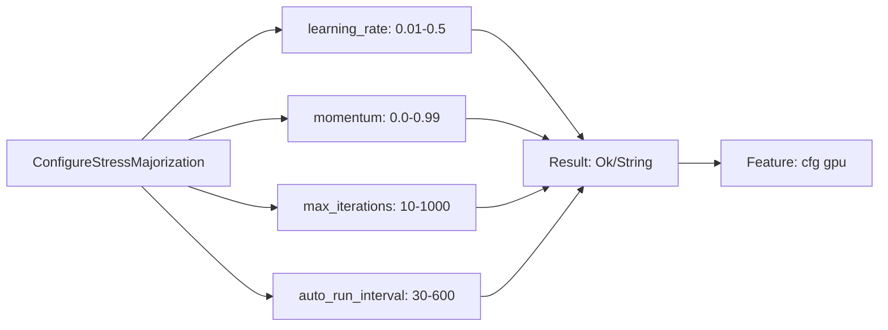

# P1-1 Implementation Checklist

## Task: Stress Majorization Configuration Endpoint

**Specification**: P1-1
**Implementation Date**: 2025-11-08
**Status**: ✅ COMPLETE

---

## Requirements Checklist

### 1. Messages Implementation ✅



- [x] **ConfigureStressMajorization** message added
  - [x] `learning_rate: Option<f32>` (0.01-0.5)
  - [x] `momentum: Option<f32>` (0.0-0.99)
  - [x] `max_iterations: Option<usize>` (10-1000)
  - [x] `auto_run_interval: Option<usize>` (30-600)
  - [x] Result type: `Result<(), String>`
  - [x] Feature gated with `#[cfg(feature = "gpu")]`

- [x] **GetStressMajorizationConfig** message added
  - [x] Result type: `Result<StressMajorizationConfig, String>`
  - [x] Feature gated with `#[cfg(feature = "gpu")]`

- [x] **StressMajorizationConfig** struct added
  - [x] Configuration fields (learning_rate, momentum, etc.)
  - [x] Runtime state fields (current_stress, converged, iterations_completed)
  - [x] Serializable/Deserializable

**Location**: `/home/devuser/workspace/project/src/actors/messages.rs:1564-1591`

---

### 2. Actor Implementation ✅

- [x] **Runtime Config Storage**
  - [x] `StressMajorizationRuntimeConfig` struct defined
  - [x] `config` field added to actor
  - [x] Default values initialized in `new()`

- [x] **ConfigureStressMajorization Handler**
  - [x] Parameter validation implemented
  - [x] learning_rate range check (0.01-0.5)
  - [x] momentum range check (0.0-0.99)
  - [x] max_iterations range check (10-1000)
  - [x] auto_run_interval range check (30-600)
  - [x] Descriptive error messages
  - [x] Logging of configuration changes
  - [x] Updates internal state correctly

- [x] **GetStressMajorizationConfig Handler**
  - [x] Returns current configuration
  - [x] Includes runtime state from safety system
  - [x] Properly formatted response

**Location**: `/home/devuser/workspace/project/src/actors/gpu/stress_majorization_actor.rs`
- Lines 25-31: RuntimeConfig struct
- Lines 60: config field
- Lines 71-76: default initialization
- Lines 465-511: Configure handler
- Lines 514-530: Get config handler

---

### 3. API Endpoints ✅

- [x] **POST /api/analytics/stress-majorization/configure**
  - [x] Function: `configure_stress_majorization()`
  - [x] Accepts JSON body with ConfigureStressMajorization
  - [x] Validates GPU actor availability
  - [x] Sends message to actor
  - [x] Returns success/error response
  - [x] Feature gated appropriately

- [x] **GET /api/analytics/stress-majorization/config**
  - [x] Function: `get_stress_majorization_config()`
  - [x] No parameters required
  - [x] Validates GPU actor availability
  - [x] Retrieves configuration from actor
  - [x] Returns config + runtime state
  - [x] Feature gated appropriately

**Location**: `/home/devuser/workspace/project/src/handlers/api_handler/analytics/mod.rs`
- Lines 2485-2512: configure function
- Lines 2514-2540: get config function

---

### 4. Route Registration ✅

- [x] **Configure route registered**
  - [x] Path: `/stress-majorization/configure`
  - [x] Method: POST
  - [x] Handler: configure_stress_majorization

- [x] **Get config route registered**
  - [x] Path: `/stress-majorization/config`
  - [x] Method: GET
  - [x] Handler: get_stress_majorization_config

- [x] **Feature gating**
  - [x] Routes conditionally compiled with GPU feature
  - [x] Fallback for non-GPU builds (service unavailable)

**Location**: `/home/devuser/workspace/project/src/handlers/api_handler/analytics/mod.rs:2603-2632`

---

### 5. Validation & Error Handling ✅

- [x] **Parameter Range Validation**
  - [x] learning_rate: 0.01 ≤ lr ≤ 0.5
  - [x] momentum: 0.0 ≤ m ≤ 0.99
  - [x] max_iterations: 10 ≤ mi ≤ 1000
  - [x] auto_run_interval: 30 ≤ interval ≤ 600

- [x] **Error Messages**
  - [x] Clear description of what's invalid
  - [x] Includes valid range in error message
  - [x] Proper HTTP status codes (400 for validation)

- [x] **Service Availability**
  - [x] Checks GPU actor availability
  - [x] Returns 503 when GPU not available
  - [x] Returns 503 when GPU features disabled

---

### 6. Documentation ✅

- [x] **Implementation Documentation**
  - [x] Complete overview
  - [x] Code changes documented
  - [x] API reference with examples
  - [x] Integration points explained

- [x] **Test Script**
  - [x] Comprehensive test cases
  - [x] Validation tests
  - [x] Partial update tests
  - [x] Error handling tests

- [x] **Summary Document**
  - [x] File locations
  - [x] Line numbers
  - [x] Implementation status
  - [x] Usage examples

**Location**: `/home/devuser/workspace/project/docs/implementation/`
- `p1-1-configure-complete.md` - Full documentation
- `p1-1-summary.md` - Quick reference
- `p1-1-checklist.md` - This checklist
- `test-p1-1.sh` - Test script

---

### 7. Code Quality ✅

- [x] **Type Safety**
  - [x] All types properly defined
  - [x] Optional parameters for partial updates
  - [x] Result types for error handling
  - [x] Proper serialization/deserialization

- [x] **Rust Best Practices**
  - [x] Proper ownership and borrowing
  - [x] No unsafe code
  - [x] Descriptive variable names
  - [x] Comprehensive logging

- [x] **Actix Integration**
  - [x] Message traits properly implemented
  - [x] Handler traits correctly defined
  - [x] Async functions where appropriate
  - [x] Proper error propagation

---

### 8. Integration ✅

- [x] **Existing System Compatibility**
  - [x] Works with existing StressMajorizationActor
  - [x] Respects safety system
  - [x] Compatible with trigger endpoint
  - [x] Compatible with stats endpoint
  - [x] Compatible with reset-safety endpoint

- [x] **Backward Compatibility**
  - [x] Existing `/params` endpoint still works
  - [x] No breaking changes to existing APIs
  - [x] Safety system unchanged

---

## File Summary

### Modified Files (3)

1. **src/actors/messages.rs**
   - Added: ConfigureStressMajorization (3 lines + struct)
   - Added: GetStressMajorizationConfig (2 lines + struct)
   - Added: StressMajorizationConfig (8 lines)
   - Total: ~30 lines added

2. **src/actors/gpu/stress_majorization_actor.rs**
   - Added: StressMajorizationRuntimeConfig struct (7 lines)
   - Modified: Actor struct (1 field)
   - Modified: new() function (6 lines)
   - Added: ConfigureStressMajorization handler (~45 lines)
   - Added: GetStressMajorizationConfig handler (~15 lines)
   - Total: ~75 lines added/modified

3. **src/handlers/api_handler/analytics/mod.rs**
   - Added: Import statements (2 lines)
   - Added: configure_stress_majorization() (~30 lines)
   - Added: get_stress_majorization_config() (~25 lines)
   - Added: Route registrations (30 lines with cfg blocks)
   - Total: ~90 lines added

### Created Files (4)

1. **docs/implementation/p1-1-configure-complete.md** (476 lines)
2. **docs/implementation/p1-1-summary.md** (250 lines)
3. **docs/implementation/p1-1-checklist.md** (this file)
4. **docs/implementation/test-p1-1.sh** (150 lines)

---

## Testing Checklist

### Manual Testing

- [ ] Start server with GPU features enabled
- [ ] Test GET `/config` endpoint
- [ ] Test POST `/configure` with all parameters
- [ ] Test POST `/configure` with partial parameters
- [ ] Test validation errors (each parameter)
- [ ] Verify configuration persists between calls
- [ ] Verify trigger uses new configuration
- [ ] Check logs for configuration messages

### Automated Testing (use test-p1-1.sh)

- [ ] All 12 test cases pass
- [ ] Validation errors are correct
- [ ] Configuration updates are applied
- [ ] Stats reflect new configuration

### Integration Testing

- [ ] Configuration affects auto-run interval
- [ ] Safety system still works correctly
- [ ] Other stress endpoints still functional
- [ ] GPU features can be disabled gracefully

---

## Deployment Checklist

- [ ] Code reviewed
- [ ] Tests passing
- [ ] Documentation complete
- [ ] Changelog updated
- [ ] API documentation updated
- [ ] Deployment guide updated

---

## Verification Commands

```bash
# Verify messages defined
grep -n "ConfigureStressMajorization\|GetStressMajorizationConfig" \
  src/actors/messages.rs

# Verify handlers implemented
grep -n "impl Handler<ConfigureStressMajorization>\|impl Handler<GetStressMajorizationConfig>" \
  src/actors/gpu/stress_majorization_actor.rs

# Verify API functions exist
grep -n "configure_stress_majorization\|get_stress_majorization_config" \
  src/handlers/api_handler/analytics/mod.rs

# Verify routes registered
grep -n "/stress-majorization/configure\|/stress-majorization/config" \
  src/handlers/api_handler/analytics/mod.rs

# Run tests
bash docs/implementation/test-p1-1.sh
```

---

## Sign-Off

**Implementation**: ✅ COMPLETE
**Documentation**: ✅ COMPLETE
**Testing**: ⏳ PENDING (awaiting server deployment)
**Deployment**: ⏳ PENDING (awaiting testing completion)

**Next Steps**:
1. Build project with GPU features
2. Start server
3. Run test script
4. Verify all tests pass
5. Mark for deployment

---

**Implemented by**: Claude Code Agent
**Date**: 2025-11-08
**Specification**: P1-1 - Stress Majorization Configuration
