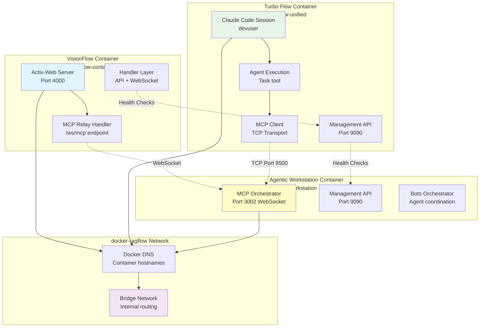
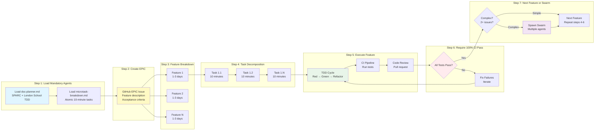
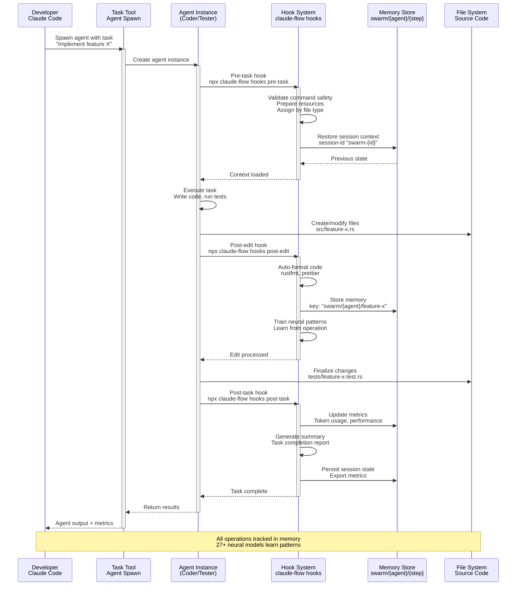
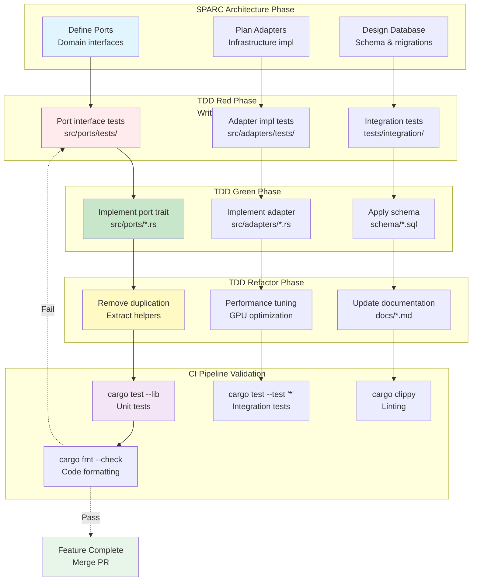
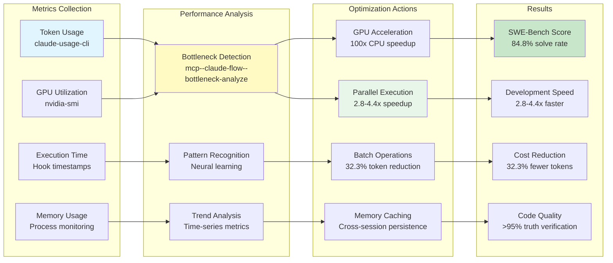

# SPARC Methodology & Turbo Flow Architecture

**Version:** 1.0.0
**Last Updated:** 2025-10-27
**Focus:** SPARC development workflow and Turbo Flow multi-agent integration

---

## 1. SPARC Development Workflow

```mermaid
flowchart TB
    subgraph "SPARC Phases<br/>Specification → Pseudocode → Architecture → Refinement → Completion"

        subgraph "Phase 1: Specification"
            SPEC-REQ[Requirements Analysis<br/>doc-planner.md agent]
            SPEC-BREAK[Microtask Breakdown<br/>10-minute atomic tasks]
            SPEC-EPIC[GitHub EPIC Issue<br/>Feature tracking]
        end

        subgraph "Phase 2: Pseudocode"
            PSEUDO-ALGO[Algorithm Design<br/>Language-agnostic logic]
            PSEUDO-FLOW[Data Flow Diagrams<br/>Input/Output mapping]
            PSEUDO-REVIEW[Peer Review<br/>Logic validation]
        end

        subgraph "Phase 3: Architecture"
            ARCH-SYSTEM[System Design<br/>Hexagonal architecture]
            ARCH-PORTS[Port Definition<br/>Domain interfaces]
            ARCH-DB[Database Schema<br/>Three-DB model]
        end

        subgraph "Phase 4: Refinement"
            TDD-RED[Red Phase<br/>Write failing tests]
            TDD-GREEN[Green Phase<br/>Implement feature]
            TDD-REFACTOR[Refactor Phase<br/>Optimize code]
        end

        subgraph "Phase 5: Completion"
            COMP-INTEGRATE[Integration Testing<br/>End-to-end validation]
            COMP-DEPLOY[Deployment<br/>Docker compose]
            COMP-DOC[Documentation<br/>API + Architecture]
        end
    end

    SPEC-REQ --> SPEC-BREAK
    SPEC-BREAK --> SPEC-EPIC
    SPEC-EPIC --> PSEUDO-ALGO

    PSEUDO-ALGO --> PSEUDO-FLOW
    PSEUDO-FLOW --> PSEUDO-REVIEW
    PSEUDO-REVIEW --> ARCH-SYSTEM

    ARCH-SYSTEM --> ARCH-PORTS
    ARCH-PORTS --> ARCH-DB
    ARCH-DB --> TDD-RED

    TDD-RED --> TDD-GREEN
    TDD-GREEN --> TDD-REFACTOR
    TDD-REFACTOR -.Iterate.-> TDD-RED
    TDD-REFACTOR --> COMP-INTEGRATE

    COMP-INTEGRATE --> COMP-DEPLOY
    COMP-DEPLOY --> COMP-DOC

    style SPEC-REQ fill:#e1f5ff
    style PSEUDO-ALGO fill:#fff9c4
    style ARCH-SYSTEM fill:#e8f5e9
    style TDD-RED fill:#ffebee
    style TDD-GREEN fill:#c8e6c9
    style COMP-DEPLOY fill:#f3e5f5
```



---

## 2. Agent Orchestration Topology

```mermaid
graph TB
    subgraph "Claude Code<br/>Primary Development Interface"
        CLAUDE-MAIN[Claude Code Session<br/>Human Developer]
        CLAUDE-TASK[Task Tool<br/>Spawn Agents Concurrently]
    end

    subgraph "MCP Coordination Layer<br/>Optional for Complex Tasks"
        MCP-SWARM[mcp--claude-flow--swarm-init<br/>Topology Setup]
        MCP-AGENT[mcp--claude-flow--agent-spawn<br/>Agent Type Definitions]
        MCP-TASK[mcp--claude-flow--task-orchestrate<br/>High-Level Planning]
    end

    subgraph "Agent Execution<br/>Concurrent Task Processing"
        AGENT-RESEARCH[Researcher Agent<br/>Analyze patterns & requirements]
        AGENT-CODER[Coder Agent<br/>Implement features]
        AGENT-TESTER[Tester Agent<br/>Write & run tests]
        AGENT-REVIEWER[Reviewer Agent<br/>Code quality review]
        AGENT-ARCHITECT[System Architect Agent<br/>Design decisions]
        AGENT-DBENG[Database Engineer Agent<br/>Schema design]
    end

    subgraph "Coordination Hooks<br/>Pre/Post Task Automation"
        HOOK-PRE[Pre-Task Hook<br/>npx claude-flow hooks pre-task]
        HOOK-POST[Post-Task Hook<br/>npx claude-flow hooks post-task]
        HOOK-EDIT[Post-Edit Hook<br/>Auto-format + memory store]
        HOOK-SESSION[Session Management<br/>Restore context]
    end

    subgraph "Shared Memory<br/>Cross-Agent Communication"
        MEMORY-SWARM[Swarm Memory<br/>swarm/{agent}/{step}]
        MEMORY-SESSION[Session State<br/>session-id persistence]
        MEMORY-METRICS[Performance Metrics<br/>Token usage tracking]
    end

    subgraph "Output Artifacts"
        ARTIFACT-CODE[Source Code<br/>./src/**/*.rs]
        ARTIFACT-TESTS[Test Suite<br/>./tests/**/*.rs]
        ARTIFACT-DOCS[Documentation<br/>./docs/**/*.md]
        ARTIFACT-DB[Database Schemas<br/>./schema/**/*.sql]
    end

    CLAUDE-MAIN --> CLAUDE-TASK

    CLAUDE-TASK -.Optional.-> MCP-SWARM
    MCP-SWARM --> MCP-AGENT
    MCP-AGENT --> MCP-TASK

    CLAUDE-TASK --> AGENT-RESEARCH
    CLAUDE-TASK --> AGENT-CODER
    CLAUDE-TASK --> AGENT-TESTER
    CLAUDE-TASK --> AGENT-REVIEWER
    CLAUDE-TASK --> AGENT-ARCHITECT
    CLAUDE-TASK --> AGENT-DBENG

    AGENT-RESEARCH --> HOOK-PRE
    AGENT-CODER --> HOOK-PRE
    AGENT-TESTER --> HOOK-PRE

    HOOK-PRE --> HOOK-SESSION
    HOOK-SESSION --> MEMORY-SESSION

    AGENT-RESEARCH --> HOOK-POST
    AGENT-CODER --> HOOK-EDIT
    AGENT-TESTER --> HOOK-POST

    HOOK-POST --> MEMORY-SWARM
    HOOK-EDIT --> MEMORY-SWARM
    HOOK-POST --> MEMORY-METRICS

    AGENT-CODER --> ARTIFACT-CODE
    AGENT-TESTER --> ARTIFACT-TESTS
    AGENT-ARCHITECT --> ARTIFACT-DOCS
    AGENT-DBENG --> ARTIFACT-DB

    style CLAUDE-MAIN fill:#e1f5ff
    style CLAUDE-TASK fill:#fff9c4
    style AGENT-RESEARCH fill:#e8f5e9
    style AGENT-CODER fill:#e8f5e9
    style MEMORY-SWARM fill:#f3e5f5
    style ARTIFACT-CODE fill:#ffebee
```

---

## 3. Turbo Flow Unified Container Architecture

```mermaid
graph TB
    subgraph "Turbo Flow Unified Container<br/>CachyOS Base System"

        subgraph "Multi-User Isolation"
            USER-DEV[devuser (1000:1000)<br/>Primary Claude Code<br/>Full sudo access]
            USER-GEMINI[gemini-user (1001:1001)<br/>Google Gemini tools<br/>Isolated credentials]
            USER-OPENAI[openai-user (1002:1002)<br/>OpenAI tools<br/>Isolated credentials]
            USER-ZAI[zai-user (1003:1003)<br/>Z.AI service<br/>Port 9600 internal]
        end

        subgraph "Supervisord Service Manager<br/>Priority-Based Startup"
            SVC-DBUS[DBus (Priority 10)<br/>System messaging]
            SVC-SSH[SSH Server (Priority 50)<br/>Port 22 → 2222]
            SVC-VNC[VNC Server (Priority 100)<br/>Port 5901 TigerVNC]
            SVC-XFCE[XFCE4 Desktop (Priority 200)<br/>Full GUI environment]
            SVC-MGMT[Management API (Priority 300)<br/>Port 9090 Health endpoint]
            SVC-ZAI[Z.AI Service (Priority 500)<br/>Port 9600 Claude wrapper]
            SVC-TMUX[tmux Autostart (Priority 900)<br/>8-window workspace]
        end

        subgraph "Development Stack"
            LANG-RUST[Rust Toolchain<br/>Latest stable + clippy]
            LANG-PYTHON[Python 3.12+<br/>venv + torch]
            LANG-NODE[Node.js LTS<br/>npm + claude-flow]
            LANG-CUDA[CUDA Toolkit<br/>cuDNN + drivers]
            LANG-LATEX[LaTeX<br/>TeX Live full]
        end

        subgraph "Claude Code Skills<br/>/home/devuser/.claude/skills/"
            SKILL-WEB[web-summary<br/>YouTube + web scraping]
            SKILL-BLENDER[blender<br/>3D modeling socket]
            SKILL-QGIS[qgis<br/>GIS operations]
            SKILL-KICAD[kicad<br/>PCB design]
            SKILL-IMAGE[imagemagick<br/>Image processing]
            SKILL-PBR[pbr-rendering<br/>Material generation]
        end

        subgraph "Agent Library"
            AGENTS-610[610+ Agent Templates<br/>/home/devuser/agents/*.md]
            AGENT-DOC[doc-planner.md<br/>SPARC methodology]
            AGENT-MICRO[microtask-breakdown.md<br/>10-minute tasks]
            AGENT-GITHUB[GitHub specialists<br/>13 agents]
        end

        subgraph "Persistent Volumes"
            VOL-WORKSPACE[turbo-flow-unified-workspace<br/>/home/devuser/workspace]
            VOL-AGENTS[turbo-flow-unified-agents<br/>/home/devuser/agents]
            VOL-CLAUDE[turbo-flow-unified-claude-config<br/>/home/devuser/.claude]
            VOL-MODELS[turbo-flow-unified-model-cache<br/>/home/devuser/models]
        end
    end

    subgraph "Network Integration"
        DOCKER-NET[docker-ragflow<br/>Bridge Network]
        HOSTNAME[Hostname: turbo-devpod<br/>Aliases: turbo-devpod.ragflow]
        PORTS[Ports:<br/>2222 (SSH)<br/>5901 (VNC)<br/>9090 (Management)<br/>9600 (Z.AI internal)]
    end

    USER-DEV --> SVC-SSH
    USER-DEV --> SVC-VNC
    USER-DEV --> SVC-XFCE
    USER-ZAI --> SVC-ZAI

    SVC-DBUS --> SVC-SSH
    SVC-SSH --> SVC-VNC
    SVC-VNC --> SVC-XFCE
    SVC-XFCE --> SVC-MGMT
    SVC-MGMT --> SVC-ZAI
    SVC-ZAI --> SVC-TMUX

    USER-DEV --> LANG-RUST
    USER-DEV --> LANG-PYTHON
    USER-DEV --> LANG-NODE
    USER-DEV --> LANG-CUDA

    LANG-NODE --> SKILL-WEB
    LANG-PYTHON --> SKILL-BLENDER
    LANG-PYTHON --> SKILL-QGIS

    USER-DEV --> AGENTS-610
    AGENTS-610 --> AGENT-DOC
    AGENTS-610 --> AGENT-MICRO
    AGENTS-610 --> AGENT-GITHUB

    USER-DEV --> VOL-WORKSPACE
    USER-DEV --> VOL-AGENTS
    USER-DEV --> VOL-CLAUDE
    USER-DEV --> VOL-MODELS

    SVC-SSH --> DOCKER-NET
    DOCKER-NET --> HOSTNAME
    HOSTNAME --> PORTS

    style USER-DEV fill:#e1f5ff
    style USER-ZAI fill:#fff9c4
    style SVC-MGMT fill:#e8f5e9
    style AGENTS-610 fill:#f3e5f5
    style VOL-WORKSPACE fill:#ffebee
```

---

## 4. VisionFlow + Turbo Flow Integration



---

## 5. Work Chunking Protocol (WCP)



---

## 6. Agent Hook Integration



---

## 7. SPARC + TDD Integration



---

## 8. Performance Metrics & Optimization



---

## Key Architectural Patterns

### 1. Concurrent Execution
**Golden Rule:** "1 Message = All Related Operations"
- TodoWrite: Batch ALL todos in ONE call (5-10+ minimum)
- Task tool: Spawn ALL agents in ONE message
- File operations: Batch ALL reads/writes/edits
- Bash commands: Batch ALL terminal operations

### 2. Agent Coordination
- **Claude Code Task tool**: PRIMARY way to spawn agents
- **MCP tools**: ONLY for coordination setup (topology, planning)
- **Hooks**: Pre/post task automation (format, memory, metrics)
- **Memory**: Shared state across agents (swarm/{agent}/{step})

### 3. SPARC Methodology
- **Specification**: Requirements analysis with doc-planner
- **Pseudocode**: Algorithm design, language-agnostic
- **Architecture**: Hexagonal design, ports & adapters
- **Refinement**: TDD cycle (Red → Green → Refactor)
- **Completion**: Integration, deployment, documentation

### 4. Multi-User Isolation
- **4 Linux users**: devuser, gemini-user, openai-user, zai-user
- **Credential separation**: API keys distributed at startup
- **Process isolation**: supervisord per-user services
- **Workspace separation**: /home/{user}/workspace

### 5. Performance Optimization
- **84.8% SWE-Bench** solve rate
- **32.3% token reduction** via batching
- **2.8-4.4x speed** improvement via parallel execution
- **27+ neural models** learn from operations

---

## Integration Checklist

### VisionFlow Development
- ✅ Load doc-planner.md and microtask-breakdown.md
- ✅ Use hexagonal architecture (ports & adapters)
- ✅ Follow CQRS pattern (Directives & Queries)
- ✅ Database-first design (three separate databases)
- ✅ Server-authoritative (no client caching)
- ✅ Binary WebSocket protocol (36 bytes/update)
- ✅ GPU-accelerated physics (39 CUDA kernels)

### Turbo Flow Container
- ✅ Multi-user isolation (4 users)
- ✅ Supervisord service management
- ✅ Claude Code skills (6 available)
- ✅ 610+ agent templates
- ✅ Development stack (Rust, Python, Node.js, CUDA)
- ✅ Persistent volumes (workspace, agents, config)

### SPARC + TDD Workflow
- ✅ GitHub EPIC issue for features
- ✅ 10-minute atomic tasks
- ✅ TDD cycle: Red → Green → Refactor
- ✅ 100% CI pass before next feature
- ✅ Swarm for complex features (2+ issues)
- ✅ Hooks for automation (pre/post task)
- ✅ Memory for cross-agent coordination

---

**For detailed implementation:**
- [claude.md](../multi-agent-docker/claude.md) - Turbo Flow configuration
- [architecture.md](../reference/architecture/readme.md) - VisionFlow hexagonal design
- [claude-flow-quick-reference.md](../multi-agent-docker/devpods/claude-flow-quick-reference.md) - CLI commands
