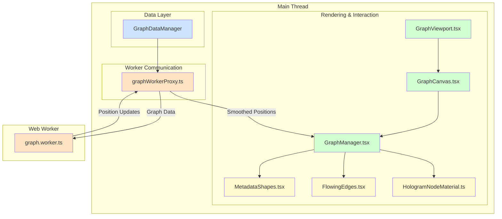

# Graph System

This document provides comprehensive coverage of VisionFlow's graph rendering and visualisation system. Built on React Three Fiber and Three.js, the system is engineered for high performance, supporting real-time physics, advanced visual effects through custom shaders, and a rich, data-driven approach to visualisation.

## System Architecture

The graph system's architecture is designed to separate concerns, offloading heavy computation from the main thread to ensure a fluid user experience. Data flows from the manager to the rendering components, with physics calculations handled in a dedicated web worker.



**Architectural Flow:**

1.  **Data Management**: `GraphDataManager` fetches and manages the raw graph data.
2.  **Worker Communication**: It passes this data to the `graphWorkerProxy`, which acts as the main thread's interface to the web worker.
3.  **Physics Simulation**: The `graph.worker.ts` receives the data and is responsible for all physics calculations. It continuously calculates node positions, either by smoothing incoming server data or by running its own fallback simulation.
4.  **Position Updates**: The worker sends a stream of updated node positions back to the `graphWorkerProxy`.
5.  **Rendering**: `GraphManager` receives the smoothed positions from the proxy. It uses this data to update the `InstancedMesh` instances for nodes and the geometry for edges.
6.  **Visual Metaphors**: `MetadataShapes.tsx` is used by `GraphManager` to determine the visual representation (geometry, scale, colour) of each node based on its metadata, before rendering them as a single `InstancedMesh` per geometry type.
7.  **Custom Shaders**: The `HologramNodeMaterial.ts` provides the custom GLSL shader used to render the nodes with advanced effects like fresnel glow, scanlines, and pulsing animations.

## Core Components

### Rendering Entrypoint (`GraphViewport.tsx` & `GraphCanvas.tsx`)

-   **`GraphViewport.tsx`**: The top-level component that sets up the R3F `Canvas`, camera (`CameraController`), lighting, and post-processing effects like `AtmosphericGlow`. It is responsible for fetching the initial graph data via `graphDataManager`.
-   **`GraphCanvas.tsx`**: Sits within the viewport and orchestrates the scene itself. It renders the core `GraphManager`, environmental effects (`WorldClassHologram`), and debug helpers.

### Rendering Orchestrator (`GraphManager.tsx`)

This is the central component responsible for rendering the graph. It is highly optimised for performance with large datasets.

-   **Instanced Rendering**: Nodes are not rendered as individual meshes. Instead, `GraphManager` uses `THREE.InstancedMesh` for nodes, batching all of them into a single draw call per geometry type. This is the key to rendering thousands of nodes efficiently.
-   **Physics Integration**: It receives a `Float32Array` of node positions from `graphWorkerProxy` on every frame and uses it to update the instance matrices of the `InstancedMesh`.
-   **Metadata-Driven Visuals**: It uses the `MetadataShapes` component to translate node metadata into visual properties, enabling a rich, data-driven visualisation.
-   **Custom Shaders**: It applies the `HologramNodeMaterial` to the instanced mesh, giving all nodes advanced visual effects.
-   **Interaction**: It contains the event handlers (`handlePointerDown`, `handlePointerMove`, `handlePointerUp`) for node selection and dragging.

```tsx
// client/src/features/graph/components/GraphManager.tsx

// Simplified rendering logic
return (
  <>
    {enableMetadataShape ? (
      <MetadataShapes
        nodes={graphData.nodes}
        nodePositions={nodePositionsRef.current}
        settings={settings}
        ssspResult={normalizedSSSPResult}
      />
    ) : (
      <instancedMesh
        ref={meshRef}
        args={[undefined, undefined, graphData.nodes.length]}
        frustumCulled={false}
      >
        <sphereGeometry args={[0.5, 32, 32]} />
        <primitive object={materialRef.current} attach="material" />
      </instancedMesh>
    )}

    {edgePoints.length > 0 && (
      <FlowingEdges
        points={edgePoints}
        settings={edgeSettings}
      />
    )}
  </>
)
```

### Physics Simulation (Web Worker)

To prevent UI blocking, all physics calculations are performed in a separate thread using a Web Worker.

#### `graph.worker.ts`

This worker is the physics engine of the graph system.

-   **Off-Main-Thread Calculation**: It runs a continuous simulation loop (`tick` method) to calculate node positions.
-   **Dual Physics Model**:
    1.  **Server-Authoritative**: When receiving binary position updates from the server, the worker's primary role is to smoothly interpolate the `currentPositions` towards the `targetPositions` sent by the server. This ensures fluid motion on the client even if server updates are not perfectly smooth.
    2.  **Client-Side Fallback**: If no server data is available, it can run its own simple spring-based physics simulation to provide a basic layout.
-   **State Management**: It maintains the state of all node positions, velocities, and user interactions (pinned nodes).

```typescript
// client/src/features/graph/workers/graph.worker.ts

// Simplified tick method for server-driven physics
async tick(deltaTime: number): Promise<Float32Array> {
  if (!this.currentPositions || !this.targetPositions) return new Float32Array(0);

  const dt = Math.min(deltaTime, 0.016); // Clamp delta time
  
  if (this.useServerPhysics) {
    const lerpFactor = 1.0 - Math.exp(-8.0 * dt); // Smooth interpolation factor
    
    for (let i = 0; i < this.graphData.nodes.length; i++) {
      const i3 = i * 3;
      if (this.pinnedNodeIds.has(nodeId)) continue; // Skip user-dragged nodes

      // Interpolate current position towards the target position from the server
      this.currentPositions[i3] += (this.targetPositions[i3] - this.currentPositions[i3]) * lerpFactor;
      this.currentPositions[i3 + 1] += (this.targetPositions[i3 + 1] - this.currentPositions[i3 + 1]) * lerpFactor;
      this.currentPositions[i3 + 2] += (this.targetPositions[i3 + 2] - this.currentPositions[i3 + 2]) * lerpFactor;
    }
  }
  // ... else, run local physics simulation

  return this.currentPositions;
}
```

#### `graphWorkerProxy.ts`

This acts as a singleton bridge between the main thread and the physics worker. It uses `Comlink` to make communication seamless. It exposes a simple async API for starting the worker, sending it data, and requesting position updates.

### Visualisation & Shaders

#### `MetadataShapes.tsx`

This component introduces the concept of **Visual Metaphors**. Instead of rendering all nodes identically, it maps individual node metadata to specific visual attributes.

-   **Geometry**: `hyperlinkCount` can determine if a node is a sphere (few connections) or a more complex icosahedron (many connections).
-   **Scale**: A combination of `fileSize` and connectivity determines the node's size.
-   **Colour**: The `lastModified` date can be used to apply a "heat" map, making recently edited nodes glow more warmly.
-   **Emissive Glow**: AI-processed nodes with a `perplexityLink` can have a distinct emissive gold tint.

This system creates a much more insightful and intuitive visualisation, allowing users to understand the data's underlying properties at a glance.

```tsx
// client/src/features/graph/components/MetadataShapes.tsx

// Example of mapping metadata to visuals
const getVisualsForNode = (node: GraphNode) => {
  // ...
  // METAPHOR 1: Geometry from Connectivity (hyperlinkCount)
  const hyperlinkCount = parseInt(metadata.hyperlinkCount || '0', 10);
  if (hyperlinkCount > 7) {
    visuals.geometryType = 'icosahedron';
  } else if (hyperlinkCount > 3) {
    visuals.geometryType = 'octahedron';
  } // ...

  // METAPHOR 3: colour modulation from Recency (lastModified)
  const ageInDays = (Date.now() - new Date(metadata.lastModified).getTime()) / (1000 * 60 * 60 * 24);
  const heat = Math.max(0, 1 - ageInDays / 90); // "Heat" for files modified in last 90 days
  visuals.colour.lerp(new THREE.colour("#FFD700"), heat * 0.5); // Lerp towards yellow for recent files
  // ...
  return visuals;
};
```

#### `HologramNodeMaterial.ts`

This is a custom `THREE.ShaderMaterial` that provides the signature look for the nodes. It is written in GLSL and includes several advanced effects:

-   **Fresnel Rim Lighting**: Creates a glow effect around the edges of the nodes.
-   **Scanlines**: Animated scanlines run across the surface of the nodes, giving them a futuristic, holographic feel.
-   **Vertex Displacement**: A subtle pulsing effect is applied to the node's vertices for a more organic feel.
-   **Instancing Support**: The shader is fully compatible with `InstancedMesh`, using `instancecolour` to apply unique colours to each node within the same draw call.