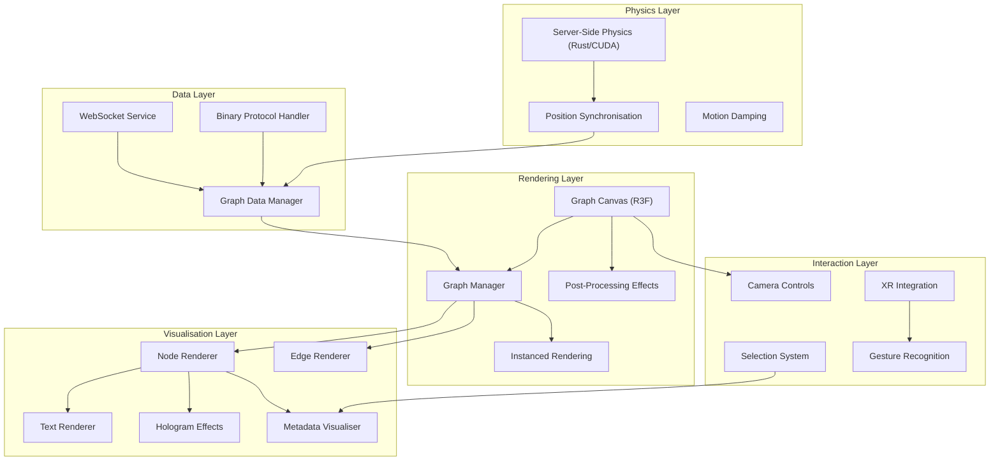

# Graph System

This document provides comprehensive coverage of VisionFlow's graph rendering and visualisation system, built on React Three Fiber and Three.js. The system supports dual-graph visualisation, real-time physics, and advanced visual effects.

## System Architecture

The graph system operates through several interconnected layers that handle data management, physics simulation, rendering, and user interaction:



## Core Components

### Graph Canvas (`client/src/features/graph/components/GraphCanvas.tsx`)

The Graph Canvas serves as the main entry point for the 3D scene, establishing the React Three Fiber context and coordinating all rendering components.

#### Key Responsibilities
- **WebGL Renderer Initialisation**: Configures Three.js renderer with optimal settings
- **Scene Setup**: Establishes lighting, background, and global rendering context
- **Innovation Manager Integration**: Coordinates advanced features and optimisations
- **XR Integration**: Seamlessly supports WebXR sessions
- **Performance Monitoring**: Integrates debug tools and performance overlays

#### Implementation
```tsx
const GraphCanvas: React.FC = () => {
  const settings = useSettingsStore(state => state.settings);
  const [graphData, setGraphData] = useState<GraphData>({ nodes: [], edges: [] });
  
  // Subscribe to graph data changes
  useEffect(() => {
    const unsubscribe = graphDataManager.onGraphDataChange(setGraphData);
    return unsubscribe;
  }, []);
  
  return (
    <Canvas
      ref={canvasRef}
      camera={{ 
        position: [0, 0, 50], 
        fov: 75,
        near: 0.1,
        far: 2000 
      }}
      gl={{ 
        antialias: settings.visualisation.rendering.enableAntialiasing,
        powerPreference: 'high-performance',
        alpha: true,
        stencil: false,
        depth: true
      }}
      dpr={Math.min(window.devicePixelRatio, 2)}
    >
      <SceneSetup />
      <GraphManager graphData={graphData} />
      <XRController />
      <BotsVisualization />
      <PostProcessingEffects />
      
      {settings.system.debug.enablePerformanceDebug && <Stats />}
    </Canvas>
  );
};
```

### Graph Manager (`client/src/features/graph/components/GraphManager.tsx`)

The Graph Manager orchestrates the rendering of nodes and edges within the 3D scene, handling instanced rendering for optimal performance.

#### Core Features
- **Dual Graph Support**: Simultaneous rendering of multiple graph types
- **Instanced Rendering**: Efficient batch rendering of thousands of objects
- **Dynamic Updates**: Real-time position updates from physics simulation
- **Visual Themes**: Per-graph colour schemes and styling
- **LOD System**: Level-of-detail based on camera distance

#### Multi-Graph Architecture
```tsx
interface GraphManagerProps {
  graphData: {
    logseq: { nodes: Node[], edges: Edge[] };
    visionflow: { nodes: Node[], edges: Edge[] };
  };
}

const GraphManager: React.FC<GraphManagerProps> = ({ graphData }) => {
  const logseqSettings = useSettingsStore(s => 
    s.settings.visualisation.graphs.logseq
  );
  const visionflowSettings = useSettingsStore(s => 
    s.settings.visualisation.graphs.visionflow
  );
  
  return (
    <group name="graph-manager">
      {/* Logseq Graph - Blue Theme */}
      <group name="logseq-graph" position={[0, 0, 0]}>
        <NodeInstances 
          nodes={graphData.logseq.nodes}
          settings={logseqSettings.nodes}
          baseColor="#4B5EFF"
        />
        <EdgeInstances 
          edges={graphData.logseq.edges}
          settings={logseqSettings.edges}
          baseColor="#6B73FF"
        />
      </group>
      
      {/* VisionFlow Graph - Green Theme */}
      <group name="visionflow-graph" position={[0, 0, 0]}>
        <NodeInstances 
          nodes={graphData.visionflow.nodes}
          settings={visionflowSettings.nodes}
          baseColor="#10B981"
        />
        <EdgeInstances 
          edges={graphData.visionflow.edges}
          settings={visionflowSettings.edges}
          baseColor="#34D399"
        />
      </group>
    </group>
  );
};
```

### Node Rendering System

#### Instanced Node Rendering
```tsx
const NodeInstances: React.FC<{
  nodes: Node[];
  settings: NodeSettings;
  baseColor: string;
}> = ({ nodes, settings, baseColor }) => {
  const instancedMeshRef = useRef<THREE.InstancedMesh>(null);
  const materialRef = useRef<THREE.MeshStandardMaterial>(null);
  
  // Update instance matrices for position/scale
  useFrame(() => {
    if (!instancedMeshRef.current) return;
    
    const tempMatrix = new THREE.Matrix4();
    const tempColor = new THREE.Color();
    
    nodes.forEach((node, index) => {
      // Position and scale
      tempMatrix.makeScale(
        node.size * settings.nodeSize,
        node.size * settings.nodeSize,
        node.size * settings.nodeSize
      );
      tempMatrix.setPosition(node.position.x, node.position.y, node.position.z);
      
      instancedMeshRef.current!.setMatrixAt(index, tempMatrix);
      
      // Color variation based on metadata
      const color = node.metadata?.type === 'central' 
        ? new THREE.Color(baseColor).multiplyScalar(1.2)
        : new THREE.Color(baseColor);
      
      instancedMeshRef.current!.setColorAt(index, color);
    });
    
    instancedMeshRef.current.instanceMatrix.needsUpdate = true;
    if (instancedMeshRef.current.instanceColor) {
      instancedMeshRef.current.instanceColor.needsUpdate = true;
    }
  });
  
  return (
    <instancedMesh
      ref={instancedMeshRef}
      args={[undefined, undefined, nodes.length]}
      castShadow
      receiveShadow
    >
      <sphereGeometry args={[1, 16, 12]} />
      <meshStandardMaterial
        ref={materialRef}
        color={baseColor}
        metalness={settings.metalness}
        roughness={settings.roughness}
        transparent={settings.opacity < 1}
        opacity={settings.opacity}
      />
    </instancedMesh>
  );
};
```

#### Advanced Node Features
```tsx
// Hologram effects for special nodes
const HologramNodes: React.FC<{ nodes: Node[] }> = ({ nodes }) => {
  const hologramSettings = useSettingsStore(s => 
    s.settings.visualisation.hologram
  );
  
  const specialNodes = nodes.filter(node => node.metadata?.isSpecial);
  
  return (
    <group name="hologram-nodes">
      {specialNodes.map(node => (
        <group key={node.id} position={[node.position.x, node.position.y, node.position.z]}>
          <HologramRing 
            radius={node.size * 1.5}
            rotationSpeed={hologramSettings.ringRotationSpeed}
            color={hologramSettings.ringColor}
          />
          <HologramSphere
            radius={node.size * 1.2}
            segments={hologramSettings.sphereSegments}
            color={hologramSettings.sphereColor}
          />
        </group>
      ))}
    </group>
  );
};
```

### Edge Rendering System

#### Dynamic Edge Generation
```tsx
const EdgeInstances: React.FC<{
  edges: Edge[];
  settings: EdgeSettings;
  baseColor: string;
}> = ({ edges, settings, baseColor }) => {
  const edgeGeometries = useMemo(() => {
    return edges.map(edge => {
      const start = new THREE.Vector3(
        edge.source.position.x,
        edge.source.position.y,
        edge.source.position.z
      );
      const end = new THREE.Vector3(
        edge.target.position.x,
        edge.target.position.y,
        edge.target.position.z
      );
      
      if (settings.enableCurvedEdges) {
        // Create curved edge using Catmull-Rom curve
        const midPoint = start.clone().lerp(end, 0.5);
        midPoint.y += edge.curvature || 0;
        
        const curve = new THREE.CatmullRomCurve3([start, midPoint, end]);
        return new THREE.TubeGeometry(curve, 8, settings.baseWidth * 0.1, 6);
      } else {
        // Straight line edge
        const geometry = new THREE.CylinderGeometry(
          settings.baseWidth * 0.1,
          settings.baseWidth * 0.1,
          start.distanceTo(end)
        );
        
        // Orient cylinder between nodes
        const direction = end.clone().sub(start);
        const orientation = new THREE.Matrix4();
        orientation.lookAt(start, end, new THREE.Object3D().up);
        orientation.multiply(new THREE.Matrix4().makeRotationX(Math.PI / 2));
        geometry.applyMatrix4(orientation);
        
        return geometry;
      }
    });
  }, [edges, settings.enableCurvedEdges, settings.baseWidth]);
  
  return (
    <group name="edges">
      {edges.map((edge, index) => (
        <mesh key={edge.id} geometry={edgeGeometries[index]}>
          <meshBasicMaterial
            color={settings.useGradient ? edge.gradientColor : baseColor}
            transparent={settings.opacity < 1}
            opacity={settings.opacity}
          />
        </mesh>
      ))}
    </group>
  );
};
```

#### Flow Effects
```tsx
const FlowingEdges: React.FC<{ edges: Edge[] }> = ({ edges }) => {
  const settings = useSettingsStore(s => s.settings.visualisation.edges);
  
  return (
    <group name="flowing-edges">
      {edges.map(edge => (
        <FlowEffect
          key={edge.id}
          startPosition={edge.source.position}
          endPosition={edge.target.position}
          speed={settings.flowSpeed}
          particleCount={settings.flowParticleCount}
          color={settings.flowColor}
        />
      ))}
    </group>
  );
};

const FlowEffect: React.FC<{
  startPosition: Vector3;
  endPosition: Vector3;
  speed: number;
  particleCount: number;
  color: string;
}> = ({ startPosition, endPosition, speed, particleCount, color }) => {
  const particlesRef = useRef<THREE.Points>(null);
  
  useFrame((state) => {
    if (!particlesRef.current) return;
    
    const time = state.clock.elapsedTime;
    const positions = particlesRef.current.geometry.attributes.position;
    
    for (let i = 0; i < particleCount; i++) {
      const progress = ((time * speed + i / particleCount) % 1);
      const position = new THREE.Vector3().lerpVectors(
        new THREE.Vector3(...startPosition),
        new THREE.Vector3(...endPosition),
        progress
      );
      
      positions.setXYZ(i, position.x, position.y, position.z);
    }
    
    positions.needsUpdate = true;
  });
  
  return (
    <points ref={particlesRef}>
      <bufferGeometry>
        <bufferAttribute
          attach="attributes-position"
          count={particleCount}
          array={new Float32Array(particleCount * 3)}
          itemSize={3}
        />
      </bufferGeometry>
      <pointsMaterial
        size={0.1}
        color={color}
        transparent
        opacity={0.8}
      />
    </points>
  );
};
```

### Text Rendering System

#### SDF Text Rendering
```tsx
// client/src/features/visualisation/renderers/TextRenderer.tsx
const TextRenderer: React.FC<{
  nodes: Node[];
  settings: LabelSettings;
}> = ({ nodes, settings }) => {
  const font = useFont('/fonts/roboto-sdf.fnt');
  
  return (
    <group name="text-labels">
      {nodes.map(node => (
        <Text
          key={`${node.id}-label`}
          position={[
            node.position.x,
            node.position.y + node.size + 0.5,
            node.position.z
          ]}
          fontSize={settings.fontSize}
          color={settings.color}
          anchorX="center"
          anchorY="middle"
          font={font}
          maxWidth={settings.maxWidth}
          overflowWrap="break-word"
          textAlign="center"
        >
          {node.label || node.title}
        </Text>
      ))}
    </group>
  );
};
```

### Physics Integration

#### Real-time Position Updates
```tsx
// Binary protocol integration for 60fps updates
const usePhysicsSync = (graphDataManager: GraphDataManager) => {
  const [positions, setPositions] = useState<Map<number, Vector3>>(new Map());
  
  useEffect(() => {
    const unsubscribe = graphDataManager.onPositionUpdate((updates) => {
      const newPositions = new Map(positions);
      
      updates.forEach(({ nodeId, position, velocity }) => {
        // Apply smoothing for 60fps interpolation
        const currentPos = newPositions.get(nodeId) || position;
        const smoothedPos = {
          x: currentPos.x + (position.x - currentPos.x) * 0.1,
          y: currentPos.y + (position.y - currentPos.y) * 0.1,
          z: currentPos.z + (position.z - currentPos.z) * 0.1
        };
        
        newPositions.set(nodeId, smoothedPos);
      });
      
      setPositions(newPositions);
    });
    
    return unsubscribe;
  }, [graphDataManager]);
  
  return positions;
};
```

#### Physics Configuration
```typescript
interface PhysicsSettings {
  enabled: boolean;
  springStrength: number;        // Force between connected nodes
  repulsionStrength: number;     // Force between unconnected nodes
  dampingFactor: number;         // Motion damping (0-1)
  centralGravity: number;        // Attraction to centre
  collisionRadius: number;       // Node collision detection
  iterations: number;            // Physics simulation quality
  timeStep: number;              // Simulation step size
  maxVelocity: number;          // Speed limiting
  boundaryConstraints: {
    enabled: boolean;
    size: number;
    strength: number;
  };
}

// Server-side physics simulation integration
const updatePhysicsSettings = (settings: PhysicsSettings) => {
  const wsService = WebSocketService.getInstance();
  
  if (wsService.isReady()) {
    wsService.sendMessage({
      type: 'physics_update',
      settings: normalizePhysicsForServer(settings)
    });
  }
};
```

### Post-Processing Effects

#### Bloom and Visual Enhancement
```tsx
// client/src/features/graph/components/PostProcessingEffects.tsx
import { EffectComposer, Bloom, SSAO, Noise } from '@react-three/postprocessing';

const PostProcessingEffects: React.FC = () => {
  const bloomSettings = useSettingsStore(s => s.settings.visualisation.bloom);
  const renderingSettings = useSettingsStore(s => s.settings.visualisation.rendering);
  
  if (!renderingSettings.enablePostProcessing) return null;
  
  return (
    <EffectComposer>
      {bloomSettings.enabled && (
        <Bloom
          intensity={bloomSettings.intensity}
          luminanceThreshold={bloomSettings.threshold}
          luminanceSmoothing={bloomSettings.smoothing}
          kernelSize={bloomSettings.kernelSize}
        />
      )}
      
      {renderingSettings.enableSSAO && (
        <SSAO
          intensity={0.1}
          radius={0.1}
          rings={4}
          samples={16}
        />
      )}
      
      {renderingSettings.enableNoise && (
        <Noise opacity={0.02} />
      )}
    </EffectComposer>
  );
};
```

### Selection and Interaction

#### Node Selection System
```tsx
const useNodeSelection = () => {
  const [selectedNodes, setSelectedNodes] = useState<Set<string>>(new Set());
  const [hoveredNode, setHoveredNode] = useState<string | null>(null);
  
  const selectNode = useCallback((nodeId: string, multi = false) => {
    setSelectedNodes(prev => {
      const newSelection = new Set(multi ? prev : []);
      if (newSelection.has(nodeId)) {
        newSelection.delete(nodeId);
      } else {
        newSelection.add(nodeId);
      }
      return newSelection;
    });
  }, []);
  
  const clearSelection = useCallback(() => {
    setSelectedNodes(new Set());
  }, []);
  
  return { selectedNodes, hoveredNode, selectNode, clearSelection, setHoveredNode };
};

// Interactive node component
const InteractiveNode: React.FC<{
  node: Node;
  onSelect: (nodeId: string) => void;
  onHover: (nodeId: string | null) => void;
}> = ({ node, onSelect, onHover }) => {
  const [hovered, setHovered] = useState(false);
  
  return (
    <mesh
      position={[node.position.x, node.position.y, node.position.z]}
      onClick={() => onSelect(node.id)}
      onPointerEnter={() => {
        setHovered(true);
        onHover(node.id);
      }}
      onPointerLeave={() => {
        setHovered(false);
        onHover(null);
      }}
    >
      <sphereGeometry args={[node.size * (hovered ? 1.2 : 1)]} />
      <meshStandardMaterial
        color={hovered ? '#ffffff' : node.color}
        emissive={hovered ? '#444444' : '#000000'}
      />
    </mesh>
  );
};
```

### Camera System

#### Advanced Camera Controls
```tsx
// client/src/features/visualisation/components/CameraController.tsx
const CameraController: React.FC = () => {
  const cameraSettings = useSettingsStore(s => s.settings.visualisation.camera);
  const xrActive = useXRCore().isSessionActive;
  
  // Don't use orbit controls in XR mode
  if (xrActive) return null;
  
  return (
    <OrbitControls
      enableDamping={cameraSettings?.enableDamping !== false}
      dampingFactor={cameraSettings?.dampingFactor || 0.05}
      rotateSpeed={cameraSettings?.rotateSpeed || 0.5}
      zoomSpeed={cameraSettings?.zoomSpeed || 1.0}
      panSpeed={cameraSettings?.panSpeed || 0.8}
      maxDistance={cameraSettings?.maxDistance || 1000}
      minDistance={cameraSettings?.minDistance || 1}
      maxPolarAngle={Math.PI} // Allow full rotation
      enableRotate={true}
      enableZoom={true}
      enablePan={true}
    />
  );
};
```

#### SpacePilot 3D Mouse Integration
```tsx
// client/src/features/visualisation/components/SpacePilotSimpleIntegration.tsx
const SpacePilotIntegration: React.FC = () => {
  const { camera } = useThree();
  const spacePilotSettings = useSettingsStore(s => s.settings.spacePilot);
  
  useEffect(() => {
    if (!spacePilotSettings?.enabled) return;
    
    const spaceDriverService = SpaceDriverService.getInstance();
    
    const handleSpacePilotInput = (data: SpacePilotData) => {
      if (!camera) return;
      
      // Apply translation
      camera.position.x += data.translation.x * spacePilotSettings.sensitivity;
      camera.position.y += data.translation.y * spacePilotSettings.sensitivity;
      camera.position.z += data.translation.z * spacePilotSettings.sensitivity;
      
      // Apply rotation
      const euler = new THREE.Euler().setFromQuaternion(camera.quaternion);
      euler.x += data.rotation.x * spacePilotSettings.rotationSensitivity;
      euler.y += data.rotation.y * spacePilotSettings.rotationSensitivity;
      euler.z += data.rotation.z * spacePilotSettings.rotationSensitivity;
      camera.quaternion.setFromEuler(euler);
    };
    
    spaceDriverService.onData(handleSpacePilotInput);
    
    return () => spaceDriverService.removeListener(handleSpacePilotInput);
  }, [camera, spacePilotSettings]);
  
  return null;
};
```

### Performance Optimisation

#### Level of Detail (LOD) System
```tsx
const useLOD = (nodes: Node[], camera: THREE.Camera) => {
  return useMemo(() => {
    return nodes.map(node => {
      const distance = camera.position.distanceTo(
        new THREE.Vector3(node.position.x, node.position.y, node.position.z)
      );
      
      // Determine quality level based on distance
      if (distance < 20) return 'high';    // Full quality
      if (distance < 50) return 'medium';  // Reduced geometry
      if (distance < 100) return 'low';    // Basic shapes only
      return 'hidden';                     // Cull completely
    });
  }, [nodes, camera.position]);
};

const LODNode: React.FC<{ node: Node; quality: string }> = ({ node, quality }) => {
  const geometry = useMemo(() => {
    switch (quality) {
      case 'high': return new THREE.SphereGeometry(1, 32, 24);
      case 'medium': return new THREE.SphereGeometry(1, 16, 12);
      case 'low': return new THREE.SphereGeometry(1, 8, 6);
      default: return null;
    }
  }, [quality]);
  
  if (quality === 'hidden' || !geometry) return null;
  
  return (
    <mesh geometry={geometry} position={[node.position.x, node.position.y, node.position.z]}>
      <meshBasicMaterial color={node.color} />
    </mesh>
  );
};
```

#### Memory Management
```tsx
// Cleanup and disposal utilities
const useResourceCleanup = () => {
  const cleanupRef = useRef<(() => void)[]>([]);
  
  const addCleanup = useCallback((cleanup: () => void) => {
    cleanupRef.current.push(cleanup);
  }, []);
  
  useEffect(() => {
    return () => {
      cleanupRef.current.forEach(cleanup => cleanup());
      cleanupRef.current = [];
    };
  }, []);
  
  return { addCleanup };
};

// Automatic geometry disposal
const useGeometryDisposal = (geometry: THREE.BufferGeometry) => {
  useEffect(() => {
    return () => {
      geometry.dispose();
    };
  }, [geometry]);
};
```

### Innovation Manager

#### Advanced Feature Coordination
```tsx
// client/src/features/graph/innovations/index.ts
class InnovationManager {
  private features: Map<string, GraphFeature> = new Map();
  
  async initialize(config: InnovationConfig) {
    // Core features
    this.features.set('sync', new GraphSynchronisation());
    this.features.set('comparison', new GraphComparison());
    this.features.set('animations', new GraphAnimations());
    
    // Conditional features
    if (config.enableAI) {
      this.features.set('ai-insights', new AIInsights());
    }
    
    if (config.enableAdvancedInteractions) {
      this.features.set('advanced-interactions', new AdvancedInteractionModes());
    }
    
    // Initialize all features
    await Promise.all(
      Array.from(this.features.values()).map(feature => feature.initialize())
    );
  }
  
  getFeature<T extends GraphFeature>(name: string): T | null {
    return this.features.get(name) as T || null;
  }
}

export const innovationManager = new InnovationManager();
```

The VisionFlow graph system provides a comprehensive, performant, and extensible foundation for complex 3D graph visualisation with real-time updates, advanced visual effects, and seamless XR integration.