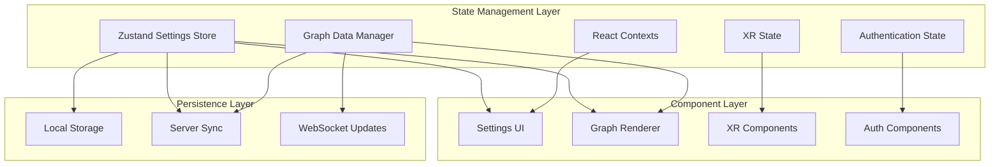
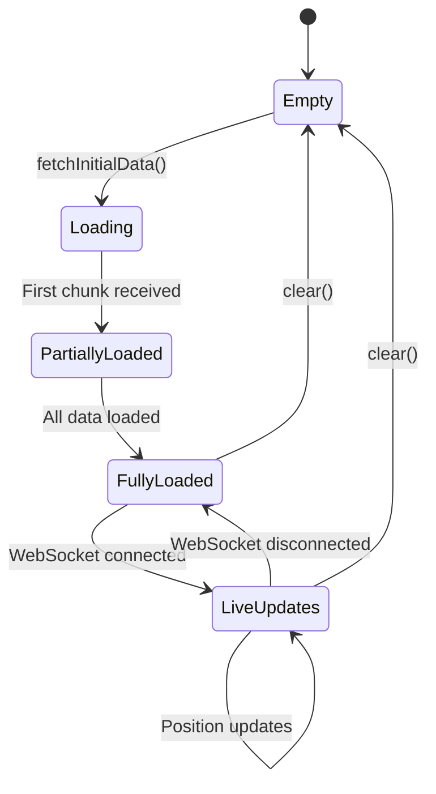
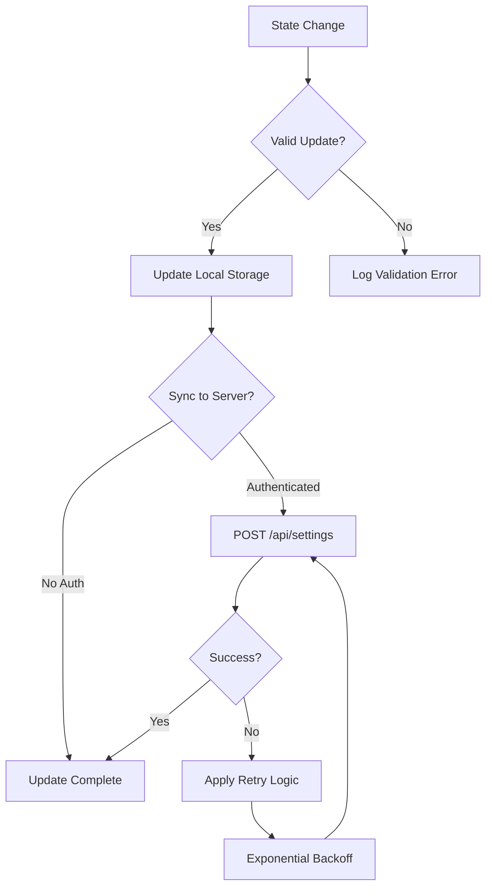

# State Management

This document details the comprehensive state management architecture used throughout the VisionFlow client application. The system combines multiple complementary approaches to handle different types of state efficiently and reactively.

## State Management Overview

VisionFlow manages several distinct types of state using specialised patterns optimised for each use case:

1. **Application Settings** - User preferences and configuration (Zustand)
2. **Graph Data** - Nodes, edges, and visualisation metadata (GraphDataManager)
3. **UI State** - Control panels, selections, and interface state (React Context)
4. **XR State** - WebXR sessions, controllers, and immersive interactions
5. **Authentication State** - Nostr identity and feature access control



## Core State Management Components

### Zustand Settings Store

The primary application state is managed through a sophisticated Zustand store located at `client/src/store/settingsStore.ts`.

#### Key Features
- **Persistent Storage**: Automatic synchronisation with localStorage and server
- **Immutable Updates**: Uses Immer middleware for safe state mutations
- **Reactive Subscriptions**: Components subscribe to specific state slices
- **Type Safety**: Full TypeScript integration with strict type checking
- **Validation**: Comprehensive validation and normalisation for server sync

#### Implementation Pattern
```typescript
import { create } from 'zustand';
import { persist, createJSONStorage } from 'zustand/middleware';
import { produce } from 'immer';

interface SettingsStore {
  settings: Settings;
  updateSettings: (updates: Partial<Settings>) => void;
  set: (path: SettingsPath, value: any) => void;
  resetToDefaults: () => void;
  // Additional methods...
}

const useSettingsStore = create<SettingsStore>()(
  persist(
    (set, get) => ({
      settings: defaultSettings,
      
      // Immer-powered immutable updates
      updateSettings: (updates) => set(
        produce((draft) => {
          deepMerge(draft.settings, updates);
        })
      ),
      
      // Path-based setting updates
      set: (path, value) => set(
        produce((draft) => {
          setNestedValue(draft.settings, path, value);
        })
      ),
      
      // ... other methods
    }),
    {
      name: 'visionflow-settings',
      storage: createJSONStorage(() => localStorage),
    }
  )
);
```

#### Settings Structure
The settings follow a hierarchical structure optimised for multi-graph visualisation:

```typescript
interface Settings {
  visualisation: {
    // Multi-graph architecture
    graphs: {
      logseq: GraphSettings;      // Blue/purple theme
      visionflow: GraphSettings;   // Green theme
    };
    
    // Global settings (shared across graphs)
    rendering: RenderingSettings;
    animations: AnimationSettings;
    bloom: BloomSettings;
    hologram: HologramSettings;
    camera: CameraSettings;
  };
  
  system: {
    websocket: ClientWebSocketSettings;
    debug: DebugSettings;
    performanceMode: 'low' | 'medium' | 'high' | 'ultra';
    persistSettings: boolean;
  };
  
  xr: XRSettings;
  auth: AuthSettings;
  
  // AI Service Integrations
  ragflow?: RAGFlowSettings;
  perplexity?: PerplexitySettings;
  openai?: OpenAISettings;
  kokoro?: KokoroSettings;
}

interface GraphSettings {
  nodes: NodeSettings;
  edges: EdgeSettings;
  labels: LabelSettings;
  physics: PhysicsSettings;
}
```

#### Usage Patterns
```typescript
// Subscribe to specific settings with selectors
const nodeSize = useSettingsStore(s => 
  s.settings.visualisation.graphs.logseq.nodes.nodeSize
);

// Subscribe to multiple related settings
const graphSettings = useSettingsStore(s => ({
  nodeSize: s.settings.visualisation.graphs.logseq.nodes.nodeSize,
  edgeWidth: s.settings.visualisation.graphs.logseq.edges.baseWidth,
  physics: s.settings.visualisation.graphs.logseq.physics
}));

// Update settings immutably
const updateSettings = useSettingsStore(s => s.updateSettings);

const handleSettingChange = (newValue: number) => {
  updateSettings({
    visualisation: {
      graphs: {
        logseq: {
          nodes: { nodeSize: newValue }
        }
      }
    }
  });
};

// Path-based updates for deep nesting
const set = useSettingsStore(s => s.set);
set('visualisation.graphs.logseq.nodes.nodeSize', 2.5);
```

### Graph Data Manager

The Graph Data Manager (`client/src/features/graph/managers/graphDataManager.ts`) handles the complex state associated with graph visualisation data.

#### Architecture
```typescript
interface GraphDataManager {
  // Data management
  setGraphData(nodes: Node[], edges: Edge[], metadata?: any): void;
  getGraphData(): GraphData;
  getNodeById(id: string): Node | undefined;
  
  // Real-time updates
  updateNodePositions(data: ArrayBuffer): void;
  setBinaryUpdatesEnabled(enabled: boolean): void;
  
  // Subscriptions
  onGraphDataChange(listener: (data: GraphData) => void): () => void;
  onPositionUpdate(listener: (updates: PositionUpdate[]) => void): () => void;
  
  // Lifecycle
  fetchInitialData(): Promise<void>;
  clear(): void;
}
```

#### State Transitions


#### Binary Protocol Integration
```typescript
// Handle real-time position updates
const graphDataManager = GraphDataManager.getInstance();

graphDataManager.onPositionUpdate((updates) => {
  // Updates format: { nodeId: number, position: Vector3, velocity: Vector3 }[]
  updates.forEach(({ nodeId, position, velocity }) => {
    // Apply smooth interpolation
    updateNodeVisualization(nodeId, position, velocity);
  });
});

// Enable high-frequency updates
graphDataManager.setBinaryUpdatesEnabled(true);
```

### React Context State

React Contexts provide localised state management for specific UI concerns:

#### Application Mode Context
```typescript
// client/src/contexts/ApplicationModeContext.tsx
interface ApplicationModeContext {
  mode: 'desktop' | 'mobile' | 'xr';
  layout: 'standard' | 'immersive' | 'compact';
  setMode: (mode: ApplicationMode) => void;
  isXRActive: boolean;
}

const ApplicationModeProvider: React.FC<{ children: ReactNode }> = ({ children }) => {
  const [mode, setMode] = useState<ApplicationMode>('desktop');
  const [isXRActive, setIsXRActive] = useState(false);
  
  // Platform detection and XR session monitoring
  useEffect(() => {
    const checkPlatform = () => {
      if (navigator.userAgent.includes('Quest')) {
        setMode('xr');
      } else if (window.innerWidth < 768) {
        setMode('mobile');
      } else {
        setMode('desktop');
      }
    };
    
    checkPlatform();
    window.addEventListener('resize', checkPlatform);
    
    return () => window.removeEventListener('resize', checkPlatform);
  }, []);
  
  return (
    <ApplicationModeContext.Provider value={{
      mode, setMode, isXRActive, 
      layout: mode === 'xr' ? 'immersive' : 'standard'
    }}>
      {children}
    </ApplicationModeContext.Provider>
  );
};
```

#### Settings Panel Context
```typescript
// client/src/features/settings/components/control-panel-context.tsx
interface ControlPanelContextType {
  detachedPanels: Set<string>;
  togglePanelDetachment: (panelId: string) => void;
  panelPositions: Record<string, { x: number; y: number }>;
  setPanelPosition: (panelId: string, position: { x: number; y: number }) => void;
}

// Usage in components
const { detachedPanels, togglePanelDetachment } = useControlPanelContext();

const handleDetachPanel = () => {
  togglePanelDetachment('visualisation-settings');
};
```

## Multi-Graph State Architecture

VisionFlow supports simultaneous visualisation of multiple graph types with independent visual settings:

### Graph-Specific Settings
```typescript
// Independent themes for different graph types
const logseqSettings = useSettingsStore(s => 
  s.settings.visualisation.graphs.logseq
);

const visionflowSettings = useSettingsStore(s => 
  s.settings.visualisation.graphs.visionflow
);

// Update specific graph settings
updateSettings({
  visualisation: {
    graphs: {
      logseq: {
        nodes: { 
          baseColor: '#4B5EFF',  // Blue theme
          nodeSize: 1.5 
        }
      },
      visionflow: {
        nodes: { 
          baseColor: '#10B981',  // Green theme
          nodeSize: 2.0 
        }
      }
    }
  }
});
```

### Settings Migration System
The application includes automatic migration from legacy flat structure to the new multi-graph architecture:

```typescript
// Migration utility handles legacy settings
const migrateSettingsToMultiGraph = (legacySettings: any): Settings => {
  const migrated = { ...defaultSettings };
  
  // Migrate legacy visualization.nodes.* → visualization.graphs.logseq.nodes.*
  if (legacySettings.visualisation?.nodes) {
    migrated.visualisation.graphs.logseq.nodes = {
      ...migrated.visualisation.graphs.logseq.nodes,
      ...legacySettings.visualisation.nodes
    };
  }
  
  // Initialize VisionFlow graph with default green theme
  migrated.visualisation.graphs.visionflow = {
    ...defaultGraphSettings,
    nodes: { 
      ...defaultGraphSettings.nodes,
      baseColor: '#10B981' 
    }
  };
  
  return migrated;
};
```

## State Persistence

### Multi-Layer Persistence Strategy


### Implementation
```typescript
// Automatic server synchronisation with retry logic
const syncToServer = async (settings: Settings, retryCount = 0): Promise<void> => {
  try {
    const normalizedSettings = normalizeSettingsForServer(settings);
    await apiService.updateSettings(normalizedSettings);
    logger.info('Settings synced to server successfully');
  } catch (error) {
    logger.error('Settings sync failed:', error);
    
    if (retryCount < 3) {
      const delay = Math.pow(2, retryCount) * 1000; // Exponential backoff
      setTimeout(() => syncToServer(settings, retryCount + 1), delay);
    }
  }
};

// Debounced updates to prevent excessive API calls
const debouncedSync = debounce(syncToServer, 1000);

// In the settings store
updateSettings: (updates) => {
  set(produce((draft) => {
    deepMerge(draft.settings, updates);
  }));
  
  // Trigger debounced server sync
  debouncedSync(get().settings);
}
```

## XR State Management

### XR Core Provider
```typescript
// client/src/features/xr/providers/XRCoreProvider.tsx
interface XRCoreContextType {
  isSessionActive: boolean;
  sessionType: XRSessionMode | null;
  controllers: XRInputSource[];
  enterXR: (mode: XRSessionMode) => Promise<void>;
  exitXR: () => Promise<void>;
  handTrackingSupported: boolean;
}

const XRCoreProvider: React.FC<{ children: ReactNode }> = ({ children }) => {
  const [isSessionActive, setIsSessionActive] = useState(false);
  const [sessionType, setSessionType] = useState<XRSessionMode | null>(null);
  const [controllers, setControllers] = useState<XRInputSource[]>([]);
  
  const enterXR = async (mode: XRSessionMode) => {
    try {
      const session = await navigator.xr?.requestSession(mode, {
        requiredFeatures: ['hand-tracking'],
        optionalFeatures: ['plane-detection', 'anchors']
      });
      
      if (session) {
        setIsSessionActive(true);
        setSessionType(mode);
        
        // Monitor controller changes
        session.addEventListener('inputsourceschange', (event) => {
          setControllers(Array.from(session.inputSources));
        });
      }
    } catch (error) {
      logger.error('Failed to enter XR mode:', error);
    }
  };
  
  return (
    <XRCoreContext.Provider value={{
      isSessionActive, sessionType, controllers,
      enterXR, exitXR, handTrackingSupported
    }}>
      {children}
    </XRCoreContext.Provider>
  );
};
```

### Hand Tracking State
```typescript
// client/src/features/xr/systems/HandInteractionSystem.tsx
interface HandState {
  left: {
    tracked: boolean;
    joints: XRJointSpace[];
    gestures: GestureRecognitionResult[];
  };
  right: {
    tracked: boolean;
    joints: XRJointSpace[];
    gestures: GestureRecognitionResult[];
  };
}

const useHandTracking = () => {
  const [handState, setHandState] = useState<HandState>(initialHandState);
  
  const updateHandGesture = useCallback((hand: 'left' | 'right', gesture: GestureRecognitionResult) => {
    setHandState(prev => ({
      ...prev,
      [hand]: {
        ...prev[hand],
        gestures: [gesture, ...prev[hand].gestures.slice(0, 4)] // Keep last 5 gestures
      }
    }));
  }, []);
  
  return { handState, updateHandGesture };
};
```

## Performance Optimisations

### Selective Subscriptions
```typescript
// Subscribe only to needed state slices
const nodeSettings = useSettingsStore(
  useCallback(
    (state) => state.settings.visualisation.graphs.logseq.nodes,
    []
  )
);

// Use shallow comparison for objects
const graphSettings = useSettingsStore(
  (state) => ({
    nodes: state.settings.visualisation.graphs.logseq.nodes,
    edges: state.settings.visualisation.graphs.logseq.edges
  }),
  shallow
);
```

### Memoised Computations
```typescript
// Expensive derived state calculations
const graphMetrics = useMemo(() => {
  const { nodes, edges } = graphData;
  
  return {
    nodeCount: nodes.length,
    edgeCount: edges.length,
    avgConnections: edges.length / Math.max(nodes.length, 1),
    clusters: identifyClusters(nodes, edges),
    centralNodes: findCentralNodes(nodes, edges)
  };
}, [graphData.nodes.length, graphData.edges.length]);

// Memoised selectors for complex state
const useOptimisedSelector = createSelector(
  (state: SettingsStore) => state.settings.visualisation,
  (state: SettingsStore) => state.settings.system.performanceMode,
  (visualisation, performanceMode) => ({
    shouldUseHighQuality: performanceMode === 'ultra',
    renderSettings: adaptRenderingSettings(visualisation, performanceMode)
  })
);
```

### State Normalisation
```typescript
// Normalize settings for server compatibility
const normalizeSettingsForServer = (settings: Settings) => {
  const normalized = JSON.parse(JSON.stringify(settings));
  
  // Convert enum strings to numbers for server validation
  const logLevelMap = { debug: 0, info: 1, warn: 2, error: 3 };
  if (normalized.system?.debug?.logLevel) {
    const level = normalized.system.debug.logLevel;
    if (typeof level === 'string' && logLevelMap[level] !== undefined) {
      normalized.system.debug.logLevel = logLevelMap[level];
    }
  }
  
  // Ensure integer values for physics parameters
  Object.values(normalized.visualisation.graphs).forEach(graph => {
    if (graph.physics?.iterations) {
      graph.physics.iterations = Math.round(graph.physics.iterations);
    }
  });
  
  return normalized;
};
```

## State Debugging

### Development Tools
```typescript
// Enable comprehensive state debugging
if (process.env.NODE_ENV === 'development') {
  // Log all state changes
  useSettingsStore.subscribe(
    (state) => console.log('Settings updated:', state),
    (state) => state.settings
  );
  
  // Performance monitoring
  useSettingsStore.subscribe(
    (state, prevState) => {
      const changes = findChangedPaths(prevState.settings, state.settings);
      if (changes.length > 0) {
        console.log('Settings changes:', changes);
      }
    }
  );
}

// State inspection utilities
window.debugSettings = () => useSettingsStore.getState();
window.debugGraphData = () => graphDataManager.getGraphData();
```

### State Validation
```typescript
// Runtime validation for critical state
const validateSettings = (settings: Settings): ValidationResult => {
  const errors: string[] = [];
  
  // Validate physics parameters
  Object.entries(settings.visualisation.graphs).forEach(([graphName, graph]) => {
    if (graph.physics.springStrength < 0 || graph.physics.springStrength > 2) {
      errors.push(`${graphName}: springStrength must be between 0 and 2`);
    }
    
    if (graph.nodes.nodeSize < 0.1 || graph.nodes.nodeSize > 10) {
      errors.push(`${graphName}: nodeSize must be between 0.1 and 10`);
    }
  });
  
  return { valid: errors.length === 0, errors };
};
```

## Integration Patterns

### Component Integration
```typescript
// High-order component for settings injection
const withSettings = <P extends object>(
  Component: React.ComponentType<P & { settings: Settings }>
) => {
  return (props: P) => {
    const settings = useSettingsStore(state => state.settings);
    return <Component {...props} settings={settings} />;
  };
};

// Hook-based integration
const useGraphSettings = (graphType: 'logseq' | 'visionflow') => {
  return useSettingsStore(
    useCallback(
      (state) => state.settings.visualisation.graphs[graphType],
      [graphType]
    )
  );
};
```

### Service Integration
```typescript
// WebSocket service integration with state
class WebSocketServiceIntegration {
  constructor(
    private wsService: WebSocketService,
    private graphDataManager: GraphDataManager
  ) {
    this.setupSubscriptions();
  }
  
  private setupSubscriptions() {
    // Forward WebSocket data to graph manager
    this.wsService.onBinaryMessage((data) => {
      this.graphDataManager.updateNodePositions(data);
    });
    
    // Sync settings changes to server
    useSettingsStore.subscribe(
      (settings) => {
        if (this.wsService.isReady()) {
          this.wsService.sendMessage({
            type: 'settings_update',
            settings: normalizeSettingsForServer(settings)
          });
        }
      },
      (state) => state.settings
    );
  }
}
```

The VisionFlow state management system provides a robust, performant, and scalable foundation for complex interactive visualisation applications while maintaining type safety and developer experience.