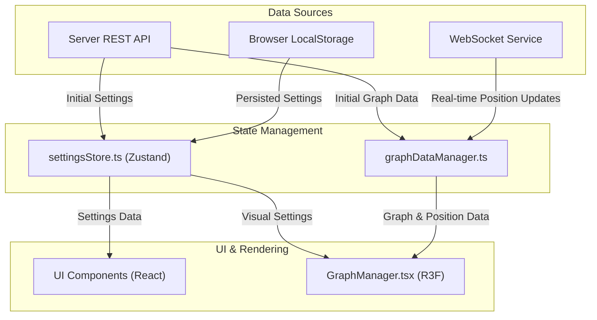

# State Management

This document details the state management architecture of the client application. The system is built around two primary components: a Zustand store for application settings and a dedicated manager for graph data.

## Architecture Overview

State is divided into two main categories:

1.  **Persistent Application State**: Managed by a single Zustand store (`settingsStore.ts`). This includes user settings, UI preferences, and configurations that need to be saved across sessions.
2.  **Transient visualisation State**: Managed by the `GraphDataManager`. This includes the real-time positions of nodes and edges, which are constantly updated by the server's physics simulation and do not need to be persisted.

## Application Settings: `settingsStore.ts`

The single, authoritative source of truth for all application settings is the Zustand store located at [`client/src/store/settingsStore.ts`](../../client/src/store/settingsStore.ts). This unified store resolves the "dual store issue" present in previous versions.

### Key Features
-   **Zustand**: Provides a simple and powerful API for managing state with hooks.
-   **Immer Middleware**: Enables safe and easy immutable state updates using `produce`.
-   **`persist` Middleware**: Automatically saves and rehydrates settings to `localStorage`, providing persistence across browser sessions.
-   **Server synchronisation**: On initialization, it fetches the latest settings from the server. Changes made by the user are debounced and saved back to the server via the `settingsApi`.

### Data Flow
1.  **Initialization**: On application startup, the store is initialised, and settings are fetched from the server.
2.  **Component Subscription**: React components subscribe to the store using the `useSettingsStore` hook. Selectors are used to subscribe to specific slices of the state, preventing unnecessary re-renders.
3.  **User Interaction**: When a user changes a setting in the UI, an action is called on the store (e.g., `updateSettings`).
4.  **State Update**: The store's state is updated immutably.
5.  **Re-render**: Components subscribed to the changed part of the state automatically re-render to reflect the new settings.
6.  **Persistence**: The `persist` middleware saves the new state to `localStorage`, and a debounced function saves it to the server.

## Graph visualisation State: `graphDataManager.ts`

The state of the graph itself (nodes, edges, and their real-time positions) is managed by the `GraphDataManager` singleton, located at [`client/src/features/graph/managers/graphDataManager.ts`](../../client/src/features/graph/managers/graphDataManager.ts). This manager is designed to handle high-frequency updates efficiently.

### Key Features
-   **Singleton Pattern**: A single instance manages all graph data, accessible via `graphDataManager.getInstance()`.
-   **Web Worker Offloading**: It uses a web worker (`graphWorkerProxy`) to handle heavy data processing, such as parsing binary position updates, without blocking the main UI thread.
-   **Listener Pattern**: Components (like `GraphManager.tsx`) subscribe to data changes using `onGraphDataChange` and `onPositionUpdate` listeners rather than a reactive hook system. This is more performant for the high-frequency position updates.

### Data Flow
1.  **Initialization**: `GraphDataManager` fetches the initial set of nodes and edges from the REST API.
2.  **Real-time Updates**: It receives `ArrayBuffer` payloads containing position updates from the `WebSocketService`.
3.  **Worker Processing**: The binary data is transferred to the web worker for parsing and processing.
4.  **Notification**: Once processed, the worker notifies the `GraphDataManager` on the main thread.
5.  **Listener Execution**: `GraphDataManager` invokes the registered listeners, passing the new graph data or position updates to subscribed components like `GraphManager.tsx`, which then updates the 3D visualisation.