# Client Components and UI Library

This document details the client's component architecture, describing the relationships between major components, their responsibilities, and the reusable UI component library.

## Component Architecture Overview

The client is organized into a modular component architecture with clear separation of concerns. Each component has well-defined responsibilities and interfaces.

```mermaid
flowchart TB
    subgraph CoreServices [Core Services & Stores]
        APIService[services/apiService.ts]
        SettingsStore["settingsStore.ts"]
        NostrAuthSvc[nostrAuthService.ts]
        Logger[logger.ts]
        Utils[utils/*]
    end

    subgraph AppInit [Application Initialization]
        AppInitializer[AppInitializer.tsx]
        Main[main.tsx]
    end

    subgraph MainUILayout [Main UI Layout & Panels]
        MainLayout[MainLayout.tsx]
        RightPaneCtrlPanel[RightPaneControlPanel.tsx]
        ConversationPane[ConversationPane.tsx]
        NarrativeGoldminePanel[NarrativeGoldminePanel.tsx]
    end

    subgraph SettingsUI [Settings UI Components]
        SettingsPanelRedesign[SettingsPanelRedesign.tsx]
        TabsUI["Tabs.tsx"]
        SettingsSection[SettingsSection.tsx]
        SettingControlComp[SettingControlComponent.tsx]
    end

    subgraph AuthUI [Authentication UI]
        AuthUIHandler[AuthUIHandler.tsx]
        NostrAuthSection[NostrAuthSection.tsx]
    end

    subgraph RenderingEngine ["Rendering Engine"]
        GraphCanvas[GraphCanvas.tsx]
        GraphManager[GraphManager.tsx]
        GraphViewport[GraphViewport.tsx]
        CameraController[CameraController.tsx]
        TextRenderer[TextRenderer.tsx]
        MetadataVisualizer[MetadataVisualizer.tsx]
        HologramManager[HologramManager.tsx]
    end

    subgraph Network [Network & Data Management]
        WebSocketSvc[WebSocketService.ts]
        GraphDataMgr[GraphDataManager.ts]
    end

    subgraph XRModule [XR Module]
        XRController[XRController.tsx]
        XRScene[XRScene.tsx]
        XRVisualisationConnector[XRVisualisationConnector.tsx]
        HandInteractionSystem[HandInteractionSystem.tsx]
        XRInitializer[xrInitializer.ts]
        XRSessionManager[xrSessionManager.ts]
    end

    subgraph GenericUI [Generic UI Components]
        MarkdownRenderer[MarkdownRenderer.tsx]
        Button[Button.tsx]
        Input[Input.tsx]
        %% Add other generic UI components as needed
    end

    %% Initialization Flow
    Main --> AppInitializer
    AppInitializer --> SettingsStore
    AppInitializer --> NostrAuthSvc
    AppInitializer --> WebSocketSvc
    AppInitializer --> GraphDataMgr
    AppInitializer --> MainLayout
    AppInitializer --> AuthUIHandler
    AppInitializer --> XRController

    %% UI Structure
    MainLayout --> GraphViewport
    MainLayout --> RightPaneCtrlPanel
    RightPaneCtrlPanel --> ConversationPane
    RightPaneCtrlPanel --> NarrativeGoldminePanel

    RightPaneCtrlPanel --> NostrAuthSection
    RightPaneCtrlPanel --> SettingsPanelRedesign

    SettingsPanelRedesign --> TabsUI
    TabsUI --> SettingsSection
    SettingsSection --> SettingControlComp

    %% Data Flow & Dependencies
    SettingsStore --> SettingControlComp
    SettingsStore --> GraphManager
    SettingsStore --> HologramManager
    SettingsStore --> TextRenderer

    AuthUIHandler --> NostrAuthSvc
    NostrAuthSvc --> APIService

    ConversationPane --> APIService
    NarrativeGoldminePanel --> APIService

    WebSocketSvc --> GraphDataMgr
    GraphDataMgr --> GraphManager
    GraphDataMgr --> APIService

    %% Rendering Dependencies
    GraphCanvas --> GraphManager
    GraphCanvas --> GraphViewport
    GraphCanvas --> CameraController
    GraphManager --> TextRenderer
    GraphManager --> MetadataVisualizer
    GraphManager --> HologramManager

    %% XR Dependencies
    XRController --> XRScene
    XRController --> XRInitializer
    XRController --> XRSessionManager
    XRScene --> XRVisualisationConnector
    XRVisualisationConnector --> GraphManager
    XRVisualisationConnector --> HandInteractionSystem
    HandInteractionSystem --> GraphManager

    %% Cross-cutting
    Logger -.-> APIService
    Logger -.-> WebSocketSvc
    Logger -.-> GraphManager
    Logger -.-> XRController
    Utils -.-> SettingsStore
    Utils -.-> GraphDataMgr
```



## UI Component Library

The client includes a comprehensive UI component library built with React and TypeScript. These components provide consistent styling and behavior across the application, with support for theming and responsive design.

### Core UI Components

#### Button ([`client/src/features/design-system/components/Button.tsx`](../../client/src/features/design-system/components/Button.tsx))
A versatile button component with multiple variants and sizes.
- **Variants**: default, destructive, outline, secondary, ghost, link
- **Sizes**: default, sm, lg, icon
- **Features**: Loading states, disabled states, full-width option
- **Usage**:
```tsx
<Button variant="default" size="sm" onClick={handleClick}>
  Click me
</Button>
```

#### Input ([`client/src/features/design-system/components/Input.tsx`](../../client/src/features/design-system/components/Input.tsx))
Standard input field component with consistent styling.
- **Features**: Error states, disabled states, placeholder support
- **Integrates with form validation libraries
- **Usage**:
```tsx
<Input 
  type="text" 
  placeholder="Enter text..." 
  value={value} 
  onChange={onChange} 
/>
```

#### Label ([`client/src/features/design-system/components/Label.tsx`](../../client/src/features/design-system/components/Label.tsx))
Form label component for accessibility and consistent styling.
- **Features**: Required field indicators, error states
- **Automatically associates with form controls
- **Usage**:
```tsx
<Label htmlFor="input-id">Field Label</Label>
```

#### Select ([`client/src/features/design-system/components/Select.tsx`](../../client/src/features/design-system/components/Select.tsx))
Dropdown selection component with customizable options.
- **Features**: Single/multiple selection, searchable options
- **Keyboard navigation support
- **Usage**:
```tsx
<Select value={selected} onValueChange={setSelected}>
  <SelectTrigger>
    <SelectValue placeholder="Select an option" />
  </SelectTrigger>
  <SelectContent>
    <SelectItem value="option1">Option 1</SelectItem>
  </SelectContent>
</Select>
```

#### Switch ([`client/src/features/design-system/components/Switch.tsx`](../../client/src/features/design-system/components/Switch.tsx))
Toggle switch component for boolean settings.
- **Features**: Animated transitions, disabled states
- **Accessible with keyboard navigation
- **Usage**:
```tsx
<Switch 
  checked={isEnabled} 
  onCheckedChange={setIsEnabled} 
/>
```

#### RadioGroup ([`client/src/features/design-system/components/RadioGroup.tsx`](../../client/src/features/design-system/components/RadioGroup.tsx))
Radio button group for single selection from multiple options.
- **Features**: Grouped radio buttons with consistent styling
- **Keyboard navigation between options
- **Usage**:
```tsx
<RadioGroup value={selected} onValueChange={setSelected}>
  <RadioGroupItem value="option1" id="r1" />
  <Label htmlFor="r1">Option 1</Label>
</RadioGroup>
```

#### Slider ([`client/src/features/design-system/components/Slider.tsx`](../../client/src/features/design-system/components/Slider.tsx))
Range slider component for numeric value selection.
- **Features**: Min/max bounds, step increments
- **Visual feedback during interaction
- **Usage**:
```tsx
<Slider 
  value={[value]} 
  onValueChange={([v]) => setValue(v)}
  min={0} 
  max={100} 
  step={1} 
/>
```

### Layout Components

#### Card ([`client/src/features/design-system/components/Card.tsx`](../../client/src/features/design-system/components/Card.tsx))
Container component for grouping related content.
- **Sub-components**: CardHeader, CardTitle, CardDescription, CardContent, CardFooter
- **Features**: Consistent padding and shadows
- **Usage**:
```tsx
<Card>
  <CardHeader>
    <CardTitle>Card Title</CardTitle>
    <CardDescription>Card description</CardDescription>
  </CardHeader>
  <CardContent>
    Content goes here
  </CardContent>
</Card>
```

#### Tabs ([`client/src/features/design-system/components/Tabs.tsx`](../../client/src/features/design-system/components/Tabs.tsx))
Tabbed interface component for organizing content.
- **Sub-components**: TabsList, TabsTrigger, TabsContent
- **Features**: Keyboard navigation, animated transitions
- **Usage**:
```tsx
<Tabs value={activeTab} onValueChange={setActiveTab}>
  <TabsList>
    <TabsTrigger value="tab1">Tab 1</TabsTrigger>
    <TabsTrigger value="tab2">Tab 2</TabsTrigger>
  </TabsList>
  <TabsContent value="tab1">Tab 1 content</TabsContent>
  <TabsContent value="tab2">Tab 2 content</TabsContent>
</Tabs>
```

#### Collapsible ([`client/src/features/design-system/components/Collapsible.tsx`](../../client/src/features/design-system/components/Collapsible.tsx))
Expandable/collapsible content container.
- **Features**: Smooth animations, controlled/uncontrolled modes
- **Accessibility support with ARIA attributes
- **Usage**:
```tsx
<Collapsible open={isOpen} onOpenChange={setIsOpen}>
  <CollapsibleTrigger>Toggle Content</CollapsibleTrigger>
  <CollapsibleContent>
    Hidden content revealed when open
  </CollapsibleContent>
</Collapsible>
```

### Feedback Components

#### Toast ([`client/src/features/design-system/components/Toast.tsx`](../../client/src/features/design-system/components/Toast.tsx))
Notification system for user feedback.
- **Hook**: `useToast` for programmatic toast creation
- **Features**: Multiple toast types (success, error, warning, info)
- **Auto-dismiss with configurable duration
- **Usage**:
```tsx
const { toast } = useToast();

toast({
  title: "Success",
  description: "Operation completed successfully",
  variant: "success"
});
```

#### Tooltip ([`client/src/features/design-system/components/Tooltip.tsx`](../../client/src/features/design-system/components/Tooltip.tsx))
Contextual information on hover/focus.
- **Features**: Customizable placement, delay options
- **Keyboard accessible
- **Usage**:
```tsx
<Tooltip>
  <TooltipTrigger>Hover me</TooltipTrigger>
  <TooltipContent>
    Helpful information appears here
  </TooltipContent>
</Tooltip>
```

### Specialized Components

#### MarkdownRenderer ([`client/src/features/design-system/patterns/MarkdownRenderer.tsx`](../../client/src/features/design-system/patterns/MarkdownRenderer.tsx))
Renders markdown content with custom styling.
- **Features**: 
  - Syntax highlighting for code blocks
  - Custom link handling
  - Table support
  - Embedded media rendering
- **Security**: Sanitized HTML output
- **Usage**:
```tsx
<MarkdownRenderer content={markdownString} />
```

## Design System

### Colors
The component library uses CSS variables for theming:
- `--primary`: Primary brand color
- `--secondary`: Secondary brand color
- `--background`: Background colors
- `--foreground`: Text colors
- `--muted`: Muted elements
- `--accent`: Accent colors
- `--destructive`: Error/danger colors

### Typography
Consistent typography using system font stacks:
- Headings: Inter, system-ui, sans-serif
- Body: Inter, system-ui, sans-serif
- Code: Fira Code, monospace

### Spacing
Standardized spacing scale:
- `space-1`: 0.25rem (4px)
- `space-2`: 0.5rem (8px)
- `space-3`: 0.75rem (12px)
- `space-4`: 1rem (16px)
- `space-6`: 1.5rem (24px)
- `space-8`: 2rem (32px)

### Responsive Design
All components support responsive design through:
- Flexible layouts using CSS Grid and Flexbox
- Responsive typography scaling
- Touch-friendly interaction areas on mobile
- Adaptive component behavior based on screen size

## Best Practices

1. **Accessibility**: All components follow WCAG 2.1 guidelines
2. **Keyboard Navigation**: Full keyboard support for all interactive elements
3. **Performance**: Components use React.memo and proper dependency arrays
4. **Type Safety**: Full TypeScript support with exported prop types
5. **Composition**: Prefer composition over configuration for flexibility
6. **Theming**: Use CSS variables for easy theme customization