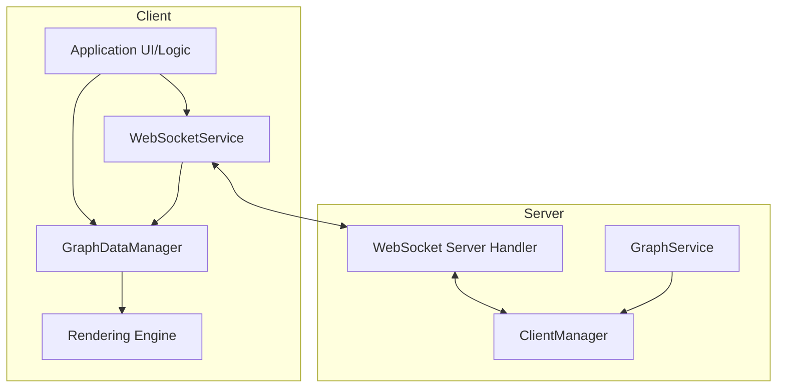
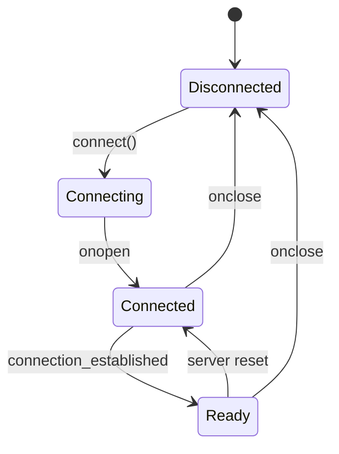
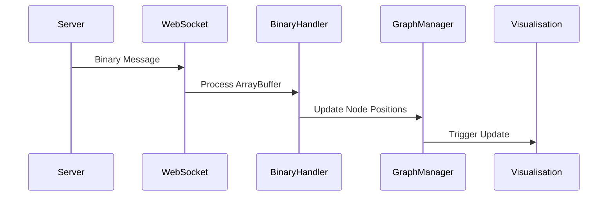
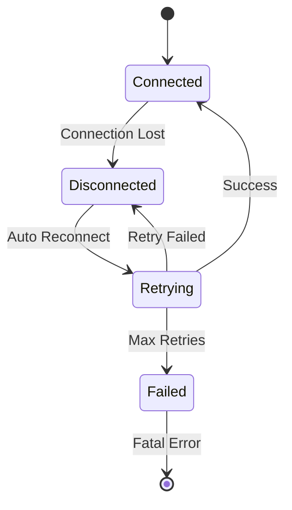

# WebSocket Communication

This document describes the WebSocket communication system used in the client.

## Overview

The client uses WebSocket connections for real-time communication with the server, particularly for:
- Binary position updates for graph nodes
- Graph data synchronisation
- Event notifications
- Connection status management

## Architecture



## WebSocket Service

The WebSocket service ([`client/src/services/WebSocketService.ts`](../../client/src/services/WebSocketService.ts)) is implemented as a singleton that manages:
- WebSocket connection establishment and maintenance (including reconnection logic).
- Sending and receiving JSON and binary messages.
- Handling binary protocol specifics (like potential decompression if not handled by `binaryUtils.ts` directly upon receipt).
- Exposing connection status and readiness.
- Error handling for the connection itself.

### Key Features

- Automatic reconnection with exponential backoff
- Binary message support
- Connection status monitoring
- Event-based message handling
- A robust readiness protocol to ensure the connection is fully established before use.

## Readiness Protocol

To ensure reliability, the WebSocket service implements a readiness protocol. This prevents the application from sending data or enabling features before the connection is fully established and confirmed by the server.

### Readiness States

The WebSocket connection has three distinct states:

1.  **Disconnected**: No connection established
2.  **Connected**: The socket connection is open (`onopen` event has fired), but the server has not yet confirmed the connection is operational.
3.  **Ready**: The connection is open AND the server has sent a `connection_established` message.



### Implementation Details

The `WebSocketService.ts` tracks these states:

-   `isConnected`: A boolean flag indicating if the WebSocket's `readyState` is `OPEN`.
-   `isServerReady`: A boolean flag set to `true` only when the server sends a `connection_established` message.
-   `isReady()`: A method that returns `true` only if both `isConnected` and `isServerReady` are true.

This ensures that other parts of the application, like the `GraphDataManager`, can confidently check `wsService.isReady()` before proceeding with operations that require a live, confirmed connection.

### Adapter Pattern for Service Integration

An adapter pattern is used during application initialisation (in `AppInitializer.tsx`) to provide the `GraphDataManager` with a clean interface to the `WebSocketService`, decoupling the two systems.

```typescript
// In client/src/app/AppInitializer.tsx (conceptual)
if (websocketService && graphDataManager) {
    const wsAdapter = {
        sendMessage: (message: object) => websocketService.sendMessage(message),
        isReady: () => websocketService.isReady(),
        onBinaryMessage: (callback: (data: ArrayBuffer) => void) => {
            return websocketService.onBinaryMessage(callback);
        },
        onMessage: (callback: (data: any) => void) => {
            return websocketService.onMessage(callback);
        }
    };
    graphDataManager.setWebSocketService(wsAdapter);
}
```

## Binary Protocol

The binary protocol is used for efficient transmission of node position updates.

### Message Format

The primary binary message format is for node position and velocity updates.

**Wire Protocol (Client ↔ Server)**:
-   **Format per node:** As defined in [Binary Protocol Specification](../binary-protocol.md)
    -   Node ID: `u32` (4 bytes, little-endian, with type flags)
    -   Position (X, Y, Z): 3 x `f32` (12 bytes, IEEE 754, little-endian)
    -   Velocity (VX, VY, VZ): 3 x `f32` (12 bytes, IEEE 754, little-endian)
-   **Total per node: 28 bytes fixed**
-   A single binary WebSocket message can contain data for multiple nodes, packed consecutively.
-   **Type flags:** 0x80000000=Agent, 0x40000000=Knowledge, actual ID in lower 30 bits

**Compression**:
- **Server-side**: zlib compression applied if message > `system.websocket.compressionThreshold` (default 512 bytes)
- **Client-side**: Automatic decompression handled by the `permessage-deflate` WebSocket extension.

### Processing Flow



## Message Types

The WebSocket service handles several types of messages:

1.  **Binary Position Updates (Server -> Client)**
    -   Format: `ArrayBuffer` (potentially zlib compressed).
    -   Handler: `onBinaryMessage` callback provided to `WebSocketService`.
    -   Content: Packed `BinaryNodeData` (nodeId, position, velocity) for multiple nodes.
    -   Usage: Real-time node position and velocity updates from the server's physics simulation.

2.  **JSON Control Messages (Bidirectional)**
    -   Format: JSON objects.
    -   Handler: `onMessage` callback provided to `WebSocketService`.
    -   Examples:
        -   Server -> Client: `{"type": "connection_established"}`, `{"type": "updatesStarted"}`, `{"type": "loading"}`.
        -   Client -> Server: `{"type": "requestInitialData"}`, `{"type": "ping"}`, `{"type": "subscribe_position_updates", "binary": true, "interval": ...}`.

3.  **Connection Status Changes**
    -   Not a message type per se, but an event emitted by `WebSocketService`.
    -   Handler: `onConnectionStatusChange` callback.
    -   Provides status like `{ connected: boolean; error?: any }`.

## Error Handling

The WebSocket service implements robust error handling, primarily by logging errors and attempting reconnection.

### Recovery Strategy



## Configuration

WebSocket behavior can be configured through settings:

```typescript
// Relevant settings are found under 'system.websocket' in
// client/src/features/settings/config/settings.ts (ClientWebSocketSettings)
// and correspond to server-side settings in src/config/mod.rs (ServerFullWebSocketSettings).

interface ClientWebSocketSettings { // From settings.ts
    updateRate: number; // Target FPS for client-side rendering of updates
    reconnectAttempts: number;
    reconnectDelay: number; // ms
    compressionEnabled: boolean; // Client expects server to compress if true
    compressionThreshold: number; // Matches server setting
}
```

## Usage Example

```typescript
// Initialization and usage typically happens within AppInitializer.tsx.
const wsService = WebSocketService.getInstance();

// Setup handlers
wsService.onConnectionStatusChange((status) => {
    logger.info(`WebSocket connection status: ${status.connected ? 'Connected' : 'Disconnected'}`);
    // The GraphDataManager will react to readiness changes via its adapter.
});

wsService.onMessage((jsonData) => {
    logger.debug('WebSocket JSON message received:', jsonData);
    // The WebSocketService internally handles the "connection_established" message
    // to update its readiness state.
});

wsService.onBinaryMessage((arrayBuffer) => {
    // Pass the raw ArrayBuffer to graphDataManager
    try {
        graphDataManager.updateNodePositions(arrayBuffer);
    } catch (error) {
        logger.error('Failed to process binary message:', error);
    }
});

// Attempt to connect
wsService.connect().catch(error => {
    logger.error('Failed to connect WebSocket initial attempt:', error);
});

// The GraphDataManager will now use the adapter to check for readiness
// before enabling binary updates or sending data.
// e.g., inside GraphDataManager:
public enableBinaryUpdates(): void {
    if (this.wsServiceAdapter?.isReady()) {
        logger.info('Binary updates enabled as WebSocket is ready.');
        this.binaryUpdatesEnabled = true;
    } else {
        logger.warn('Cannot enable binary updates: WebSocket not ready.');
    }
}
```

## Related Documentation

- [State Management](state-management.md) - State management integration
- [Graph System](graph-system.md) - Graph data structure and updates