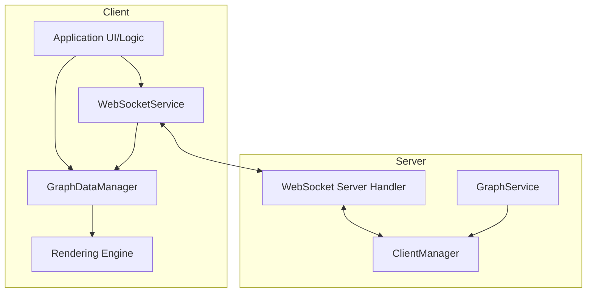
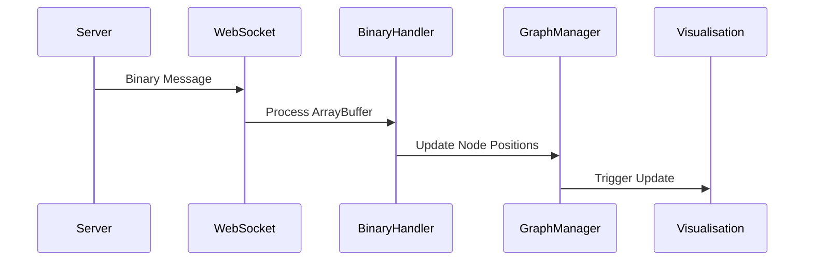
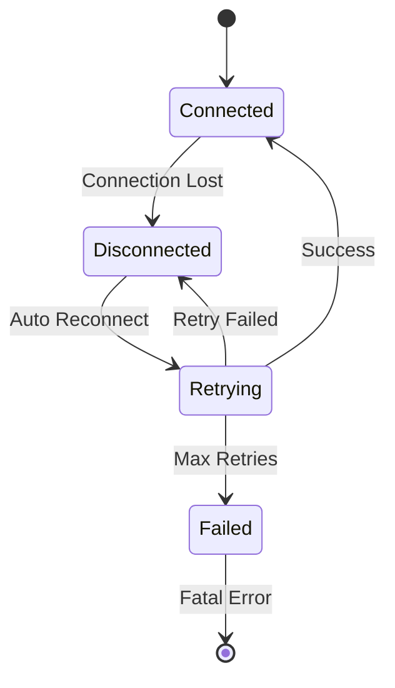

# WebSocket Communication

This document describes the WebSocket communication system used in the client.

## Overview

The client uses WebSocket connections for real-time communication with the server, particularly for:
- Binary position updates for graph nodes
- Graph data synchronisation
- Event notifications
- Connection status management

## Architecture



## WebSocket Service

The WebSocket service ([`client/src/services/WebSocketService.ts`](../../client/src/services/WebSocketService.ts)) is implemented as a singleton that manages:
- WebSocket connection establishment and maintenance (including reconnection logic).
- Sending and receiving JSON and binary messages.
- Handling binary protocol specifics (like potential decompression if not handled by `binaryUtils.ts` directly upon receipt).
- Exposing connection status and readiness (see `websocket-readiness.md`).
- Error handling for the connection itself.

### Key Features

- Automatic reconnection with exponential backoff
- Binary message support
- Connection status monitoring
- Event-based message handling

## Binary Protocol

The binary protocol is used for efficient transmission of node position updates.

### Message Format

The primary binary message format is for node position and velocity updates.

**Wire Protocol (Client ↔ Server)**:
-   **Format per node:** As defined in [Binary Protocol Specification](../binary-protocol.md)
    -   Node ID: `u32` (4 bytes, little-endian, with type flags)
    -   Position (X, Y, Z): 3 x `f32` (12 bytes, IEEE 754, little-endian)
    -   Velocity (VX, VY, VZ): 3 x `f32` (12 bytes, IEEE 754, little-endian)
-   **Total per node: 28 bytes fixed**
-   A single binary WebSocket message can contain data for multiple nodes, packed consecutively.
-   **Type flags:** 0x80000000=Agent, 0x40000000=Knowledge, actual ID in lower 30 bits

**Server-Side Internal Format** (`BinaryNodeData` in `src/utils/socket_flow_messages.rs`):
- Contains additional fields: `mass`, `flags`, `padding`
- Used for physics simulation but **NOT sent over wire**
- Server converts internal format → 28-byte wire format before transmission
- **Reference:** See [Binary Protocol](../binary-protocol.md) for authoritative specification

**Compression**:
- **Server-side**: zlib compression applied if message > `system.websocket.compressionThreshold` (default 512 bytes)
- **Client-side**: Automatic decompression handled in WebSocket message processing
- **Implementation**: Uses permessage-deflate WebSocket extension for optimal compression

**Actual Implementation**:
```typescript
// In WebSocketService.ts or similar
wsService.onBinaryMessage((arrayBuffer: ArrayBuffer) => {
  // Direct processing or decompression happens here
  // May use built-in browser decompression or manual zlib
  graphDataManager.updateNodePositions(arrayBuffer);
});
```

### Processing Flow



## Message Types

The WebSocket service handles several types of messages:

1.  **Binary Position Updates (Server -> Client)**
    -   Format: `ArrayBuffer` (potentially zlib compressed).
    -   Handler: `onBinaryMessage` callback provided to `WebSocketService`.
    -   Content: Packed `BinaryNodeData` (nodeId, position, velocity) for multiple nodes.
    -   Usage: Real-time node position and velocity updates from the server's physics simulation.

2.  **JSON Control Messages (Bidirectional)**
    -   Format: JSON objects.
    -   Handler: `onMessage` callback provided to `WebSocketService`.
    -   Examples:
        -   Server -> Client: `{"type": "connection_established"}`, `{"type": "updatesStarted"}`, `{"type": "loading"}`.
        -   Client -> Server: `{"type": "requestInitialData"}`, `{"type": "ping"}`, `{"type": "subscribe_position_updates", "binary": true, "interval": ...}`. (The `subscribe_position_updates` is effectively handled by `requestInitialData` logic on the server).

3.  **Connection Status Changes**
    -   Not a message type per se, but an event emitted by `WebSocketService`.
    -   Handler: `onConnectionStatusChange` callback.
    -   Provides status like `{ connected: boolean; error?: any }`.

## Error Handling

The WebSocket service implements robust error handling, primarily by logging errors and attempting reconnection.

### Recovery Strategy



## Configuration

WebSocket behavior can be configured through settings:

```typescript
// Relevant settings are found under 'system.websocket' in
// client/src/features/settings/config/settings.ts (ClientWebSocketSettings)
// and correspond to server-side settings in src/config/mod.rs (ServerFullWebSocketSettings).

interface ClientWebSocketSettings { // From settings.ts
    updateRate: number; // Target FPS for client-side rendering of updates
    reconnectAttempts: number;
    reconnectDelay: number; // ms
    compressionEnabled: boolean; // Client expects server to compress if true
    compressionThreshold: number; // Matches server setting
    // binaryChunkSize is not a direct client setting, more server-side or implicit.
    // minUpdateRate, maxUpdateRate, motionThreshold, motionDamping are server-side physics/update rate controls.
}
```
The client's `WebSocketService` uses `reconnectAttempts` and `reconnectDelay`. The `compressionEnabled` and `compressionThreshold` inform the client whether to expect compressed messages and how to handle them (though decompression logic is in `binaryUtils.ts`). The `updateRate` in client settings typically influences how often the client *requests* or *processes* updates, distinct from the server's actual send rate.

## Performance Considerations

1. **Binary Protocol**
   - Reduces message size by ~60% compared to JSON
   - Minimizes parsing overhead
   - Enables efficient batch updates

2. **Message Batching**
   - Position updates are batched for efficiency
   - Configurable batch size and update rate
   - Automatic throttling under high load

3. **Connection Management**
   - Heartbeat mechanism for connection health
   - Automatic reconnection with backoff
   - Connection status monitoring

## Usage Example

```typescript
// Initialization and usage typically happens within AppInitializer.tsx or similar.
// graphDataManager is an instance of GraphDataManager.

const wsService = WebSocketService.getInstance();

// Setup handlers
wsService.onConnectionStatusChange((status) => {
    logger.info(`WebSocket connection status: ${status.connected ? 'Connected' : 'Disconnected'}`);
    if (status.connected && wsService.isReady()) { // Check full readiness
        // This might trigger graphDataManager to request initial data or enable binary updates
        // if it hasn't already due to the adapter pattern.
        graphDataManager.setBinaryUpdatesEnabled(true); // Or similar logic
    } else if (!status.connected) {
        graphDataManager.setBinaryUpdatesEnabled(false);
    }
});

wsService.onMessage((jsonData) => {
    logger.debug('WebSocket JSON message received:', jsonData);
    // Handle JSON messages (e.g., connection_established, loading)
    // This might also be handled by graphDataManager via the adapter.
});

wsService.onBinaryMessage((arrayBuffer) => {
    // Pass the raw ArrayBuffer to graphDataManager
    // Decompression (if needed) may happen here or in graphDataManager
    // Note: binaryUtils.ts not found - decompression likely built into WebSocketService
    try {
        graphDataManager.updateNodePositions(arrayBuffer);
    } catch (error) {
        logger.error('Failed to process binary message:', error);
        // May be compressed data that needs decompression
        // Implementation details depend on actual WebSocketService code
    }
});

// Attempt to connect
wsService.connect().catch(error => {
    logger.error('Failed to connect WebSocket initial attempt:', error);
});

// Later, graphDataManager, through its adapter, will use wsService.isReady()
// and wsService.sendRawBinaryData() or wsService.sendMessage().
// For example, when graphDataManager decides to enable binary updates:
// if (wsService.isReady()) {
//   wsService.sendMessage({ type: 'subscribe_position_updates', binary: true, interval: 33 });
// }
```
**Current Implementation Reality**:

The `graphDataManager.updateNodePositions` method expects an `ArrayBuffer` which it processes as follows:

1. **Decompression**: May happen automatically in WebSocket layer (browser built-in) or manually
2. **Parsing**: Converts 28-byte chunks into node position/velocity updates  
3. **Batch Processing**: Handles multiple nodes in single message

The call `graphDataManager.setBinaryUpdatesEnabled(true)` triggers:
- Server subscription to position updates
- Internal flag to process incoming binary messages
- May send WebSocket message: `{"type": "subscribe_position_updates", "binary": true}`

**Current Implementation**:
- ✅ Binary protocol follows [Binary Protocol Specification](../binary-protocol.md)
- ✅ Decompression handled by WebSocket permessage-deflate extension
- ✅ 28-byte fixed format for optimal performance
- ✅ Type flags support for node classification (agent/knowledge)

## Related Documentation

- [State Management](state.md) - State management integration
- [Graph Data](graph.md) - Graph data structure and updates
- [Performance](performance.md) - Performance optimisation details