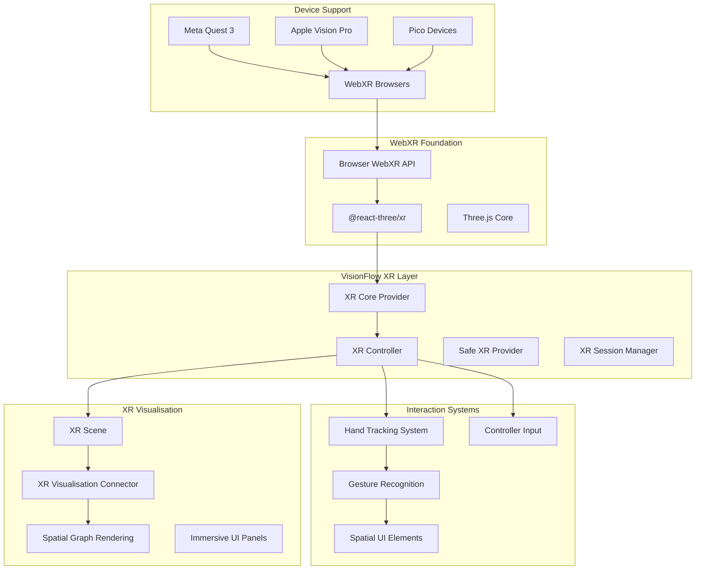

# WebXR Integration

This document details VisionFlow's comprehensive WebXR integration, enabling immersive virtual and augmented reality experiences with a focus on Quest 3, Vision Pro, and other WebXR-compatible devices. The system provides sophisticated hand tracking, spatial interaction, and seamless graph visualisation in 3D space.

## WebXR Architecture Overview

VisionFlow's XR system is built on `@react-three/xr` with custom enhancements for production-ready immersive experiences:



## Core XR Components

### XR Core Provider (`client/src/features/xr/providers/XRCoreProvider.tsx`)

The XR Core Provider serves as the central hub for WebXR session management and state coordination.

#### Features
- **Session Lifecycle Management**: Handles XR session creation, maintenance, and cleanup
- **Multi-Device Support**: Detects and optimises for different XR devices
- **Feature Detection**: Identifies available XR capabilities (hand tracking, plane detection, etc.)
- **Error Handling**: Graceful fallbacks when XR features are unavailable

#### Implementation
```tsx
interface XRCoreContextType {
  // Session state
  isSessionActive: boolean;
  sessionType: XRSessionMode | null;
  sessionError: string | null;
  
  // Device capabilities
  deviceType: 'quest3' | 'visionpro' | 'pico' | 'unknown';
  handTrackingSupported: boolean;
  planeDetectionSupported: boolean;
  
  // Controllers and input
  controllers: XRInputSource[];
  hands: { left: XRHand | null; right: XRHand | null };
  
  // Session management
  enterXR: (mode: XRSessionMode, features?: XRSessionFeature[]) => Promise<void>;
  exitXR: () => Promise<void>;
  
  // Real-time state
  referenceSpace: XRReferenceSpace | null;
  session: XRSession | null;
}

const XRCoreProvider: React.FC<{ children: ReactNode }> = ({ children }) => {
  const [sessionState, setSessionState] = useState<XRSessionState>({
    isActive: false,
    type: null,
    error: null
  });
  
  const [deviceCapabilities, setDeviceCapabilities] = useState<DeviceCapabilities>({
    type: 'unknown',
    handTrackingSupported: false,
    planeDetectionSupported: false
  });
  
  // Detect device type and capabilities
  useEffect(() => {
    const detectDevice = async () => {
      if (!navigator.xr) {
        setDeviceCapabilities(prev => ({ ...prev, type: 'unsupported' }));
        return;
      }
      
      try {
        // Check for Quest 3 specific features
        const quest3Features = await Promise.all([
          navigator.xr.isSessionSupported('immersive-ar'),
          navigator.xr.isSessionSupported('immersive-vr')
        ]);
        
        if (quest3Features.every(Boolean)) {
          setDeviceCapabilities({
            type: 'quest3',
            handTrackingSupported: true,
            planeDetectionSupported: true
          });
        }
        
        // Check for Vision Pro capabilities
        const visionProSupport = await navigator.xr.isSessionSupported('immersive-ar');
        if (visionProSupport && navigator.userAgent.includes('Safari')) {
          setDeviceCapabilities({
            type: 'visionpro',
            handTrackingSupported: true,
            planeDetectionSupported: true
          });
        }
        
      } catch (error) {
        logger.error('XR capability detection failed:', error);
      }
    };
    
    detectDevice();
  }, []);
  
  const enterXR = useCallback(async (
    mode: XRSessionMode, 
    requestedFeatures: XRSessionFeature[] = []
  ) => {
    try {
      setSessionState(prev => ({ ...prev, error: null }));
      
      const session = await navigator.xr!.requestSession(mode, {
        requiredFeatures: ['local-floor'],
        optionalFeatures: [
          'hand-tracking',
          'plane-detection',
          'anchors',
          'hit-test',
          ...requestedFeatures
        ]
      });
      
      // Setup session event listeners
      session.addEventListener('end', handleSessionEnd);
      session.addEventListener('inputsourceschange', handleInputSourcesChange);
      session.addEventListener('visibilitychange', handleVisibilityChange);
      
      setSessionState({
        isActive: true,
        type: mode,
        error: null
      });
      
      logger.info(`XR session started: ${mode} on ${deviceCapabilities.type}`);
      
    } catch (error) {
      const errorMessage = error instanceof Error ? error.message : 'Unknown XR error';
      setSessionState(prev => ({ ...prev, error: errorMessage }));
      logger.error('Failed to enter XR mode:', error);
    }
  }, [deviceCapabilities.type]);
  
  const exitXR = useCallback(async () => {
    if (sessionState.session) {
      await sessionState.session.end();
    }
  }, [sessionState.session]);
  
  return (
    <XRCoreContext.Provider value={{
      ...sessionState,
      ...deviceCapabilities,
      controllers,
      hands,
      enterXR,
      exitXR,
      referenceSpace,
      session: sessionState.session
    }}>
      {children}
    </XRCoreContext.Provider>
  );
};
```

### XR Controller (`client/src/features/xr/components/XRController.tsx`)

The XR Controller manages the Quest 3 AR functionality and coordinates hand tracking integration.

#### Quest 3 Optimisations
```tsx
const XRController: React.FC = () => {
  const { isSessionActive, sessionType, deviceType } = useXRCore();
  const settings = useSettingsStore(state => state.settings.xr);
  
  // Quest 3 specific optimisations
  const isQuest3AR = isSessionActive && 
                     sessionType === 'immersive-ar' && 
                     deviceType === 'quest3';
  
  const [handTrackingConfig, setHandTrackingConfig] = useState({
    enabled: settings.enableHandTracking,
    meshEnabled: settings.handMeshEnabled,
    gestureRecognition: isQuest3AR // Enable advanced gestures for Quest 3
  });
  
  // Optimise rendering for Quest 3
  useEffect(() => {
    if (isQuest3AR) {
      // Quest 3 specific optimisations
      const optimisedSettings = {
        renderQuality: 'high',
        handTrackingPrecision: 'high',
        passthroughOpacity: settings.passthroughOpacity || 0.8,
        spatialAudio: true
      };
      
      // Apply Quest 3 optimisations
      applyQuest3Optimisations(optimisedSettings);
    }
  }, [isQuest3AR, settings]);
  
  return (
    <group name="xr-controller-quest3">
      <HandInteractionSystem
        enabled={handTrackingConfig.enabled}
        precision={handTrackingConfig.gestureRecognition ? 'high' : 'medium'}
        onGestureRecognized={handleQuest3Gesture}
        quest3Optimised={isQuest3AR}
      />
      
      {isQuest3AR && (
        <Quest3SpecificFeatures
          passthroughEnabled={settings.enablePassthrough}
          spatialAnchoring={settings.enableSpatialAnchoring}
          roomMapping={settings.enableRoomMapping}
        />
      )}
    </group>
  );
};
```

### Hand Interaction System (`client/src/features/xr/systems/HandInteractionSystem.tsx`)

Advanced hand tracking system with gesture recognition optimised for Quest 3 and Vision Pro.

#### Gesture Recognition Engine
```tsx
interface GestureRecognitionResult {
  gesture: 'pinch' | 'grab' | 'point' | 'peace' | 'thumbsUp' | 'custom';
  hand: 'left' | 'right';
  confidence: number;
  position: Vector3;
  timestamp: number;
}

const HandInteractionSystem: React.FC<{
  enabled: boolean;
  precision: 'low' | 'medium' | 'high';
  onGestureRecognized: (gesture: GestureRecognitionResult) => void;
  quest3Optimised?: boolean;
}> = ({ enabled, precision, onGestureRecognized, quest3Optimised }) => {
  const { hands } = useXRCore();
  const [gestureState, setGestureState] = useState<Map<string, GestureHistory>>(new Map());
  
  // Quest 3 optimised gesture recognition
  const recognizeGestures = useCallback((hand: XRHand, handedness: 'left' | 'right') => {
    if (!hand) return;
    
    const joints = hand.joints;
    const indexTip = joints.get('index-finger-tip');
    const thumbTip = joints.get('thumb-tip');
    const middleTip = joints.get('middle-finger-tip');
    
    if (!indexTip || !thumbTip) return;
    
    // Calculate distances for gesture recognition
    const pinchDistance = indexTip.transform.position.distanceTo(thumbTip.transform.position);
    const isPinching = pinchDistance < (quest3Optimised ? 0.02 : 0.03);
    
    if (isPinching) {
      const gesture: GestureRecognitionResult = {
        gesture: 'pinch',
        hand: handedness,
        confidence: Math.max(0, 1 - (pinchDistance / 0.05)),
        position: indexTip.transform.position,
        timestamp: Date.now()
      };
      
      onGestureRecognized(gesture);
    }
    
    // Advanced gesture patterns for Quest 3
    if (quest3Optimised) {
      recognizeAdvancedGestures(joints, handedness);
    }
    
  }, [quest3Optimised, onGestureRecognized]);
  
  const recognizeAdvancedGestures = useCallback((
    joints: Map<XRHandJoint, XRJointSpace>,
    handedness: 'left' | 'right'
  ) => {
    // Peace sign detection
    const indexTip = joints.get('index-finger-tip');
    const middleTip = joints.get('middle-finger-tip');
    const ringTip = joints.get('ring-finger-tip');
    const pinkyTip = joints.get('pinky-finger-tip');
    
    if (indexTip && middleTip && ringTip && pinkyTip) {
      const indexUp = indexTip.transform.position.y > joints.get('index-finger-mcp')!.transform.position.y;
      const middleUp = middleTip.transform.position.y > joints.get('middle-finger-mcp')!.transform.position.y;
      const ringDown = ringTip.transform.position.y < joints.get('ring-finger-mcp')!.transform.position.y;
      const pinkyDown = pinkyTip.transform.position.y < joints.get('pinky-finger-mcp')!.transform.position.y;
      
      if (indexUp && middleUp && ringDown && pinkyDown) {
        onGestureRecognized({
          gesture: 'peace',
          hand: handedness,
          confidence: 0.9,
          position: indexTip.transform.position,
          timestamp: Date.now()
        });
      }
    }
    
    // Thumbs up detection
    const thumbTip = joints.get('thumb-tip');
    const thumbMcp = joints.get('thumb-metacarpal');
    
    if (thumbTip && thumbMcp) {
      const thumbUp = thumbTip.transform.position.y > thumbMcp.transform.position.y + 0.05;
      
      if (thumbUp) {
        onGestureRecognized({
          gesture: 'thumbsUp',
          hand: handedness,
          confidence: 0.85,
          position: thumbTip.transform.position,
          timestamp: Date.now()
        });
      }
    }
  }, [onGestureRecognized]);
  
  // Update gesture recognition every frame
  useFrame(() => {
    if (!enabled || !hands) return;
    
    if (hands.left) recognizeGestures(hands.left, 'left');
    if (hands.right) recognizeGestures(hands.right, 'right');
  });
  
  return (
    <group name="hand-interaction-system">
      {enabled && (
        <>
          <Hands 
            modelLeft="/models/hand-left.glb"
            modelRight="/models/hand-right.glb"
          />
          {quest3Optimised && <Quest3HandEnhancements />}
        </>
      )}
    </group>
  );
};
```

### Spatial Graph Visualisation

#### XR-Optimised Graph Rendering
```tsx
const XRGraphVisualisation: React.FC<{
  graphData: GraphData;
  xrSettings: XRSettings;
}> = ({ graphData, xrSettings }) => {
  const { referenceSpace, isSessionActive } = useXRCore();
  
  // Scale graph for comfortable XR viewing
  const xrScale = xrSettings.graphScale || 0.01; // Scale down for room-scale
  
  return (
    <group 
      name="xr-graph-space"
      scale={[xrScale, xrScale, xrScale]}
      position={[0, -1, -2]} // Position in front of user
    >
      {/* Spatial background */}
      <XRSpatialBackground />
      
      {/* Graph nodes with XR interaction */}
      {graphData.nodes.map(node => (
        <XRInteractiveNode
          key={node.id}
          node={node}
          onPinchSelect={handleNodePinchSelect}
          onGaze={handleNodeGaze}
          xrOptimised={true}
        />
      ))}
      
      {/* Graph edges with spatial depth */}
      {graphData.edges.map(edge => (
        <XRSpatialEdge
          key={edge.id}
          edge={edge}
          renderQuality={xrSettings.renderQuality}
        />
      ))}
      
      {/* XR-specific UI elements */}
      <XRSpatialUI
        position={[2, 0, -1]}
        panels={['settings', 'search', 'info']}
      />
    </group>
  );
};

const XRInteractiveNode: React.FC<{
  node: Node;
  onPinchSelect: (nodeId: string) => void;
  onGaze: (nodeId: string) => void;
  xrOptimised: boolean;
}> = ({ node, onPinchSelect, onGaze, xrOptimised }) => {
  const [isPinched, setIsPinched] = useState(false);
  const [isGazed, setIsGazed] = useState(false);
  const meshRef = useRef<THREE.Mesh>(null);
  
  // XR interaction handling
  const handleXRSelect = useCallback((event: ThreeEvent<XRInputSourceEvent>) => {
    if (event.inputSource.handedness) {
      onPinchSelect(node.id);
      setIsPinched(true);
      
      // Haptic feedback for controllers
      if (event.inputSource.gamepad?.hapticActuators) {
        event.inputSource.gamepad.hapticActuators[0]?.pulse(0.6, 100);
      }
    }
  }, [node.id, onPinchSelect]);
  
  // Gaze-based selection
  useFrame((state) => {
    if (!meshRef.current || !xrOptimised) return;
    
    const camera = state.camera;
    const nodePosition = meshRef.current.getWorldPosition(new THREE.Vector3());
    const cameraDirection = camera.getWorldDirection(new THREE.Vector3());
    const toNode = nodePosition.clone().sub(camera.position).normalize();
    
    const gazeAngle = cameraDirection.angleTo(toNode);
    const isInGaze = gazeAngle < 0.1; // 5.7 degrees
    
    if (isInGaze !== isGazed) {
      setIsGazed(isInGaze);
      if (isInGaze) onGaze(node.id);
    }
  });
  
  return (
    <mesh
      ref={meshRef}
      position={[node.position.x, node.position.y, node.position.z]}
      onClick={handleXRSelect}
      scale={isGazed ? [1.2, 1.2, 1.2] : [1, 1, 1]}
    >
      <sphereGeometry args={[node.size]} />
      <meshStandardMaterial
        color={isPinched ? '#ff4444' : (isGazed ? '#44ff44' : node.color)}
        transparent={true}
        opacity={xrOptimised ? 0.9 : 1.0}
        emissive={isGazed ? '#222222' : '#000000'}
      />
    </mesh>
  );
};
```

### Spatial UI System

#### Immersive Control Panels
```tsx
const XRSpatialUI: React.FC<{
  position: Vector3;
  panels: string[];
}> = ({ position, panels }) => {
  const [activePanels, setActivePanels] = useState<Set<string>>(new Set());
  const { isSessionActive } = useXRCore();
  
  if (!isSessionActive) return null;
  
  return (
    <group position={position}>
      {/* Main control panel */}
      <XRControlPanel
        position={[0, 0, 0]}
        size={[1, 0.8]}
        onPanelToggle={(panelId) => {
          setActivePanels(prev => {
            const newSet = new Set(prev);
            if (newSet.has(panelId)) {
              newSet.delete(panelId);
            } else {
              newSet.add(panelId);
            }
            return newSet;
          });
        }}
      />
      
      {/* Settings panel */}
      {activePanels.has('settings') && (
        <XRSettingsPanel
          position={[-1.5, 0, 0]}
          onClose={() => setActivePanels(prev => {
            const newSet = new Set(prev);
            newSet.delete('settings');
            return newSet;
          })}
        />
      )}
      
      {/* Search panel */}
      {activePanels.has('search') && (
        <XRSearchPanel
          position={[1.5, 0, 0]}
          onNodeFound={handleNodeFound}
        />
      )}
    </group>
  );
};

const XRControlPanel: React.FC<{
  position: Vector3;
  size: [number, number];
  onPanelToggle: (panelId: string) => void;
}> = ({ position, size, onPanelToggle }) => {
  return (
    <group position={position}>
      {/* Panel background */}
      <mesh>
        <planeGeometry args={size} />
        <meshStandardMaterial
          color="#1a1a1a"
          transparent={true}
          opacity={0.8}
        />
      </mesh>
      
      {/* Control buttons */}
      <XRButton
        position={[-0.3, 0.2, 0.01]}
        size={[0.2, 0.1]}
        label="Settings"
        onClick={() => onPanelToggle('settings')}
      />
      
      <XRButton
        position={[0, 0.2, 0.01]}
        size={[0.2, 0.1]}
        label="Search"
        onClick={() => onPanelToggle('search')}
      />
      
      <XRButton
        position={[0.3, 0.2, 0.01]}
        size={[0.2, 0.1]}
        label="Info"
        onClick={() => onPanelToggle('info')}
      />
    </group>
  );
};
```

### Device-Specific Optimisations

#### Quest 3 Features
```tsx
const Quest3SpecificFeatures: React.FC<{
  passthroughEnabled: boolean;
  spatialAnchoring: boolean;
  roomMapping: boolean;
}> = ({ passthroughEnabled, spatialAnchoring, roomMapping }) => {
  const { session } = useXRCore();
  
  useEffect(() => {
    if (!session || !passthroughEnabled) return;
    
    // Enable Quest 3 passthrough
    const enablePassthrough = async () => {
      try {
        const passthroughLayer = await session.requestReferenceSpace('viewer');
        // Configure passthrough layer
        logger.info('Quest 3 passthrough enabled');
      } catch (error) {
        logger.error('Failed to enable passthrough:', error);
      }
    };
    
    enablePassthrough();
  }, [session, passthroughEnabled]);
  
  // Spatial anchoring for persistent objects
  useEffect(() => {
    if (!spatialAnchoring || !session) return;
    
    const setupAnchors = async () => {
      try {
        // Create spatial anchors for UI panels
        const anchorPromises = [
          session.requestHitTestSource({ space: session.viewerSpace }),
          // Additional anchor setup
        ];
        
        await Promise.all(anchorPromises);
        logger.info('Quest 3 spatial anchors configured');
      } catch (error) {
        logger.error('Spatial anchoring failed:', error);
      }
    };
    
    setupAnchors();
  }, [spatialAnchoring, session]);
  
  return null; // This component handles setup only
};
```

#### Vision Pro Integration
```tsx
const VisionProFeatures: React.FC = () => {
  const { deviceType, session } = useXRCore();
  
  if (deviceType !== 'visionpro') return null;
  
  useEffect(() => {
    if (!session) return;
    
    // Vision Pro specific optimisations
    const setupVisionPro = async () => {
      try {
        // Configure for Vision Pro's unique capabilities
        await session.requestReferenceSpace('unbounded');
        
        // Enable eye tracking if available
        if ('requestEyeTracking' in session) {
          await (session as any).requestEyeTracking();
        }
        
        logger.info('Vision Pro features configured');
      } catch (error) {
        logger.error('Vision Pro setup failed:', error);
      }
    };
    
    setupVisionPro();
  }, [session]);
  
  return (
    <group name="visionpro-features">
      {/* Vision Pro specific UI elements */}
      <VisionProEyeTracking />
      <VisionProSpatialGestures />
    </group>
  );
};
```

### XR Settings Configuration

#### Comprehensive XR Settings
```typescript
interface XRSettings {
  // Core XR settings
  enabled: boolean;
  clientSideEnableXR: boolean;
  mode: 'inline' | 'immersive-vr' | 'immersive-ar';
  quality: 'low' | 'medium' | 'high' | 'ultra';
  
  // Hand tracking
  enableHandTracking: boolean;
  handMeshEnabled: boolean;
  handMeshColor: string;
  handTrackingPrecision: 'low' | 'medium' | 'high';
  
  // Locomotion
  locomotionMethod: 'teleport' | 'smooth' | 'room-scale';
  movementSpeed: number;
  rotationSpeed: number;
  snapTurning: boolean;
  snapTurnAngle: number;
  
  // AR specific
  enablePlaneDetection: boolean;
  enablePassthrough: boolean;
  passthroughOpacity: number;
  enableSpatialAnchoring: boolean;
  enableRoomMapping: boolean;
  
  // Rendering
  renderQuality: 'low' | 'medium' | 'high' | 'ultra';
  fieldOfView: number;
  interpupillaryDistance: number;
  
  // Interaction
  gazeSelectionEnabled: boolean;
  gazeSelectionTime: number;
  hapticFeedbackEnabled: boolean;
  spatialAudioEnabled: boolean;
  
  // Performance
  targetFrameRate: 72 | 90 | 120;
  adaptiveQuality: boolean;
  foveatedRendering: boolean;
  
  // Graph specific
  graphScale: number;
  nodeInteractionDistance: number;
  spatialUIEnabled: boolean;
}

// Usage in components
const useXRSettings = () => {
  return useSettingsStore(state => state.settings.xr);
};

// XR settings validation
const validateXRSettings = (settings: XRSettings): ValidationResult => {
  const errors: string[] = [];
  
  if (settings.graphScale <= 0 || settings.graphScale > 1) {
    errors.push('Graph scale must be between 0 and 1');
  }
  
  if (settings.targetFrameRate !== 72 && settings.targetFrameRate !== 90 && settings.targetFrameRate !== 120) {
    errors.push('Target frame rate must be 72, 90, or 120 fps');
  }
  
  return { valid: errors.length === 0, errors };
};
```

### Performance Optimisations

#### XR-Specific Performance Tuning
```tsx
const useXRPerformanceOptimisation = () => {
  const { isSessionActive, deviceType } = useXRCore();
  const xrSettings = useSettingsStore(state => state.settings.xr);
  
  useEffect(() => {
    if (!isSessionActive) return;
    
    // Device-specific optimisations
    const optimisations = getDeviceOptimisations(deviceType, xrSettings.quality);
    
    // Apply render optimisations
    if (optimisations.foveatedRendering) {
      enableFoveatedRendering();
    }
    
    // Adjust quality based on frame rate
    if (xrSettings.adaptiveQuality) {
      startFrameRateMonitoring((fps) => {
        if (fps < xrSettings.targetFrameRate * 0.9) {
          reduceRenderQuality();
        } else if (fps > xrSettings.targetFrameRate * 0.95) {
          increaseRenderQuality();
        }
      });
    }
    
  }, [isSessionActive, deviceType, xrSettings]);
};

const getDeviceOptimisations = (
  deviceType: string, 
  quality: string
): PerformanceOptimisations => {
  const optimisations: PerformanceOptimisations = {
    foveatedRendering: false,
    reducedShadows: false,
    instancedRendering: true,
    lodSystem: true
  };
  
  switch (deviceType) {
    case 'quest3':
      optimisations.foveatedRendering = quality !== 'ultra';
      optimisations.reducedShadows = quality === 'low' || quality === 'medium';
      break;
      
    case 'visionpro':
      // Vision Pro has more processing power
      optimisations.foveatedRendering = quality === 'low';
      break;
      
    default:
      // Conservative settings for unknown devices
      optimisations.foveatedRendering = true;
      optimisations.reducedShadows = true;
  }
  
  return optimisations;
};
```

### Debugging and Development Tools

#### XR Debug Utilities
```tsx
const XRDebugOverlay: React.FC = () => {
  const { isSessionActive, sessionType, deviceType, hands } = useXRCore();
  const settings = useSettingsStore(state => state.settings.system.debug);
  
  if (!settings.enabled || !isSessionActive) return null;
  
  return (
    <group name="xr-debug-overlay" position={[2, 1, -1]}>
      <mesh>
        <planeGeometry args={[1, 1.5]} />
        <meshBasicMaterial color="#000000" transparent opacity={0.7} />
      </mesh>
      
      <Text
        position={[0, 0.6, 0.01]}
        fontSize={0.08}
        color="#ffffff"
        anchorX="center"
      >
        XR Debug Info
      </Text>
      
      <Text
        position={[0, 0.4, 0.01]}
        fontSize={0.05}
        color="#00ff00"
        anchorX="center"
      >
        {`Device: ${deviceType}`}
      </Text>
      
      <Text
        position={[0, 0.3, 0.01]}
        fontSize={0.05}
        color="#00ff00"
        anchorX="center"
      >
        {`Mode: ${sessionType}`}
      </Text>
      
      <Text
        position={[0, 0.2, 0.01]}
        fontSize={0.05}
        color="#00ff00"
        anchorX="center"
      >
        {`Hands: L:${hands.left ? '✓' : '✗'} R:${hands.right ? '✓' : '✗'}`}
      </Text>
    </group>
  );
};

// XR performance monitoring
window.debugXR = () => ({
  session: useXRCore.getState(),
  performance: {
    frameRate: getXRFrameRate(),
    renderTime: getXRRenderTime(),
    inputLatency: getXRInputLatency()
  },
  capabilities: getXRCapabilities()
});
```

VisionFlow's WebXR integration provides a comprehensive foundation for building immersive graph visualisation experiences across multiple XR platforms, with particular optimisations for Quest 3 and Vision Pro devices. The system seamlessly integrates hand tracking, spatial interaction, and advanced XR features while maintaining high performance and user experience standards.