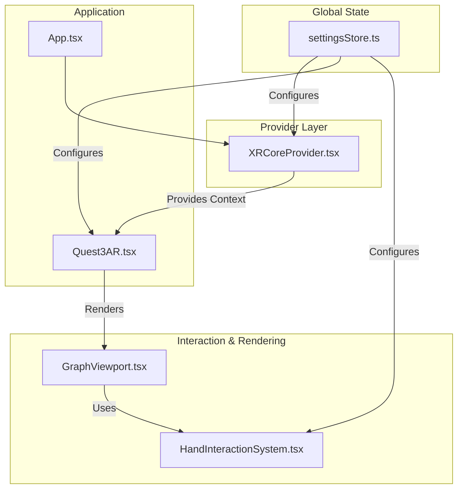

# WebXR Integration

*[Client](../index.md)*

This document details the architecture and implementation of the WebXR system, focusing on its provider-based state management, hand interaction system, and specific optimisations for the Meta Quest 3.

## Architecture

The XR system is built upon a provider pattern, ensuring that XR state and session management are handled in a centralized and predictable way.



### Core Component: `XRCoreProvider.tsx`

The `XRCoreProvider` is the heart of the XR system. It is a React Context Provider that wraps the application and manages all aspects of the WebXR session.

-   **Source**: [`client/src/features/xr/providers/XRCoreProvider.tsx`](../../client/src/features/xr/providers/XRCoreProvider.tsx)
-   **Purpose**: To abstract the complexities of the WebXR API and provide a clean, hook-based interface (`useXRCore`) for components to interact with the XR session.
-   **Responsibilities**:
    -   Detecting if the browser is WebXR-capable.
    -   Managing the XR session lifecycle (`startSession`, `endSession`).
    -   Providing real-time session state (e.g., `isSessionActive`, `sessionType`).
    -   Handling and exposing controller and hand tracking data.
    -   Subscribing to XR events and notifying the application.

### Hand Interaction: `HandInteractionSystem.tsx`

This system is responsible for processing raw hand tracking data into meaningful gestures and interactions.

-   **Source**: [`client/src/features/xr/systems/HandInteractionSystem.tsx`](../../client/src/features/xr/systems/HandInteractionSystem.tsx)
-   **Gesture Recognition**: It contains the logic to detect gestures like `pinch` and `grab` by calculating the distances between specific hand joints (e.g., `thumb-tip` and `index-finger-tip`).
-   **Interaction Events**: When a gesture is recognized, it fires an interaction event (e.g., `select`, `squeeze`) that other components can listen to.
-   **Visualisation**: It includes logic to render a visual representation of the user's hands (joints and bones) for debugging and user feedback.

### Quest 3 AR Implementation: `Quest3AR.tsx`

This component serves as the primary entry point for the immersive AR experience, specifically tailored for the Meta Quest 3.

-   **Source**: [`client/src/app/Quest3AR.tsx`](../../client/src/app/Quest3AR.tsx)
-   **Optimised Rendering Loop**: It uses a `requestAnimationFrame` loop to render the scene at the Quest 3's native refresh rate (72Hz), ensuring smooth performance.
-   **AR Passthrough**: It configures the R3F `Canvas` with a transparent background (`gl={{ alpha: true }}`) to enable video passthrough, blending the virtual graph with the user's real environment.
-   **Session Management**: It uses the `useXRCore` hook to automatically start the `immersive-ar` session when the component mounts.
-   **Centralised Data**: It connects to the `graphDataManager` and `webSocketService` to receive and render real-time graph data within the AR scene.

**Example: Auto-starting the AR session in `Quest3AR.tsx`**
```typescript
// client/src/app/Quest3AR.tsx

const Quest3AR: React.FC = () => {
  const { isSessionActive, startSession } = useXRCore();

  // Auto-start AR session if conditions are met
  useEffect(() => {
    const initialiseAR = async () => {
      // ... device detection ...
      try {
        if (!isSessionActive) {
          // Uses the startSession method from the provider
          await startSession('immersive-ar');
        }
        // ...
      } catch (error) {
        logger.error('Failed to initialise Quest 3 AR:', error);
      }
    };

    initialiseAR();
  }, [isSessionActive, startSession]);

  // ... rendering logic ...
};
```

## Settings Integration

The entire XR system is highly configurable through the global `settingsStore`. Components listen for changes in the `xr` section of the settings and adapt their behaviour accordingly.

-   **Source**: [`client/src/store/settingsStore.ts`](../../client/src/store/settingsStore.ts)
-   **Access**: Components use the `useSettingsStore` hook to get the latest XR settings.
-   **Key Settings**:
    -   `xr.enabled`: A server-side flag to enable or disable the XR feature entirely.
    -   `xr.clientSideEnableXR`: A client-side toggle allowing the user to opt-in or out of XR.
    -   `xr.enableHandTracking`: Toggles the hand interaction system.
    -   `xr.passthroughOpacity`: Controls the transparency of the real-world view in AR mode.

**Example: Using settings to configure the `HandInteractionSystem`**
```typescript
// client/src/features/xr/systems/HandInteractionSystem.tsx

const HandInteractionSystem: React.FC<HandInteractionSystemProps> = ({ enabled = true }) => {
  const settings = useSettingsStore(state => state.settings?.xr);
  // The system is only active if both the component prop AND the global setting are true.
  const handTrackingEnabled = settings?.enableHandTracking && enabled;

  // ...
};
```

## Related Topics

- [Client Architecture](../client/architecture.md)
- [Client Core Utilities and Hooks](../client/core.md)
- [Client Rendering System](../client/rendering.md)
- [Client TypeScript Types](../client/types.md)
- [Client side DCO](../archive/legacy/old_markdown/Client side DCO.md)
- [Client-Side visualisation Concepts](../client/visualization.md)
- [Command Palette](../client/command-palette.md)
- [GPU-Accelerated Analytics](../client/features/gpu-analytics.md)
- [Getting Started with VisionFlow](../getting-started.md)
- [Graph System](../client/graph-system.md)
- [Help System](../client/help-system.md)
- [Onboarding System](../client/onboarding.md)
- [Parallel Graphs Feature](../client/parallel-graphs.md)
- [RGB and Client Side Validation](../archive/legacy/old_markdown/RGB and Client Side Validation.md)
- [Settings Panel](../client/settings-panel.md)
- [State Management](../client/state-management.md)
- [UI Component Library](../client/ui-components.md)
- [User Controls Summary - Settings Panel](../client/user-controls-summary.md)
- [VisionFlow Client Documentation](../client/index.md)
- [WebSocket Communication](../client/websocket.md)
