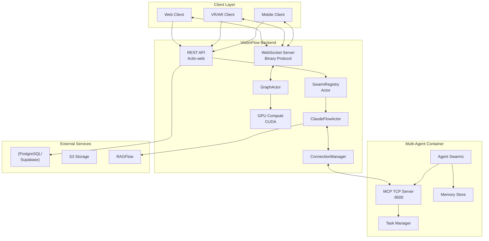
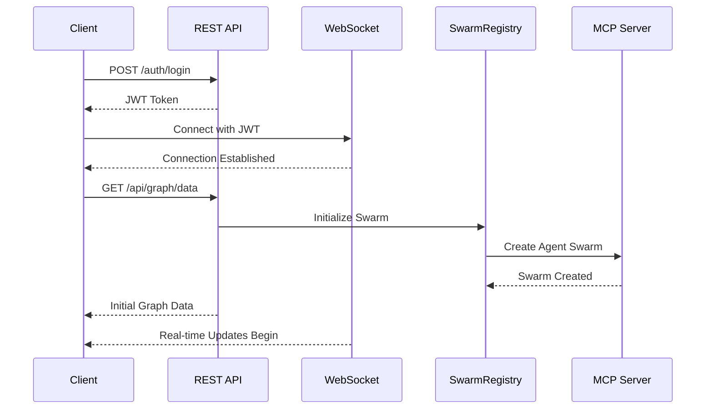
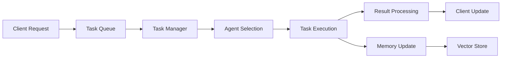

# System Overview

VisionFlow is a comprehensive platform for real-time knowledge graph visualisation and multi-agent AI orchestration. This document provides a complete overview of the system architecture, components, and their interactions.

## Architecture Overview

The system follows a distributed, container-based architecture with clear separation of concerns:



## Core Components

### 1. Client Layer

#### Web Client (TypeScript/React)
- **3D Visualisation**: WebGL/WebXR-based graph rendering
- **Real-time Updates**: WebSocket connection for live data
- **Responsive UI**: React-based interface with Tailwind CSS
- **VR/AR Support**: WebXR API integration for immersive experiences

#### Communication Patterns
- **REST API**: Initial data loading, authentication, configuration
- **WebSocket**: Real-time position updates, voice streaming, control messages
- **Binary Protocol**: 34-byte wire format for efficient data transfer

### 2. VisionFlow Backend (Rust)

#### REST API Handler
- **Framework**: Actix-web with async/await
- **Endpoints**: Graph data, settings, agent management
- **Authentication**: JWT-based with middleware protection
- **Rate Limiting**: Configurable per-endpoint limits

#### WebSocket Infrastructure
- **Binary Protocol**: Custom 34-byte format for node updates
- **Compression**: Selective GZIP for messages >256 bytes
- **Performance**: 5Hz update rate, <10ms latency
- **Features**: Heartbeat monitoring, automatic reconnection

#### Actor System
The backend uses Actix actors for concurrent processing:

- **SwarmRegistry**: Manages swarm lifecycle and client mappings
- **ClaudeFlowActor**: Handles MCP communication and agent coordination
- **GraphActor**: Manages graph state and GPU physics
- **SettingsActor**: Handles configuration with path-based access

#### GPU Compute Engine
- **Language**: CUDA C++ with PTX compilation
- **Algorithms**: Force-directed layout, SSSP computation
- **Performance**: 60 FPS with thousands of nodes
- **Features**: Dynamic buffer sizing, stability gates

### 3. Multi-Agent Container

#### MCP TCP Server
- **Protocol**: JSON-RPC 2.0 over TCP
- **Port**: 9500 (internal network)
- **Features**: Persistent connections, authentication
- **Tools**: Agent management, task execution, memory access

#### Agent System
- **Framework**: claude-flow for agent orchestration
- **Patterns**: Swarm coordination, hierarchical task distribution
- **Memory**: Persistent storage with vector search
- **Types**: Specialized agents (coder, researcher, reviewer, etc.)

### 4. Data Storage

#### PostgreSQL/Supabase
- **User Settings**: Path-based storage with versioning
- **Graph Metadata**: Node and edge information
- **Agent Memory**: Conversation history and context
- **Real-time**: Supabase subscriptions for live updates

#### S3 Compatible Storage
- **Binary Assets**: Images, documents, generated content
- **Backups**: System state snapshots
- **CDN Integration**: Fast global content delivery

## Data Flow Patterns

### 1. Initial Connection Flow



### 2. Real-time Update Flow

The system maintains 60 FPS visualisation through efficient data flow:

1. **GPU Physics Calculation** (16.67ms cycle)
   - Force computation in CUDA kernels
   - Position integration
   - Collision detection

2. **Binary Encoding** (<1ms)
   - 34-byte wire format per node
   - Batch updates for efficiency

3. **WebSocket Transmission** (~5ms)
   - Binary frames
   - Priority queuing for agent nodes

4. **Client Rendering** (<10ms)
   - WebGL buffer updates
   - Selective bloom effects
   - VR/AR transformation

### 3. Agent Task Execution



## System Characteristics

### Performance Metrics
- **Latency**: <10ms end-to-end for position updates
- **Throughput**: 300 updates/second per client
- **Scalability**: 50+ concurrent swarms tested
- **GPU Efficiency**: 95%+ utilisation during physics
- **Network**: 84.8% bandwidth reduction vs JSON

### Reliability Features
- **Connection Recovery**: Exponential backoff reconnection
- **State Persistence**: Automatic state snapshots
- **Graceful Degradation**: Continues with cached data
- **Error Boundaries**: Component-level error isolation
- **Health Monitoring**: Automated health checks

### Security Model
- **Authentication**: JWT with refresh tokens
- **Authorisation**: Role-based access control
- **Input Validation**: Comprehensive sanitisation
- **Rate Limiting**: Adaptive per-client limits
- **Encryption**: TLS for all external communication

## Development and Deployment

### Container Architecture
```yaml
services:
  visionflow:
    - Rust backend with Actix
    - GPU support via CUDA
    - WebSocket server
    
  multi-agent:
    - Node.js MCP server
    - Python agent runners
    - Memory persistence
    
  postgres:
    - User data
    - Settings storage
    - Graph metadata
    
  nginx:
    - Reverse proxy
    - Load balancing
    - SSL termination
```

### Environment Configuration
- **Development**: Hot reload, verbose logging, GPU debug mode
- **Production**: Optimised builds, minimal logging, monitoring
- **Testing**: Isolated containers, mock services

## Future Architecture Considerations

### Planned Enhancements
1. **Horizontal Scaling**: Multi-instance backend with Redis coordination
2. **Edge Computing**: WebAssembly for client-side physics
3. **Federation**: Cross-instance agent communication
4. **Event Sourcing**: Complete audit trail and time travel

### Research Areas
- Quantum-inspired algorithms for graph layout
- Neuromorphic computing integration
- Blockchain-based agent reputation
- Homomorphic encryption for private compute

## Conclusion

VisionFlow represents a cutting-edge architecture that successfully combines:
- High-performance Rust backend
- GPU-accelerated computation
- Real-time WebSocket communication
- Distributed AI agent orchestration
- Immersive AR/VR visualisation

The system's modular design, comprehensive monitoring, and robust error handling make it suitable for both research applications and production deployments.