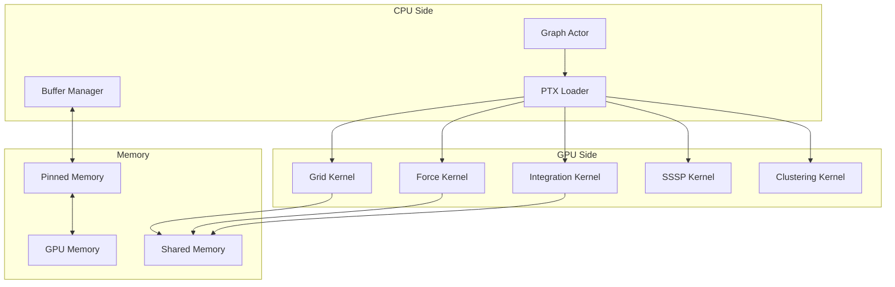

# GPU Compute Architecture

VisionFlow leverages GPU acceleration to enable real-time physics simulation and graph algorithms for thousands of nodes. This document details the CUDA architecture, algorithms, and optimisation strategies employed.

## Overview

The GPU compute engine provides:
- Real-time force-directed graph layout at 60 FPS
- Hybrid CPU/GPU shortest path algorithms
- Dynamic spatial hashing for collision detection
- Parallel constraint satisfaction
- Visual analytics and clustering



## Core Architecture

### 1. CUDA Kernel Design

The system implements several specialized CUDA kernels:

```cuda
// Force calculation kernel
__global__ void force_pass_kernel(
    float* pos_x, float* pos_y, float* pos_z,
    float* force_out_x, float* force_out_y, float* force_out_z,
    int* cell_offsets, int* particle_indices,
    float* cell_bounds, GridConfig config,
    SimulationParams params, int num_particles
) {
    int idx = blockIdx.x * blockDim.x + threadIdx.x;
    if (idx >= num_particles) return;
    
    // Load particle position
    float3 pos = make_float3(pos_x[idx], pos_y[idx], pos_z[idx]);
    float3 total_force = make_float3(0.0f, 0.0f, 0.0f);
    
    // Calculate cell coordinates
    int3 cell_coords = calculate_cell(pos, config);
    
    // Neighbor iteration with spatial hashing
    for (int dx = -1; dx <= 1; dx++) {
        for (int dy = -1; dy <= 1; dy++) {
            for (int dz = -1; dz <= 1; dz++) {
                int3 neighbour = make_int3(
                    cell_coords.x + dx,
                    cell_coords.y + dy,
                    cell_coords.z + dz
                );
                
                if (is_valid_cell(neighbour, config)) {
                    process_cell_particles(
                        idx, pos, neighbour, 
                        pos_x, pos_y, pos_z,
                        &total_force, params
                    );
                }
            }
        }
    }
    
    // Apply stability gate (prevents micro-movements)
    float force_magnitude = length(total_force);
    if (force_magnitude > FORCE_THRESHOLD) {
        force_out_x[idx] = total_force.x;
        force_out_y[idx] = total_force.y;
        force_out_z[idx] = total_force.z;
    } else {
        force_out_x[idx] = 0.0f;
        force_out_y[idx] = 0.0f;
        force_out_z[idx] = 0.0f;
    }
}
```

### 2. Memory Management

#### Unified Memory Architecture
```cuda
// Optimized memory layout for coalesced access
struct ParticleData {
    float4 position;     // xyz + padding
    float4 velocity;     // xyz + padding
    float4 force;        // xyz + padding
    int4 metadata;       // type, flags, cell_id, padding
};

// Shared memory for block-level computation
__shared__ ParticleData shared_particles[BLOCK_SIZE];
```

#### Dynamic Buffer Management
```rust
// Rust-side buffer management
pub struct GPUBufferManager {
    position_buffer: CudaBuffer<f32>,
    velocity_buffer: CudaBuffer<f32>,
    force_buffer: CudaBuffer<f32>,
    
    // Dynamic resizing
    pub fn resize_if_needed(&mut self, particle_count: usize) {
        let required_size = particle_count * 3; // xyz components
        
        if required_size > self.position_buffer.capacity() {
            let new_capacity = (required_size as f32 * 1.5) as usize;
            self.resize_buffers(new_capacity);
        }
    }
}
```

### 3. Spatial Hashing

The system uses a 3D spatial hash grid for efficient neighbour queries:

```cuda
// Grid configuration
struct GridConfig {
    float cell_size;
    int3 grid_dimensions;
    float3 grid_origin;
    int max_particles_per_cell;
};

// Cell assignment kernel
__global__ void build_grid_kernel(
    float* pos_x, float* pos_y, float* pos_z,
    int* cell_offsets, int* particle_indices,
    GridConfig config, int num_particles
) {
    int idx = blockIdx.x * blockDim.x + threadIdx.x;
    if (idx >= num_particles) return;
    
    // Calculate cell index
    float3 pos = make_float3(pos_x[idx], pos_y[idx], pos_z[idx]);
    int3 cell = calculate_cell(pos, config);
    int cell_idx = flatten_cell_index(cell, config);
    
    // Atomic insertion into cell
    int offset = atomicAdd(&cell_offsets[cell_idx], 1);
    if (offset < config.max_particles_per_cell) {
        int insert_idx = cell_idx * config.max_particles_per_cell + offset;
        particle_indices[insert_idx] = idx;
    }
}
```

## Advanced Algorithms

### 1. Hybrid CPU/GPU SSSP (Single Source Shortest Path)

Implementation of the "Breaking the O(m√n) Barrier" algorithm:

```rust
// CPU-side coordinator
pub struct HybridSSSP {
    gpu_kernels: GPUKernels,
    wasm_controller: WasmController,
    adaptive_heap: AdaptiveHeap,
}

impl HybridSSSP {
    pub async fn compute_sssp(&mut self, source: NodeId) -> Result<Distances> {
        // Phase 1: Initial GPU exploration
        let initial_distances = self.gpu_kernels
            .parallel_dijkstra(source, self.k_nearest).await?;
        
        // Phase 2: Find pivots using WASM
        let pivots = self.wasm_controller
            .find_pivots(&initial_distances).await?;
        
        // Phase 3: Recursive BMSSP
        self.recursive_bmssp(source, &pivots).await
    }
    
    async fn recursive_bmssp(
        &mut self, 
        source: NodeId, 
        pivots: &[NodeId]
    ) -> Result<Distances> {
        if pivots.len() <= RECURSION_THRESHOLD {
            return self.gpu_kernels.brute_force_sssp(source, pivots).await;
        }
        
        // Divide into subproblems
        let (left_pivots, right_pivots) = self.partition_pivots(pivots);
        
        // Recursive calls
        let (left_dist, right_dist) = tokio::join!(
            self.recursive_bmssp(source, &left_pivots),
            self.recursive_bmssp(source, &right_pivots)
        );
        
        // Merge results
        self.merge_distances(left_dist?, right_dist?)
    }
}
```

### 2. Force-Directed Layout

The physics engine implements a modified Fruchterman-Reingold algorithm:

```cuda
__device__ float3 calculate_spring_force(
    float3 pos_a, float3 pos_b, 
    float rest_length, float spring_k
) {
    float3 delta = pos_b - pos_a;
    float distance = length(delta);
    
    if (distance < EPSILON) return make_float3(0.0f);
    
    float3 direction = delta / distance;
    float displacement = distance - rest_length;
    
    return direction * (displacement * spring_k);
}

__device__ float3 calculate_repulsion_force(
    float3 pos_a, float3 pos_b,
    float repel_k, float min_distance
) {
    float3 delta = pos_b - pos_a;
    float distance = length(delta);
    
    if (distance < min_distance) distance = min_distance;
    
    float3 direction = delta / distance;
    float force_magnitude = repel_k / (distance * distance);
    
    return -direction * force_magnitude;
}
```

### 3. Stress Majorization

Advanced layout optimisation using stress majorisation:

```rust
// GPU-accelerated stress majorisation
pub struct StressMajorisation {
    target_distances: CudaMatrix<f32>,
    weights: CudaMatrix<f32>,
    positions: CudaBuffer<f32>,
}

impl StressMajorisation {
    pub async fn optimise(&mut self, iterations: usize) -> Result<()> {
        for _ in 0..iterations {
            // Compute stress gradient
            let gradient = self.compute_stress_gradient().await?;
            
            // Line search for optimal step
            let step_size = self.line_search(&gradient).await?;
            
            // Update positions
            self.update_positions(&gradient, step_size).await?;
            
            // Check convergence
            if self.has_converged(&gradient) {
                break;
            }
        }
        Ok(())
    }
}
```

## Performance Optimisations

### 1. Warp-Level Primitives

```cuda
// Warp-level reduction for force accumulation
__device__ float3 warp_reduce_force(float3 force) {
    #pragma unroll
    for (int offset = warpSize/2; offset > 0; offset /= 2) {
        force.x += __shfl_down_sync(0xffffffff, force.x, offset);
        force.y += __shfl_down_sync(0xffffffff, force.y, offset);
        force.z += __shfl_down_sync(0xffffffff, force.z, offset);
    }
    return force;
}
```

### 2. Texture Memory Usage

```cuda
// Texture memory for read-only data
texture<float4, cudaTextureType1D, cudaReadModeElementType> pos_texture;

__device__ float3 fetch_position_texture(int idx) {
    float4 pos = tex1Dfetch(pos_texture, idx);
    return make_float3(pos.x, pos.y, pos.z);
}
```

### 3. Stream-Based Execution

```rust
// Overlapping computation and memory transfer
pub async fn execute_physics_step(&mut self) -> Result<()> {
    // Create CUDA streams
    let compute_stream = self.cuda.create_stream()?;
    let transfer_stream = self.cuda.create_stream()?;
    
    // Async kernel launches
    self.launch_grid_build(&compute_stream).await?;
    self.launch_force_calculation(&compute_stream).await?;
    
    // Overlap position integration with force transfer
    tokio::join!(
        self.launch_integration(&compute_stream),
        self.transfer_results(&transfer_stream)
    );
    
    Ok(())
}
```

## Stability and Safety

### 1. Stability Gates

Prevent unnecessary computation when system is stable:

```cuda
__global__ void check_stability_kernel(
    float* velocities, float* kinetic_energy,
    int num_particles, float threshold
) {
    __shared__ float shared_ke[BLOCK_SIZE];
    
    int tid = threadIdx.x;
    int idx = blockIdx.x * blockDim.x + tid;
    
    // Calculate local kinetic energy
    float local_ke = 0.0f;
    if (idx < num_particles) {
        float3 vel = make_float3(
            velocities[idx * 3],
            velocities[idx * 3 + 1],
            velocities[idx * 3 + 2]
        );
        local_ke = 0.5f * dot(vel, vel);
    }
    
    shared_ke[tid] = local_ke;
    __syncthreads();
    
    // Block-level reduction
    for (int s = blockDim.x / 2; s > 0; s >>= 1) {
        if (tid < s) {
            shared_ke[tid] += shared_ke[tid + s];
        }
        __syncthreads();
    }
    
    // Write block result
    if (tid == 0) {
        atomicAdd(kinetic_energy, shared_ke[0]);
    }
}
```

### 2. Memory Bounds Checking

```rust
// Safe GPU memory access
pub struct SafeGPUBuffer<T> {
    data: CudaBuffer<T>,
    size: usize,
    max_size: usize,
}

impl<T> SafeGPUBuffer<T> {
    pub fn check_bounds(&self, index: usize) -> Result<()> {
        if index >= self.size {
            return Err(Error::OutOfBounds { index, size: self.size });
        }
        Ok(())
    }
    
    pub fn resize(&mut self, new_size: usize) -> Result<()> {
        if new_size > self.max_size {
            return Err(Error::ExceedsMaxSize { 
                requested: new_size, 
                max: self.max_size 
            });
        }
        
        // Safe reallocation with data preservation
        let mut new_buffer = CudaBuffer::new(new_size)?;
        new_buffer.copy_from_slice(&self.data[..self.size.min(new_size)])?;
        self.data = new_buffer;
        self.size = new_size;
        
        Ok(())
    }
}
```

## Visual Analytics

### 1. GPU-Accelerated Clustering

```cuda
__global__ void kmeans_assignment_kernel(
    float* positions, float* centroids,
    int* assignments, int num_particles, int k
) {
    int idx = blockIdx.x * blockDim.x + threadIdx.x;
    if (idx >= num_particles) return;
    
    float3 pos = make_float3(
        positions[idx * 3],
        positions[idx * 3 + 1],
        positions[idx * 3 + 2]
    );
    
    float min_dist = INFINITY;
    int best_cluster = 0;
    
    for (int c = 0; c < k; c++) {
        float3 centroid = make_float3(
            centroids[c * 3],
            centroids[c * 3 + 1],
            centroids[c * 3 + 2]
        );
        
        float dist = distance(pos, centroid);
        if (dist < min_dist) {
            min_dist = dist;
            best_cluster = c;
        }
    }
    
    assignments[idx] = best_cluster;
}
```

### 2. Anomaly Detection

```cuda
__global__ void anomaly_detection_kernel(
    float* positions, float* velocities,
    int* anomaly_flags, AnomalyParams params,
    int num_particles
) {
    int idx = blockIdx.x * blockDim.x + threadIdx.x;
    if (idx >= num_particles) return;
    
    // Check position bounds
    float3 pos = make_float3(
        positions[idx * 3],
        positions[idx * 3 + 1],
        positions[idx * 3 + 2]
    );
    
    if (length(pos) > params.position_threshold) {
        atomicOr(&anomaly_flags[idx], POSITION_ANOMALY);
    }
    
    // Check velocity bounds
    float3 vel = make_float3(
        velocities[idx * 3],
        velocities[idx * 3 + 1],
        velocities[idx * 3 + 2]
    );
    
    if (length(vel) > params.velocity_threshold) {
        atomicOr(&anomaly_flags[idx], VELOCITY_ANOMALY);
    }
}
```

## Performance Monitoring

### GPU Profiling Integration
```rust
pub struct GPUProfiler {
    events: HashMap<String, CudaEvent>,
    timings: HashMap<String, f32>,
}

impl GPUProfiler {
    pub async fn profile_kernel<F>(&mut self, name: &str, f: F) -> Result<()> 
    where
        F: FnOnce() -> Result<()>
    {
        let start = self.cuda.create_event()?;
        let end = self.cuda.create_event()?;
        
        self.cuda.record_event(&start)?;
        f()?;
        self.cuda.record_event(&end)?;
        
        self.cuda.synchronise()?;
        
        let elapsed = self.cuda.elapsed_time(&start, &end)?;
        self.timings.insert(name.to_string(), elapsed);
        
        Ok(())
    }
}
```

## Future Directions

### 1. Multi-GPU Support
- Data partitioning strategies
- Inter-GPU communication
- Load balancing algorithms

### 2. Neural Network Integration
- Graph neural networks for layout
- Learned force functions
- Adaptive parameters

### 3. Quantum-Inspired Algorithms
- Quantum annealing for optimisation
- Superposition states for exploration
- Entanglement-based clustering

## Conclusion

The GPU compute architecture in VisionFlow represents a sophisticated approach to real-time graph visualisation and analysis. By combining traditional physics simulation with cutting-edge algorithms like hybrid SSSP and leveraging modern GPU features, the system achieves exceptional performance while maintaining stability and safety. The architecture's modular design allows for future enhancements and adaptation to emerging GPU technologies.