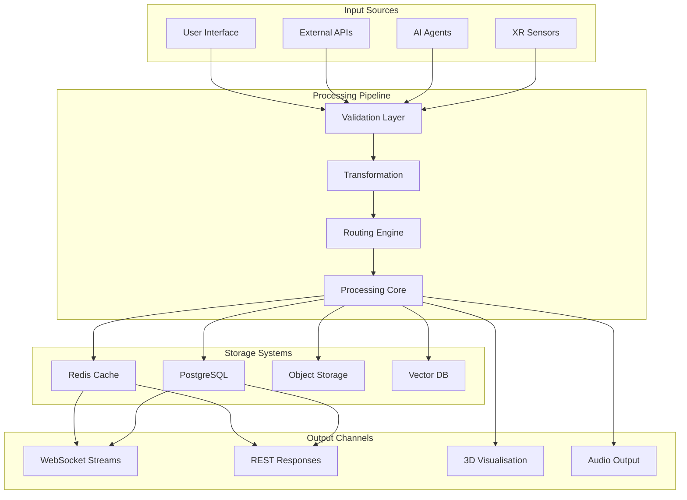
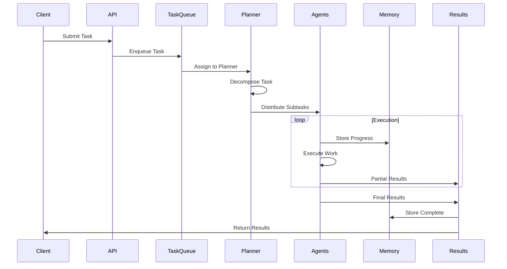

# Data Flow Patterns

Understanding how data flows through VisionFlow is essential for effective system design and troubleshooting. This document details the various data pathways, processing stages, and synchronisation mechanisms.

## Data Flow Overview

VisionFlow processes multiple types of data through distinct but interconnected pipelines:



## Core Data Types

### 1. Graph Data

Graph data represents the knowledge network structure:

```rust
// Node data structure
#[derive(Serialize, Deserialize, Clone)]
pub struct NodeData {
    pub id: NodeId,
    pub node_type: NodeType,
    pub title: String,
    pub content: Option<String>,
    pub position: Vector3,
    pub velocity: Vector3,
    pub metadata: HashMap<String, Value>,
    pub connections: Vec<EdgeReference>,
    pub last_modified: SystemTime,
}

// Edge data structure
#[derive(Serialize, Deserialize, Clone)]
pub struct EdgeData {
    pub id: EdgeId,
    pub source: NodeId,
    pub target: NodeId,
    pub edge_type: EdgeType,
    pub weight: f32,
    pub metadata: HashMap<String, Value>,
}

// Graph update flow
pub async fn process_graph_update(update: GraphUpdate) -> Result<()> {
    // Validation
    validate_graph_update(&update)?;
    
    // Transform coordinates if needed
    let transformed = transform_coordinates(update)?;
    
    // Update physics simulation
    PHYSICS_ENGINE.update_graph(transformed.clone()).await?;
    
    // Persist to database
    DATABASE.save_graph_state(transformed.clone()).await?;
    
    // Broadcast to clients
    WEBSOCKET_MANAGER.broadcast_update(transformed).await?;
    
    Ok(())
}
```

### 2. Agent Data

Agent system data flows through specialized channels:

```typescript
// Agent message flow
interface AgentMessage {
  id: string;
  agentId: string;
  swarmId: string;
  type: AgentMessageType;
  content: any;
  timestamp: number;
  correlationId?: string;
}

enum AgentMessageType {
  TASK_ASSIGNED = 'task_assigned',
  TASK_PROGRESS = 'task_progress',
  TASK_COMPLETED = 'task_completed',
  COLLABORATION_REQUEST = 'collaboration_request',
  KNOWLEDGE_SHARE = 'knowledge_share',
  ERROR = 'error'
}

// Agent data processing pipeline
class AgentDataProcessor {
  async processMessage(message: AgentMessage): Promise<void> {
    // Route based on message type
    switch (message.type) {
      case AgentMessageType.TASK_COMPLETED:
        await this.handleTaskCompletion(message);
        break;
        
      case AgentMessageType.KNOWLEDGE_SHARE:
        await this.handleKnowledgeShare(message);
        break;
        
      case AgentMessageType.COLLABORATION_REQUEST:
        await this.handleCollaborationRequest(message);
        break;
    }
    
    // Update visualisation
    await this.updateAgentVisualisation(message);
    
    // Store in memory bank
    await this.storeInMemoryBank(message);
  }
}
```

### 3. Settings Data

Settings flow through a sophisticated synchronisation system:

```rust
// Settings update flow
pub struct SettingsDataFlow {
    path_registry: PathRegistry,
    delta_tracker: DeltaTracker,
    sync_manager: SyncManager,
}

impl SettingsDataFlow {
    pub async fn process_settings_update(
        &mut self,
        path: &str,
        value: Value,
        client_id: ClientId
    ) -> Result<()> {
        // Validate path and value
        self.validate_setting(path, &value)?;
        
        // Apply update locally
        let old_value = self.apply_update(path, value.clone()).await?;
        
        // Calculate delta
        let delta = Delta {
            path: path.to_string(),
            old_value,
            new_value: value,
            timestamp: SystemTime::now(),
            client_id,
        };
        
        // Persist to database
        self.persist_delta(&delta).await?;
        
        // Broadcast to other clients
        self.broadcast_delta(&delta).await?;
        
        Ok(())
    }
}
```

## Real-Time Data Streams

### 1. Position Update Stream

The highest frequency data stream for graph visualisation:

```rust
// GPU to Client data flow
pub struct PositionUpdateStream {
    gpu_buffer: Arc<Mutex<GPUBuffer>>,
    encoder: BinaryEncoder,
    websocket_manager: WebSocketManager,
}

impl PositionUpdateStream {
    pub async fn stream_loop(&mut self) {
        let mut interval = interval(Duration::from_millis(16)); // 60 FPS
        
        loop {
            interval.tick().await;
            
            // Get latest positions from GPU
            let positions = self.gpu_buffer.lock().await.get_positions();
            
            // Encode to binary format
            let binary_data = self.encoder.encode_positions(&positions);
            
            // Broadcast to all connected clients
            self.websocket_manager
                .broadcast_binary(MessageType::PositionUpdate, binary_data)
                .await;
        }
    }
}
```

### 2. Voice Data Stream

Real-time audio processing pipeline with dual implementation (centralised + legacy):

```rust
// Voice data flow
pub struct VoiceDataFlow {
    opus_encoder: OpusEncoder,
    whisper_decoder: WhisperDecoder,
    audio_buffer: RingBuffer<f32>,
}

impl VoiceDataFlow {
    pub async fn process_audio_frame(
        &mut self,
        pcm_data: &[f32],
        client_id: ClientId
    ) -> Result<()> {
        // Buffer audio data
        self.audio_buffer.push_slice(pcm_data);
        
        // Encode with Opus
        let opus_frame = self.opus_encoder.encode(pcm_data)?;
        
        // Broadcast to other clients
        self.broadcast_voice(client_id, opus_frame).await?;
        
        // Check for complete utterance
        if self.is_utterance_complete() {
            let utterance = self.audio_buffer.drain_all();
            
            // Transcribe with Whisper
            let transcript = self.whisper_decoder
                .transcribe(&utterance).await?;
            
            // Process voice command
            self.process_voice_command(transcript, client_id).await?;
        }
        
        Ok(())
    }
}
```

### 3. SSSP Update Stream

Shortest path data for navigation:

```rust
// SSSP data flow
pub struct SSSPDataFlow {
    gpu_sssp: Arc<Mutex<GPUSSSP>>,
    update_frequency: Duration,
}

impl SSSPDataFlow {
    pub async fn compute_and_stream(&mut self, source_node: NodeId) {
        // Compute SSSP on GPU
        let distances = self.gpu_sssp.lock().await
            .compute_from_source(source_node).await?;
        
        // Extract paths
        let paths = self.extract_shortest_paths(&distances);
        
        // Encode path data
        let encoded = self.encode_paths(&paths);
        
        // Stream to clients
        self.stream_paths(encoded).await?;
    }
}
```

## Data Processing Pipelines

### 1. Task Execution Pipeline

How tasks flow through the agent system:



### 2. Graph Update Pipeline

Processing graph modifications:

```rust
pub struct GraphUpdatePipeline {
    validator: GraphValidator,
    physics: PhysicsEngine,
    persistence: GraphPersistence,
    broadcaster: UpdateBroadcaster,
}

impl GraphUpdatePipeline {
    pub async fn process_update(&mut self, update: GraphUpdate) -> Result<()> {
        // Stage 1: Validation
        let validated = self.validator.validate(update)?;
        
        // Stage 2: Physics pre-processing
        let physics_ready = self.physics.prepare_update(validated)?;
        
        // Stage 3: Apply update
        let result = match physics_ready {
            GraphUpdate::AddNode(node) => {
                self.add_node_pipeline(node).await?
            }
            GraphUpdate::RemoveNode(id) => {
                self.remove_node_pipeline(id).await?
            }
            GraphUpdate::UpdateEdge(edge) => {
                self.update_edge_pipeline(edge).await?
            }
        };
        
        // Stage 4: Persist changes
        self.persistence.save(result.clone()).await?;
        
        // Stage 5: Broadcast update
        self.broadcaster.send(result).await?;
        
        Ok(())
    }
}
```

### 3. Memory Storage Pipeline

Agent memory persistence flow:

```typescript
class MemoryStoragePipeline {
  private vectorDB: VectorDatabase;
  private embeddingModel: EmbeddingModel;
  private compressionEngine: CompressionEngine;
  
  async storeMemory(memory: AgentMemory): Promise<void> {
    // Stage 1: Generate embeddings
    const embedding = await this.embeddingModel.embed(memory.content);
    
    // Stage 2: Compress if needed
    const compressed = memory.content.length > COMPRESSION_THRESHOLD
      ? await this.compressionEngine.compress(memory.content)
      : memory.content;
    
    // Stage 3: Prepare metadata
    const metadata = {
      agentId: memory.agentId,
      timestamp: memory.timestamp,
      type: memory.type,
      importance: this.calculateImportance(memory),
      compressed: memory.content.length > COMPRESSION_THRESHOLD
    };
    
    // Stage 4: Store in vector DB
    await this.vectorDB.upsert({
      id: memory.id,
      vector: embedding,
      content: compressed,
      metadata
    });
    
    // Stage 5: Update indices
    await this.updateMemoryIndices(memory);
  }
}
```

## Synchronisation Patterns

### 1. Optimistic Updates

Client-side updates with server reconciliation:

```typescript
class OptimisticUpdateManager {
  private pendingUpdates: Map<string, PendingUpdate> = new Map();
  
  async applyOptimisticUpdate(update: Update): Promise<void> {
    // Apply immediately on client
    this.applyLocal(update);
    
    // Track pending state
    const pending: PendingUpdate = {
      id: generateId(),
      update,
      localTimestamp: Date.now(),
      retryCount: 0
    };
    
    this.pendingUpdates.set(pending.id, pending);
    
    try {
      // Send to server
      const result = await this.sendToServer(update);
      
      // Reconcile if needed
      if (result.conflicted) {
        await this.reconcile(pending, result);
      }
      
      // Clean up
      this.pendingUpdates.delete(pending.id);
      
    } catch (error) {
      // Rollback on failure
      await this.rollback(pending);
    }
  }
  
  private async reconcile(
    pending: PendingUpdate,
    serverResult: ServerResult
  ): Promise<void> {
    // Determine winner (last-write-wins, server priority, etc.)
    const resolution = this.resolveConflict(pending, serverResult);
    
    // Apply resolution
    this.applyLocal(resolution);
    
    // Notify user if their change was overridden
    if (resolution !== pending.update) {
      this.notifyConflictResolution(pending, resolution);
    }
  }
}
```

### 2. Event Sourcing

Maintaining complete history of changes:

```rust
// Event sourcing for graph changes
#[derive(Serialize, Deserialize)]
pub enum GraphEvent {
    NodeAdded { node: NodeData, timestamp: SystemTime },
    NodeRemoved { id: NodeId, timestamp: SystemTime },
    NodeMoved { id: NodeId, from: Vector3, to: Vector3, timestamp: SystemTime },
    EdgeCreated { edge: EdgeData, timestamp: SystemTime },
    EdgeDeleted { id: EdgeId, timestamp: SystemTime },
    EdgeWeightChanged { id: EdgeId, old: f32, new: f32, timestamp: SystemTime },
}

pub struct EventStore {
    events: Vec<GraphEvent>,
    snapshots: HashMap<SystemTime, GraphSnapshot>,
}

impl EventStore {
    pub async fn append_event(&mut self, event: GraphEvent) -> Result<()> {
        // Store event
        self.events.push(event.clone());
        
        // Persist to database
        self.persist_event(&event).await?;
        
        // Create snapshot if needed
        if self.should_snapshot() {
            let snapshot = self.create_snapshot().await?;
            self.snapshots.insert(SystemTime::now(), snapshot);
        }
        
        Ok(())
    }
    
    pub async fn replay_to_time(&self, target_time: SystemTime) -> Result<Graph> {
        // Find nearest snapshot before target time
        let snapshot = self.find_nearest_snapshot(target_time);
        
        // Replay events from snapshot to target
        let mut graph = snapshot.to_graph();
        
        for event in &self.events {
            if event.timestamp() > snapshot.timestamp 
                && event.timestamp() <= target_time {
                graph.apply_event(event)?;
            }
        }
        
        Ok(graph)
    }
}
```

### 3. CRDT-Based Synchronisation

Conflict-free replicated data types for distributed state:

```rust
// CRDT for collaborative graph editing
pub struct CRDTGraph {
    nodes: HashMap<NodeId, LWWRegister<NodeData>>,
    edges: HashMap<EdgeId, LWWRegister<EdgeData>>,
    tombstones: GSet<ItemId>,
}

impl CRDTGraph {
    pub fn add_node(&mut self, node: NodeData, timestamp: HLCTimestamp) {
        let register = LWWRegister::new(node, timestamp);
        self.nodes.insert(node.id, register);
    }
    
    pub fn merge(&mut self, other: &CRDTGraph) {
        // Merge nodes
        for (id, register) in &other.nodes {
            match self.nodes.get_mut(id) {
                Some(local) => local.merge(register),
                None => { self.nodes.insert(*id, register.clone()); }
            }
        }
        
        // Merge edges
        for (id, register) in &other.edges {
            match self.edges.get_mut(id) {
                Some(local) => local.merge(register),
                None => { self.edges.insert(*id, register.clone()); }
            }
        }
        
        // Merge tombstones
        self.tombstones.merge(&other.tombstones);
    }
}
```

## Performance Optimisation

### 1. Data Batching

Efficient batch processing:

```rust
pub struct BatchProcessor<T> {
    batch_size: usize,
    timeout: Duration,
    buffer: Vec<T>,
    processor: Box<dyn Fn(Vec<T>) -> Result<()>>,
}

impl<T> BatchProcessor<T> {
    pub async fn add(&mut self, item: T) -> Result<()> {
        self.buffer.push(item);
        
        if self.buffer.len() >= self.batch_size {
            self.flush().await?;
        } else {
            self.schedule_flush();
        }
        
        Ok(())
    }
    
    async fn flush(&mut self) -> Result<()> {
        if self.buffer.is_empty() {
            return Ok(());
        }
        
        let batch = std::mem::take(&mut self.buffer);
        (self.processor)(batch)?;
        
        Ok(())
    }
}
```

### 2. Caching Strategies

Multi-level caching for different data types:

```rust
pub struct DataCache {
    l1_cache: LruCache<String, CachedItem>,  // Hot data
    l2_cache: Arc<Mutex<HashMap<String, CachedItem>>>,  // Warm data
    redis: RedisClient,  // Cold data
}

impl DataCache {
    pub async fn get(&mut self, key: &str) -> Option<Value> {
        // Check L1 (fastest)
        if let Some(item) = self.l1_cache.get(key) {
            if !item.is_expired() {
                return Some(item.value.clone());
            }
        }
        
        // Check L2
        if let Some(item) = self.l2_cache.lock().await.get(key) {
            if !item.is_expired() {
                // Promote to L1
                self.l1_cache.put(key.to_string(), item.clone());
                return Some(item.value.clone());
            }
        }
        
        // Check Redis
        if let Ok(Some(data)) = self.redis.get(key).await {
            let item = CachedItem::new(data);
            
            // Populate caches
            self.l2_cache.lock().await.insert(key.to_string(), item.clone());
            self.l1_cache.put(key.to_string(), item.clone());
            
            return Some(item.value);
        }
        
        None
    }
}
```

## Data Flow Monitoring

### Metrics Collection

```rust
pub struct DataFlowMetrics {
    message_counters: HashMap<MessageType, AtomicU64>,
    latency_histograms: HashMap<String, Histogram>,
    throughput_gauges: HashMap<String, AtomicF64>,
}

impl DataFlowMetrics {
    pub fn record_message(&self, msg_type: MessageType, size: usize) {
        // Increment counter
        self.message_counters
            .get(&msg_type)
            .map(|c| c.fetch_add(1, Ordering::Relaxed));
        
        // Update throughput
        let key = format!("{:?}_throughput", msg_type);
        if let Some(gauge) = self.throughput_gauges.get(&key) {
            let current = gauge.load(Ordering::Relaxed);
            gauge.store(current + size as f64, Ordering::Relaxed);
        }
    }
    
    pub fn record_latency(&self, operation: &str, duration: Duration) {
        if let Some(histogram) = self.latency_histograms.get(operation) {
            histogram.record(duration.as_micros() as u64);
        }
    }
}
```

## Error Handling and Recovery

### Dead Letter Queue

```rust
pub struct DeadLetterQueue<T> {
    queue: VecDeque<FailedItem<T>>,
    max_retries: usize,
    retry_delay: Duration,
}

struct FailedItem<T> {
    item: T,
    error: Error,
    retry_count: usize,
    first_failure: SystemTime,
}

impl<T> DeadLetterQueue<T> {
    pub async fn handle_failure(&mut self, item: T, error: Error) {
        let failed_item = FailedItem {
            item,
            error,
            retry_count: 0,
            first_failure: SystemTime::now(),
        };
        
        self.queue.push_back(failed_item);
        self.schedule_retry().await;
    }
    
    async fn retry_loop(&mut self) {
        while let Some(mut failed_item) = self.queue.pop_front() {
            if failed_item.retry_count >= self.max_retries {
                // Move to permanent failure storage
                self.store_permanent_failure(failed_item).await;
                continue;
            }
            
            // Exponential backoff
            let delay = self.retry_delay * 2u32.pow(failed_item.retry_count as u32);
            sleep(delay).await;
            
            match self.retry_item(&failed_item.item).await {
                Ok(_) => {
                    // Success - item processed
                }
                Err(e) => {
                    failed_item.retry_count += 1;
                    failed_item.error = e;
                    self.queue.push_back(failed_item);
                }
            }
        }
    }
}
```

## Conclusion

VisionFlow's data flow architecture enables:
- **Real-time Performance**: 60 FPS visualisation with <10ms latency
- **Scalability**: Efficient batching and caching strategies
- **Reliability**: Event sourcing and error recovery mechanisms
- **Flexibility**: Multiple synchronisation patterns for different use cases
- **Observability**: Comprehensive metrics and monitoring

The system's thoughtful design ensures data integrity while maintaining the performance required for real-time AR/VR experiences and multi-agent collaboration.