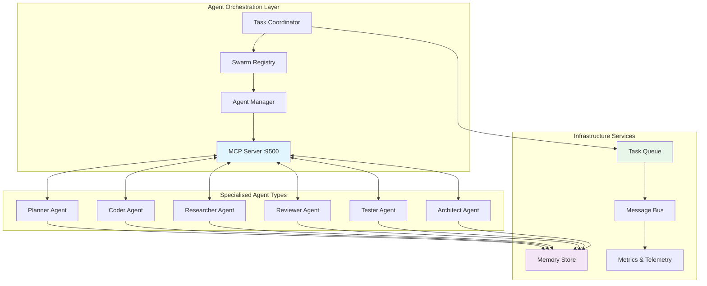
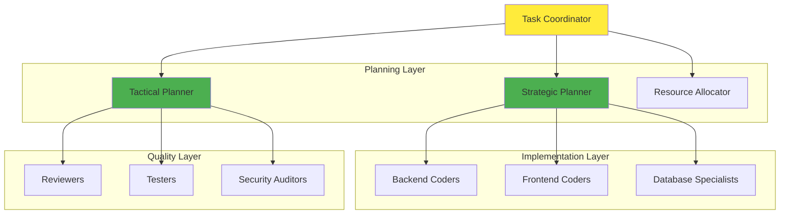
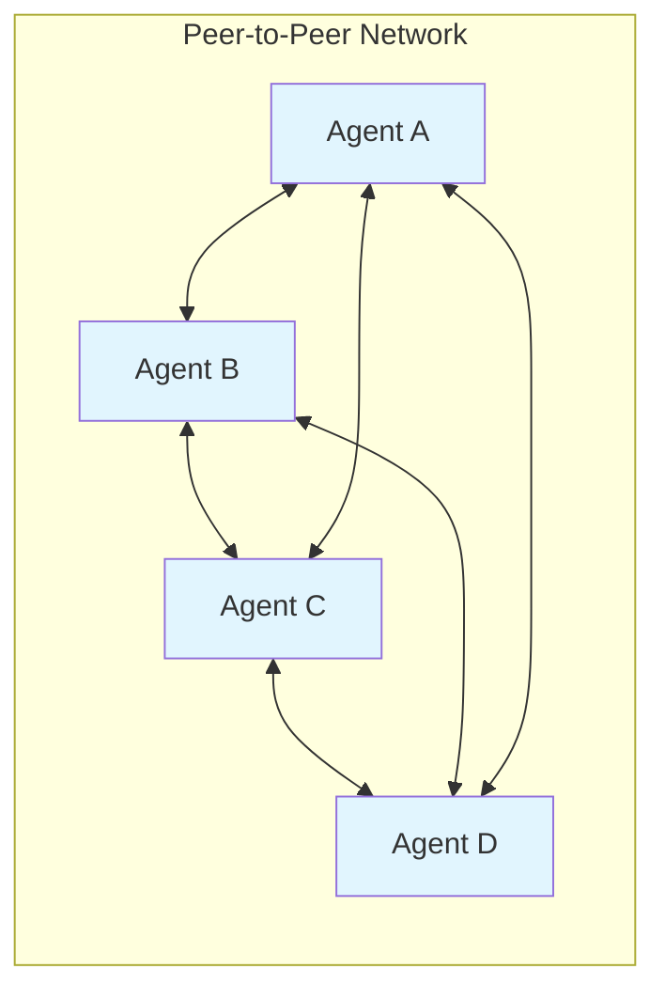
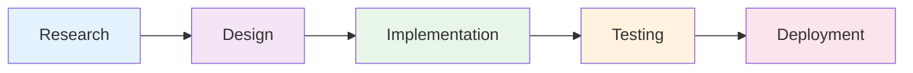
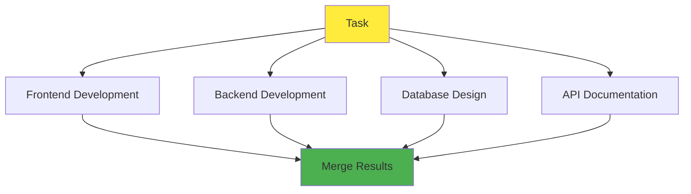
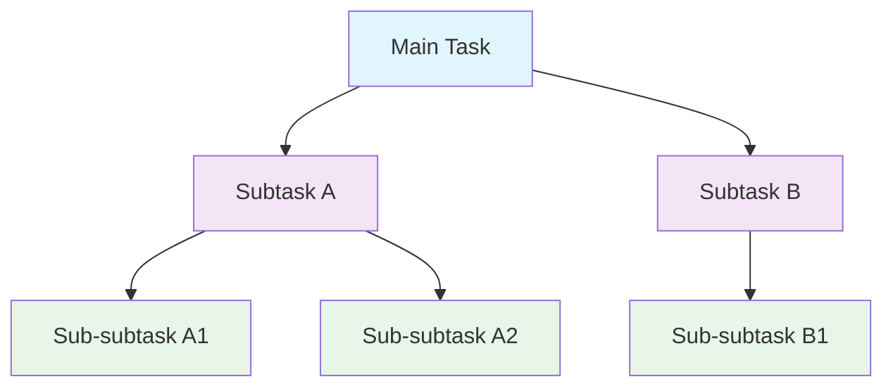
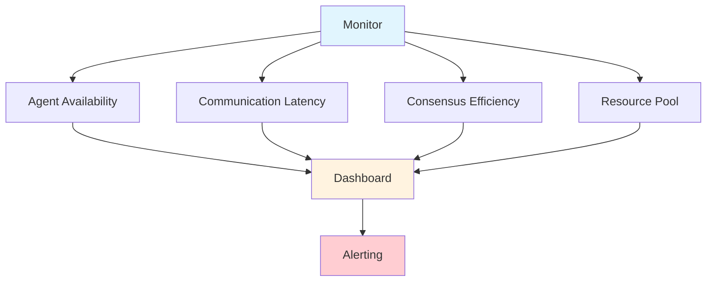

# Agentic Workers

[← Knowledge Base](../index.md) > [Concepts](./index.md) > Agentic Workers

The VisionFlow platform implements a sophisticated multi-agent system that enables distributed AI collaboration through the Model Context Protocol (MCP). This architecture supports autonomous agents working together through various swarm patterns to solve complex tasks requiring specialised expertise.

## Table of Contents

1. [Agent System Architecture](#agent-system-architecture)
2. [Core Components](#core-components)
3. [Agent Types and Specialisations](#agent-types-and-specialisations)
4. [Swarm Coordination Patterns](#swarm-coordination-patterns)
5. [Implementation Details](#implementation-details)
6. [Agent Coordination Patterns](#agent-coordination-patterns)
7. [Performance and Optimisation](#performance-and-optimisation)
8. [Monitoring and Telemetry](#monitoring-and-telemetry)
9. [Security Considerations](#security-considerations)
10. [Best Practices](#best-practices)

## Agent System Architecture

### Overview

The agent system consists of autonomous AI workers that collaborate to solve complex tasks. Each agent has specialised capabilities and can coordinate with others through various swarm patterns, orchestrated via the Model Context Protocol (MCP) running on TCP port 9500.



### System Flow

1. **Task Submission**: Complex tasks arrive at the Task Coordinator
2. **Decomposition**: Tasks are broken into subtasks based on required capabilities
3. **Agent Assignment**: Appropriate agents are selected from the swarm registry
4. **Execution**: Agents process tasks via MCP protocol connections
5. **Coordination**: Agents communicate through the message bus and shared memory
6. **Aggregation**: Results are collected and synthesised by the coordinator
7. **Monitoring**: All operations are tracked via telemetry systems

## Core Components

### 1. MCP (Model Context Protocol) Integration

The MCP server provides a standardised interface for agent communication via TCP on port 9500:

```javascript
// MCP Server Implementation
class MCPServer {
  constructor() {
    this.agents = new Map();
    this.tools = new Map();
    this.memory = new MemoryStore();
    this.tcpPort = 9500;
  }

  // Tool registration for agents
  registerTool(name, handler) {
    this.tools.set(name, {
      name,
      description: handler.description,
      parameters: handler.parameters,
      execute: handler.execute
    });
  }

  // Agent lifecycle management
  async createAgent(config) {
    const agent = new Agent(config);
    this.agents.set(agent.id, agent);

    // Establish TCP connection
    await this.establishConnection(agent);

    return agent;
  }

  async establishConnection(agent) {
    const connection = await this.connectToMCP(this.tcpPort);
    agent.mcpConnection = connection;
  }
}
```

#### Protocol Features

- **JSON-RPC 2.0**: Standard protocol for method calls over TCP
- **Persistent TCP**: Maintains connections on port 9500 for low latency
- **Tool Discovery**: Agents can dynamically discover available tools
- **Shared Memory**: Vector-based memory store for agent collaboration
- **Connection Pooling**: Efficient connection management for multiple agents

### 2. Agent Types and Specialisations

#### Core Agents

**Planner Agent**
- Decomposes complex tasks into manageable subtasks
- Creates execution strategies and workflows
- Coordinates other agents and monitors progress
- Handles escalation and conflict resolution

**Coder Agent**
- Implements code solutions across multiple languages
- Refactors existing code for improved quality
- Generates comprehensive test suites
- Handles Python, TypeScript, Rust, and more

**Researcher Agent**
- Gathers information from diverse sources
- Analyses documentation and knowledge bases
- Synthesises findings into actionable insights
- Maintains and queries the knowledge graph

**Reviewer Agent**
- Performs code review and quality assessment
- Scans for security vulnerabilities
- Enforces best practices and standards
- Provides performance analysis and recommendations

**Tester Agent**
- Generates unit, integration, and E2E tests
- Executes test suites and benchmarks
- Reproduces and validates bug fixes
- Ensures coverage thresholds are met

**Architect Agent**
- Designs system architecture and patterns
- Creates scalability and performance strategies
- Defines technical roadmaps
- Ensures architectural consistency

#### Specialised Agents

**Byzantine Coordinator**
- Implements Byzantine fault-tolerant consensus mechanisms
- Manages distributed decision-making processes
- Ensures system reliability despite agent failures
- Handles conflict resolution through voting protocols

**SPARC Agents** (Specification, Pseudocode, Architecture, Refinement, Code)
- Systematic problem decomposition methodology
- Formal specification generation
- Architecture design and validation
- Iterative refinement cycles

### 3. Swarm Coordination Patterns

#### Hierarchical Swarms



**Characteristics:**
- Centralised command and control
- Clear reporting structure
- Efficient resource allocation
- Single point of coordination

#### Mesh Coordination



**Characteristics:**
- Peer-to-peer agent communication
- No single point of failure
- Dynamic leadership via consensus
- Emergent collaborative behaviour

#### Adaptive Swarms

- Dynamic agent allocation based on workload
- Performance-based scaling decisions
- Task-specific optimisation strategies
- Continuous learning from outcomes

## Implementation Details

### 1. Agent Creation and Lifecycle

```rust
// Agent creation in ClaudeFlowActor
pub async fn create_swarm(
    &mut self,
    swarm_config: SwarmConfig,
) -> Result<SwarmId, Error> {
    // Generate unique swarm identifier
    let swarm_id = generate_swarm_id();

    // Initialise agents based on topology pattern
    let agents = match swarm_config.pattern {
        SwarmPattern::Hierarchical => create_hierarchical_agents(&swarm_config),
        SwarmPattern::Mesh => create_mesh_agents(&swarm_config),
        SwarmPattern::Adaptive => create_adaptive_agents(&swarm_config),
    };

    // Register agents with MCP server on port 9500
    for agent in agents {
        self.mcp_client.register_agent(agent).await?;
    }

    // Store swarm metadata
    self.swarms.insert(swarm_id.clone(), SwarmInfo {
        agents,
        config: swarm_config,
        created_at: SystemTime::now(),
        status: SwarmStatus::Active,
    });

    Ok(swarm_id)
}
```

### 2. Task Distribution

The system implements sophisticated task distribution algorithms:

```rust
// Task distribution with capability matching
impl TaskDistributor {
    async fn distribute_task(&self, task: Task) -> Result<(), Error> {
        // Analyse task requirements and constraints
        let requirements = self.analyse_requirements(&task);

        // Find capable agents with matching skills
        let candidates = self.find_capable_agents(&requirements);

        // Apply distribution strategy
        match task.distribution_strategy {
            Strategy::RoundRobin => {
                self.round_robin_distribute(task, candidates).await
            }
            Strategy::LoadBased => {
                self.load_based_distribute(task, candidates).await
            }
            Strategy::CapabilityOptimal => {
                self.capability_optimal_distribute(task, candidates).await
            }
            Strategy::ConsensusVoting => {
                self.consensus_distribute(task, candidates).await
            }
        }
    }

    fn analyse_requirements(&self, task: &Task) -> TaskRequirements {
        TaskRequirements {
            capabilities: task.required_capabilities.clone(),
            complexity: self.estimate_complexity(task),
            priority: task.priority,
            deadline: task.deadline,
            resource_needs: self.estimate_resources(task),
        }
    }
}
```

### 3. Inter-Agent Communication

Agents communicate through multiple channels:

#### Direct Messaging

```javascript
// Agent-to-agent communication via MCP
class AgentCommunication {
  async sendMessage(fromAgent, toAgent, message) {
    const envelope = {
      id: generateId(),
      from: fromAgent.id,
      to: toAgent.id,
      timestamp: Date.now(),
      type: message.type,
      content: message.content,
      replyTo: message.replyTo,
      mcpEndpoint: 'tcp://multi-agent-container:9500'
    };

    return this.messageQueue.publish(envelope);
  }

  async broadcast(fromAgent, message, filter = null) {
    const envelope = {
      id: generateId(),
      from: fromAgent.id,
      timestamp: Date.now(),
      type: 'broadcast',
      content: message,
      filter: filter,
    };

    return this.messageQueue.publishBroadcast(envelope);
  }
}
```

#### Shared Memory

```javascript
// Collaborative memory access with vector storage
class SharedMemory {
  async store(agentId, key, value, metadata = {}) {
    const entry = {
      key,
      value,
      agentId,
      timestamp: Date.now(),
      metadata,
      version: this.getNextVersion(key),
      embedding: await this.generateEmbedding(value)
    };

    // Store in vector database
    await this.vectorStore.insert(entry);

    // Notify other agents of update
    this.broadcastUpdate(key, entry);
  }

  async retrieve(key, options = {}) {
    // Support semantic search via embeddings
    if (options.semantic) {
      const queryEmbedding = await this.generateEmbedding(key);
      return await this.vectorStore.similaritySearch(queryEmbedding, options);
    }

    // Standard key-based retrieval
    const results = await this.vectorStore.search(key, options);
    return this.mergeVersions(results);
  }
}
```

### 4. Consensus Mechanisms

For multi-agent decision-making:

```typescript
// Byzantine fault-tolerant consensus
class ByzantineConsensus {
  async proposeDecision(proposal: Proposal): Promise<Decision> {
    // Phase 1: Broadcast proposal to all agents
    const votes = await this.gatherVotes(proposal);

    // Phase 2: Verify vote authenticity
    const validVotes = this.verifyVotes(votes);

    // Phase 3: Reach consensus (2/3 + 1 majority)
    if (validVotes.length >= this.quorumSize()) {
      return this.finaliseDecision(validVotes);
    }

    // Handle split decisions via tie-breaking
    return this.handleSplitDecision(validVotes);
  }

  private quorumSize(): number {
    // Byzantine fault tolerance: 2f + 1 for f failures
    const totalAgents = this.getActiveAgentCount();
    const maxFailures = Math.floor((totalAgents - 1) / 3);
    return 2 * maxFailures + 1;
  }

  private verifyVotes(votes: Vote[]): Vote[] {
    return votes.filter(vote => {
      return this.validateSignature(vote) &&
             this.validateTimestamp(vote) &&
             this.validateAgentStatus(vote.agentId);
    });
  }
}
```

## Agent Coordination Patterns

### 1. Pipeline Pattern

Agents work in sequence, each processing the output of the previous stage:



**Use Cases:**
- CI/CD automation workflows
- Data processing pipelines
- Sequential quality gates

### 2. Parallel Pattern

Multiple agents work on independent subtasks simultaneously:



**Use Cases:**
- Large-scale feature development
- Parallel test execution
- Multi-component systems

### 3. Recursive Pattern

Agents spawn sub-agents for complex subtasks:



**Use Cases:**
- Complex system design
- Nested problem decomposition
- Hierarchical task breakdown

## Performance and Optimisation

### Load Balancing

```rust
// Adaptive load balancing with multiple criteria
impl LoadBalancer {
    fn select_agent(&self, task: &Task) -> Option<AgentId> {
        let agents = self.get_available_agents();

        // Score each agent based on multiple factors:
        // - Current workload (40% weight)
        // - Capability match (30% weight)
        // - Historical performance (20% weight)
        // - Resource availability (10% weight)

        agents.into_iter()
            .map(|agent| (agent, self.score_agent(&agent, task)))
            .max_by_key(|(_, score)| *score)
            .map(|(agent, _)| agent.id)
    }

    fn score_agent(&self, agent: &Agent, task: &Task) -> f64 {
        let workload_score = (1.0 - agent.current_load()) * 0.4;
        let capability_score = self.capability_match(agent, task) * 0.3;
        let performance_score = agent.historical_success_rate() * 0.2;
        let resource_score = agent.available_resources() * 0.1;

        workload_score + capability_score + performance_score + resource_score
    }
}
```

### Caching and Memoisation

- **Result Caching**: Store results for repeated tasks
- **Shared Knowledge Base**: Vector-based memory for agent collaboration
- **Pattern Recognition**: Learn from historical task patterns
- **Embedding Cache**: Reuse semantic embeddings

## Monitoring and Telemetry

### Agent Performance Metrics

```typescript
interface AgentMetrics {
  taskCompletionRate: number;
  averageTaskTime: Duration;
  errorRate: number;
  resourceUtilisation: ResourceMetrics;
  collaborationScore: number;
  consensusParticipation: number;
}

// Real-time monitoring
class AgentMonitor {
  collectMetrics(agentId: string): AgentMetrics {
    return {
      taskCompletionRate: this.calculateCompletionRate(agentId),
      averageTaskTime: this.calculateAverageTime(agentId),
      errorRate: this.calculateErrorRate(agentId),
      resourceUtilisation: this.getResourceMetrics(agentId),
      collaborationScore: this.calculateCollaborationScore(agentId),
      consensusParticipation: this.getConsensusMetrics(agentId)
    };
  }

  async exportToPrometheus(agentId: string, metrics: AgentMetrics) {
    for (const [key, value] of Object.entries(metrics)) {
      if (typeof value === 'number') {
        await this.prometheus.gauge(`agent_${key}`, value, {
          agent_id: agentId,
          swarm_id: this.getSwarmId(agentId)
        });
      }
    }
  }
}
```

### Swarm Health Monitoring



- **Agent Availability Tracking**: Monitor heartbeats and responsiveness
- **Communication Latency**: Measure MCP round-trip times
- **Consensus Efficiency**: Track voting participation and duration
- **Resource Pool Monitoring**: Track CPU, memory, and GPU utilisation

## Security Considerations

### Agent Isolation

- **Sandboxed Execution**: Isolated environments for agent processes
- **Resource Quotas**: CPU, memory, and network limits per agent
- **Network Segmentation**: Isolated subnets for different agent tiers
- **Capability-Based Access**: Fine-grained permission model

### Communication Security

```typescript
// Secure agent communication
class SecureAgentCommunication {
  async sendSecureMessage(from: Agent, to: Agent, message: any) {
    // Sign message with agent's private key
    const signature = await this.signMessage(from.privateKey, message);

    // Encrypt message payload
    const encrypted = await this.encryptPayload(to.publicKey, message);

    const envelope = {
      from: from.id,
      to: to.id,
      timestamp: Date.now(),
      signature,
      payload: encrypted,
      nonce: this.generateNonce()
    };

    // Verify and send
    await this.verifyAndSend(envelope);
  }

  async verifyConsensusProposal(proposal: Proposal) {
    // Verify proposer signature
    const validSignature = await this.verifySignature(
      proposal.proposer,
      proposal.signature,
      proposal.content
    );

    if (!validSignature) {
      throw new Error('Invalid proposal signature');
    }

    // Log for audit trail
    await this.auditLog.record({
      type: 'consensus_proposal',
      proposer: proposal.proposer,
      timestamp: Date.now(),
      content: proposal.content
    });
  }
}
```

- **Encrypted Messages**: End-to-end encryption for agent communication
- **Signed Proposals**: Cryptographic signatures for consensus voting
- **Audit Trail**: Comprehensive logging of all agent decisions
- **Anomaly Detection**: ML-based detection of unusual agent behaviour

## Best Practices

### 1. Task Design

- **Clear, Atomic Definitions**: Each task has a single, well-defined purpose
- **Explicit Success Criteria**: Measurable outcomes and acceptance tests
- **Proper Error Handling**: Graceful degradation and retry strategies
- **Timeout Specifications**: Reasonable limits with exponential backoff

### 2. Agent Configuration

```yaml
# Example agent configuration
agent_templates:
  coder:
    capabilities: ["python", "typescript", "rust"]
    resources:
      memory: "4Gi"
      cpu: "2.0"
      gpu: true
    timeouts:
      task_execution: 300
      health_check: 30
    retry_policy:
      max_attempts: 3
      backoff: "exponential"
    fallback_strategy: "reassign"
```

- **Appropriate Capability Assignment**: Match agent skills to task requirements
- **Resource Limit Setting**: Prevent resource exhaustion
- **Fallback Strategies**: Define behaviour for failure scenarios
- **Monitoring Setup**: Configure metrics and alerting thresholds

### 3. Swarm Patterns

- **Choose Patterns Based on Task Type**: Hierarchical for structured work, mesh for distributed systems
- **Consider Fault Tolerance Needs**: Byzantine consensus for critical decisions
- **Plan for Scalability**: Horizontal and vertical scaling strategies
- **Monitor Emergent Behaviour**: Track unexpected interaction patterns

## Related Articles

- [System Architecture](./system-architecture.md) - Overall VisionFlow system design
- [GPU Compute](./gpu-compute.md) - GPU-accelerated graph processing
- [Orchestrating Agents](../guides/orchestrating-agents.md) - Practical agent orchestration guide
- [Agent Reference](../reference/agents/index.md) - Detailed agent API documentation
- [Core Agents](../reference/agents/core/index.md) - Core agent type specifications
- [Swarm Coordinators](../reference/agents/swarm/index.md) - Swarm pattern implementations
- [Consensus Mechanisms](../reference/agents/consensus/index.md) - Byzantine and Raft consensus

## Further Reading

- [Multi-Agent Docker Setup](../../multi-agent-docker/README.md)
- [MCP Protocol Specification](../reference/api/mcp-protocol.md)
- [Agent Templates](../reference/agents/templates/index.md)
- [Performance Optimisation](../reference/agents/optimization/index.md)

---

*Last updated: 2025-10-03*
