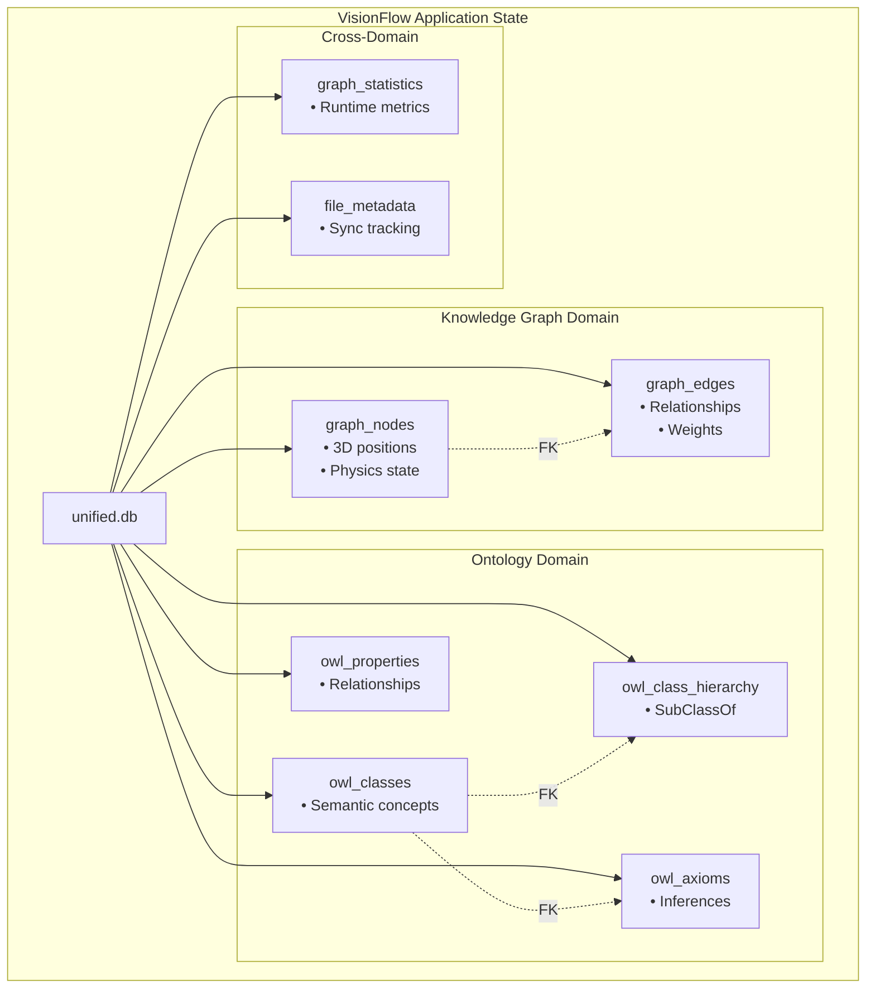

# VisionFlow Architecture Overview

**Version:** 3.1.0
**Last Updated:** 2025-10-25
**Type:** Concepts - Understanding-Oriented

---

## Executive Summary

VisionFlow is a knowledge graph visualization and reasoning platform that combines three independent graph systems:

1. **Knowledge Graph** - Local markdown files (Logseq integration)
2. **Ontology Graph** - Semantic web knowledge (GitHub markdown)
3. **Agent Visualization** - Multi-agent system coordination

The system uses a **hexagonal (ports & adapters) architecture** with **CQRS pattern** for application logic, combined with **GPU-accelerated physics simulation** for visualization.

---

## Architectural Philosophy

### Five Core Principles

1. **Separation of Concerns** - Clear boundaries between data, domain logic, and presentation
2. **Hexagonal Architecture (Ports & Adapters)** - Agnostic core logic isolated from external systems
3. **CQRS Pattern** - Separate read and write models for complex domain logic
4. **Event-Driven Design** - Asynchronous operations via message passing
5. **GPU Acceleration** - Leverage hardware for compute-intensive tasks

### Key Design Decisions

| Decision | Rationale | Benefit |
|----------|-----------|---------|
| Three separate SQLite databases | Domain separation prevents conflicts | Clearer semantics, independent scaling |
| Hexagonal architecture | Framework independence, easy testing | Testable without web framework |
| CQRS pattern | Complex query logic, sophisticated rules | Flexible business rules, clear intent |
| WebSocket binary protocol | Minimize bandwidth for real-time updates | 80% bandwidth reduction vs JSON |
| GPU CUDA kernels | Physics simulation is CPU-bound | 60 FPS at 100k nodes |
| Arc<Mutex<>> ownership | Safe concurrent access without channels | Zero-copy shared references |

---

## System Architecture Layers

### 1. Hexagonal Core (Domain Logic)

The application core implements business logic independently from frameworks:

```
┌─────────────────────────────────────────┐
│     APPLICATION LAYER (CQRS Core)       │
│  • Directives (Commands)                 │
│  • Queries (Read Operations)             │
│  • Domain Rules & Validation             │
└──────────────┬──────────────────────────┘
               │
   ┌───────────┴────────────┬──────────────┐
   │                        │              │
   V                        V              V
Settings            Knowledge Graph    Ontology
Ports               Ports              Ports
```

### 2. Ports (Interfaces)

Each domain has abstract ports defining operations:

- **Settings Port** - Configuration persistence
- **Knowledge Graph Port** - Node/edge CRUD
- **Ontology Port** - OWL reasoning
- **HTTP Port** - REST API contract
- **WebSocket Port** - Real-time updates

### 3. Adapters (Implementations)

Concrete adapters implement ports:

- **SQLite Adapters** - Database persistence
- **Actix-web Adapter** - REST endpoints
- **WebSocket Adapter** - Binary protocol streaming
- **CUDA Adapter** - GPU physics simulation

---

## Database Architecture

### Unified Database Model (UPDATED: November 2, 2025)



**Why Unified Database?**

- ✅ **Atomic Transactions**: Cross-domain operations are atomic
- ✅ **Foreign Key Integrity**: Enforced relationships between domains
- ✅ **Simplified Operations**: Single connection pool, single backup file
- ✅ **Better Performance**: Reduced connection overhead
- ✅ **Easier Development**: Simpler schema management and testing

---

## CQRS Application Layer

### Pattern Overview

The application layer separates **write operations (Directives)** from **read operations (Queries)**:

```
Client Request
      │
      ├──────────────────────────┬──────────────────────────┐
      │                          │                          │
      V                          V                          V
   DIRECTIVE              QUERY                    SUBSCRIPTION
   (Command)             (Read)                   (Updates)
   (Write)
      │                          │                          │
      V                          V                          V
  Domain Logic          Read Optimization         Event Stream
  Validation            Caching                   Broadcasting
  Persistence           Projections
      │                          │                          │
      └──────────────────────────┼──────────────────────────┘
                                 │
                        Ports & Adapters
                        (Databases, APIs)
```

### Directives (Write Operations)

Commands that modify state with full validation:

- `AddNodeDirective` - Create knowledge graph node
- `UpdateNodeDirective` - Modify node properties
- `AddEdgeDirective` - Create node relationship
- `SaveAllSettingsDirective` - Persist user preferences
- `AddOwlClassDirective` - Define semantic concept

**Characteristics:**
- Synchronous execution
- Full domain validation
- Return operation result (success/failure)
- May trigger events

### Queries (Read Operations)

Efficient read operations with caching:

- `GetGraphQuery` - Retrieve full knowledge graph
- `GetSettingQuery` - Fetch user preference
- `GetOntologyGraphQuery` - Read semantic graph
- `QueryNodesQuery` - Filter nodes with predicates

**Characteristics:**
- Optimized for read performance
- Can leverage caches/projections
- Return domain objects
- Side-effect free

---

## Physics Simulation Architecture

### GPU-Accelerated Force-Directed Layout

```
Physics Simulation (GPU)
    │
    ├─ Repulsion Forces (CUDA)
    ├─ Attraction Forces (CUDA)
    ├─ Damping Calculation (CUDA)
    └─ Velocity Integration (CUDA)

Output: Updated Positions & Velocities
    │
    └─→ Binary Protocol Streaming (36 bytes/node)
        └─→ WebSocket Broadcast to Clients
```

### Performance Characteristics

- **60 FPS sustained** at 100k nodes
- **40+ custom CUDA kernels** for compute-intensive operations
- **3.6 MB/s bandwidth** (36 bytes × 100k nodes × 60 FPS)
- **GPU Memory**: 256-512 MB typical
- **Convergence**: ~5-10 seconds to stable layout

### Constraints & Features

Clients can pin nodes to specific 3D coordinates:

```json
{
  "type": "pin",
  "node_id": 42,
  "position": { "x": 0, "y": 0, "z": 0 }
}
```

This allows interactive exploration while maintaining physical realism.

---

## Client Architecture Evolution

### Server-Driven State (Phase 1)
- Server maintains canonical graph state
- Clients receive authoritative updates
- Simple but limited interactivity

### Client State Management (Phase 2)
- Clients predict node movements
- Server validates physics
- Enables smooth interactions

### Hybrid Approach (Current)
- Client manages interaction state
- Server tracks canonical graph
- WebSocket sync resolves conflicts
- Best of both worlds

---

## Integration Patterns

### Actor System Legacy

The system wraps legacy Rust actors for backward compatibility:

```rust
// Modern CQRS code
let directive = AddNodeDirective { label: "..." };

// Legacy actor integration
let result = old_actor_system.handle(directive).await;

// Result flows back through modern ports
```

This allows gradual migration from actor-based to CQRS-based architecture.

---

## Performance Characteristics

### Throughput

| Operation | Latency | Throughput |
|-----------|---------|-----------|
| Add Node | <5ms | 200/sec |
| Update Position | <2ms | 500/sec |
| Query Graph | <100ms | 10/sec |
| Add OWL Axiom | <10ms | 100/sec |

### Storage

| Database | Typical Size | Growth Rate | Tables |
|----------|--------------|-------------|--------|
| unified.db | 50-500 MB | Medium | 8 core tables |
| - Knowledge Graph | 40-400 MB | Medium | graph_nodes, graph_edges |
| - Ontology | 10-100 MB | Slow | owl_classes, owl_properties, owl_axioms, owl_class_hierarchy |
| - Metadata | 1-5 MB | Slow | graph_statistics, file_metadata |

### Network

| Protocol | Bandwidth | Latency |
|----------|-----------|---------|
| REST (JSON) | 20 MB/s | <50ms |
| WebSocket (Binary) | 3.6 MB/s | <10ms |
| Reduction | 82% savings | 5x faster |

---

## Security Considerations

### Authentication Tiers

1. **Public** - Health checks, documentation
2. **User** - Standard operations (JWT token)
3. **Developer** - Admin operations (API key)

### Principles

- All operations validated against authentication context
- Database constraints enforce data integrity
- FOREIGN KEY constraints prevent orphaned records
- Transaction boundaries ensure consistency

---

## Key Architectural Strengths

1. **Testability** - Hexagonal design allows isolated testing
2. **Maintainability** - Clear separation of concerns
3. **Scalability** - GPU acceleration handles large graphs
4. **Flexibility** - CQRS pattern adapts to complex business rules
5. **Performance** - Binary protocol and caching optimize for speed

---

## Related Documentation

- **[Hexagonal & CQRS Details](../reference/architecture/hexagonal-cqrs.md)** - Deep dive into ports, adapters, and CQRS patterns
- **[Actor System Integration](../reference/architecture/actor-system.md)** - Legacy system compatibility
- **[Database Schema](../reference/architecture/database-schema.md)** - Schema details and optimization
- **[API Reference](../reference/api/)** - REST and WebSocket specifications
- **[Developer Guides](../guides/developer/)** - How to implement features

---

**Audience:** Architects, senior developers, stakeholders
**Next Steps:** Understand [CQRS implementation details](./reference/architecture/hexagonal-cqrs.md)
