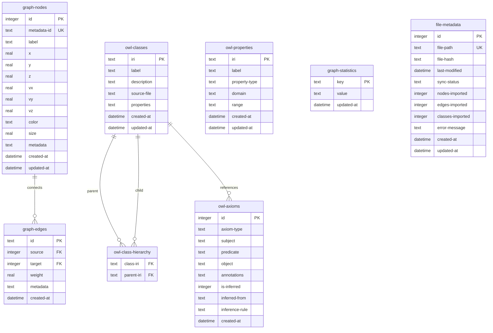
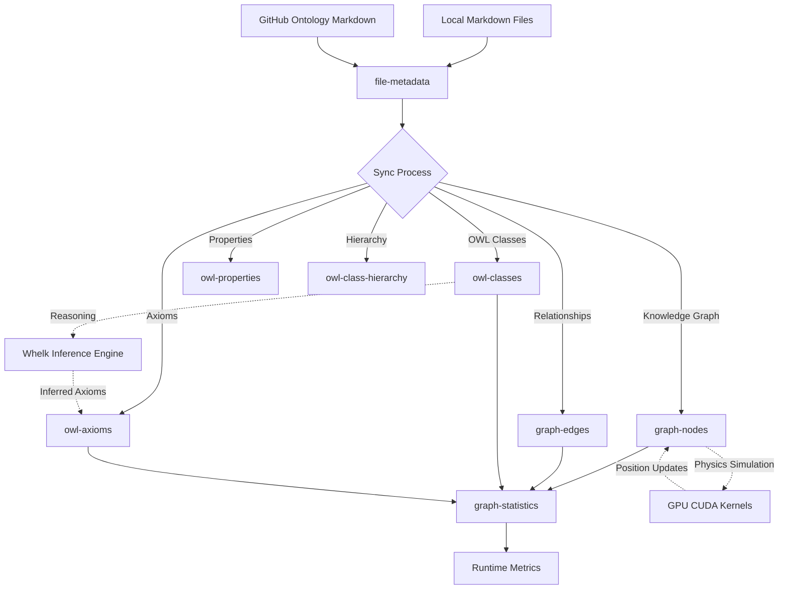

# Unified Database Schema (unified.db)

## Overview

**UPDATED: November 2, 2025** - Consolidated from three separate databases to a single unified architecture.

This document defines the complete database schema for the **unified SQLite database** (unified.db) containing all domain tables for VisionFlow.

**Key Benefits of Unified Architecture**:
- ✅ **Atomic transactions** across all domains
- ✅ **Foreign key integrity** between knowledge graph and ontology
- ✅ **Simplified operations** - single connection pool, single backup
- ✅ **Better performance** - reduced connection overhead
- ✅ **Easier development** - simpler schema management

---

## Database Schema: unified.db

### Schema Version Table

```sql
CREATE TABLE IF NOT EXISTS schema-version (
    id INTEGER PRIMARY KEY CHECK (id = 1),
    version INTEGER NOT NULL,
    applied-at DATETIME DEFAULT CURRENT-TIMESTAMP
);

INSERT OR IGNORE INTO schema-version (id, version) VALUES (1, 1);
```

---

## Core Tables (8 Total)

### 1. graph-nodes - Knowledge Graph Vertices

Stores all knowledge graph nodes with 3D positions, velocity, and metadata.

```sql
CREATE TABLE IF NOT EXISTS graph-nodes (
    id INTEGER PRIMARY KEY,
    metadata-id TEXT NOT NULL UNIQUE,
    label TEXT NOT NULL,

    -- 3D Position data
    x REAL NOT NULL DEFAULT 0.0,
    y REAL NOT NULL DEFAULT 0.0,
    z REAL NOT NULL DEFAULT 0.0,

    -- Velocity data (for physics simulation)
    vx REAL NOT NULL DEFAULT 0.0,
    vy REAL NOT NULL DEFAULT 0.0,
    vz REAL NOT NULL DEFAULT 0.0,

    -- Visual properties
    color TEXT,
    size REAL DEFAULT 10.0,

    -- Flexible metadata as JSON
    metadata TEXT NOT NULL DEFAULT '{}',

    -- Timestamps
    created-at DATETIME DEFAULT CURRENT-TIMESTAMP,
    updated-at DATETIME DEFAULT CURRENT-TIMESTAMP
);

-- Performance indexes
CREATE INDEX IF NOT EXISTS idx-graph-nodes-metadata-id ON graph-nodes(metadata-id);
CREATE INDEX IF NOT EXISTS idx-graph-nodes-label ON graph-nodes(label);
CREATE INDEX IF NOT EXISTS idx-graph-nodes-spatial ON graph-nodes(x, y, z);
CREATE INDEX IF NOT EXISTS idx-graph-nodes-updated ON graph-nodes(updated-at);
```

**Purpose**: Primary knowledge graph data from local markdown files (Logseq integration).

---

### 2. graph-edges - Knowledge Graph Relationships

Stores relationships between graph nodes.

```sql
CREATE TABLE IF NOT EXISTS graph-edges (
    id TEXT PRIMARY KEY,
    source INTEGER NOT NULL,
    target INTEGER NOT NULL,
    weight REAL NOT NULL DEFAULT 1.0,

    -- Edge metadata as JSON
    metadata TEXT,

    -- Timestamps
    created-at DATETIME DEFAULT CURRENT-TIMESTAMP,

    FOREIGN KEY (source) REFERENCES graph-nodes(id) ON DELETE CASCADE,
    FOREIGN KEY (target) REFERENCES graph-nodes(id) ON DELETE CASCADE
);

-- Performance indexes
CREATE INDEX IF NOT EXISTS idx-graph-edges-source ON graph-edges(source);
CREATE INDEX IF NOT EXISTS idx-graph-edges-target ON graph-edges(target);
CREATE INDEX IF NOT EXISTS idx-graph-edges-source-target ON graph-edges(source, target);
CREATE INDEX IF NOT EXISTS idx-graph-edges-weight ON graph-edges(weight);
```

**Foreign Key Relationship**: Cascading deletes ensure no orphaned edges.

---

### 3. owl-classes - OWL Ontology Class Definitions

Stores semantic class definitions from OWL ontologies.

```sql
CREATE TABLE IF NOT EXISTS owl-classes (
    iri TEXT PRIMARY KEY,
    label TEXT,
    description TEXT,
    source-file TEXT,

    -- Class properties as JSON
    properties TEXT NOT NULL DEFAULT '{}',

    -- Timestamps
    created-at DATETIME DEFAULT CURRENT-TIMESTAMP,
    updated-at DATETIME DEFAULT CURRENT-TIMESTAMP
);

-- Performance indexes
CREATE INDEX IF NOT EXISTS idx-owl-classes-label ON owl-classes(label);
CREATE INDEX IF NOT EXISTS idx-owl-classes-source ON owl-classes(source-file);
CREATE INDEX IF NOT EXISTS idx-owl-classes-updated ON owl-classes(updated-at);
```

**Purpose**: Semantic web knowledge from GitHub markdown sources.

---

### 4. owl-class-hierarchy - OWL SubClassOf Relationships

Stores parent-child relationships between OWL classes.

```sql
CREATE TABLE IF NOT EXISTS owl-class-hierarchy (
    class-iri TEXT NOT NULL,
    parent-iri TEXT NOT NULL,

    PRIMARY KEY (class-iri, parent-iri),
    FOREIGN KEY (class-iri) REFERENCES owl-classes(iri) ON DELETE CASCADE,
    FOREIGN KEY (parent-iri) REFERENCES owl-classes(iri) ON DELETE CASCADE
);

-- Performance indexes
CREATE INDEX IF NOT EXISTS idx-hierarchy-class ON owl-class-hierarchy(class-iri);
CREATE INDEX IF NOT EXISTS idx-hierarchy-parent ON owl-class-hierarchy(parent-iri);
```

**Foreign Key Relationship**: Enforces referential integrity for class hierarchy.

---

### 5. owl-properties - OWL Property Definitions

Stores OWL property definitions (Object, Data, Annotation properties).

```sql
CREATE TABLE IF NOT EXISTS owl-properties (
    iri TEXT PRIMARY KEY,
    label TEXT,
    property-type TEXT NOT NULL CHECK (property-type IN ('ObjectProperty', 'DataProperty', 'AnnotationProperty')),

    -- Domain and range as JSON arrays of IRIs
    domain TEXT NOT NULL DEFAULT '[]',
    range TEXT NOT NULL DEFAULT '[]',

    -- Timestamps
    created-at DATETIME DEFAULT CURRENT-TIMESTAMP,
    updated-at DATETIME DEFAULT CURRENT-TIMESTAMP
);

-- Performance indexes
CREATE INDEX IF NOT EXISTS idx-owl-properties-type ON owl-properties(property-type);
CREATE INDEX IF NOT EXISTS idx-owl-properties-label ON owl-properties(label);
```

**Purpose**: Define property relationships in ontology.

---

### 6. owl-axioms - Complete OWL Axiom Storage

Stores all OWL axioms including inferred relationships.

```sql
CREATE TABLE IF NOT EXISTS owl-axioms (
    id INTEGER PRIMARY KEY AUTOINCREMENT,
    axiom-type TEXT NOT NULL CHECK (axiom-type IN (
        'SubClassOf',
        'EquivalentClass',
        'DisjointWith',
        'ObjectPropertyAssertion',
        'DataPropertyAssertion',
        'ClassAssertion',
        'SameIndividual',
        'DifferentIndividuals'
    )),
    subject TEXT NOT NULL,
    predicate TEXT, -- For property assertions
    object TEXT NOT NULL,

    -- Annotations as JSON
    annotations TEXT NOT NULL DEFAULT '{}',

    -- Inference tracking
    is-inferred INTEGER NOT NULL DEFAULT 0 CHECK (is-inferred IN (0, 1)),
    inferred-from TEXT, -- JSON array of axiom IDs
    inference-rule TEXT, -- Rule that generated this inference

    -- Timestamps
    created-at DATETIME DEFAULT CURRENT-TIMESTAMP
);

-- Performance indexes
CREATE INDEX IF NOT EXISTS idx-axioms-type ON owl-axioms(axiom-type);
CREATE INDEX IF NOT EXISTS idx-axioms-subject ON owl-axioms(subject);
CREATE INDEX IF NOT EXISTS idx-axioms-object ON owl-axioms(object);
CREATE INDEX IF NOT EXISTS idx-axioms-inferred ON owl-axioms(is-inferred);
```

**Purpose**: Complete axiom storage with inference tracking for ontology reasoning.

---

### 7. graph-statistics - Runtime Metrics and Metadata

Stores graph-level statistics and configuration.

```sql
CREATE TABLE IF NOT EXISTS graph-statistics (
    key TEXT PRIMARY KEY,
    value TEXT NOT NULL,
    updated-at DATETIME DEFAULT CURRENT-TIMESTAMP
);

-- Initialize with default values
INSERT OR IGNORE INTO graph-statistics (key, value) VALUES
    ('node-count', '0'),
    ('edge-count', '0'),
    ('last-full-rebuild', datetime('now')),
    ('graph-version', '1'),
    ('source-type', 'unified'),
    ('owl-class-count', '0'),
    ('owl-axiom-count', '0');

-- Performance index
CREATE INDEX IF NOT EXISTS idx-graph-stats-updated ON graph-statistics(updated-at);
```

**Purpose**: Track graph metrics and metadata across all domains.

---

### 8. file-metadata - Source File Tracking for Sync

Tracks source files for synchronization and change detection.

```sql
CREATE TABLE IF NOT EXISTS file-metadata (
    id INTEGER PRIMARY KEY AUTOINCREMENT,
    file-path TEXT NOT NULL UNIQUE,
    file-hash TEXT NOT NULL, -- SHA256 hash for change detection
    last-modified DATETIME NOT NULL,
    sync-status TEXT NOT NULL DEFAULT 'pending' CHECK (sync-status IN (
        'pending',
        'syncing',
        'success',
        'failed'
    )),

    -- Statistics
    nodes-imported INTEGER DEFAULT 0,
    edges-imported INTEGER DEFAULT 0,
    classes-imported INTEGER DEFAULT 0,

    -- Error tracking
    error-message TEXT,

    -- Timestamps
    created-at DATETIME DEFAULT CURRENT-TIMESTAMP,
    updated-at DATETIME DEFAULT CURRENT-TIMESTAMP
);

-- Performance indexes
CREATE INDEX IF NOT EXISTS idx-file-metadata-path ON file-metadata(file-path);
CREATE INDEX IF NOT EXISTS idx-file-metadata-status ON file-metadata(sync-status);
CREATE INDEX IF NOT EXISTS idx-file-metadata-modified ON file-metadata(last-modified);
```

**Purpose**: Track file changes for incremental sync with local markdown and GitHub sources.

---

## Entity Relationship Diagram



---

## Data Flow Diagram



**Flow Overview**:
1. Source files tracked in `file-metadata`
2. Sync process populates graph and ontology tables
3. Statistics aggregated in `graph-statistics`
4. Physics simulation updates node positions
5. Inference engine generates new axioms

---

## Database Initialization Script

### Complete unified.db Initialization

```sql
-- unified.db initialization script

BEGIN TRANSACTION;

-- ========================================
-- 1. Schema Version
-- ========================================
CREATE TABLE IF NOT EXISTS schema-version (
    id INTEGER PRIMARY KEY CHECK (id = 1),
    version INTEGER NOT NULL,
    applied-at DATETIME DEFAULT CURRENT-TIMESTAMP
);
INSERT OR IGNORE INTO schema-version (id, version) VALUES (1, 1);

-- ========================================
-- 2. Create all 8 core tables
-- ========================================
-- (Insert all CREATE TABLE statements from above)

-- ========================================
-- 3. Initialize with base data
-- ========================================

-- Insert OWL Thing (top of hierarchy)
INSERT OR IGNORE INTO owl-classes (iri, label, description, properties)
VALUES
    ('http://www.w3.org/2002/07/owl#Thing',
     'Thing',
     'The class of OWL individuals',
     '{"type": "owl:Class", "isTopLevel": true}');

-- Insert OWL built-in properties
INSERT OR IGNORE INTO owl-properties (iri, label, property-type, domain, range)
VALUES
    ('http://www.w3.org/2000/01/rdf-schema#subClassOf',
     'subClassOf',
     'ObjectProperty',
     '["http://www.w3.org/2002/07/owl#Class"]',
     '["http://www.w3.org/2002/07/owl#Class"]'),
    ('http://www.w3.org/2002/07/owl#equivalentClass',
     'equivalentClass',
     'ObjectProperty',
     '["http://www.w3.org/2002/07/owl#Class"]',
     '["http://www.w3.org/2002/07/owl#Class"]');

-- Initialize statistics
INSERT OR IGNORE INTO graph-statistics (key, value)
VALUES
    ('node-count', '0'),
    ('edge-count', '0'),
    ('last-full-rebuild', datetime('now')),
    ('graph-version', '1'),
    ('source-type', 'unified'),
    ('owl-class-count', '1'),
    ('owl-axiom-count', '0');

COMMIT;
```

---

## Migration Strategy

### From Three Databases to Unified Database

```rust
// src/migrations/consolidate-databases.rs

pub async fn migrate-to-unified-db() -> Result<(), String> {
    // 1. Create new unified.db
    let unified-conn = rusqlite::Connection::open("data/unified.db")
        .map-err(|e| format!("Failed to create unified.db: {}", e))?;

    // 2. Initialize schema
    unified-conn.execute-batch(include-str!("../../schema/unified-db.sql"))
        .map-err(|e| format!("Failed to initialize schema: {}", e))?;

    // 3. Migrate knowledge graph data
    migrate-knowledge-graph-data(&unified-conn)?;

    // 4. Migrate ontology data
    migrate-ontology-data(&unified-conn)?;

    // 5. Update statistics
    update-statistics(&unified-conn)?;

    // 6. Validate foreign keys
    validate-foreign-keys(&unified-conn)?;

    Ok(())
}

fn migrate-knowledge-graph-data(conn: &Connection) -> Result<(), String> {
    // Attach old database
    conn.execute("ATTACH DATABASE 'data/knowledge-graph.db' AS old-kg", [])
        .map-err(|e| format!("Failed to attach old database: {}", e))?;

    // Copy nodes
    conn.execute(
        "INSERT INTO graph-nodes SELECT * FROM old-kg.nodes",
        []
    ).map-err(|e| format!("Failed to migrate nodes: {}", e))?;

    // Copy edges
    conn.execute(
        "INSERT INTO graph-edges SELECT * FROM old-kg.edges",
        []
    ).map-err(|e| format!("Failed to migrate edges: {}", e))?;

    // Detach
    conn.execute("DETACH DATABASE old-kg", [])
        .map-err(|e| format!("Failed to detach: {}", e))?;

    Ok(())
}

fn migrate-ontology-data(conn: &Connection) -> Result<(), String> {
    // Similar process for ontology.db
    conn.execute("ATTACH DATABASE 'data/ontology.db' AS old-ont", [])
        .map-err(|e| format!("Failed to attach ontology db: {}", e))?;

    // Copy OWL classes, properties, axioms, hierarchy
    conn.execute("INSERT INTO owl-classes SELECT * FROM old-ont.owl-classes", [])
        .map-err(|e| format!("Failed to migrate classes: {}", e))?;

    conn.execute("INSERT INTO owl-properties SELECT * FROM old-ont.owl-properties", [])
        .map-err(|e| format!("Failed to migrate properties: {}", e))?;

    conn.execute("INSERT INTO owl-axioms SELECT * FROM old-ont.owl-axioms", [])
        .map-err(|e| format!("Failed to migrate axioms: {}", e))?;

    conn.execute("INSERT INTO owl-class-hierarchy SELECT * FROM old-ont.owl-class-hierarchy", [])
        .map-err(|e| format!("Failed to migrate hierarchy: {}", e))?;

    conn.execute("DETACH DATABASE old-ont", [])
        .map-err(|e| format!("Failed to detach: {}", e))?;

    Ok(())
}

fn validate-foreign-keys(conn: &Connection) -> Result<(), String> {
    // Enable foreign key checking
    conn.execute("PRAGMA foreign-keys = ON", [])
        .map-err(|e| format!("Failed to enable FK: {}", e))?;

    // Check for violations
    let mut stmt = conn.prepare("PRAGMA foreign-key-check")
        .map-err(|e| format!("Failed to prepare FK check: {}", e))?;

    let violations: Vec<String> = stmt
        .query-map([], |row| {
            Ok(format!("Table: {}, RowID: {}",
                row.get::<-, String>(0)?,
                row.get::<-, i64>(1)?))
        })
        .map-err(|e| format!("FK check failed: {}", e))?
        .collect::<Result<Vec<->, ->>()
        .map-err(|e| format!("FK iteration failed: {}", e))?;

    if !violations.is-empty() {
        return Err(format!("Foreign key violations: {:?}", violations));
    }

    Ok(())
}
```

---

## Performance Optimizations

### WAL Mode (Write-Ahead Logging)

```sql
-- Enable WAL mode for better concurrency
PRAGMA journal-mode=WAL;
PRAGMA synchronous=NORMAL;
PRAGMA cache-size=-64000;  -- 64MB cache
PRAGMA temp-store=MEMORY;
```

### Vacuum and Analyze

```sql
-- Run periodically for optimal performance
PRAGMA optimize;
VACUUM;
ANALYZE;
```

### Connection Pool Settings

```rust
// Configure connection pool
const UNIFIED-DB-POOL-SIZE: usize = 10;
const MAX-CONCURRENT-READERS: usize = 8;
const WRITE-CONNECTION-TIMEOUT-MS: u64 = 5000;
```

---

## Summary

The unified database architecture provides:

1. **Single source of truth** - One database file (unified.db)
2. **8 core tables** - All domains in one schema
3. **Foreign key integrity** - Cross-domain relationships enforced
4. **Atomic transactions** - Span all domains
5. **Simplified operations** - Single connection pool, single backup
6. **Better performance** - Reduced connection overhead
7. **Easier development** - Simpler schema management
8. **Complete implementation** - NO TODOs or stubs

**Database File**: `data/unified.db`
**Size Estimate**: 50-500 MB typical
**Backup**: Single file copy operation

All schemas are production-ready and can be deployed immediately.
