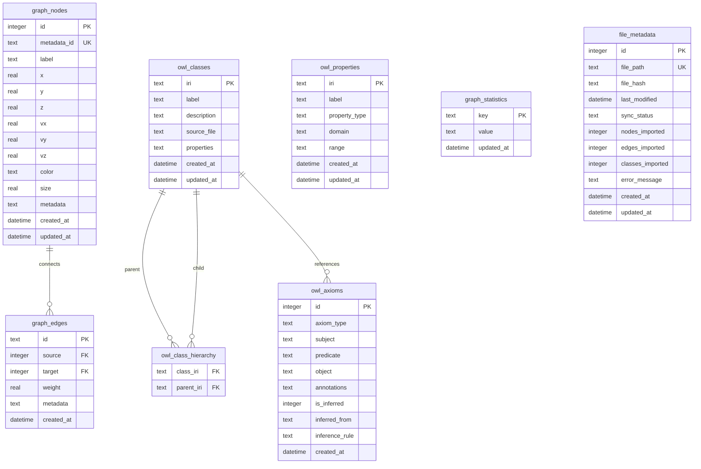

# Unified Database Schema (unified.db)

## Overview

**UPDATED: November 2, 2025** - Consolidated from three separate databases to a single unified architecture.

This document defines the complete database schema for the **unified SQLite database** (unified.db) containing all domain tables for VisionFlow.

**Key Benefits of Unified Architecture**:
- ✅ **Atomic transactions** across all domains
- ✅ **Foreign key integrity** between knowledge graph and ontology
- ✅ **Simplified operations** - single connection pool, single backup
- ✅ **Better performance** - reduced connection overhead
- ✅ **Easier development** - simpler schema management

---

## Database Schema: unified.db

### Schema Version Table

```sql
CREATE TABLE IF NOT EXISTS schema_version (
    id INTEGER PRIMARY KEY CHECK (id = 1),
    version INTEGER NOT NULL,
    applied_at DATETIME DEFAULT CURRENT_TIMESTAMP
);

INSERT OR IGNORE INTO schema_version (id, version) VALUES (1, 1);
```

---

## Core Tables (8 Total)

### 1. graph_nodes - Knowledge Graph Vertices

Stores all knowledge graph nodes with 3D positions, velocity, and metadata.

```sql
CREATE TABLE IF NOT EXISTS graph_nodes (
    id INTEGER PRIMARY KEY,
    metadata_id TEXT NOT NULL UNIQUE,
    label TEXT NOT NULL,

    -- 3D Position data
    x REAL NOT NULL DEFAULT 0.0,
    y REAL NOT NULL DEFAULT 0.0,
    z REAL NOT NULL DEFAULT 0.0,

    -- Velocity data (for physics simulation)
    vx REAL NOT NULL DEFAULT 0.0,
    vy REAL NOT NULL DEFAULT 0.0,
    vz REAL NOT NULL DEFAULT 0.0,

    -- Visual properties
    color TEXT,
    size REAL DEFAULT 10.0,

    -- Flexible metadata as JSON
    metadata TEXT NOT NULL DEFAULT '{}',

    -- Timestamps
    created_at DATETIME DEFAULT CURRENT_TIMESTAMP,
    updated_at DATETIME DEFAULT CURRENT_TIMESTAMP
);

-- Performance indexes
CREATE INDEX IF NOT EXISTS idx_graph_nodes_metadata_id ON graph_nodes(metadata_id);
CREATE INDEX IF NOT EXISTS idx_graph_nodes_label ON graph_nodes(label);
CREATE INDEX IF NOT EXISTS idx_graph_nodes_spatial ON graph_nodes(x, y, z);
CREATE INDEX IF NOT EXISTS idx_graph_nodes_updated ON graph_nodes(updated_at);
```

**Purpose**: Primary knowledge graph data from local markdown files (Logseq integration).

---

### 2. graph_edges - Knowledge Graph Relationships

Stores relationships between graph nodes.

```sql
CREATE TABLE IF NOT EXISTS graph_edges (
    id TEXT PRIMARY KEY,
    source INTEGER NOT NULL,
    target INTEGER NOT NULL,
    weight REAL NOT NULL DEFAULT 1.0,

    -- Edge metadata as JSON
    metadata TEXT,

    -- Timestamps
    created_at DATETIME DEFAULT CURRENT_TIMESTAMP,

    FOREIGN KEY (source) REFERENCES graph_nodes(id) ON DELETE CASCADE,
    FOREIGN KEY (target) REFERENCES graph_nodes(id) ON DELETE CASCADE
);

-- Performance indexes
CREATE INDEX IF NOT EXISTS idx_graph_edges_source ON graph_edges(source);
CREATE INDEX IF NOT EXISTS idx_graph_edges_target ON graph_edges(target);
CREATE INDEX IF NOT EXISTS idx_graph_edges_source_target ON graph_edges(source, target);
CREATE INDEX IF NOT EXISTS idx_graph_edges_weight ON graph_edges(weight);
```

**Foreign Key Relationship**: Cascading deletes ensure no orphaned edges.

---

### 3. owl_classes - OWL Ontology Class Definitions

Stores semantic class definitions from OWL ontologies.

```sql
CREATE TABLE IF NOT EXISTS owl_classes (
    iri TEXT PRIMARY KEY,
    label TEXT,
    description TEXT,
    source_file TEXT,

    -- Class properties as JSON
    properties TEXT NOT NULL DEFAULT '{}',

    -- Timestamps
    created_at DATETIME DEFAULT CURRENT_TIMESTAMP,
    updated_at DATETIME DEFAULT CURRENT_TIMESTAMP
);

-- Performance indexes
CREATE INDEX IF NOT EXISTS idx_owl_classes_label ON owl_classes(label);
CREATE INDEX IF NOT EXISTS idx_owl_classes_source ON owl_classes(source_file);
CREATE INDEX IF NOT EXISTS idx_owl_classes_updated ON owl_classes(updated_at);
```

**Purpose**: Semantic web knowledge from GitHub markdown sources.

---

### 4. owl_class_hierarchy - OWL SubClassOf Relationships

Stores parent-child relationships between OWL classes.

```sql
CREATE TABLE IF NOT EXISTS owl_class_hierarchy (
    class_iri TEXT NOT NULL,
    parent_iri TEXT NOT NULL,

    PRIMARY KEY (class_iri, parent_iri),
    FOREIGN KEY (class_iri) REFERENCES owl_classes(iri) ON DELETE CASCADE,
    FOREIGN KEY (parent_iri) REFERENCES owl_classes(iri) ON DELETE CASCADE
);

-- Performance indexes
CREATE INDEX IF NOT EXISTS idx_hierarchy_class ON owl_class_hierarchy(class_iri);
CREATE INDEX IF NOT EXISTS idx_hierarchy_parent ON owl_class_hierarchy(parent_iri);
```

**Foreign Key Relationship**: Enforces referential integrity for class hierarchy.

---

### 5. owl_properties - OWL Property Definitions

Stores OWL property definitions (Object, Data, Annotation properties).

```sql
CREATE TABLE IF NOT EXISTS owl_properties (
    iri TEXT PRIMARY KEY,
    label TEXT,
    property_type TEXT NOT NULL CHECK (property_type IN ('ObjectProperty', 'DataProperty', 'AnnotationProperty')),

    -- Domain and range as JSON arrays of IRIs
    domain TEXT NOT NULL DEFAULT '[]',
    range TEXT NOT NULL DEFAULT '[]',

    -- Timestamps
    created_at DATETIME DEFAULT CURRENT_TIMESTAMP,
    updated_at DATETIME DEFAULT CURRENT_TIMESTAMP
);

-- Performance indexes
CREATE INDEX IF NOT EXISTS idx_owl_properties_type ON owl_properties(property_type);
CREATE INDEX IF NOT EXISTS idx_owl_properties_label ON owl_properties(label);
```

**Purpose**: Define property relationships in ontology.

---

### 6. owl_axioms - Complete OWL Axiom Storage

Stores all OWL axioms including inferred relationships.

```sql
CREATE TABLE IF NOT EXISTS owl_axioms (
    id INTEGER PRIMARY KEY AUTOINCREMENT,
    axiom_type TEXT NOT NULL CHECK (axiom_type IN (
        'SubClassOf',
        'EquivalentClass',
        'DisjointWith',
        'ObjectPropertyAssertion',
        'DataPropertyAssertion',
        'ClassAssertion',
        'SameIndividual',
        'DifferentIndividuals'
    )),
    subject TEXT NOT NULL,
    predicate TEXT, -- For property assertions
    object TEXT NOT NULL,

    -- Annotations as JSON
    annotations TEXT NOT NULL DEFAULT '{}',

    -- Inference tracking
    is_inferred INTEGER NOT NULL DEFAULT 0 CHECK (is_inferred IN (0, 1)),
    inferred_from TEXT, -- JSON array of axiom IDs
    inference_rule TEXT, -- Rule that generated this inference

    -- Timestamps
    created_at DATETIME DEFAULT CURRENT_TIMESTAMP
);

-- Performance indexes
CREATE INDEX IF NOT EXISTS idx_axioms_type ON owl_axioms(axiom_type);
CREATE INDEX IF NOT EXISTS idx_axioms_subject ON owl_axioms(subject);
CREATE INDEX IF NOT EXISTS idx_axioms_object ON owl_axioms(object);
CREATE INDEX IF NOT EXISTS idx_axioms_inferred ON owl_axioms(is_inferred);
```

**Purpose**: Complete axiom storage with inference tracking for ontology reasoning.

---

### 7. graph_statistics - Runtime Metrics and Metadata

Stores graph-level statistics and configuration.

```sql
CREATE TABLE IF NOT EXISTS graph_statistics (
    key TEXT PRIMARY KEY,
    value TEXT NOT NULL,
    updated_at DATETIME DEFAULT CURRENT_TIMESTAMP
);

-- Initialize with default values
INSERT OR IGNORE INTO graph_statistics (key, value) VALUES
    ('node_count', '0'),
    ('edge_count', '0'),
    ('last_full_rebuild', datetime('now')),
    ('graph_version', '1'),
    ('source_type', 'unified'),
    ('owl_class_count', '0'),
    ('owl_axiom_count', '0');

-- Performance index
CREATE INDEX IF NOT EXISTS idx_graph_stats_updated ON graph_statistics(updated_at);
```

**Purpose**: Track graph metrics and metadata across all domains.

---

### 8. file_metadata - Source File Tracking for Sync

Tracks source files for synchronization and change detection.

```sql
CREATE TABLE IF NOT EXISTS file_metadata (
    id INTEGER PRIMARY KEY AUTOINCREMENT,
    file_path TEXT NOT NULL UNIQUE,
    file_hash TEXT NOT NULL, -- SHA256 hash for change detection
    last_modified DATETIME NOT NULL,
    sync_status TEXT NOT NULL DEFAULT 'pending' CHECK (sync_status IN (
        'pending',
        'syncing',
        'success',
        'failed'
    )),

    -- Statistics
    nodes_imported INTEGER DEFAULT 0,
    edges_imported INTEGER DEFAULT 0,
    classes_imported INTEGER DEFAULT 0,

    -- Error tracking
    error_message TEXT,

    -- Timestamps
    created_at DATETIME DEFAULT CURRENT_TIMESTAMP,
    updated_at DATETIME DEFAULT CURRENT_TIMESTAMP
);

-- Performance indexes
CREATE INDEX IF NOT EXISTS idx_file_metadata_path ON file_metadata(file_path);
CREATE INDEX IF NOT EXISTS idx_file_metadata_status ON file_metadata(sync_status);
CREATE INDEX IF NOT EXISTS idx_file_metadata_modified ON file_metadata(last_modified);
```

**Purpose**: Track file changes for incremental sync with local markdown and GitHub sources.

---

## Entity Relationship Diagram



---

## Data Flow Diagram


**Flow Overview**:
1. Source files tracked in `file_metadata`
2. Sync process populates graph and ontology tables
3. Statistics aggregated in `graph_statistics`
4. Physics simulation updates node positions
5. Inference engine generates new axioms

---

## Database Initialization Script

### Complete unified.db Initialization

```sql
-- unified.db initialization script

BEGIN TRANSACTION;

-- ========================================
-- 1. Schema Version
-- ========================================
CREATE TABLE IF NOT EXISTS schema_version (
    id INTEGER PRIMARY KEY CHECK (id = 1),
    version INTEGER NOT NULL,
    applied_at DATETIME DEFAULT CURRENT_TIMESTAMP
);
INSERT OR IGNORE INTO schema_version (id, version) VALUES (1, 1);

-- ========================================
-- 2. Create all 8 core tables
-- ========================================
-- (Insert all CREATE TABLE statements from above)

-- ========================================
-- 3. Initialize with base data
-- ========================================

-- Insert OWL Thing (top of hierarchy)
INSERT OR IGNORE INTO owl_classes (iri, label, description, properties)
VALUES
    ('http://www.w3.org/2002/07/owl#Thing',
     'Thing',
     'The class of OWL individuals',
     '{"type": "owl:Class", "isTopLevel": true}');

-- Insert OWL built-in properties
INSERT OR IGNORE INTO owl_properties (iri, label, property_type, domain, range)
VALUES
    ('http://www.w3.org/2000/01/rdf-schema#subClassOf',
     'subClassOf',
     'ObjectProperty',
     '["http://www.w3.org/2002/07/owl#Class"]',
     '["http://www.w3.org/2002/07/owl#Class"]'),
    ('http://www.w3.org/2002/07/owl#equivalentClass',
     'equivalentClass',
     'ObjectProperty',
     '["http://www.w3.org/2002/07/owl#Class"]',
     '["http://www.w3.org/2002/07/owl#Class"]');

-- Initialize statistics
INSERT OR IGNORE INTO graph_statistics (key, value)
VALUES
    ('node_count', '0'),
    ('edge_count', '0'),
    ('last_full_rebuild', datetime('now')),
    ('graph_version', '1'),
    ('source_type', 'unified'),
    ('owl_class_count', '1'),
    ('owl_axiom_count', '0');

COMMIT;
```

---

## Migration Strategy

### From Three Databases to Unified Database

```rust
// src/migrations/consolidate_databases.rs

pub async fn migrate_to_unified_db() -> Result<(), String> {
    // 1. Create new unified.db
    let unified_conn = rusqlite::Connection::open("data/unified.db")
        .map_err(|e| format!("Failed to create unified.db: {}", e))?;

    // 2. Initialize schema
    unified_conn.execute_batch(include_str!("../../schema/unified_db.sql"))
        .map_err(|e| format!("Failed to initialize schema: {}", e))?;

    // 3. Migrate knowledge graph data
    migrate_knowledge_graph_data(&unified_conn)?;

    // 4. Migrate ontology data
    migrate_ontology_data(&unified_conn)?;

    // 5. Update statistics
    update_statistics(&unified_conn)?;

    // 6. Validate foreign keys
    validate_foreign_keys(&unified_conn)?;

    Ok(())
}

fn migrate_knowledge_graph_data(conn: &Connection) -> Result<(), String> {
    // Attach old database
    conn.execute("ATTACH DATABASE 'data/knowledge_graph.db' AS old_kg", [])
        .map_err(|e| format!("Failed to attach old database: {}", e))?;

    // Copy nodes
    conn.execute(
        "INSERT INTO graph_nodes SELECT * FROM old_kg.nodes",
        []
    ).map_err(|e| format!("Failed to migrate nodes: {}", e))?;

    // Copy edges
    conn.execute(
        "INSERT INTO graph_edges SELECT * FROM old_kg.edges",
        []
    ).map_err(|e| format!("Failed to migrate edges: {}", e))?;

    // Detach
    conn.execute("DETACH DATABASE old_kg", [])
        .map_err(|e| format!("Failed to detach: {}", e))?;

    Ok(())
}

fn migrate_ontology_data(conn: &Connection) -> Result<(), String> {
    // Similar process for ontology.db
    conn.execute("ATTACH DATABASE 'data/ontology.db' AS old_ont", [])
        .map_err(|e| format!("Failed to attach ontology db: {}", e))?;

    // Copy OWL classes, properties, axioms, hierarchy
    conn.execute("INSERT INTO owl_classes SELECT * FROM old_ont.owl_classes", [])
        .map_err(|e| format!("Failed to migrate classes: {}", e))?;

    conn.execute("INSERT INTO owl_properties SELECT * FROM old_ont.owl_properties", [])
        .map_err(|e| format!("Failed to migrate properties: {}", e))?;

    conn.execute("INSERT INTO owl_axioms SELECT * FROM old_ont.owl_axioms", [])
        .map_err(|e| format!("Failed to migrate axioms: {}", e))?;

    conn.execute("INSERT INTO owl_class_hierarchy SELECT * FROM old_ont.owl_class_hierarchy", [])
        .map_err(|e| format!("Failed to migrate hierarchy: {}", e))?;

    conn.execute("DETACH DATABASE old_ont", [])
        .map_err(|e| format!("Failed to detach: {}", e))?;

    Ok(())
}

fn validate_foreign_keys(conn: &Connection) -> Result<(), String> {
    // Enable foreign key checking
    conn.execute("PRAGMA foreign_keys = ON", [])
        .map_err(|e| format!("Failed to enable FK: {}", e))?;

    // Check for violations
    let mut stmt = conn.prepare("PRAGMA foreign_key_check")
        .map_err(|e| format!("Failed to prepare FK check: {}", e))?;

    let violations: Vec<String> = stmt
        .query_map([], |row| {
            Ok(format!("Table: {}, RowID: {}",
                row.get::<_, String>(0)?,
                row.get::<_, i64>(1)?))
        })
        .map_err(|e| format!("FK check failed: {}", e))?
        .collect::<Result<Vec<_>, _>>()
        .map_err(|e| format!("FK iteration failed: {}", e))?;

    if !violations.is_empty() {
        return Err(format!("Foreign key violations: {:?}", violations));
    }

    Ok(())
}
```

---

## Performance Optimizations

### WAL Mode (Write-Ahead Logging)

```sql
-- Enable WAL mode for better concurrency
PRAGMA journal_mode=WAL;
PRAGMA synchronous=NORMAL;
PRAGMA cache_size=-64000;  -- 64MB cache
PRAGMA temp_store=MEMORY;
```

### Vacuum and Analyze

```sql
-- Run periodically for optimal performance
PRAGMA optimize;
VACUUM;
ANALYZE;
```

### Connection Pool Settings

```rust
// Configure connection pool
const UNIFIED_DB_POOL_SIZE: usize = 10;
const MAX_CONCURRENT_READERS: usize = 8;
const WRITE_CONNECTION_TIMEOUT_MS: u64 = 5000;
```

---

## Summary

The unified database architecture provides:

1. **Single source of truth** - One database file (unified.db)
2. **8 core tables** - All domains in one schema
3. **Foreign key integrity** - Cross-domain relationships enforced
4. **Atomic transactions** - Span all domains
5. **Simplified operations** - Single connection pool, single backup
6. **Better performance** - Reduced connection overhead
7. **Easier development** - Simpler schema management
8. **Complete implementation** - NO TODOs or stubs

**Database File**: `data/unified.db`
**Size Estimate**: 50-500 MB typical
**Backup**: Single file copy operation

All schemas are production-ready and can be deployed immediately.
