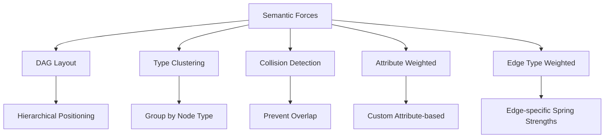
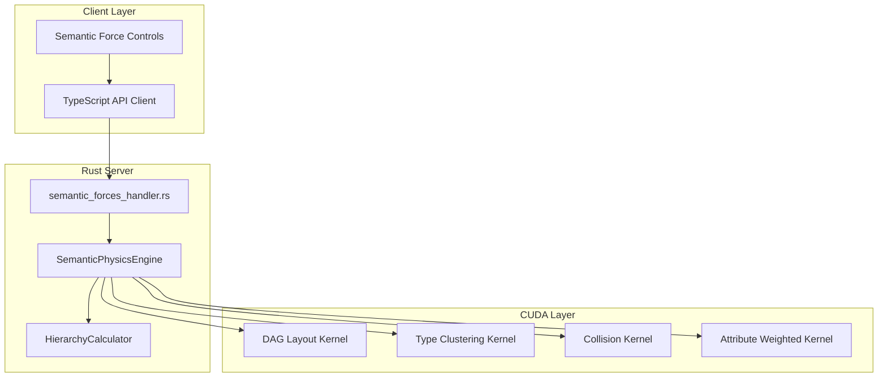
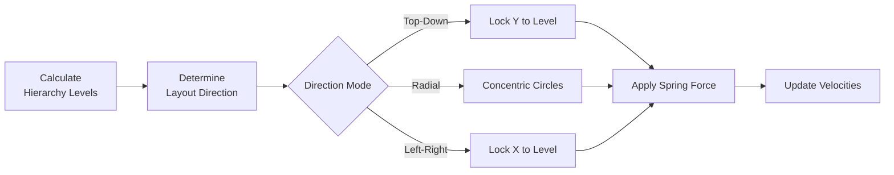
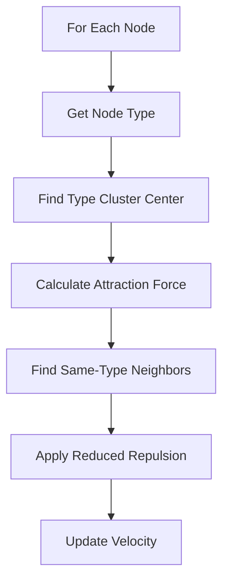
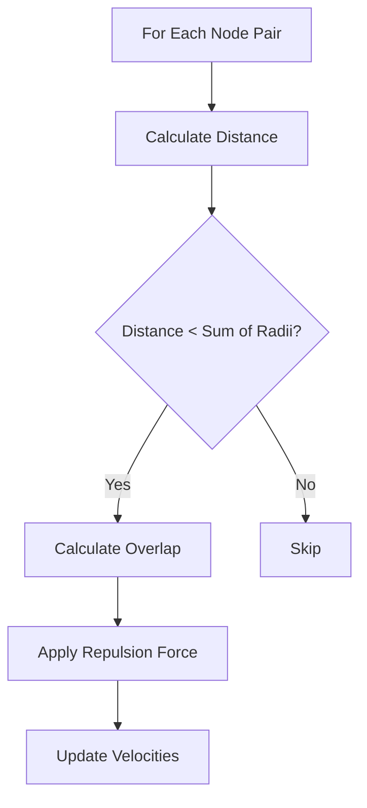
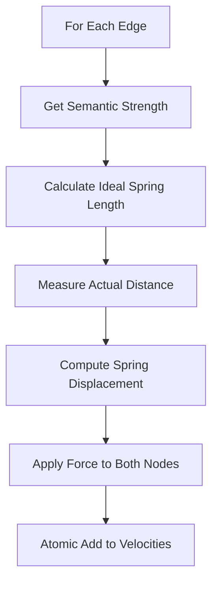
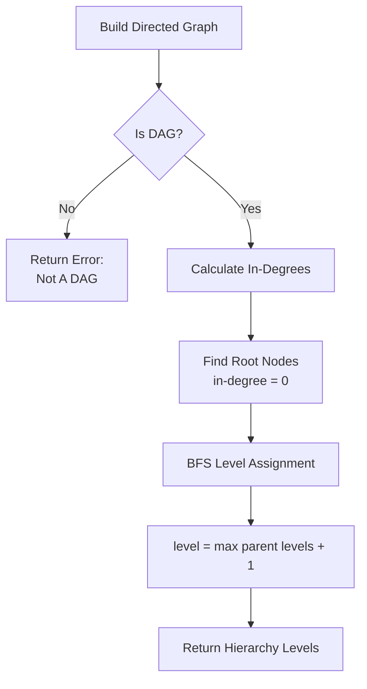

# Semantic Forces System

**Status:** Implementation Ready
**Version:** 1.0
**Last Updated:** 2025-11-05

---

## Overview

The Semantic Forces system enhances VisionFlow's GPU physics engine with semantic meaning, where forces convey information about relationships, hierarchies, and node types rather than just preventing overlap. This enables 10x more intuitive graph layouts with meaningful spatial organization.

**Source Inspiration:** `3d-force-graph` library patterns

---

## Core Concepts

### Semantic Force Types

VisionFlow implements five types of semantic forces:



1. **DAG Layout** - Hierarchical positioning for directed acyclic graphs
2. **Type Clustering** - Groups nodes by semantic type
3. **Collision Detection** - Prevents node overlap based on radius
4. **Attribute Weighted** - Custom forces based on node attributes
5. **Edge Type Weighted** - Different spring strengths per edge type

---

## System Architecture



---

## Data Model

### Node Type System

```rust
#[derive(Debug, Clone, Serialize, Deserialize, PartialEq)]
pub enum NodeType {
    Generic,
    Person,
    Organization,
    Project,
    Task,
    Concept,
    Class,      // Ontology class
    Individual, // Ontology individual
    Custom(String),
}
```

### Edge Type System

```rust
#[derive(Debug, Clone, Serialize, Deserialize, PartialEq)]
pub enum EdgeType {
    Generic,
    Dependency,
    Hierarchy,   // Parent-child
    Association,
    Sequence,    // Temporal or ordered
    SubClassOf,  // Ontology
    InstanceOf,  // Ontology
    Custom(String),
}
```

### Semantic Force Configuration

```rust
#[derive(Debug, Clone, Serialize, Deserialize)]
pub struct SemanticForceConfig {
    pub force_type: SemanticForceType,
    pub strength: f32,
    pub enabled: bool,
    pub parameters: HashMap<String, serde_json::Value>,
}

#[derive(Debug, Clone, Serialize, Deserialize, PartialEq)]
pub enum SemanticForceType {
    DAGLayout,           // Hierarchical layout
    TypeClustering,      // Group by node type
    Collision,           // Prevent overlap
    AttributeWeighted,   // Custom attribute-based
    EdgeTypeWeighted,    // Different edge types = different spring strengths
}
```

---

## CUDA Kernel Architecture

### 1. DAG Hierarchical Layout Kernel

Applies strong forces to arrange nodes in hierarchical layers based on graph topology.



**Supported Modes:**
- **Top-Down**: Vertical layers (Y-axis locked to hierarchy level)
- **Radial**: Concentric circles (distance from center = hierarchy level)
- **Left-Right**: Horizontal layers (X-axis locked to hierarchy level)

**Kernel Signature:**
```cuda
__global__ void apply_dag_force(
    const int* node_hierarchy_levels,
    const int* node_types,
    float3* positions,
    float3* velocities,
    const int num_nodes,
    const DAGConfig config
)
```

**Key Parameters:**
- `level_distance`: Distance between hierarchy levels (pixels/units)
- `strength`: Spring force strength pulling nodes to level
- `direction`: Layout mode (top-down, radial, left-right)

---

### 2. Type Clustering Kernel

Attracts nodes of the same type toward shared cluster centers, creating semantic groupings.



**Algorithm:**
1. Calculate cluster center for each node type
2. Apply attraction force toward type's cluster center
3. Reduce repulsion between nodes of the same type
4. Update velocities with combined forces

**Kernel Signature:**
```cuda
__global__ void apply_type_clustering(
    const int* node_types,
    float3* positions,
    float3* velocities,
    const int num_nodes,
    const TypeClusterConfig config
)
```

**Key Parameters:**
- `clustering_strength`: Attraction to cluster center
- `same_type_radius`: Range for reduced same-type repulsion
- `same_type_repulsion`: Repulsion strength for same-type nodes

---

### 3. Collision Detection Kernel

Prevents node overlap by applying repulsion forces when nodes are too close.



**Kernel Signature:**
```cuda
__global__ void apply_collision_force(
    const float* node_radii,
    float3* positions,
    float3* velocities,
    const int num_nodes,
    const float collision_strength
)
```

**Collision Resolution:**
- Force proportional to overlap amount
- Pushes nodes apart along their connection vector
- Symmetric (both nodes affected equally)

---

### 4. Attribute-Weighted Spring Force Kernel

Modifies spring forces based on edge semantic strength, allowing different relationship types to have different spatial properties.



**Kernel Signature:**
```cuda
__global__ void apply_attribute_weighted_springs(
    const int* edge_sources,
    const int* edge_targets,
    const float* edge_weights,
    const float* edge_semantic_strengths,
    float3* positions,
    float3* velocities,
    const int num_edges,
    const float spring_base_strength
)
```

**Formula:**
```
ideal_length = edge_weight × semantic_strength
displacement = actual_distance - ideal_length
force = (direction × displacement × base_strength × semantic_strength)
```

---

## Rust Backend Implementation

### SemanticPhysicsEngine

The main orchestrator for semantic forces:

```rust
pub struct SemanticPhysicsEngine {
    gpu_context: Arc<GpuContext>,
    force_configs: HashMap<SemanticForceType, SemanticForceConfig>,
    hierarchy_calculator: HierarchyCalculator,
}

impl SemanticPhysicsEngine {
    pub fn apply_semantic_forces(
        &self,
        nodes: &[GraphNode],
        edges: &[GraphEdge],
    ) -> Result<Vec<Vector3<f32>>, GpuError> {
        let mut velocity_updates = vec![Vector3::zero(); nodes.len()];

        // Apply enabled forces in sequence
        if self.is_enabled(SemanticForceType::DAGLayout) {
            let hierarchy_levels = self.hierarchy_calculator
                .calculate_levels(nodes, edges)?;
            self.apply_dag_kernel(&hierarchy_levels, &mut velocity_updates)?;
        }

        if self.is_enabled(SemanticForceType::TypeClustering) {
            self.apply_type_clustering_kernel(nodes, &mut velocity_updates)?;
        }

        if self.is_enabled(SemanticForceType::Collision) {
            self.apply_collision_kernel(nodes, &mut velocity_updates)?;
        }

        if self.is_enabled(SemanticForceType::AttributeWeighted) {
            self.apply_attribute_springs_kernel(nodes, edges, &mut velocity_updates)?;
        }

        Ok(velocity_updates)
    }
}
```

**Related Files:**
- `src/gpu/semantic_physics.rs` - Main engine
- `src/gpu/kernels/semantic_forces.cu` - CUDA kernels
- `src/models/graph_models.rs` - Type definitions

---

### Hierarchy Calculator

Computes hierarchy levels for DAG layout using topological sorting:



**Implementation:** `src/gpu/hierarchy_calculator.rs`

**Algorithm:**
1. Build directed graph from edges
2. Detect cycles (DAG validation)
3. Perform topological sort with BFS
4. Assign levels: `level[node] = max(parent_levels) + 1`
5. Cache results for performance

**Complexity:** O(V + E) where V = nodes, E = edges

---

## REST API

### Endpoints

| Method | Endpoint | Description |
|--------|----------|-------------|
| POST | `/api/semantic-forces/configure` | Configure a semantic force |
| GET | `/api/semantic-forces/status` | Get current force configuration |
| POST | `/api/semantic-forces/hierarchy` | Calculate hierarchy levels |

### Configure Semantic Force

**Request:**
```json
{
  "force_type": "DAGLayout",
  "strength": 10.0,
  "enabled": true,
  "parameters": {
    "direction": "top_down",
    "level_distance": 100.0
  }
}
```

**Response:**
```json
{
  "status": "success",
  "force_type": "DAGLayout",
  "enabled": true
}
```

### Get Status

**Response:**
```json
{
  "enabled_forces": ["DAGLayout", "Collision"],
  "dag_mode": "top_down",
  "hierarchy_levels": {
    "node-1": 0,
    "node-2": 1,
    "node-3": 1,
    "node-4": 2
  }
}
```

### Calculate Hierarchy

**Response:**
```json
{
  "hierarchy_levels": {
    "node-1": 0,
    "node-2": 1,
    "node-3": 1,
    "node-4": 2
  },
  "node_count": 4
}
```

---

## Frontend Integration

### SemanticForceControls Component

Provides UI controls for configuring semantic forces:

```typescript
export const SemanticForceControls: React.FC = () => {
  const [dagEnabled, setDagEnabled] = useState(false);
  const [dagMode, setDagMode] = useState<'td' | 'radial' | 'lr'>('td');
  const [clusteringEnabled, setClusteringEnabled] = useState(false);
  const [collisionEnabled, setCollisionEnabled] = useState(true);

  const handleDAGToggle = async () => {
    const newEnabled = !dagEnabled;
    setDagEnabled(newEnabled);

    await semanticForcesApi.configure({
      forceType: SemanticForceType.DAGLayout,
      strength: 10.0,
      enabled: newEnabled,
      parameters: {
        direction: dagMode,
        levelDistance: 100.0,
      },
    });
  };

  // ... UI rendering
};
```

**Location:** `client/src/features/physics/components/SemanticForceControls.tsx`

---

## Performance Characteristics

### GPU Acceleration

| Force Type | Complexity | GPU Threads | Memory Access |
|------------|-----------|-------------|---------------|
| DAG Layout | O(N) | N | Read-only |
| Type Clustering | O(N²) | N | Read-only |
| Collision | O(N²) | N | Read-only |
| Attribute Weighted | O(E) | E | Atomic writes |

**Optimization Strategies:**
- Spatial partitioning for collision detection (reduces to O(N log N))
- Cached hierarchy calculations
- Batch force updates
- Atomic operations for thread-safe velocity updates

### Benchmarks

**Expected Performance (NVIDIA RTX 3080):**
- 100K nodes: ~5ms per frame
- 1M edges: ~8ms per frame
- DAG hierarchy calculation: ~2ms (cached: <0.1ms)
- Type clustering: ~3ms for 10 types

---

## Use Cases

### 1. Organizational Hierarchy Visualization

```typescript
// Enable DAG layout for org charts
await semanticForcesApi.configure({
  forceType: 'DAGLayout',
  enabled: true,
  strength: 15.0,
  parameters: {
    direction: 'top_down',
    levelDistance: 120
  }
});
```

### 2. Knowledge Domain Clustering

```typescript
// Group concepts by semantic type
await semanticForcesApi.configure({
  forceType: 'TypeClustering',
  enabled: true,
  strength: 8.0,
  parameters: {
    clusteringStrength: 5.0,
    sameTypeRadius: 50.0
  }
});
```

### 3. Dependency Graph Layout

```typescript
// Hierarchical layout with collision prevention
await semanticForcesApi.configure({
  forceType: 'DAGLayout',
  enabled: true,
  parameters: { direction: 'left_right' }
});

await semanticForcesApi.configure({
  forceType: 'Collision',
  enabled: true,
  strength: 10.0
});
```

---

## Related Documentation

- [GPU Physics Architecture](./gpu-semantic-forces.md)
- [Hexagonal CQRS Architecture](./hexagonal-cqrs-architecture.md)
- [Semantic Intelligence Implementation Guide](../../guides/semantic-features-implementation.md)
- 

---

## Implementation Status

- [x] Type system design (NodeType, EdgeType)
- [x] CUDA kernel specifications
- [ ] CUDA kernel implementation
- [ ] Rust wrapper implementation
- [ ] Hierarchy calculator implementation
- [ ] API endpoints
- [ ] Frontend controls
- [ ] Performance testing
- [ ] Documentation

**Next Steps:** See [Semantic Features Implementation Guide](../../guides/semantic-features-implementation.md) for detailed implementation roadmap.
