# Data Flow Architecture

[← Knowledge Base](../index.md) > [Concepts](./index.md) > Data Flow

Understanding how data flows through VisionFlow is essential for effective system design and troubleshooting. This document details the various data pathways, processing stages, and synchronisation mechanisms that enable real-time collaboration between AI agents, GPU-accelerated visualisation, and distributed state management.

## Contents

- [Data Flow Overview](#data-flow-overview)
- [Graph Data Loading](#graph-data-loading)
- [Real-Time Updates via WebSocket](#real-time-updates-via-websocket)
- [Agent Telemetry System](#agent-telemetry-system)
- [Settings Persistence](#settings-persistence)
- [Data Processing Pipelines](#data-processing-pipelines)
- [Synchronisation Patterns](#synchronisation-patterns)
- [Performance Optimisation](#performance-optimisation)
- [Error Handling and Recovery](#error-handling-and-recovery)

## Data Flow Overview

VisionFlow processes multiple types of data through distinct but interconnected pipelines. The system is designed for real-time performance, with 60 FPS visualisation updates, sub-10ms WebSocket latency, and efficient bandwidth utilisation through binary protocols.

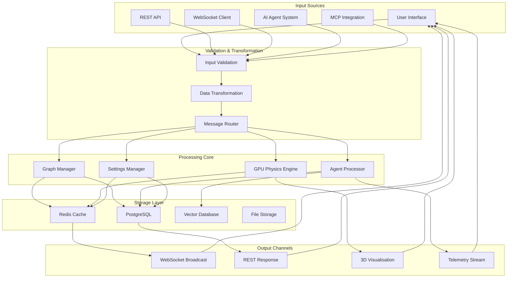

## Graph Data Loading

Graph data represents the knowledge network structure and flows through a multi-stage pipeline from initial load to real-time visualisation.

### Initial Load Process

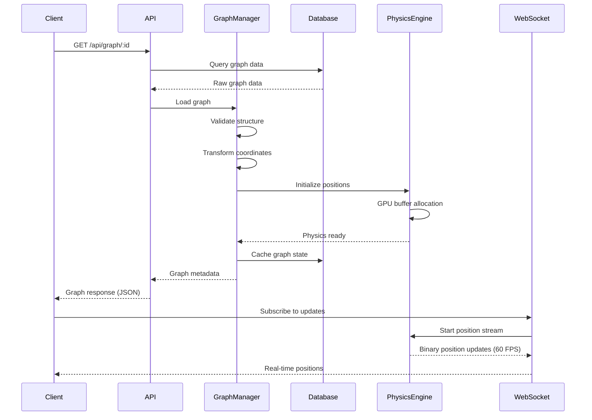

### Graph Data Structures

Core data types that flow through the system (see [API Reference](../reference/api/graph.md) for complete specifications):

**Node Structure:**
```typescript
interface GraphNode {
  id: string;                    // Unique identifier
  label: string;                 // Display name
  position: {                    // 3D spatial coordinates
    x: number;
    y: number;
    z: number;
  };
  metadata?: Record<string, any>; // Extensible metadata
  graphType?: 'logseq' | 'visionflow'; // Graph type classification
}
```

**Edge Structure:**
```typescript
interface GraphEdge {
  id: string;                    // Unique identifier
  source: string;                // Source node ID
  target: string;                // Target node ID
  label?: string;                // Optional edge label
  weight?: number;               // Edge weight for physics
  metadata?: Record<string, any>; // Extensible metadata
  graphType?: 'logseq' | 'visionflow'; // Graph type classification
}
```

### Graph Update Flow

When graph modifications occur (add/remove nodes or edges):

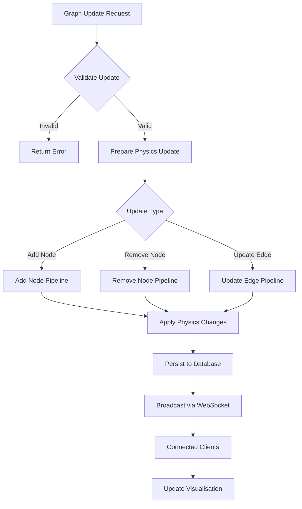

## Real-Time Updates via WebSocket

VisionFlow uses a hybrid approach for real-time updates: high-frequency binary position updates via WebSocket and lower-frequency metadata updates via REST polling.

### WebSocket Message Types

The system supports multiple message types for different data flows:

1. **Binary Position Updates** (60 FPS)
   - 34-byte binary format
   - Contains: node ID, x/y/z position, velocity
   - 84.8% bandwidth reduction vs JSON
   - Sub-10ms latency

2. **Graph Structure Updates**
   - Node additions/removals
   - Edge modifications
   - Metadata changes
   - Sent as JSON when structure changes

3. **Agent Status Updates**
   - Agent state changes
   - Task progress
   - Collaboration events
   - Telemetry data

### WebSocket Data Flow

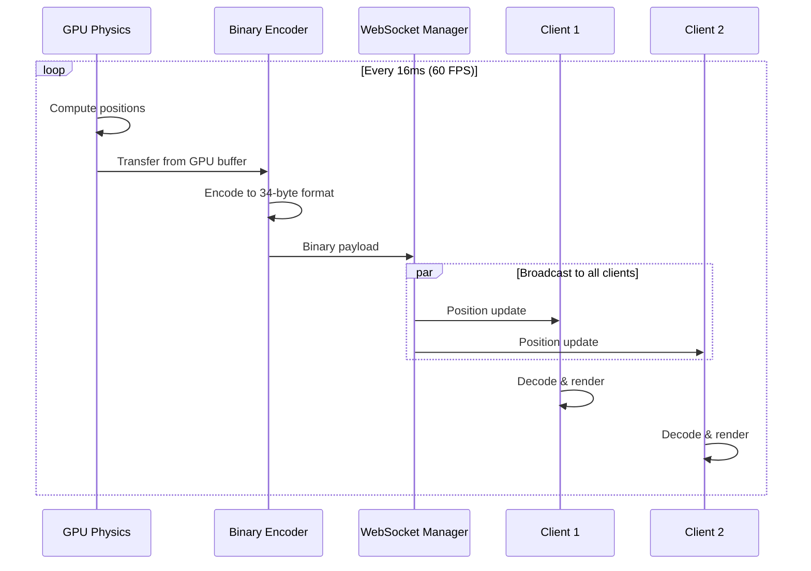

### Position Update Stream Implementation

The highest frequency data stream operates at 60 FPS:

```rust
pub struct PositionUpdateStream {
    gpu_buffer: Arc<Mutex<GPUBuffer>>,
    encoder: BinaryEncoder,
    websocket_manager: WebSocketManager,
}

impl PositionUpdateStream {
    pub async fn stream_loop(&mut self) {
        let mut interval = interval(Duration::from_millis(16)); // 60 FPS

        loop {
            interval.tick().await;

            // Get latest positions from GPU
            let positions = self.gpu_buffer.lock().await.get_positions();

            // Encode to 34-byte binary format per node
            let binary_data = self.encoder.encode_positions(&positions);

            // Broadcast to all connected clients
            self.websocket_manager
                .broadcast_binary(MessageType::PositionUpdate, binary_data)
                .await;
        }
    }
}
```

### Connection Management

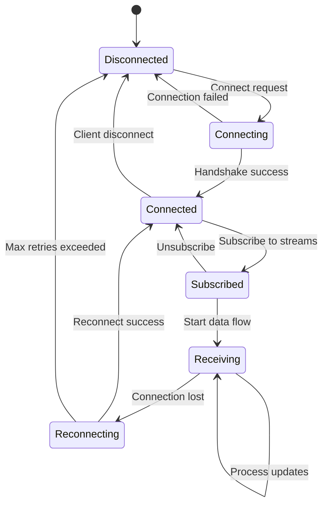

## Agent Telemetry System

Agent telemetry provides comprehensive monitoring of AI agent behaviour, performance, and collaboration patterns. The system uses a hybrid approach with high-frequency position data via WebSocket and metadata via REST polling.

### Telemetry Data Flow

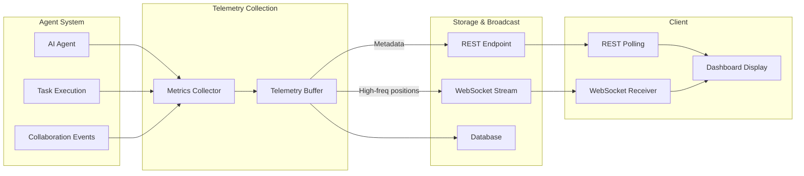

### Telemetry Metrics

The system collects comprehensive metrics for monitoring and debugging:

```typescript
interface TelemetryMetrics {
  // Agent activity
  agentSpawns: number;           // Total agents created
  activeAgents: number;          // Currently active agents
  completedTasks: number;        // Successfully completed tasks
  failedTasks: number;          // Failed task attempts

  // Communication
  webSocketMessages: number;     // Total WS messages
  restApiCalls: number;         // REST endpoint calls
  collaborationEvents: number;   // Inter-agent communications

  // Performance
  averageFrameTime: number;      // Rendering performance
  renderCycles: number;          // Total render cycles
  memoryUsage: number;          // Heap memory usage
  errorCount: number;           // Total errors encountered

  // System
  timestamp: Date;              // Collection timestamp
  sessionId: string;            // Session identifier
}
```

### Telemetry Upload Process

Telemetry data is uploaded periodically via REST API:

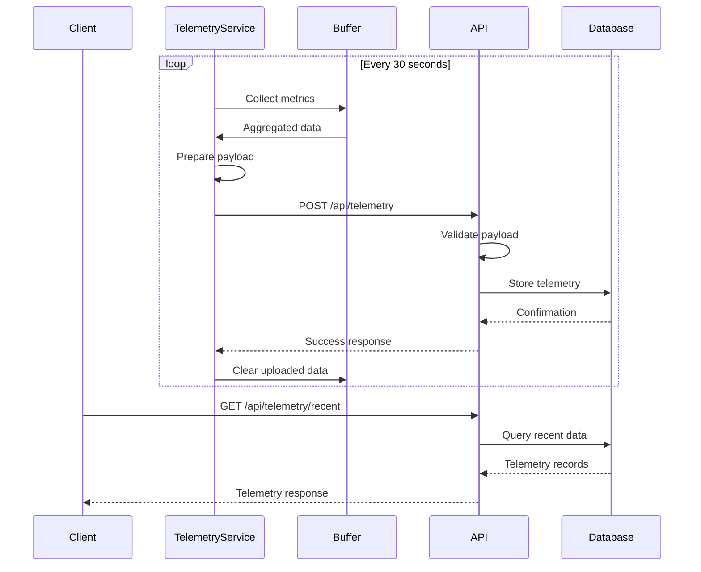

### Agent State Tracking

Agent states flow through the system for real-time monitoring:

```typescript
enum AgentState {
  IDLE = 'idle',
  THINKING = 'thinking',
  EXECUTING = 'executing',
  COLLABORATING = 'collaborating',
  BLOCKED = 'blocked',
  ERROR = 'error'
}

interface AgentStatusUpdate {
  agentId: string;
  swarmId: string;
  state: AgentState;
  currentTask?: string;
  progress?: number;        // 0-100
  collaboratingWith?: string[];
  timestamp: number;
}
```

## Settings Persistence

Settings flow through a sophisticated synchronisation system that maintains consistency across distributed clients whilst allowing real-time updates.

### Settings Data Flow

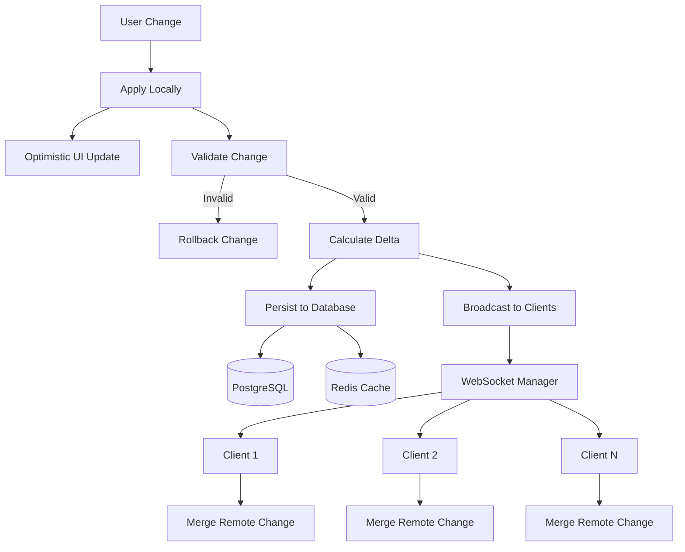

### Settings Structure

Settings are organised hierarchically with typed paths:

```typescript
interface SettingsState {
  // Visual settings
  nodes: NodeSettings;
  edges: EdgeSettings;

  // Physics configuration
  physics: PhysicsSettings;

  // Rendering options
  rendering: RenderingSettings;

  // System preferences
  system: SystemSettings;
}

interface NodeSettings {
  baseColor: string;           // Hex colour
  metalness: number;           // 0-1
  opacity: number;             // 0-1
  roughness: number;           // 0-1
  nodeSize: number;            // Base size
  quality: 'low' | 'medium' | 'high';
  enableInstancing: boolean;
  enableHologram: boolean;
  enableMetadataShape: boolean;
}

interface PhysicsSettings {
  enabled: boolean;

  // Core GPU forces
  springK: number;             // Spring constant
  repelK: number;              // Repulsion constant
  attractionK: number;         // Attraction force
  gravity: number;             // Centre gravity

  // Dynamics
  dt: number;                  // Time step
  maxVelocity: number;         // Velocity cap
  damping: number;             // Velocity damping
  temperature: number;         // Simulated annealing

  // Boundary conditions
  enableBounds: boolean;
  boundsSize: number;
  boundaryDamping: number;

  // Advanced parameters
  restLength: number;
  repulsionCutoff: number;
  gridCellSize: number;
  featureFlags: number;
}
```

### Settings Update Process

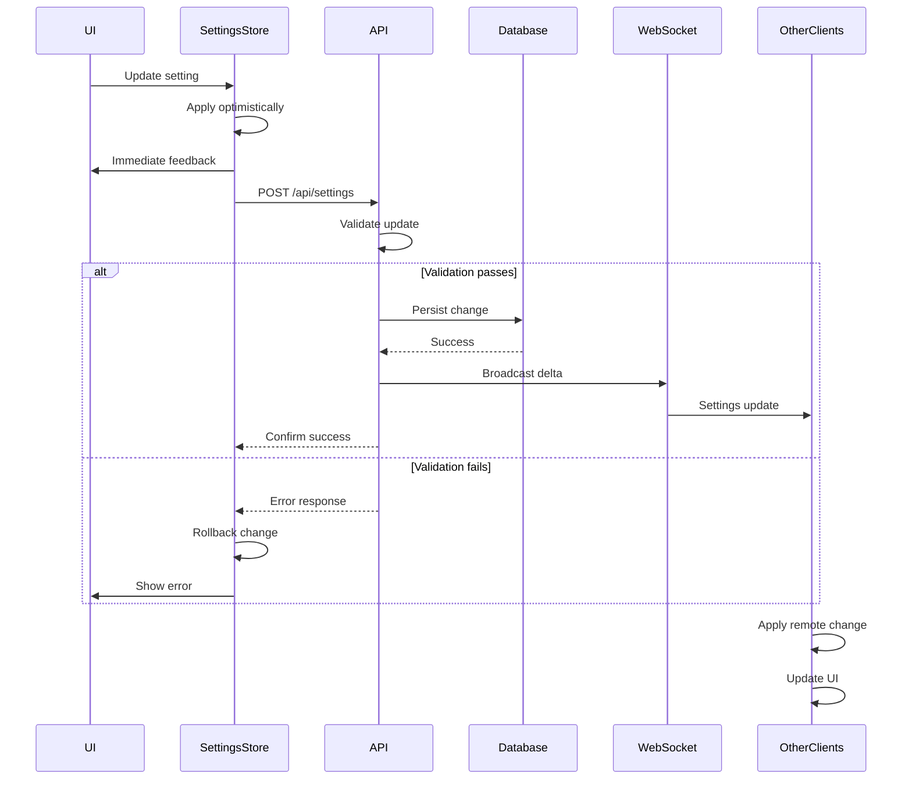

### Delta Tracking

The system tracks all setting changes for audit and synchronisation:

```rust
pub struct SettingsDelta {
    path: String,              // e.g., "physics.springK"
    old_value: Value,
    new_value: Value,
    timestamp: SystemTime,
    client_id: ClientId,
    session_id: String,
}

pub struct SettingsDataFlow {
    path_registry: PathRegistry,
    delta_tracker: DeltaTracker,
    sync_manager: SyncManager,
}

impl SettingsDataFlow {
    pub async fn process_settings_update(
        &mut self,
        path: &str,
        value: Value,
        client_id: ClientId
    ) -> Result<()> {
        // Validate path and value
        self.validate_setting(path, &value)?;

        // Apply update locally
        let old_value = self.apply_update(path, value.clone()).await?;

        // Calculate delta
        let delta = SettingsDelta {
            path: path.to_string(),
            old_value,
            new_value: value,
            timestamp: SystemTime::now(),
            client_id,
            session_id: self.current_session_id(),
        };

        // Persist to database
        self.persist_delta(&delta).await?;

        // Broadcast to other clients
        self.broadcast_delta(&delta).await?;

        Ok(())
    }
}
```

## Data Processing Pipelines

### Task Execution Pipeline

How tasks flow through the multi-agent system:

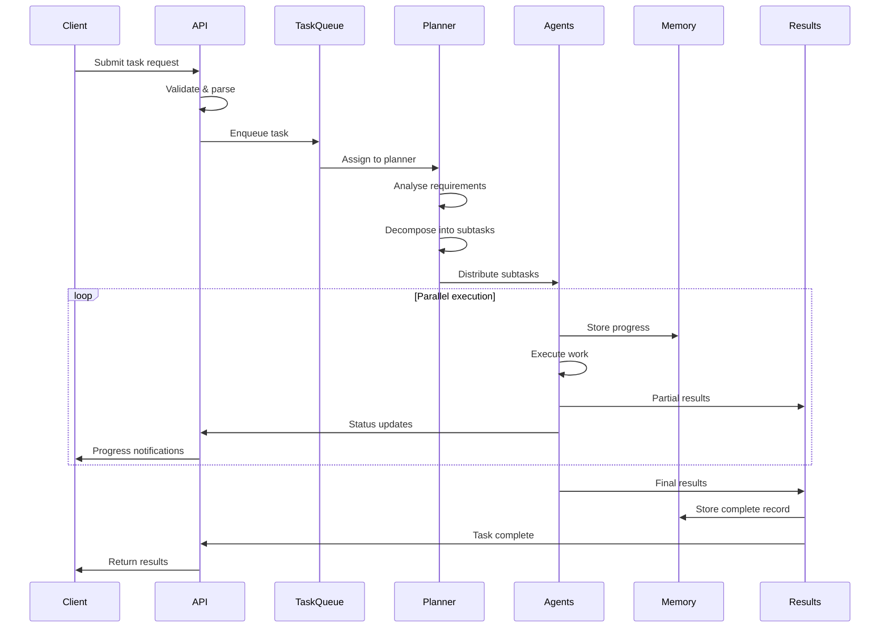

### Memory Storage Pipeline

Agent memory persistence with vector embeddings:

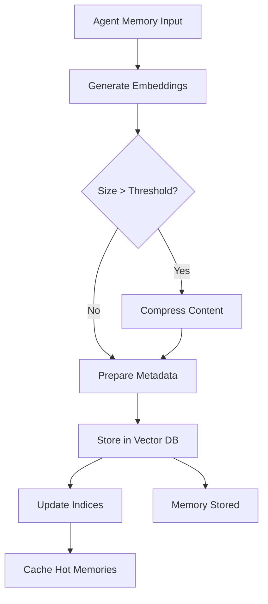

Implementation details:

```typescript
class MemoryStoragePipeline {
  private vectorDB: VectorDatabase;
  private embeddingModel: EmbeddingModel;
  private compressionEngine: CompressionEngine;

  async storeMemory(memory: AgentMemory): Promise<void> {
    // Stage 1: Generate embeddings
    const embedding = await this.embeddingModel.embed(memory.content);

    // Stage 2: Compress if needed
    const compressed = memory.content.length > COMPRESSION_THRESHOLD
      ? await this.compressionEngine.compress(memory.content)
      : memory.content;

    // Stage 3: Prepare metadata
    const metadata = {
      agentId: memory.agentId,
      timestamp: memory.timestamp,
      type: memory.type,
      importance: this.calculateImportance(memory),
      compressed: memory.content.length > COMPRESSION_THRESHOLD
    };

    // Stage 4: Store in vector database
    await this.vectorDB.upsert({
      id: memory.id,
      vector: embedding,
      content: compressed,
      metadata
    });

    // Stage 5: Update indices for fast retrieval
    await this.updateMemoryIndices(memory);
  }
}
```

### Graph Update Pipeline

Processing graph modifications with validation and physics:

```rust
pub struct GraphUpdatePipeline {
    validator: GraphValidator,
    physics: PhysicsEngine,
    persistence: GraphPersistence,
    broadcaster: UpdateBroadcaster,
}

impl GraphUpdatePipeline {
    pub async fn process_update(&mut self, update: GraphUpdate) -> Result<()> {
        // Stage 1: Validation
        let validated = self.validator.validate(update)?;

        // Stage 2: Physics pre-processing
        let physics_ready = self.physics.prepare_update(validated)?;

        // Stage 3: Apply update based on type
        let result = match physics_ready {
            GraphUpdate::AddNode(node) => {
                self.add_node_pipeline(node).await?
            }
            GraphUpdate::RemoveNode(id) => {
                self.remove_node_pipeline(id).await?
            }
            GraphUpdate::UpdateEdge(edge) => {
                self.update_edge_pipeline(edge).await?
            }
        };

        // Stage 4: Persist changes to database
        self.persistence.save(result.clone()).await?;

        // Stage 5: Broadcast update to connected clients
        self.broadcaster.send(result).await?;

        Ok(())
    }
}
```

## Synchronisation Patterns

### Optimistic Updates

Client-side updates with server reconciliation for responsive UX:

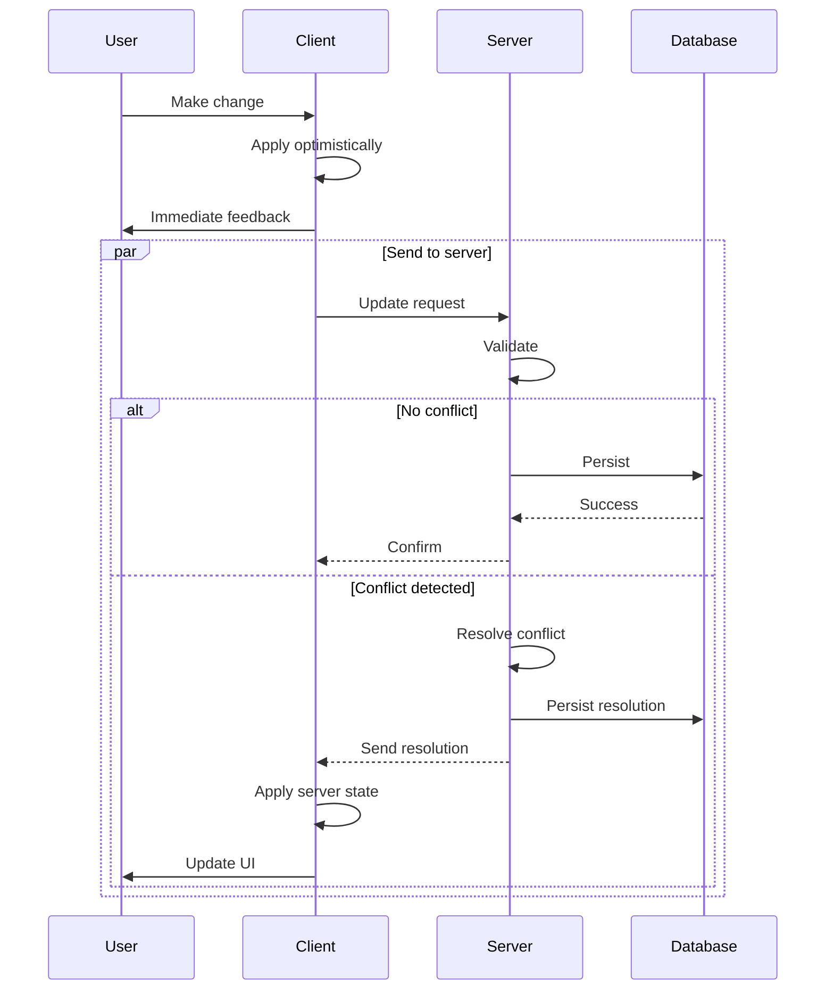

Implementation:

```typescript
class OptimisticUpdateManager {
  private pendingUpdates: Map<string, PendingUpdate> = new Map();

  async applyOptimisticUpdate(update: Update): Promise<void> {
    // Apply immediately on client for responsive UX
    this.applyLocal(update);

    // Track pending state for reconciliation
    const pending: PendingUpdate = {
      id: generateId(),
      update,
      localTimestamp: Date.now(),
      retryCount: 0
    };

    this.pendingUpdates.set(pending.id, pending);

    try {
      // Send to server
      const result = await this.sendToServer(update);

      // Reconcile if server state differs
      if (result.conflicted) {
        await this.reconcile(pending, result);
      }

      // Clean up successful update
      this.pendingUpdates.delete(pending.id);

    } catch (error) {
      // Rollback on failure
      await this.rollback(pending);
      throw error;
    }
  }

  private async reconcile(
    pending: PendingUpdate,
    serverResult: ServerResult
  ): Promise<void> {
    // Determine winner (last-write-wins, server priority, etc.)
    const resolution = this.resolveConflict(pending, serverResult);

    // Apply resolution
    this.applyLocal(resolution);

    // Notify user if their change was overridden
    if (resolution !== pending.update) {
      this.notifyConflictResolution(pending, resolution);
    }
  }
}
```

### Event Sourcing

Maintaining complete history of changes for audit and replay:

```rust
#[derive(Serialize, Deserialize)]
pub enum GraphEvent {
    NodeAdded {
        node: NodeData,
        timestamp: SystemTime
    },
    NodeRemoved {
        id: NodeId,
        timestamp: SystemTime
    },
    NodeMoved {
        id: NodeId,
        from: Vector3,
        to: Vector3,
        timestamp: SystemTime
    },
    EdgeCreated {
        edge: EdgeData,
        timestamp: SystemTime
    },
    EdgeDeleted {
        id: EdgeId,
        timestamp: SystemTime
    },
    EdgeWeightChanged {
        id: EdgeId,
        old: f32,
        new: f32,
        timestamp: SystemTime
    },
}

pub struct EventStore {
    events: Vec<GraphEvent>,
    snapshots: HashMap<SystemTime, GraphSnapshot>,
}

impl EventStore {
    pub async fn append_event(&mut self, event: GraphEvent) -> Result<()> {
        // Store event in memory
        self.events.push(event.clone());

        // Persist to database for durability
        self.persist_event(&event).await?;

        // Create snapshot periodically for fast replay
        if self.should_snapshot() {
            let snapshot = self.create_snapshot().await?;
            self.snapshots.insert(SystemTime::now(), snapshot);
        }

        Ok(())
    }

    pub async fn replay_to_time(&self, target_time: SystemTime) -> Result<Graph> {
        // Find nearest snapshot before target time
        let snapshot = self.find_nearest_snapshot(target_time);

        // Replay events from snapshot to target
        let mut graph = snapshot.to_graph();

        for event in &self.events {
            if event.timestamp() > snapshot.timestamp
                && event.timestamp() <= target_time {
                graph.apply_event(event)?;
            }
        }

        Ok(graph)
    }
}
```

### CRDT-Based Synchronisation

Conflict-free replicated data types for distributed state:

```rust
// Last-Write-Wins Register for conflict-free updates
pub struct LWWRegister<T> {
    value: T,
    timestamp: HLCTimestamp,  // Hybrid Logical Clock
}

impl<T: Clone> LWWRegister<T> {
    pub fn new(value: T, timestamp: HLCTimestamp) -> Self {
        Self { value, timestamp }
    }

    pub fn merge(&mut self, other: &LWWRegister<T>) {
        // Keep value with higher timestamp
        if other.timestamp > self.timestamp {
            self.value = other.value.clone();
            self.timestamp = other.timestamp;
        }
    }
}

// CRDT-based graph for collaborative editing
pub struct CRDTGraph {
    nodes: HashMap<NodeId, LWWRegister<NodeData>>,
    edges: HashMap<EdgeId, LWWRegister<EdgeData>>,
    tombstones: GSet<ItemId>,  // Grow-only set for deletions
}

impl CRDTGraph {
    pub fn add_node(&mut self, node: NodeData, timestamp: HLCTimestamp) {
        let register = LWWRegister::new(node, timestamp);
        self.nodes.insert(node.id, register);
    }

    pub fn merge(&mut self, other: &CRDTGraph) {
        // Merge nodes using LWW strategy
        for (id, register) in &other.nodes {
            match self.nodes.get_mut(id) {
                Some(local) => local.merge(register),
                None => {
                    self.nodes.insert(*id, register.clone());
                }
            }
        }

        // Merge edges
        for (id, register) in &other.edges {
            match self.edges.get_mut(id) {
                Some(local) => local.merge(register),
                None => {
                    self.edges.insert(*id, register.clone());
                }
            }
        }

        // Merge tombstones (grow-only set)
        self.tombstones.merge(&other.tombstones);
    }
}
```

## Performance Optimisation

### Data Batching

Efficient batch processing reduces overhead and improves throughput:

```rust
pub struct BatchProcessor<T> {
    batch_size: usize,
    timeout: Duration,
    buffer: Vec<T>,
    processor: Box<dyn Fn(Vec<T>) -> Result<()>>,
    flush_timer: Option<JoinHandle<()>>,
}

impl<T> BatchProcessor<T> {
    pub async fn add(&mut self, item: T) -> Result<()> {
        self.buffer.push(item);

        // Flush immediately if batch size reached
        if self.buffer.len() >= self.batch_size {
            self.flush().await?;
        } else {
            // Schedule timeout-based flush
            self.schedule_flush();
        }

        Ok(())
    }

    async fn flush(&mut self) -> Result<()> {
        if self.buffer.is_empty() {
            return Ok(());
        }

        // Take buffer contents
        let batch = std::mem::take(&mut self.buffer);

        // Process batch
        (self.processor)(batch)?;

        // Cancel flush timer
        if let Some(timer) = self.flush_timer.take() {
            timer.abort();
        }

        Ok(())
    }
}
```

### Multi-Level Caching

Caching strategy optimised for different access patterns:

```rust
pub struct DataCache {
    // L1: Hot data in memory (LRU)
    l1_cache: LruCache<String, CachedItem>,

    // L2: Warm data in shared memory
    l2_cache: Arc<Mutex<HashMap<String, CachedItem>>>,

    // L3: Cold data in Redis
    redis: RedisClient,
}

impl DataCache {
    pub async fn get(&mut self, key: &str) -> Option<Value> {
        // Check L1 cache (fastest)
        if let Some(item) = self.l1_cache.get(key) {
            if !item.is_expired() {
                return Some(item.value.clone());
            }
        }

        // Check L2 cache
        if let Some(item) = self.l2_cache.lock().await.get(key) {
            if !item.is_expired() {
                // Promote to L1
                self.l1_cache.put(key.to_string(), item.clone());
                return Some(item.value.clone());
            }
        }

        // Check L3 (Redis)
        if let Ok(Some(data)) = self.redis.get(key).await {
            let item = CachedItem::new(data);

            // Populate caches
            self.l2_cache.lock().await.insert(key.to_string(), item.clone());
            self.l1_cache.put(key.to_string(), item.clone());

            return Some(item.value);
        }

        None
    }

    pub async fn set(&mut self, key: &str, value: Value, ttl: Duration) -> Result<()> {
        let item = CachedItem::new_with_ttl(value, ttl);

        // Write to all cache levels
        self.l1_cache.put(key.to_string(), item.clone());
        self.l2_cache.lock().await.insert(key.to_string(), item.clone());
        self.redis.set_ex(key, &item.value, ttl.as_secs()).await?;

        Ok(())
    }
}
```

### Data Flow Monitoring

```rust
pub struct DataFlowMetrics {
    message_counters: HashMap<MessageType, AtomicU64>,
    latency_histograms: HashMap<String, Histogram>,
    throughput_gauges: HashMap<String, AtomicF64>,
}

impl DataFlowMetrics {
    pub fn record_message(&self, msg_type: MessageType, size: usize) {
        // Increment message counter
        self.message_counters
            .get(&msg_type)
            .map(|c| c.fetch_add(1, Ordering::Relaxed));

        // Update throughput gauge
        let key = format!("{:?}_throughput", msg_type);
        if let Some(gauge) = self.throughput_gauges.get(&key) {
            let current = gauge.load(Ordering::Relaxed);
            gauge.store(current + size as f64, Ordering::Relaxed);
        }
    }

    pub fn record_latency(&self, operation: &str, duration: Duration) {
        if let Some(histogram) = self.latency_histograms.get(operation) {
            histogram.record(duration.as_micros() as u64);
        }
    }
}
```

## Error Handling and Recovery

### Dead Letter Queue

Failed messages are queued for retry with exponential backoff:

```rust
pub struct DeadLetterQueue<T> {
    queue: VecDeque<FailedItem<T>>,
    max_retries: usize,
    retry_delay: Duration,
}

struct FailedItem<T> {
    item: T,
    error: Error,
    retry_count: usize,
    first_failure: SystemTime,
}

impl<T> DeadLetterQueue<T> {
    pub async fn handle_failure(&mut self, item: T, error: Error) {
        let failed_item = FailedItem {
            item,
            error,
            retry_count: 0,
            first_failure: SystemTime::now(),
        };

        self.queue.push_back(failed_item);
        self.schedule_retry().await;
    }

    async fn retry_loop(&mut self) {
        while let Some(mut failed_item) = self.queue.pop_front() {
            // Move to permanent storage if max retries exceeded
            if failed_item.retry_count >= self.max_retries {
                self.store_permanent_failure(failed_item).await;
                continue;
            }

            // Exponential backoff
            let delay = self.retry_delay * 2u32.pow(failed_item.retry_count as u32);
            sleep(delay).await;

            // Attempt retry
            match self.retry_item(&failed_item.item).await {
                Ok(_) => {
                    // Success - item processed
                    log::info!("Successfully retried failed item");
                }
                Err(e) => {
                    // Still failing - re-queue
                    failed_item.retry_count += 1;
                    failed_item.error = e;
                    self.queue.push_back(failed_item);
                }
            }
        }
    }
}
```

### Circuit Breaker Pattern

Prevents cascade failures by temporarily disabling failing services:

```rust
pub struct CircuitBreaker {
    state: Arc<Mutex<CircuitState>>,
    failure_threshold: usize,
    timeout: Duration,
    success_threshold: usize,
}

enum CircuitState {
    Closed { failures: usize },
    Open { opened_at: Instant },
    HalfOpen { successes: usize },
}

impl CircuitBreaker {
    pub async fn call<F, T>(&self, operation: F) -> Result<T>
    where
        F: FnOnce() -> Result<T>,
    {
        let mut state = self.state.lock().await;

        match &*state {
            CircuitState::Open { opened_at } => {
                // Check if timeout expired
                if opened_at.elapsed() > self.timeout {
                    // Transition to half-open
                    *state = CircuitState::HalfOpen { successes: 0 };
                } else {
                    // Fail fast
                    return Err(Error::CircuitOpen);
                }
            }
            _ => {}
        }

        drop(state);

        // Attempt operation
        match operation() {
            Ok(result) => {
                self.record_success().await;
                Ok(result)
            }
            Err(err) => {
                self.record_failure().await;
                Err(err)
            }
        }
    }

    async fn record_success(&self) {
        let mut state = self.state.lock().await;

        match &*state {
            CircuitState::HalfOpen { successes } => {
                let new_successes = successes + 1;
                if new_successes >= self.success_threshold {
                    // Close circuit
                    *state = CircuitState::Closed { failures: 0 };
                } else {
                    *state = CircuitState::HalfOpen {
                        successes: new_successes
                    };
                }
            }
            CircuitState::Closed { .. } => {
                // Reset failure count
                *state = CircuitState::Closed { failures: 0 };
            }
            _ => {}
        }
    }

    async fn record_failure(&self) {
        let mut state = self.state.lock().await;

        match &*state {
            CircuitState::Closed { failures } => {
                let new_failures = failures + 1;
                if new_failures >= self.failure_threshold {
                    // Open circuit
                    *state = CircuitState::Open {
                        opened_at: Instant::now()
                    };
                } else {
                    *state = CircuitState::Closed {
                        failures: new_failures
                    };
                }
            }
            CircuitState::HalfOpen { .. } => {
                // Back to open
                *state = CircuitState::Open {
                    opened_at: Instant::now()
                };
            }
            _ => {}
        }
    }
}
```

## Summary

VisionFlow's data flow architecture enables:

- **Real-Time Performance**: 60 FPS visualisation with sub-10ms WebSocket latency
- **Scalability**: Efficient batching, caching, and binary protocols (84.8% bandwidth reduction)
- **Reliability**: Event sourcing, dead letter queues, and circuit breakers for graceful failure handling
- **Flexibility**: Multiple synchronisation patterns (optimistic updates, CRDT, event sourcing)
- **Observability**: Comprehensive metrics and telemetry for monitoring and debugging

The system's thoughtful design ensures data integrity whilst maintaining the performance required for real-time AR/VR experiences and multi-agent collaboration.

## Related Documentation

- [Networking and Protocols](./04-networking.md) - WebSocket infrastructure and binary protocols
- [GPU Compute Architecture](./03-gpu-compute.md) - Physics engine and position updates
- [Agentic Workers](./02-agentic-workers.md) - Agent system and task execution
- [System Overview](./01-system-overview.md) - Complete architecture overview
- [API Reference: Graph Types](../reference/api/graph.md) - Complete data structure specifications
- [API Reference: WebSocket Messages](../reference/api/websocket.md) - Message type definitions
