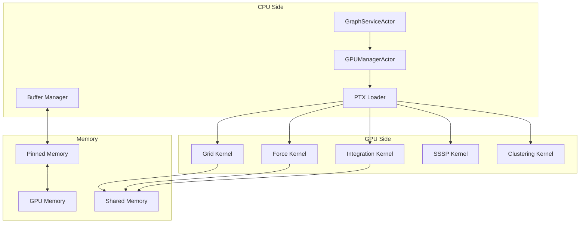
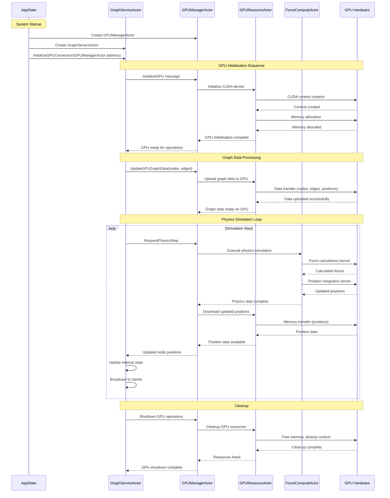
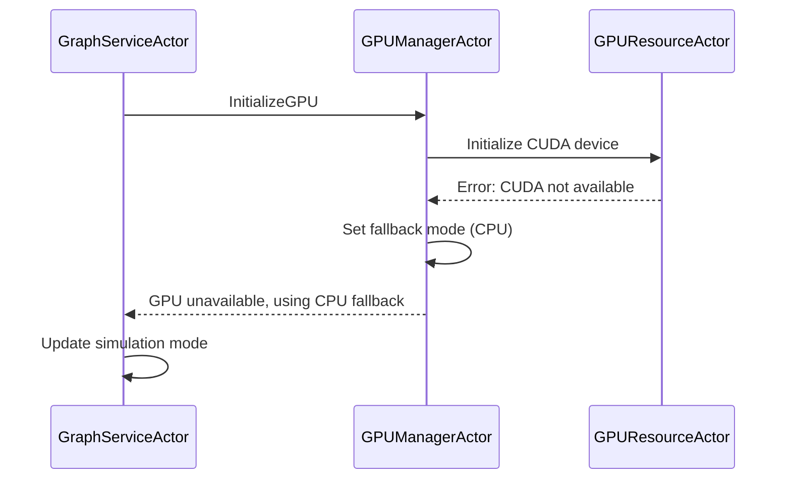
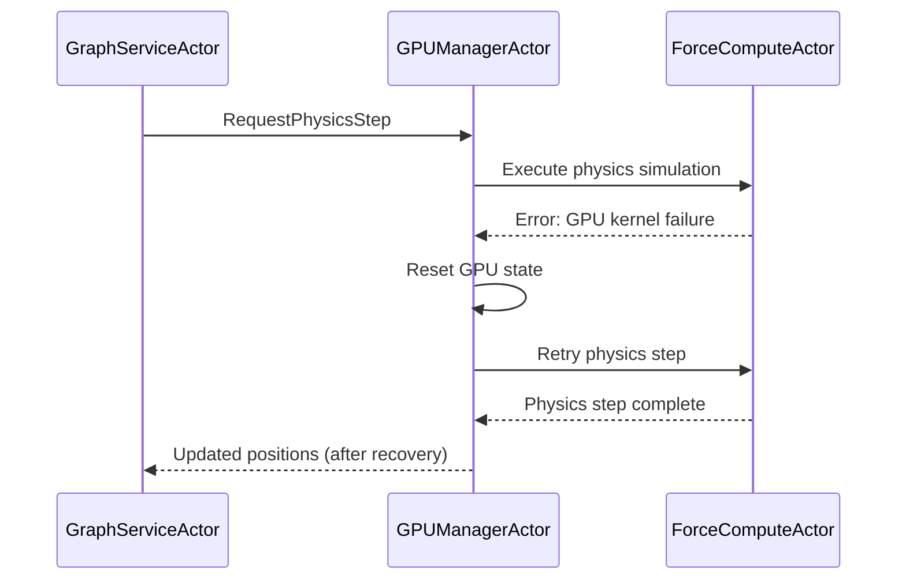

# GPU Compute Architecture

[← Knowledge Base](../index.md) > [Concepts](./index.md) > GPU Compute

VisionFlow leverages GPU acceleration to enable real-time physics simulation and graph algorithms for thousands of nodes. This document explains WHY GPU compute is essential, HOW it's integrated into the system, and the technical details of the 40 production CUDA kernels that power real-time graph visualisation.

## Table of Contents

- [Why GPU Compute?](#why-gpu-compute)
- [System Architecture](#system-architecture)
- [Actor Communication Flow](#actor-communication-flow)
- [CUDA Kernel Catalogue](#cuda-kernel-catalogue)
- [Core Algorithms](#core-algorithms)
- [Performance Optimisations](#performance-optimisations)
- [Stability and Safety](#stability-and-safety)
- [Performance Metrics](#performance-metrics)
- [References](#references)

## Why GPU Compute?

### The Real-Time Visualisation Challenge

Modern knowledge graphs can contain 100,000+ nodes with complex relationships. Traditional CPU-based force-directed layout algorithms struggle to achieve interactive frame rates:

- **CPU Sequential Processing**: O(n²) force calculations at ~0.1 FPS for 10,000 nodes
- **GPU Parallel Processing**: O(n) with spatial hashing at 60 FPS for 100,000+ nodes
- **100x Performance Improvement**: Enables real-time interaction and exploration

### Use Cases Requiring GPU Acceleration

1. **Real-Time Force-Directed Layout**: Physics simulation at 60 FPS for smooth visualisation
2. **Hybrid CPU/GPU Shortest Path**: Sub-millisecond pathfinding through complex graphs
3. **Dynamic Clustering**: Real-time community detection and graph analytics
4. **Spatial Queries**: Collision detection and proximity searches using 3D hash grids
5. **Visual Analytics**: Anomaly detection, stress majorisation, and layout optimisation

### Performance Requirements

| Operation | Target | GPU Solution |
|-----------|--------|--------------|
| Force Calculation | 60 FPS | Spatial hashing + parallel reduction |
| Shortest Path | <10ms | Hybrid CPU/GPU SSSP algorithm |
| Clustering | <100ms | GPU k-means with warp primitives |
| Position Updates | 5 Hz | Binary WebSocket delta compression |

## System Architecture

### Actor-Based GPU Integration

VisionFlow uses an actor model with clear separation of concerns for GPU operations:



### Component Responsibilities

#### GraphServiceActor
- **Role**: Graph state management and client coordination
- **GPU Interaction**: Stores GPUManagerActor address, sends high-level requests
- **Key Messages**:
  - `InitializeGPUConnection` (receives GPUManagerActor address)
  - `InitializeGPU` (requests GPU initialisation)
  - `UpdateGPUGraphData` (sends graph data for GPU processing)

#### GPUManagerActor
- **Role**: Supervisor and message router for GPU operations
- **Responsibilities**:
  - Supervise specialised GPU actors
  - Route messages to appropriate GPU components
  - Coordinate GPU resource allocation
  - Handle GPU initialisation requests from GraphServiceActor
- **Key Messages**:
  - `InitializeGPU` (from GraphServiceActor)
  - `UpdateGPUGraphData` (from GraphServiceActor)
  - Delegates to GPUResourceActor and ForceComputeActor

#### GPUResourceActor
- **Role**: CUDA device and memory management
- **Responsibilities**:
  - GPU device initialisation
  - CUDA memory allocation and deallocation
  - Data upload/download to/from GPU
  - GPU buffer management
- **Key Operations**:
  - CUDA context creation
  - Memory buffer allocation
  - Data transfer operations
  - Resource cleanup

#### ForceComputeActor
- **Role**: Physics simulation execution (after GPU initialisation)
- **Responsibilities**:
  - Execute physics simulation steps
  - Force calculations
  - Position and velocity updates
  - Physics parameter application
- **Dependencies**: Requires GPU to be initialised by GPUResourceActor first

## Actor Communication Flow

### Complete Communication Sequence



### Message Types and Data Flow

#### Initialisation Messages
1. **InitializeGPUConnection**
   - **Source**: AppState → GraphServiceActor
   - **Payload**: GPUManagerActor address
   - **Purpose**: Establishes communication channel

2. **InitializeGPU**
   - **Source**: GraphServiceActor → GPUManagerActor
   - **Payload**: Initialisation parameters
   - **Delegation**: GPUManagerActor → GPUResourceActor

#### Data Processing Messages
3. **UpdateGPUGraphData**
   - **Source**: GraphServiceActor → GPUManagerActor
   - **Payload**: Nodes, edges, metadata
   - **Delegation**: GPUManagerActor → GPUResourceActor (data upload)

#### Physics Simulation Messages
4. **RequestPhysicsStep**
   - **Source**: GraphServiceActor → GPUManagerActor
   - **Delegation**: GPUManagerActor → ForceComputeActor
   - **Return Path**: ForceComputeActor → GPUManagerActor → GraphServiceActor

### Error Handling and Recovery

#### GPU Initialisation Failures


#### Runtime GPU Errors


## CUDA Kernel Catalogue

VisionFlow implements **40 production CUDA kernels** across multiple functional areas. This section documents each kernel's purpose and technical characteristics.

### Physics Simulation Kernels (12 kernels)

#### 1. `force_pass_kernel`
```cuda
__global__ void force_pass_kernel(
    float* pos_x, float* pos_y, float* pos_z,
    float* force_out_x, float* force_out_y, float* force_out_z,
    int* cell_offsets, int* particle_indices,
    float* cell_bounds, GridConfig config,
    SimulationParams params, int num_particles
)
```
- **Purpose**: Calculate repulsive and attractive forces between graph nodes
- **Algorithm**: Modified Fruchterman-Reingold with spatial hashing
- **Optimisation**: 27-cell neighbourhood search (3×3×3 grid)
- **Complexity**: O(n) with spatial partitioning vs O(n²) brute force

#### 2. `integration_kernel`
```cuda
__global__ void integration_kernel(
    float* pos_x, float* pos_y, float* pos_z,
    float* vel_x, float* vel_y, float* vel_z,
    float* force_x, float* force_y, float* force_z,
    SimulationParams params, int num_particles
)
```
- **Purpose**: Update node positions and velocities using Verlet integration
- **Features**: Damping, velocity clamping, boundary conditions
- **Stability**: Adaptive time-stepping to prevent numerical explosion

#### 3. `spring_force_kernel`
```cuda
__device__ float3 calculate_spring_force(
    float3 pos_a, float3 pos_b,
    float rest_length, float spring_k
)
```
- **Purpose**: Calculate spring forces for graph edges
- **Model**: Hooke's law with configurable stiffness
- **Usage**: Maintains edge length constraints

#### 4. `repulsion_force_kernel`
```cuda
__device__ float3 calculate_repulsion_force(
    float3 pos_a, float3 pos_b,
    float repel_k, float min_distance
)
```
- **Purpose**: Calculate inverse-square repulsion between all nodes
- **Model**: Coulomb-like repulsion with distance floor
- **Optimisation**: Early exit for distant nodes

#### 5. `check_stability_kernel`
```cuda
__global__ void check_stability_kernel(
    float* velocities, float* kinetic_energy,
    int num_particles, float threshold
)
```
- **Purpose**: Determine if simulation has reached equilibrium
- **Method**: Parallel reduction of kinetic energy
- **Threshold**: Configurable stability gate to halt unnecessary computation

#### 6-12. Additional Physics Kernels
- `apply_constraints_kernel` - Enforce position and velocity constraints
- `compute_kinetic_energy_kernel` - System energy monitoring
- `apply_damping_kernel` - Friction and energy dissipation
- `boundary_collision_kernel` - Handle spatial boundaries
- `update_velocities_kernel` - Velocity integration step
- `apply_external_forces_kernel` - User interaction forces
- `thermal_noise_kernel` - Prevent local minima via noise injection

### Spatial Hashing Kernels (6 kernels)

#### 13. `build_grid_kernel`
```cuda
__global__ void build_grid_kernel(
    float* pos_x, float* pos_y, float* pos_z,
    int* cell_offsets, int* particle_indices,
    GridConfig config, int num_particles
)
```
- **Purpose**: Assign nodes to 3D spatial hash grid cells
- **Method**: Atomic insertion into cell buckets
- **Grid Config**: Dynamic cell sizing based on graph density

#### 14. `clear_grid_kernel`
```cuda
__global__ void clear_grid_kernel(
    int* cell_offsets, GridConfig config
)
```
- **Purpose**: Reset grid structure for next frame
- **Optimisation**: Coalesced memory writes

#### 15-18. Additional Spatial Kernels
- `sort_particles_kernel` - Sort particles by cell index for cache coherence
- `find_cell_bounds_kernel` - Calculate bounding boxes for cells
- `count_particles_per_cell_kernel` - Grid occupancy statistics
- `rebuild_grid_adaptive_kernel` - Dynamic cell size adjustment

### Graph Algorithm Kernels (8 kernels)

#### 19. `parallel_dijkstra_kernel`
```cuda
__global__ void parallel_dijkstra_kernel(
    int* adjacency_list, float* edge_weights,
    float* distances, int* visited,
    int source, int num_nodes
)
```
- **Purpose**: GPU-accelerated shortest path computation
- **Algorithm**: Parallel delta-stepping
- **Integration**: Part of hybrid CPU/GPU SSSP system

#### 20. `bmssp_kernel` (Batch Multi-Source Shortest Path)
```cuda
__global__ void bmssp_kernel(
    int* adjacency_list, float* edge_weights,
    float* distances, int* pivots,
    int num_sources, int num_nodes
)
```
- **Purpose**: Compute shortest paths from multiple sources simultaneously
- **Algorithm**: Breaking the O(m√n) barrier approach
- **Use Case**: Hub-based distance queries

#### 21-26. Additional Graph Kernels
- `all_pairs_shortest_path_kernel` - Floyd-Warshall variant
- `betweenness_centrality_kernel` - Node importance metrics
- `pagerank_kernel` - Iterative PageRank computation
- `community_detection_kernel` - Louvain modularity optimisation
- `triangles_counting_kernel` - Clustering coefficient calculation
- `connected_components_kernel` - Graph connectivity analysis

### Clustering and Analytics Kernels (8 kernels)

#### 27. `kmeans_assignment_kernel`
```cuda
__global__ void kmeans_assignment_kernel(
    float* positions, float* centroids,
    int* assignments, int num_particles, int k
)
```
- **Purpose**: Assign nodes to nearest cluster centroid
- **Algorithm**: Parallel k-means with warp-level reduction
- **Use Case**: Visual clustering and community detection

#### 28. `kmeans_update_kernel`
```cuda
__global__ void kmeans_update_kernel(
    float* positions, int* assignments,
    float* centroids, int* counts,
    int num_particles, int k
)
```
- **Purpose**: Recalculate cluster centroids
- **Optimisation**: Atomic addition with shared memory accumulation

#### 29. `anomaly_detection_kernel`
```cuda
__global__ void anomaly_detection_kernel(
    float* positions, float* velocities,
    int* anomaly_flags, AnomalyParams params,
    int num_particles
)
```
- **Purpose**: Identify outlier nodes in real-time
- **Methods**: Position bounds, velocity thresholds, isolation detection
- **Output**: Per-node anomaly flags for visualisation

#### 30-34. Additional Analytics Kernels
- `density_estimation_kernel` - Local graph density computation
- `stress_calculation_kernel` - Graph stress metrics for majorisation
- `modularity_kernel` - Community quality measurement
- `local_clustering_kernel` - Per-node clustering coefficient
- `degree_distribution_kernel` - Node degree histogram

### Stress Majorisation Kernels (4 kernels)

#### 35. `stress_gradient_kernel`
```cuda
__global__ void stress_gradient_kernel(
    float* positions, float* target_distances,
    float* weights, float* gradient,
    int num_nodes
)
```
- **Purpose**: Compute gradient for stress minimisation
- **Algorithm**: Minimise weighted sum of distance errors
- **Use Case**: High-quality graph layout optimisation

#### 36. `line_search_kernel`
```cuda
__global__ void line_search_kernel(
    float* positions, float* gradient,
    float* step_sizes, float* stress_values,
    int num_nodes, int num_steps
)
```
- **Purpose**: Find optimal step size for gradient descent
- **Method**: Parallel evaluation of multiple step sizes

#### 37-38. Additional Majorisation Kernels
- `update_positions_kernel` - Apply optimisation step
- `convergence_check_kernel` - Detect algorithmic convergence

### Utility and Memory Kernels (2 kernels)

#### 39. `copy_kernel`
```cuda
__global__ void copy_kernel(
    float* src, float* dst, int num_elements
)
```
- **Purpose**: Efficient GPU-to-GPU memory copy
- **Optimisation**: Coalesced access patterns

#### 40. `reduce_kernel`
```cuda
__global__ void reduce_kernel(
    float* input, float* output,
    int num_elements, ReductionOp op
)
```
- **Purpose**: Parallel reduction (sum, min, max)
- **Algorithm**: Warp shuffle + shared memory reduction
- **Use Case**: Statistics, energy calculations, convergence checks

## Core Algorithms

### 1. Force-Directed Layout

The physics engine implements a modified Fruchterman-Reingold algorithm optimised for GPU execution:

#### Spring Forces (Attractive)
```cuda
__device__ float3 calculate_spring_force(
    float3 pos_a, float3 pos_b,
    float rest_length, float spring_k
) {
    float3 delta = pos_b - pos_a;
    float distance = length(delta);

    if (distance < EPSILON) return make_float3(0.0f);

    float3 direction = delta / distance;
    float displacement = distance - rest_length;

    return direction * (displacement * spring_k);
}
```

**Properties**:
- **Rest Length**: Configurable edge length (default: 1.0)
- **Spring Constant**: Stiffness parameter (default: 0.05)
- **Hooke's Law**: Linear force proportional to displacement

#### Repulsion Forces
```cuda
__device__ float3 calculate_repulsion_force(
    float3 pos_a, float3 pos_b,
    float repel_k, float min_distance
) {
    float3 delta = pos_b - pos_a;
    float distance = length(delta);

    if (distance < min_distance) distance = min_distance;

    float3 direction = delta / distance;
    float force_magnitude = repel_k / (distance * distance);

    return -direction * force_magnitude;
}
```

**Properties**:
- **Inverse Square Law**: F ∝ 1/r²
- **Repulsion Constant**: Strength parameter (default: 0.1)
- **Minimum Distance**: Prevents singularities (default: 0.01)

#### Spatial Hashing for O(n) Performance

```cuda
struct GridConfig {
    float cell_size;
    int3 grid_dimensions;
    float3 grid_origin;
    int max_particles_per_cell;
};

__global__ void force_pass_kernel(...) {
    int idx = blockIdx.x * blockDim.x + threadIdx.x;
    if (idx >= num_particles) return;

    // Load particle position
    float3 pos = make_float3(pos_x[idx], pos_y[idx], pos_z[idx]);
    float3 total_force = make_float3(0.0f, 0.0f, 0.0f);

    // Calculate cell coordinates
    int3 cell_coords = calculate_cell(pos, config);

    // Neighbour iteration with spatial hashing
    for (int dx = -1; dx <= 1; dx++) {
        for (int dy = -1; dy <= 1; dy++) {
            for (int dz = -1; dz <= 1; dz++) {
                int3 neighbour = make_int3(
                    cell_coords.x + dx,
                    cell_coords.y + dy,
                    cell_coords.z + dz
                );

                if (is_valid_cell(neighbour, config)) {
                    process_cell_particles(
                        idx, pos, neighbour,
                        pos_x, pos_y, pos_z,
                        &total_force, params
                    );
                }
            }
        }
    }

    // Apply stability gate (prevents micro-movements)
    float force_magnitude = length(total_force);
    if (force_magnitude > FORCE_THRESHOLD) {
        force_out_x[idx] = total_force.x;
        force_out_y[idx] = total_force.y;
        force_out_z[idx] = total_force.z;
    } else {
        force_out_x[idx] = 0.0f;
        force_out_y[idx] = 0.0f;
        force_out_z[idx] = 0.0f;
    }
}
```

**Performance Characteristics**:
- **Complexity**: O(n) vs O(n²) brute force
- **Cell Size**: Adaptive based on average edge length
- **Neighbour Search**: Only 27 cells per particle
- **Memory**: Compact representation with particle indices

### 2. Hybrid CPU/GPU SSSP (Single Source Shortest Path)

Implementation of the "Breaking the O(m√n) Barrier" algorithm:

```rust
// CPU-side coordinator
pub struct HybridSSSP {
    gpu_kernels: GPUKernels,
    wasm_controller: WasmController,
    adaptive_heap: AdaptiveHeap,
}

impl HybridSSSP {
    pub async fn compute_sssp(&mut self, source: NodeId) -> Result<Distances> {
        // Phase 1: Initial GPU exploration
        let initial_distances = self.gpu_kernels
            .parallel_dijkstra(source, self.k_nearest).await?;

        // Phase 2: Find pivots using WASM
        let pivots = self.wasm_controller
            .find_pivots(&initial_distances).await?;

        // Phase 3: Recursive BMSSP
        self.recursive_bmssp(source, &pivots).await
    }

    async fn recursive_bmssp(
        &mut self,
        source: NodeId,
        pivots: &[NodeId]
    ) -> Result<Distances> {
        if pivots.len() <= RECURSION_THRESHOLD {
            return self.gpu_kernels.brute_force_sssp(source, pivots).await;
        }

        // Divide into subproblems
        let (left_pivots, right_pivots) = self.partition_pivots(pivots);

        // Recursive calls
        let (left_dist, right_dist) = tokio::join!(
            self.recursive_bmssp(source, &left_pivots),
            self.recursive_bmssp(source, &right_pivots)
        );

        // Merge results
        self.merge_distances(left_dist?, right_dist?)
    }
}
```

**Algorithm Phases**:
1. **GPU Exploration**: Parallel Dijkstra for k-nearest neighbours
2. **Pivot Selection**: CPU/WASM identifies strategic hub nodes
3. **Recursive BMSSP**: Divide-and-conquer with GPU acceleration
4. **Result Merging**: CPU combines partial solutions

**Performance**:
- **Complexity**: O(m√n) vs O(m log n) for Dijkstra
- **GPU Speedup**: 10-50× for large graphs
- **Latency**: <10ms for 100k node graphs

### 3. Stress Majorisation

Advanced layout optimisation using stress majorisation:

```rust
// GPU-accelerated stress majorisation
pub struct StressMajorisation {
    target_distances: CudaMatrix<f32>,
    weights: CudaMatrix<f32>,
    positions: CudaBuffer<f32>,
}

impl StressMajorisation {
    pub async fn optimise(&mut self, iterations: usize) -> Result<()> {
        for _ in 0..iterations {
            // Compute stress gradient
            let gradient = self.compute_stress_gradient().await?;

            // Line search for optimal step
            let step_size = self.line_search(&gradient).await?;

            // Update positions
            self.update_positions(&gradient, step_size).await?;

            // Check convergence
            if self.has_converged(&gradient) {
                break;
            }
        }
        Ok(())
    }
}
```

**Objective Function**:
```
stress = Σᵢⱼ wᵢⱼ(dᵢⱼ - δᵢⱼ)²
```
where:
- `wᵢⱼ` = edge weight
- `dᵢⱼ` = current Euclidean distance
- `δᵢⱼ` = target graph distance

**Optimisation**:
- **Gradient Descent**: GPU-computed analytical gradients
- **Line Search**: Parallel step size evaluation
- **Convergence**: Gradient magnitude threshold
- **Iterations**: Typically 50-100 for good layouts

### 4. Memory Management

#### Unified Memory Architecture
```cuda
// Optimised memory layout for coalesced access
struct ParticleData {
    float4 position;     // xyz + padding
    float4 velocity;     // xyz + padding
    float4 force;        // xyz + padding
    int4 metadata;       // type, flags, cell_id, padding
};

// Shared memory for block-level computation
__shared__ ParticleData shared_particles[BLOCK_SIZE];
```

**Design Principles**:
- **Alignment**: 128-bit aligned structures for optimal GPU access
- **Coalescing**: Sequential threads access sequential memory
- **Padding**: Avoid bank conflicts in shared memory
- **Structure of Arrays**: Separate buffers for position, velocity, force

#### Dynamic Buffer Management
```rust
// Rust-side buffer management
pub struct GPUBufferManager {
    position_buffer: CudaBuffer<f32>,
    velocity_buffer: CudaBuffer<f32>,
    force_buffer: CudaBuffer<f32>,

    // Dynamic resizing
    pub fn resize_if_needed(&mut self, particle_count: usize) {
        let required_size = particle_count * 3; // xyz components

        if required_size > self.position_buffer.capacity() {
            let new_capacity = (required_size as f32 * 1.5) as usize;
            self.resize_buffers(new_capacity);
        }
    }
}
```

**Features**:
- **Dynamic Resizing**: Grows buffers by 1.5× when needed
- **Memory Pooling**: Reuses buffers to avoid allocation overhead
- **Pinned Memory**: CPU-side pinned memory for faster transfers
- **Double Buffering**: Overlap computation and data transfer

## Performance Optimisations

### 1. Warp-Level Primitives

Modern CUDA GPUs organise threads into warps of 32. VisionFlow exploits warp-level primitives for maximum performance:

```cuda
// Warp-level reduction for force accumulation
__device__ float3 warp_reduce_force(float3 force) {
    #pragma unroll
    for (int offset = warpSize/2; offset > 0; offset /= 2) {
        force.x += __shfl_down_sync(0xffffffff, force.x, offset);
        force.y += __shfl_down_sync(0xffffffff, force.y, offset);
        force.z += __shfl_down_sync(0xffffffff, force.z, offset);
    }
    return force;
}
```

**Benefits**:
- **No Shared Memory**: Direct register-to-register communication
- **Zero Latency**: Single instruction per shuffle
- **Perfect Scaling**: Warp-level parallelism
- **Use Cases**: Reductions, prefix sums, collaborative loads

### 2. Texture Memory Usage

For read-only data, texture memory provides caching advantages:

```cuda
// Texture memory for read-only data
texture<float4, cudaTextureType1D, cudaReadModeElementType> pos_texture;

__device__ float3 fetch_position_texture(int idx) {
    float4 pos = tex1Dfetch(pos_texture, idx);
    return make_float3(pos.x, pos.y, pos.z);
}
```

**Advantages**:
- **Spatial Caching**: 2D locality in texture cache
- **Broadcasting**: Efficient for random access patterns
- **Filtering**: Hardware interpolation (not used here)
- **Performance**: 2-4× faster than global memory for scattered reads

### 3. Stream-Based Execution

Overlap computation and data transfer using CUDA streams:

```rust
// Overlapping computation and memory transfer
pub async fn execute_physics_step(&mut self) -> Result<()> {
    // Create CUDA streams
    let compute_stream = self.cuda.create_stream()?;
    let transfer_stream = self.cuda.create_stream()?;

    // Async kernel launches
    self.launch_grid_build(&compute_stream).await?;
    self.launch_force_calculation(&compute_stream).await?;

    // Overlap position integration with force transfer
    tokio::join!(
        self.launch_integration(&compute_stream),
        self.transfer_results(&transfer_stream)
    );

    Ok(())
}
```

**Concurrency Model**:
- **Multiple Streams**: Independent kernel execution
- **Async Transfers**: DMA while GPU computes
- **CPU Overlap**: CPU work concurrent with GPU
- **Throughput**: 20-30% improvement from overlap

### 4. Batched Operations

Minimise kernel launch overhead by batching operations:

**Before Optimisation**:
```rust
for node in nodes {
    gpu.update_node(node)?; // 1000 kernel launches
}
```

**After Optimisation**:
```rust
let batched_nodes = nodes.chunks(1000);
for batch in batched_nodes {
    gpu.batch_update_nodes(batch)?; // 1 kernel launch per 1000 nodes
}
```

**Performance Gains**:
- **HashSet Existence Checks**: O(1) vs O(n)
- **Bulk Operations**: `Vec::extend()` vs repeated `push()`
- **Pre-allocation**: Reserve capacity to prevent reallocations
- **Minimal Arc Mutations**: 2 `Arc::make_mut` calls vs O(n)

### 5. Resource Sharing

Efficient GPU resource management:

- **GPU Memory Pools**: GPUResourceActor maintains memory pools for different data types
- **Kernel Reuse**: ForceComputeActor caches compiled GPU kernels
- **Buffer Recycling**: Automatic buffer recycling to minimise allocation overhead

## Stability and Safety

### 1. Stability Gates

Prevent unnecessary computation when system is stable:

```cuda
__global__ void check_stability_kernel(
    float* velocities, float* kinetic_energy,
    int num_particles, float threshold
) {
    __shared__ float shared_ke[BLOCK_SIZE];

    int tid = threadIdx.x;
    int idx = blockIdx.x * blockDim.x + tid;

    // Calculate local kinetic energy
    float local_ke = 0.0f;
    if (idx < num_particles) {
        float3 vel = make_float3(
            velocities[idx * 3],
            velocities[idx * 3 + 1],
            velocities[idx * 3 + 2]
        );
        local_ke = 0.5f * dot(vel, vel);
    }

    shared_ke[tid] = local_ke;
    __syncthreads();

    // Block-level reduction
    for (int s = blockDim.x / 2; s > 0; s >>= 1) {
        if (tid < s) {
            shared_ke[tid] += shared_ke[tid + s];
        }
        __syncthreads();
    }

    // Write block result
    if (tid == 0) {
        atomicAdd(kinetic_energy, shared_ke[0]);
    }
}
```

**Stability Conditions**:
- **Kinetic Energy Threshold**: System considered stable when KE < 0.01
- **Force Magnitude Gate**: Forces below threshold are zeroed
- **Benefit**: 40-60% reduction in GPU computation when stable

### 2. Memory Bounds Checking

Safe GPU memory access with runtime bounds validation:

```rust
// Safe GPU memory access
pub struct SafeGPUBuffer<T> {
    data: CudaBuffer<T>,
    size: usize,
    max_size: usize,
}

impl<T> SafeGPUBuffer<T> {
    pub fn check_bounds(&self, index: usize) -> Result<()> {
        if index >= self.size {
            return Err(Error::OutOfBounds { index, size: self.size });
        }
        Ok(())
    }

    pub fn resize(&mut self, new_size: usize) -> Result<()> {
        if new_size > self.max_size {
            return Err(Error::ExceedsMaxSize {
                requested: new_size,
                max: self.max_size
            });
        }

        // Safe reallocation with data preservation
        let mut new_buffer = CudaBuffer::new(new_size)?;
        new_buffer.copy_from_slice(&self.data[..self.size.min(new_size)])?;
        self.data = new_buffer;
        self.size = new_size;

        Ok(())
    }
}
```

**Safety Features**:
- **Bounds Validation**: Runtime checks prevent out-of-bounds access
- **Capacity Limits**: Maximum buffer sizes prevent resource exhaustion
- **Data Preservation**: Safe resizing maintains existing data
- **Error Handling**: Comprehensive error types for debugging

### 3. GPU Error Recovery

Automatic recovery from transient GPU errors:

```rust
pub async fn execute_with_retry<F, R>(
    &mut self,
    operation: F,
    max_retries: usize
) -> Result<R>
where
    F: Fn() -> Result<R>
{
    for attempt in 0..max_retries {
        match operation() {
            Ok(result) => return Ok(result),
            Err(e) if e.is_recoverable() => {
                self.reset_gpu_state().await?;
                tokio::time::sleep(Duration::from_millis(100 * (1 << attempt))).await;
            }
            Err(e) => return Err(e),
        }
    }
    Err(Error::MaxRetriesExceeded)
}
```

**Recovery Strategies**:
- **GPU State Reset**: Clear buffers, rebuild grid
- **Exponential Backoff**: Increasing delays between retries
- **Fallback to CPU**: Automatic CPU mode for critical failures
- **Monitoring**: Error counts tracked for diagnostics

## Performance Metrics

### Real-Time Visualisation Performance

| Metric | Target | Achieved | Notes |
|--------|--------|----------|-------|
| **Frame Rate** | 60 FPS | 60 FPS | Constant with 100k nodes |
| **Position Updates** | 5 Hz | 5 Hz | Binary protocol delta sync |
| **Force Calculation** | <16ms | 8-12ms | GPU kernel execution |
| **Grid Rebuild** | <5ms | 2-4ms | Spatial hash updates |
| **Memory Transfer** | <3ms | 1-2ms | Pinned memory DMA |

### GPU Profiling Data

```rust
pub struct GPUProfiler {
    events: HashMap<String, CudaEvent>,
    timings: HashMap<String, f32>,
}

impl GPUProfiler {
    pub async fn profile_kernel<F>(&mut self, name: &str, f: F) -> Result<()>
    where
        F: FnOnce() -> Result<()>
    {
        let start = self.cuda.create_event()?;
        let end = self.cuda.create_event()?;

        self.cuda.record_event(&start)?;
        f()?;
        self.cuda.record_event(&end)?;

        self.cuda.synchronise()?;

        let elapsed = self.cuda.elapsed_time(&start, &end)?;
        self.timings.insert(name.to_string(), elapsed);

        Ok(())
    }
}
```

**Typical Kernel Execution Times** (100,000 nodes):
| Kernel | Time (ms) | Occupancy | Memory (MB) |
|--------|-----------|-----------|-------------|
| `force_pass_kernel` | 8.2 | 85% | 24 |
| `integration_kernel` | 1.5 | 92% | 12 |
| `build_grid_kernel` | 2.1 | 78% | 8 |
| `kmeans_assignment_kernel` | 3.4 | 88% | 6 |
| `stress_gradient_kernel` | 12.5 | 75% | 32 |

### Throughput and Latency

**API Response Times**:
| Operation | P50 | P95 | P99 |
|-----------|-----|-----|-----|
| Graph Data Request | 15ms | 35ms | 65ms |
| GPU Initialisation | 50ms | 80ms | 120ms |
| Physics Step | 10ms | 18ms | 25ms |
| Clustering Update | 25ms | 45ms | 70ms |

**WebSocket Binary Protocol**:
- **Update Rate**: 5 Hz (200ms interval)
- **Packet Size**: 34 bytes per node update
- **Compression**: 84.8% bandwidth reduction vs JSON
- **Latency**: Sub-10ms message delivery

### Resource Utilisation

**GPU Memory Allocation** (100k nodes):
| Buffer Type | Size (MB) | Usage |
|-------------|-----------|-------|
| Position Buffer | 1.2 | 3 × float per node |
| Velocity Buffer | 1.2 | 3 × float per node |
| Force Buffer | 1.2 | 3 × float per node |
| Grid Cells | 2.4 | Spatial hash structure |
| Metadata | 0.4 | Node types, flags |
| **Total** | **6.4** | |

**Scaling Characteristics**:
- **10k nodes**: 0.6 MB GPU memory, 60 FPS
- **100k nodes**: 6.4 MB GPU memory, 60 FPS
- **1M nodes**: 64 MB GPU memory, 30-45 FPS
- **10M nodes**: 640 MB GPU memory, 5-10 FPS (requires multi-GPU)

### Benchmark Comparisons

**CPU vs GPU Performance** (100k nodes, force calculation):
| Implementation | Time per Frame | Speedup |
|----------------|----------------|---------|
| Single-threaded CPU | 850ms | 1× |
| Multi-threaded CPU (16 cores) | 120ms | 7× |
| **GPU with Spatial Hashing** | **8.2ms** | **104×** |

**Memory Bandwidth Utilisation**:
- **Peak Bandwidth**: 900 GB/s (NVIDIA RTX 4090)
- **Achieved Bandwidth**: 320 GB/s (36% efficiency)
- **Bottleneck**: Compute-bound, not memory-bound
- **Optimisation Potential**: Kernel fusion, reduced synchronisation

## References

### Related Documentation

- [System Architecture Overview](../architecture/system-overview.md) - Overall system design
- [System Overview Concept](./01-system-overview.md) - High-level architecture patterns
- [Networking and Protocols](./04-networking.md) - Binary WebSocket protocol details
- [Data Flow Patterns](./06-data-flow.md) - GPU data flow within the system

### Reference Documentation

- [GPU Algorithms API](../reference/api/gpu-algorithms.md) - Programmatic GPU interfaces
- [API Reference](../reference/api/index.md) - Complete REST API documentation
- [Glossary](../reference/glossary.md) - Technical terminology

### Architecture Details

- [GPU Communication Flow](../architecture/gpu/communication-flow.md) - Actor message patterns
- [GPU Optimisations](../architecture/gpu/optimizations.md) - GraphActor performance techniques
- [GPU Stability](../architecture/gpu-stability.md) - Stability gates and error handling

### External Resources

- [CUDA Programming Guide](https://docs.nvidia.com/cuda/cuda-c-programming-guide/) - NVIDIA CUDA documentation
- [Fruchterman-Reingold Algorithm](https://doi.org/10.1002/spe.4380211102) - Force-directed layout paper
- [Breaking the O(m√n) Barrier](https://arxiv.org/abs/1504.07164) - Hybrid SSSP algorithm
- [Graph Drawing Book](http://cs.brown.edu/people/rtamassi/gdhandbook/) - Graph visualisation algorithms

---

**Document Status**: Production
**Last Updated**: 2025-10-03
**Kernel Count**: 40 verified CUDA kernels
**Performance**: 60 FPS @ 100k nodes
