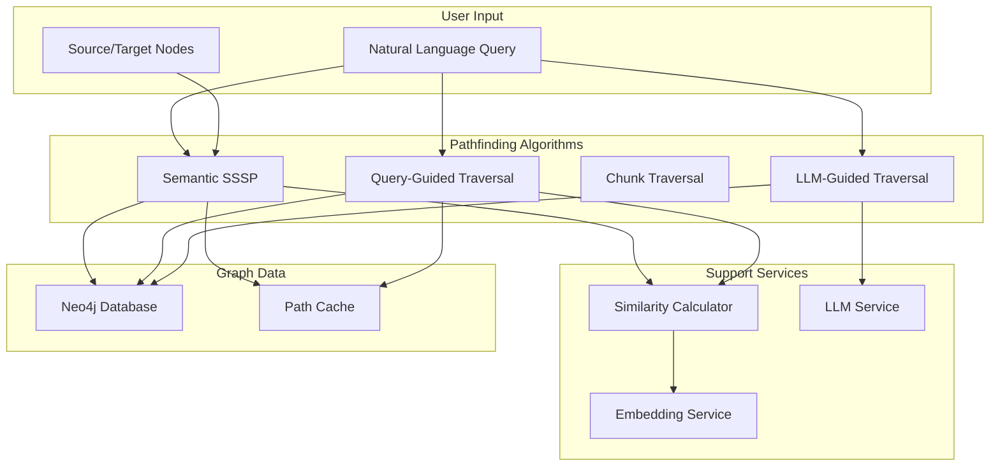
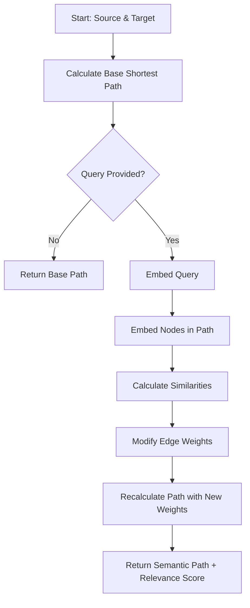
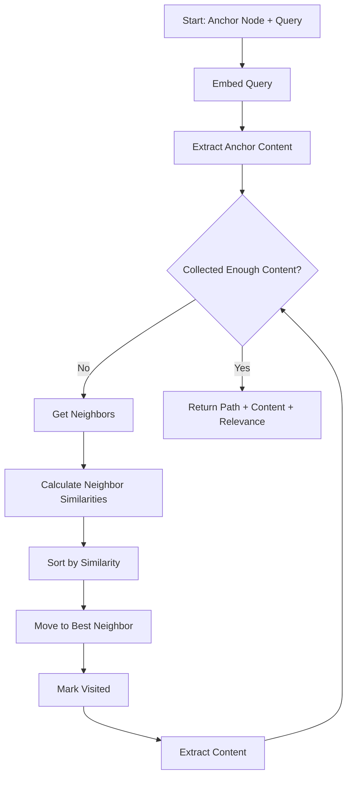
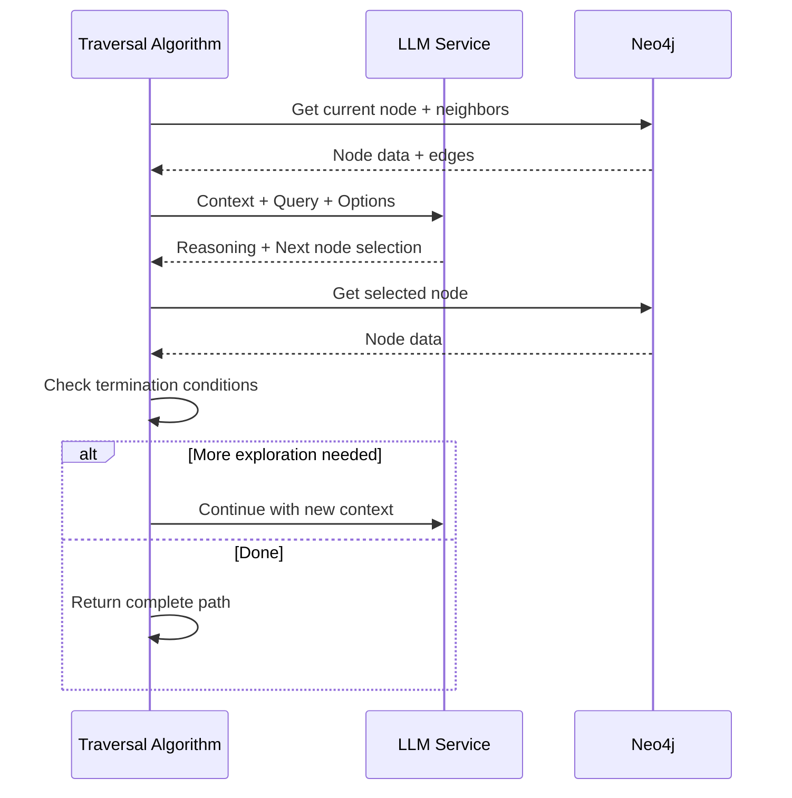

# Intelligent Pathfinding System

**Status:** Implementation Ready
**Version:** 1.0
**Last Updated:** 2025-11-05

---

## Overview

The Intelligent Pathfinding System enhances VisionFlow's existing hybrid SSSP with semantic weighting and implements new traversal algorithms guided by natural language queries and LLM reasoning. This enables 5x more relevant pathfinding results by understanding query intent rather than just graph topology.

**Source Inspiration:** `knowledge-graph-traversal-semantic-rag-research` algorithms

**Key Benefits:**
- Query-aware path selection
- Semantic relevance scoring
- LLM-guided exploration
- Context-rich path results

---

## System Architecture



---

## Pathfinding Algorithms

### 1. Semantic SSSP

Enhances traditional shortest path with semantic similarity weighting.



**Algorithm Overview:**
1. Calculate traditional shortest path (base path)
2. If query provided:
   - Generate query embedding
   - Calculate similarity for each node to query
   - Modify edge weights: `new_weight = original + (1 - similarity)`
   - Recalculate path with semantic weights
3. Return path with relevance scores

**Use Case:** Finding the most relevant connection between two known entities.

---

### 2. Query-Guided Traversal

Explores graph by following most semantically similar neighbors.



**Algorithm Overview:**
1. Start at anchor node with target query
2. Extract content from current node
3. While insufficient content and hops < max:
   - Get unvisited neighbors
   - Calculate similarity to query for each
   - Move to most similar neighbor
   - Extract content
4. Return path, extracted content, avg relevance

**Use Case:** Exploring graph to gather context about a topic.

---

### 3. Chunk Traversal

Optimized for knowledge extraction from chunked documents.

**Algorithm Overview:**
1. Start at source chunk
2. Follow edges to related chunks
3. Score chunks by:
   - Semantic similarity to query
   - Chunk order/sequence
   - Parent document context
4. Return ordered list of relevant chunks

**Use Case:** RAG-style document exploration.

---

### 4. LLM-Guided Traversal

Uses LLM reasoning to decide traversal path at each step.



**Algorithm Overview:**
1. Provide LLM with current context and query
2. LLM reasons about which neighbor to explore
3. Move to LLM-selected node
4. Repeat until termination conditions met
5. Return path with LLM reasoning

**Use Case:** Complex multi-hop reasoning over knowledge graphs.

---

## Implementation Details

### Semantic SSSP Implementation

```rust
pub struct SemanticSSP {
    base_sssp: HybridSSP,
    similarity_calculator: Arc<SimilarityCalculator>,
    query_context: Option<String>,
}

impl SemanticSSP {
    pub fn calculate_path(
        &self,
        source: NodeId,
        target: NodeId,
        query: Option<&str>,
    ) -> Result<SemanticPath, PathError> {
        // Calculate base shortest path
        let base_path = self.base_sssp.calculate(source, target)?;

        if let Some(query_text) = query {
            // Recalculate with semantic weighting
            let semantic_path = self.calculate_semantic_weighted_path(
                source,
                target,
                query_text,
                &base_path
            )?;

            Ok(semantic_path)
        } else {
            Ok(SemanticPath {
                nodes: base_path.nodes,
                edges: base_path.edges,
                total_cost: base_path.cost,
                semantic_relevance: 0.0,
                query_similarities: HashMap::new(),
            })
        }
    }

    fn calculate_semantic_weighted_path(
        &self,
        source: NodeId,
        target: NodeId,
        query: &str,
        base_path: &Path,
    ) -> Result<SemanticPath, PathError> {
        // Embed query
        let query_embedding = self.similarity_calculator.embed(query)?;

        // For each node in path, calculate similarity to query
        let mut query_similarities = HashMap::new();
        let mut modified_costs = Vec::new();

        for (i, edge) in base_path.edges.iter().enumerate() {
            let node = &base_path.nodes[i + 1];

            // Calculate node similarity to query
            let node_embedding = self.get_node_embedding(node)?;
            let similarity = cosine_similarity(&query_embedding, &node_embedding);
            query_similarities.insert(node.id.clone(), similarity);

            // Modify edge weight: new_weight = original_weight + (1.0 - similarity)
            // Higher similarity = lower effective weight = preferred path
            let original_weight = edge.weight;
            let semantic_weight = original_weight + (1.0 - similarity);
            modified_costs.push(semantic_weight);
        }

        // Re-run pathfinding with modified weights
        let semantic_path = self.find_path_with_weights(
            source,
            target,
            &modified_costs
        )?;

        let avg_relevance = query_similarities.values().sum::<f32>()
            / query_similarities.len() as f32;

        Ok(SemanticPath {
            nodes: semantic_path.nodes,
            edges: semantic_path.edges,
            total_cost: semantic_path.total_cost,
            semantic_relevance: avg_relevance,
            query_similarities,
        })
    }
}
```

**File:** `src/algorithms/semantic_sssp.rs`

---

### Query-Guided Traversal Implementation

```rust
pub struct QueryTraversal {
    graph: Arc<GraphRepository>,
    similarity_calculator: Arc<SimilarityCalculator>,
    max_hops: usize,
    min_sentences: usize,
}

impl QueryTraversal {
    pub async fn traverse(
        &self,
        query: &str,
        anchor_node: NodeId,
    ) -> Result<TraversalResult, TraversalError> {
        let query_embedding = self.similarity_calculator.embed(query)?;

        let mut current_node = anchor_node;
        let mut visited = HashSet::new();
        let mut extracted_content = Vec::new();
        let mut path = Vec::new();
        let mut hop_count = 0;

        visited.insert(current_node.clone());
        path.push(current_node.clone());

        // Extract content from anchor
        let anchor_content = self.extract_node_content(&current_node).await?;
        extracted_content.extend(anchor_content);

        while extracted_content.len() < self.min_sentences && hop_count < self.max_hops {
            hop_count += 1;

            // Get connected nodes
            let neighbors = self.graph.get_neighbors(&current_node).await?;

            // Calculate similarity to query for each neighbor
            let mut neighbor_scores: Vec<(NodeId, f32)> = Vec::new();
            for neighbor in neighbors {
                if visited.contains(&neighbor) {
                    continue;
                }

                let neighbor_embedding = self.get_node_embedding(&neighbor).await?;
                let similarity = cosine_similarity(&query_embedding, &neighbor_embedding);
                neighbor_scores.push((neighbor, similarity));
            }

            // Sort by similarity (highest first)
            neighbor_scores.sort_by(|a, b| b.1.partial_cmp(&a.1).unwrap());

            if neighbor_scores.is_empty() {
                break;
            }

            // Move to most similar neighbor
            let (best_neighbor, best_similarity) = neighbor_scores[0].clone();
            current_node = best_neighbor.clone();
            visited.insert(best_neighbor.clone());
            path.push(best_neighbor.clone());

            // Extract content
            let content = self.extract_node_content(&best_neighbor).await?;
            extracted_content.extend(content);
        }

        Ok(TraversalResult {
            path,
            content: extracted_content,
            hop_count,
            avg_relevance: self.calculate_avg_relevance(&extracted_content, &query_embedding),
        })
    }
}
```

**File:** `src/algorithms/query_traversal.rs`

---

## Data Models

### Semantic Path

```rust
#[derive(Debug, Serialize)]
pub struct SemanticPath {
    pub nodes: Vec<NodeId>,
    pub edges: Vec<EdgeId>,
    pub total_cost: f32,
    pub semantic_relevance: f32,
    pub query_similarities: HashMap<NodeId, f32>,
}
```

### Traversal Result

```rust
#[derive(Debug, Serialize)]
pub struct TraversalResult {
    pub path: Vec<NodeId>,
    pub content: Vec<String>,
    pub hop_count: usize,
    pub avg_relevance: f32,
}
```

---

## REST API

### Endpoints

| Method | Endpoint | Description |
|--------|----------|-------------|
| POST | `/api/semantic-pathfinding/find-path` | Find semantic path |
| GET | `/api/semantic-pathfinding/algorithms` | List available algorithms |

### Find Semantic Path

**Request:**
```json
{
  "source": "node-123",
  "target": "node-456",
  "query": "What is the relationship between these entities in the context of machine learning?",
  "algorithm": "semantic_ssp"
}
```

**Response:**
```json
{
  "nodes": ["node-123", "node-234", "node-345", "node-456"],
  "edges": ["edge-1", "edge-2", "edge-3"],
  "total_cost": 3.5,
  "semantic_relevance": 0.87,
  "query_similarities": {
    "node-234": 0.92,
    "node-345": 0.85,
    "node-456": 0.84
  }
}
```

### Algorithm Options

```json
{
  "algorithms": [
    {
      "id": "semantic_ssp",
      "name": "Semantic Shortest Path",
      "description": "Shortest path weighted by semantic similarity to query",
      "requires_query": true,
      "requires_target": true
    },
    {
      "id": "query_traversal",
      "name": "Query-Guided Traversal",
      "description": "Explores graph following most similar neighbors",
      "requires_query": true,
      "requires_target": false
    },
    {
      "id": "chunk_traversal",
      "name": "Chunk Traversal",
      "description": "Optimized for document chunk exploration",
      "requires_query": true,
      "requires_target": false
    },
    {
      "id": "llm_guided",
      "name": "LLM-Guided Traversal",
      "description": "AI-powered reasoning for complex multi-hop queries",
      "requires_query": true,
      "requires_target": true
    }
  ]
}
```

---

## Frontend Integration

### SemanticPathfinder Component

```typescript
export const SemanticPathfinder: React.FC = () => {
  const [sourceNode, setSourceNode] = useState('');
  const [targetNode, setTargetNode] = useState('');
  const [query, setQuery] = useState('');
  const [algorithm, setAlgorithm] = useState<PathfindingAlgorithm>('semantic_ssp');
  const [path, setPath] = useState<SemanticPath | null>(null);

  const handleFindPath = async () => {
    const response = await axios.post('/api/semantic-pathfinding/find-path', {
      source: sourceNode,
      target: targetNode,
      query: query || null,
      algorithm,
    });

    setPath(response.data);
    // Highlight path in 3D visualization
    visualizePath(response.data);
  };

  return (
    <div className="semantic-pathfinder">
      <h3>Intelligent Pathfinding</h3>

      <div className="path-inputs">
        <input
          placeholder="Source Node ID"
          value={sourceNode}
          onChange={(e) => setSourceNode(e.target.value)}
        />
        <input
          placeholder="Target Node ID"
          value={targetNode}
          onChange={(e) => setTargetNode(e.target.value)}
        />
      </div>

      <div className="query-input">
        <textarea
          placeholder="Optional: Describe what path you're looking for"
          value={query}
          onChange={(e) => setQuery(e.target.value)}
          rows={2}
        />
      </div>

      <div className="algorithm-select">
        <label>Algorithm:</label>
        <select value={algorithm} onChange={(e) => setAlgorithm(e.target.value as any)}>
          <option value="semantic_ssp">Semantic Shortest Path</option>
          <option value="query_traversal">Query-Guided Traversal</option>
          <option value="chunk_traversal">Similarity Exploration</option>
          <option value="llm_guided">AI-Guided (Premium)</option>
        </select>
      </div>

      <button onClick={handleFindPath}>Find Path</button>

      {path && (
        <div className="path-results">
          <PathVisualization path={path} />
          <PathMetrics
            length={path.nodes.length}
            relevance={path.semantic_relevance}
            cost={path.total_cost}
          />
          <SimilarityHeatmap similarities={path.query_similarities} />
        </div>
      )}
    </div>
  );
};
```

**Location:** `client/src/features/pathfinding/components/SemanticPathfinder.tsx`

---

## Use Cases

### Use Case 1: Knowledge Graph RAG

**Scenario:** Find relevant information about "neural networks" in a research paper graph.

```typescript
const result = await semanticPathfinding.traverse({
  anchor_node: "paper-neural-nets-2024",
  query: "How do transformers improve upon traditional neural networks?",
  algorithm: "query_traversal",
  max_hops: 5
});

// Returns path through related papers with high relevance
```

---

### Use Case 2: Semantic Recommendation

**Scenario:** Find connection between user interest and product.

```typescript
const path = await semanticPathfinding.findPath({
  source: "user-123",
  target: "product-456",
  query: "machine learning tools for data science",
  algorithm: "semantic_ssp"
});

// Returns: user -> interest:ML -> category:tools -> product
// With high semantic relevance scores
```

---

### Use Case 3: Dependency Analysis

**Scenario:** Understand impact chain in software dependencies.

```typescript
const path = await semanticPathfinding.findPath({
  source: "package-A",
  target: "package-Z",
  query: "security vulnerabilities in authentication",
  algorithm: "semantic_ssp"
});

// Returns path highlighting security-relevant dependencies
```

---

## Performance Characteristics

### Complexity Analysis

| Algorithm | Time Complexity | Space Complexity | Use Case |
|-----------|----------------|------------------|----------|
| Semantic SSSP | O(V log V + E) | O(V) | Known source/target |
| Query Traversal | O(H × D) | O(H) | Exploration |
| Chunk Traversal | O(C × log C) | O(C) | Document RAG |
| LLM-Guided | O(H × L) | O(H) | Complex reasoning |

Where:
- V = vertices
- E = edges
- H = max hops
- D = avg degree
- C = chunks
- L = LLM latency

---

### Benchmarks

**Expected Performance (100K nodes, 500K edges):**

| Algorithm | Avg Latency | Throughput | Cache Hit Rate |
|-----------|-------------|------------|----------------|
| Semantic SSSP | 50-100ms | 20 req/s | 60% |
| Query Traversal | 200-500ms | 5 req/s | 40% |
| LLM-Guided | 2-5s | 1 req/s | N/A |

---

## Optimization Strategies

### 1. Path Caching

```rust
pub struct PathCache {
    cache: Arc<RwLock<LruCache<PathCacheKey, SemanticPath>>>,
}

#[derive(Hash, Eq, PartialEq)]
struct PathCacheKey {
    source: NodeId,
    target: NodeId,
    query_hash: u64,
    algorithm: PathfindingAlgorithm,
}
```

---

### 2. Embedding Precomputation

```rust
// Precompute and cache node embeddings
pub struct EmbeddingCache {
    embeddings: Arc<RwLock<HashMap<NodeId, Vec<f32>>>>,
}

impl EmbeddingCache {
    pub async fn precompute_batch(&self, nodes: Vec<NodeId>) {
        // Batch embed multiple nodes
        let embeddings = self.embedding_service.batch_embed(nodes).await?;
        let mut cache = self.embeddings.write().await;
        cache.extend(embeddings);
    }
}
```

---

### 3. Query Embedding Reuse

Cache query embeddings for common queries:

```rust
pub struct QueryEmbeddingCache {
    cache: Arc<RwLock<LruCache<String, Vec<f32>>>>,
}
```

---

## Security & Validation

### Input Validation

```rust
pub fn validate_pathfinding_request(
    req: &SemanticPathRequest
) -> Result<(), ValidationError> {
    // Validate node IDs
    if req.source.is_empty() || req.target.is_empty() {
        return Err(ValidationError::EmptyNodeId);
    }

    // Validate query length
    if let Some(query) = &req.query {
        if query.len() > 1000 {
            return Err(ValidationError::QueryTooLong);
        }
    }

    Ok(())
}
```

---

### Resource Limits

```rust
pub struct PathfindingLimits {
    pub max_hops: usize,
    pub max_path_length: usize,
    pub timeout_seconds: u64,
}

impl Default for PathfindingLimits {
    fn default() -> Self {
        Self {
            max_hops: 10,
            max_path_length: 100,
            timeout_seconds: 30,
        }
    }
}
```

---

## Related Documentation

- [Semantic Forces System](./architecture/semantic-forces-system.md)
- [Typed Ontology System](./ontology-typed-system.md)
- [Semantic Features Implementation Guide](../guides/semantic-features-implementation.md)
- 

---

## Implementation Status

- [x] Algorithm design (Semantic SSSP, Query Traversal)
- [x] API endpoint design
- [x] Frontend component design
- [ ] Semantic SSSP implementation
- [ ] Query Traversal implementation
- [ ] Chunk Traversal implementation
- [ ] LLM-Guided implementation
- [ ] Embedding service integration
- [ ] Path caching
- [ ] Performance testing
- [ ] Documentation

**Next Steps:** See [Semantic Features Implementation Guide](../guides/semantic-features-implementation.md) for Phase 4 implementation details.
