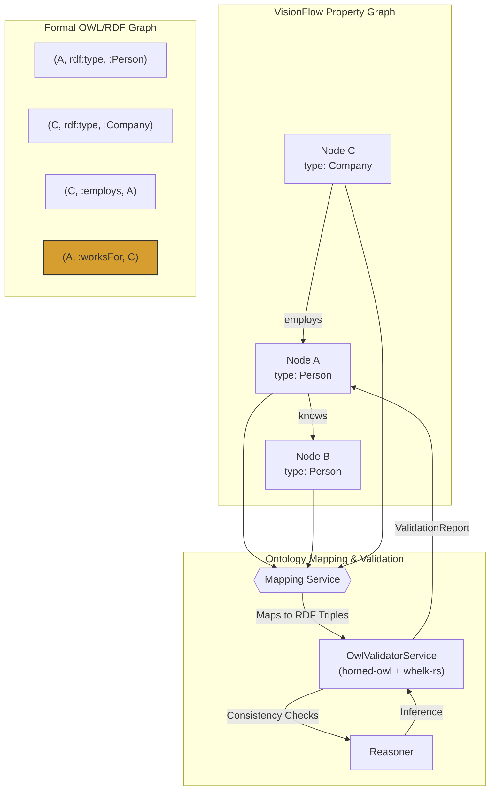
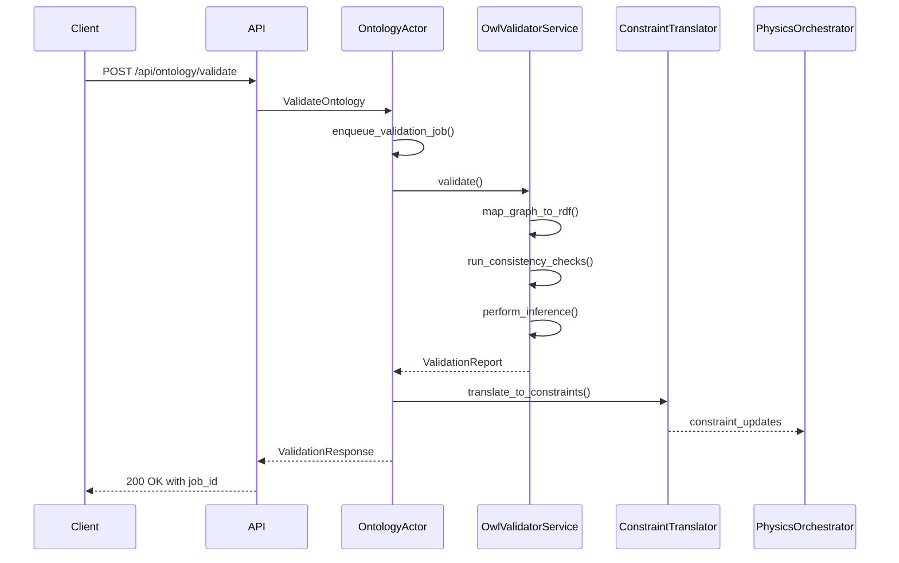

# Ontology & Validation

[← Knowledge Base](../index.md) > [Concepts](./index.md) > Ontology & Validation

## Overview

The ontology system provides a formal validation and logical inference layer for VisionFlow's knowledge graph, acting as a "truth engine." While the base graph structure uses a flexible property graph model optimised for real-time interactions, the ontology system maps it to a strict OWL/RDF structure to perform powerful consistency checks and infer new knowledge automatically.

This hybrid approach ensures logical soundness whilst allowing discovery of implicit relationships that are not explicitly defined in the graph data.

**Key Benefits:**

- **Logical Consistency:** Prevents data inconsistencies through formal validation against ontological axioms
- **Knowledge Discovery:** Automatically infers new relationships from existing data and ontological rules
- **Semantic Physics:** Translates logical constraints into physical forces for intuitive graph visualisations
- **Data Quality:** Provides comprehensive diagnostics and actionable fixes for data integrity issues
- **Incremental Processing:** Supports efficient updates without full recomputation through caching strategies

## Architecture

### Hybrid Model: Property Graph + OWL/RDF

VisionFlow employs a hybrid model combining the flexibility of property graphs with the formal rigour of OWL/RDF semantics. This architecture allows developers and users to interact with a simple, flexible graph structure whilst leveraging formal semantic validation and reasoning in the background.



The highlighted triple `(A, :worksFor, C)` demonstrates automatic inference: when the ontology defines `:employs` as the inverse of `:worksFor`, the reasoner automatically generates the reciprocal relationship.

### Core Components

The ontology system comprises several integrated components working together to provide validation and reasoning capabilities:

1. **OntologyActor** (`src/actors/ontology_actor.rs`)
   - Central coordinator for all ontology operations
   - Handles asynchronous validation jobs with priority queuing
   - Manages caching and incremental processing
   - Coordinates with physics and semantic processing actors
   - Implements job queue with priority levels (Critical, High, Normal, Low)
   - Provides LRU cache for validation reports
   - Handles backpressure for resource management

2. **OwlValidatorService** (`src/services/owl_validator.rs`)
   - Core validation engine using `horned-owl` for OWL parsing and `whelk-rs` for reasoning
   - Loads and parses OWL ontologies from files, URLs, or direct content
   - Maps property graph structures to RDF triples
   - Performs consistency checking and logical reasoning
   - Generates comprehensive validation reports with diagnostics
   - Supports multiple validation types:
     - **Domain/Range Validation:** Ensures properties are used correctly
     - **Disjoint Class Checking:** Prevents logical contradictions
     - **Cardinality Constraints:** Validates property usage limits
     - **Inference Generation:** Discovers implicit relationships

3. **Constraint Translator** (`src/physics/ontology_constraints.rs`)
   - Bridges semantic logic and physics simulation
   - Converts OWL axioms to GPU-compatible physics constraints
   - Translates inference results into dynamic forces
   - Organises constraints into logical groups
   - Provides configurable constraint strengths

4. **Mapping Service** (`ontology/mapping.toml`)
   - Declarative configuration mapping property graph elements to RDF semantics
   - Defines class mappings, property mappings, IRI templates
   - Specifies inverse relationships and domain/range constraints
   - Enables flexible translation whilst maintaining usability

### Translation of Logical Axioms to Physics Constraints

A key innovation of VisionFlow's ontology system is the translation of logical constraints into physical forces for graph layout:

| OWL Axiom | Physics Constraint | Visual Effect |
|-----------|-------------------|---------------|
| DisjointClasses(A,B) | Separation force | Push instances of different classes apart |
| SubClassOf(A,B) | Hierarchical alignment | Group subclass instances near parent class |
| InverseOf(P,Q) | Bidirectional edges | Create symmetric relationship visualisations |
| SameAs(a,b) | Co-location force | Pull equivalent entities together |
| FunctionalProperty(P) | Cardinality boundaries | Limit connection count visually |

This mapping enables **Semantically-Aware Physics**, where the final graph layout reflects the logical structure of the data, creating more intuitive and insightful visualisations without manual tuning.

## Validation Workflow

The validation process follows a systematic workflow:



**Steps:**

1. **Mapping to RDF:** The property graph is translated into RDF triples using the mapping configuration. Node properties become data properties, edges become object properties, and types are asserted.

2. **Consistency Check:** The `whelk-rs` reasoner loads the RDF triples and domain ontology, checking for logical contradictions based on axioms (e.g., disjointness violations, cardinality restrictions).

3. **Inference:** If the graph is consistent, the reasoner performs inference to generate implicit triples. For example, if `:employs` is defined as inverse of `:worksFor`, the reasoner infers `(A, :worksFor, C)` when `(C, :employs, A)` exists.

4. **Feedback Loop:** Results including violations and newly inferred relationships are compiled into a `ValidationReport` and sent back. This report can be used to correct the graph or enrich it with inferred knowledge.

5. **Constraint Application:** Valid axioms and inferences are translated into physics constraints and applied to the visualisation layer for semantic-aware layout.

## Validation Modes

The system supports three validation modes optimised for different use cases:

### Quick Validation (< 100ms)
- Basic consistency checks
- Domain/range validation
- Minimal inference
- Ideal for development and frequent updates
- Cached results for rapid feedback

### Full Validation (< 5s)
- Complete consistency analysis
- Full inference generation
- Comprehensive reporting with statistics
- Suitable for testing and quality assurance
- Generates detailed diagnostics

### Incremental Validation (< 50ms)
- Delta-based updates
- Cached intermediate results
- Optimised for frequent changes
- Production-ready for real-time scenarios
- Graph signature-based change detection

## Graph-to-RDF Mapping

The mapping configuration (`ontology/mapping.toml`) defines how property graph elements translate to RDF semantics:

```toml
[global]
base_iri = "https://example.org/graph#"
default_class = "ex:Thing"

[classes.node_type]
"person" = "ex:Person"
"company" = "ex:Company"
"file" = "ex:File"

[properties.edge_type]
"employs" = "ex:employs"
"knows" = "foaf:knows"

[properties.metadata]
"email" = "foaf:mbox"
"name" = "foaf:name"
"created" = "dcterms:created"

[inverses]
"ex:employs" = "ex:worksFor"
"foaf:knows" = "foaf:knows"  # symmetric

[templates]
node_iri = "ex:node/{id}"
edge_iri = "ex:edge/{source}-{target}"

[constraints.domain]
"ex:employs" = "ex:Company"

[constraints.range]
"ex:employs" = "ex:Person"
```

This mapping provides flexible translation between the property graph model and formal RDF semantics, enabling powerful reasoning whilst maintaining usability.

## API Endpoints

The ontology system exposes comprehensive REST and WebSocket APIs:

**REST Endpoints:**
- `POST /api/ontology/load-axioms` - Load ontology definitions from files, URLs, or direct content
- `POST /api/ontology/mapping` - Update mapping configuration
- `POST /api/ontology/validate` - Run validation (quick/full/incremental modes)
- `GET /api/ontology/report` - Retrieve validation results
- `POST /api/ontology/apply` - Apply inferred relationships to the graph
- `GET /api/ontology/health` - Check system health and performance metrics
- `DELETE /api/ontology/cache` - Clear caches

**WebSocket Protocol:**
- `/api/ontology/ws` - Real-time updates for validation progress, constraint updates, and inference notifications

The system integrates with VisionFlow's feature flag mechanism via the `ontology_validation` flag, allowing dynamic enable/disable of validation capabilities.

## Use Cases

### Corporate Knowledge Graph

Model employees, departments, and projects with semantic validation:

**Ontology Example:**
```turtle
@prefix corp: <http://company.com/ontology#> .

corp:Employee rdfs:subClassOf foaf:Person .
corp:Manager rdfs:subClassOf corp:Employee .
corp:Department rdfs:subClassOf org:Organization .

corp:manages a owl:ObjectProperty ;
    rdfs:domain corp:Manager ;
    rdfs:range corp:Employee .

corp:Employee owl:disjointWith corp:Department .

corp:managedBy a owl:FunctionalProperty ;
    owl:inverseOf corp:manages .
```

**Validation Results:**
- **Violations:** Employee node incorrectly typed as Department
- **Inferences:** If Alice manages Bob, then Bob is managed by Alice (inverse property)
- **Physics:** Employees and Departments repel each other due to disjointness constraint

### Document Management System

Track documents, authors, and topics with semantic validation:

**Ontology Example:**
```turtle
@prefix doc: <http://documents.com/ontology#> .

doc:Document a owl:Class .
doc:Person rdfs:subClassOf foaf:Person .
doc:Topic a owl:Class .

doc:author a owl:ObjectProperty ;
    rdfs:domain doc:Document ;
    rdfs:range doc:Person .

doc:cites a owl:ObjectProperty, owl:TransitiveProperty ;
    rdfs:domain doc:Document ;
    rdfs:range doc:Document .

doc:Document owl:disjointWith doc:Person .
```

**Expected Behaviours:**
- **Separation:** Documents and People appear in distinct clusters
- **Transitivity:** Citation chains automatically inferred (if A cites B, and B cites C, then A transitively cites C)
- **Validation:** Documents cannot be classified as People

### Scientific Data Model

Model experiments, researchers, and findings with semantic relationships:

**Ontology Example:**
```turtle
@prefix sci: <http://science.org/ontology#> .

sci:Experiment a owl:Class .
sci:Researcher rdfs:subClassOf foaf:Person .
sci:Finding a owl:Class .

sci:conducts a owl:ObjectProperty ;
    rdfs:domain sci:Researcher ;
    rdfs:range sci:Experiment .

sci:produces a owl:ObjectProperty ;
    rdfs:domain sci:Experiment ;
    rdfs:range sci:Finding .

sci:sameResearcher a owl:SymmetricProperty .
```

**Physics Integration:**
- Experiments cluster around their conducting researchers
- Related findings group together naturally
- Equipment spreads around experiments that use it

## Performance Characteristics

The ontology system is optimised for real-time performance:

**Scalability:**
- **Small Graphs** (< 1k nodes): < 50ms validation
- **Medium Graphs** (1k-10k nodes): < 500ms validation
- **Large Graphs** (10k+ nodes): Background processing with progress updates

**Memory Usage:**
- Base overhead: ~50MB for reasoner components
- Per-ontology: ~5-20MB depending on axiom complexity
- Cache overhead: ~10KB per validation report
- Constraint overhead: ~1KB per generated constraint

**Optimisation Features:**
- Graph signatures using Blake3 hashing for efficient change detection
- Incremental reasoning with delta processing for updates
- Lazy loading of ontologies on-demand
- Background processing for non-blocking validation jobs
- Multi-level caching strategy (ontology cache, validation cache, node type cache, constraint cache)

## Technology Stack

**Core Dependencies:**
- **horned-owl:** OWL parsing and manipulation
- **whelk-rs:** High-performance reasoning engine
- **rio-turtle:** RDF/Turtle format support
- **rio-api:** RDF processing abstractions
- **sophia:** Additional RDF handling utilities

**Optional Dependencies:**
- **oxigraph:** SPARQL query support (feature-gated)
- **blake3:** Fast hashing for graph signatures
- **dashmap:** Concurrent hash maps for caching

**Integration:**
- **actix:** Actor system and web framework integration
- **tokio:** Async runtime for non-blocking operations
- **serde:** Serialisation for API communication
- **chrono:** Timestamp handling for reports

## Error Handling and Diagnostics

The validation system provides comprehensive error reporting:

**Violation Types:**
- `DISJOINT_CLASS_VIOLATION` - Individual belongs to disjoint classes
- `DOMAIN_MISMATCH` - Property used on wrong subject type
- `RANGE_MISMATCH` - Property targets wrong object type
- `CARDINALITY_EXCEEDED` - Too many property values

**Diagnostic Features:**
- Violation descriptions with specific locations
- Suggested fixes with examples
- Confidence scores for recommendations
- Actionable resolution steps

**Example Violation Report:**
```json
{
  "id": "violation_001",
  "severity": "Error",
  "rule": "DisjointClasses",
  "message": "Individual ex:john cannot be both ex:Person and ex:Company",
  "subject": "ex:john",
  "suggestedFix": "Remove one of the conflicting type assertions",
  "timestamp": "2025-10-03T10:32:15Z"
}
```

## Integration with VisionFlow

The ontology system integrates seamlessly with VisionFlow's existing architecture:

**Actor System Integration:**
- Coordinates with `GraphServiceActor` for graph data access
- Sends constraints to `PhysicsOrchestratorActor` for visualisation
- Communicates with `SemanticProcessorActor` for inference processing
- Uses message bus for actor communication

**Feature Flag Control:**
```json
{
  "ontology_validation": true
}
```

Controlled via `/api/analytics/feature-flags` endpoint, allowing dynamic enable/disable.

**WebSocket Updates:**
Clients can subscribe to real-time validation events for immediate feedback during graph manipulation.

## Further Reading

For in-depth technical documentation and implementation details:

- **[Ontology System Overview](../reference/ontology/system-overview.md)** - Complete architecture diagrams, component descriptions, and data flow explanations
- **[Ontology API Reference](../reference/ontology/api-reference.md)** - Full REST and WebSocket API documentation with request/response examples
- **[Ontology User Guide](../guides/ontology/user-guide.md)** - Configuration guide, use case examples, and best practices
- **[HornedOWL Integration](../reference/ontology/hornedowl.md)** - Technical details of OWL processing library integration
- **[Integration Summary](../reference/ontology/integration-summary.md)** - Implementation status and deployment checklist

## Related Concepts

- [GPU Compute](./gpu-compute.md) - Hardware-accelerated graph processing
- [System Architecture](./system-architecture.md) - Asynchronous message-passing architecture

---

*This document synthesises information from the ontology validation system implementation. For the most current API specifications and implementation details, refer to the specialised ontology documentation linked above.*
