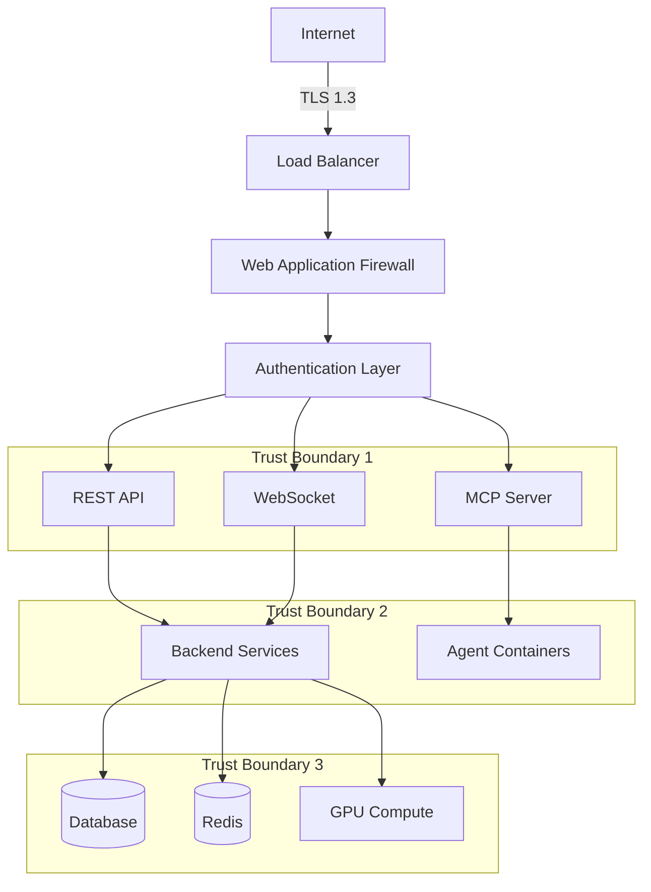
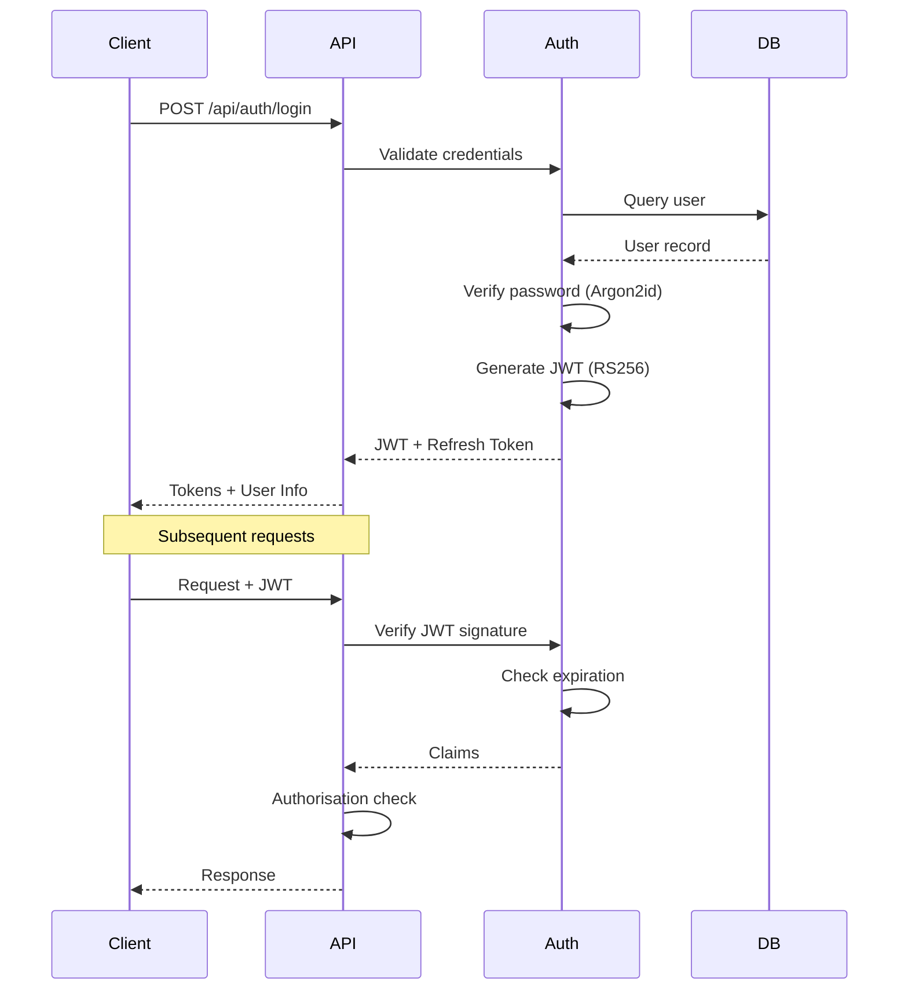
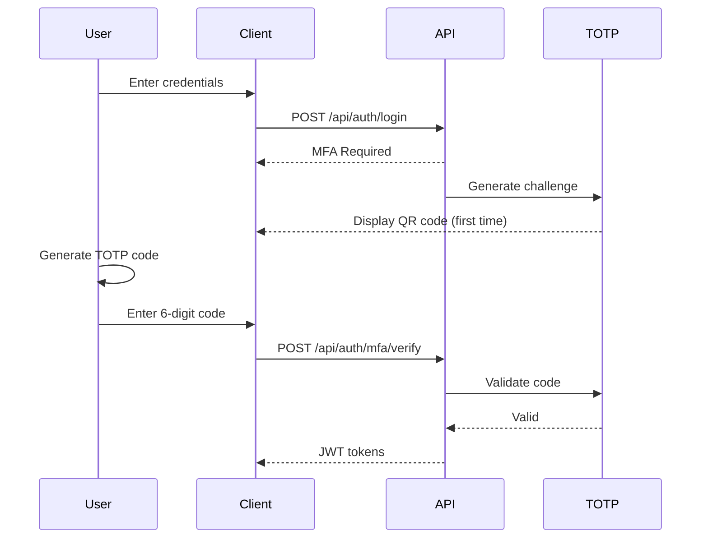
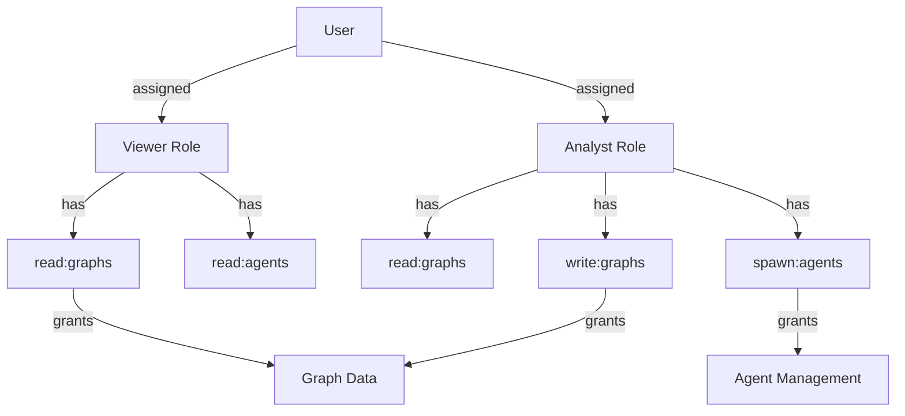
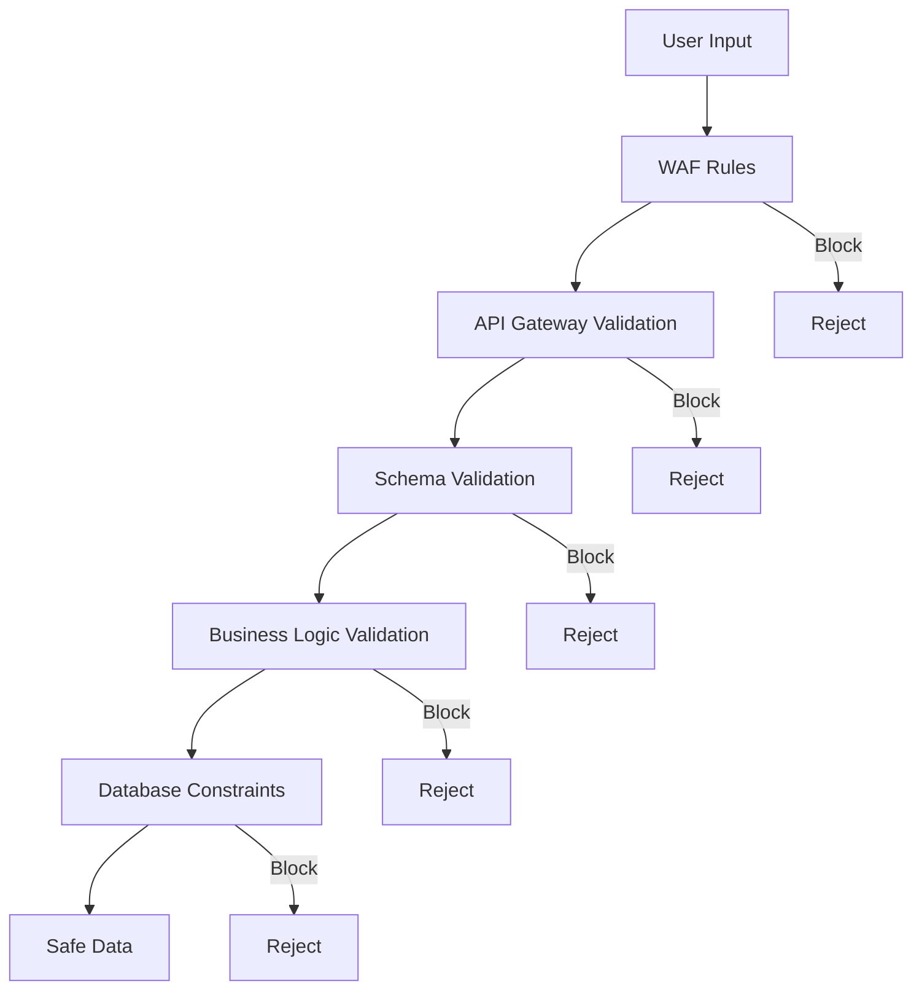
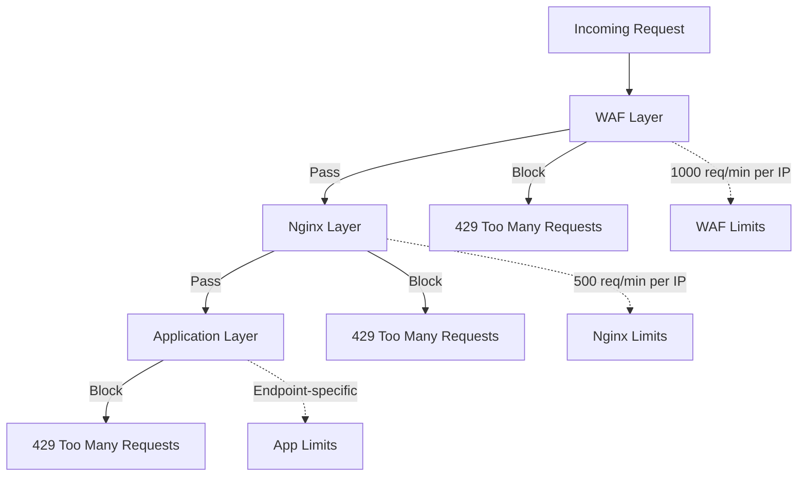

# Security Model

[← Knowledge Base](../index.md) > [Concepts](./index.md) > Security Model

**Version**: 2.2.0
**Last Updated**: 2025-10-03
**Compliance**: OWASP Top 10, GDPR, SOC 2

## Overview

VisionFlow implements a comprehensive defence-in-depth security architecture with multiple layers of protection across the application stack. This document outlines the security model, authentication mechanisms, authorisation controls, and best practices that protect the platform and its users.

## Security Principles

### Core Principles

1. **Least Privilege**: Users and services have minimum necessary permissions
2. **Defence in Depth**: Multiple overlapping security controls
3. **Fail Secure**: System defaults to secure state on failure
4. **Complete Mediation**: All access requests are validated
5. **Security by Design**: Security integrated from inception
6. **Zero Trust**: Verify everything, trust nothing

### Compliance Framework

- **OWASP Top 10**: Protection against common web vulnerabilities
- **GDPR**: Personal data protection and privacy
- **SOC 2**: Security, availability, and confidentiality controls
- **ISO 27001**: Information security management (planned)

## Architecture Overview

### Security Layers



### Threat Model

| Category | Threats | Mitigations |
|----------|---------|-------------|
| **Authentication** | Credential theft, brute force | MFA, rate limiting, strong passwords |
| **Authorisation** | Privilege escalation, IDOR | RBAC, attribute-based access control |
| **Injection** | SQL, XSS, command injection | Parameterised queries, input validation, CSP |
| **Exposure** | Data leaks, information disclosure | Encryption, access controls, auditing |
| **DoS** | Resource exhaustion, flooding | Rate limiting, resource quotas, circuit breakers |
| **Supply Chain** | Dependency vulnerabilities | Automated scanning, pinned versions, SBOMs |

## Authentication

### 1. JWT-Based Authentication

VisionFlow uses JSON Web Tokens (JWT) for stateless authentication with asymmetric signing.

#### Authentication Flow



#### Token Structure

**Access Token (JWT)**:
```json
{
  "header": {
    "alg": "RS256",
    "typ": "JWT",
    "kid": "key-id-2025-10"
  },
  "payload": {
    "sub": "user-uuid",
    "email": "user@example.com",
    "roles": ["user", "analyst"],
    "permissions": ["read:graphs", "write:agents"],
    "iss": "https://auth.yourdomain.com",
    "aud": "visionflow-api",
    "exp": 1727700000,
    "iat": 1727696400,
    "jti": "token-unique-id"
  },
  "signature": "..."
}
```

#### Token Specifications

- **Algorithm**: RS256 (asymmetric signing)
- **Access Token Lifetime**: 15 minutes
- **Refresh Token Lifetime**: 7 days
- **Rotation**: Refresh tokens rotate on use
- **Revocation**: Token blacklist with Redis

#### Password Security

**Hashing Algorithm**: Argon2id

```rust
use argon2::{
    password_hash::{PasswordHash, PasswordHasher, PasswordVerifier, SaltString},
    Argon2
};

pub fn hash_password(password: &str) -> Result<String, Error> {
    let salt = SaltString::generate(&mut OsRng);
    let argon2 = Argon2::default();

    let password_hash = argon2
        .hash_password(password.as_bytes(), &salt)?
        .to_string();

    Ok(password_hash)
}

pub fn verify_password(password: &str, hash: &str) -> Result<bool, Error> {
    let parsed_hash = PasswordHash::new(hash)?;
    let argon2 = Argon2::default();

    Ok(argon2.verify_password(password.as_bytes(), &parsed_hash).is_ok())
}
```

**Parameters**:
- **Memory**: 64 MB
- **Iterations**: 3
- **Parallelism**: 4 threads
- **Salt**: 16 bytes (random)
- **Output**: 32 bytes

### 2. Multi-Factor Authentication

VisionFlow supports TOTP-based 2FA for enhanced security.



**TOTP Configuration**:
- **Algorithm**: SHA-256
- **Period**: 30 seconds
- **Digits**: 6
- **Window**: ±1 period for clock skew
- **Backup Codes**: 10 single-use codes generated

### 3. WebSocket Authentication

**Token-Based Authentication**:
```javascript
const ws = new WebSocket('wss://api.yourdomain.com/ws', {
  headers: {
    'Authorization': `Bearer ${accessToken}`
  }
});
```

**Origin Validation**:
```rust
impl StreamHandler<Result<ws::Message, ws::ProtocolError>> for WebSocketActor {
    fn started(&mut self, ctx: &mut Self::Context) {
        // Validate origin
        if let Some(origin) = ctx.request().headers().get("Origin") {
            if !self.is_allowed_origin(origin) {
                ctx.stop();
                return;
            }
        }

        // Require authentication
        if !self.is_authenticated() {
            ctx.text(r#"{"error": "authentication_required"}"#);
            ctx.stop();
        }
    }
}
```

## Authorisation

### 1. Role-Based Access Control (RBAC)



#### Default Roles

| Role | Permissions | Description |
|------|-------------|-------------|
| **Viewer** | read:graphs, read:agents | Read-only access to graphs and agent status |
| **Analyst** | Viewer + write:graphs, spawn:agents | Can modify graphs and spawn agents |
| **Administrator** | Analyst + manage:users, manage:system | Full system administration |
| **Service** | Limited API access | For service-to-service authentication |

#### Permission Structure

```rust
#[derive(Debug, Clone, Serialize, Deserialize)]
pub struct Permission {
    pub action: Action,      // read, write, delete, manage
    pub resource: Resource,  // graphs, agents, users, system
    pub conditions: Option<Vec<Condition>>,
}

#[derive(Debug, Clone)]
pub enum Condition {
    OwnerOnly,
    TimeRestriction { start: DateTime, end: DateTime },
    IpWhitelist { ips: Vec<IpAddr> },
    ResourceLimit { max: usize },
}
```

#### Authorisation Check

```rust
pub fn check_permission(
    user: &User,
    permission: &Permission,
    resource_id: &str,
) -> Result<bool, AuthError> {
    // Check if user has role with permission
    if !user.has_permission(permission) {
        return Ok(false);
    }

    // Evaluate conditions
    if let Some(conditions) = &permission.conditions {
        for condition in conditions {
            if !evaluate_condition(condition, user, resource_id)? {
                return Ok(false);
            }
        }
    }

    Ok(true)
}
```

### 2. Attribute-Based Access Control (ABAC)

For fine-grained access control based on user attributes, resource attributes, and environmental context.

```rust
pub struct PolicyEngine {
    policies: Vec<Policy>,
}

pub struct Policy {
    pub name: String,
    pub effect: Effect,
    pub conditions: Vec<Condition>,
}

pub enum Effect {
    Allow,
    Deny,
}

impl PolicyEngine {
    pub fn evaluate(
        &self,
        subject_attrs: &HashMap<String, Value>,
        resource_attrs: &HashMap<String, Value>,
        action: &str,
        environment_attrs: &HashMap<String, Value>
    ) -> Decision {
        // Evaluate policies with deny taking precedence
        let mut deny_policies = Vec::new();
        let mut allow_policies = Vec::new();

        for policy in &self.policies {
            if self.matches_policy(policy, subject_attrs, resource_attrs, action, environment_attrs) {
                match policy.effect {
                    Effect::Allow => allow_policies.push(policy),
                    Effect::Deny => deny_policies.push(policy),
                }
            }
        }

        if !deny_policies.is_empty() {
            Decision::Deny(deny_policies[0].name.clone())
        } else if !allow_policies.is_empty() {
            Decision::Allow
        } else {
            Decision::Deny("No matching policy".to_string())
        }
    }
}
```

## Input Validation and Sanitisation

### 1. Validation Layers



### 2. Input Sanitisation

```rust
use validator::{Validate, ValidationError};

#[derive(Debug, Validate, Deserialize)]
pub struct CreateGraphRequest {
    #[validate(length(min = 1, max = 100))]
    pub name: String,

    #[validate(length(max = 1000))]
    pub description: Option<String>,

    #[validate(range(min = 1, max = 1000000))]
    pub max_nodes: u32,

    #[validate(custom = "validate_node_data")]
    pub nodes: Vec<NodeInput>,
}

fn validate_node_data(nodes: &[NodeInput]) -> Result<(), ValidationError> {
    for node in nodes {
        // Validate node ID format
        if !node.id.chars().all(|c| c.is_alphanumeric() || c == '-') {
            return Err(ValidationError::new("invalid_node_id"));
        }

        // Validate position bounds
        if node.position.x.abs() > 10000.0
            || node.position.y.abs() > 10000.0
            || node.position.z.abs() > 10000.0
        {
            return Err(ValidationError::new("position_out_of_bounds"));
        }
    }

    Ok(())
}
```

### 3. SQL Injection Prevention

```rust
// ✓ CORRECT: Parameterised query
let user = sqlx::query_as::<_, User>(
    "SELECT * FROM users WHERE email = $1"
)
.bind(&email)
.fetch_one(&pool)
.await?;

// ✗ WRONG: String concatenation
let query = format!("SELECT * FROM users WHERE email = '{}'", email);
```

### 4. XSS Prevention

**Content Security Policy**:
```http
Content-Security-Policy:
  default-src 'self';
  script-src 'self' 'unsafe-inline' 'unsafe-eval' https://cdn.example.com;
  style-src 'self' 'unsafe-inline';
  img-src 'self' data: https:;
  connect-src 'self' wss://ws.yourdomain.com;
  font-src 'self' data:;
  object-src 'none';
  base-uri 'self';
  form-action 'self';
  frame-ancestors 'none';
  upgrade-insecure-requests;
```

**Output Encoding**:
```typescript
function escapeHtml(text: string): string {
    const map: Record<string, string> = {
        '&': '&amp;',
        '<': '&lt;',
        '>': '&gt;',
        '"': '&quot;',
        "'": '&#39;',
    };
    return text.replace(/[&<>"']/g, (m) => map[m]);
}
```

## API Security

### 1. Rate Limiting

Multi-tier rate limiting for DDoS protection.



**Rate Limit Configuration**:
```rust
pub fn configure_rate_limits() -> HashMap<String, RateLimitConfig> {
    HashMap::from([
        ("/api/auth/login", RateLimitConfig {
            requests_per_minute: 5,
            burst_size: 10,
            ban_duration: Duration::from_secs(3600),
        }),
        ("/api/graph/data", RateLimitConfig {
            requests_per_minute: 60,
            burst_size: 10,
            ban_duration: Duration::from_secs(300),
        }),
        ("/api/agents/spawn", RateLimitConfig {
            requests_per_minute: 10,
            burst_size: 5,
            ban_duration: Duration::from_secs(600),
        }),
        ("/ws", RateLimitConfig {
            requests_per_minute: 300,  // 5 Hz updates
            burst_size: 50,
            ban_duration: Duration::from_secs(600),
        }),
    ])
}
```

### 2. CORS Configuration

```bash
# Environment configuration
CORS_ALLOWED_ORIGINS=http://localhost:3000,https://yourdomain.com
```

**Headers Configuration**:
- **Methods**: GET, POST, PUT, DELETE, OPTIONS
- **Headers**: Content-Type, Authorisation
- **Credentials**: Configured based on requirements
- **Max Age**: 86400 (24 hours)

## Data Protection

### 1. Encryption at Rest

**Database Encryption**:
```sql
-- PostgreSQL transparent data encryption
ALTER SYSTEM SET ssl = on;
ALTER SYSTEM SET ssl_cert_file = '/etc/ssl/certs/server.crt';
ALTER SYSTEM SET ssl_key_file = '/etc/ssl/private/server.key';

-- Column-level encryption for sensitive data
CREATE EXTENSION IF NOT EXISTS pgcrypto;

CREATE TABLE users (
    id UUID PRIMARY KEY,
    email TEXT NOT NULL,
    password_hash TEXT NOT NULL,
    api_key TEXT,  -- Encrypted
    encrypted_data BYTEA,  -- pgcrypto encrypted
    created_at TIMESTAMPTZ DEFAULT NOW()
);

-- Encrypt API keys
INSERT INTO users (id, email, password_hash, api_key)
VALUES (
    gen_random_uuid(),
    'user@example.com',
    'argon2_hash',
    pgp_sym_encrypt('api-key-value', 'encryption-key')
);
```

**File Storage Encryption**:
```rust
use aes_gcm::{
    aead::{Aead, KeyInit},
    Aes256Gcm, Nonce
};

pub fn encrypt_file(data: &[u8], key: &[u8; 32]) -> Result<Vec<u8>, Error> {
    let cipher = Aes256Gcm::new(key.into());
    let nonce = Nonce::from_slice(b"unique-nonce"); // Use random nonce

    let ciphertext = cipher.encrypt(nonce, data)?;
    Ok(ciphertext)
}
```

### 2. Encryption in Transit

**TLS Configuration**:
```nginx
ssl_protocols TLSv1.2 TLSv1.3;
ssl_ciphers 'ECDHE-ECDSA-AES128-GCM-SHA256:ECDHE-RSA-AES128-GCM-SHA256:ECDHE-ECDSA-AES256-GCM-SHA384:ECDHE-RSA-AES256-GCM-SHA384';
ssl_prefer_server_ciphers off;

ssl_session_cache shared:SSL:10m;
ssl_session_timeout 10m;
ssl_session_tickets off;

ssl_stapling on;
ssl_stapling_verify on;

# HSTS
add_header Strict-Transport-Security "max-age=31536000; includeSubDomains; preload" always;
```

**Inter-Service Communication**:
All internal communication uses TLS 1.3:

```rust
use rustls::{ClientConfig, RootCertStore};

pub fn create_tls_config() -> ClientConfig {
    let mut root_store = RootCertStore::empty();
    root_store.add_trust_anchors(webpki_roots::TLS_SERVER_ROOTS.iter().map(|ta| {
        rustls::OwnedTrustAnchor::from_subject_spki_name_constraints(
            ta.subject,
            ta.spki,
            ta.name_constraints,
        )
    }));

    ClientConfig::builder()
        .with_safe_defaults()
        .with_root_certificates(root_store)
        .with_no_client_auth()
}
```

### 3. Personal Data Protection (GDPR)

**Data Minimisation**:
```rust
#[derive(Debug, Serialize)]
pub struct UserProfile {
    pub id: Uuid,
    pub email: String,
    #[serde(skip_serializing)]  // Never expose in API
    pub password_hash: String,
    pub created_at: DateTime<Utc>,
    // No unnecessary personal data collected
}
```

**Right to Erasure**:
```rust
pub async fn delete_user_data(user_id: Uuid, pool: &PgPool) -> Result<(), Error> {
    let mut tx = pool.begin().await?;

    // Delete user graphs
    sqlx::query("DELETE FROM graphs WHERE owner_id = $1")
        .bind(user_id)
        .execute(&mut *tx)
        .await?;

    // Delete user agents
    sqlx::query("DELETE FROM agents WHERE owner_id = $1")
        .bind(user_id)
        .execute(&mut *tx)
        .await?;

    // Anonymise audit logs (retain for compliance)
    sqlx::query("UPDATE audit_logs SET user_id = NULL WHERE user_id = $1")
        .bind(user_id)
        .execute(&mut *tx)
        .await?;

    // Delete user account
    sqlx::query("DELETE FROM users WHERE id = $1")
        .bind(user_id)
        .execute(&mut *tx)
        .await?;

    tx.commit().await?;
    Ok(())
}
```

## Container Security

### 1. Docker Security Best Practices

**Dockerfile**:
```dockerfile
FROM rust:1.70-alpine AS builder

# Run as non-root user
RUN addgroup -g 1000 app && adduser -D -u 1000 -G app app

USER app
WORKDIR /app

# Build application
COPY --chown=app:app . .
RUN cargo build --release

# Runtime stage
FROM alpine:3.18

RUN addgroup -g 1000 app && adduser -D -u 1000 -G app app

# Copy only necessary files
COPY --from=builder --chown=app:app /app/target/release/visionflow /app/visionflow

# Drop privileges
USER app

# Read-only filesystem
VOLUME ["/tmp"]

ENTRYPOINT ["/app/visionflow"]
```

**Container Security Options**:
```yaml
services:
  backend:
    security_opt:
      - no-new-privileges:true
      - apparmor=docker-default
    cap_drop:
      - ALL
    cap_add:
      - CHOWN
      - SETGID
      - SETUID
    read_only: true
    tmpfs:
      - /tmp:mode=1777,size=100m
```

### 2. Network Security

**Network Segmentation**:
```yaml
networks:
  frontend:
    driver: bridge
    ipam:
      config:
        - subnet: 172.20.0.0/24

  backend:
    driver: bridge
    internal: true
    ipam:
      config:
        - subnet: 172.21.0.0/24

  database:
    driver: bridge
    internal: true
    ipam:
      config:
        - subnet: 172.22.0.0/24
```

## Secrets Management

### 1. Environment-Based Secrets

**Secure Storage**:
- **NEVER** commit `.env` files to version control
- Use `.env.example` as template
- Store sensitive credentials in secret managers
- Rotate credentials regularly

**Required Security Variables**:
```bash
# Authentication
JWT_SECRET=<strong-random-secret>
SESSION_SECRET=<strong-random-secret>
WS_AUTH_TOKEN=<secure-websocket-token>

# Rate Limiting
RATE_LIMIT_WINDOW_MS=60000
RATE_LIMIT_MAX_REQUESTS=100

# Connection Limits
WS_MAX_CONNECTIONS=100
TCP_MAX_CONNECTIONS=50
```

### 2. HashiCorp Vault Integration

```rust
use vaultrs::{client::{VaultClient, VaultClientSettingsBuilder}, kv2};

pub async fn fetch_secret(path: &str) -> Result<String, Error> {
    let client = VaultClient::new(
        VaultClientSettingsBuilder::default()
            .address("https://vault.yourdomain.com")
            .token(std::env::var("VAULT_TOKEN")?)
            .build()?
    )?;

    let secret: HashMap<String, String> = kv2::read(
        &client,
        "visionflow",
        path
    ).await?;

    Ok(secret.get("value").ok_or(Error::SecretNotFound)?.clone())
}
```

## Audit Logging

### 1. Comprehensive Audit Trail

```rust
#[derive(Debug, Serialize, Deserialize)]
pub struct AuditLog {
    pub id: Uuid,
    pub timestamp: DateTime<Utc>,
    pub user_id: Option<Uuid>,
    pub ip_address: IpAddr,
    pub action: AuditAction,
    pub resource_type: String,
    pub resource_id: Option<String>,
    pub details: serde_json::Value,
    pub success: bool,
    pub error_message: Option<String>,
}

#[derive(Debug, Serialize, Deserialize)]
pub enum AuditAction {
    Login,
    Logout,
    CreateGraph,
    UpdateGraph,
    DeleteGraph,
    SpawnAgent,
    TerminateAgent,
    UpdateSettings,
    ChangePassword,
    EnableMFA,
    DisableMFA,
}
```

### 2. Audit Middleware

```rust
pub async fn audit_middleware(
    req: ServiceRequest,
    next: Next<BoxBody>,
) -> Result<ServiceResponse<BoxBody>, Error> {
    let start = Instant::now();
    let user_id = extract_user_id(&req);
    let ip = extract_ip(&req);
    let action = extract_action(&req);

    let res = next.call(req).await?;

    let duration = start.elapsed();
    let success = res.status().is_success();

    // Log audit event
    log_audit_event(AuditLog {
        id: Uuid::new_v4(),
        timestamp: Utc::now(),
        user_id,
        ip_address: ip,
        action,
        resource_type: extract_resource(&res),
        resource_id: extract_resource_id(&res),
        details: json!({"duration_ms": duration.as_millis()}),
        success,
        error_message: if !success { Some(extract_error(&res)) } else { None },
    }).await?;

    Ok(res)
}
```

## Security Monitoring

### 1. Intrusion Detection

```rust
pub struct IntrusionDetector {
    rules: Vec<DetectionRule>,
    alert_manager: AlertManager,
    ml_model: Option<AnomalyModel>,
}

pub struct DetectionRule {
    pub name: String,
    pub severity: Severity,
    pub condition: Box<dyn DetectionCondition>,
    pub actions: Vec<Action>,
}

impl IntrusionDetector {
    pub async fn analyse_request(
        &self,
        request: &HttpRequest,
        context: &RequestContext
    ) -> DetectionResult {
        let mut triggered_rules = Vec::new();

        // Check rule-based detection
        for rule in &self.rules {
            if rule.condition.matches(request, context) {
                triggered_rules.push(rule);
            }
        }

        // ML-based anomaly detection
        if let Some(model) = &self.ml_model {
            let features = self.extract_features(request, context);
            let anomaly_score = model.predict(&features);

            if anomaly_score > ANOMALY_THRESHOLD {
                self.alert_manager.send_alert(
                    Alert::anomaly(request, anomaly_score)
                ).await;
            }
        }

        DetectionResult {
            triggered_rules: triggered_rules.into_iter()
                .map(|r| r.name.clone())
                .collect(),
            blocked: triggered_rules.iter()
                .any(|r| r.severity >= Severity::High),
        }
    }
}
```

### 2. Incident Response

**Detection and Response**:
1. Monitor audit logs for suspicious activity
2. Set up alerts for:
   - Failed authentication attempts (>5 in 5 minutes)
   - Privilege escalation attempts
   - Unusual API usage patterns
   - Injection attempts (SQL, XSS)

**Automated Response**:
```rust
pub async fn handle_security_event(event: SecurityEvent) -> Result<(), Error> {
    match event.severity {
        Severity::Critical => {
            // Block IP immediately
            block_ip(&event.ip_address).await?;

            // Revoke all sessions
            revoke_user_sessions(&event.user_id).await?;

            // Alert security team
            alert_security_team(&event).await?;

            // Log incident
            log_security_incident(&event).await?;
        }
        Severity::High => {
            // Rate limit IP
            rate_limit_ip(&event.ip_address, Duration::from_secs(3600)).await?;

            // Require MFA for next login
            require_mfa(&event.user_id).await?;

            // Alert security team
            alert_security_team(&event).await?;
        }
        Severity::Medium => {
            // Log and monitor
            log_security_event(&event).await?;
        }
        Severity::Low => {
            // Log only
            log_security_event(&event).await?;
        }
    }

    Ok(())
}
```

## Security Testing

### 1. Automated Security Scanning

**Dependency Scanning**:
```bash
# Rust dependencies
cargo audit

# JavaScript dependencies
npm audit

# Container scanning
trivy image your-registry/visionflow-backend:latest
```

**SAST (Static Analysis)**:
```bash
# Rust
cargo clippy -- -W clippy::pedantic -W clippy::nursery

# Semgrep
semgrep --config=auto .
```

**DAST (Dynamic Analysis)**:
```bash
# OWASP ZAP
zap-cli quick-scan --self-contained https://staging.yourdomain.com

# Nuclei
nuclei -u https://staging.yourdomain.com -t cves/
```

### 2. Penetration Testing

Annual third-party penetration testing covering:
- Network infrastructure
- Web application
- API endpoints
- Authentication and authorisation
- WebSocket protocol
- Container security
- Cloud infrastructure

## Security Best Practices

### Development Guidelines

1. **Secure Coding**
   - Input validation on all endpoints
   - Output encoding for all user data
   - Parameterised database queries
   - Secure random number generation

2. **Dependency Management**
   - Regular dependency updates
   - Vulnerability scanning
   - Licence compliance
   - Supply chain security

3. **Secret Management**
   - Never commit secrets
   - Use environment variables
   - Rotate credentials regularly
   - Implement least privilege

### Deployment Security

1. **Infrastructure Hardening**
   - Minimal container images
   - Regular security patches
   - Network isolation
   - Resource limits

2. **Production Deployment**
   - Use HTTPS/WSS exclusively
   - Deploy behind reverse proxy (nginx)
   - Restrict firewall rules
   - Implement security monitoring

### Monitoring and Response

1. **Security Monitoring**
   - Real-time security monitoring
   - Automated alerting
   - Log aggregation and analysis
   - Performance monitoring

2. **Incident Response**
   - Documented response plan
   - Regular security audits
   - Backup and recovery procedures
   - Post-incident analysis

## Compliance Checklist

### Pre-Production Security Review

- [ ] All secrets moved to secure storage (no hardcoded credentials)
- [ ] TLS 1.3 enforced for all connections
- [ ] Authentication and authorisation implemented correctly
- [ ] Input validation on all endpoints
- [ ] SQL injection prevention verified
- [ ] XSS prevention verified
- [ ] CSRF protection enabled
- [ ] Rate limiting configured
- [ ] Audit logging enabled
- [ ] Error handling doesn't leak sensitive information
- [ ] Security headers configured
- [ ] CORS properly restricted
- [ ] Dependency vulnerabilities resolved
- [ ] Container security hardened
- [ ] Kubernetes security policies applied (if applicable)
- [ ] Secrets management configured
- [ ] Backup and recovery tested
- [ ] Incident response plan documented
- [ ] Security monitoring configured
- [ ] Penetration testing completed

## Related Documentation

- [Deployment Guide](../guides/deployment.md) - Production deployment security
- [Configuration Guide](../guides/configuration.md) - Security configuration
- [Multi-Agent Docker Architecture](../multi-agent-docker/ARCHITECTURE.md) - Container security

## External Resources

- [OWASP Top 10](https://owasp.org/www-project-top-ten/)
- [OWASP API Security Top 10](https://owasp.org/www-project-api-security/)
- [CWE Top 25](https://cwe.mitre.org/top25/)
- [NIST Cybersecurity Framework](https://www.nist.gov/cyberframework)
- [GDPR Compliance](https://gdpr.eu/)
- [SOC 2 Framework](https://www.aicpa.org/soc4so)

---

**Remember**: Security is a continuous process, not a one-time configuration. The security model evolves continuously to address emerging threats while maintaining usability and performance.
