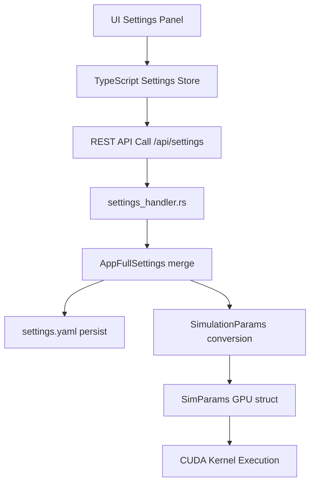
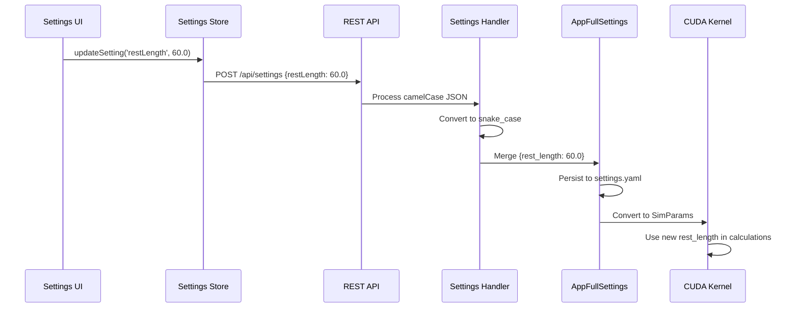

# CUDA Parameters Integration Documentation

## Overview

This document provides comprehensive documentation for the CUDA kernel parameters integration across the VisionFlow system. The integration enables fine-grained control over GPU-accelerated physics simulation behaviour through a unified configuration system.

## Architecture Overview

The CUDA parameters flow through multiple layers of the system:

```
UI Settings Panel → REST API → Rust Config → CUDA Kernel
     (camelCase)     (JSON)    (snake_case)   (GPU Struct)
```

### Parameter Flow Diagram



## CUDA Kernel Parameters

### Core Physics Parameters

| Parameter | Type | Range | Default | Description | Purpose |
|-----------|------|-------|---------|-------------|---------|
| `rest_length` / `restLength` | f32 | 10.0-100.0 | 50.0 | Natural spring rest length | Determines equilibrium distance for spring forces between connected nodes |
| `repulsion_cutoff` / `repulsionCutoff` | f32 | 10.0-100.0 | 50.0 | Maximum repulsion calculation distance | Optimises performance by limiting long-range repulsion calculations |
| `repulsion_softening_epsilon` / `repulsionSofteningEpsilon` | f32 | 0.0001-0.01 | 0.0001 | Division-by-zero prevention | Prevents numerical singularities in 1/r² repulsion calculations |
| `center_gravity_k` / `centerGravityK` | f32 | 0.0-0.01 | 0.0 | Centre gravity force constant | Applies gravitational pull towards viewport centre (disabled by default) |
| `grid_cell_size` / `gridCellSize` | f32 | 10.0-100.0 | 50.0 | Spatial grid resolution | Optimises neighbour searches using spatial hashing |

### Warmup and Cooling Parameters

| Parameter | Type | Range | Default | Description | Purpose |
|-----------|------|-------|---------|-------------|---------|
| `warmup_iterations` / `warmupIterations` | u32 | 10-200 | 100 | Number of warmup steps | Initial settling phase before normal simulation |
| `cooling_rate` / `coolingRate` | f32 | 0.0001-0.01 | 0.001 | Rate of system cooling | Controls energy reduction during simulation |

### Boundary Behaviour Parameters

| Parameter | Type | Range | Default | Description | Purpose |
|-----------|------|-------|---------|-------------|---------|
| `boundary_extreme_multiplier` / `boundaryExtremeMultiplier` | f32 | 1.0-10.0 | 2.0 | Extreme boundary detection threshold | Multiplier for viewport bounds to detect extreme positions |
| `boundary_extreme_force_multiplier` / `boundaryExtremeForceMultiplier` | f32 | 1.0-100.0 | 10.0 | Force applied to extreme nodes | Increases force strength for nodes beyond extreme boundaries |
| `boundary_velocity_damping` / `boundaryVelocityDamping` | f32 | 0.1-1.0 | 0.5 | Velocity reduction on boundary collision | Reduces node velocity when hitting boundaries |

## Integration Across System Layers

### 1. Configuration Files

#### `/data/dev_config.toml` (Server-side defaults)

```toml
[physics]
# CUDA kernel parameters
rest_length = 50.0
repulsion_cutoff = 50.0
repulsion_softening_epsilon = 0.0001
center_gravity_k = 0.0
grid_cell_size = 50.0
warmup_iterations = 100
cooling_rate = 0.001

# Boundary behaviour
boundary_extreme_multiplier = 2.0
boundary_extreme_force_multiplier = 10.0
boundary_velocity_damping = 0.5
```

#### `/data/settings.yaml` (User settings)

```yaml
visualisation:
  graphs:
    logseq:
      physics:
        # CUDA kernel parameters from dev_config.toml
        rest_length: 50.0
        repulsion_cutoff: 50.0
        repulsion_softening_epsilon: 0.0001
        center_gravity_k: 0.0
        grid_cell_size: 50.0
        warmup_iterations: 100
        cooling_rate: 0.001
        boundary_extreme_multiplier: 2.0
        boundary_extreme_force_multiplier: 10.0
        boundary_velocity_damping: 0.5
```

### 2. Rust Configuration Structures

#### `PhysicsSettings` (src/config/mod.rs)

```rust
#[derive(Debug, Clone, Serialize, Deserialize)]
#[serde(rename_all = "snake_case")]
pub struct PhysicsSettings {
    // CUDA kernel parameters
    pub rest_length: f32,
    pub repulsion_cutoff: f32,
    pub repulsion_softening_epsilon: f32,
    pub center_gravity_k: f32,
    pub grid_cell_size: f32,
    pub warmup_iterations: u32,
    pub cooling_rate: f32,
    pub boundary_extreme_multiplier: f32,
    pub boundary_extreme_force_multiplier: f32,
    pub boundary_velocity_damping: f32,
    // ... other physics parameters
}
```

#### `SimParams` GPU Structure (src/models/simulation_params.rs)

```rust
#[repr(C)]
#[derive(Debug, Clone, Copy, Pod, Zeroable, DeviceCopy)]
pub struct SimParams {
    // CUDA kernel parameters (GPU-aligned)
    pub rest_length: f32,
    pub repulsion_cutoff: f32,
    pub repulsion_softening_epsilon: f32,
    pub center_gravity_k: f32,
    pub grid_cell_size: f32,
    pub warmup_iterations: u32,
    pub cooling_rate: f32,
    // ... other GPU parameters
}
```

### 3. REST API Integration

#### GET `/api/settings`

Returns settings in camelCase format for client consumption:

```json
{
  "visualisation": {
    "graphs": {
      "logseq": {
        "physics": {
          "restLength": 50.0,
          "repulsionCutoff": 50.0,
          "repulsionSofteningEpsilon": 0.0001,
          "centerGravityK": 0.0,
          "gridCellSize": 50.0,
          "warmupIterations": 100,
          "coolingRate": 0.001,
          "boundaryExtremeMultiplier": 2.0,
          "boundaryExtremeForceMultiplier": 10.0,
          "boundaryVelocityDamping": 0.5
        }
      }
    }
  }
}
```

#### POST `/api/settings`

Accepts partial updates in camelCase format:

```json
{
  "visualisation": {
    "graphs": {
      "logseq": {
        "physics": {
          "restLength": 60.0,
          "gridCellSize": 40.0,
          "coolingRate": 0.002
        }
      }
    }
  }
}
```

### 4. TypeScript Interfaces

#### Settings Interface (client/src/features/settings/config/settings.ts)

```typescript
export interface PhysicsSettings {
  // CUDA kernel parameters (camelCase for TypeScript/JSON)
  restLength: number;
  repulsionCutoff: number;
  repulsionSofteningEpsilon: number;
  centerGravityK: number;
  gridCellSize: number;
  warmupIterations: number;
  coolingRate: number;
  boundaryExtremeMultiplier: number;
  boundaryExtremeForceMultiplier: number;
  boundaryVelocityDamping: number;
  // ... other physics settings
}
```

### 5. UI Settings Panel

#### Settings UI Definition (client/src/features/settings/config/settingsUIDefinition.ts)

```typescript
// CUDA kernel parameters UI controls
restLength: {
  label: 'Rest Length',
  type: 'slider',
  min: 10,
  max: 100,
  step: 1,
  path: `visualisation.graphs.${graphName}.physics.restLength`,
  description: 'Default rest length for spring forces.'
},
repulsionCutoff: {
  label: 'Repulsion Cutoff',
  type: 'slider',
  min: 10,
  max: 100,
  step: 1,
  path: `visualisation.graphs.${graphName}.physics.repulsionCutoff`,
  description: 'Maximum distance for repulsion calculations.'
},
gridCellSize: {
  label: 'Grid Cell Size',
  type: 'slider',
  min: 10,
  max: 100,
  step: 1,
  path: `visualisation.graphs.${graphName}.physics.gridCellSize`,
  description: 'Spatial grid cell size for optimisation.'
},
coolingRate: {
  label: 'Cooling Rate',
  type: 'slider',
  min: 0.0001,
  max: 0.01,
  step: 0.0001,
  path: `visualisation.graphs.${graphName}.physics.coolingRate`,
  description: 'Rate at which the system cools down during simulation.'
}
```

## Case Conversion System

The system automatically handles case conversion between different layers:

### Snake Case → Camel Case (Server → Client)

- **Server (Rust)**: `rest_length`, `repulsion_cutoff`, `grid_cell_size`
- **Client (TypeScript)**: `restLength`, `repulsionCutoff`, `gridCellSize`

#### Conversion Implementation

Located in `src/config/mod.rs`:

```rust
#[derive(Debug, Clone, Serialize, Deserialize)]
#[serde(rename_all = "camelCase")] // Automatic snake_case → camelCase
pub struct PhysicsSettings {
    pub rest_length: f32,    // → restLength in JSON
    pub repulsion_cutoff: f32, // → repulsionCutoff in JSON
    pub grid_cell_size: f32,  // → gridCellSize in JSON
    // ...
}
```

### Camel Case → Snake Case (Client → Server)

The REST API handler automatically converts incoming camelCase JSON to snake_case Rust structs using serde's `rename_all` attribute.

## Parameter Flow from UI to GPU Kernel

### Step-by-Step Flow

1. **UI Interaction**: User adjusts slider in Settings Panel
2. **Settings Store Update**: TypeScript settings store updates with new value
3. **API Call**: POST request sent to `/api/settings` with camelCase JSON
4. **Handler Processing**: `settings_handler.rs` receives and validates request
5. **Case Conversion**: Serde automatically converts camelCase → snake_case
6. **Settings Merge**: New values merged into `AppFullSettings` structure
7. **Persistence**: Updated settings saved to `settings.yaml`
8. **Simulation Update**: Physics engine receives updated parameters
9. **GPU Conversion**: `SimulationParams` → `SimParams` conversion
10. **CUDA Execution**: Updated parameters used in GPU kernel

### Example Parameter Update Flow



## Parameter Validation

### Client-Side Validation

TypeScript interfaces and UI components enforce parameter ranges:

```typescript
// Slider configuration enforces min/max values
min: 10,
max: 100,
step: 1,
```

### Server-Side Validation

The `ValidationService` in `handlers/settings_handler.rs` validates all incoming parameters:

```rust
impl ValidationService {
    fn validate_physics_parameter(&self, key: &str, value: f32) -> Result<f32, ValidationError> {
        match key {
            "rest_length" | "restLength" => {
                if value < 10.0 || value > 100.0 {
                    return Err(ValidationError::OutOfRange {
                        field: key.to_string(),
                        min: 10.0,
                        max: 100.0,
                        actual: value,
                    });
                }
            },
            "repulsion_cutoff" | "repulsionCutoff" => {
                if value < 10.0 || value > 100.0 {
                    return Err(ValidationError::OutOfRange {
                        field: key.to_string(),
                        min: 10.0,
                        max: 100.0,
                        actual: value,
                    });
                }
            },
            // ... other parameter validations
        }
        Ok(value)
    }
}
```

### GPU-Side Safety

The CUDA kernel includes safety checks for extreme values:

```cuda
// Prevent division by zero with softening epsilon
float distance_squared = max(dx*dx + dy*dy, params.repulsion_softening_epsilon);

// Clamp forces to prevent instability
force_x = clamp(force_x, -params.max_force, params.max_force);
```

## Performance Considerations

### Parameter Impact on Performance

| Parameter | Performance Impact | Recommendations |
|-----------|-------------------|------------------|
| `grid_cell_size` | **High** - Smaller values increase spatial grid resolution | Use 25-75 range; too small causes memory overhead |
| `repulsion_cutoff` | **Medium** - Larger values include more nodes in calculations | Balance between accuracy and performance (25-75) |
| `warmup_iterations` | **Medium** - Higher values increase startup time | Use 50-200 range based on graph complexity |
| `rest_length` | **Low** - Minimal performance impact | Adjust freely for desired layout |
| `cooling_rate` | **Low** - Affects convergence speed, not computation | Lower values provide smoother transitions |

### Optimization Guidelines

1. **Start with defaults**: The default values are optimised for most use cases
2. **Monitor performance**: Use browser dev tools to monitor frame rates
3. **Adjust gradually**: Make small incremental changes to observe effects
4. **Graph-specific tuning**: Different graph types may require different parameters
5. **Consider hardware**: Adjust parameters based on GPU capabilities

## Auto-Balance Integration

The CUDA parameters work with the auto-balance system to automatically tune settings:

### Auto-Balance Thresholds

```yaml
physics:
  auto_balance_config:
    # CUDA parameter tuning thresholds
    grid_cell_size_min: 1.0
    grid_cell_size_max: 50.0
    repulsion_cutoff_min: 5.0
    repulsion_cutoff_max: 200.0
    repulsion_softening_min: 0.000001
    repulsion_softening_max: 1.0
    center_gravity_min: 0.0
    center_gravity_max: 0.1
```

### Auto-Balance Triggers

The system automatically adjusts CUDA parameters when detecting:

- **Clustering**: Nodes too close together
- **Explosion**: Nodes spread too far apart
- **Oscillation**: Unstable movement patterns
- **Boundary violations**: Nodes outside viewport
- **Performance degradation**: Frame rate drops

## Adding New CUDA Parameters

### Step 1: Add to dev_config.toml

```toml
[physics]
# Add new parameter with sensible default
new_parameter = 1.0
```

### Step 2: Update Rust Structures

In `src/config/mod.rs`:

```rust
#[derive(Debug, Clone, Serialize, Deserialize)]
#[serde(rename_all = "camelCase")]
pub struct PhysicsSettings {
    // Add new parameter (snake_case in Rust)
    pub new_parameter: f32,
    // ...
}
```

In `src/models/simulation_params.rs`:

```rust
#[repr(C)]
#[derive(Debug, Clone, Copy, Pod, Zeroable, DeviceCopy)]
pub struct SimParams {
    // Add to GPU struct
    pub new_parameter: f32,
    // ...
}

// Update conversion implementation
impl From<&PhysicsSettings> for SimParams {
    fn from(physics: &PhysicsSettings) -> Self {
        SimParams {
            new_parameter: physics.new_parameter,
            // ...
        }
    }
}
```

### Step 3: Update TypeScript Interface

In `client/src/features/settings/config/settings.ts`:

```typescript
export interface PhysicsSettings {
  // Add new parameter (camelCase in TypeScript)
  newParameter: number;
  // ...
}
```

### Step 4: Add UI Control

In `client/src/features/settings/config/settingsUIDefinition.ts`:

```typescript
newParameter: {
  label: 'New Parameter',
  type: 'slider',
  min: 0.1,
  max: 10.0,
  step: 0.1,
  path: `visualisation.graphs.${graphName}.physics.newParameter`,
  description: 'Description of what this parameter does.'
},
```

### Step 5: Update Default Settings

In `client/src/features/settings/config/defaultSettings.ts`:

```typescript
physics: {
  newParameter: 1.0, // Match dev_config.toml default
  // ...
}
```

### Step 6: Add Validation

In `src/handlers/settings_handler.rs`:

```rust
impl ValidationService {
    fn validate_physics_parameter(&self, key: &str, value: f32) -> Result<f32, ValidationError> {
        match key {
            "new_parameter" | "newParameter" => {
                if value < 0.1 || value > 10.0 {
                    return Err(ValidationError::OutOfRange {
                        field: key.to_string(),
                        min: 0.1,
                        max: 10.0,
                        actual: value,
                    });
                }
            },
            // ...
        }
        Ok(value)
    }
}
```

### Step 7: Update CUDA Kernel

Use the new parameter in your CUDA kernel code:

```cuda
__global__ void physics_kernel(SimParams params, /* other args */) {
    // Use the new parameter
    float effect = params.new_parameter * some_calculation;
    // ...
}
```

## Debugging and Troubleshooting

### Common Issues

1. **Case Conversion Errors**
   - **Symptom**: Parameter not updating in GPU kernel
   - **Solution**: Verify snake_case ↔ camelCase mapping in all layers

2. **Validation Failures**
   - **Symptom**: Settings update rejected by server
   - **Solution**: Check parameter ranges in validation service

3. **GPU Kernel Not Receiving Updates**
   - **Symptom**: Visual changes don't occur despite UI updates
   - **Solution**: Verify `SimParams` conversion implementation

### Debug Tools

1. **Browser Console**: Check for API errors and validation messages
2. **Server Logs**: Monitor settings update processing with `RUST_LOG=debug`
3. **Settings Inspection**: Use developer tools to inspect settings store state
4. **GPU Profiling**: Use CUDA profiling tools for kernel performance analysis

### Logging

Enable comprehensive logging:

```bash
# Server-side debugging
export RUST_LOG="visionflow=debug,settings_handler=trace"

# Client-side debugging
localStorage.setItem('vf_debug_settings', 'true');
```

## Conclusion

The CUDA parameters integration provides a sophisticated yet user-friendly system for fine-tuning GPU-accelerated physics simulation. The multi-layer architecture ensures type safety, validation, and optimal performance whilst maintaining ease of use through the web interface.

The system's design allows for easy extension with new parameters and provides comprehensive debugging tools for troubleshooting. By following the established patterns, developers can add new CUDA parameters with confidence that they will integrate seamlessly across all system layers.