# VisionFlow/TurboFlow: Dense Technical Overview

> **Document Purpose**: Maximally dense technical reference for AI agent context grokking while retaining human readability. Contains all architectural diagrams, data flows, and system integration details.

---

## Executive Summary: Semantic Knowledge Made Tangible

### Vision

VisionFlow transforms abstract semantic relationships into physically interactive 3D environments where AI agents directly manipulate knowledge structures. Rather than viewing ontologies as static diagrams, users and agents navigate force-directed graphs rendered with GPU-accelerated physics, selecting nodes through spatial proximity, clustering concepts through gravitational attraction, and discovering hidden relationships through emergent simulation dynamics. The system bridges the gap between symbolic AI reasoning and embodied spatial cognition.

### Core Innovation

The fundamental innovation lies in bidirectional agent-visualization coupling. Claude Flow V3 swarm agents do not merely query semantic data--they inhabit the visualization space. An agent exploring an OWL ontology can grab concept clusters, apply forces to reorganize taxonomies, and trigger CUDA-accelerated layout algorithms in real-time. The RuVector PostgreSQL backend (1.17M+ memory entries with HNSW indexing) provides persistent semantic grounding, enabling agents to remember spatial arrangements across sessions. Byzantine fault-tolerant consensus ensures multi-agent coordination when several agents simultaneously manipulate the same knowledge graph region.

### Technical Stack

The architecture spans three execution domains: Rust handles performance-critical visualization (100+ CUDA kernels for force simulation, collision detection, level-of-detail rendering), Node.js orchestrates the Claude Flow V3 swarm infrastructure (hierarchical-mesh topology, 60+ agent types, 27 hooks), and the CachyOS container provides the agentic workstation runtime (supervisord services, multi-provider AI routing, 62+ Claude Code skills). MCP bridges expose visualization primitives as tools--agents invoke Blender for mesh generation, QGIS for geospatial overlays, Playwright for web scraping into the graph. The Z.AI service proxies Claude API calls through a 4-worker pool for cost optimization.

### Architecture Philosophy

Hexagonal architecture isolates the semantic core from visualization adapters and agent interfaces. OWL ontology reasoning remains pure domain logic; CUDA rendering constitutes an output port; agent tool invocations arrive through input ports. This separation enables swapping visualization backends (WebGPU, Vulkan) or agent frameworks without core refactoring. The system treats knowledge visualization not as a final product but as a collaborative workspace where human intuition and agent reasoning converge on shared spatial representations.

---

## Security Architecture

The agentic workstation implements defense-in-depth through UID-based service isolation, hierarchical credential management, and network segmentation. Four system users partition workloads: devuser (UID 1000) runs Claude Code and primary development services; gemini-user (UID 1001) isolates Google Gemini operations; openai-user (UID 1002) handles OpenAI Codex; and zai-user (UID 1003) exclusively runs the Z.AI cost-optimization service. Supervisord enforces this separation by launching each service under its designated user account, with `user=zai-user` for claude-zai and `user=gemini-user` for gemini-flow.

Credential distribution follows a read-only host mount pattern for SSH keys: the host's `~/.ssh` directory mounts to `/home/devuser/.ssh-host:ro`, and the entrypoint copies keys to `~/.ssh` with `chmod 600` for private keys and `chmod 644` for public keys. API keys inject via environment variables, with `MANAGEMENT_API_KEY: ${MANAGEMENT_API_KEY:?required}` syntax enforcing mandatory configuration at compose-time rather than defaulting to insecure values.

Supervisord hardens its control socket with `chmod=0700` on `/var/run/supervisor.sock`, restricting access to root only. Each program block specifies `startretries=5`, `stopasgroup=true`, and `killasgroup=true` ensuring clean process tree termination. Service startup follows a priority chain: dbus at priority 10, sshd at 50, VNC/desktop components at 90-210, management-api at 300, and claude-zai at 500.

Network security relies on the external `docker_ragflow` network for inter-container communication. Critically, port 9600 (Z.AI) is NOT exposed in the ports section, restricting access to containers on the ragflow network. The Docker socket mount carries an explicit security warning in docker-compose.yml noting that RW access enables container escapes, recommending a socket proxy for production deployments.

---

## Quick Reference Tables

| Component | Specification |
|-----------|---------------|
| Base Image | `cachyos/cachyos-v3:latest` (x86-64-v3 optimized) |
| glibc/libstdc++ | 2.40+/14.x for binary compatibility with host |
| Node.js | v23.11.1 (direct tarball, not pacman) |
| Python | 3.12.8 from source @ /opt/python312 |
| CUDA | 13.1 @ /opt/cuda with cuDNN/cuTensor |
| PostgreSQL | External ruvector-postgres preferred, local fallback |
| supervisord Priority | 10 (dbus) -> 950 (healthcheck) |
| User UIDs | devuser:1000, gemini:1001, openai:1002, zai:1003, deepseek:1004 |
| SSH Mount | ~/.ssh -> .ssh-host:ro -> entrypoint copies with 600/644 perms |

| Port | Service | Exposure |
|------|---------|----------|
| 2222->22 | SSH | Public |
| 5901 | VNC | Public |
| 8080 | code-server | Public |
| 9090 | Management API | Public |
| 9600 | Z.AI | Internal only (ragflow network) |

---

# Slide Presentation Content

Here is a structured 20-minute technical system presentation for VisionFlow. It focuses purely on architecture, data flow, and the unique fusion of semantic reasoning with physics simulation.

What I need from you is the FIRST infograph slide. Leave a space somewhere on the slide for me to insert bullet points using other software. It can just be a quiet area with a subtle border.

The slide 1 prompt below is a inspiration only, use the mermaid diagrams to fully understand the context and create the image with your enhanced understanding.
---

# VisionFlow System Architecture: 20-Minute Technical Deep Dive

## Slide 1: The Hexagonal Core (Ports & Adapters)
**Time:** 3 Minutes
**Goal:** Explain how the system isolates domain logic from infrastructure to allow hot-swapping of DBs and Renderers.

*   **Key Talking Points:**
    *   **Inversion of Control:** The core domain (Physics, Ontology, Graph State) knows nothing about the database (Neo4j) or the API (Actix).
    *   **The Ports:** Interfaces for `GraphRepository`, `PhysicsSimulator`, and `InferenceEngine`.
    *   **The Adapters:** Current implementations use Neo4j for storage and CUDA for physics, but the architecture allows for SQLite or WebGPU fallbacks without touching business logic.
    *   **Migration Success:** This architecture allowed the seamless migration from a monolithic `GraphServiceActor` to the current modular system.

### Visual Prompt
> Design a technical infographic illustrating a Hexagonal Architecture. Center the composition on a "Quiet Core" labeled **Domain Logic**. Surrounding this core, create a hexagonal boundary made of fine, matte graphite lines.
>
> Radiating outward from the hexagon edges are connector nodes labeled **Ports** (e.g., Persistence, Compute, Inference). Connecting to these ports from the outer dark navy void are distinct, structural modules labeled **Adapters** (Neo4j, CUDA, WebSocket).
>
> Use the visual metaphor of "Pressure and Flow": Data flows like liquid light from the adapters, through the ports, settling into the core. Use deep navy and charcoal background with textured anodized metal finish. Text text should be minimal sans serif: "Inputs", "Domain", "Outputs". Avoid glowing sci-fi effects; keep it mechanical and elegant.

---

## Slide 2: CQRS & The Single Source of Truth
**Time:** 3 Minutes
**Goal:** Detail how data consistency is maintained between the high-speed physics engine and the persistent graph database.

*   **Key Talking Points:**
    *   **Command (Write):** Directives (e.g., `AddNode`, `UpdateSettings`) go through strict validation and persist immediately to Neo4j.
    *   **Query (Read):** Read models are optimized for specific views (e.g., 3D Client vs. Agent Analysis).
    *   **Event Sourcing:** Every state change emits an event (e.g., `GraphUpdated`). This triggers the cache invalidation strategy.
    *   **The "316 Node" Fix:** Reference the architectural decision where the Event Bus ensures the in-memory actor state never drifts from the database state during GitHub syncs.

### Visual Prompt
> Design a technical infographic showing a Command Query Responsibility Segregation (CQRS) flow. Divide the layout asymmetrically. On the left (Command side), show thick, tense lines representing **Writes** converging into a solid, heavy block labeled **Neo4j**. Use soft heat shading to imply the "weight" of data persistence.
>
> On the right (Query side), show multiple fine, divergent flow lines labeled **Reads** radiating from the database towards the top right, representing data distribution to clients.
>
> Connecting the two sides is a thin, circular feedback loop labeled **Event Bus**, acting as a heartbeat. Use desaturated amber for the write paths and muted cyan for the read paths. The background is dark matte paper texture. The overall feeling should be one of "Balance" between heavy storage and light retrieval.

---

## Slide 3: The Semantic Physics Engine
**Time:** 4 Minutes
**Goal:** Explain the unique selling point: transforming abstract logic (OWL Axioms) into physical 3D layout forces.

*   **Key Talking Points:**
    *   **The Translation Pipeline:** Logic becomes Physics.
    *   **Input:** OWL Axioms (e.g., `Class A SubClassOf Class B`, `Class X DisjointWith Class Y`).
    *   **Transformation:** The `ConstraintBuilder` maps axioms to force vectors.
    *   **Forces:**
        *   *Attraction:* Hierarchy (Child pulls to Parent).
        *   *Repulsion:* Disjoint classes push apart (Semantic Collision).
        *   *Alignment:* Sibling nodes align on axes.
    *   **Result:** The layout *is* the meaning. You don't just see the graph; you see the logic.

### Visual Prompt
> Design a technical infographic illustrating the translation of **Logic to Physics**. On the left, depict abstract, geometric structures (triangles, squares) representing **Ontology**. These shapes deconstruct into streams of particles moving across the canvas to the right.
>
> On the right, these particles reassemble into a **Force Field**—a curved coordinate system where points drift slowly, tethered by visible tension lines.
>
> Label the tension lines with physical metaphors: "Attraction," "Repulsion," "Alignment." Use color to denote semantic stress: Muted Cyan for logical coherence, Desaturated Amber for disjoint/repulsive stress. The background is deep graphite. The visual tone is "System that thinks."

---

## Slide 4: GPU Acceleration (CUDA Kernel Pipeline)
**Time:** 3 Minutes
**Goal:** Show how the system handles 100k+ nodes at 60 FPS.

*   **Key Talking Points:**
    *   **Data Layout:** Structure of Arrays (SoA) for memory coalescing (accessing memory efficiently).
    *   **The Kernel Stack (87 Kernels):**
        1.  *Barnes-Hut:* O(n log n) repulsive forces.
        2.  *Spatial Grid:* Collision detection.
        3.  *Semantic Constraints:* Applying the ontology forces.
        4.  *Integration:* Velocity Verlet algorithm for movement.
    *   **Memory Management:** Double-buffered async transfer between CPU and GPU to prevent locking the main thread.

### Visual Prompt
> Design a technical infographic visualizing a high-performance **GPU Compute Pipeline**. The composition is vertical. At the top, a chaotic cloud of points enters a funnel.
>
> Inside the funnel/pipeline, show ordered, parallel "tracks" representing **CUDA Threads**. Use the metaphor of "Flow" and "Laminar Flow"—the chaotic input becomes straight, rapid, parallel lines.
>
> Label specific processing zones along the tracks: "Spatial Hash," "Force Calc," "Integration." At the bottom, the lines exit into a clean, stable structure. Use a palette of deep navy and bright, cold graphite. The texture should look like machined metal. Suggest speed through geometry and spacing, not motion blur.

---

## Slide 5: Multi-Agent Orchestration (MCP)
**Time:** 4 Minutes
**Goal:** Explain how the AI agents live alongside the data and manipulate it.

*   **Key Talking Points:**
    *   **The Environment:** Docker-isolated Agent Workstations (Claude, Python, Rust runtimes).
    *   **The Protocol:** Model Context Protocol (MCP) over TCP/WebSockets. This is the nervous system.
    *   **Topology:** Supports Hierarchical, Mesh, and Star agent topologies.
    *   **Integration:** Agents aren't just external chat; they are nodes *in* the graph. They can read the graph state, run simulations, and write back code/data.
    *   **Tool Bridges:** Agents control Blender, QGIS, and the Graph Engine via standard tool interfaces.

### Visual Prompt
> Design a technical infographic for a **Multi-Agent Mesh**. Create a radial composition. In the center is the **VisionFlow Core**. Orbiting this core are several distinct, smaller geometric clusters representing **Agents** (Coder, Researcher, Architect).
>
> Connect the agents to each other and the core using "Attention Lines"—directional flow lines that brighten and dim as they route energy. Show the connections as a network of nerves.
>
> Include a layer of "Tool Bridges" (Blender, QGIS) as solid blocks anchored to the edge of the graphic, connected to the agent mesh. Use muted cyan for agent communications and desaturated amber for tool outputs. The visual tone is "Alive" and "Collaborative."

---

## Slide 6: Real-Time Synchronization (Binary Protocol)
**Time:** 3 Minutes
**Goal:** Explain how the client (VR/Web) stays in sync with the heavy backend computation.

*   **Key Talking Points:**
    *   **The Problem:** JSON is too slow/heavy for 100k nodes @ 60hz.
    *   **The Solution:** Custom Binary Protocol V3.
    *   **Efficiency:** 36-48 bytes per node (vs 200+ for JSON).
    *   **Packet Structure:** Header + Array[ID, PosX, PosY, PosZ, Vel, Flags].
    *   **Dual-Graph Broadcasting:** Transmitting both the Knowledge Graph and the Agent positions in a single synchronized stream.

### Visual Prompt
> Design a technical infographic illustrating **Data Serialization**. On the left, show a large, diffuse cloud representing "JSON Overhead." In the middle, show a compression mechanism—a "Gate" or "Filter"—that strips away the noise.
>
> On the right, emerging from the gate, show a tightly packed, dense stream of geometric blocks representing the **Binary Protocol**. Each block is identical in size, suggesting extreme efficiency and order.
>
> Label the stream contents minimally: "ID," "Vector," "State." The background is dark matte. Use the visual metaphor of "Pressure" driving the stream through the narrow binary pipe. Contrast the fuzzy, large left side with the sharp, crystalline right side.

# All Mermaid Diagrams

Extracted from project documentation.

---

# Container Infrastructure (CachyOS Ecosystem)

## CachyOS Binary Compatibility Architecture

```mermaid
flowchart TB
    subgraph HOST["HOST SYSTEM (CachyOS x86-64-v3)"]
        direction LR
        KERNEL[("Linux Kernel<br/>6.18.6-2-cachyos")]
        GLIBC["glibc 2.40+<br/>(x86-64-v3 ABI)"]
        LIBSTDCPP["libstdc++ 14.x<br/>(C++23)"]
        NVIDIA_DRV["NVIDIA Driver<br/>580.105.08"]
        HOST_BIN["Host Binaries<br/>AVX2/FMA/BMI2"]
    end

    subgraph RUNTIME["nvidia-container-toolkit"]
        direction TB
        CDI["CDI Injection"]
        LIB_MOUNT["Library Mount<br/>/usr/lib/nvidia"]
        DEV_MOUNT["Device Mount<br/>/dev/nvidia*"]
    end

    subgraph CONTAINER["CONTAINER (cachyos/cachyos-v3:latest)"]
        direction TB
        subgraph BASE_LAYER["Base Layer (Binary Compatible)"]
            C_GLIBC["glibc 2.40+<br/>SAME VERSION"]
            C_LIBSTDCPP["libstdc++ 14.x<br/>SAME ABI"]
            PACMAN["pacman<br/>CachyOS repos"]
        end
        subgraph CUDA_LAYER["CUDA Toolkit Layer"]
            CUDA["/opt/cuda<br/>CUDA 13.1"]
            NVCC["nvcc/ptxas<br/>PTX Compilation"]
            CUDNN["cuDNN 9.x"]
            CUTENSOR["cuTensor"]
        end
        subgraph APP_LAYER["Application Layer"]
            NODE["Node.js 23.11.1<br/>(x86-64-v3 JIT)"]
            PY312[("Python 3.12<br/>--enable-optimizations<br/>--with-lto")]
            PYTORCH["PyTorch cu130<br/>Bundled CUDA libs"]
        end
    end

    KERNEL --> CDI
    NVIDIA_DRV --> LIB_MOUNT
    GLIBC -.->|"Symbol Compat"| C_GLIBC
    LIBSTDCPP -.->|"ABI Compat"| C_LIBSTDCPP
    LIB_MOUNT --> CUDA_LAYER
    DEV_MOUNT --> CUDA_LAYER

    classDef host fill:#2d5016,stroke:#4ade80
    classDef runtime fill:#854d0e,stroke:#fbbf24
    classDef container fill:#1e3a5f,stroke:#60a5fa
    class HOST host
    class RUNTIME runtime
    class CONTAINER container
```

## Container Service Architecture (supervisord)

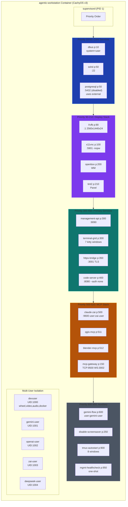
```mermaid
flowchart TB
    subgraph AGENTIC["agentic-workstation Container (CachyOS v3)"]
        direction TB

        subgraph SUPERVISOR["supervisord (PID 1)"]
            direction LR
            PRIO["Priority Order"]
        end

        subgraph TIER1["Priority 10-50: Core Services"]
            DBUS["dbus p:10<br/>system+user"]
            SSHD["sshd p:50<br/>:22"]
            PGSQL["postgresql p:50<br/>:5432 (disabled)<br/>uses external"]
        end

        subgraph TIER2["Priority 90-210: Display Stack"]
            XVFB["Xvfb p:90<br/>:1 2560x1440x24"]
            X11VNC["x11vnc p:100<br/>:5901 -nopw"]
            OPENBOX["openbox p:200<br/>WM"]
            TINT2["tint2 p:210<br/>Panel"]
        end

        subgraph TIER3["Priority 300-400: Primary Services"]
            MGMT["management-api p:300<br/>:9090"]
            TERM["terminal-grid p:300<br/>7 kitty windows"]
            HTTPS_B["https-bridge p:350<br/>:3001 TLS"]
            CODE["code-server p:400<br/>:8080 --auth none"]
        end

        subgraph TIER4["Priority 500-520: MCP Stack"]
            ZAI["claude-zai p:500<br/>:9600 user:zai-user"]
            QGIS_M["qgis-mcp p:511"]
            BLENDER_M["blender-mcp p:512"]
            GW["mcp-gateway p:150<br/>TCP:9500 WS:3002"]
        end

        subgraph TIER5["Priority 600-950: Auxiliary"]
            GEMINI["gemini-flow p:600<br/>user:gemini-user"]
            SCRSVR["disable-screensaver p:250"]
            TMUX["tmux-autostart p:900<br/>8 windows"]
            HEALTH["mgmt-healthcheck p:950<br/>one-shot"]
        end

        subgraph USERS["Multi-User Isolation"]
            direction LR
            DEV["devuser<br/>UID:1000<br/>wheel,video,audio,docker"]
            GEM["gemini-user<br/>UID:1001"]
            OAI["openai-user<br/>UID:1002"]
            ZAI_U["zai-user<br/>UID:1003"]
            DEEP["deepseek-user<br/>UID:1004"]
        end
    end

    SUPERVISOR --> TIER1
    TIER1 --> TIER2
    TIER2 --> TIER3
    TIER3 --> TIER4
    TIER4 --> TIER5

    classDef core fill:#1e40af,stroke:#60a5fa
    classDef display fill:#7c3aed,stroke:#a78bfa
    classDef service fill:#0f766e,stroke:#2dd4bf
    classDef mcp fill:#b45309,stroke:#fbbf24
    classDef aux fill:#4b5563,stroke:#9ca3af
    class TIER1 core
    class TIER2 display
    class TIER3 service
    class TIER4 mcp
    class TIER5 aux
```

## Deployment Modes: Monolithic vs Microservices

```mermaid
flowchart LR
    subgraph MONO["MONOLITHIC MODE<br/>(ZAI_INTERNAL=true)"]
        direction TB
        AWM["agentic-workstation"]

        subgraph AWM_SERVICES["All Services in One Container"]
            SSHM[":22 SSH"]
            VNCM[":5901 VNC"]
            CODEM[":8080 code-server"]
            MGMTM[":9090 Mgmt API"]
            ZAIM[":9600 Z.AI<br/>supervisord program<br/>user: zai-user"]
        end

        AWM --> AWM_SERVICES
    end

    subgraph MICRO["MICROSERVICES MODE<br/>(ZAI_INTERNAL=false)"]
        direction TB

        subgraph RAGFLOW_NET["docker_ragflow network"]
            direction TB

            AWE["agentic-workstation<br/>Container"]
            ZAI_EXT["claude-zai<br/>Container<br/>CachyOS aligned"]
            RUV_PG["ruvector-postgres<br/>:5432<br/>pgvector + HNSW"]
            COMFY["comfyui<br/>:8188"]

            subgraph AWE_SVC["Workstation Services"]
                SSH2[":22"]
                VNC2[":5901"]
                CODE2[":8080"]
                MGMT2[":9090"]
            end

            subgraph ZAI_SVC["Z.AI Container"]
                ZAI2[":9600"]
                CLAUDE_N["node server.js"]
            end
        end

        AWE --> AWE_SVC
        ZAI_EXT --> ZAI_SVC
        AWE -.->|"ZAI_URL=<br/>http://claude-zai:9600"| ZAI_EXT
        AWE -.->|"RUVECTOR_PG_HOST=<br/>ruvector-postgres"| RUV_PG
        AWE -.->|"COMFYUI_URL=<br/>http://comfyui:8188"| COMFY
    end

    subgraph ENV_VARS["Key Environment Variables"]
        direction TB
        E1["ZAI_INTERNAL=true/false<br/>Controls supervisord autostart"]
        E2["ZAI_URL=http://localhost:9600<br/>or http://claude-zai:9600"]
        E3["RUVECTOR_USE_EXTERNAL=true<br/>Skip local PostgreSQL init"]
    end

    classDef mono fill:#1e3a5f,stroke:#60a5fa
    classDef micro fill:#065f46,stroke:#34d399
    classDef env fill:#78350f,stroke:#fbbf24
    class MONO mono
    class MICRO micro
    class ENV_VARS env
```

## SSH Key Handling Flow

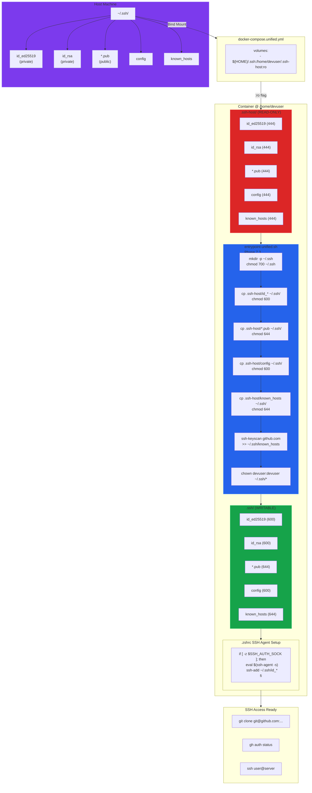
```mermaid
flowchart TB
    subgraph HOST["Host Machine"]
        SSH_DIR["~/.ssh/"]
        ID_ED["id_ed25519<br/>(private)"]
        ID_RSA["id_rsa<br/>(private)"]
        ID_PUB["*.pub<br/>(public)"]
        CONFIG["config"]
        KNOWN["known_hosts"]
        SSH_DIR --> ID_ED & ID_RSA & ID_PUB & CONFIG & KNOWN
    end

    subgraph COMPOSE["docker-compose.unified.yml"]
        MOUNT["volumes:<br/>- ${HOME}/.ssh:/home/devuser/.ssh-host:ro"]
    end

    subgraph CONTAINER["Container @ /home/devuser"]
        subgraph RO_MOUNT[".ssh-host/ (READ-ONLY)"]
            RO_ED["id_ed25519 (444)"]
            RO_RSA["id_rsa (444)"]
            RO_PUB["*.pub (444)"]
            RO_CFG["config (444)"]
            RO_KH["known_hosts (444)"]
        end

        subgraph ENTRY["entrypoint-unified.sh<br/>Phase 7.3"]
            direction TB
            MKDIR["mkdir -p ~/.ssh<br/>chmod 700 ~/.ssh"]
            CP_PRIV["cp .ssh-host/id_* ~/.ssh/<br/>chmod 600"]
            CP_PUB["cp .ssh-host/*.pub ~/.ssh/<br/>chmod 644"]
            CP_CFG["cp .ssh-host/config ~/.ssh/<br/>chmod 600"]
            CP_KH["cp .ssh-host/known_hosts ~/.ssh/<br/>chmod 644"]
            SCAN["ssh-keyscan github.com<br/>>> ~/.ssh/known_hosts"]
            CHOWN["chown devuser:devuser ~/.ssh/*"]
        end

        subgraph RW_SSH[".ssh/ (WRITABLE)"]
            WR_ED["id_ed25519 (600)"]
            WR_RSA["id_rsa (600)"]
            WR_PUB["*.pub (644)"]
            WR_CFG["config (600)"]
            WR_KH["known_hosts (644)"]
        end

        subgraph ZSHRC[".zshrc SSH Agent Setup"]
            AGENT["if [ -z $SSH_AUTH_SOCK ]; then<br/>  eval $(ssh-agent -s)<br/>  ssh-add ~/.ssh/id_*<br/>fi"]
        end
    end

    SSH_DIR -->|"Bind Mount"| COMPOSE
    COMPOSE -->|":ro flag"| RO_MOUNT
    RO_MOUNT --> ENTRY
    MKDIR --> CP_PRIV --> CP_PUB --> CP_CFG --> CP_KH --> SCAN --> CHOWN
    ENTRY --> RW_SSH
    RW_SSH --> ZSHRC

    subgraph RESULT["SSH Access Ready"]
        GIT["git clone git@github.com:..."]
        GH["gh auth status"]
        REMOTE["ssh user@server"]
    end

    ZSHRC --> RESULT

    classDef host fill:#7c3aed,stroke:#a78bfa
    classDef ro fill:#dc2626,stroke:#f87171
    classDef entry fill:#2563eb,stroke:#60a5fa
    classDef rw fill:#16a34a,stroke:#4ade80
    class HOST host
    class RO_MOUNT ro
    class ENTRY entry
    class RW_SSH rw
```

---

# Claude Flow V3 Integration

## RuVector PostgreSQL Memory Architecture

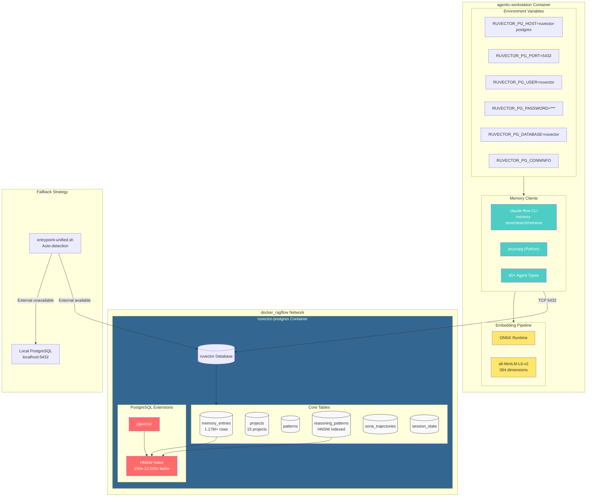
```mermaid
flowchart TB
    subgraph Docker["docker_ragflow Network"]
        subgraph PG["ruvector-postgres Container"]
            DB[(ruvector Database)]

            subgraph Tables["Core Tables"]
                ME[("memory_entries<br/>1.17M+ rows")]
                PR[("projects<br/>15 projects")]
                PT[("patterns")]
                RP[("reasoning_patterns<br/>HNSW indexed")]
                ST[("sona_trajectories")]
                SS[("session_state")]
            end

            subgraph Extensions["PostgreSQL Extensions"]
                PGV["pgvector"]
                HNSW["HNSW Index<br/>150x-12,500x faster"]
            end

            DB --> Tables
            PGV --> HNSW
            RP --> HNSW
            ME --> HNSW
        end
    end

    subgraph Container["agentic-workstation Container"]
        subgraph EnvVars["Environment Variables"]
            HOST["RUVECTOR_PG_HOST=ruvector-postgres"]
            PORT["RUVECTOR_PG_PORT=5432"]
            USER["RUVECTOR_PG_USER=ruvector"]
            PASS["RUVECTOR_PG_PASSWORD=***"]
            DBNAME["RUVECTOR_PG_DATABASE=ruvector"]
            CONN["RUVECTOR_PG_CONNINFO"]
        end

        subgraph Clients["Memory Clients"]
            CLI["claude-flow CLI<br/>memory store/search/retrieve"]
            PSYCOPG["psycopg (Python)"]
            AGENTS["60+ Agent Types"]
        end

        subgraph Embed["Embedding Pipeline"]
            ONNX["ONNX Runtime"]
            MINILM["all-MiniLM-L6-v2<br/>384 dimensions"]
        end

        EnvVars --> Clients
        Clients --> Embed
    end

    subgraph Fallback["Fallback Strategy"]
        LOCAL["Local PostgreSQL<br/>localhost:5432"]
        ENTRYPOINT["entrypoint-unified.sh<br/>Auto-detection"]
    end

    Clients --> |TCP 5432| DB
    ENTRYPOINT --> |"External unavailable"| LOCAL
    ENTRYPOINT --> |"External available"| DB

    classDef pgContainer fill:#336791,color:#fff
    classDef table fill:#f9f9f9,stroke:#333
    classDef extension fill:#ff6b6b,color:#fff
    classDef client fill:#4ecdc4,color:#fff
    classDef embed fill:#ffe66d,color:#333

    class PG pgContainer
    class ME,PR,PT,RP,ST,SS table
    class PGV,HNSW extension
    class CLI,PSYCOPG,AGENTS client
    class ONNX,MINILM embed
```

## V3 Swarm Orchestration Architecture

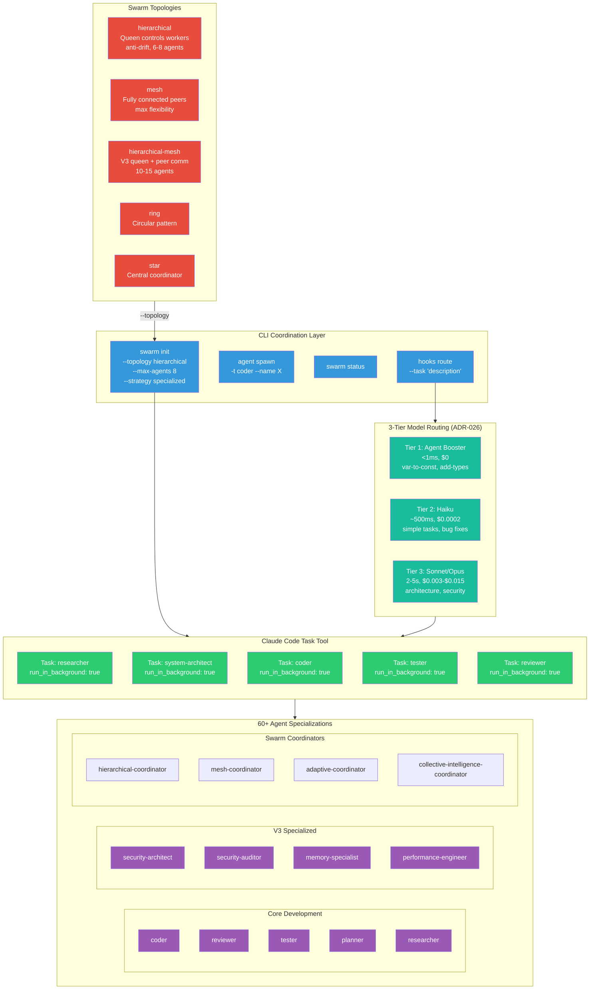
```mermaid
flowchart TB
    subgraph Topologies["Swarm Topologies"]
        direction LR
        HIER["hierarchical<br/>Queen controls workers<br/>anti-drift, 6-8 agents"]
        MESH["mesh<br/>Fully connected peers<br/>max flexibility"]
        HMESH["hierarchical-mesh<br/>V3 queen + peer comm<br/>10-15 agents"]
        RING["ring<br/>Circular pattern"]
        STAR["star<br/>Central coordinator"]
    end

    subgraph CLI["CLI Coordination Layer"]
        INIT["swarm init<br/>--topology hierarchical<br/>--max-agents 8<br/>--strategy specialized"]
        SPAWN["agent spawn<br/>-t coder --name X"]
        STATUS["swarm status"]
        ROUTE["hooks route<br/>--task 'description'"]
    end

    subgraph TaskTool["Claude Code Task Tool"]
        direction TB
        T1["Task: researcher<br/>run_in_background: true"]
        T2["Task: system-architect<br/>run_in_background: true"]
        T3["Task: coder<br/>run_in_background: true"]
        T4["Task: tester<br/>run_in_background: true"]
        T5["Task: reviewer<br/>run_in_background: true"]
    end

    subgraph AgentTypes["60+ Agent Specializations"]
        subgraph Core["Core Development"]
            CODER["coder"]
            REVIEWER["reviewer"]
            TESTER["tester"]
            PLANNER["planner"]
            RESEARCHER["researcher"]
        end

        subgraph V3Spec["V3 Specialized"]
            SECARCH["security-architect"]
            SECAUD["security-auditor"]
            MEMSPEC["memory-specialist"]
            PERFENG["performance-engineer"]
        end

        subgraph Swarm["Swarm Coordinators"]
            HIERCOORD["hierarchical-coordinator"]
            MESHCOORD["mesh-coordinator"]
            ADAPTCOORD["adaptive-coordinator"]
            COLLECTINT["collective-intelligence-coordinator"]
        end
    end

    subgraph Routing["3-Tier Model Routing (ADR-026)"]
        TIER1["Tier 1: Agent Booster<br/><1ms, $0<br/>var-to-const, add-types"]
        TIER2["Tier 2: Haiku<br/>~500ms, $0.0002<br/>simple tasks, bug fixes"]
        TIER3["Tier 3: Sonnet/Opus<br/>2-5s, $0.003-$0.015<br/>architecture, security"]
    end

    Topologies --> |"--topology"| INIT
    INIT --> TaskTool
    ROUTE --> Routing
    Routing --> TaskTool
    TaskTool --> AgentTypes

    classDef topology fill:#e74c3c,color:#fff
    classDef cli fill:#3498db,color:#fff
    classDef task fill:#2ecc71,color:#fff
    classDef agent fill:#9b59b6,color:#fff
    classDef tier fill:#1abc9c,color:#fff

    class HIER,MESH,HMESH,RING,STAR topology
    class INIT,SPAWN,STATUS,ROUTE cli
    class T1,T2,T3,T4,T5 task
    class CODER,REVIEWER,TESTER,PLANNER,RESEARCHER,SECARCH,SECAUD,MEMSPEC,PERFENG agent
    class TIER1,TIER2,TIER3 tier
```

## Self-Learning Hooks System (27 Hooks + 12 Workers)

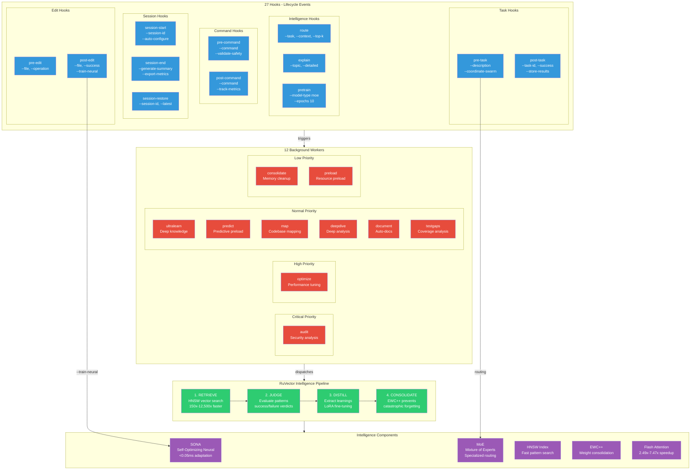
```mermaid
flowchart TB
    subgraph Lifecycle["27 Hooks - Lifecycle Events"]
        subgraph EditHooks["Edit Hooks"]
            PRE_EDIT["pre-edit<br/>--file, --operation"]
            POST_EDIT["post-edit<br/>--file, --success<br/>--train-neural"]
        end

        subgraph CmdHooks["Command Hooks"]
            PRE_CMD["pre-command<br/>--command<br/>--validate-safety"]
            POST_CMD["post-command<br/>--command<br/>--track-metrics"]
        end

        subgraph TaskHooks["Task Hooks"]
            PRE_TASK["pre-task<br/>--description<br/>--coordinate-swarm"]
            POST_TASK["post-task<br/>--task-id, --success<br/>--store-results"]
        end

        subgraph SessionHooks["Session Hooks"]
            SESS_START["session-start<br/>--session-id<br/>--auto-configure"]
            SESS_END["session-end<br/>--generate-summary<br/>--export-metrics"]
            SESS_REST["session-restore<br/>--session-id, --latest"]
        end

        subgraph IntelHooks["Intelligence Hooks"]
            ROUTE["route<br/>--task, --context, --top-k"]
            EXPLAIN["explain<br/>--topic, --detailed"]
            PRETRAIN["pretrain<br/>--model-type moe<br/>--epochs 10"]
        end
    end

    subgraph Workers["12 Background Workers"]
        subgraph Critical["Critical Priority"]
            AUDIT["audit<br/>Security analysis"]
        end

        subgraph High["High Priority"]
            OPTIMIZE["optimize<br/>Performance tuning"]
        end

        subgraph Normal["Normal Priority"]
            ULTRALEARN["ultralearn<br/>Deep knowledge"]
            PREDICT["predict<br/>Predictive preload"]
            MAP["map<br/>Codebase mapping"]
            DEEPDIVE["deepdive<br/>Deep analysis"]
            DOCUMENT["document<br/>Auto-docs"]
            TESTGAPS["testgaps<br/>Coverage analysis"]
        end

        subgraph Low["Low Priority"]
            CONSOLIDATE["consolidate<br/>Memory cleanup"]
            PRELOAD["preload<br/>Resource preload"]
        end
    end

    subgraph Pipeline["RuVector Intelligence Pipeline"]
        direction LR
        RETRIEVE["1. RETRIEVE<br/>HNSW vector search<br/>150x-12,500x faster"]
        JUDGE["2. JUDGE<br/>Evaluate patterns<br/>success/failure verdicts"]
        DISTILL["3. DISTILL<br/>Extract learnings<br/>LoRA fine-tuning"]
        CONSOLIDATE_P["4. CONSOLIDATE<br/>EWC++ prevents<br/>catastrophic forgetting"]

        RETRIEVE --> JUDGE --> DISTILL --> CONSOLIDATE_P
    end

    subgraph Components["Intelligence Components"]
        SONA["SONA<br/>Self-Optimizing Neural<br/><0.05ms adaptation"]
        MOE["MoE<br/>Mixture of Experts<br/>Specialized routing"]
        HNSW_C["HNSW Index<br/>Fast pattern search"]
        EWC["EWC++<br/>Weight consolidation"]
        FLASH["Flash Attention<br/>2.49x-7.47x speedup"]
    end

    Lifecycle --> |"triggers"| Workers
    Workers --> |"dispatches"| Pipeline
    Pipeline --> Components

    POST_EDIT --> |"--train-neural"| SONA
    PRE_TASK --> |"routing"| MOE

    classDef hook fill:#3498db,color:#fff
    classDef worker fill:#e74c3c,color:#fff
    classDef pipeline fill:#2ecc71,color:#fff
    classDef component fill:#9b59b6,color:#fff

    class PRE_EDIT,POST_EDIT,PRE_CMD,POST_CMD,PRE_TASK,POST_TASK,SESS_START,SESS_END,SESS_REST,ROUTE,EXPLAIN,PRETRAIN hook
    class AUDIT,OPTIMIZE,ULTRALEARN,PREDICT,MAP,DEEPDIVE,DOCUMENT,TESTGAPS,CONSOLIDATE,PRELOAD worker
    class RETRIEVE,JUDGE,DISTILL,CONSOLIDATE_P pipeline
    class SONA,MOE,HNSW_C,EWC,FLASH component
```

## Complete System Integration Sequence

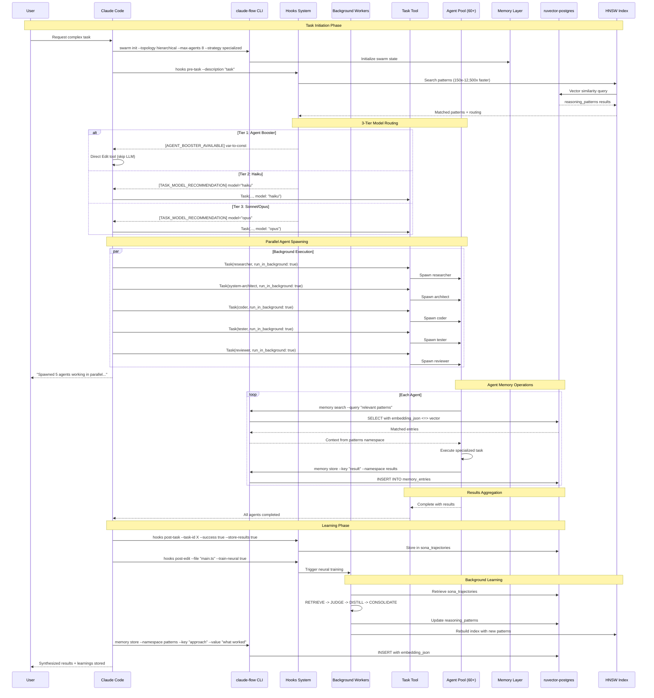
```mermaid
sequenceDiagram
    participant User
    participant Claude as Claude Code
    participant CLI as claude-flow CLI
    participant Hooks as Hooks System
    participant Workers as Background Workers
    participant Task as Task Tool
    participant Agents as Agent Pool (60+)
    participant Memory as Memory Layer
    participant PG as ruvector-postgres
    participant HNSW as HNSW Index

    Note over User,HNSW: Task Initiation Phase
    User->>Claude: Request complex task

    Claude->>CLI: swarm init --topology hierarchical --max-agents 8 --strategy specialized
    CLI->>Memory: Initialize swarm state

    Claude->>Hooks: hooks pre-task --description "task"
    Hooks->>HNSW: Search patterns (150x-12,500x faster)
    HNSW->>PG: Vector similarity query
    PG-->>HNSW: reasoning_patterns results
    HNSW-->>Hooks: Matched patterns + routing

    Note over Hooks,Agents: 3-Tier Model Routing
    alt Tier 1: Agent Booster
        Hooks-->>Claude: [AGENT_BOOSTER_AVAILABLE] var-to-const
        Claude->>Claude: Direct Edit tool (skip LLM)
    else Tier 2: Haiku
        Hooks-->>Claude: [TASK_MODEL_RECOMMENDATION] model="haiku"
        Claude->>Task: Task(..., model: "haiku")
    else Tier 3: Sonnet/Opus
        Hooks-->>Claude: [TASK_MODEL_RECOMMENDATION] model="opus"
        Claude->>Task: Task(..., model: "opus")
    end

    Note over Claude,Agents: Parallel Agent Spawning
    par Background Execution
        Claude->>Task: Task(researcher, run_in_background: true)
        Task->>Agents: Spawn researcher

        Claude->>Task: Task(system-architect, run_in_background: true)
        Task->>Agents: Spawn architect

        Claude->>Task: Task(coder, run_in_background: true)
        Task->>Agents: Spawn coder

        Claude->>Task: Task(tester, run_in_background: true)
        Task->>Agents: Spawn tester

        Claude->>Task: Task(reviewer, run_in_background: true)
        Task->>Agents: Spawn reviewer
    end

    Claude-->>User: "Spawned 5 agents working in parallel..."

    Note over Agents,PG: Agent Memory Operations
    loop Each Agent
        Agents->>CLI: memory search --query "relevant patterns"
        CLI->>PG: SELECT with embedding_json <=> vector
        PG-->>CLI: Matched entries
        CLI-->>Agents: Context from patterns namespace

        Agents->>Agents: Execute specialized task

        Agents->>CLI: memory store --key "result" --namespace results
        CLI->>PG: INSERT INTO memory_entries
    end

    Note over Task,PG: Results Aggregation
    Agents-->>Task: Complete with results
    Task-->>Claude: All agents completed

    Note over Claude,PG: Learning Phase
    Claude->>Hooks: hooks post-task --task-id X --success true --store-results true
    Hooks->>PG: Store in sona_trajectories

    Claude->>Hooks: hooks post-edit --file "main.ts" --train-neural true
    Hooks->>Workers: Trigger neural training

    Note over Workers,HNSW: Background Learning
    Workers->>PG: Retrieve sona_trajectories
    Workers->>Workers: RETRIEVE -> JUDGE -> DISTILL -> CONSOLIDATE
    Workers->>PG: Update reasoning_patterns
    Workers->>HNSW: Rebuild index with new patterns

    Claude->>CLI: memory store --namespace patterns --key "approach" --value "what worked"
    CLI->>PG: INSERT with embedding_json

    Claude-->>User: Synthesized results + learnings stored
```

---

# VisionFlow Core Architecture

## Source: README.md (Diagram 1)

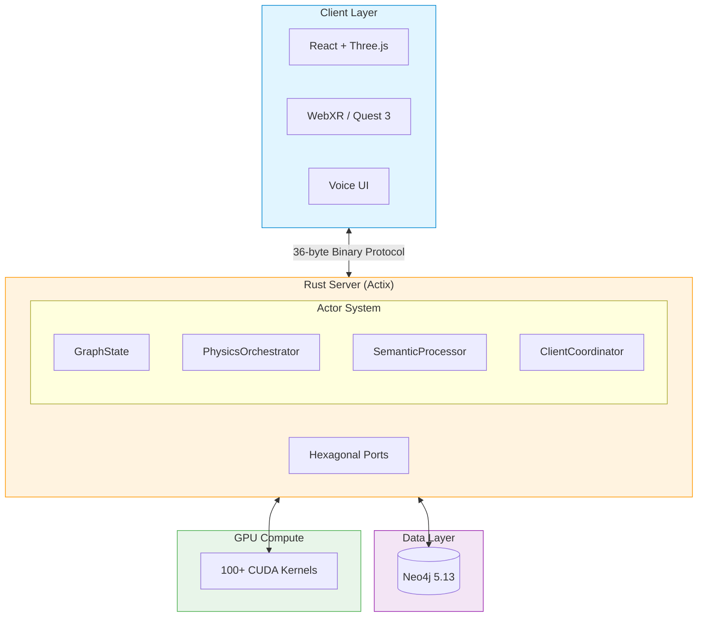
```mermaid
flowchart TB
    subgraph Client["Client Layer"]
        React["React + Three.js"]
        WebXR["WebXR / Quest 3"]
        Voice["Voice UI"]
    end

    subgraph Server["Rust Server (Actix)"]
        subgraph Actors["Actor System"]
            GS["GraphState"]
            PO["PhysicsOrchestrator"]
            SP["SemanticProcessor"]
            CC["ClientCoordinator"]
        end
        HP["Hexagonal Ports"]
    end

    subgraph Data["Data Layer"]
        Neo4j[(Neo4j 5.13)]
    end

    subgraph GPU["GPU Compute"]
        CUDA["100+ CUDA Kernels"]
    end

    Client <-->|"36-byte Binary Protocol"| Server
    Server <--> Neo4j
    Server <--> CUDA

    style Client fill:#e1f5ff,stroke:#0288d1
    style Server fill:#fff3e0,stroke:#ff9800
    style Data fill:#f3e5f5,stroke:#9c27b0
    style GPU fill:#e8f5e9,stroke:#4caf50
```
---

## Source: DOCKER-SETUP.md (Diagram 1)

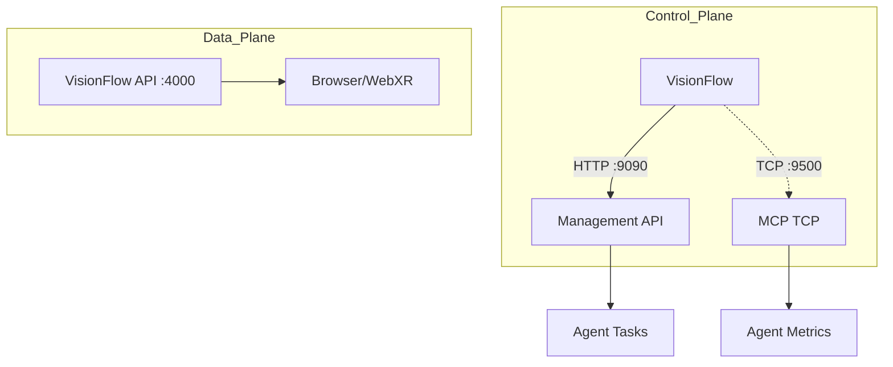
```mermaid
graph TB
    subgraph Control_Plane
        VF[VisionFlow] -->|HTTP :9090| MGMT[Management API]
        VF -.TCP :9500.-> MCP[MCP TCP]
    end
    subgraph Data_Plane
        VFAPI[VisionFlow API :4000] --> Clients[Browser/WebXR]
    end
    MGMT --> Agents[Agent Tasks]
    MCP --> Telemetry[Agent Metrics]
```
---

## Source: docs/README.md (Diagram 1)

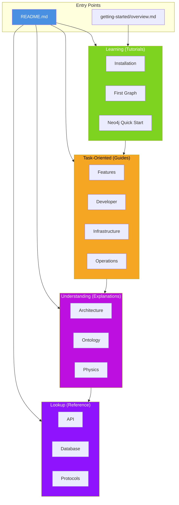
```mermaid
graph TB
    subgraph Entry["Entry Points"]
        README["README.md"]
        OVERVIEW["getting-started/overview.md"]
    end

    subgraph Learning["Learning (Tutorials)"]
        T1["Installation"]
        T2["First Graph"]
        T3["Neo4j Quick Start"]
    end

    subgraph Tasks["Task-Oriented (Guides)"]
        G1["Features"]
        G2["Developer"]
        G3["Infrastructure"]
        G4["Operations"]
    end

    subgraph Understanding["Understanding (Explanations)"]
        E1["Architecture"]
        E2["Ontology"]
        E3["Physics"]
    end

    subgraph Lookup["Lookup (Reference)"]
        R1["API"]
        R2["Database"]
        R3["Protocols"]
    end

    README --> Learning
    README --> Tasks
    README --> Understanding
    README --> Lookup
    OVERVIEW --> Learning

    Learning --> Tasks
    Tasks --> Understanding
    Understanding --> Lookup

    style README fill:#4A90E2,color:#fff
    style Learning fill:#7ED321,color:#fff
    style Tasks fill:#F5A623,color:#000
    style Understanding fill:#BD10E0,color:#fff
    style Lookup fill:#9013FE,color:#fff
```
---

## Source: docs/CONTRIBUTING.md (Diagram 1)

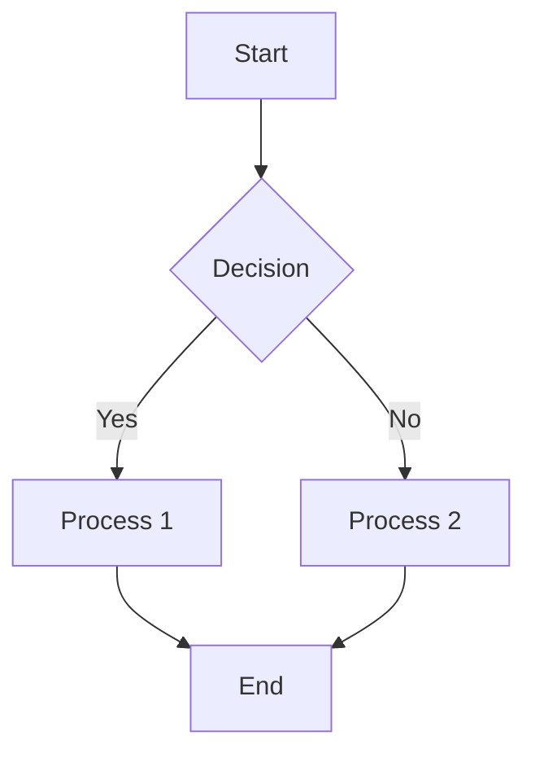
```mermaid
flowchart TD
    A[Start] --> B{Decision}
    B -->|Yes| C[Process 1]
    B -->|No| D[Process 2]
    C --> E[End]
    D --> E
```
## Source: docs/CONTRIBUTING.md (Diagram 2)

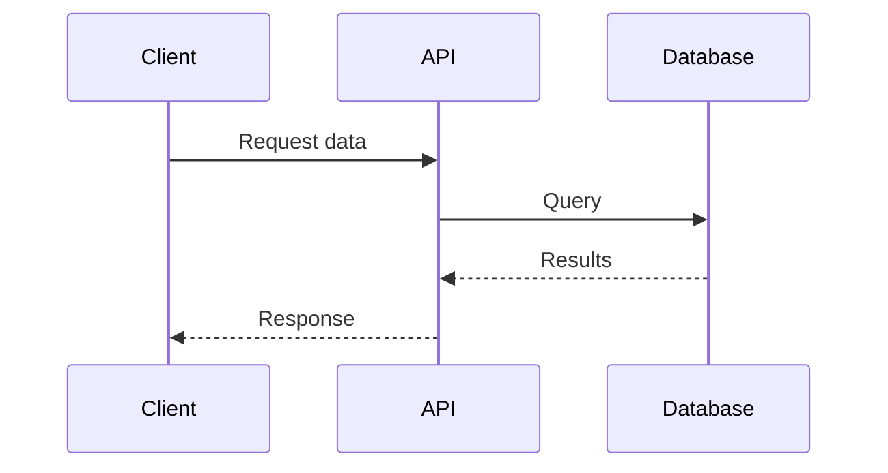
```mermaid
sequenceDiagram
    participant Client
    participant API
    participant Database

    Client->>API: Request data
    API->>Database: Query
    Database-->>API: Results
    API-->>Client: Response
```
## Source: docs/CONTRIBUTING.md (Diagram 3)

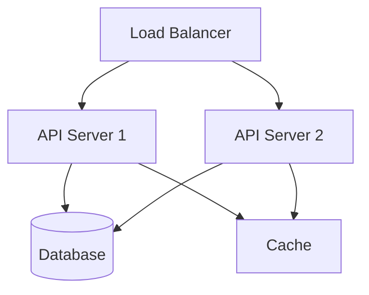
```mermaid
graph TD
    A[Load Balancer] --> B[API Server 1]
    A --> C[API Server 2]
    B --> D[(Database)]
    C --> D
    B --> E[Cache]
    C --> E
```
## Source: docs/CONTRIBUTING.md (Diagram 4)

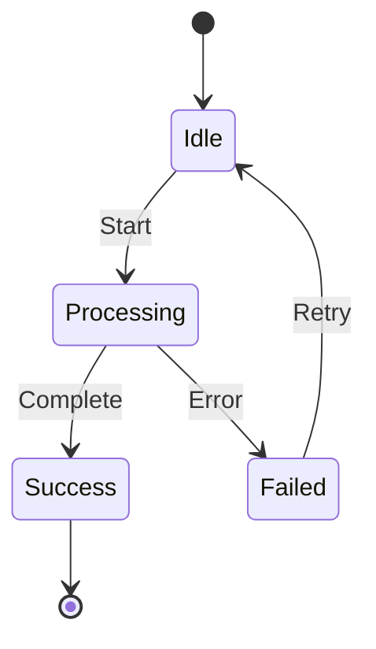
```mermaid
stateDiagram-v2
    [*] --> Idle
    Idle --> Processing: Start
    Processing --> Success: Complete
    Processing --> Failed: Error
    Success --> [*]
    Failed --> Idle: Retry
```
---

---

---

---

## Source: client/TELEMETRY-STREAM-INTEGRATION.md (Diagram 1)

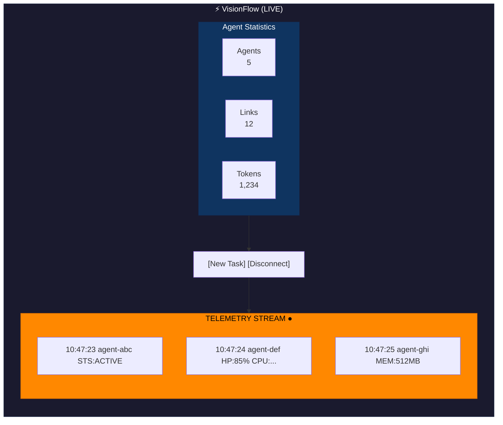
```mermaid
flowchart TB
    subgraph ControlPanel["⚡ VisionFlow (LIVE)"]
        direction TB
        subgraph StatsGrid["Agent Statistics"]
            direction LR
            Agents["Agents<br/>5"]
            Links["Links<br/>12"]
            Tokens["Tokens<br/>1,234"]
        end
        Controls["[New Task] [Disconnect]"]
        subgraph Telemetry["TELEMETRY STREAM ●"]
            direction TB
            Log1["10:47:23 agent-abc STS:ACTIVE"]
            Log2["10:47:24 agent-def HP:85% CPU:..."]
            Log3["10:47:25 agent-ghi MEM:512MB"]
        end
    end

    StatsGrid --> Controls
    Controls --> Telemetry

    style ControlPanel fill:#1a1a2e,stroke:#16213e,color:#fff
    style StatsGrid fill:#0f3460,stroke:#16213e,color:#fff
    style Telemetry fill:#ff8800,stroke:#cc6600,color:#000
```
---

## Source: docs/explanation/system-overview.md (Diagram 1)

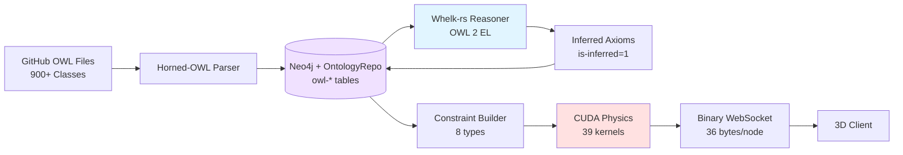
```mermaid
graph LR
    A[GitHub OWL Files<br/>900+ Classes] --> B[Horned-OWL Parser]
    B --> C[(Neo4j + OntologyRepo<br/>owl-* tables)]
    C --> D[Whelk-rs Reasoner<br/>OWL 2 EL]
    D --> E[Inferred Axioms<br/>is-inferred=1]
    E --> C
    C --> F[Constraint Builder<br/>8 types]
    F --> G[CUDA Physics<br/>39 kernels]
    G --> H[Binary WebSocket<br/>36 bytes/node]
    H --> I[3D Client]

    style D fill:#e1f5ff
    style G fill:#ffe1e1
    style C fill:#f0e1ff
```
## Source: docs/explanation/system-overview.md (Diagram 2)

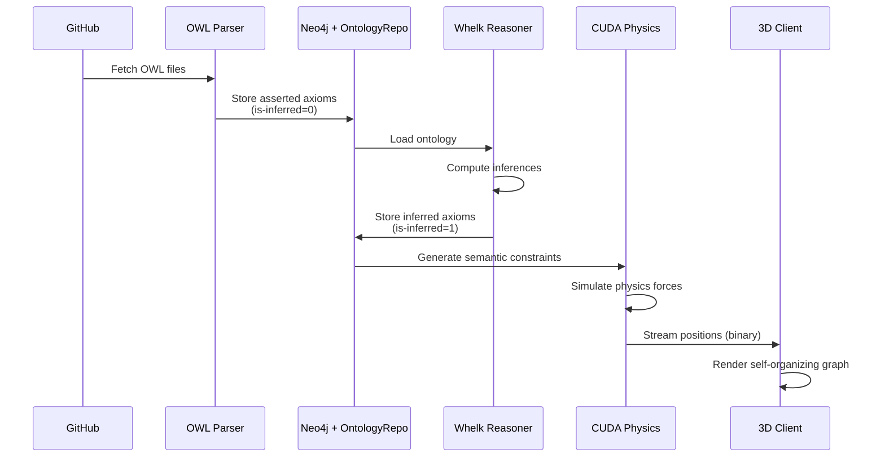
```mermaid
sequenceDiagram
    participant GH as GitHub
    participant Parser as OWL Parser
    participant DB as Neo4j + OntologyRepo
    participant Whelk as Whelk Reasoner
    participant GPU as CUDA Physics
    participant Client as 3D Client

    GH->>Parser: Fetch OWL files
    Parser->>DB: Store asserted axioms<br/>(is-inferred=0)
    DB->>Whelk: Load ontology
    Whelk->>Whelk: Compute inferences
    Whelk->>DB: Store inferred axioms<br/>(is-inferred=1)
    DB->>GPU: Generate semantic constraints
    GPU->>GPU: Simulate physics forces
    GPU->>Client: Stream positions (binary)
    Client->>Client: Render self-organizing graph
```
## Source: docs/explanation/system-overview.md (Diagram 3)

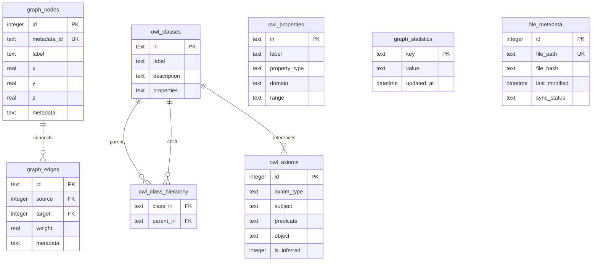
```mermaid
erDiagram
    graph_nodes ||--o{ graph_edges : "connects"
    graph_nodes {
        integer id PK
        text metadata_id UK
        text label
        real x
        real y
        real z
        text metadata
    }

    graph_edges {
        text id PK
        integer source FK
        integer target FK
        real weight
        text metadata
    }

    owl_classes ||--o{ owl_class_hierarchy : "parent"
    owl_classes ||--o{ owl_class_hierarchy : "child"
    owl_classes ||--o{ owl_axioms : "references"

    owl_classes {
        text iri PK
        text label
        text description
        text properties
    }

    owl_class_hierarchy {
        text class_iri FK
        text parent_iri FK
    }

    owl_properties {
        text iri PK
        text label
        text property_type
        text domain
        text range
    }

    owl_axioms {
        integer id PK
        text axiom_type
        text subject
        text predicate
        text object
        integer is_inferred
    }

    graph_statistics {
        text key PK
        text value
        datetime updated_at
    }

    file_metadata {
        integer id PK
        text file_path UK
        text file_hash
        datetime last_modified
        text sync_status
    }
```
## Source: docs/explanation/system-overview.md (Diagram 4)

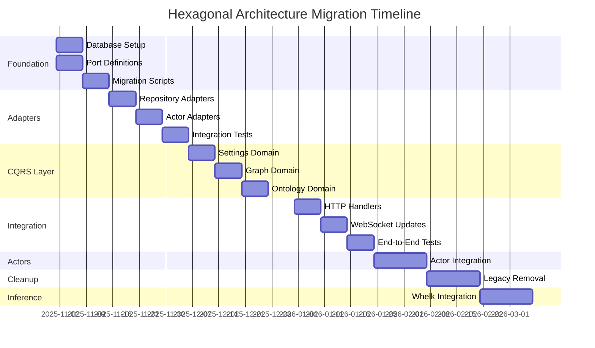
```mermaid
gantt
    title Hexagonal Architecture Migration Timeline
    dateFormat YYYY-MM-DD
    section Foundation
    Database Setup           :2025-11-01, 7d
    Port Definitions         :2025-11-01, 7d
    Migration Scripts        :2025-11-08, 7d
    section Adapters
    Repository Adapters      :2025-11-15, 7d
    Actor Adapters          :2025-11-22, 7d
    Integration Tests       :2025-11-29, 7d
    section CQRS Layer
    Settings Domain         :2025-12-06, 7d
    Graph Domain           :2025-12-13, 7d
    Ontology Domain        :2025-12-20, 7d
    section Integration
    HTTP Handlers          :2026-01-03, 7d
    WebSocket Updates      :2026-01-10, 7d
    End-to-End Tests       :2026-01-17, 7d
    section Actors
    Actor Integration      :2026-01-24, 14d
    section Cleanup
    Legacy Removal         :2026-02-07, 14d
    section Inference
    Whelk Integration      :2026-02-21, 14d
```
---

---

---

---

## Source: docs/diagrams/architecture/backend-api-architecture-complete.md (Diagram 1)

```mermaid
graph TB
    subgraph "External Access Points"
        SSH[SSH Port 2222]
        VNC[VNC Port 5901]
        CodeServer[code-server Port 8080]
        ManagementPort[Management API Port 9090]
        ZaiInternal[Z.AI Port 9600 Internal Only]
    end

    subgraph "Supervisord Service Manager"
        DBUS[dbus Service<br/>Priority: 10<br/>User: root]
        SSHD[sshd Service<br/>Priority: 50<br/>User: root]
        XVNC[xvnc Service<br/>Priority: 100<br/>User: devuser]
        XFCE4[xfce4 Service<br/>Priority: 200<br/>User: devuser]
        ManagementAPI[Management API Service<br/>Priority: 300<br/>User: devuser<br/>Port: 9090]
        CodeSrv[code-server Service<br/>Priority: 400<br/>User: devuser<br/>Port: 8080]
        ClaudeZai[claude-zai Service<br/>Priority: 500<br/>User: zai-user<br/>Port: 9600]
        GeminiFlow[gemini-flow Service<br/>Priority: 600<br/>User: gemini-user]
        TmuxAuto[tmux-autostart Service<br/>Priority: 900<br/>User: devuser]
    end

    subgraph "Multi-User Isolation System"
        DevUser[devuser UID:1000<br/>Primary Development<br/>Claude Code Access<br/>Full sudo privileges]
        GeminiUser[gemini-user UID:1001<br/>Google Gemini Tools<br/>Isolated credentials<br/>Switch: as-gemini]
        OpenAIUser[openai-user UID:1002<br/>OpenAI Tools<br/>Isolated credentials<br/>Switch: as-openai]
        ZaiUser[zai-user UID:1003<br/>Z.AI Service Only<br/>Cost-effective API<br/>Switch: as-zai]
    end

    subgraph "Management API Fastify Application"
        FastifyCore[Fastify Core<br/>server.js<br/>Port: 9090<br/>Host: 0.0.0.0]

        subgraph "Middleware Stack"
            CORS[CORS Middleware<br/>@fastify/cors<br/>Origin: true<br/>Credentials: true]
            WS[WebSocket Support<br/>@fastify/websocket]
            RateLimit[Rate Limiting<br/>100 req/min<br/>Whitelist: 127.0.0.1]
            Auth[Auth Middleware<br/>X-API-Key Header<br/>Exempt: health, metrics]
            Metrics[Metrics Tracking<br/>onRequest/onResponse<br/>Prometheus format]
        end

        subgraph "API Routes"
            TaskRoutes[Task Routes<br/>routes/tasks.js<br/>POST /v1/tasks<br/>GET /v1/tasks/:id<br/>GET /v1/tasks<br/>DELETE /v1/tasks/:id]
            StatusRoutes[Status Routes<br/>routes/status.js<br/>GET /v1/status<br/>GET /health<br/>GET /ready]
            ComfyUIRoutes[ComfyUI Routes<br/>routes/comfyui.js<br/>POST /v1/comfyui/workflow<br/>GET /v1/comfyui/workflow/:id<br/>DELETE /v1/comfyui/workflow/:id<br/>GET /v1/comfyui/models<br/>GET /v1/comfyui/outputs<br/>WS /v1/comfyui/stream]
            MetricsRoute[Metrics Endpoint<br/>GET /metrics<br/>Prometheus format<br/>No auth required]
            RootRoute[Root Endpoint<br/>GET /<br/>API information<br/>Endpoint listing]
        end

        subgraph "Manager Classes"
            ProcessMgr[ProcessManager<br/>utils/process-manager.js<br/>Task execution<br/>Process lifecycle<br/>Cleanup old tasks]
            SystemMon[SystemMonitor<br/>utils/system-monitor.js<br/>CPU/Memory monitoring<br/>Service status<br/>Health checks]
            ComfyUIMgr[ComfyUIManager<br/>utils/comfyui-manager.js<br/>Workflow submission<br/>Model management<br/>Output retrieval<br/>WebSocket streaming]
            MetricsUtil[Metrics Utility<br/>utils/metrics.js<br/>prom-client<br/>HTTP metrics<br/>Error tracking<br/>Custom counters/gauges]
        end

        subgraph "OpenAPI Documentation"
            Swagger[Swagger/OpenAPI<br/>@fastify/swagger<br/>Version: 3.0.0]
            SwaggerUI[Swagger UI<br/>@fastify/swagger-ui<br/>Route: /docs<br/>Interactive API docs]
        end
    end

    subgraph "Z.AI Service Express Application"
        ExpressCore[Express Core<br/>server.js<br/>Port: 9600<br/>User: zai-user<br/>Internal Only]

        subgraph "Z.AI Worker Pool"
            WorkerPool[Claude Worker Pool<br/>Size: 4 concurrent<br/>Max Queue: 50<br/>Configurable via env]
            AnthropicAPI[Anthropic API Client<br/>Base URL: z.ai<br/>Timeout: 30s<br/>Cost-effective calls]
        end

        subgraph "Z.AI Endpoints"
            ChatEndpoint[POST /chat<br/>Body: prompt, timeout<br/>Worker pool distribution]
            HealthEndpoint[GET /health<br/>Worker status<br/>Queue length<br/>Uptime metrics]
        end
    end

    subgraph "MCP Infrastructure"
        MCPConfig[MCP Configuration<br/>mcp-infrastructure/mcp.json<br/>Server definitions<br/>Tool registrations]

        subgraph "MCP Servers"
            WebSummary[web-summary MCP<br/>skills/web-summary/mcp-server<br/>YouTube transcripts<br/>Web summarization<br/>Uses Z.AI internally]
            ComfyUIMCP[comfyui MCP<br/>skills/comfyui/mcp-server<br/>Image generation<br/>Workflow management<br/>Node.js based]
            PlaywrightMCP[playwright MCP<br/>skills/playwright/mcp-server<br/>Browser automation<br/>Web scraping<br/>E2E testing]
            ImageMagickMCP[imagemagick MCP<br/>skills/imagemagick/mcp-server<br/>Image processing<br/>Format conversion]
            QGISMCP[qgis MCP<br/>skills/qgis/mcp-server<br/>GIS operations<br/>Geospatial analysis]
        end
    end

    subgraph "Static HTML Visualizations"
        WardleyMap[Wardley Map Viewer<br/>skills/wardley-maps/<br/>examples/visionflow_wardley_map.html<br/>SVG visualization<br/>Interactive components<br/>Export: SVG/PNG]
        AlgoArt[Algorithmic Art Viewer<br/>skills/algorithmic-art/<br/>templates/viewer.html<br/>Canvas rendering<br/>WebGL support]
    end

    subgraph "Configuration Files"
        EnvFile[.env File<br/>ANTHROPIC_API_KEY<br/>GOOGLE_GEMINI_API_KEY<br/>OPENAI_API_KEY<br/>ANTHROPIC_BASE_URL=z.ai<br/>GITHUB_TOKEN<br/>MANAGEMENT_API_KEY]
        SupervisordConf[supervisord.unified.conf<br/>Service definitions<br/>Priority ordering<br/>User assignments<br/>Log locations]
        RouterConfig[router.config.json<br/>Routing rules<br/>Service discovery]
        GeminiConfig[gemini-flow.config.ts<br/>Gemini orchestration<br/>A2A/MCP protocols]
    end

    subgraph "Tmux Workspace 8 Windows"
        Window0[Window 0: Claude-Main<br/>Primary workspace]
        Window1[Window 1: Claude-Agent<br/>Agent execution]
        Window2[Window 2: Services<br/>supervisorctl monitoring]
        Window3[Window 3: Development<br/>Python/Rust/CUDA dev]
        Window4[Window 4: Logs<br/>Service logs split panes]
        Window5[Window 5: System<br/>htop monitoring]
        Window6[Window 6: VNC-Status<br/>VNC connection info]
        Window7[Window 7: SSH-Shell<br/>General shell]
    end

    subgraph "Data Flow Patterns"
        ClientReq[External API Request<br/>HTTP/WebSocket]
        InternalCall[Internal Service Call<br/>Z.AI, MCP servers]
        ProcessExec[Process Execution<br/>Task spawning<br/>Shell commands]
        MetricsExport[Metrics Export<br/>Prometheus scraping]
    end

    %% External connections
    SSH --> SSHD
    VNC --> XVNC
    CodeServer --> CodeSrv
    ManagementPort --> ManagementAPI

    %% Supervisord manages all services
    SSHD -.-> DevUser
    XVNC -.-> DevUser
    CodeSrv -.-> DevUser
    ManagementAPI -.-> DevUser
    ClaudeZai -.-> ZaiUser
    GeminiFlow -.-> GeminiUser
    TmuxAuto -.-> DevUser

    %% Management API internal structure
    ManagementAPI --> FastifyCore
    FastifyCore --> CORS
    FastifyCore --> WS
    FastifyCore --> RateLimit
    FastifyCore --> Auth
    FastifyCore --> Metrics

    FastifyCore --> TaskRoutes
    FastifyCore --> StatusRoutes
    FastifyCore --> ComfyUIRoutes
    FastifyCore --> MetricsRoute
    FastifyCore --> RootRoute

    TaskRoutes --> ProcessMgr
    StatusRoutes --> SystemMon
    StatusRoutes --> ProcessMgr
    ComfyUIRoutes --> ComfyUIMgr

    ProcessMgr --> MetricsUtil
    SystemMon --> MetricsUtil
    ComfyUIMgr --> MetricsUtil
    MetricsRoute --> MetricsUtil

    FastifyCore --> Swagger
    Swagger --> SwaggerUI

    %% Z.AI Service structure
    ClaudeZai --> ExpressCore
    ExpressCore --> WorkerPool
    WorkerPool --> AnthropicAPI
    ExpressCore --> ChatEndpoint
    ExpressCore --> HealthEndpoint

    %% MCP Infrastructure
    MCPConfig --> WebSummary
    MCPConfig --> ComfyUIMCP
    MCPConfig --> PlaywrightMCP
    MCPConfig --> ImageMagickMCP
    MCPConfig --> QGISMCP

    WebSummary -.Internal API Call.-> ExpressCore
    ComfyUIRoutes -.Manages.-> ComfyUIMCP

    %% Configuration files
    EnvFile -.Loaded by.-> FastifyCore
    EnvFile -.Loaded by.-> ExpressCore
    EnvFile -.Loaded by.-> GeminiFlow
    SupervisordConf -.Configures.-> DBUS
    SupervisordConf -.Configures.-> SSHD
    SupervisordConf -.Configures.-> XVNC
    SupervisordConf -.Configures.-> ManagementAPI
    SupervisordConf -.Configures.-> ClaudeZai
    SupervisordConf -.Configures.-> GeminiFlow

    %% Data flows
    ClientReq --> FastifyCore
    InternalCall --> ExpressCore
    ProcessExec --> ProcessMgr
    MetricsExport --> MetricsUtil

    %% Tmux workspace
    TmuxAuto --> Window0
    TmuxAuto --> Window1
    TmuxAuto --> Window2
    TmuxAuto --> Window3
    TmuxAuto --> Window4
    TmuxAuto --> Window5
    TmuxAuto --> Window6
    TmuxAuto --> Window7

    %% Styling
    classDef externalPort fill:#e74c3c,stroke:#c0392b,color:#fff
    classDef service fill:#3498db,stroke:#2980b9,color:#fff
    classDef user fill:#f39c12,stroke:#e67e22,color:#fff
    classDef middleware fill:#9b59b6,stroke:#8e44ad,color:#fff
    classDef route fill:#1abc9c,stroke:#16a085,color:#fff
    classDef manager fill:#2ecc71,stroke:#27ae60,color:#fff
    classDef config fill:#95a5a6,stroke:#7f8c8d,color:#fff
    classDef mcp fill:#e67e22,stroke:#d35400,color:#fff
    classDef viz fill:#34495e,stroke:#2c3e50,color:#fff
    classDef tmux fill:#16a085,stroke:#138d75,color:#fff

    class SSH,VNC,CodeServer,ManagementPort,ZaiInternal externalPort
    class DBUS,SSHD,XVNC,XFCE4,ManagementAPI,CodeSrv,ClaudeZai,GeminiFlow,TmuxAuto service
    class DevUser,GeminiUser,OpenAIUser,ZaiUser user
    class CORS,WS,RateLimit,Auth,Metrics middleware
    class TaskRoutes,StatusRoutes,ComfyUIRoutes,MetricsRoute,RootRoute,ChatEndpoint,HealthEndpoint route
    class ProcessMgr,SystemMon,ComfyUIMgr,MetricsUtil,WorkerPool,AnthropicAPI manager
    class EnvFile,SupervisordConf,RouterConfig,GeminiConfig,MCPConfig config
    class WebSummary,ComfyUIMCP,PlaywrightMCP,ImageMagickMCP,QGISMCP mcp
    class WardleyMap,AlgoArt viz
    class Window0,Window1,Window2,Window3,Window4,Window5,Window6,Window7 tmux
```
## Source: docs/diagrams/architecture/backend-api-architecture-complete.md (Diagram 2)

```mermaid
sequenceDiagram
    participant Client as External Client
    participant Nginx as Reverse Proxy Optional
    participant Fastify as Fastify Server
    participant Auth as Auth Middleware
    participant RateLimit as Rate Limiter
    participant Route as API Route Handler
    participant Manager as Manager Class
    participant Process as Child Process
    participant Metrics as Metrics Collector
    participant Prometheus as Prometheus Scraper

    Client->>Fastify: HTTP Request<br/>POST /v1/tasks

    activate Fastify
    Fastify->>Fastify: onRequest Hook<br/>Record start time

    alt Not health/ready/metrics endpoint
        Fastify->>Auth: Check X-API-Key header
        Auth-->>Fastify: Authorized
    else Health/metrics endpoint
        Fastify->>Fastify: Skip auth
    end

    Fastify->>RateLimit: Check rate limit<br/>100 req/min
    alt Rate limit exceeded
        RateLimit-->>Client: 429 Too Many Requests
    else Within limit
        RateLimit->>Route: Forward to route handler

        activate Route
        Route->>Manager: Execute task

        activate Manager
        Manager->>Process: Spawn child process
        activate Process
        Process-->>Manager: Process ID, stdout/stderr
        deactivate Process
        Manager-->>Route: Task created<br/>taskId, status
        deactivate Manager

        Route-->>Fastify: Response object
        deactivate Route
    end

    Fastify->>Fastify: onResponse Hook<br/>Calculate duration
    Fastify->>Metrics: Record metrics<br/>method, path, status, duration
    Metrics-->>Fastify: Metric recorded

    Fastify-->>Client: 201 Created<br/>{ taskId, status }
    deactivate Fastify

    Note over Prometheus,Metrics: Async scraping
    Prometheus->>Metrics: GET /metrics
    Metrics-->>Prometheus: Prometheus text format<br/>http_requests_total<br/>http_request_duration_seconds
```
## Source: docs/diagrams/architecture/backend-api-architecture-complete.md (Diagram 3)

```mermaid
graph TB
    subgraph "Z.AI Service Port 9600 - zai-user"
        ExpressServer[Express Server<br/>POST /chat<br/>GET /health]

        subgraph "Worker Pool Manager"
            Queue[Request Queue<br/>Max: 50 requests<br/>FIFO ordering]

            subgraph "Worker Pool Size=4"
                Worker1[Worker 1<br/>Idle/Busy/Processing]
                Worker2[Worker 2<br/>Idle/Busy/Processing]
                Worker3[Worker 3<br/>Idle/Busy/Processing]
                Worker4[Worker 4<br/>Idle/Busy/Processing]
            end

            Dispatcher[Worker Dispatcher<br/>Assigns requests<br/>Load balancing]
        end

        subgraph "Anthropic Client"
            ZaiClient[Z.AI HTTP Client<br/>Base URL: z.ai<br/>Timeout: 30s]
            TokenTracking[Token Usage Tracking<br/>Cost calculation<br/>Rate limiting]
        end
    end

    subgraph "Internal Callers"
        WebSummarySkill[web-summary MCP<br/>YouTube transcripts<br/>Web summaries]
        ManualCurl[Manual curl requests<br/>From container]
        OtherSkills[Other MCP servers<br/>Future integrations]
    end

    subgraph "External API"
        ZaiAPI[Z.AI API<br/>https://api.z.ai/api/anthropic<br/>Claude models<br/>Cost-effective billing]
    end

    WebSummarySkill -->|POST /chat| ExpressServer
    ManualCurl -->|POST /chat| ExpressServer
    OtherSkills -->|POST /chat| ExpressServer

    ExpressServer --> Queue

    Queue --> Dispatcher
    Dispatcher -->|Assign| Worker1
    Dispatcher -->|Assign| Worker2
    Dispatcher -->|Assign| Worker3
    Dispatcher -->|Assign| Worker4

    Worker1 --> ZaiClient
    Worker2 --> ZaiClient
    Worker3 --> ZaiClient
    Worker4 --> ZaiClient

    ZaiClient --> TokenTracking
    TokenTracking --> ZaiAPI

    ZaiAPI -->|Response| ZaiClient
    ZaiClient -->|Result| Worker1
    ZaiClient -->|Result| Worker2
    ZaiClient -->|Result| Worker3
    ZaiClient -->|Result| Worker4

    Worker1 -->|Complete| ExpressServer
    Worker2 -->|Complete| ExpressServer
    Worker3 -->|Complete| ExpressServer
    Worker4 -->|Complete| ExpressServer

    ExpressServer -->|JSON response| WebSummarySkill
    ExpressServer -->|JSON response| ManualCurl
    ExpressServer -->|JSON response| OtherSkills

    classDef express fill:#8e44ad,stroke:#6c3483,color:#fff
    classDef worker fill:#2ecc71,stroke:#27ae60,color:#fff
    classDef queue fill:#e67e22,stroke:#d35400,color:#fff
    classDef external fill:#3498db,stroke:#2980b9,color:#fff
    classDef caller fill:#f39c12,stroke:#e67e22,color:#fff

    class ExpressServer,Dispatcher,ZaiClient,TokenTracking express
    class Worker1,Worker2,Worker3,Worker4 worker
    class Queue queue
    class ZaiAPI external
    class WebSummarySkill,ManualCurl,OtherSkills caller
```
## Source: docs/diagrams/architecture/backend-api-architecture-complete.md (Diagram 4)

```mermaid
graph LR
    subgraph "Claude Code / Client"
        ClaudeCode[Claude Code<br/>Main process]
        MCPClient[MCP Client SDK<br/>@modelcontextprotocol/sdk]
    end

    subgraph "MCP Configuration"
        MCPJson[mcp.json<br/>Server registry<br/>Communication methods]
    end

    subgraph "MCP Servers - stdio Communication"
        WebSummaryServer[web-summary Server<br/>Node.js<br/>stdio pipes<br/>Calls Z.AI internally]
        ImageMagickServer[imagemagick Server<br/>Node.js<br/>stdio pipes<br/>CLI wrapper]
    end

    subgraph "MCP Servers - Socket Communication"
        BlenderServer[blender Server<br/>Python<br/>Socket: 2800<br/>3D operations]
        QGISServer[qgis Server<br/>Python<br/>Socket: 2801<br/>GIS operations]
    end

    subgraph "MCP Servers - HTTP/REST"
        ComfyUIServer[comfyui Server<br/>Node.js<br/>REST endpoints<br/>Workflow management]
        PlaywrightServer[playwright Server<br/>Node.js<br/>WebSocket + REST<br/>Browser automation]
    end

    subgraph "Backend Services Called by MCP"
        ZaiService[Z.AI Service<br/>Port 9600<br/>Internal only]
        ComfyUIBackend[ComfyUI Backend<br/>Management API<br/>/v1/comfyui/*]
    end

    ClaudeCode --> MCPClient
    MCPClient --> MCPJson

    MCPJson -.stdio.-> WebSummaryServer
    MCPJson -.stdio.-> ImageMagickServer
    MCPJson -.socket:2800.-> BlenderServer
    MCPJson -.socket:2801.-> QGISServer
    MCPJson -.HTTP/REST.-> ComfyUIServer
    MCPJson -.WebSocket.-> PlaywrightServer

    WebSummaryServer -->|Internal HTTP| ZaiService
    ComfyUIServer -->|REST API| ComfyUIBackend

    classDef client fill:#e74c3c,stroke:#c0392b,color:#fff
    classDef config fill:#95a5a6,stroke:#7f8c8d,color:#fff
    classDef mcpStdio fill:#3498db,stroke:#2980b9,color:#fff
    classDef mcpSocket fill:#f39c12,stroke:#e67e22,color:#fff
    classDef mcpHttp fill:#9b59b6,stroke:#8e44ad,color:#fff
    classDef backend fill:#2ecc71,stroke:#27ae60,color:#fff

    class ClaudeCode,MCPClient client
    class MCPJson config
    class WebSummaryServer,ImageMagickServer mcpStdio
    class BlenderServer,QGISServer mcpSocket
    class ComfyUIServer,PlaywrightServer mcpHttp
    class ZaiService,ComfyUIBackend backend
```
## Source: docs/diagrams/architecture/backend-api-architecture-complete.md (Diagram 5)

```mermaid
graph TB
    subgraph "Client Applications"
        ClaudeCodeClient[Claude Code<br/>MCP Client]
        DirectAPI[Direct API Client<br/>curl/Postman/scripts]
    end

    subgraph "Management API ComfyUI Routes"
        ComfyUIRoute[routes/comfyui.js<br/>Fastify routes]

        subgraph "Endpoints"
            SubmitWorkflow[POST /v1/comfyui/workflow<br/>Submit workflow JSON<br/>Returns workflowId]
            GetStatus[GET /v1/comfyui/workflow/:id<br/>Check workflow status<br/>progress, outputs]
            CancelWorkflow[DELETE /v1/comfyui/workflow/:id<br/>Cancel running workflow]
            ListModels[GET /v1/comfyui/models<br/>Available models<br/>checkpoints, loras]
            GetOutputs[GET /v1/comfyui/outputs<br/>List generated files<br/>images, videos]
            StreamWS[WS /v1/comfyui/stream<br/>Real-time progress<br/>Node execution updates]
        end
    end

    subgraph "ComfyUI Manager"
        Manager[utils/comfyui-manager.js]

        subgraph "Manager Responsibilities"
            WorkflowQueue[Workflow Queue<br/>FIFO execution<br/>Concurrent limit]
            StatusTracking[Status Tracking<br/>pending/running/complete<br/>error handling]
            OutputMgmt[Output Management<br/>File retrieval<br/>Cleanup old outputs]
            WSBroadcast[WebSocket Broadcast<br/>Progress events<br/>Client notifications]
        end
    end

    subgraph "ComfyUI Backend Service"
        ComfyUIProcess[ComfyUI Python Process<br/>Stable Diffusion<br/>FLUX models<br/>Custom nodes]

        subgraph "ComfyUI Components"
            WorkflowEngine[Workflow Engine<br/>JSON workflow parser<br/>Node execution]
            ModelLoader[Model Loader<br/>Checkpoints<br/>LoRAs, VAEs]
            GPUExecution[GPU Execution<br/>CUDA acceleration<br/>Batch processing]
            OutputSaver[Output Saver<br/>PNG, JPG, MP4<br/>Metadata embedding]
        end
    end

    subgraph "Storage"
        ModelStorage[Model Storage<br/>/models/<br/>checkpoints/<br/>loras/<br/>vae/]
        OutputStorage[Output Storage<br/>/output/<br/>images/<br/>videos/<br/>temp/]
        WorkflowStorage[Workflow Storage<br/>/workflows/<br/>JSON definitions<br/>presets/]
    end

    subgraph "Metrics & Monitoring"
        ComfyMetrics[ComfyUI Metrics<br/>workflow_duration<br/>gpu_utilization<br/>queue_length<br/>output_file_size]
    end

    ClaudeCodeClient -->|MCP call| ComfyUIRoute
    DirectAPI -->|HTTP/WS| ComfyUIRoute

    ComfyUIRoute --> SubmitWorkflow
    ComfyUIRoute --> GetStatus
    ComfyUIRoute --> CancelWorkflow
    ComfyUIRoute --> ListModels
    ComfyUIRoute --> GetOutputs
    ComfyUIRoute --> StreamWS

    SubmitWorkflow --> Manager
    GetStatus --> Manager
    CancelWorkflow --> Manager
    ListModels --> Manager
    GetOutputs --> Manager
    StreamWS --> Manager

    Manager --> WorkflowQueue
    Manager --> StatusTracking
    Manager --> OutputMgmt
    Manager --> WSBroadcast

    WorkflowQueue -->|Execute| ComfyUIProcess
    ComfyUIProcess --> WorkflowEngine
    WorkflowEngine --> ModelLoader
    ModelLoader --> GPUExecution
    GPUExecution --> OutputSaver

    ModelLoader -.Load models.-> ModelStorage
    OutputSaver -.Save files.-> OutputStorage
    WorkflowEngine -.Load workflows.-> WorkflowStorage

    ComfyUIProcess -->|Progress events| StatusTracking
    StatusTracking -->|Broadcast| WSBroadcast
    WSBroadcast -->|WebSocket| ClaudeCodeClient
    WSBroadcast -->|WebSocket| DirectAPI

    Manager --> ComfyMetrics
    ComfyUIProcess --> ComfyMetrics

    classDef client fill:#e74c3c,stroke:#c0392b,color:#fff
    classDef route fill:#3498db,stroke:#2980b9,color:#fff
    classDef manager fill:#9b59b6,stroke:#8e44ad,color:#fff
    classDef backend fill:#2ecc71,stroke:#27ae60,color:#fff
    classDef storage fill:#95a5a6,stroke:#7f8c8d,color:#fff
    classDef metrics fill:#f39c12,stroke:#e67e22,color:#fff

    class ClaudeCodeClient,DirectAPI client
    class ComfyUIRoute,SubmitWorkflow,GetStatus,CancelWorkflow,ListModels,GetOutputs,StreamWS route
    class Manager,WorkflowQueue,StatusTracking,OutputMgmt,WSBroadcast manager
    class ComfyUIProcess,WorkflowEngine,ModelLoader,GPUExecution,OutputSaver backend
    class ModelStorage,OutputStorage,WorkflowStorage storage
    class ComfyMetrics metrics
```
## Source: docs/diagrams/architecture/backend-api-architecture-complete.md (Diagram 6)

```mermaid
sequenceDiagram
    participant Client as External Client
    participant Fastify as Fastify Server
    participant AuthMW as Auth Middleware<br/>middleware/auth.js
    participant Handler as Route Handler
    participant APIKey as Environment<br/>MANAGEMENT_API_KEY

    Client->>Fastify: HTTP Request<br/>X-API-Key: abc123

    activate Fastify
    Fastify->>Fastify: onRequest Hook triggered

    alt Exempt endpoint (/health, /ready, /metrics)
        Fastify->>Handler: Skip auth, forward to handler
        Handler-->>Client: Response
    else Protected endpoint
        Fastify->>AuthMW: Check authentication

        activate AuthMW
        AuthMW->>AuthMW: Extract X-API-Key header

        alt Header missing
            AuthMW-->>Client: 401 Unauthorized<br/>Missing API Key
        else Header present
            AuthMW->>APIKey: Compare with expected key

            alt Key invalid
                AuthMW-->>Client: 403 Forbidden<br/>Invalid API Key
            else Key valid
                AuthMW->>Handler: Authorized, proceed
                deactivate AuthMW

                activate Handler
                Handler->>Handler: Execute business logic
                Handler-->>Fastify: Response data
                deactivate Handler

                Fastify-->>Client: 200 OK + Response
            end
        end
    end
    deactivate Fastify

    Note over Client,APIKey: Default key: change-this-secret-key<br/>⚠️ Change in production
```
## Source: docs/diagrams/architecture/backend-api-architecture-complete.md (Diagram 7)

```mermaid
graph TD
    subgraph "Priority Level 1-50: System Services"
        DBUS[dbus<br/>Priority: 10<br/>System messaging bus]
        SSHD[sshd<br/>Priority: 50<br/>SSH server<br/>Port: 22→2222]
    end

    subgraph "Priority Level 100-200: Desktop Services"
        XVNC[xvnc<br/>Priority: 100<br/>VNC server<br/>Port: 5901]
        XFCE4[xfce4<br/>Priority: 200<br/>Desktop environment]
    end

    subgraph "Priority Level 300-400: Development Services"
        ManagementAPI[Management API<br/>Priority: 300<br/>Fastify server<br/>Port: 9090]
        CodeServer[code-server<br/>Priority: 400<br/>Web IDE<br/>Port: 8080]
    end

    subgraph "Priority Level 500-600: AI Services"
        ClaudeZai[claude-zai<br/>Priority: 500<br/>Z.AI service<br/>Port: 9600 internal<br/>User: zai-user]
        GeminiFlow[gemini-flow<br/>Priority: 600<br/>Gemini orchestration<br/>User: gemini-user]
    end

    subgraph "Priority Level 900: Workspace"
        TmuxAuto[tmux-autostart<br/>Priority: 900<br/>8-window workspace<br/>User: devuser]
    end

    %% Dependencies (higher priority starts first)
    DBUS ==>|Required by| XVNC
    DBUS ==>|Required by| XFCE4
    SSHD ==>|Allows access to| ManagementAPI
    SSHD ==>|Allows access to| CodeServer

    XVNC ==>|Required by| XFCE4
    XFCE4 ==>|Desktop for| CodeServer

    ManagementAPI ==>|Manages| ClaudeZai
    ManagementAPI ==>|Monitors| GeminiFlow

    ClaudeZai -.Used by.-> ManagementAPI
    GeminiFlow -.Coordinates.-> ManagementAPI

    TmuxAuto -.Monitors.-> ManagementAPI
    TmuxAuto -.Monitors.-> ClaudeZai
    TmuxAuto -.Monitors.-> GeminiFlow

    classDef system fill:#c0392b,stroke:#a93226,color:#fff
    classDef desktop fill:#2980b9,stroke:#21618c,color:#fff
    classDef dev fill:#27ae60,stroke:#1e8449,color:#fff
    classDef ai fill:#8e44ad,stroke:#6c3483,color:#fff
    classDef workspace fill:#d35400,stroke:#ba4a00,color:#fff

    class DBUS,SSHD system
    class XVNC,XFCE4 desktop
    class ManagementAPI,CodeServer dev
    class ClaudeZai,GeminiFlow ai
    class TmuxAuto workspace
```
## Source: docs/diagrams/architecture/backend-api-architecture-complete.md (Diagram 8)

```mermaid
graph TB
    subgraph "Metrics Collection"
        PrometheusClient[prom-client<br/>Prometheus Node.js client]

        subgraph "Metric Types"
            Counters[Counters<br/>http_requests_total<br/>errors_total<br/>tasks_created_total]
            Gauges[Gauges<br/>active_tasks<br/>queue_length<br/>worker_pool_busy]
            Histograms[Histograms<br/>http_request_duration_seconds<br/>task_execution_duration_seconds<br/>comfyui_workflow_duration_seconds]
            Summaries[Summaries<br/>request_size_bytes<br/>response_size_bytes]
        end

        subgraph "Custom Metrics"
            HTTPMetrics[HTTP Metrics<br/>method, path, status<br/>Recorded in onResponse hook]
            TaskMetrics[Task Metrics<br/>task_id, status<br/>Recorded by ProcessManager]
            ComfyMetrics[ComfyUI Metrics<br/>workflow_id, model, status<br/>Recorded by ComfyUIManager]
            ErrorMetrics[Error Metrics<br/>error_name, path<br/>Recorded in error handler]
        end
    end

    subgraph "Metrics Endpoint"
        MetricsRoute[GET /metrics<br/>No authentication<br/>Prometheus text format]
    end

    subgraph "Monitoring Tools"
        Prometheus[Prometheus Server<br/>Scraping interval: 15s<br/>Retention: 15d]
        Grafana[Grafana Dashboard<br/>Visualizations<br/>Alerts]
        AlertManager[Alert Manager<br/>Email/Slack notifications<br/>Alert routing]
    end

    subgraph "System Monitoring"
        SystemMonitor[SystemMonitor Class<br/>utils/system-monitor.js]

        subgraph "Monitored Metrics"
            CPUUsage[CPU Usage<br/>Per-core utilization<br/>Load averages]
            MemoryUsage[Memory Usage<br/>Total/Used/Free<br/>Swap usage]
            DiskUsage[Disk Usage<br/>Filesystem stats<br/>I/O metrics]
            ServiceHealth[Service Health<br/>supervisorctl status<br/>Process uptime]
        end
    end

    PrometheusClient --> Counters
    PrometheusClient --> Gauges
    PrometheusClient --> Histograms
    PrometheusClient --> Summaries

    HTTPMetrics --> Counters
    HTTPMetrics --> Histograms
    TaskMetrics --> Counters
    TaskMetrics --> Gauges
    ComfyMetrics --> Histograms
    ComfyMetrics --> Gauges
    ErrorMetrics --> Counters

    PrometheusClient --> MetricsRoute

    Prometheus -->|Scrape| MetricsRoute
    Prometheus --> Grafana
    Prometheus --> AlertManager

    SystemMonitor --> CPUUsage
    SystemMonitor --> MemoryUsage
    SystemMonitor --> DiskUsage
    SystemMonitor --> ServiceHealth

    SystemMonitor --> MetricsRoute

    classDef collection fill:#3498db,stroke:#2980b9,color:#fff
    classDef metrics fill:#9b59b6,stroke:#8e44ad,color:#fff
    classDef endpoint fill:#2ecc71,stroke:#27ae60,color:#fff
    classDef tools fill:#e67e22,stroke:#d35400,color:#fff
    classDef system fill:#95a5a6,stroke:#7f8c8d,color:#fff

    class PrometheusClient collection
    class Counters,Gauges,Histograms,Summaries,HTTPMetrics,TaskMetrics,ComfyMetrics,ErrorMetrics metrics
    class MetricsRoute endpoint
    class Prometheus,Grafana,AlertManager tools
    class SystemMonitor,CPUUsage,MemoryUsage,DiskUsage,ServiceHealth system
```
## Source: docs/diagrams/architecture/backend-api-architecture-complete.md (Diagram 9)

```mermaid
graph TB
    subgraph "Container Root /"
        RootFS[Root Filesystem<br/>CachyOS ArchLinux base]

        subgraph "/opt - Application Services"
            OptManagementAPI[/opt/management-api/<br/>Full Fastify application<br/>server.js, routes/, utils/]
            OptClaudeZai[/opt/claude-zai/<br/>Z.AI Express wrapper<br/>server.js, worker pool]
        end

        subgraph "/home/devuser - Primary User"
            DevUserHome[/home/devuser/<br/>UID:1000, GID:1000]

            ClaudeSkills[.claude/skills/<br/>MCP server implementations<br/>web-summary/<br/>comfyui/<br/>playwright/<br/>imagemagick/<br/>qgis/]

            AgentTemplates[agents/<br/>610+ agent markdown files<br/>doc-planner.md<br/>microtask-breakdown.md<br/>github-*.md]

            WorkspaceProject[workspace/project/<br/>Development workspace<br/>multi-agent-docker/]
        end

        subgraph "/home/gemini-user"
            GeminiHome[/home/gemini-user/<br/>UID:1001, GID:1001<br/>Isolated credentials<br/>.config/gemini/config.json]
        end

        subgraph "/home/openai-user"
            OpenAIHome[/home/openai-user/<br/>UID:1002, GID:1002<br/>Isolated credentials<br/>.config/openai/config.json]
        end

        subgraph "/home/zai-user"
            ZaiHome[/home/zai-user/<br/>UID:1003, GID:1003<br/>Z.AI credentials<br/>.config/zai/config.json<br/>ANTHROPIC_BASE_URL=z.ai]
        end

        subgraph "/etc - Configuration"
            Supervisord[/etc/supervisord.conf<br/>Service definitions<br/>9 services, priorities]
            SystemConfig[/etc/ssh/sshd_config<br/>/etc/xrdp/xrdp.ini<br/>System configurations]
        end

        subgraph "/var/log - Logs"
            SupervisordLog[/var/log/supervisord.log<br/>Service manager logs]
            ServiceLogs[/var/log/management-api.log<br/>/var/log/claude-zai.log<br/>/var/log/gemini-flow.log<br/>Service-specific logs]
            SystemLogs[/var/log/syslog<br/>/var/log/auth.log<br/>System logs]
        end

        subgraph "/tmp - Temporary"
            TmpSockets[/tmp/supervisor.sock<br/>Supervisord control socket]
            TmpFiles[/tmp/*.tmp<br/>Temporary processing files]
        end
    end

    RootFS --> OptManagementAPI
    RootFS --> OptClaudeZai
    RootFS --> DevUserHome
    RootFS --> GeminiHome
    RootFS --> OpenAIHome
    RootFS --> ZaiHome
    RootFS --> Supervisord
    RootFS --> SystemConfig
    RootFS --> SupervisordLog
    RootFS --> ServiceLogs
    RootFS --> SystemLogs
    RootFS --> TmpSockets
    RootFS --> TmpFiles

    DevUserHome --> ClaudeSkills
    DevUserHome --> AgentTemplates
    DevUserHome --> WorkspaceProject

    classDef root fill:#34495e,stroke:#2c3e50,color:#fff
    classDef opt fill:#3498db,stroke:#2980b9,color:#fff
    classDef devuser fill:#2ecc71,stroke:#27ae60,color:#fff
    classDef otheruser fill:#f39c12,stroke:#e67e22,color:#fff
    classDef config fill:#9b59b6,stroke:#8e44ad,color:#fff
    classDef logs fill:#e67e22,stroke:#d35400,color:#fff
    classDef tmp fill:#95a5a6,stroke:#7f8c8d,color:#fff

    class RootFS root
    class OptManagementAPI,OptClaudeZai opt
    class DevUserHome,ClaudeSkills,AgentTemplates,WorkspaceProject devuser
    class GeminiHome,OpenAIHome,ZaiHome otheruser
    class Supervisord,SystemConfig config
    class SupervisordLog,ServiceLogs,SystemLogs logs
    class TmpSockets,TmpFiles tmp
```
## Source: docs/diagrams/architecture/backend-api-architecture-complete.md (Diagram 10)

```mermaid
graph TB
    subgraph "Environment Variables Source"
        EnvFile[.env File<br/>Mounted at container startup<br/>Located: /home/devuser/.env]
    end

    subgraph "devuser Environment"
        DevEnv[devuser Shell<br/>~/.bashrc, ~/.profile]
        DevConfig[~/.config/claude/config.json<br/>ANTHROPIC_API_KEY<br/>GITHUB_TOKEN]
        DevManagementAPI[Management API Process<br/>MANAGEMENT_API_KEY<br/>MANAGEMENT_API_PORT=9090<br/>MANAGEMENT_API_HOST=0.0.0.0]
    end

    subgraph "zai-user Environment"
        ZaiEnv[zai-user Shell<br/>~/.bashrc, ~/.profile]
        ZaiConfig[~/.config/zai/config.json<br/>ANTHROPIC_API_KEY<br/>ANTHROPIC_BASE_URL=z.ai]
        ZaiService[Z.AI Service Process<br/>CLAUDE_WORKER_POOL_SIZE=4<br/>CLAUDE_MAX_QUEUE_SIZE=50<br/>PORT=9600]
    end

    subgraph "gemini-user Environment"
        GeminiEnv[gemini-user Shell<br/>~/.bashrc, ~/.profile]
        GeminiConfig[~/.config/gemini/config.json<br/>GOOGLE_GEMINI_API_KEY]
        GeminiService[Gemini Flow Process<br/>GEMINI_PROTOCOLS=a2a,mcp<br/>GEMINI_TOPOLOGY=hierarchical]
    end

    subgraph "openai-user Environment"
        OpenAIEnv[openai-user Shell<br/>~/.bashrc, ~/.profile]
        OpenAIConfig[~/.config/openai/config.json<br/>OPENAI_API_KEY]
    end

    subgraph "Supervisord Environment"
        SupervisordEnv[Supervisord Process<br/>Inherits from system<br/>Passes to child services]
    end

    EnvFile -.Loaded by entrypoint.-> DevEnv
    EnvFile -.Loaded by entrypoint.-> ZaiEnv
    EnvFile -.Loaded by entrypoint.-> GeminiEnv
    EnvFile -.Loaded by entrypoint.-> OpenAIEnv
    EnvFile -.Loaded by entrypoint.-> SupervisordEnv

    DevEnv --> DevConfig
    DevEnv --> DevManagementAPI

    ZaiEnv --> ZaiConfig
    ZaiEnv --> ZaiService

    GeminiEnv --> GeminiConfig
    GeminiEnv --> GeminiService

    OpenAIEnv --> OpenAIConfig

    SupervisordEnv -.Supervises.-> DevManagementAPI
    SupervisordEnv -.Supervises.-> ZaiService
    SupervisordEnv -.Supervises.-> GeminiService

    classDef source fill:#e74c3c,stroke:#c0392b,color:#fff
    classDef devuser fill:#3498db,stroke:#2980b9,color:#fff
    classDef zaiuser fill:#9b59b6,stroke:#8e44ad,color:#fff
    classDef geminiuser fill:#f39c12,stroke:#e67e22,color:#fff
    classDef openaiuser fill:#1abc9c,stroke:#16a085,color:#fff
    classDef supervisor fill:#34495e,stroke:#2c3e50,color:#fff

    class EnvFile source
    class DevEnv,DevConfig,DevManagementAPI devuser
    class ZaiEnv,ZaiConfig,ZaiService zaiuser
    class GeminiEnv,GeminiConfig,GeminiService geminiuser
    class OpenAIEnv,OpenAIConfig openaiuser
    class SupervisordEnv supervisor
```
## Source: docs/diagrams/architecture/backend-api-architecture-complete.md (Diagram 11)

```mermaid
stateDiagram-v2
    [*] --> ServiceStarting: Supervisord starts service

    ServiceStarting --> ServiceRunning: Successful start
    ServiceStarting --> ServiceFailed: Start failure

    ServiceRunning --> ProcessingRequest: Request received
    ProcessingRequest --> RequestSuccess: Success
    ProcessingRequest --> RequestError: Error occurred

    RequestSuccess --> ServiceRunning: Continue processing

    RequestError --> ErrorCategorization: Categorize error

    ErrorCategorization --> RetryableError: Transient failure
    ErrorCategorization --> PermanentError: Fatal error

    RetryableError --> RetryRequest: Retry with backoff
    RetryRequest --> ProcessingRequest: Attempt retry
    RetryRequest --> PermanentError: Max retries exceeded

    PermanentError --> LogError: Log to metrics & logs
    LogError --> ReturnErrorResponse: Return error to client
    ReturnErrorResponse --> ServiceRunning: Continue service

    ServiceRunning --> ServiceCrash: Unexpected crash
    ServiceFailed --> ServiceRestart: Supervisord auto-restart
    ServiceCrash --> ServiceRestart: Supervisord auto-restart

    ServiceRestart --> RestartAttempt: Attempt restart
    RestartAttempt --> ServiceRunning: Restart successful
    RestartAttempt --> BackoffDelay: Restart failed

    BackoffDelay --> RestartAttempt: Wait exponential backoff
    BackoffDelay --> ServiceGivingUp: Max restarts exceeded

    ServiceGivingUp --> AlertSent: Send alert to admin
    AlertSent --> ManualIntervention: Requires manual fix

    ManualIntervention --> ServiceStarting: Admin restarts

    note right of ErrorCategorization
        Error Types:
        - 4xx: Client errors (no retry)
        - 5xx: Server errors (retry)
        - Timeout: Retry with increased timeout
        - Network: Retry with exponential backoff
        - OOM: Restart service
    end note

    note right of ServiceRestart
        Supervisord Configuration:
        - autorestart=unexpected
        - startretries=3
        - startsecs=10
        - stopwaitsecs=30
    end note
```
---

---

---

---

---

---

---

---

---

---

---

## Source: docs/diagrams/data-flow/complete-data-flows.md (Diagram 1)

```mermaid
sequenceDiagram
    participant User
    participant DOM
    participant React
    participant Store as Zustand Store
    participant WS as WebSocket
    participant ForceGraph as Force Graph

    User->>DOM: Click node (t=0ms)
    DOM->>React: onClick event (t=1ms)
    Note over DOM,React: Event size: ~200 bytes

    React->>Store: selectNode(nodeId) (t=2ms)
    Note over React,Store: State mutation: ~500 bytes

    Store->>React: Notify subscribers (t=3ms)
    Note over Store,React: Batch: 1-10 subscribers

    React->>ForceGraph: Update selection (t=5ms)
    Note over React,ForceGraph: Props diff: ~100 bytes

    ForceGraph->>ForceGraph: Recalculate colors (t=8ms)
    Note over ForceGraph: Processing: 10k nodes

    ForceGraph->>DOM: Re-render (t=15ms)
    Note over ForceGraph,DOM: VDOM diff: ~2KB

    DOM->>User: Visual feedback (t=16.67ms)
    Note over DOM,User: 60 FPS frame

    alt Node dragging enabled
        React->>WS: Send position update (t=20ms)
        Note over React,WS: Binary: 21 bytes (V2 format)
        WS->>WS: Queue in batch (t=21ms)
        Note over WS: Throttle: 16ms (60Hz)
    end
```
## Source: docs/diagrams/data-flow/complete-data-flows.md (Diagram 2)

```mermaid
sequenceDiagram
    participant GH as GitHub
    participant Sync as GitHubSyncService
    participant Neo4j as Neo4j DB
    participant Pipeline as OntologyPipeline
    participant Reasoning as ReasoningActor
    participant Constraints as ConstraintBuilder
    participant GPU as OntologyConstraintActor
    participant Force as ForceComputeActor
    participant WS as WebSocket
    participant Client

    GH->>Sync: Webhook: push event (t=0ms)
    Note over GH,Sync: Payload: ~5KB JSON

    Sync->>Sync: Fetch changed files (t=50ms)
    Note over Sync: SHA1 deduplication

    Sync->>Sync: Parse OntologyBlock (t=100ms)
    Note over Sync: Regex + hornedowl

    Sync->>Neo4j: MERGE nodes/edges (t=200ms)
    Note over Sync,Neo4j: Batch: 50 files/txn
    Note over Sync,Neo4j: Size: ~500KB

    Neo4j-->>Sync: ACK (t=350ms)

    Sync->>Pipeline: OntologyModified event (t=351ms)
    Note over Sync,Pipeline: Correlation ID: uuid
    Note over Sync,Pipeline: Payload: ~10KB

    Pipeline->>Reasoning: TriggerReasoning (t=352ms)
    Note over Pipeline,Reasoning: Ontology struct: ~50KB

    Reasoning->>Reasoning: Check cache (Blake3) (t=353ms)
    Note over Reasoning: Cache key: 32 bytes

    alt Cache hit (87% of requests)
        Reasoning-->>Pipeline: Cached axioms (t=363ms)
        Note over Reasoning,Pipeline: ~1KB cached data
    else Cache miss (13% of requests)
        Reasoning->>Reasoning: Run whelk-rs EL++ (t=400ms)
        Note over Reasoning: Processing: 1000 axioms
        Reasoning->>Reasoning: Store in cache (t=600ms)
        Reasoning-->>Pipeline: Inferred axioms (t=602ms)
        Note over Reasoning,Pipeline: ~5KB axiom data
    end

    Pipeline->>Constraints: Generate constraints (t=605ms)
    Note over Pipeline,Constraints: Axioms → Forces

    Constraints->>Constraints: SubClassOf → Attraction (t=620ms)
    Note over Constraints: Force strength: 0.5-1.0

    Constraints->>Constraints: DisjointWith → Repulsion (t=625ms)
    Note over Constraints: Force strength: -0.3-(-0.8)

    Constraints-->>Pipeline: ConstraintSet (t=630ms)
    Note over Constraints,Pipeline: ~2KB constraint data

    Pipeline->>GPU: ApplyConstraints (t=631ms)
    Note over Pipeline,GPU: 500 constraints

    GPU->>GPU: Convert to GPU format (t=635ms)
    Note over GPU: Struct packing: 16 bytes/constraint

    GPU->>GPU: Upload to CUDA (t=645ms)
    Note over GPU: Transfer: 8KB
    Note over GPU: PCIe bandwidth: ~12GB/s

    GPU-->>Pipeline: Upload complete (t=650ms)

    Pipeline->>Force: ComputeForces (t=651ms)

    Force->>GPU: Execute CUDA kernel (t=652ms)
    Note over Force,GPU: Grid: 256 blocks × 256 threads

    GPU->>GPU: Parallel force calc (t=660ms)
    Note over GPU: Processing: 10k nodes
    Note over GPU: GPU utilization: 85%

    GPU-->>Force: Updated positions (t=668ms)
    Note over GPU,Force: Transfer: ~120KB

    Force->>WS: Broadcast positions (t=670ms)
    Note over Force,WS: Binary protocol V2
    Note over Force,WS: 21 bytes/node × 10k = 210KB

    WS->>WS: Apply per-client filter (t=672ms)
    Note over WS: Filter by quality_score ≥ 0.7
    Note over WS: Reduced to 2k nodes

    WS->>Client: Binary position data (t=675ms)
    Note over WS,Client: Size: 42KB (2k nodes)
    Note over WS,Client: Protocol: ws://

    Client->>Client: Parse binary (t=680ms)
    Note over Client: DataView operations

    Client->>Client: Update ForceGraph (t=685ms)
    Note over Client: Update 2k node positions

    Client->>Client: Render frame (t=695ms)
    Note over Client: WebGL draw calls

    Client-->>User: Visual update (t=700ms)
```
## Source: docs/diagrams/data-flow/complete-data-flows.md (Diagram 3)

```mermaid
sequenceDiagram
    participant Mic as Microphone
    participant Browser
    participant AudioIn as AudioInputService
    participant VoiceWS as VoiceWebSocketService
    participant Server as Speech Server
    participant STT as Whisper STT
    participant NLP as Command Parser
    participant TTS as TTS Engine
    participant AudioOut as AudioOutputService
    participant Speaker

    User->>Browser: Click "Start Voice" (t=0ms)
    Browser->>AudioIn: requestMicrophoneAccess() (t=5ms)

    AudioIn->>Browser: getUserMedia() (t=10ms)
    Note over AudioIn,Browser: Request: audio constraints

    Browser-->>AudioIn: MediaStream (t=500ms)
    Note over Browser,AudioIn: User permission required

    AudioIn->>AudioIn: Create AudioContext (t=505ms)
    Note over AudioIn: Sample rate: 48kHz

    AudioIn->>AudioIn: Setup ScriptProcessor (t=510ms)
    Note over AudioIn: Buffer size: 4096 samples

    AudioIn->>VoiceWS: Start streaming (t=515ms)

    VoiceWS->>Server: WS connect (t=520ms)
    Note over VoiceWS,Server: ws://backend/ws/speech

    Server-->>VoiceWS: Connected (t=570ms)

    VoiceWS->>Server: {"type":"stt","action":"start"} (t=575ms)
    Note over VoiceWS,Server: JSON: ~100 bytes

    loop Audio streaming (t=600ms - t=3600ms)
        Mic->>AudioIn: Audio samples (every 85ms)
        Note over Mic,AudioIn: 4096 samples @ 48kHz
        Note over Mic,AudioIn: Buffer: ~8KB PCM

        AudioIn->>AudioIn: Convert to Blob (t+1ms)
        Note over AudioIn: Format: audio/webm;codecs=opus

        AudioIn->>VoiceWS: recordingComplete event (t+2ms)
        Note over AudioIn,VoiceWS: Blob: ~4KB compressed

        VoiceWS->>Server: Binary audio chunk (t+3ms)
        Note over VoiceWS,Server: WebSocket binary frame
        Note over VoiceWS,Server: Size: ~4KB

        Server->>STT: Accumulate buffer (t+5ms)
        Note over Server,STT: Buffer: 30 chunks (3 sec)
    end

    User->>Browser: Click "Stop Voice" (t=3600ms)
    Browser->>AudioIn: stopRecording() (t=3605ms)

    AudioIn->>VoiceWS: Final chunk (t=3610ms)
    Note over AudioIn,VoiceWS: Last audio data

    VoiceWS->>Server: {"type":"stt","action":"stop"} (t=3615ms)

    Server->>STT: Process complete audio (t=3620ms)
    Note over Server,STT: Total: ~120KB audio
    Note over Server,STT: Duration: 3 seconds

    STT->>STT: Whisper inference (t=3800ms)
    Note over STT: Model: whisper-1
    Note over STT: Processing: 3s audio

    STT-->>Server: Transcription (t=5000ms)
    Note over STT,Server: {"text":"show node statistics"}
    Note over STT,Server: Confidence: 0.95

    Server->>NLP: Parse command (t=5005ms)
    Note over Server,NLP: Intent classification

    NLP->>NLP: Extract entities (t=5010ms)
    Note over NLP: Action: "show"
    Note over NLP: Object: "node statistics"

    NLP-->>Server: Structured command (t=5015ms)
    Note over NLP,Server: {"action":"show_stats","target":"nodes"}

    Server->>VoiceWS: {"type":"transcription",...} (t=5020ms)
    Note over Server,VoiceWS: JSON: ~200 bytes

    VoiceWS->>Client: Transcription event (t=5025ms)

    Client->>Client: Execute command (t=5030ms)
    Note over Client: Update UI with stats

    Client->>VoiceWS: Request TTS (t=5035ms)
    Note over Client,VoiceWS: {"type":"tts","text":"Showing stats"}

    VoiceWS->>Server: TTS request (t=5040ms)

    Server->>TTS: Generate speech (t=5045ms)
    Note over Server,TTS: Voice: neural
    Note over Server,TTS: Speed: 1.0x

    TTS->>TTS: Synthesize audio (t=5200ms)
    Note over TTS: Model: TTS engine
    Note over TTS: Output: ~15KB PCM

    TTS-->>Server: Audio stream (t=5350ms)
    Note over TTS,Server: Format: audio/pcm

    Server->>VoiceWS: Binary audio data (t=5355ms)
    Note over Server,VoiceWS: Chunked streaming
    Note over Server,VoiceWS: Chunk: ~2KB each

    VoiceWS->>AudioOut: Queue audio chunks (t=5360ms)

    AudioOut->>AudioOut: Create AudioBuffer (t=5365ms)
    Note over AudioOut: Decode PCM

    AudioOut->>AudioOut: Schedule playback (t=5370ms)
    Note over AudioOut: AudioContext.currentTime

    AudioOut->>Speaker: Play audio (t=5375ms)
    Note over AudioOut,Speaker: Duration: ~1.5s

    Speaker-->>User: "Showing statistics..." (t=5375ms - t=6875ms)
```
## Source: docs/diagrams/data-flow/complete-data-flows.md (Diagram 4)

```mermaid
sequenceDiagram
    participant UI as Settings UI
    participant Store as SettingsStore
    participant API as Settings API
    participant WS as WebSocket
    participant Server as Settings Actor
    participant Neo4j
    participant Broadcast as WS Broadcast
    participant Client as Other Clients

    User->>UI: Change filter threshold (t=0ms)
    Note over User,UI: Slider: 0.5 → 0.7

    UI->>Store: set('nodeFilter.qualityThreshold', 0.7) (t=1ms)
    Note over UI,Store: Zustand action

    Store->>Store: Update state (t=2ms)
    Note over Store: Immer mutation
    Note over Store: Old: 0.5, New: 0.7

    Store->>Store: Notify subscribers (t=3ms)
    Note over Store: Path-specific subscribers
    Note over Store: Count: 3 subscribers

    Store->>WS: sendFilterUpdate() (t=5ms)
    Note over Store,WS: Auto-sync via subscription

    WS->>Server: {"type":"filter_update",...} (t=7ms)
    Note over WS,Server: JSON: ~200 bytes
    Note over WS,Server: Payload: {quality_threshold: 0.7}

    Store->>API: POST /api/settings (t=8ms)
    Note over Store,API: Debounced: 500ms
    Note over Store,API: JSON: ~1KB

    API->>Server: HTTP request (t=10ms)
    Note over API,Server: REST endpoint

    Server->>Server: Validate settings (t=12ms)
    Note over Server: Schema validation
    Note over Server: Range check: 0.0-1.0 ✓

    Server->>Server: Apply filter to graph (t=15ms)
    Note over Server: Filter nodes by quality ≥ 0.7
    Note over Server: Before: 10k nodes
    Note over Server: After: 2k nodes

    Server->>Neo4j: UPDATE user_settings (t=20ms)
    Note over Server,Neo4j: Cypher query
    Note over Server,Neo4j: WHERE user_id = $user_id

    Neo4j-->>Server: ACK (t=45ms)
    Note over Neo4j,Server: Write confirmed

    Server->>Server: Build filtered graph (t=50ms)
    Note over Server: SELECT nodes WHERE quality ≥ 0.7
    Note over Server: Include edges for visible nodes

    Server-->>WS: {"type":"filter_confirmed",...} (t=55ms)
    Note over Server,WS: JSON: ~150 bytes
    Note over Server,WS: {visible_nodes: 2000, total: 10000}

    WS->>UI: filter_confirmed event (t=57ms)
    Note over WS,UI: Update UI badge

    Server->>WS: {"type":"initialGraphLoad",...} (t=60ms)
    Note over Server,WS: Filtered graph data
    Note over Server,WS: JSON: ~500KB
    Note over Server,WS: 2k nodes + edges

    WS->>Store: Update graph data (t=65ms)
    Note over WS,Store: Replace with filtered set

    Store->>UI: Re-render (t=70ms)
    Note over Store,UI: New node count

    UI-->>User: Visual update (t=80ms)
    Note over UI,User: Graph shows 2k nodes

    Server->>Broadcast: Broadcast setting change (t=85ms)
    Note over Server,Broadcast: To other clients (same user)

    Broadcast->>Client: {"type":"settings_sync",...} (t=90ms)
    Note over Broadcast,Client: Multi-device sync
    Note over Broadcast,Client: JSON: ~200 bytes

    Client->>Client: Apply same filter (t=95ms)
    Note over Client: Sync across devices
```
## Source: docs/diagrams/data-flow/complete-data-flows.md (Diagram 5)

```mermaid
sequenceDiagram
    participant Server
    participant WS as WebSocket
    participant Protocol as BinaryProtocol
    participant Handler as MessageHandler
    participant GraphMgr as GraphDataManager
    participant Store as SettingsStore
    participant ForceGraph
    participant WebGL
    participant GPU as Browser GPU

    Server->>WS: Binary message (t=0ms)
    Note over Server,WS: Frame: 42KB
    Note over Server,WS: Header: 5 bytes + payload

    WS->>WS: Receive ArrayBuffer (t=2ms)
    Note over WS: onmessage event

    WS->>Protocol: parseHeader(buffer) (t=3ms)
    Note over WS,Protocol: Read first 5 bytes

    Protocol->>Protocol: Validate header (t=3.5ms)
    Note over Protocol: Type: GRAPH_UPDATE (0x01)
    Note over Protocol: Version: 2
    Note over Protocol: Length: 42000 bytes
    Note over Protocol: GraphType: KNOWLEDGE_GRAPH (0x01)

    Protocol-->>WS: Header validated (t=4ms)

    WS->>Store: Check graph mode (t=4.5ms)
    Note over WS,Store: get('visualisation.graphs.mode')

    Store-->>WS: mode = 'knowledge_graph' (t=5ms)

    alt Graph mode matches
        WS->>Protocol: extractPayload() (t=5.5ms)
        Note over WS,Protocol: Slice buffer[5:]

        Protocol-->>WS: Payload ArrayBuffer (t=6ms)
        Note over Protocol,WS: 41995 bytes

        WS->>Handler: emit('graph-update') (t=6.5ms)
        Note over WS,Handler: Event: {graphType, data}

        Handler->>GraphMgr: updateNodePositions(payload) (t=7ms)

        GraphMgr->>GraphMgr: Parse binary nodes (t=8ms)
        Note over GraphMgr: Parse V2 format (21 bytes/node)
        Note over GraphMgr: 2000 nodes

        loop For each node (parallel)
            GraphMgr->>GraphMgr: Read node data (t+0.01ms)
            Note over GraphMgr: Offset: i * 21
            Note over GraphMgr: nodeId: u32 (4 bytes)
            Note over GraphMgr: position: 3×f32 (12 bytes)
            Note over GraphMgr: timestamp: u32 (4 bytes)
            Note over GraphMgr: flags: u8 (1 byte)
        end

        GraphMgr->>GraphMgr: Update internal map (t=15ms)
        Note over GraphMgr: Map<nodeId, position>
        Note over GraphMgr: Fast lookup for rendering

        GraphMgr->>ForceGraph: setGraphData() (t=16ms)
        Note over GraphMgr,ForceGraph: Updated positions

        ForceGraph->>ForceGraph: Update node objects (t=17ms)
        Note over ForceGraph: three.js scene graph
        Note over ForceGraph: 2000 THREE.Mesh updates

        ForceGraph->>WebGL: Update buffers (t=20ms)
        Note over ForceGraph,WebGL: Position buffer: 24KB
        Note over ForceGraph,WebGL: Format: Float32Array

        WebGL->>GPU: Upload to GPU (t=22ms)
        Note over WebGL,GPU: gl.bufferSubData()
        Note over WebGL,GPU: Transfer: 24KB

        GPU->>GPU: Update vertex buffer (t=23ms)
        Note over GPU: VRAM write

        ForceGraph->>WebGL: render() (t=25ms)
        Note over ForceGraph,WebGL: Draw call

        WebGL->>GPU: Execute shaders (t=26ms)
        Note over WebGL,GPU: Vertex shader: 2k vertices
        Note over WebGL,GPU: Fragment shader: ~800k pixels

        GPU->>GPU: Rasterize (t=28ms)
        Note over GPU: Parallel execution
        Note over GPU: Utilization: 45%

        GPU-->>WebGL: Framebuffer (t=30ms)

        WebGL-->>User: Present frame (t=33ms)
        Note over WebGL,User: 60 FPS maintained

    else Graph mode mismatch
        WS->>WS: Skip processing (t=6ms)
        Note over WS: mode='ontology' but flag=KNOWLEDGE_GRAPH
        Note over WS: Drop message
    end
```
## Source: docs/diagrams/data-flow/complete-data-flows.md (Diagram 6)

```mermaid
sequenceDiagram
    participant Agent as Agent Actor
    participant Telemetry
    participant Aggregator
    participant WS as WebSocket
    participant Protocol as BinaryProtocol
    participant Client
    participant BotsViz as Bots Visualization

    loop Every 100ms (10Hz)
        Agent->>Agent: Compute state (t=0ms)
        Note over Agent: CPU: 45%
        Note over Agent: Memory: 128MB
        Note over Agent: Workload: 0.7
        Note over Agent: Health: 1.0

        Agent->>Telemetry: Report metrics (t=2ms)
        Note over Agent,Telemetry: AgentMetrics struct
        Note over Agent,Telemetry: Size: ~100 bytes

        Telemetry->>Telemetry: Update rolling stats (t=3ms)
        Note over Telemetry: Window: 1 minute
        Note over Telemetry: Aggregation: avg, p95, p99

        Telemetry->>Aggregator: Enqueue update (t=4ms)
        Note over Telemetry,Aggregator: Lock-free queue

        Aggregator->>Aggregator: Batch agent states (t=5ms)
        Note over Aggregator: Batch size: 10-50 agents
        Note over Aggregator: Batch timeout: 100ms
    end

    Aggregator->>Aggregator: Flush batch (every 100ms) (t=100ms)
    Note over Aggregator: 30 agent updates

    Aggregator->>Protocol: encodeAgentState(agents) (t=102ms)

    Protocol->>Protocol: Allocate buffer (t=103ms)
    Note over Protocol: Size: 30 × 49 bytes = 1470 bytes
    Note over Protocol: Format: AgentStateData V2

    loop For each agent
        Protocol->>Protocol: Write agent data (t+0.1ms)
        Note over Protocol: Offset: i * 49
        Note over Protocol: agentId: u32 (4 bytes)
        Note over Protocol: position: Vec3 (12 bytes)
        Note over Protocol: velocity: Vec3 (12 bytes)
        Note over Protocol: health: f32 (4 bytes)
        Note over Protocol: cpuUsage: f32 (4 bytes)
        Note over Protocol: memoryUsage: f32 (4 bytes)
        Note over Protocol: workload: f32 (4 bytes)
        Note over Protocol: tokens: u32 (4 bytes)
        Note over Protocol: flags: u8 (1 byte)
    end

    Protocol->>Protocol: Add header (t=106ms)
    Note over Protocol: Type: AGENT_STATE_FULL (0x20)
    Note over Protocol: Version: 2
    Note over Protocol: Length: 1470

    Protocol-->>Aggregator: Binary message (t=107ms)
    Note over Protocol,Aggregator: Total: 1475 bytes

    Aggregator->>WS: Broadcast (t=108ms)

    WS->>WS: Filter subscribers (t=109ms)
    Note over WS: Topic: 'agent_state'
    Note over WS: Clients: 5 subscribed

    loop For each subscribed client
        WS->>Client: Send binary (t=110ms)
        Note over WS,Client: WebSocket frame: 1475 bytes
    end

    Client->>Client: Receive message (t=115ms)

    Client->>Protocol: parseHeader() (t=116ms)
    Note over Client,Protocol: Validate type & version

    Protocol-->>Client: Type: AGENT_STATE_FULL (t=116.5ms)

    Client->>Protocol: decodeAgentState(payload) (t=117ms)

    Protocol->>Protocol: Parse binary (t=118ms)
    Note over Protocol: Read 30 × 49-byte structs

    loop For each agent
        Protocol->>Protocol: Extract agent data (t+0.2ms)
        Note over Protocol: DataView.getUint32(), .getFloat32()
    end

    Protocol-->>Client: AgentStateData[] (t=124ms)
    Note over Protocol,Client: 30 agents parsed

    Client->>BotsViz: updateAgentStates(agents) (t=125ms)

    BotsViz->>BotsViz: Update agent meshes (t=126ms)
    Note over BotsViz: 30 THREE.Mesh objects

    loop For each agent
        BotsViz->>BotsViz: Set position (t+0.1ms)
        BotsViz->>BotsViz: Update health bar (t+0.1ms)
        BotsViz->>BotsViz: Update label (t+0.1ms)
        Note over BotsViz: CPU: 45% → color intensity
        Note over BotsViz: Health: 1.0 → green bar
    end

    BotsViz->>BotsViz: Render agents (t=135ms)
    Note over BotsViz: WebGL draw calls

    BotsViz-->>User: Visual update (t=140ms)
    Note over BotsViz,User: Agent positions & health
```
## Source: docs/diagrams/data-flow/complete-data-flows.md (Diagram 7)

```mermaid
sequenceDiagram
    participant Timer as Physics Timer
    participant Force as ForceComputeActor
    participant Shared as SharedGPUContext
    participant CUDA as CUDA Runtime
    participant GPU as GPU Device
    participant Kernel as Force Kernel
    participant Coord as ClientCoordinator
    participant WS as WebSocket

    Timer->>Force: Tick (60 FPS) (t=0ms)
    Note over Timer,Force: Every 16.67ms

    Force->>Force: Check GPU load (t=0.5ms)
    Note over Force: Utilization < 90%
    Note over Force: Concurrent ops < 4

    Force->>Force: Start operation (t=1ms)
    Note over Force: Mark is_computing = true
    Note over Force: Increment iteration count

    Force->>Shared: Acquire context (t=1.5ms)
    Note over Force,Shared: Arc<SharedGPUContext>

    Shared-->>Force: Context lock (t=2ms)

    Force->>CUDA: Get device pointers (t=2.5ms)
    Note over Force,CUDA: d_node_positions
    Note over Force,CUDA: d_node_velocities
    Note over Force,CUDA: d_edges
    Note over Force,CUDA: d_constraints

    CUDA-->>Force: Pointers valid (t=3ms)

    Force->>CUDA: Configure kernel (t=3.5ms)
    Note over Force,CUDA: Grid: 256 blocks
    Note over Force,CUDA: Block: 256 threads
    Note over Force,CUDA: Shared mem: 48KB/block

    Force->>CUDA: cuLaunchKernel() (t=4ms)
    Note over Force,CUDA: Kernel: compute_forces
    Note over Force,CUDA: Nodes: 10,000
    Note over Force,CUDA: Edges: 25,000

    CUDA->>GPU: Copy kernel to GPU (t=4.5ms)
    Note over CUDA,GPU: Code size: ~50KB
    Note over CUDA,GPU: PCIe transfer

    GPU->>GPU: Load kernel (t=5ms)
    Note over GPU: Instruction cache

    CUDA->>GPU: Copy parameters (t=5.5ms)
    Note over CUDA,GPU: SimParams: 128 bytes
    Note over CUDA,GPU: Constant memory

    GPU->>Kernel: Launch kernel (t=6ms)
    Note over GPU,Kernel: 65,536 threads
    Note over GPU,Kernel: (256 blocks × 256 threads)

    Kernel->>Kernel: Initialize (each thread) (t=6.5ms)
    Note over Kernel: threadIdx, blockIdx
    Note over Kernel: Compute global ID

    loop For each node (parallel, t=7ms - t=12ms)
        Kernel->>Kernel: Load node data (t+0ms)
        Note over Kernel: Position: Vec3
        Note over Kernel: Velocity: Vec3
        Note over Kernel: From global memory

        Kernel->>Kernel: Calculate repulsion (t+0.5ms)
        Note over Kernel: All-to-all: O(N²)
        Note over Kernel: Force: 1/r²
        Note over Kernel: Cutoff: 100 units

        Kernel->>Kernel: Calculate attraction (t+1ms)
        Note over Kernel: Edge-based: O(E)
        Note over Kernel: Force: Hooke's law
        Note over Kernel: Spring constant: 0.5

        Kernel->>Kernel: Apply constraints (t+1.5ms)
        Note over Kernel: Ontology forces
        Note over Kernel: SubClassOf: attraction
        Note over Kernel: DisjointWith: repulsion

        Kernel->>Kernel: Sum forces (t+2ms)
        Note over Kernel: total_force = Σ forces
        Note over Kernel: Damping: 0.9

        Kernel->>Kernel: Update velocity (t+2.5ms)
        Note over Kernel: v_new = v + dt × force
        Note over Kernel: dt = 0.016 (60 FPS)

        Kernel->>Kernel: Update position (t+3ms)
        Note over Kernel: p_new = p + dt × v_new
        Note over Kernel: Clamp: [-1000, 1000]

        Kernel->>Kernel: Write results (t+3.5ms)
        Note over Kernel: Store to global memory
        Note over Kernel: position[nodeId] = p_new
        Note over Kernel: velocity[nodeId] = v_new
    end

    Kernel-->>GPU: Kernel complete (t=12ms)
    Note over Kernel,GPU: All threads finished

    GPU->>CUDA: Signal completion (t=12.5ms)
    Note over GPU,CUDA: CUDA event

    CUDA->>Force: cuStreamSynchronize() (t=13ms)
    Note over CUDA,Force: Wait for GPU

    Force->>CUDA: Copy results to CPU (t=13.5ms)
    Note over Force,CUDA: cudaMemcpy D2H
    Note over Force,CUDA: Size: 10k × 24 bytes = 240KB
    Note over Force,CUDA: PCIe bandwidth: ~12 GB/s

    CUDA-->>Force: Position data (t=15ms)
    Note over CUDA,Force: Vec3[10000] positions

    Force->>Force: Convert to binary (t=15.5ms)
    Note over Force: BinaryNodeDataClient format
    Note over Force: 21 bytes per node
    Note over Force: Total: 210KB

    Force->>Force: Update stats (t=16ms)
    Note over Force: avg_velocity, kinetic_energy
    Note over Force: last_step_duration_ms = 16ms

    Force->>Force: Clear is_computing (t=16.5ms)
    Note over Force: Allow next iteration

    Force->>Coord: BroadcastPositions (t=17ms)
    Note over Force,Coord: Binary data: 210KB

    Coord->>Coord: Apply client filters (t=17.5ms)
    Note over Coord: Filter by quality ≥ 0.7
    Note over Coord: 10k → 2k nodes

    Coord->>WS: Broadcast (2k nodes) (t=18ms)
    Note over Coord,WS: Binary: 42KB

    WS->>WS: Send to clients (t=18.5ms)
    Note over WS: 5 connected clients

    WS-->>Client: Binary positions (t=20ms)
    Note over WS,Client: WebSocket frame: 42KB

    Timer-->>Force: Next tick (t=16.67ms from start)
    Note over Timer,Force: Maintaining 60 FPS
```
## Source: docs/diagrams/data-flow/complete-data-flows.md (Diagram 8)

```mermaid
sequenceDiagram
    participant File as OWL File
    participant GitHub as GitHubSync
    participant Pipeline as OntologyPipeline
    participant Reasoning as ReasoningActor
    participant Cache as InferenceCache
    participant Blake3
    participant whelk as whelk-rs
    participant Constraints as ConstraintBuilder
    participant GPU as OntologyConstraintActor

    GitHub->>File: Read OWL file (t=0ms)
    Note over GitHub,File: File: ontology.owl
    Note over GitHub,File: Size: ~50KB

    File-->>GitHub: File content (t=10ms)

    GitHub->>GitHub: Parse with hornedowl (t=15ms)
    Note over GitHub: RDF/XML → OWL structures
    Note over GitHub: Classes: 200
    Note over GitHub: Properties: 50
    Note over GitHub: Axioms: 500

    GitHub->>Pipeline: OntologyModified event (t=50ms)
    Note over GitHub,Pipeline: Correlation ID: uuid
    Note over GitHub,Pipeline: Ontology struct: ~10KB

    Pipeline->>Reasoning: TriggerReasoning (t=52ms)
    Note over Pipeline,Reasoning: Message: ontology_id, ontology

    Reasoning->>Reasoning: Compute ontology hash (t=53ms)
    Note over Reasoning: Serialize ontology
    Note over Reasoning: Hash axioms + classes

    Reasoning->>Blake3: hash(ontology_content) (t=54ms)
    Note over Reasoning,Blake3: Input: ~10KB

    Blake3->>Blake3: Compute hash (t=54.5ms)
    Note over Blake3: Blake3 algorithm
    Note over Blake3: Throughput: ~3 GB/s

    Blake3-->>Reasoning: Hash digest (t=55ms)
    Note over Blake3,Reasoning: 32 bytes (256-bit)
    Note over Blake3,Reasoning: Hex: "a1b2c3d4..."

    Reasoning->>Reasoning: Build cache key (t=55.5ms)
    Note over Reasoning: key = ont_id + type + hash
    Note over Reasoning: "1:infer:a1b2c3d4..."

    Reasoning->>Cache: SELECT * WHERE cache_key = ? (t=56ms)
    Note over Reasoning,Cache: SQLite query

    Cache-->>Reasoning: Query result (t=58ms)

    alt Cache hit (87% probability)
        Note over Cache,Reasoning: Found cached entry
        Note over Cache,Reasoning: created_at: 2025-12-01

        Cache-->>Reasoning: Cached axioms (t=60ms)
        Note over Cache,Reasoning: JSON: ~1KB
        Note over Cache,Reasoning: 50 inferred axioms

        Reasoning->>Reasoning: Deserialize (t=61ms)
        Note over Reasoning: Parse JSON

        Reasoning-->>Pipeline: InferredAxioms (t=63ms)
        Note over Reasoning,Pipeline: Axiom list: 50 items
        Note over Reasoning,Pipeline: Total time: 11ms (cached ✓)

    else Cache miss (13% probability)
        Note over Cache,Reasoning: No cached entry

        Reasoning->>whelk: Load ontology (t=60ms)
        Note over Reasoning,whelk: Convert to whelk format
        Note over Reasoning,whelk: Build class hierarchy

        whelk->>whelk: Parse axioms (t=70ms)
        Note over whelk: SubClassOf: 300
        Note over whelk: EquivalentClasses: 50
        Note over whelk: DisjointWith: 100

        whelk->>whelk: Build index (t=80ms)
        Note over whelk: Class → superclasses
        Note over whelk: Class → descendants

        whelk->>whelk: Run EL++ reasoner (t=100ms)
        Note over whelk: Saturation algorithm
        Note over whelk: Iterations: 3-5

        loop Saturation iterations
            whelk->>whelk: Apply rules (t+50ms each)
            Note over whelk: SubClassOf transitivity
            Note over whelk: Existential restriction
            Note over whelk: Conjunction
            Note over whelk: Check for fixpoint
        end

        whelk-->>Reasoning: Inferred axioms (t=250ms)
        Note over whelk,Reasoning: 150 total inferences
        Note over whelk,Reasoning: New: 50 axioms

        Reasoning->>Reasoning: Filter redundant (t=255ms)
        Note over Reasoning: Remove explicit axioms
        Note over Reasoning: 150 → 50 unique

        Reasoning->>Reasoning: Calculate confidence (t=260ms)
        Note over Reasoning: Rule-based scoring
        Note over Reasoning: Direct inference: 1.0
        Note over Reasoning: Transitive: 0.9
        Note over Reasoning: Existential: 0.8

        Reasoning->>Reasoning: Serialize result (t=265ms)
        Note over Reasoning: Convert to JSON
        Note over Reasoning: Size: ~1KB

        Reasoning->>Cache: INSERT cache entry (t=270ms)
        Note over Reasoning,Cache: cache_key, result_data, hash

        Cache-->>Reasoning: Insert complete (t=280ms)

        Reasoning-->>Pipeline: InferredAxioms (t=282ms)
        Note over Reasoning,Pipeline: Axiom list: 50 items
        Note over Reasoning,Pipeline: Total time: 230ms (cold ✗)
    end

    Pipeline->>Constraints: GenerateConstraints (t=285ms)
    Note over Pipeline,Constraints: Inferred axioms: 50

    loop For each axiom
        Constraints->>Constraints: Map axiom to force (t+0.5ms)
        Note over Constraints: SubClassOf → attraction
        Note over Constraints: DisjointWith → repulsion
        Note over Constraints: EquivalentClasses → strong attraction

        alt SubClassOf axiom
            Constraints->>Constraints: Create attraction force (t+1ms)
            Note over Constraints: subject → object
            Note over Constraints: strength: 0.7
            Note over Constraints: distance: 50 units
        else DisjointWith axiom
            Constraints->>Constraints: Create repulsion force (t+1ms)
            Note over Constraints: class_a ↔ class_b
            Note over Constraints: strength: -0.5
            Note over Constraints: min_distance: 200 units
        else EquivalentClasses axiom
            Constraints->>Constraints: Create strong attraction (t+1ms)
            Note over Constraints: all pairs
            Note over Constraints: strength: 1.0
            Note over Constraints: distance: 10 units
        end
    end

    Constraints-->>Pipeline: ConstraintSet (t=310ms)
    Note over Constraints,Pipeline: 75 constraints
    Note over Constraints,Pipeline: (50 axioms → 75 force pairs)

    Pipeline->>GPU: ApplyConstraints (t=312ms)
    Note over Pipeline,GPU: ConstraintSet

    GPU->>GPU: Convert to GPU format (t=315ms)
    Note over GPU: Pack into struct array
    Note over GPU: 16 bytes per constraint
    Note over GPU: Total: 1200 bytes

    GPU->>GPU: Upload to CUDA (t=320ms)
    Note over GPU: cudaMemcpy H2D
    Note over GPU: PCIe transfer: ~1μs

    GPU-->>Pipeline: Upload complete (t=325ms)

    Pipeline-->>GitHub: Pipeline complete (t=330ms)
    Note over Pipeline,GitHub: Correlation ID logged
    Note over Pipeline,GitHub: Total latency: 330ms
```
## Source: docs/diagrams/data-flow/complete-data-flows.md (Diagram 9)

```mermaid
sequenceDiagram
    participant User
    participant UI
    participant NostrAuth as NostrAuthService
    participant Extension as Nostr Extension
    participant Relay as Nostr Relay
    participant API as Auth API
    participant Store as SettingsStore
    participant WS as WebSocket
    participant Server

    User->>UI: Click "Login with Nostr" (t=0ms)

    UI->>NostrAuth: login() (t=5ms)

    NostrAuth->>Extension: Check availability (t=10ms)
    Note over NostrAuth,Extension: window.nostr

    Extension-->>NostrAuth: Extension found (t=15ms)

    NostrAuth->>Extension: getPublicKey() (t=20ms)
    Note over NostrAuth,Extension: NIP-07 standard

    Extension->>User: Permission dialog (t=25ms)
    Note over Extension,User: Browser modal
    Note over Extension,User: "Allow access to public key?"

    User->>Extension: Accept (t=2000ms)
    Note over User,Extension: User approval required

    Extension-->>NostrAuth: Public key (t=2005ms)
    Note over Extension,NostrAuth: npub1... (hex format)
    Note over Extension,NostrAuth: 64 characters

    NostrAuth->>NostrAuth: Generate challenge (t=2010ms)
    Note over NostrAuth: Random string: 32 bytes
    Note over NostrAuth: Timestamp: current unix time
    Note over NostrAuth: Challenge: "auth:${timestamp}:${random}"

    NostrAuth->>Extension: signEvent(event) (t=2015ms)
    Note over NostrAuth,Extension: Event kind: 27235 (NIP-98)
    Note over NostrAuth,Extension: Content: challenge
    Note over NostrAuth,Extension: Tags: ["u", "https://backend/auth"]

    Extension->>User: Sign permission dialog (t=2020ms)
    Note over Extension,User: "Sign authentication event?"

    User->>Extension: Approve (t=3000ms)

    Extension->>Extension: Sign with private key (t=3005ms)
    Note over Extension: Schnorr signature
    Note over Extension: secp256k1 curve

    Extension-->>NostrAuth: Signed event (t=3010ms)
    Note over Extension,NostrAuth: Event: ~500 bytes
    Note over Extension,NostrAuth: Signature: 64 bytes

    NostrAuth->>Relay: Publish event (t=3015ms)
    Note over NostrAuth,Relay: REQ + event
    Note over NostrAuth,Relay: WebSocket to relay

    Relay->>Relay: Verify signature (t=3020ms)
    Note over Relay: Check event.sig
    Note over Relay: Verify against pubkey

    Relay-->>NostrAuth: Event published (t=3025ms)
    Note over Relay,NostrAuth: EVENT OK

    NostrAuth->>API: POST /api/auth/nostr (t=3030ms)
    Note over NostrAuth,API: Body: {pubkey, event, sig}
    Note over NostrAuth,API: Size: ~800 bytes

    API->>API: Verify signature (t=3035ms)
    Note over API: Re-verify event locally
    Note over API: Check challenge freshness
    Note over API: Max age: 5 minutes

    API->>API: Check user exists (t=3040ms)
    Note over API: SELECT FROM users WHERE pubkey = ?

    alt User exists
        API->>API: Update last_login (t=3045ms)
        Note over API: UPDATE users SET last_login = NOW()
    else New user
        API->>API: Create user (t=3045ms)
        Note over API: INSERT INTO users (pubkey, created_at)
        Note over API: Auto-generate username
    end

    API->>API: Generate session token (t=3050ms)
    Note over API: JWT payload: {pubkey, iat, exp}
    Note over API: Secret: HS256
    Note over API: Expiry: 7 days

    API->>API: Create session (t=3055ms)
    Note over API: INSERT INTO sessions
    Note over API: session_id, user_id, token, expires_at

    API-->>NostrAuth: Auth response (t=3060ms)
    Note over API,NostrAuth: JSON: {token, user, expires}
    Note over API,NostrAuth: Size: ~300 bytes

    NostrAuth->>NostrAuth: Store token (t=3065ms)
    Note over NostrAuth: localStorage.setItem('session_token')

    NostrAuth->>Store: Set user state (t=3070ms)
    Note over NostrAuth,Store: setUser({pubkey, ...})

    Store->>Store: Update state (t=3075ms)
    Note over Store: user: {authenticated: true}

    Store->>UI: Notify subscribers (t=3080ms)

    UI->>UI: Update UI (t=3085ms)
    Note over UI: Show user profile
    Note over UI: Enable authenticated features

    UI-->>User: Logged in (t=3090ms)
    Note over UI,User: Visual: "Logged in as npub1..."


    NostrAuth->>WS: Reconnect with token (t=3095ms)
    Note over NostrAuth,WS: Close old connection

    WS->>Server: WS connect (t=3100ms)
    Note over WS,Server: URL: /wss?token=${jwt}

    Server->>Server: Verify JWT (t=3105ms)
    Note over Server: Decode token
    Note over Server: Check signature
    Note over Server: Verify expiry

    Server->>Server: Load user context (t=3110ms)
    Note over Server: SELECT user, settings WHERE pubkey = ?

    Server-->>WS: Connection accepted (t=3115ms)
    Note over Server,WS: Upgrade to WebSocket

    Server->>WS: {"type":"authenticated",...} (t=3120ms)
    Note over Server,WS: JSON: {pubkey, is_power_user}

    WS->>NostrAuth: Authenticated event (t=3125ms)

    NostrAuth-->>UI: Auth complete (t=3130ms)

    UI-->>User: Full access granted (t=3135ms)
    Note over UI,User: Total time: ~3.1 seconds
```
## Source: docs/diagrams/data-flow/complete-data-flows.md (Diagram 10)

```mermaid
sequenceDiagram
    participant Origin as Error Origin
    participant Actor as GPU Actor
    participant Supervisor
    participant Pipeline
    participant WS as WebSocket
    participant Client
    participant ErrorUI as Error Toast
    participant Telemetry

    Origin->>Actor: CUDA error (t=0ms)
    Note over Origin,Actor: cudaMemcpy failed
    Note over Origin,Actor: Error code: 2 (cudaErrorMemoryAllocation)

    Actor->>Actor: Catch error (t=0.5ms)
    Note over Actor: Result::Err variant

    Actor->>Telemetry: Log error event (t=1ms)
    Note over Actor,Telemetry: CorrelationId: uuid
    Note over Actor,Telemetry: Level: ERROR
    Note over Actor,Telemetry: Context: GPU allocation failed

    Telemetry->>Telemetry: Record error (t=2ms)
    Note over Telemetry: Increment error counter
    Note over Telemetry: Store in ring buffer

    Actor->>Actor: Increment failure count (t=3ms)
    Note over Actor: gpu_failure_count++
    Note over Actor: Check threshold (max: 3)

    alt Failure count < threshold
        Actor->>Actor: Attempt CPU fallback (t=5ms)
        Note over Actor: Switch compute mode
        Note over Actor: ComputeMode::CPU

        Actor->>Actor: Run CPU physics (t=10ms)
        Note over Actor: Single-threaded fallback
        Note over Actor: ~50ms per frame (slower)

        Actor-->>Pipeline: Partial success (t=60ms)
        Note over Actor,Pipeline: Warning: degraded performance

        Pipeline->>WS: Warning message (t=62ms)
        Note over Pipeline,WS: {"type":"warning",...}

        WS->>Client: Warning event (t=65ms)

        Client->>ErrorUI: Show warning toast (t=70ms)
        Note over Client,ErrorUI: "GPU unavailable, using CPU"
        Note over Client,ErrorUI: Level: warning
        Note over Client,ErrorUI: Duration: 5s

    else Failure count ≥ threshold
        Actor->>Actor: Mark as failed (t=5ms)
        Note over Actor: is_failed = true
        Note over Actor: Stop processing

        Actor->>Supervisor: ActorError::RuntimeFailure (t=7ms)
        Note over Actor,Supervisor: Error: {actor, reason, context}

        Supervisor->>Supervisor: Handle failure (t=8ms)
        Note over Supervisor: Restart strategy: Restart
        Note over Supervisor: Max retries: 3
        Note over Supervisor: Backoff: exponential

        Supervisor->>Telemetry: Log supervisor action (t=10ms)
        Note over Supervisor,Telemetry: Event: actor_restart

        alt Restart succeeds
            Supervisor->>Actor: Restart actor (t=15ms)
            Note over Supervisor,Actor: Create new instance

            Actor->>Actor: Initialize GPU (t=20ms)
            Note over Actor: Attempt GPU re-init

            Actor-->>Supervisor: Restart successful (t=50ms)

            Supervisor->>Pipeline: Recovery complete (t=52ms)

            Pipeline->>WS: Info message (t=55ms)
            Note over Pipeline,WS: {"type":"info",...}

            WS->>Client: Info event (t=58ms)

            Client->>ErrorUI: Show success toast (t=60ms)
            Note over Client,ErrorUI: "GPU recovered"
            Note over Client,ErrorUI: Level: success

        else Restart fails
            Supervisor->>Supervisor: Escalate (t=15ms)
            Note over Supervisor: Restart attempts: 3/3
            Note over Supervisor: Give up

            Supervisor->>Pipeline: Fatal error (t=17ms)
            Note over Supervisor,Pipeline: ActorError::Fatal

            Pipeline->>Pipeline: Build error context (t=20ms)
            Note over Pipeline: Stack trace
            Note over Pipeline: Correlation IDs
            Note over Pipeline: Affected components

            Pipeline->>WS: Create error frame (t=25ms)
            Note over Pipeline,WS: WebSocketErrorFrame struct

            WS->>WS: Build error frame (t=26ms)
            Note over WS: code: "GPU_INITIALIZATION_FAILED"
            Note over WS: message: "GPU allocation failed"
            Note over WS: category: "server"
            Note over WS: retryable: false
            Note over WS: affectedPaths: ["/api/physics/*"]

            WS->>Client: Error frame message (t=30ms)
            Note over WS,Client: {"type":"error", "error":{...}}
            Note over WS,Client: Size: ~500 bytes

            Client->>Client: Parse error frame (t=32ms)
            Note over Client: Extract error details

            Client->>ErrorUI: Show error toast (t=35ms)
            Note over Client,ErrorUI: Title: "GPU Error"
            Note over Client,ErrorUI: Message: "GPU allocation failed"
            Note over Client,ErrorUI: Level: error
            Note over Client,ErrorUI: Duration: persistent
            Note over Client,ErrorUI: Actions: ["Retry", "Use CPU Mode"]

            Client->>Client: Disable GPU features (t=40ms)
            Note over Client: Update UI state
            Note over Client: Hide GPU-dependent controls

            Client->>Telemetry: Log client-side error (t=45ms)
            Note over Client,Telemetry: Track error impression

            ErrorUI-->>User: Error displayed (t=50ms)
            Note over ErrorUI,User: Persistent notification
            Note over ErrorUI,User: With action buttons
        end
    end


    alt User clicks "Retry"
        User->>ErrorUI: Click retry (t=5000ms)

        ErrorUI->>Client: Retry action (t=5005ms)

        Client->>WS: Retry request (t=5010ms)
        Note over Client,WS: {"type":"retry_gpu_init"}

        WS->>Supervisor: Force restart (t=5015ms)

        Supervisor->>Actor: Restart with fresh state (t=5020ms)

        Note over Supervisor,Actor: Reset failure counters
        Note over Supervisor,Actor: Re-initialize GPU context

        Actor-->>Supervisor: Result (t=5100ms)

        alt Retry successful
            Supervisor->>WS: Success (t=5105ms)
            WS->>Client: Success event (t=5110ms)
            Client->>ErrorUI: Dismiss error, show success (t=5115ms)
        else Retry failed
            Supervisor->>WS: Error (t=5105ms)
            WS->>Client: Error event (t=5110ms)
            Client->>ErrorUI: Update error (t=5115ms)
            Note over Client,ErrorUI: "Retry failed, please contact support"
        end
    end


    Pipeline->>Telemetry: Aggregate error metrics (t=60ms)
    Note over Pipeline,Telemetry: Error count by category
    Note over Pipeline,Telemetry: Error rate (errors/min)
    Note over Pipeline,Telemetry: MTBF (mean time between failures)

    Telemetry->>Telemetry: Check alert thresholds (t=65ms)
    Note over Telemetry: Error rate > 10/min → alert
    Note over Telemetry: GPU failures > 3 → alert

    alt Alert threshold exceeded
        Telemetry->>Telemetry: Trigger alert (t=70ms)
        Note over Telemetry: Severity: high
        Note over Telemetry: Alert: "High GPU failure rate"

        Note over Telemetry: Send to monitoring system
        Note over Telemetry: (Prometheus, Grafana, etc.)
    end
```
---

---

---

---

---

---

---

---

---

---

## Source: docs/diagrams/client/xr/xr-architecture-complete.md (Diagram 1)

```mermaid
stateDiagram-v2
    [*] --> NOT_IN_XR: Initialize
    NOT_IN_XR --> REQUESTING: User clicks enter XR
    REQUESTING --> IN_XR: Session granted
    REQUESTING --> NOT_IN_XR: Session denied/error
    IN_XR --> EXITING: User exits/error
    EXITING --> NOT_IN_XR: Cleanup complete
    NOT_IN_XR --> [*]: Dispose
```
## Source: docs/diagrams/client/xr/xr-architecture-complete.md (Diagram 2)

```mermaid
sequenceDiagram
    participant User
    participant App
    participant Detector
    participant XR as WebXR API
    participant Settings

    User->>App: Opens application
    App->>Detector: detectQuest3Environment()
    Detector->>XR: Check AR support
    XR-->>Detector: supportsAR: true
    Detector-->>App: Detection result

    alt shouldAutoStart = true
        App->>Settings: Apply Quest 3 presets
        Settings-->>App: Settings configured
        App->>XR: requestSession('immersive-ar')
        XR-->>App: XR session active
        App->>User: Enter AR mode
    else Manual start
        App->>User: Show "Enter VR" button
        User->>App: Click button
        App->>XR: requestSession('immersive-ar')
    end
```
## Source: docs/diagrams/client/xr/xr-architecture-complete.md (Diagram 3)

```mermaid
graph TB
    subgraph "Local User"
        Mic[Microphone] --> LocalStream[MediaStream]
        LocalStream --> WebRTC1[WebRTC Peer 1]
        LocalStream --> WebRTC2[WebRTC Peer 2]
    end

    subgraph "Remote Peer 1"
        WebRTC1 --> RemoteStream1[Remote MediaStream]
        RemoteStream1 --> Source1[MediaStreamSource]
        Source1 --> Panner1[PannerNode]
        Panner1 --> Destination[AudioDestination]

        XRCamera1[XR Camera] -.Position.-> Panner1
    end

    subgraph "Remote Peer 2"
        WebRTC2 --> RemoteStream2[Remote MediaStream]
        RemoteStream2 --> Source2[MediaStreamSource]
        Source2 --> Panner2[PannerNode]
        Panner2 --> Destination

        XRCamera2[XR Camera] -.Position.-> Panner2
    end

    subgraph "Listener"
        Destination --> Headphones[Quest 3 Headphones]
        XRHeadset[XR Headset] -.Orientation.-> Listener[AudioListener]
        Listener -.Controls.-> Destination
    end
```
## Source: docs/diagrams/client/xr/xr-architecture-complete.md (Diagram 4)

```mermaid
graph LR
    A[XR Frame Request] --> B[Get Viewer Pose]
    B --> C[Bind XR Framebuffer]
    C --> D[Left Eye Viewport]
    D --> E[Render Left Scene]
    E --> F[Right Eye Viewport]
    F --> G[Render Right Scene]
    G --> H[Submit Frame]
    H --> I[Display on HMD]
    I --> A

    style D fill:#f9f,stroke:#333
    style F fill:#9ff,stroke:#333
```
## Source: docs/diagrams/client/xr/xr-architecture-complete.md (Diagram 5)

```mermaid
sequenceDiagram
    participant User
    participant App
    participant Detector as Quest3AutoDetector
    participant XR as WebXR API
    participant Scene as Babylon Scene
    participant Audio as SpatialAudioManager
    participant Vircadia

    User->>App: Load application
    App->>Detector: detectQuest3Environment()
    Detector->>XR: isSessionSupported('immersive-ar')
    XR-->>Detector: true
    Detector-->>App: shouldAutoStart: true

    App->>Scene: Initialize Babylon.js
    Scene->>XR: createDefaultXRExperienceAsync()
    XR-->>Scene: XR Helper created

    App->>XR: requestSession('immersive-ar')
    XR->>User: Permission prompt
    User->>XR: Grant permission
    XR-->>App: XR session active

    App->>Scene: Setup XR camera
    App->>Audio: Initialize spatial audio
    Audio->>User: Microphone permission
    User->>Audio: Grant permission

    App->>Vircadia: Connect to server
    Vircadia-->>App: Connected (agentId)

    loop Render Loop (90 FPS)
        XR->>Scene: requestAnimationFrame()
        Scene->>Scene: Render left eye
        Scene->>Scene: Render right eye

        XR->>App: Hand tracking data
        App->>Scene: Update interactions

        Scene->>Audio: Update listener position
        Audio->>Audio: Update peer positions

        App->>Vircadia: Sync avatar + entities
        Vircadia-->>App: Remote updates

        Scene->>XR: Submit frame
        XR->>User: Display on HMD
    end

    User->>App: Exit XR
    App->>XR: exitXRAsync()
    App->>Audio: Dispose connections
    App->>Vircadia: Disconnect
```
---

---

---

---

---

## Source: docs/diagrams/client/rendering/threejs-pipeline-complete.md (Diagram 1)

```mermaid
graph TB
    subgraph "Application Layer"
        App[React Application]
        Settings[Settings Store<br/>Zustand]
        GraphData[Graph Data Manager]
    end

    subgraph "Three.js Scene Layer"
        Canvas[React Three Fiber Canvas]
        Scene[Three.js Scene]
        Camera[PerspectiveCamera<br/>FOV: 75, Near: 0.1, Far: 2000]
        Controls[OrbitControls<br/>Pan/Zoom/Rotate]
    end

    subgraph "Rendering Components"
        GraphCanvas[GraphCanvas.tsx<br/>Root Component]
        GraphManager[GraphManager.tsx<br/>Graph Rendering]
        HologramSphere[HolographicDataSphere<br/>Environment Effects]
        Bots[BotsVisualization]
    end

    subgraph "GPU Rendering Pipeline"
        WebGL[WebGL Context]
        Shaders[GLSL Shaders]
        Textures[Texture Memory]
        Buffers[Vertex/Index Buffers]
        Framebuffers[Framebuffers]
    end

    subgraph "Post-Processing"
        EffectComposer[EffectComposer]
        Bloom[Selective Bloom]
        Passes[Render Passes]
    end

    App --> Canvas
    Settings --> GraphCanvas
    GraphData --> GraphManager
    Canvas --> Scene
    Scene --> Camera
    Scene --> Controls
    GraphCanvas --> GraphManager
    GraphCanvas --> HologramSphere
    GraphCanvas --> Bots
    GraphManager --> WebGL
    HologramSphere --> WebGL
    WebGL --> Shaders
    WebGL --> Buffers
    WebGL --> Textures
    Scene --> EffectComposer
    EffectComposer --> Bloom
    EffectComposer --> Passes
    Passes --> Framebuffers
    Framebuffers --> WebGL
```
## Source: docs/diagrams/client/rendering/threejs-pipeline-complete.md (Diagram 2)

```mermaid
flowchart TB
    subgraph "CPU Side - Main Thread"
        A1[React Component Update]
        A2[State Changes<br/>graphData, settings]
        A3[useFrame Hook<br/>60 FPS Loop]
        A4[Update Uniforms<br/>time, colors, opacity]
        A5[Update Instance Matrices<br/>position, rotation, scale]
        A6[Update Instance Colors<br/>per-node tint]
        A7[Mark Buffers for Upload<br/>needsUpdate = true]
    end

    subgraph "Worker Thread"
        W1[Graph Worker<br/>Physics Simulation]
        W2[Force-Directed Layout<br/>Spring Forces]
        W3[Position Calculation<br/>Float32Array]
        W4[Shared Memory Buffer<br/>Zero-Copy Transfer]
    end

    subgraph "WebGL Driver"
        GL1[Buffer Upload<br/>CPU → GPU VRAM]
        GL2[Vertex Array Objects<br/>VAO Binding]
        GL3[Shader Compilation<br/>Vertex + Fragment]
        GL4[Uniform Upload<br/>Material Properties]
    end

    subgraph "GPU - Vertex Stage"
        V1[Vertex Shader Execution<br/>Per Vertex]
        V2[Instance Matrix Transform<br/>modelMatrix * instanceMatrix]
        V3[View & Projection Transform<br/>Camera Transform]
        V4[Vertex Displacement<br/>Pulsing Animation]
        V5[Varying Computation<br/>vNormal, vWorldPosition]
    end

    subgraph "GPU - Rasterization"
        R1[Primitive Assembly<br/>Triangles]
        R2[Clipping & Culling<br/>View Frustum]
        R3[Viewport Transform<br/>NDC to Screen Space]
        R4[Rasterization<br/>Fragment Generation]
    end

    subgraph "GPU - Fragment Stage"
        F1[Fragment Shader Execution<br/>Per Pixel]
        F2[Lighting Calculation<br/>Rim/Fresnel Effects]
        F3[Hologram Effects<br/>Scanlines/Glitch]
        F4[Color Blending<br/>Base + Instance Color]
        F5[Alpha Computation<br/>Distance Fade]
        F6[Output to Framebuffer<br/>gl_FragColor]
    end

    subgraph "Post-Processing"
        P1[Scene Render Pass<br/>Main Framebuffer]
        P2[Bloom Extract Pass<br/>Luminance Threshold]
        P3[Gaussian Blur Pass<br/>Mipmap Levels]
        P4[Additive Composite<br/>Final Blend]
        P5[Output to Screen<br/>Display]
    end

    A1 --> A2
    A2 --> A3
    A3 --> A4
    A4 --> A5
    A5 --> A6
    A6 --> A7

    W1 --> W2
    W2 --> W3
    W3 --> W4
    W4 --> A5

    A7 --> GL1
    GL1 --> GL2
    GL2 --> GL3
    GL3 --> GL4

    GL4 --> V1
    V1 --> V2
    V2 --> V3
    V3 --> V4
    V4 --> V5

    V5 --> R1
    R1 --> R2
    R2 --> R3
    R3 --> R4

    R4 --> F1
    F1 --> F2
    F2 --> F3
    F3 --> F4
    F4 --> F5
    F5 --> F6

    F6 --> P1
    P1 --> P2
    P2 --> P3
    P3 --> P4
    P4 --> P5
```
## Source: docs/diagrams/client/rendering/threejs-pipeline-complete.md (Diagram 3)

```mermaid
graph TB
    subgraph "GraphCanvas.tsx - Root Container"
        GC[GraphCanvas Component]
        GC_State[State Management<br/>graphData, canvasReady]
        GC_Effects[useEffect Hooks<br/>Data Loading]
    end

    subgraph "React Three Fiber Canvas"
        R3F_Canvas[Canvas<br/>camera, gl config]
        R3F_Scene[Scene Setup]
    end

    subgraph "Lighting System"
        L1[ambientLight<br/>intensity: 0.15]
        L2[directionalLight<br/>pos: 10,10,10<br/>intensity: 0.4]
    end

    subgraph "Hologram Environment - Layer 2"
        Holo[HologramContent<br/>opacity: 0.1<br/>layer: 2<br/>renderOrder: -1]
        Holo_Sphere[DataSphere]
        Holo_Swarm[SurroundingSwarm]
        Holo_Effects[Sparkles/Rings/Grid]
    end

    subgraph "Graph Rendering - Layer 0/1"
        GM[GraphManager<br/>Main Graph Nodes]
        GM_Nodes[InstancedMesh<br/>10,000+ nodes]
        GM_Edges[FlowingEdges<br/>Line Segments]
        GM_Labels[Billboard Labels<br/>LOD Culled]
    end

    subgraph "Agent Visualization"
        Bots[BotsVisualization<br/>Agent Graph]
    end

    subgraph "Camera Controls"
        Orbit[OrbitControls<br/>enablePan/Zoom/Rotate]
        Pilot[SpacePilot Integration<br/>3D Mouse]
        Head[HeadTrackedParallax<br/>Webcam Tracking]
    end

    subgraph "Post-Processing"
        Bloom[SelectiveBloom<br/>Layer 1 Only<br/>threshold: 0.1]
        Stats[Stats Component<br/>FPS/Memory]
    end

    GC --> GC_State
    GC --> GC_Effects
    GC --> R3F_Canvas
    R3F_Canvas --> R3F_Scene
    R3F_Scene --> L1
    R3F_Scene --> L2
    R3F_Scene --> Holo
    Holo --> Holo_Sphere
    Holo --> Holo_Swarm
    Holo --> Holo_Effects
    R3F_Scene --> GM
    GM --> GM_Nodes
    GM --> GM_Edges
    GM --> GM_Labels
    R3F_Scene --> Bots
    R3F_Scene --> Orbit
    R3F_Scene --> Pilot
    R3F_Scene --> Head
    R3F_Scene --> Bloom
    R3F_Scene --> Stats
```
## Source: docs/diagrams/client/rendering/threejs-pipeline-complete.md (Diagram 4)

```mermaid
graph LR
    subgraph "Three.js Layers System"
        L0[Layer 0: BASE<br/>Default Scene Objects<br/>No Bloom]
        L1[Layer 1: GRAPH_BLOOM<br/>Graph Nodes & Edges<br/>Bloom Enabled]
        L2[Layer 2: ENVIRONMENT_GLOW<br/>Hologram Effects<br/>Reduced Opacity]
    end

    subgraph "Bloom Rendering"
        B1[Render Pass: All Layers]
        B2[Selective Bloom<br/>Only Layer 1<br/>luminanceThreshold: 0.1]
        B3[Composite: Additive Blend]
    end

    L0 --> B1
    L1 --> B1
    L2 --> B1
    B1 --> B2
    B2 --> B3
```
## Source: docs/diagrams/client/rendering/threejs-pipeline-complete.md (Diagram 5)

```mermaid
flowchart TB
    subgraph "Data Sources"
        D1[graphDataManager<br/>Central Data Store]
        D2[graphWorkerProxy<br/>Physics Worker]
        D3[Settings Store<br/>Visual Config]
        D4[Analytics Store<br/>SSSP Results]
    end

    subgraph "GraphManager State"
        S1[graphData<br/>nodes + edges]
        S2[nodePositionsRef<br/>Float32Array]
        S3[visibleNodes<br/>Filtered List]
        S4[hierarchyMap<br/>Tree Structure]
        S5[expansionState<br/>Collapsed Nodes]
    end

    subgraph "Node Filtering Pipeline"
        F1{Hierarchy Filter<br/>Expansion State}
        F2{Quality Filter<br/>Threshold: 0.7}
        F3{Authority Filter<br/>Threshold: 0.5}
        F4[Filter Mode<br/>AND / OR]
        F5[visibleNodes Output<br/>Subset for Rendering]
    end

    subgraph "Rendering Resources"
        R1[materialRef<br/>HologramNodeMaterial]
        R2[meshRef<br/>InstancedMesh]
        R3[Sphere Geometry<br/>32x32 segments]
        R4[Instance Matrices<br/>10,000 transforms]
        R5[Instance Colors<br/>10,000 RGB values]
    end

    subgraph "useFrame Loop - 60 FPS"
        U1[Worker Physics Tick<br/>Get Positions]
        U2[Update Instance Matrices<br/>Position + Scale]
        U3[Update Instance Colors<br/>SSSP Gradients]
        U4[Update Material Time<br/>Animation]
        U5[Calculate Edge Points<br/>Node Radius Offset]
        U6[Mark Buffers Dirty<br/>needsUpdate]
    end

    D1 --> S1
    D2 --> S2
    D3 --> S1
    D4 --> S1
    S1 --> F1
    F1 -->|Parent Expanded?| F2
    F2 -->|Quality >= 0.7?| F3
    F3 -->|Authority >= 0.5?| F4
    F4 --> F5
    F5 --> R4
    F5 --> R5

    S1 --> R1
    R1 --> R2
    R3 --> R2
    R4 --> R2
    R5 --> R2

    R2 --> U1
    U1 --> U2
    U2 --> U3
    U3 --> U4
    U4 --> U5
    U5 --> U6
    U6 --> R2
```
## Source: docs/diagrams/client/rendering/threejs-pipeline-complete.md (Diagram 6)

```mermaid
graph TB
    subgraph "Single Geometry - Shared by All Instances"
        Geo[SphereGeometry<br/>radius: 0.5<br/>widthSegments: 32<br/>heightSegments: 32<br/>~3072 vertices<br/>~6144 triangles]
    end

    subgraph "Single Material - Shared by All Instances"
        Mat[HologramNodeMaterial<br/>Custom Shaders<br/>Uniforms: time, colors, etc.]
    end

    subgraph "Per-Instance Data - GPU Buffers"
        IM[Instance Matrices<br/>Float32Array<br/>16 floats * N nodes<br/>Position/Rotation/Scale]
        IC[Instance Colors<br/>Float32Array<br/>3 floats * N nodes<br/>RGB Tint]
    end

    subgraph "GPU Instanced Draw Call"
        Draw[glDrawElementsInstanced<br/>elements: 6144 triangles<br/>instances: 10,000 nodes<br/>= 61,440,000 triangles<br/>1 DRAW CALL]
    end

    subgraph "Vertex Shader Processing"
        VS1[For each of 3072 vertices]
        VS2[For each of 10,000 instances]
        VS3[Total: 30,720,000 vertex invocations]
        VS4[Apply instanceMatrix transform]
        VS5[Apply instanceColor]
    end

    Geo --> Draw
    Mat --> Draw
    IM --> Draw
    IC --> Draw
    Draw --> VS1
    VS1 --> VS2
    VS2 --> VS3
    VS3 --> VS4
    VS4 --> VS5
```
## Source: docs/diagrams/client/rendering/threejs-pipeline-complete.md (Diagram 7)

```mermaid
graph TB
    subgraph "Metadata-Driven Geometry Selection"
        M1[Node Metadata<br/>hyperlinkCount, fileSize, lastModified]
        M2{Geometry Mapping Logic}
        M3[hyperlinkCount > 7<br/>→ Icosahedron<br/>Complex Structure]
        M4[hyperlinkCount 4-7<br/>→ Octahedron<br/>Hub Node]
        M5[hyperlinkCount 1-3<br/>→ Box<br/>Connected Node]
        M6[hyperlinkCount = 0<br/>→ Sphere<br/>Isolated Node]
    end

    subgraph "Multiple InstancedMesh Groups"
        I1[InstancedMesh: Sphere<br/>Geometry: SphereGeometry<br/>Count: 2,345 nodes]
        I2[InstancedMesh: Box<br/>Geometry: BoxGeometry<br/>Count: 3,421 nodes]
        I3[InstancedMesh: Octahedron<br/>Geometry: OctahedronGeometry<br/>Count: 2,890 nodes]
        I4[InstancedMesh: Icosahedron<br/>Geometry: IcosahedronGeometry<br/>Count: 1,344 nodes]
    end

    subgraph "Color Calculation - Recency Heat Map"
        C1[lastModified Date]
        C2[Age in Days = Now - lastModified]
        C3[Heat = 1 - ageInDays / 90]
        C4[HSL Color Shift<br/>Hue: +heat * 0.15<br/>Saturation: +heat * 0.3<br/>Lightness: +heat * 0.25]
        C5[Recent = Brighter/Warmer<br/>Old = Dimmer/Cooler]
    end

    subgraph "GPU Draw Calls"
        D1[Draw Call 1: Spheres<br/>2,345 instances]
        D2[Draw Call 2: Boxes<br/>3,421 instances]
        D3[Draw Call 3: Octahedra<br/>2,890 instances]
        D4[Draw Call 4: Icosahedra<br/>1,344 instances]
        D5[Total: 4 Draw Calls<br/>10,000 nodes rendered]
    end

    M1 --> M2
    M2 --> M3
    M2 --> M4
    M2 --> M5
    M2 --> M6
    M3 --> I4
    M4 --> I3
    M5 --> I2
    M6 --> I1

    M1 --> C1
    C1 --> C2
    C2 --> C3
    C3 --> C4
    C4 --> C5

    I1 --> D1
    I2 --> D2
    I3 --> D3
    I4 --> D4
```
## Source: docs/diagrams/client/rendering/threejs-pipeline-complete.md (Diagram 8)

```mermaid
graph TB
    subgraph "Vertex Shader - Per Vertex Processing"
        VS1[Input Attributes<br/>position, normal, instanceMatrix, instanceColor]
        VS2[Transform to World Space<br/>worldPos = modelMatrix * instanceMatrix * position]
        VS3[Vertex Displacement<br/>displacement = sin * normal<br/>Pulsing Animation]
        VS4[Camera Transform<br/>gl_Position = projection * view * worldPos]
        VS5[Varyings Output<br/>vPosition, vNormal, vWorldPosition, vInstanceColor]
    end

    subgraph "Fragment Shader - Per Pixel Processing"
        FS1[Input Varyings<br/>vPosition, vNormal, vWorldPosition, vInstanceColor]

        subgraph "Rim Lighting Calculation"
            FS2A[View Direction<br/>viewDir = normalize - cameraPos - worldPos]
            FS2B[Rim = 1.0 - dot<br/>Fresnel Effect]
            FS2C[Rim = pow<br/>rimPower: 2.0]
        end

        subgraph "Scanline Effect"
            FS3A[Scanline = sin<br/>worldPos.y * count + time * speed]
            FS3B[smoothstep Antialiasing<br/>0.0 → 0.1]
            FS3C[Multiply by hologramStrength<br/>0.3 default]
        end

        subgraph "Glitch Effect"
            FS4A[High Frequency Noise<br/>time * 10.0]
            FS4B[step Function<br/>Binary Flicker]
            FS4C[Random Flash<br/>0.1 intensity]
        end

        FS5[Color Blending<br/>baseColor mix instanceColor<br/>Ratio: 0.9]
        FS6[Emission Addition<br/>emissive * totalGlow * glowStrength]
        FS7[Alpha Calculation<br/>opacity * rim * distanceFade<br/>Min: 0.1]
        FS8[gl_FragColor Output<br/>vec4 - RGBA]
    end

    subgraph "GPU Output"
        Out1[Color Attachment 0<br/>Main Framebuffer]
        Out2[Depth Buffer<br/>Z-Testing]
    end

    VS1 --> VS2
    VS2 --> VS3
    VS3 --> VS4
    VS4 --> VS5
    VS5 --> FS1

    FS1 --> FS2A
    FS2A --> FS2B
    FS2B --> FS2C

    FS1 --> FS3A
    FS3A --> FS3B
    FS3B --> FS3C

    FS1 --> FS4A
    FS4A --> FS4B
    FS4B --> FS4C

    FS2C --> FS5
    FS3C --> FS5
    FS4C --> FS5
    FS5 --> FS6
    FS6 --> FS7
    FS7 --> FS8
    FS8 --> Out1
    FS8 --> Out2
```
## Source: docs/diagrams/client/rendering/threejs-pipeline-complete.md (Diagram 9)

```mermaid
classDiagram
    class VertexShaderInputs {
        +vec3 position
        +vec3 normal
        +mat4 instanceMatrix
        +vec3 instanceColor [USE_INSTANCING_COLOR]
    }

    class VertexShaderUniforms {
        +float time
        +float pulseSpeed
        +float pulseStrength
        +mat4 modelMatrix
        +mat4 viewMatrix
        +mat4 projectionMatrix
        +mat3 normalMatrix
    }

    class VertexShaderOutputs {
        +vec3 vPosition
        +vec3 vNormal
        +vec3 vWorldPosition
        +vec3 vInstanceColor
        +vec4 gl_Position
    }

    class FragmentShaderInputs {
        +vec3 vPosition
        +vec3 vNormal
        +vec3 vWorldPosition
        +vec3 vInstanceColor
        +vec3 cameraPosition [built-in]
    }

    class FragmentShaderUniforms {
        +float time
        +vec3 baseColor
        +vec3 emissiveColor
        +float opacity
        +float scanlineSpeed
        +float scanlineCount
        +float glowStrength
        +float rimPower
        +bool enableHologram
        +float hologramStrength
    }

    class FragmentShaderOutputs {
        +vec4 gl_FragColor
    }

    VertexShaderInputs --> VertexShaderUniforms
    VertexShaderUniforms --> VertexShaderOutputs
    VertexShaderOutputs --> FragmentShaderInputs
    FragmentShaderInputs --> FragmentShaderUniforms
    FragmentShaderUniforms --> FragmentShaderOutputs
```
## Source: docs/diagrams/client/rendering/threejs-pipeline-complete.md (Diagram 10)

```mermaid
graph TB
    subgraph "Edge Geometry Construction"
        E1[Edge Data<br/>source/target node IDs]
        E2[Node Position Lookup<br/>Float32Array]
        E3[Node Radius Calculation<br/>Scale * 0.5]
        E4[Direction Vector<br/>target - source]
        E5[Offset Calculation<br/>Start: +radius<br/>End: -radius]
        E6[LineSegments Geometry<br/>2 vertices per edge]
    end

    subgraph "Flow Vertex Shader"
        FV1[Attribute: lineDistance<br/>0.0 to 1.0]
        FV2[Attribute: instanceColorStart<br/>Source Color]
        FV3[Attribute: instanceColorEnd<br/>Target Color]
        FV4[Varying: vLineDistance]
        FV5[Varying: vColor<br/>mix start/end by distance]
    end

    subgraph "Flow Fragment Shader"
        FF1[Uniform: time]
        FF2[Uniform: flowSpeed]
        FF3[Uniform: flowIntensity]
        FF4[Flow Calculation<br/>sin * 10.0 - offset<br/>pow * 3.0]
        FF5[Distance Fade<br/>1.0 - distance * intensity]
        FF6[Glow Effect<br/>Edge Highlight]
        FF7[Alpha Modulation<br/>opacity * distanceFade * flow]
        FF8[gl_FragColor<br/>Animated Edge]
    end

    E1 --> E2
    E2 --> E3
    E3 --> E4
    E4 --> E5
    E5 --> E6
    E6 --> FV1
    FV1 --> FV2
    FV2 --> FV3
    FV3 --> FV4
    FV4 --> FV5
    FV5 --> FF1
    FF1 --> FF2
    FF2 --> FF3
    FF3 --> FF4
    FF4 --> FF5
    FF5 --> FF6
    FF6 --> FF7
    FF7 --> FF8
```
## Source: docs/diagrams/client/rendering/threejs-pipeline-complete.md (Diagram 11)

```mermaid
flowchart TB
    subgraph "Main Scene Render"
        R1[Scene Render<br/>All Objects]
        R2[InstancedMesh Nodes<br/>Layer 1]
        R3[FlowingEdges<br/>Layer 1]
        R4[HologramContent<br/>Layer 2]
        R5[Render to Texture<br/>Main Framebuffer]
    end

    subgraph "Bloom Extract Pass"
        B1[Luminance Calculation<br/>RGB → Grayscale]
        B2[Threshold Test<br/>pixel > 0.1 ? pass : black]
        B3[Smoothing Function<br/>luminanceSmoothing: 0.025]
        B4[Bright Pixels Texture<br/>Isolated Glow Sources]
    end

    subgraph "Gaussian Blur Multi-Pass"
        G1[Horizontal Blur<br/>Kernel Size: MEDIUM/LARGE]
        G2[Vertical Blur<br/>Separable Convolution]
        G3[Mipmap Levels<br/>Progressive Downsampling]
        G4[Level 0: Full Res<br/>1920x1080]
        G5[Level 1: Half Res<br/>960x540]
        G6[Level 2: Quarter Res<br/>480x270]
        G7[Combine Mipmaps<br/>Weighted Sum]
    end

    subgraph "Composite Pass"
        C1[Original Scene Texture]
        C2[Blurred Bloom Texture]
        C3[Additive Blending<br/>original + bloom * intensity]
        C4[Bloom Intensity: 1.5]
        C5[Final Framebuffer]
    end

    subgraph "Display"
        D1[Screen Output<br/>Monitor]
    end

    R1 --> R2
    R1 --> R3
    R1 --> R4
    R2 --> R5
    R3 --> R5
    R4 --> R5

    R5 --> B1
    B1 --> B2
    B2 --> B3
    B3 --> B4

    B4 --> G1
    G1 --> G2
    G2 --> G3
    G3 --> G4
    G4 --> G5
    G5 --> G6
    G6 --> G7

    G7 --> C2
    R5 --> C1
    C1 --> C3
    C2 --> C3
    C3 --> C4
    C4 --> C5
    C5 --> D1
```
## Source: docs/diagrams/client/rendering/threejs-pipeline-complete.md (Diagram 12)

```mermaid
graph TB
    subgraph "Layer 0: BASE - No Bloom"
        L0_1[UI Elements]
        L0_2[Background]
        L0_3[Non-Glowing Objects]
    end

    subgraph "Layer 1: GRAPH_BLOOM - Full Bloom"
        L1_1[InstancedMesh Nodes<br/>toneMapped: false<br/>emissive: color]
        L1_2[FlowingEdges<br/>toneMapped: false<br/>opacity modulated]
        L1_3[Labels Background<br/>Subtle glow]
    end

    subgraph "Layer 2: ENVIRONMENT_GLOW - Reduced Bloom"
        L2_1[HologramContent<br/>opacity: 0.1<br/>renderOrder: -1]
        L2_2[Sparkles<br/>Background Stars]
        L2_3[Orbital Rings<br/>Cyan/Orange]
    end

    subgraph "Bloom Effect Processing"
        B1[Extract Bright Pixels<br/>threshold: 0.1]
        B2{Layer Check}
        B3[Layer 0:<br/>Skip completely]
        B4[Layer 1:<br/>Full bloom intensity<br/>1.5x multiplier]
        B5[Layer 2:<br/>Reduced intensity<br/>0.5x multiplier]
    end

    L0_1 --> B1
    L0_2 --> B1
    L0_3 --> B1
    L1_1 --> B1
    L1_2 --> B1
    L1_3 --> B1
    L2_1 --> B1
    L2_2 --> B1
    L2_3 --> B1

    B1 --> B2
    B2 -->|Layer 0| B3
    B2 -->|Layer 1| B4
    B2 -->|Layer 2| B5
```
## Source: docs/diagrams/client/rendering/threejs-pipeline-complete.md (Diagram 13)

```mermaid
graph TB
    subgraph "HologramContent Component"
        HC[HologramContent<br/>Root Group<br/>layer: 2, renderOrder: -1]
    end

    subgraph "Core Sphere Elements"
        PC[ParticleCore<br/>5,200 particles<br/>radius: 170<br/>spherical distribution]

        HS1[HolographicShell 1<br/>IcosahedronGeometry<br/>radius: 250<br/>detail: 3<br/>+ animated spikes]

        HS2[HolographicShell 2<br/>IcosahedronGeometry<br/>radius: 320<br/>detail: 4<br/>orange color]
    end

    subgraph "Orbital Elements"
        OR[OrbitalRings<br/>3 TorusGeometry<br/>radius: 470<br/>independent rotation]

        TG[TechnicalGrid<br/>240 nodes<br/>Golden ratio distribution<br/>interconnected lines]

        TR[TextRing<br/>Curved text on sphere<br/>curveRadius: 560<br/>rotating label]

        EA[EnergyArcs<br/>Bezier curves<br/>random spawn/decay<br/>animated bolts]
    end

    subgraph "Surrounding Swarm"
        SS[SurroundingSwarm<br/>9,000 dodecahedra<br/>radius: 6,800<br/>orbital animation]
    end

    subgraph "Post-Processing for Hologram"
        Sel[Selection Component<br/>R3F Postprocessing]
        SBloom[SelectiveBloom<br/>selectionLayer: 2<br/>intensity: 1.5]
        GAO[N8AO<br/>Ambient Occlusion<br/>radius: 124]
        DOF[DepthOfField<br/>focusDistance: 3.6<br/>bokeh: 520]
        Vign[Vignette<br/>darkness: 0.45]
    end

    HC --> PC
    HC --> HS1
    HC --> HS2
    HC --> OR
    HC --> TG
    HC --> TR
    HC --> EA
    HC --> SS

    HC --> Sel
    Sel --> SBloom
    Sel --> GAO
    Sel --> DOF
    Sel --> Vign
```
## Source: docs/diagrams/client/rendering/threejs-pipeline-complete.md (Diagram 14)

```mermaid
flowchart TB
    subgraph "Shell Geometry Generation"
        G1[IcosahedronGeometry<br/>radius: 250, detail: 3]
        G2[Extract Vertices<br/>positionAttr.count vertices]
        G3[Extract Normals<br/>normalAttr per vertex]
        G4[Create Vertex Data Array<br/>position + normal pairs]
    end

    subgraph "Spike Instance Setup"
        S1[ConeGeometry<br/>radius: 2.2<br/>height: 18.4<br/>10 radial segments]
        S2[InstancedMesh<br/>count = vertex count]
        S3[Instance Matrix Buffer<br/>DynamicDrawUsage]
    end

    subgraph "Animation Loop - useFrame"
        A1[Time: state.clock.elapsedTime]
        A2[Shell Rotation<br/>y -= 0.0012<br/>x += 0.00065]
        A3[For Each Vertex:]
        A4[Pulse Calculation<br/>1 + sin * 0.5 * 0.5 * spikeHeight]
        A5[Spike Position<br/>vertex + normal * offset * pulse]
        A6[Spike Orientation<br/>quaternion from normal]
        A7[Spike Scale<br/>y-axis * pulse]
        A8[Compose Matrix<br/>position, quaternion, scale]
        A9[setMatrixAt index, matrix]
        A10[instanceMatrix.needsUpdate = true]
    end

    subgraph "Material Properties"
        M1[Base Shell<br/>wireframe: true<br/>emissive: cyan<br/>transparent]
        M2[Spike Instances<br/>solid geometry<br/>emissive: cyan 1.45x<br/>DoubleSide]
    end

    G1 --> G2
    G2 --> G3
    G3 --> G4
    G4 --> S2

    S1 --> S2
    S2 --> S3

    S2 --> A1
    A1 --> A2
    A2 --> A3
    A3 --> A4
    A4 --> A5
    A5 --> A6
    A6 --> A7
    A7 --> A8
    A8 --> A9
    A9 --> A10

    M1 --> G1
    M2 --> S1
```
## Source: docs/diagrams/client/rendering/threejs-pipeline-complete.md (Diagram 15)

```mermaid
graph TB
    subgraph "Depth Fade Hook"
        DF1[useDepthFade Hook<br/>baseOpacity, fadeStart, fadeEnd]
        DF2[Camera Position<br/>useThree]
        DF3[useFrame Loop]
    end

    subgraph "Material Registration"
        MR1[registerMaterialForFade<br/>Mark material with userData]
        MR2[userData.__isDepthFaded = true]
        MR3[userData.__baseOpacity = value]
        MR4[material.transparent = true]
        MR5[material.depthWrite = false]
    end

    subgraph "Per-Frame Fade Calculation"
        FC1[Traverse Scene Graph]
        FC2[For Each Material:]
        FC3[Calculate Distance<br/>camera ↔ object worldPosition]
        FC4[Fade Ratio = <br/>distance - fadeStart / fadeRange]
        FC5[fadeMultiplier = 1 - ratio * 0.5]
        FC6[opacity = baseOpacity * multiplier]
        FC7[Update material.opacity]
        FC8[material.needsUpdate = true]
    end

    subgraph "Visual Result"
        V1[Near Objects<br/>distance < fadeStart<br/>Full Opacity]
        V2[Mid Range<br/>fadeStart < d < fadeEnd<br/>Gradual Fade]
        V3[Far Objects<br/>distance > fadeEnd<br/>50% Opacity Minimum]
    end

    DF1 --> DF2
    DF2 --> DF3
    DF3 --> MR1

    MR1 --> MR2
    MR2 --> MR3
    MR3 --> MR4
    MR4 --> MR5

    MR5 --> FC1
    FC1 --> FC2
    FC2 --> FC3
    FC3 --> FC4
    FC4 --> FC5
    FC5 --> FC6
    FC6 --> FC7
    FC7 --> FC8

    FC8 --> V1
    FC8 --> V2
    FC8 --> V3
```
## Source: docs/diagrams/client/rendering/threejs-pipeline-complete.md (Diagram 16)

```mermaid
%%{init: {'theme': 'base', 'themeVariables': {
  'primaryColor': '#4A90D9',
  'secondaryColor': '#67B26F',
  'tertiaryColor': '#FFA500',
  'primaryTextColor': '#333',
  'lineColor': '#666'
}}}%%
graph TB
    ROOT((Performance<br/>Optimizations))

    subgraph "CPU Optimizations"
        CPU1[Frustum Culling Disabled<br/>Single BBox, 5% reduction]
        CPU2[Float32Array Position Data<br/>Zero-copy, 15% faster]
        CPU3[Memoized Resources<br/>Prevents 10MB/frame GC]
        CPU4[Billboard Label LOD<br/>30 FPS to 60 FPS]
    end

    subgraph "GPU Optimizations"
        GPU1[Instanced Rendering<br/>10K nodes = 1 draw call]
        GPU2[Shared Geometry<br/>3,072 vertices reused]
        GPU3[Attribute Compression<br/>Float32/Uint8]
        GPU4[Depth Write Disabled<br/>Transparent materials]
    end

    subgraph "Memory Optimizations"
        MEM1[Shared ArrayBuffer<br/>Zero-copy worker comm]
        MEM2[Buffer Reuse<br/>Geometry/Material disposal]
        MEM3[GC Avoidance<br/>Object pooling]
    end

    subgraph "Algorithmic Optimizations"
        ALG1[Hierarchical LOD<br/>Adaptive detail levels]
        ALG2[Quality Filtering<br/>Server + client filter]
        ALG3[SSSP Visualization<br/>Precomputed distances]
    end

    ROOT --> CPU1
    ROOT --> CPU2
    ROOT --> CPU3
    ROOT --> CPU4
    ROOT --> GPU1
    ROOT --> GPU2
    ROOT --> GPU3
    ROOT --> GPU4
    ROOT --> MEM1
    ROOT --> MEM2
    ROOT --> MEM3
    ROOT --> ALG1
    ROOT --> ALG2
    ROOT --> ALG3

    style ROOT fill:#4A90D9,color:#fff
    style CPU1 fill:#e3f2fd
    style CPU2 fill:#e3f2fd
    style CPU3 fill:#e3f2fd
    style CPU4 fill:#e3f2fd
    style GPU1 fill:#e1ffe1
    style GPU2 fill:#e1ffe1
    style GPU3 fill:#e1ffe1
    style GPU4 fill:#e1ffe1
    style MEM1 fill:#fff3e0
    style MEM2 fill:#fff3e0
    style MEM3 fill:#fff3e0
    style ALG1 fill:#f0e1ff
    style ALG2 fill:#f0e1ff
    style ALG3 fill:#f0e1ff
```
## Source: docs/diagrams/client/rendering/threejs-pipeline-complete.md (Diagram 17)

```mermaid
graph LR
    subgraph "Traditional Rendering - 10,000 Nodes"
        T1[Node 1<br/>Draw Call 1]
        T2[Node 2<br/>Draw Call 2]
        T3[Node 3<br/>Draw Call 3]
        T4[...]
        T5[Node 10,000<br/>Draw Call 10,000]
        T6[CPU Overhead:<br/>10,000 state changes<br/>10,000 validation checks<br/>10,000 GPU commands]
        T7[GPU: 10,000 submissions<br/>Frame Time: 200ms<br/>FPS: 5]
    end

    subgraph "Instanced Rendering - 10,000 Nodes"
        I1[Single InstancedMesh<br/>count: 10,000]
        I2[glDrawElementsInstanced<br/>1 Draw Call]
        I3[CPU Overhead:<br/>1 state change<br/>1 validation<br/>1 GPU command]
        I4[GPU: 1 submission<br/>Frame Time: 16ms<br/>FPS: 60]
    end

    T1 --> T2
    T2 --> T3
    T3 --> T4
    T4 --> T5
    T5 --> T6
    T6 --> T7

    I1 --> I2
    I2 --> I3
    I3 --> I4

    style T7 fill:#ff6b6b
    style I4 fill:#51cf66
```
## Source: docs/diagrams/client/rendering/threejs-pipeline-complete.md (Diagram 18)

```mermaid
graph TB
    subgraph "Worker Thread Memory"
        W1[Physics Simulation<br/>Float32Array<br/>positions: N * 3<br/>velocities: N * 3]
        W2[SharedArrayBuffer<br/>Zero-copy buffer<br/>maxNodes * 4 * 4 bytes]
    end

    subgraph "Main Thread Memory"
        M1[GraphData<br/>JavaScript Objects<br/>nodes + edges arrays]
        M2[nodePositionsRef<br/>Float32Array view<br/>Read from SharedArrayBuffer]
        M3[GPU Buffers<br/>Instance Matrices: N * 16<br/>Instance Colors: N * 3]
    end

    subgraph "GPU VRAM"
        G1[Vertex Buffer<br/>Geometry vertices<br/>3,072 * 3 floats]
        G2[Index Buffer<br/>Triangle indices<br/>6,144 * 3 uints]
        G3[Instance Matrix Buffer<br/>10,000 * 16 floats<br/>640 KB]
        G4[Instance Color Buffer<br/>10,000 * 3 floats<br/>120 KB]
        G5[Texture Memory<br/>Bloom framebuffers<br/>1920x1080x4 bytes * 3]
    end

    W1 --> W2
    W2 --> M2
    M1 --> M3
    M2 --> M3
    M3 --> G3
    M3 --> G4
    G1 --> G5
    G2 --> G5
```
## Source: docs/diagrams/client/rendering/threejs-pipeline-complete.md (Diagram 19)

```mermaid
sequenceDiagram
    participant Browser
    participant RAF as requestAnimationFrame
    participant R3F as React Three Fiber
    participant GC as GraphCanvas
    participant GM as GraphManager
    participant Worker as Graph Worker
    participant Mat as HologramMaterial
    participant Edges as FlowingEdges
    participant Bloom as SelectiveBloom
    participant GPU as WebGL GPU

    Browser->>RAF: Frame Start (16.67ms)
    RAF->>R3F: useFrame callbacks

    R3F->>GC: Update camera/controls
    GC->>GM: useFrame(state, delta)

    GM->>Worker: tick(delta)
    Worker->>Worker: Physics simulation<br/>Force-directed layout
    Worker-->>GM: Float32Array positions

    GM->>GM: Update instance matrices<br/>for (i=0; i<nodeCount; i++)
    GM->>GM: Update instance colors<br/>SSSP gradient
    GM->>Mat: updateTime(elapsedTime)
    Mat->>Mat: uniforms.time.value = t

    GM->>GM: Calculate edge points<br/>Node radius offset
    GM->>Edges: edgePoints array
    Edges->>Edges: Flow animation<br/>opacity modulation

    GM->>GM: Mark buffers dirty<br/>needsUpdate = true

    R3F->>GPU: Scene render
    GPU->>GPU: Vertex shader 30M invocations
    GPU->>GPU: Fragment shader 2M pixels
    GPU->>Bloom: Main framebuffer

    Bloom->>GPU: Bloom extract pass
    GPU->>GPU: Luminance threshold
    Bloom->>GPU: Gaussian blur passes
    GPU->>GPU: Multi-resolution blur
    Bloom->>GPU: Additive composite

    GPU->>Browser: Swap buffers<br/>Display frame
    Browser->>RAF: Frame End (15.2ms)<br/>FPS: 65
```
## Source: docs/diagrams/client/rendering/threejs-pipeline-complete.md (Diagram 20)

```mermaid
flowchart TB
    subgraph "Graph Worker - Dedicated Thread"
        W1[tick delta received<br/>From main thread]

        subgraph "Force Calculation"
            F1[Spring Forces<br/>Between connected nodes]
            F2[Repulsion Forces<br/>Between all nodes]
            F3[Damping Forces<br/>Velocity decay]
            F4[Boundary Forces<br/>Keep in bounds]
        end

        subgraph "Integration"
            I1[Accumulate Forces<br/>F_total = ΣF]
            I2[Update Velocities<br/>v += F/m * dt]
            I3[Clamp Velocities<br/>max: 0.5 units/frame]
            I4[Update Positions<br/>p += v * dt]
        end

        subgraph "User Interactions"
            U1[Pinned Nodes<br/>Fixed positions]
            U2[Dragged Nodes<br/>User override]
            U3[Apply Constraints<br/>Override physics]
        end

        W2[Write to SharedArrayBuffer<br/>Or return Float32Array]
        W3[Notify Main Thread<br/>Positions ready]
    end

    subgraph "Performance Metrics"
        P1[Simulation Time: ~2-5ms]
        P2[Position Transfer: ~0.1ms]
        P3[Total: <6ms per frame]
        P4[60 FPS headroom: 10ms]
    end

    W1 --> F1
    F1 --> F2
    F2 --> F3
    F3 --> F4
    F4 --> I1
    I1 --> I2
    I2 --> I3
    I3 --> I4
    I4 --> U1
    U1 --> U2
    U2 --> U3
    U3 --> W2
    W2 --> W3

    W3 --> P1
    P1 --> P2
    P2 --> P3
    P3 --> P4
```
## Source: docs/diagrams/client/rendering/threejs-pipeline-complete.md (Diagram 21)

```mermaid
graph TB
    subgraph "Global Clock"
        C1[state.clock.elapsedTime<br/>Monotonic increasing<br/>Starts at 0]
        C2[delta<br/>Time since last frame<br/>~0.0166s at 60 FPS]
    end

    subgraph "Material Animations"
        M1[Pulsing Vertex Displacement<br/>sin * pulseSpeed + worldPos.x * 0.1]
        M2[Scanline Movement<br/>sin * scanlineCount + time * scanlineSpeed]
        M3[Glitch Flicker<br/>step * sin * time * 10]
        M4[Rim Lighting<br/>Static - view-dependent only]
    end

    subgraph "Edge Flow Animation"
        E1[Flow Offset<br/>time * flowSpeed]
        E2[Wave Pattern<br/>sin * vLineDistance * 10 - offset]
        E3[Opacity Pulse<br/>sin * elapsedTime<br/>Range: 0.7 to 1.0]
    end

    subgraph "Hologram Sphere Animations"
        H1[Shell Rotation<br/>y -= 0.0012 * delta<br/>x += 0.00065 * delta]
        H2[Spike Pulsing<br/>sin * 2.2 + index * 0.37]
        H3[Particle Breathing<br/>scale = 1 + sin * 0.65 * 0.055]
        H4[Ring Orbital Motion<br/>Independent rotation rates<br/>0.005, 0.0042, 0.0034 rad/s]
        H5[Swarm Dynamics<br/>Modulation: sin * t * 0.7<br/>Radial: sin * t * 0.21]
    end

    C1 --> M1
    C1 --> M2
    C1 --> M3
    C2 --> M4

    C1 --> E1
    E1 --> E2
    C1 --> E3

    C1 --> H1
    C1 --> H2
    C1 --> H3
    C1 --> H4
    C1 --> H5
```
## Source: docs/diagrams/client/rendering/threejs-pipeline-complete.md (Diagram 22)

```mermaid
stateDiagram-v2
    [*] --> Created

    Created --> Initialized: Component Mount

    Initialized --> Active: Add to Scene

    Active --> Updated: Data Change
    Updated --> Active: Render Loop

    Active --> Disposed: Component Unmount

    Disposed --> Released: GC Collection
    Released --> [*]

    note right of Created
        Geometry/Material<br/>creation in useMemo
    end note

    note right of Initialized
        Upload to GPU<br/>Buffer allocation
    end note

    note right of Active
        Per-frame updates<br/>Matrix/color changes
    end note

    note right of Disposed
        geometry.dispose()<br/>material.dispose()
    end note
```
## Source: docs/diagrams/client/rendering/threejs-pipeline-complete.md (Diagram 23)

```mermaid
graph TB
    subgraph "Static Resources - Created Once"
        SR1[SphereGeometry<br/>useMemo - Never changes<br/>3,072 vertices]
        SR2[HologramNodeMaterial<br/>Created once<br/>Uniforms update per-frame]
        SR3[Shader Programs<br/>Compiled once<br/>Cached by WebGL]
    end

    subgraph "Dynamic Resources - Per-Frame Updates"
        DR1[Instance Matrix Buffer<br/>10,000 * mat4<br/>640 KB<br/>needsUpdate = true]
        DR2[Instance Color Buffer<br/>10,000 * vec3<br/>120 KB<br/>needsUpdate = true]
        DR3[Edge Geometry<br/>N_edges * 2 vertices<br/>Variable size<br/>Recreated on topology change]
    end

    subgraph "Transient Resources - Conditional"
        TR1[Bloom Framebuffers<br/>1920x1080 RGBA<br/>Created if bloom enabled<br/>8.3 MB each * 3]
        TR2[Label Textures<br/>Billboard text rendering<br/>Created per visible label<br/>Variable]
    end

    subgraph "Memory Budget"
        MB1[Target: <200 MB Total VRAM]
        MB2[Geometry: ~10 MB]
        MB3[Instances: ~1 MB]
        MB4[Textures: ~25 MB]
        MB5[Framebuffers: ~50 MB]
        MB6[Remaining: ~114 MB buffer]
    end

    SR1 --> MB2
    SR2 --> MB2
    DR1 --> MB3
    DR2 --> MB3
    DR3 --> MB2
    TR1 --> MB5
    TR2 --> MB4

    MB2 --> MB1
    MB3 --> MB1
    MB4 --> MB1
    MB5 --> MB1
    MB6 --> MB1
```
## Source: docs/diagrams/client/rendering/threejs-pipeline-complete.md (Diagram 24)

```mermaid
flowchart TB
    subgraph "Anti-Patterns - Cause GC Pressure"
        AP1[❌ Creating objects in useFrame<br/>new THREE.Matrix4 per frame]
        AP2[❌ Array.map in render loop<br/>Creates new arrays]
        AP3[❌ String concatenation<br/>Template literals in hot path]
        AP4[❌ Closure allocations<br/>Arrow functions in loops]
    end

    subgraph "Best Practices - Minimize GC"
        BP1[✅ useMemo for persistent objects<br/>tempMatrix, tempColor, etc.]
        BP2[✅ Reuse Float32Array buffers<br/>nodePositionsRef]
        BP3[✅ Object pooling<br/>Matrix/Vector pools]
        BP4[✅ SharedArrayBuffer<br/>Zero-copy worker communication]
    end

    subgraph "Measured Impact"
        M1[GC Pauses: Before<br/>50-100ms every 5 seconds<br/>Causes frame drops]
        M2[GC Pauses: After<br/>10-20ms every 30 seconds<br/>Smooth 60 FPS]
    end

    AP1 --> M1
    AP2 --> M1
    AP3 --> M1
    AP4 --> M1

    BP1 --> M2
    BP2 --> M2
    BP3 --> M2
    BP4 --> M2
```
---

---

---

---

---

---

---

---

---

---

---

---

---

---

---

---

---

---

---

---

---

---

---

---

## Source: docs/diagrams/server/actors/actor-system-complete.md (Diagram 1)

```mermaid
graph TB
    subgraph "GraphServiceSupervisor - Root Supervisor"
        GSS[GraphServiceSupervisor<br/>Strategy: OneForOne<br/>Restarts: 3 max]
    end

    subgraph "Core State Actors"
        GSS --> GSA[GraphStateActor<br/>State Machine: 7 States<br/>Manages: Graph Data + Nodes]
        GSS --> PO[PhysicsOrchestratorActor<br/>Coordinates: 11 GPU Actors<br/>Mode: Hierarchical]
        GSS --> SP[SemanticProcessorActor<br/>AI: Semantic Analysis<br/>Constraints: Dynamic]
        GSS --> CC[ClientCoordinatorActor<br/>WebSocket: Broadcast Manager<br/>Clients: N concurrent]
    end

    subgraph "GPU Sub-Actors (11 Total) - Supervised by PhysicsOrchestratorActor"
        PO --> FC[ForceComputeActor<br/>Primary Physics Engine<br/>CUDA Kernels]
        PO --> SM[StressMajorizationActor<br/>Layout Optimization<br/>Iterative Solver]
        PO --> SF[SemanticForcesActor<br/>Semantic Attraction<br/>AI-Driven Forces]
        PO --> CA[ConstraintActor<br/>Hard Constraints<br/>Collision Detection]
        PO --> OC[OntologyConstraintActor<br/>OWL/RDF Rules<br/>Semantic Validation]
        PO --> SPA[ShortestPathActor<br/>SSSP + APSP<br/>GPU Pathfinding]
        PO --> PR[PageRankActor<br/>Centrality<br/>Influence Analysis]
        PO --> CLA[ClusteringActor<br/>K-Means + Communities<br/>Label Propagation]
        PO --> AD[AnomalyDetectionActor<br/>LOF + Z-Score<br/>Outlier Detection]
        PO --> CCO[ConnectedComponentsActor<br/>Graph Components<br/>Union-Find]
        PO --> GR[GPUResourceActor<br/>Memory Manager<br/>Stream Allocator]
    end

    subgraph "Support Actors"
        GSS --> WS[WorkspaceActor<br/>Workspace CRUD<br/>Multi-tenant]
        GSS --> SA[SettingsActor<br/>Config Management<br/>Persistence]
        GSS --> OSA[OptimisedSettingsActor<br/>Hot-path Settings<br/>Cache Layer]
    end

    subgraph "Integration Actors (24 Total)"
        GSS --> MCP[MultiMcpVisualizationActor<br/>MCP Server Integration<br/>Multi-protocol coordination]
        GSS --> TASK[TaskOrchestratorActor<br/>Async Task Management<br/>Job scheduling]
        GSS --> MON[AgentMonitorActor<br/>Agent Health Monitoring<br/>Telemetry collection]
    end

    style GSS fill:#ff6b6b,stroke:#333,stroke-width:4px,color:#fff
    style MCP fill:#b39ddb,stroke:#333,stroke-width:2px
    style TASK fill:#b39ddb,stroke:#333,stroke-width:2px
    style MON fill:#b39ddb,stroke:#333,stroke-width:2px
    style GSA fill:#4ecdc4,stroke:#333,stroke-width:2px
    style PO fill:#ffe66d,stroke:#333,stroke-width:2px
    style SP fill:#a8e6cf,stroke:#333,stroke-width:2px
    style CC fill:#ff8b94,stroke:#333,stroke-width:2px

    style FC fill:#95e1d3,stroke:#333,stroke-width:1px
    style SM fill:#95e1d3,stroke:#333,stroke-width:1px
    style SF fill:#95e1d3,stroke:#333,stroke-width:1px
    style CA fill:#95e1d3,stroke:#333,stroke-width:1px
    style OC fill:#95e1d3,stroke:#333,stroke-width:1px
    style SPA fill:#95e1d3,stroke:#333,stroke-width:1px
    style PR fill:#95e1d3,stroke:#333,stroke-width:1px
    style CLA fill:#95e1d3,stroke:#333,stroke-width:1px
    style AD fill:#95e1d3,stroke:#333,stroke-width:1px
    style CCO fill:#95e1d3,stroke:#333,stroke-width:1px
    style GR fill:#95e1d3,stroke:#333,stroke-width:1px
```
## Source: docs/diagrams/server/actors/actor-system-complete.md (Diagram 2)

```mermaid
stateDiagram-v2
    [*] --> Initializing: "Actor.started()"

    Initializing --> SpawningChildren: Spawn child actors
    SpawningChildren --> SettingAddresses: "Store Addr<T>"
    SettingAddresses --> Monitoring: Setup supervision

    Monitoring --> Monitoring: Normal operation
    Monitoring --> ChildFailed: Child actor crash

    ChildFailed --> RestartChild: "restart_count < 3"
    ChildFailed --> EscalateFailure: "restart_count >= 3"

    RestartChild --> Monitoring: Child restarted
    EscalateFailure --> [*]: Supervisor stops

    Monitoring --> Stopping: Stop message
    Stopping --> [*]: "Actor.stopped()"

    note right of Monitoring
        Supervision Strategy:
        - OneForOne: Only restart failed child
        - Max Restarts: 3 within 10s
        - Backoff: Exponential
    end note

    note right of ChildFailed
        Fault Isolation:
        - GraphStateActor crash → Only GSA restarts
        - PhysicsOrchestrator crash → All GPU actors restart
        - SemanticProcessor crash → Only SP restarts
    end note
```
## Source: docs/diagrams/server/actors/actor-system-complete.md (Diagram 3)

```mermaid
stateDiagram-v2
    [*] --> Uninitialized

    Uninitialized --> Initializing: BuildGraphFromMetadata
    Initializing --> Loading: Async metadata load
    Loading --> Ready: Graph built successfully
    Loading --> Error: Build failed

    Ready --> Updating: AddNode/RemoveNode/AddEdge
    Updating --> Ready: Update complete
    Updating --> Error: Update failed

    Ready --> Simulating: StartSimulation
    Simulating --> Simulating: "SimulationStep (loop)"
    Simulating --> Ready: StopSimulation

    Error --> Recovering: ReloadGraphFromDatabase
    Recovering --> Ready: Recovery successful
    Recovering --> Error: Recovery failed

    Ready --> [*]: Actor stopped
    Error --> [*]: Max retries exceeded

    note right of Ready
        State Data:
        - graph_data: Arc&lt;GraphData&gt;
        - node_map: HashMap&lt;u32, Node&gt;
        - edge_map: HashMap&lt;String, Edge&gt;
        - metadata_to_node: HashMap&lt;String, u32&gt;
    end note

    note right of Simulating
        Physics Loop:
        1. Receive positions from GPU
        2. Update internal graph state
        3. Broadcast to clients
        4. Trigger next step
    end note
```
## Source: docs/diagrams/server/actors/actor-system-complete.md (Diagram 4)

```mermaid
graph TB
    subgraph "PhysicsOrchestratorActor - Central Coordinator"
        PO[PhysicsOrchestratorActor<br/>Manages: 11 GPU Actors<br/>Strategy: Hierarchical Pipeline]
    end

    subgraph "Force Computation Pipeline"
        PO -->|1. Compute Forces| FC[ForceComputeActor<br/>CUDA: Repulsion + Attraction<br/>Output: Force Vectors]
        PO -->|2. Apply Semantic| SF[SemanticForcesActor<br/>AI Clustering Forces<br/>Similarity Attraction]
        PO -->|3. Check Constraints| CA[ConstraintActor<br/>Hard Constraints<br/>Collision Detection]
        PO -->|4. Validate Ontology| OC[OntologyConstraintActor<br/>OWL Rules<br/>RDF Validation]
    end

    subgraph "Layout Optimization Pipeline"
        PO -->|5. Stress Optimize| SM[StressMajorizationActor<br/>Iterative Solver<br/>Min Graph Stress]
        SM -->|Converged Layout| PO
    end

    subgraph "Graph Analysis Pipeline"
        PO -->|Request Paths| SPA[ShortestPathActor<br/>SSSP: Bellman-Ford<br/>APSP: Landmarks]
        PO -->|Request Rank| PR[PageRankActor<br/>Power Iteration<br/>Centrality Scores]
        PO -->|Request Clusters| CLA[ClusteringActor<br/>K-Means + Louvain<br/>Community Detection]
        PO -->|Request Anomalies| AD[AnomalyDetectionActor<br/>LOF + Z-Score<br/>Outlier Detection]
        PO -->|Request Components| CCO[ConnectedComponentsActor<br/>Union-Find<br/>Component Labels]
    end

    subgraph "Resource Management"
        PO -->|Allocate Memory| GR[GPUResourceActor<br/>CUDA Stream Pool<br/>Memory Allocator]
        GR -->|Return Resources| PO
    end

    PO -->|Final Positions| ClientCoordinator[ClientCoordinatorActor]

    style PO fill:#ffe66d,stroke:#333,stroke-width:3px
    style FC fill:#95e1d3,stroke:#333,stroke-width:2px
    style SF fill:#95e1d3,stroke:#333,stroke-width:2px
    style CA fill:#95e1d3,stroke:#333,stroke-width:2px
    style OC fill:#95e1d3,stroke:#333,stroke-width:2px
    style SM fill:#ffd3b6,stroke:#333,stroke-width:2px
    style SPA fill:#a8e6cf,stroke:#333,stroke-width:1px
    style PR fill:#a8e6cf,stroke:#333,stroke-width:1px
    style CLA fill:#a8e6cf,stroke:#333,stroke-width:1px
    style AD fill:#a8e6cf,stroke:#333,stroke-width:1px
    style CCO fill:#a8e6cf,stroke:#333,stroke-width:1px
    style GR fill:#ffaaa5,stroke:#333,stroke-width:2px
```
## Source: docs/diagrams/server/actors/actor-system-complete.md (Diagram 5)

```mermaid
sequenceDiagram
    participant Client as WebSocket Client
    participant GSA as GraphStateActor
    participant SPA as SemanticProcessorActor
    participant Analyzer as SemanticAnalyzer
    participant GPU as GPU SemanticAnalyzer

    Note over SPA: State: Idle

    Client->>GSA: AddNode(metadata)
    GSA->>SPA: ProcessMetadata(metadata_id, metadata)

    activate SPA
    Note over SPA: State: Analyzing

    SPA->>Analyzer: analyze_metadata(metadata)
    Analyzer-->>SPA: SemanticFeatures

    alt AI Features Enabled
        SPA->>SPA: extract_ai_features()
        Note right of SPA: Generate:<br/>- Content embeddings (256-dim)<br/>- Topic classifications<br/>- Importance scores<br/>- Sentiment analysis<br/>- Named entities
        SPA->>SPA: Cache AISemanticFeatures
    end

    SPA-->>GSA: Ok(())
    deactivate SPA

    Note over SPA: State: Idle

    Client->>GSA: RegenerateSemanticConstraints
    GSA->>SPA: RegenerateSemanticConstraints

    activate SPA
    Note over SPA: State: Generating Constraints

    par Parallel Constraint Generation
        SPA->>SPA: generate_similarity_constraints()
        Note right of SPA: Cosine similarity > 0.7<br/>→ Attraction constraint
    and
        SPA->>SPA: generate_clustering_constraints()
        Note right of SPA: Group by file type<br/>+ complexity metrics
    and
        SPA->>SPA: generate_importance_constraints()
        Note right of SPA: High importance nodes<br/>→ Central positioning
    and
        SPA->>SPA: generate_topic_constraints()
        Note right of SPA: Same topic classification<br/>→ Cluster together
    end

    SPA->>SPA: Merge + Truncate to max_constraints
    SPA-->>GSA: Ok(constraints)
    deactivate SPA

    GSA->>SPA: ComputeShortestPaths(source_id)
    activate SPA
    Note over SPA: State: GPU Computation

    SPA->>GPU: initialize(graph_data)
    GPU-->>SPA: Ok(())

    SPA->>GPU: compute_shortest_paths(source_id)
    activate GPU
    Note right of GPU: CUDA Kernel:<br/>Parallel Bellman-Ford<br/>All nodes in parallel
    GPU-->>SPA: PathfindingResult { distances, predecessors }
    deactivate GPU

    SPA-->>GSA: Ok(PathfindingResult)
    deactivate SPA

    Note over SPA: State: Idle
```
## Source: docs/diagrams/server/actors/actor-system-complete.md (Diagram 6)

```mermaid
sequenceDiagram
    participant WS1 as WebSocket Client 1
    participant WS2 as WebSocket Client 2
    participant CC as ClientCoordinatorActor
    participant CM as ClientManager
    participant PO as PhysicsOrchestratorActor

    Note over CC: Broadcast Interval: 50ms (active)<br/>1000ms (stable)

    WS1->>CC: Connect (WebSocket)
    activate CC
    CC->>CM: register_client(addr)
    CM-->>CC: client_id = 1
    CC->>CC: generate_initial_position(client_id)
    Note right of CC: Random spherical position<br/>radius: 50-200 units
    CC->>WS1: Initial position
    CC->>CC: force_broadcast("new_client_1")
    Note right of CC: Immediate broadcast for new client
    deactivate CC

    WS2->>CC: Connect (WebSocket)
    activate CC
    CC->>CM: register_client(addr)
    CM-->>CC: client_id = 2
    CC->>CC: force_broadcast("new_client_2")
    CC->>WS1: Full graph (binary protocol)
    CC->>WS2: Full graph (binary protocol)
    deactivate CC

    loop Every Simulation Step
        PO->>CC: UpdateNodePositions { positions }
        activate CC
        CC->>CC: update_position_cache(positions)

        alt should_broadcast() == true
            CC->>CC: serialize_positions() → Binary
            Note right of CC: BinaryProtocol::encode_graph_update<br/>28 bytes per node

            par Broadcast to All Clients
                CC->>WS1: Binary graph update (28n bytes)
            and
                CC->>WS2: Binary graph update (28n bytes)
            end

            CC->>CC: last_broadcast = now()
            CC->>CC: broadcast_count++
        else Throttled (too soon)
            Note right of CC: Skip broadcast<br/>Wait for interval
        end
        deactivate CC
    end

    WS1->>CC: Disconnect
    activate CC
    CC->>CM: unregister_client(1)
    CM-->>CC: Ok(())
    CC->>CC: update_connection_stats()
    deactivate CC

    Note over CC: Active Clients: 1<br/>Total Broadcasts: 1234<br/>Bytes Sent: 1.2 MB
```
## Source: docs/diagrams/server/actors/actor-system-complete.md (Diagram 7)

```mermaid
classDiagram
    class GraphStateMessages {
        +GetGraphData → Arc~GraphData~
        +UpdateNodePositions(positions)
        +AddNode(node)
        +RemoveNode(node_id)
        +AddEdge(edge)
        +RemoveEdge(edge_id)
        +BatchAddNodes(nodes)
        +BatchAddEdges(edges)
        +BuildGraphFromMetadata(metadata)
        +AddNodesFromMetadata(metadata)
        +UpdateNodeFromMetadata(metadata_id, metadata)
        +RemoveNodeByMetadata(metadata_id)
        +GetNodeMap → HashMap~u32, Node~
        +ClearGraph()
        +UpdateGraphData(graph_data)
        +UpdateBotsGraph(agents)
        +GetBotsGraphData → Arc~GraphData~
        +FlushUpdateQueue()
        +ConfigureUpdateQueue(settings)
    }
```
## Source: docs/diagrams/server/actors/actor-system-complete.md (Diagram 8)

```mermaid
classDiagram
    class PhysicsMessages {
        +StartSimulation()
        +StopSimulation()
        +SimulationStep()
        +PauseSimulation()
        +ResumeSimulation()
        +UpdateSimulationParams(params)
        +GetPhysicsState → PhysicsState
        +GetPhysicsStats → PhysicsStats
        +ResetPhysics()
        +InitializePhysics(graph_data)
        +ComputeForces → ForceVectors
        +UpdatePositions(forces)
        +PinNodes(node_ids)
        +UnpinNodes(node_ids)
        +UpdatePhysicsParameters(params)
    }
```
## Source: docs/diagrams/server/actors/actor-system-complete.md (Diagram 9)

```mermaid
classDiagram
    class SemanticMessages {
        +ProcessMetadata(metadata_id, metadata)
        +RegenerateSemanticConstraints()
        +GetConstraints → ConstraintSet
        +UpdateConstraints(constraint_data)
        +GetSemanticStats → SemanticStats
        +SetGraphData(graph_data)
        +UpdateSemanticConfig(config)
        +ComputeShortestPaths(source_id) → PathfindingResult
        +ComputeAllPairsShortestPaths() → HashMap
        +TriggerStressMajorization()
        +UpdateAdvancedParams(params)
        +GetConstraintBuffer → Vec~ConstraintData~
    }
```
## Source: docs/diagrams/server/actors/actor-system-complete.md (Diagram 10)

```mermaid
classDiagram
    class ClientMessages {
        +RegisterClient(addr) → client_id
        +UnregisterClient(client_id)
        +BroadcastNodePositions(positions)
        +BroadcastMessage(message)
        +GetClientCount → usize
        +ForcePositionBroadcast(reason)
        +InitialClientSync(client_id, source)
        +UpdateNodePositions(positions)
        +SetGraphServiceAddress(addr)
        +GetClientCoordinatorStats → Stats
        +QueueVoiceData(audio)
        +SetBandwidthLimit(bytes_per_sec)
        +AuthenticateClient(client_id, pubkey)
        +UpdateClientFilter(client_id, filter)
    }
```
## Source: docs/diagrams/server/actors/actor-system-complete.md (Diagram 11)

```mermaid
classDiagram
    class GPUMessages {
        <<ForceComputeActor>>
        +ComputeForces() → ForceVectors
        +UpdatePositions(forces) → Positions
        +GetPhysicsStats() → PhysicsStats
        +UpdatePhysicsParams(params)

        <<StressMajorizationActor>>
        +OptimizeLayout() → OptimizationResult
        +GetStats() → StressMajorizationStats
        +UpdateParams(params)

        <<SemanticForcesActor>>
        +ApplySemanticForces() → ForceVectors
        +UpdateSemanticGraph(graph_data)

        <<ConstraintActor>>
        +ValidateConstraints(forces) → bool
        +UpdateConstraintSet(constraints)
        +GetActiveConstraints() → ConstraintSet

        <<OntologyConstraintActor>>
        +ValidateOntology() → ValidationResult
        +LoadOntology(owl_file)
        +GetConstraintBuffer() → Vec~ConstraintData~
        +UpdateOntologyRules(rules)

        <<ShortestPathActor>>
        +ComputeSSSP(source_id) → Distances
        +ComputeAPSP() → AllPairsDistances
        +InvalidateCache()

        <<PageRankActor>>
        +ComputePageRank() → Scores
        +GetTopNodes(k) → Vec~NodeId~

        <<ClusteringActor>>
        +RunKMeans(params) → KMeansResult
        +RunCommunityDetection(params) → Communities
        +DetectCommunities() → CommunityLabels

        <<AnomalyDetectionActor>>
        +DetectAnomalies(params) → AnomalyResult
        +GetAnomalyScores() → Vec~f32~

        <<ConnectedComponentsActor>>
        +FindComponents() → ComponentLabels
        +GetComponentSizes() → HashMap

        <<GPUResourceActor>>
        +AllocateStream() → CudaStream
        +AllocateMemory(size) → DevicePtr
        +FreeResources(handles)
        +GetMemoryStats() → MemoryStats
    }
```
## Source: docs/diagrams/server/actors/actor-system-complete.md (Diagram 12)

```mermaid
sequenceDiagram
    participant C as Client (WebSocket)
    participant GSS as GraphServiceSupervisor
    participant GSA as GraphStateActor
    participant PO as PhysicsOrchestratorActor
    participant FC as ForceComputeActor
    participant CC as ClientCoordinatorActor

    C->>GSS: HTTP POST /api/physics/step
    GSS->>PO: SimulationStep

    activate PO
    PO->>FC: ComputeForces
    activate FC
    Note right of FC: CUDA kernel execution<br/>10,000 nodes in 2ms
    FC-->>PO: ForceVectors
    deactivate FC

    PO->>FC: UpdatePositions(forces)
    activate FC
    FC-->>PO: Positions (Vec~BinaryNodeData~)
    deactivate FC

    PO->>GSA: UpdateNodePositions(positions)
    GSA->>CC: UpdateNodePositions(positions)
    deactivate PO

    activate CC
    CC->>CC: update_position_cache()
    CC->>C: Binary broadcast (WebSocket)
    Note right of CC: All connected clients<br/>receive update
    deactivate CC

    GSS-->>C: HTTP 200 OK
```
## Source: docs/diagrams/server/actors/actor-system-complete.md (Diagram 13)

```mermaid
sequenceDiagram
    participant GSS as GraphServiceSupervisor
    participant PO as PhysicsOrchestratorActor
    participant FC as ForceComputeActor

    GSS->>PO: SimulationStep
    activate PO

    PO->>FC: ComputeForces
    activate FC

    FC->>FC: CUDA kernel launch
    Note right of FC: GPU ERROR:<br/>Out of memory
    FC-->>PO: Err("CUDA OOM")
    deactivate FC

    Note over PO: Retry logic:<br/>Attempt 1/3
    PO->>FC: ComputeForces (retry)
    activate FC
    FC-->>PO: Err("CUDA OOM")
    deactivate FC

    Note over PO: Attempt 2/3
    PO->>FC: ComputeForces (retry)
    activate FC
    FC-->>PO: Err("CUDA OOM")
    deactivate FC

    Note over PO: Max retries exceeded<br/>Escalate to supervisor
    PO-->>GSS: Err("GPU failure")
    deactivate PO

    activate GSS
    Note over GSS: Supervision decision:<br/>Restart ForceComputeActor
    GSS->>FC: Restart (spawn new actor)
    activate FC
    FC->>FC: Initialize GPU context
    FC-->>GSS: Started()
    deactivate FC

    GSS->>PO: Restart (spawn new actor)
    activate PO
    PO->>PO: Reinitialize child actors
    PO-->>GSS: Started()
    deactivate PO
    deactivate GSS
```
## Source: docs/diagrams/server/actors/actor-system-complete.md (Diagram 14)

```mermaid
sequenceDiagram
    participant PO as PhysicsOrchestratorActor
    participant FC as ForceComputeActor
    participant SPA as ShortestPathActor
    participant PR as PageRankActor
    participant CLA as ClusteringActor

    PO->>PO: Analytics Request

    par Parallel GPU Operations
        PO->>FC: ComputeForces
        activate FC
        FC-->>PO: ForceVectors (2ms)
        deactivate FC
    and
        PO->>SPA: ComputeSSSP(source=0)
        activate SPA
        SPA-->>PO: Distances (5ms)
        deactivate SPA
    and
        PO->>PR: ComputePageRank
        activate PR
        PR-->>PO: Scores (10ms)
        deactivate PR
    and
        PO->>CLA: DetectCommunities
        activate CLA
        CLA-->>PO: Communities (8ms)
        deactivate CLA
    end

    Note over PO: Await all futures<br/>Max latency: 10ms

    PO->>PO: Merge results
    PO-->>PO: Analytics Complete
```
## Source: docs/diagrams/server/actors/actor-system-complete.md (Diagram 15)

```mermaid
stateDiagram-v2
    [*] --> Created: "Addr::start()"

    Created --> Starting: Actix spawns actor
    Starting --> Started: "Actor::started() called"

    Started --> Running: Begin processing messages

    Running --> MessageWaiting: Mailbox empty
    MessageWaiting --> Processing: Message received
    Processing --> Running: Handler returns

    Running --> Stopping: "do_send(StopMessage)"
    Stopping --> Stopped: "Actor::stopped() called"
    Stopped --> [*]: Cleanup complete

    Processing --> Error: Handler panics
    Error --> Restarting: Supervisor restart
    Restarting --> Starting: New actor instance

    note right of MessageWaiting
        Mailbox:
        - Unbounded by default
        - FIFO ordering
        - Backpressure via bounded mailbox
        - Priority messages skip queue
    end note

    note right of Processing
        Message Handler:
        1. Deserialize message
        2. Call "Handler::handle()"
        3. Await async operations
        4. Serialize result
        5. Send response (if sync)
    end note
```
## Source: docs/diagrams/server/actors/actor-system-complete.md (Diagram 16)

```mermaid
graph TB
    subgraph "Fault Isolation Zones"
        Z1[Zone 1: Graph State<br/>Actor: GraphStateActor<br/>Failures: Transient errors]
        Z2[Zone 2: Physics<br/>Actors: 11 GPU Actors<br/>Failures: CUDA errors, OOM]
        Z3[Zone 3: Semantic<br/>Actor: SemanticProcessorActor<br/>Failures: AI model errors]
        Z4[Zone 4: Clients<br/>Actor: ClientCoordinatorActor<br/>Failures: WebSocket disconnects]
    end

    subgraph "Restart Strategies"
        S1[OneForOne<br/>Restart only failed actor<br/>Preserve other actors]
        S2[AllForOne<br/>Restart all siblings<br/>Fresh state]
        S3[RestForOne<br/>Restart failed + later<br/>Dependency chain]
    end

    subgraph "Recovery Actions"
        R1[Retry: 3 attempts<br/>Exponential backoff]
        R2[Reload: Fetch from DB<br/>Rebuild state]
        R3[Isolate: Remove failed component<br/>Degrade gracefully]
        R4[Escalate: Restart supervisor<br/>Full system reset]
    end

    Z1 -->|Transient| S1 -->|1st Action| R1
    Z2 -->|Critical| S2 -->|2nd Action| R2
    Z3 -->|Recoverable| S1 -->|3rd Action| R3
    Z4 -->|Non-critical| S3 -->|Last Resort| R4

    R1 -->|Success| Normal[Resume Normal Operation]
    R1 -->|Fail| R2
    R2 -->|Success| Normal
    R2 -->|Fail| R3
    R3 -->|Success| Degraded[Degraded Mode Operation]
    R3 -->|Fail| R4
    R4 --> Restart[System Restart]

    style Z1 fill:#4ecdc4,stroke:#333,stroke-width:2px
    style Z2 fill:#ffe66d,stroke:#333,stroke-width:2px
    style Z3 fill:#a8e6cf,stroke:#333,stroke-width:2px
    style Z4 fill:#ff8b94,stroke:#333,stroke-width:2px

    style S1 fill:#95e1d3,stroke:#333,stroke-width:1px
    style S2 fill:#ffd3b6,stroke:#333,stroke-width:1px
    style S3 fill:#ffaaa5,stroke:#333,stroke-width:1px

    style R1 fill:#dcedc1,stroke:#333,stroke-width:1px
    style R2 fill:#ffd3b6,stroke:#333,stroke-width:1px
    style R3 fill:#ffaaa5,stroke:#333,stroke-width:1px
    style R4 fill:#ff6b6b,stroke:#333,stroke-width:2px

    style Normal fill:#a8e6cf,stroke:#333,stroke-width:2px
    style Degraded fill:#ffe66d,stroke:#333,stroke-width:2px
    style Restart fill:#ff6b6b,stroke:#333,stroke-width:2px
```
## Source: docs/diagrams/server/actors/actor-system-complete.md (Diagram 17)

```mermaid
stateDiagram-v2
    [*] --> Uninitialized

    Uninitialized --> Initializing: InitializePhysics
    Initializing --> AllocatingGPU: Allocate CUDA resources
    AllocatingGPU --> UploadingData: Upload graph to GPU
    UploadingData --> Ready: GPU initialized

    Ready --> ComputingForces: ComputeForces message
    ComputingForces --> LaunchingKernel: Launch CUDA kernel
    LaunchingKernel --> Synchronizing: "cudaDeviceSynchronize()"
    Synchronizing --> DownloadingResults: Copy results to host
    DownloadingResults --> Ready: Return ForceVectors

    Ready --> UpdatingPositions: UpdatePositions message
    UpdatingPositions --> IntegratingForces: Velocity Verlet
    IntegratingForces --> Ready: Return new positions

    Ready --> UpdatingParams: UpdatePhysicsParams
    UpdatingParams --> UploadingParams: Copy params to GPU
    UploadingParams --> Ready: Params updated

    Ready --> [*]: "Cleanup (Actor stopped)"

    note right of LaunchingKernel
        CUDA Kernel Configuration:
        - Threads per block: 256
        - Blocks: (num_nodes + 255) / 256
        - Shared memory: 16 KB per block
        - Registers: 32 per thread
    end note

    note right of ComputingForces
        Force Calculation:
        1. Repulsion (all pairs): O(n²)
        2. Attraction (edges): O(m)
        3. Damping: O(n)
        4. Constraints: O(k)
        Total GPU time: ~2ms for 10k nodes
    end note
```
## Source: docs/diagrams/server/actors/actor-system-complete.md (Diagram 18)

```mermaid
graph TB
    Start[Receive OptimizeLayout] --> Init[Initialize: X₀ = current positions]
    Init --> Iteration[Iteration k]

    Iteration --> ComputeStress[Compute Stress:<br/>σ = Σᵢⱼ wᵢⱼ(dᵢⱼ - ‖Xᵢ - Xⱼ‖)²]
    ComputeStress --> CheckConvergence{σₖ - σₖ₋₁ < ε?}

    CheckConvergence -->|No| SolveSystem[Solve Linear System:<br/>LXₖ₊₁ = LwZ]
    SolveSystem --> UpdatePositions[Xₖ₊₁ = new positions]
    UpdatePositions --> Iteration

    CheckConvergence -->|Yes| Return[Return OptimizationResult]

    CheckConvergence -->|Max Iterations| Return

    style Start fill:#a8e6cf,stroke:#333,stroke-width:2px
    style ComputeStress fill:#ffe66d,stroke:#333,stroke-width:2px
    style CheckConvergence fill:#ff8b94,stroke:#333,stroke-width:2px
    style Return fill:#95e1d3,stroke:#333,stroke-width:2px
```
## Source: docs/diagrams/server/actors/actor-system-complete.md (Diagram 19)

```mermaid
sequenceDiagram
    participant Client
    participant SPA as ShortestPathActor
    participant Cache as PathCache
    participant GPU as CUDA SSSP

    Client->>SPA: ComputeSSSP(source=42)

    SPA->>Cache: Check cache for source 42
    alt Cache Hit
        Cache-->>SPA: Cached distances
        SPA-->>Client: PathfindingResult (1ms)
    else Cache Miss
        SPA->>GPU: Launch Bellman-Ford kernel
        activate GPU

        Note right of GPU: GPU Execution:<br/>- Upload graph (CSR format)<br/>- Initialize distances to ∞<br/>- Parallel edge relaxation<br/>- Repeat n-1 times<br/>- Detect negative cycles

        GPU-->>SPA: Distances + Predecessors (5ms)
        deactivate GPU

        SPA->>Cache: Store result (source=42)
        SPA-->>Client: PathfindingResult (6ms total)
    end
```
## Source: docs/diagrams/server/actors/actor-system-complete.md (Diagram 20)

```mermaid
graph LR
    subgraph "Local Actor Messages (Same Thread)"
        L1[GetGraphData<br/>Median: 50μs<br/>P95: 100μs<br/>P99: 200μs]
        L2[UpdateNodePositions<br/>Median: 80μs<br/>P95: 150μs<br/>P99: 300μs]
    end

    subgraph "GPU Actor Messages (CUDA Kernel)"
        G1[ComputeForces<br/>Median: 2ms<br/>P95: 5ms<br/>P99: 10ms]
        G2[ComputeSSSP<br/>Median: 5ms<br/>P95: 12ms<br/>P99: 25ms]
        G3[OptimizeLayout<br/>Median: 50ms<br/>P95: 150ms<br/>P99: 300ms]
    end

    subgraph "Network Messages (WebSocket)"
        N1[BroadcastNodePositions<br/>Median: 10ms<br/>P95: 30ms<br/>P99: 100ms]
    end

    style L1 fill:#a8e6cf,stroke:#333,stroke-width:2px
    style L2 fill:#a8e6cf,stroke:#333,stroke-width:2px
    style G1 fill:#ffe66d,stroke:#333,stroke-width:2px
    style G2 fill:#ffe66d,stroke:#333,stroke-width:2px
    style G3 fill:#ffd3b6,stroke:#333,stroke-width:2px
    style N1 fill:#ff8b94,stroke:#333,stroke-width:2px
```
## Source: docs/diagrams/server/actors/actor-system-complete.md (Diagram 21)

```mermaid
graph TB
    subgraph "Bottlenecks by Scale"
        S1[Small: <1,000 nodes<br/>Bottleneck: None<br/>Latency: <5ms]
        S2[Medium: 1k-10k nodes<br/>Bottleneck: GPU memory<br/>Latency: <20ms]
        S3[Large: 10k-100k nodes<br/>Bottleneck: GPU compute<br/>Latency: <100ms]
        S4[Massive: >100k nodes<br/>Bottleneck: GPU memory + bandwidth<br/>Latency: >1s]
    end

    S1 --> S2
    S2 --> S3
    S3 --> S4

    style S1 fill:#a8e6cf,stroke:#333,stroke-width:2px
    style S2 fill:#ffe66d,stroke:#333,stroke-width:2px
    style S3 fill:#ffd3b6,stroke:#333,stroke-width:2px
    style S4 fill:#ffaaa5,stroke:#333,stroke-width:2px
```
## Source: docs/diagrams/server/actors/actor-system-complete.md (Diagram 22)

```mermaid
gantt
    title Complete Simulation Step (Target: 60 FPS = 16.67ms)
    dateFormat X
    axisFormat %L

    section HTTP Request
    API Handler receives request :milestone, 0, 0
    Deserialize JSON :a1, 0, 100

    section Actor Messaging
    Send to GraphServiceSupervisor :a2, 100, 150
    Forward to PhysicsOrchestrator :a3, 150, 200

    section GPU Computation
    Send ComputeForces :a4, 200, 250
    CUDA kernel launch :a5, 250, 300
    Repulsion kernel :crit, a6, 300, 1800
    Attraction kernel :crit, a7, 1800, 2300
    cudaDeviceSynchronize :a8, 2300, 2500
    Download results :a9, 2500, 3000

    section Position Integration
    UpdatePositions message :a10, 3000, 3100
    Velocity Verlet integration :a11, 3100, 3500

    section State Update
    Send to GraphStateActor :a12, 3500, 3600
    Update internal state :a13, 3600, 4000

    section Client Broadcast
    Send to ClientCoordinator :a14, 4000, 4100
    Serialize binary protocol :a15, 4100, 4500
    WebSocket broadcast (N clients) :crit, a16, 4500, 10000

    section HTTP Response
    Return 200 OK :milestone, 10000, 10000

    Total Latency: 10ms
```
## Source: docs/diagrams/server/actors/actor-system-complete.md (Diagram 23)

```mermaid
sequenceDiagram
    participant GSS as GraphServiceSupervisor
    participant GSA as GraphStateActor
    participant DB as Neo4j Database
    participant Checkpoint as Checkpoint File

    Note over GSS,Checkpoint: Normal Operation

    loop Every 60 seconds
        GSS->>GSA: CreateCheckpoint
        GSA->>Checkpoint: Serialize state (bincode)
        Note right of Checkpoint: checkpoint_1234567890.bin<br/>Contains:<br/>- graph_data: Arc~GraphData~<br/>- node_map: HashMap<br/>- edge_map: HashMap<br/>- simulation_params
        Checkpoint-->>GSA: Checkpoint created
    end

    Note over GSS,Checkpoint: Actor Crash Detected

    GSS->>GSS: Supervision strategy: Restart
    GSS->>GSA: Spawn new actor instance

    activate GSA
    GSA->>GSA: "Actor::started()"
    GSA->>Checkpoint: Load latest checkpoint

    alt Checkpoint exists and valid
        Checkpoint-->>GSA: Deserialized state
        GSA->>GSA: Restore internal state
        Note right of GSA: State restored from<br/>checkpoint_1234567890.bin<br/>Age: 23 seconds

        GSA->>DB: Fetch incremental changes (since checkpoint)
        DB-->>GSA: New nodes/edges (23 sec delta)
        GSA->>GSA: Merge checkpoint + delta
        GSA-->>GSS: Ready (recovery: 500ms)
    else Checkpoint invalid or missing
        GSA->>DB: ReloadGraphFromDatabase
        DB-->>GSA: Full graph data
        GSA->>GSA: Rebuild all state
        GSA-->>GSS: Ready (recovery: 5000ms)
    end
    deactivate GSA

    Note over GSS,Checkpoint: Normal Operation Resumed
```
---

---

---

---

---

---

---

---

---

---

---

---

---

---

---

---

---

---

---

---

---

---

---

## Source: docs/diagrams/server/api/rest-api-architecture.md (Diagram 1)

```mermaid
sequenceDiagram
    participant Client
    participant API
    participant AuthMiddleware
    participant RouteHandler

    Client->>API: Request with Authorization header
    API->>AuthMiddleware: onRequest hook
    AuthMiddleware->>AuthMiddleware: Parse Bearer token
    alt Valid token
        AuthMiddleware->>RouteHandler: Forward request
        RouteHandler->>Client: 200 Response
    else Invalid/Missing token
        AuthMiddleware->>Client: 401 Unauthorized
    end
```
## Source: docs/diagrams/server/api/rest-api-architecture.md (Diagram 2)

```mermaid
graph TD
    A[Client Request] --> B[CORS Middleware]
    B --> C[Rate Limiting]
    C --> D[onRequest Hook: Start Timer]
    D --> E[Authentication Middleware]
    E --> F{Exempt Endpoint?}
    F -->|Yes| G[Route Handler]
    F -->|No| H{Valid Token?}
    H -->|Yes| G
    H -->|No| I[401/403 Error]
    G --> J[onResponse Hook: Metrics]
    J --> K[Response to Client]
    I --> K
```
## Source: docs/diagrams/server/api/rest-api-architecture.md (Diagram 3)

```mermaid
graph TD
    A[Request] --> B{Validation}
    B -->|Invalid| C[400 Bad Request]
    B -->|Valid| D{Authentication}
    D -->|Missing| E[401 Unauthorized]
    D -->|Invalid| F[403 Forbidden]
    D -->|Valid| G{Rate Limit}
    G -->|Exceeded| H[429 Too Many Requests]
    G -->|OK| I{Route Handler}
    I -->|Success| J[200/202 Response]
    I -->|Not Found| K[404 Not Found]
    I -->|Conflict| L[409 Conflict]
    I -->|Error| M[500 Internal Server Error]
```
## Source: docs/diagrams/server/api/rest-api-architecture.md (Diagram 4)

```mermaid
graph TB
    Client[HTTP Client]
    LB[Load Balancer/Nginx]
    API[Management API Server<br/>Port 9090]
    PM[Process Manager]
    SM[System Monitor]
    CM[ComfyUI Manager]

    Claude[Claude CLI]
    AgenticFlow[Agentic Flow]
    ComfyUI[ComfyUI Service]

    FS[(File System)]
    Logs[(Log Files)]
    WS[(Workspace)]

    Prometheus[Prometheus]
    Grafana[Grafana]

    Client -->|HTTPS| LB
    LB -->|HTTP| API

    API --> PM
    API --> SM
    API --> CM

    PM -->|spawn| Claude
    PM -->|spawn| AgenticFlow

    CM -->|execute| ComfyUI

    PM -->|write| Logs
    PM -->|create| WS

    API -->|expose| Prometheus
    Prometheus --> Grafana

    style API fill:#4CAF50
    style Claude fill:#FF9800
    style ComfyUI fill:#2196F3
```
## Source: docs/diagrams/server/api/rest-api-architecture.md (Diagram 5)

```mermaid
sequenceDiagram
    participant C as Client
    participant A as API Server
    participant Auth as Auth Middleware
    participant RL as Rate Limiter
    participant PM as Process Manager
    participant Task as Task Process
    participant FS as File System

    C->>A: POST /v1/tasks
    A->>Auth: Validate token
    Auth-->>A: ✓ Valid
    A->>RL: Check rate limit
    RL-->>A: ✓ Within limit
    A->>PM: spawnTask()
    PM->>FS: Create task directory
    PM->>Task: spawn process
    Task-->>PM: Process started
    PM-->>A: Task info
    A->>FS: Write metrics
    A-->>C: 202 Accepted {taskId, status}

    Note over Task,FS: Task executes asynchronously
    Task->>FS: Write logs
    Task->>FS: Write outputs
    Task-->>PM: Exit (code 0)
```
---

---

---

---

---

## Source: docs/diagrams/infrastructure/websocket/binary-protocol-complete.md (Diagram 1)

```mermaid
graph TB
    subgraph "Protocol Evolution"
        V1[Protocol V1<br/>u16 Node IDs<br/>19-byte positions<br/>47-byte state]
        V2[Protocol V2<br/>u32 Node IDs<br/>21-byte positions<br/>49-byte state]
        V3[Protocol V3<br/>Extended headers<br/>Graph type flags]
        V4[Protocol V4<br/>Voice streaming<br/>Compression support]

        V1 -->|ID truncation fix| V2
        V2 -->|Feature flags| V3
        V3 -->|Real-time voice| V4
    end

    subgraph "Version Detection"
        CHECK{Size Check}
        PARSE[Parse Header]
        V1_SIZE[Size % 19 == 0?]
        V2_SIZE[Size % 21 == 0?]
        AUTO[Auto-detect Version]

        CHECK --> V1_SIZE
        CHECK --> V2_SIZE
        V1_SIZE -->|Yes| V1
        V2_SIZE -->|Yes| V2
        AUTO --> PARSE
    end

    style V2 fill:#90EE90
    style V4 fill:#87CEEB
```
## Source: docs/diagrams/infrastructure/websocket/binary-protocol-complete.md (Diagram 2)

```mermaid
graph TB
    ROOT[WebSocket Messages]

    ROOT --> CTRL[Control Messages<br/>0x30-0x3F]
    ROOT --> DATA[Data Messages<br/>0x01-0x0F]
    ROOT --> STREAM[Stream Messages<br/>0x10-0x2F]
    ROOT --> AGENT[Agent Messages<br/>0x20-0x2F]
    ROOT --> VOICE[Voice Messages<br/>0x40-0x4F]
    ROOT --> ERR[Error Messages<br/>0xFF]

    subgraph "Control 0x30-0x3F"
        CTRL --> CBITS[0x30: Control Bits]
        CTRL --> SSSP[0x31: SSSP Data]
        CTRL --> HAND[0x32: Handshake]
        CTRL --> HEART[0x33: Heartbeat]
    end

    subgraph "Data 0x01-0x0F"
        DATA --> GRAPH[0x01: Graph Update]
        DATA --> VDATA[0x02: Voice Data]
    end

    subgraph "Stream 0x10-0x1F"
        STREAM --> POS[0x10: Position Update]
        STREAM --> APOS[0x11: Agent Positions]
        STREAM --> VEL[0x12: Velocity Update]
    end

    subgraph "Agent 0x20-0x2F"
        AGENT --> FULL[0x20: Agent State Full]
        AGENT --> DELTA[0x21: Agent State Delta]
        AGENT --> HP[0x22: Agent Health]
    end

    subgraph "Voice 0x40-0x4F"
        VOICE --> VCHUNK[0x40: Voice Chunk]
        VOICE --> VSTART[0x41: Voice Start]
        VOICE --> VEND[0x42: Voice End]
    end

    style CTRL fill:#FFE4B5
    style DATA fill:#87CEEB
    style STREAM fill:#90EE90
    style AGENT fill:#DDA0DD
    style VOICE fill:#F0E68C
    style ERR fill:#FF6B6B
```
## Source: docs/diagrams/infrastructure/websocket/binary-protocol-complete.md (Diagram 3)

```mermaid
graph TB
    FRAME[WebSocket Binary Frame]

    FRAME --> WSHEADER[WebSocket Header<br/>2-14 bytes<br/>Browser handled]
    FRAME --> APPDATA[Application Data<br/>Custom protocol]

    APPDATA --> MSGHEADER[Message Header<br/>4-5 bytes]
    APPDATA --> PAYLOAD[Payload Data<br/>N bytes]

    MSGHEADER --> TYPE[Type 1 byte]
    MSGHEADER --> VER[Version 1 byte]
    MSGHEADER --> LEN[Length 2 bytes]
    MSGHEADER --> FLAG[Graph Flag 1 byte<br/>Optional]

    PAYLOAD --> NODE1[Node 1<br/>21 or 49 bytes]
    PAYLOAD --> NODE2[Node 2<br/>21 or 49 bytes]
    PAYLOAD --> NODEN[Node N<br/>21 or 49 bytes]

    style FRAME fill:#FFE4B5
    style MSGHEADER fill:#87CEEB
    style PAYLOAD fill:#90EE90
```
## Source: docs/diagrams/infrastructure/websocket/binary-protocol-complete.md (Diagram 4)

```mermaid
sequenceDiagram
    participant C as Client
    participant WS as WebSocket
    participant S as Server
    participant CM as ConnectionManager
    participant BC as Broadcast System

    Note over C,BC: Connection Establishment
    C->>WS: WebSocket Connect
    activate WS
    WS->>S: Upgrade Request
    S->>S: Create Handler Instance
    S->>CM: Register Client
    CM-->>S: "Client ID: UUID"
    S->>C: Connection Established
    Note right of S: "{<br/>  type: \"connection_established\",<br/>  client_id: \"uuid\",<br/>  features: [...]<br/>}"

    Note over C,BC: "Authentication (Optional)"
    C->>S: Authenticate Message
    Note right of C: "{<br/>  type: \"authenticate\",<br/>  token: \"nostr_token\",<br/>  pubkey: \"...\"<br/>}"
    S->>S: Verify Token
    S->>C: Auth Success

    Note over C,BC: Filter Configuration
    C->>S: Filter Update
    Note right of C: "{<br/>  type: \"filter_update\",<br/>  enabled: true,<br/>  quality_threshold: 0.5<br/>}"
    S->>S: Apply Filter
    S->>C: Filter Confirmed
    S->>C: Initial Graph Load
    Note right of S: "Filtered dataset with<br/>full metadata"

    Note over C,BC: Heartbeat Initialization
    S->>S: "Start Heartbeat Timer (30s)"
    S->>S: "Start Timeout Monitor (120s)"

    loop Every 30 seconds
        S->>C: Heartbeat Message
        Note right of S: "{<br/>  type: \"heartbeat\",<br/>  server_time: timestamp,<br/>  message_count: N<br/>}"
        C->>S: Pong Response
        S->>S: Update Last Activity
    end

    Note over C,BC: "Real-Time Updates"
    S->>BC: "Position Update (Binary)"
    BC->>CM: Check Subscriptions
    CM->>C: Broadcast Binary Data

    Note over C,BC: Client Interaction
    C->>S: "User Interacting (Control Bits)"
    S->>S: Enable High-Freq Updates
    loop "High-frequency mode (60 Hz)"
        S->>C: Binary Position Updates
    end

    Note over C,BC: Graceful Shutdown
    C->>S: "Close Frame (Code 1000)"
    S->>CM: Unregister Client
    S->>S: Cleanup Subscriptions
    S->>C: Close Ack
    deactivate WS
```
## Source: docs/diagrams/infrastructure/websocket/binary-protocol-complete.md (Diagram 5)

```mermaid
stateDiagram-v2
    [*] --> Disconnected
    Disconnected --> Connecting: "connect()"
    Connecting --> Connected: WebSocket Open
    Connecting --> Failed: Connection Error

    Connected --> Authenticating: Token Available
    Authenticating --> Authenticated: Auth Success
    Authenticating --> Connected: "Auth Failed (continue)"

    Authenticated --> Ready: Server Ready
    Connected --> Ready: "No Auth (continue)"

    Ready --> Active: User Interaction
    Active --> Ready: Idle Timeout

    Ready --> Reconnecting: Connection Lost
    Active --> Reconnecting: Connection Lost
    Connected --> Reconnecting: Heartbeat Timeout

    Reconnecting --> Connecting: Retry Attempt
    Reconnecting --> Failed: Max Retries

    Failed --> Disconnected: Manual Reset
    Active --> Disconnected: "close()"
    Ready --> Disconnected: "close()"
    Connected --> Disconnected: "close()"
```
## Source: docs/diagrams/infrastructure/websocket/binary-protocol-complete.md (Diagram 6)

```mermaid
sequenceDiagram
    participant C as Client
    participant S as Server
    participant T as Timers

    Note over C,S,T: "Heartbeat System (30s interval)"

    S->>T: Start Heartbeat Timer
    T-->>S: "Trigger (every 30s)"

    loop Every 30 seconds
        S->>C: "Binary Heartbeat (0x33)"
        Note right of S: "MessageType::HEARTBEAT<br/>+ timestamp"

        alt "Client Responds (Normal)"
            C->>S: "Pong / Binary Ack"
            S->>S: Update last_heartbeat
            Note right of S: Reset timeout counter
        else "Client Silent (Warning)"
            Note over S: Check elapsed time
            S->>S: "Time > 60s?"
            Note right of S: Yellow alert zone
        else "Client Dead (Timeout)"
            Note over S: "Time > 120s"
            S->>S: "Close Connection (Code 4000)"
            Note right of S: "Heartbeat timeout"
            S->>C: WebSocket Close Frame
        end
    end

    Note over C,S,T: "Client-Side Ping/Pong"

    loop Client can also ping
        C->>S: "Ping (text \"ping\" or WS Ping)"
        S->>C: "Pong (text \"pong\" or WS Pong)"
    end

    Note over C,S,T: Heartbeat Configuration

    rect rgb(255, 240, 200)
        Note right of S: "HeartbeatConfig::default()<br/>- ping_interval: 30s<br/>- timeout: 120s"
        Note right of S: "HeartbeatConfig::fast()<br/>- ping_interval: 2s<br/>- timeout: 10s"
        Note right of S: "HeartbeatConfig::slow()<br/>- ping_interval: 15s<br/>- timeout: 60s"
    end
```
## Source: docs/diagrams/infrastructure/websocket/binary-protocol-complete.md (Diagram 7)

```mermaid
graph TB
    subgraph "Server Core"
        BG[Binary Generator]
        CM[Connection Manager]
        SUB[Subscription Router]
        FILTER[Filter Engine]
    end

    subgraph "Broadcast Channels"
        CH_POS[Position Channel]
        CH_STATE[State Channel]
        CH_VOICE[Voice Channel]
        CH_GRAPH[Graph Channel]
    end

    subgraph "Client Connections"
        C1[Client 1<br/>Knowledge Graph<br/>Position Updates]
        C2[Client 2<br/>Ontology<br/>Full State]
        C3[Client 3<br/>All Subscriptions]
        C4[Client 4<br/>Voice Only]
    end

    BG -->|Generate Binary| CH_POS
    BG -->|Generate Binary| CH_STATE
    BG -->|Generate Binary| CH_VOICE
    BG -->|Generate Binary| CH_GRAPH

    CH_POS --> SUB
    CH_STATE --> SUB
    CH_VOICE --> SUB
    CH_GRAPH --> SUB

    SUB -->|Route by Type| FILTER

    FILTER -->|Match: pos| C1
    FILTER -->|Match: graph=ontology| C2
    FILTER -->|Match: all| C3
    FILTER -->|Match: voice| C4

    CM -->|Manage| C1
    CM -->|Manage| C2
    CM -->|Manage| C3
    CM -->|Manage| C4

    style BG fill:#FFE4B5
    style CM fill:#87CEEB
    style FILTER fill:#90EE90
```
## Source: docs/diagrams/infrastructure/websocket/binary-protocol-complete.md (Diagram 8)

```mermaid
classDiagram
    class ConnectionManager {
        -HashMap connections
        -HashMap subscriptions
        +add_connection(client_id, addr)
        +remove_connection(client_id)
        +subscribe(client_id, event_type)
        +unsubscribe(client_id, event_type)
        +broadcast(event_type, message)
    }

    class RealtimeWebSocketHandler {
        -String client_id
        -String session_id
        -HashSet subscriptions
        -HashMap filters
        -Instant heartbeat
        -u64 message_count
        +handle_subscription()
        +handle_unsubscription()
        +send_message()
    }

    class BroadcastMessage {
        +RealtimeWebSocketMessage message
    }

    ConnectionManager --> RealtimeWebSocketHandler: manages
    ConnectionManager ..> BroadcastMessage: sends
    RealtimeWebSocketHandler ..> BroadcastMessage: receives
```
## Source: docs/diagrams/infrastructure/websocket/binary-protocol-complete.md (Diagram 9)

```mermaid
sequenceDiagram
    participant GPU as GPU Compute
    participant BG as Binary Generator
    participant CM as Connection Manager
    participant F as Filter
    participant C1 as Client 1 (KG)
    participant C2 as Client 2 (Ont)
    participant C3 as Client 3 (All)

    Note over GPU,C3: Position Update Broadcast

    GPU->>BG: "Compute Results (1000 nodes)"
    BG->>BG: "Convert to BinaryNodeDataClient (28b each)"
    BG->>BG: "Create Message Header (4b)"
    BG->>BG: "Total: 28,004 bytes"

    BG->>CM: "broadcast(\"position_update\", binary_data)"

    CM->>CM: "Lookup subscriptions[\"position_update\"]"
    Note right of CM: "Returns: [C1, C3]<br/>(C2 not subscribed,<br/>C4 voice-only)"

    par Parallel Broadcast
        CM->>F: Check C1 filters
        F->>F: "graph_type: \"knowledge_graph\" ✓"
        F->>C1: "Binary Message (28,004 bytes)"

        CM->>F: Check C3 filters
        F->>F: "No filters (all pass) ✓"
        F->>C3: "Binary Message (28,004 bytes)"
    end

    Note over GPU,C3: "Graph Update (Filtered by Type)"

    BG->>BG: "Create Graph Update (GraphTypeFlag: ONTOLOGY)"
    BG->>CM: "broadcast(\"graph_update\", binary_data, flag=0x02)"

    CM->>CM: "Lookup subscriptions[\"graph_update\"]"

    par Filter by Graph Type
        CM->>F: Check C1 filters
        F->>F: "mode: \"knowledge_graph\" ≠ ONTOLOGY ✗"
        Note right of F: Skip C1

        CM->>F: Check C2 filters
        F->>F: "mode: \"ontology\" == ONTOLOGY ✓"
        F->>C2: Binary Graph Data

        CM->>F: Check C3 filters
        F->>F: "No filters (all pass) ✓"
        F->>C3: Binary Graph Data
    end
```
## Source: docs/diagrams/infrastructure/websocket/binary-protocol-complete.md (Diagram 10)

```mermaid
graph TB
    subgraph "Inbound Queue (Client → Server)"
        IQ[Message Queue]
        IQ_SIZE[Max: 100 messages]
        IQ_POLICY[Policy: Drop Oldest]

        IQ --> IQ_SIZE
        IQ_SIZE --> IQ_POLICY
    end

    subgraph "Outbound Queue (Server → Client)"
        OQ[Send Queue]
        OQ_SIZE[Max: 64KB chunks]
        OQ_RETRY[Retry: 3 attempts]
        OQ_TIMEOUT[Timeout: 10s]

        OQ --> OQ_SIZE
        OQ_SIZE --> OQ_RETRY
        OQ_RETRY --> OQ_TIMEOUT
    end

    subgraph "Batch Queue (Position Updates)"
        BQ[NodePositionBatchQueue]
        BQ_PRIORITY[Priority Queue]
        BQ_THROTTLE[Throttle: 16ms]
        BQ_VALIDATE[Validation Middleware]

        BQ --> BQ_PRIORITY
        BQ_PRIORITY --> BQ_THROTTLE
        BQ_THROTTLE --> BQ_VALIDATE
    end

    subgraph "Backpressure Strategies"
        BP_DROP[Drop Non-Critical]
        BP_SLOW[Slow Down Updates]
        BP_DELTA[Send Delta Only]
        BP_DISCONNECT[Disconnect Slow Clients]
    end

    IQ_SIZE -.->|Full| BP_DROP
    OQ_SIZE -.->|Full| BP_SLOW
    BQ_PRIORITY -.->|Overload| BP_DELTA
    OQ_TIMEOUT -.->|Exceeded| BP_DISCONNECT

    style IQ fill:#FFE4B5
    style OQ fill:#87CEEB
    style BQ fill:#90EE90
    style BP_DROP fill:#FF6B6B
```
## Source: docs/diagrams/infrastructure/websocket/binary-protocol-complete.md (Diagram 11)

```mermaid
sequenceDiagram
    participant UI as UI Layer
    participant Q as BatchQueue
    participant V as Validator
    participant P as Processor
    participant WS as WebSocket

    Note over UI,WS: Position Update Batching

    loop User Dragging Nodes
        UI->>Q: "enqueue(node, priority=10)"
        Note right of UI: "Agent nodes: priority 10<br/>Regular nodes: priority 0"
    end

    Q->>Q: "Throttle Check (16ms)"

    alt Throttle Window Open
        Q->>V: Validate Batch
        V->>V: "Check bounds, NaN, limits"
        V-->>Q: Valid nodes

        Q->>P: Process Batch
        P->>P: Create Binary Message
        P->>WS: Send Binary Frame
    else Throttle Active
        Q->>Q: Hold in pending queue
        Note right of Q: "Accumulate updates<br/>until next window"
    end

    Note over UI,WS: Validation Middleware

    V->>V: "validateNodePositions()"

    alt Valid
        Note right of V: "- Position within bounds<br/>- No NaN/Infinity<br/>- Max nodes not exceeded"
        V-->>P: Pass through
    else Invalid
        Note right of V: "- Out of bounds<br/>- Invalid values<br/>- Too many nodes"
        V-->>Q: Reject with error
        Q->>UI: Emit validation error
    end
```
## Source: docs/diagrams/infrastructure/websocket/binary-protocol-complete.md (Diagram 12)

```mermaid
sequenceDiagram
    participant C as Client
    participant WS as WebSocketService
    participant S as Rust Server
    participant G as GraphDataManager
    participant DB as Database

    Note over C,DB: Full Connection Sequence

    C->>WS: "connect()"
    WS->>S: WebSocket Handshake
    S->>S: "Create Handler + UUID"
    S->>WS: Connection Established
    WS->>C: "onConnectionStatusChange(true)"

    Note over C,DB: Optional Authentication
    C->>WS: Nostr Token Available?
    alt Has Token
        WS->>S: "{type: \"authenticate\", token, pubkey}"
        S->>S: Verify Nostr Signature
        S->>WS: Auth Success
    end

    Note over C,DB: Filter Configuration
    C->>WS: "getCurrentFilter()"
    WS->>S: "{type: \"filter_update\", ...filterSettings}"
    S->>S: Store Filter in Handler

    Note over C,DB: Initial Graph Load
    S->>DB: Query filtered nodes
    DB-->>S: "Sparse dataset (metadata-rich)"
    S->>S: Convert to InitialGraphLoad
    S->>WS: "{type: \"initialGraphLoad\", nodes, edges}"
    WS->>G: "setGraphData({nodes, edges})"
    G->>G: "Build index, compute layout"
    G->>C: Graph Ready Event

    Note over C,DB: "Start Real-Time Updates"
    S->>S: Start Binary Update Loop
    loop Every 100ms
        S->>WS: "Binary Position Update (0x10)"
        WS->>G: "updateNodePositions(binary)"
        G->>C: Render update
    end
```
## Source: docs/diagrams/infrastructure/websocket/binary-protocol-complete.md (Diagram 13)

```mermaid
sequenceDiagram
    participant U as User (Mouse)
    participant C as Client Canvas
    participant Q as BatchQueue
    participant WS as WebSocket
    participant S as Server
    participant GPU as GPU Compute

    Note over U,GPU: Node Dragging Flow

    U->>C: "mousedown (start drag)"
    C->>WS: "setUserInteracting(true)"
    WS->>S: "Control Bits (USER_INTERACTING=1)"
    S->>S: "Enable high-freq mode (60Hz)"

    loop While Dragging
        U->>C: mousemove
        C->>C: Update local position
        C->>Q: "enqueue({nodeId, pos, vel}, priority)"

        alt "Throttle Window Open (16ms)"
            Q->>Q: Batch all pending
            Q->>WS: "sendNodePositionUpdates(batch)"
            WS->>WS: "Create Binary Message (0x10)"
            WS->>S: Binary Position Update
            S->>GPU: Update node in compute buffer
            GPU->>GPU: Recompute physics
            GPU->>S: Updated positions
            S->>WS: Broadcast to other clients
        end
    end

    U->>C: "mouseup (end drag)"
    C->>WS: "setUserInteracting(false)"
    WS->>S: "Control Bits (USER_INTERACTING=0)"
    S->>S: "Return to normal freq (10Hz)"
```
## Source: docs/diagrams/infrastructure/websocket/binary-protocol-complete.md (Diagram 14)

```mermaid
sequenceDiagram
    participant U as User UI
    participant SS as SettingsStore
    participant WS as WebSocketService
    participant S as Server
    participant F as FilterEngine
    participant G as GraphDataManager

    Note over U,G: Filter Change Flow

    U->>SS: Update filter settings
    Note right of U: "qualityThreshold: 0.5 → 0.7"
    SS->>SS: Update store state
    SS->>WS: Trigger subscription callback

    WS->>S: "{type: \"filter_update\", quality_threshold: 0.7}"
    S->>F: Apply new filter
    F->>F: "Filter nodes by quality >= 0.7"
    S->>WS: "{type: \"filter_confirmed\", visible: 450, total: 1000}"

    Note over U,G: "Graph Refresh (Manual)"

    U->>WS: "forceRefreshFilter()"
    WS->>G: "setGraphData({nodes: [], edges: []})"
    Note right of G: Clear local graph
    WS->>S: "{type: \"filter_update\", ...currentSettings}"
    S->>F: Re-apply filter
    F->>F: Query filtered dataset
    S->>WS: "{type: \"initialGraphLoad\", nodes, edges}"
    Note right of S: Fresh metadata-rich dataset
    WS->>G: "setGraphData({nodes, edges})"
    G->>U: Graph updated event
```
## Source: docs/diagrams/infrastructure/websocket/binary-protocol-complete.md (Diagram 15)

```mermaid
sequenceDiagram
    participant A as AI Agent
    participant S as Server
    participant CM as ConnectionManager
    participant C1 as Client 1
    participant C2 as Client 2

    Note over A,C2: Agent State Broadcasting

    A->>S: Update Agent Metrics
    Note right of A: "CPU: 45%, Memory: 60%,<br/>Health: 95%, Tokens: 1500"

    S->>S: "Encode Agent State (0x20)"
    Note right of S: "49 bytes per agent:<br/>- ID: u32<br/>- Position: 3×f32<br/>- Velocity: 3×f32<br/>- Metrics: 5×f32<br/>- Flags: u8"

    S->>CM: "broadcast(\"agent_state_full\", binary)"

    CM->>CM: Lookup subscriptions

    par Broadcast to Subscribed Clients
        CM->>C1: "Binary Agent State (49 bytes)"
        Note right of C1: Has bots feature enabled
        C1->>C1: "Decode & render agent"

        CM->>C2: "Binary Agent State (49 bytes)"
        Note right of C2: Monitoring dashboard
        C2->>C2: Update agent metrics UI
    end
```
## Source: docs/diagrams/infrastructure/websocket/binary-protocol-complete.md (Diagram 16)

```mermaid
sequenceDiagram
    participant M as Microphone
    participant VC as VoiceClient
    participant WS as WebSocket
    participant S as Server
    participant BC as Broadcast
    participant L as Listeners

    Note over M,L: Voice Streaming Flow

    VC->>WS: "{type: \"voice_start\", agentId: 42}"
    WS->>S: "Voice Start (0x41)"
    S->>BC: Notify voice stream starting

    loop "Audio Chunks (every 20ms)"
        M->>VC: "Audio samples (PCM/Opus)"
        VC->>VC: Encode VoiceChunk
        Note right of VC: "Header (7 bytes):<br/>- agentId: u16<br/>- chunkId: u16<br/>- format: u8<br/>- dataLen: u16"
        VC->>WS: "Binary Voice Chunk (0x40)"
        WS->>S: Voice data
        S->>BC: "broadcast(\"voice_chunk\", binary)"
        BC->>L: Relay to listeners
        L->>L: "Decode & play audio"
    end

    VC->>WS: "{type: \"voice_end\", agentId: 42}"
    WS->>S: "Voice End (0x42)"
    S->>BC: Notify stream ended
```
## Source: docs/diagrams/infrastructure/websocket/binary-protocol-complete.md (Diagram 17)

```mermaid
graph TB
    subgraph "Error Categories"
        ERR_VAL[Validation Errors<br/>Invalid data format]
        ERR_PROTO[Protocol Errors<br/>Version mismatch]
        ERR_AUTH[Auth Errors<br/>Invalid token]
        ERR_RATE[Rate Limit<br/>Too many requests]
        ERR_SERVER[Server Errors<br/>Internal failures]
    end

    subgraph "Detection Mechanisms"
        DETECT_SIZE[Size Validation]
        DETECT_PARSE[Parse Failures]
        DETECT_TIMEOUT[Timeout Detection]
        DETECT_HB[Heartbeat Monitoring]
    end

    subgraph "Recovery Strategies"
        RETRY[Exponential Backoff<br/>1s, 2s, 4s, 8s...]
        RECON[Reconnect<br/>Max 10 attempts]
        RESET[Reset State<br/>Clear queues]
        NOTIFY[Notify User<br/>Error toast]
    end

    ERR_VAL --> DETECT_SIZE
    ERR_PROTO --> DETECT_PARSE
    ERR_AUTH --> DETECT_PARSE
    ERR_RATE --> DETECT_TIMEOUT
    ERR_SERVER --> DETECT_TIMEOUT

    DETECT_SIZE --> RESET
    DETECT_PARSE --> NOTIFY
    DETECT_TIMEOUT --> RETRY
    DETECT_HB --> RECON

    RETRY -->|Success| CONNECTED[Connected]
    RETRY -->|Fail| RECON
    RECON -->|Success| CONNECTED
    RECON -->|Max Attempts| FAILED[Failed]

    style ERR_VAL fill:#FF6B6B
    style ERR_PROTO fill:#FF8C42
    style ERR_AUTH fill:#FFA500
    style CONNECTED fill:#90EE90
    style FAILED fill:#8B0000
```
## Source: docs/diagrams/infrastructure/websocket/binary-protocol-complete.md (Diagram 18)

```mermaid
sequenceDiagram
    participant C as Client
    participant WS as WebSocket
    participant S as Server
    participant EM as Error Manager
    participant UI as User Interface

    Note over C,UI: "Error Detection & Handling"

    C->>WS: Invalid Binary Message
    WS->>WS: "validateBinaryData()"
    WS->>WS: Validation fails

    alt "Critical Error (Protocol)"
        WS->>EM: Log critical error
        EM->>S: Send error frame
        S->>EM: Server logs error
        EM->>C: "Close connection (Code 1002)"
        C->>UI: Show error dialog
        C->>C: "Clear state & queues"
    else "Recoverable Error (Validation)"
        WS->>EM: Log warning
        EM->>C: Skip message
        C->>C: Continue processing
        Note right of C: "Drop bad message,<br/>continue operation"
    end

    Note over C,UI: Connection Lost

    S-xC: Connection drops
    C->>C: "handleClose()"
    C->>EM: Check close code

    alt "Normal Closure (1000)"
        EM->>C: "Update state: disconnected"
        C->>UI: "Show \"Disconnected\""
    else "Abnormal Closure (≠1000)"
        EM->>C: Trigger reconnect
        C->>C: "attemptReconnect()"

        loop Retry with backoff
            C->>WS: "connect()"
            alt Success
                WS->>C: Connection restored
                C->>C: Process queued messages
                C->>UI: "Show \"Reconnected\""
            else Failure
                C->>C: Increment retry counter
                C->>C: Wait exponential backoff
                Note right of C: "1s, 2s, 4s, 8s,<br/>16s, 30s (max)"
            end
        end

        alt Max Retries Exceeded
            C->>UI: "Show \"Connection Failed\""
            C->>C: "State: failed"
        end
    end

    Note over C,UI: Heartbeat Timeout

    S->>C: "Heartbeat (30s interval)"
    C-xS: No response
    S->>S: Check elapsed time

    alt "Time > 120s"
        S->>C: "Close (Code 4000: \"Heartbeat timeout\")"
        C->>C: "handleClose()"
        C->>EM: Trigger reconnect
    end
```
## Source: docs/diagrams/infrastructure/websocket/binary-protocol-complete.md (Diagram 19)

```mermaid
graph TB
    subgraph "Data Compression Pipeline"
        INPUT[Binary Data]
        SIZE_CHECK{Size > 1KB?}
        COMPRESS[Apply Compression]
        SEND[Send Data]

        INPUT --> SIZE_CHECK
        SIZE_CHECK -->|Yes| COMPRESS
        SIZE_CHECK -->|No| SEND
        COMPRESS --> SEND
    end

    subgraph "Compression Methods"
        ZLIB[zlib Deflate<br/>Best compatibility]
        BROTLI[Brotli<br/>Better ratio]
        NONE[No Compression<br/>Small data]

        COMPRESS --> ZLIB
        COMPRESS --> BROTLI
        SIZE_CHECK -->|No| NONE
    end

    subgraph "Binary Optimizations"
        PACK[Bit Packing<br/>Flags in 1 byte]
        ALIGN[Memory Alignment<br/>Cache-friendly]
        DELTA[Delta Encoding<br/>Send changes only]

        INPUT --> PACK
        PACK --> ALIGN
        ALIGN --> DELTA
        DELTA --> SIZE_CHECK
    end

    style COMPRESS fill:#87CEEB
    style PACK fill:#90EE90
    style DELTA fill:#FFE4B5
```
---

---

---

---

---

---

---

---

---

---

---

---

---

---

---

---

---

---

---

## Source: docs/diagrams/infrastructure/gpu/gpu-supervisor-hierarchy.md (Diagram 1)

```mermaid
%%{init: {'theme': 'base', 'themeVariables': {
  'primaryColor': '#4A90D9',
  'secondaryColor': '#67B26F',
  'tertiaryColor': '#FFA500',
  'primaryTextColor': '#333',
  'lineColor': '#666'
}}}%%
graph TB
    subgraph "GPU Manager (Coordinator)"
        GM[GPUManagerActor<br/>Coordinates all GPU subsystems<br/>Routes messages to supervisors]
    end

    subgraph "Resource Management"
        RS[ResourceSupervisor<br/>GPU initialization<br/>Timeout handling]
        RS --> GRA[GPUResourceActor<br/>Memory allocation<br/>Stream management]
    end

    subgraph "Physics Computation"
        PS[PhysicsSupervisor<br/>Force-directed layout<br/>Position updates]
        PS --> FCA[ForceComputeActor<br/>Barnes-Hut O(n log n)<br/>Verlet integration]
        PS --> SMA[StressMajorizationActor<br/>Layout optimization<br/>Energy minimization]
        PS --> CA[ConstraintActor<br/>Collision detection<br/>Hard constraints]
        PS --> OCA[OntologyConstraintActor<br/>OWL/RDF rules<br/>Semantic validation]
        PS --> SFA[SemanticForcesActor<br/>AI-driven forces<br/>Semantic clustering]
    end

    subgraph "Graph Analytics"
        AS[AnalyticsSupervisor<br/>Clustering & detection<br/>Centrality measures]
        AS --> CLA[ClusteringActor<br/>K-Means + Label Prop<br/>Community detection]
        AS --> ADA[AnomalyDetectionActor<br/>LOF + Z-Score<br/>Outlier identification]
        AS --> PRA[PageRankActor<br/>Centrality analysis<br/>Influence scoring]
    end

    subgraph "Path Analytics"
        GAS[GraphAnalyticsSupervisor<br/>Pathfinding<br/>Connectivity]
        GAS --> SPA[ShortestPathActor<br/>SSSP + APSP<br/>GPU Dijkstra/BFS]
        GAS --> CCA[ConnectedComponentsActor<br/>Union-Find<br/>Component labeling]
    end

    GM --> RS
    GM --> PS
    GM --> AS
    GM --> GAS

    style GM fill:#ff6b6b,color:#fff,stroke:#333,stroke-width:3px
    style RS fill:#ffe66d,stroke:#333
    style PS fill:#ffe66d,stroke:#333
    style AS fill:#ffe66d,stroke:#333
    style GAS fill:#ffe66d,stroke:#333
    style FCA fill:#e1ffe1,stroke:#333
    style SMA fill:#e1ffe1,stroke:#333
    style CA fill:#e1ffe1,stroke:#333
    style OCA fill:#e1ffe1,stroke:#333
    style SFA fill:#e1ffe1,stroke:#333
    style CLA fill:#e1ffe1,stroke:#333
    style ADA fill:#e1ffe1,stroke:#333
    style PRA fill:#e1ffe1,stroke:#333
    style SPA fill:#e1ffe1,stroke:#333
    style CCA fill:#e1ffe1,stroke:#333
    style GRA fill:#e1ffe1,stroke:#333
```
## Source: docs/diagrams/infrastructure/gpu/gpu-supervisor-hierarchy.md (Diagram 2)

```mermaid
%%{init: {'theme': 'base', 'themeVariables': {
  'primaryColor': '#4A90D9',
  'secondaryColor': '#67B26F',
  'tertiaryColor': '#FFA500',
  'primaryTextColor': '#333',
  'lineColor': '#666'
}}}%%
sequenceDiagram
    participant PO as PhysicsOrchestrator
    participant GM as GPUManager
    participant PS as PhysicsSupervisor
    participant FC as ForceComputeActor
    participant GRA as GPUResourceActor

    PO->>GM: SimulationStep
    GM->>GRA: AllocateStream
    GRA-->>GM: Stream handle

    GM->>PS: ComputeForces(stream)
    PS->>FC: ComputeForces(stream)
    FC->>FC: Launch CUDA kernel
    FC-->>PS: ForceVectors
    PS-->>GM: ForceVectors

    GM->>GRA: ReleaseStream
    GM-->>PO: StepComplete
```
## Source: docs/diagrams/infrastructure/gpu/gpu-supervisor-hierarchy.md (Diagram 3)

```mermaid
%%{init: {'theme': 'base', 'themeVariables': {
  'primaryColor': '#4A90D9',
  'secondaryColor': '#67B26F',
  'tertiaryColor': '#FFA500',
  'primaryTextColor': '#333',
  'lineColor': '#666'
}}}%%
graph TB
    subgraph "Zone 1: Resources"
        Z1[ResourceSupervisor<br/>Failures: OOM, init errors<br/>Impact: All GPU ops blocked]
    end

    subgraph "Zone 2: Physics"
        Z2[PhysicsSupervisor<br/>Failures: CUDA errors, divergence<br/>Impact: Physics paused]
    end

    subgraph "Zone 3: Analytics"
        Z3[AnalyticsSupervisor<br/>Failures: Algorithm errors<br/>Impact: Analytics unavailable]
    end

    subgraph "Zone 4: Graph"
        Z4[GraphAnalyticsSupervisor<br/>Failures: Pathfinding errors<br/>Impact: Path queries fail]
    end

    Z1 -.->|Escalate| CRITICAL[Critical: Full GPU restart]
    Z2 -.->|Escalate| DEGRADED[Degraded: CPU fallback]
    Z3 -.->|Isolate| PARTIAL[Partial: Feature disabled]
    Z4 -.->|Isolate| PARTIAL

    style Z1 fill:#ffe1e1
    style Z2 fill:#ffe66d
    style Z3 fill:#e1f5ff
    style Z4 fill:#e1f5ff
    style CRITICAL fill:#ff6b6b,color:#fff
    style DEGRADED fill:#ffd93d
    style PARTIAL fill:#e1ffe1
```
---

---

---

## Source: docs/diagrams/infrastructure/gpu/cuda-architecture-complete.md (Diagram 1)

```mermaid
graph TB
    subgraph "Physics Pipeline"
        GRID[build_grid_kernel] --> BOUNDS[compute_cell_bounds_kernel]
        BOUNDS --> FORCE[force_pass_kernel]
        FORCE --> RELAX[relaxation_step_kernel]
        RELAX --> INTEGRATE[integrate_pass_kernel]
    end

    subgraph "Force Calculations"
        FORCE --> |Barnes-Hut| REPULSION[Repulsion Forces]
        FORCE --> |Spring| ATTRACTION[Spring Forces]
        FORCE --> |Gravity| CENTERING[Center Gravity]
        FORCE --> |SSSP| HIERARCHY[Hierarchical Layout]
    end

    subgraph "Stability System"
        INTEGRATE --> KINETIC[calculate_kinetic_energy_kernel]
        KINETIC --> STABLE[check_system_stability_kernel]
        STABLE --> FORCE_STABLE[force_pass_with_stability_kernel]
    end

    style GRID fill:#e1f5ff
    style FORCE fill:#ffe1e1
    style INTEGRATE fill:#e1ffe1
```
## Source: docs/diagrams/infrastructure/gpu/cuda-architecture-complete.md (Diagram 2)

```mermaid
graph LR
    subgraph "K-means Clustering"
        INIT[init_centroids_kernel<br/>K-means++] --> ASSIGN[assign_clusters_kernel<br/>Distance computation]
        ASSIGN --> UPDATE[update_centroids_kernel<br/>Cooperative groups]
        UPDATE --> INERTIA[compute_inertia_kernel<br/>Convergence check]
    end

    subgraph "Anomaly Detection"
        LOF[compute_lof_kernel<br/>Local Outlier Factor] --> ZSCORE[compute_zscore_kernel<br/>Statistical outliers]
    end

    subgraph "Louvain Community"
        INITC[init_communities_kernel] --> LOCAL[louvain_local_pass_kernel<br/>Modularity optimization]
    end

    subgraph "Stress Majorization"
        STRESS[compute_stress_kernel] --> MAJOR[stress_majorization_step_kernel<br/>Sparse CSR format]
    end

    style INIT fill:#fff4e1
    style LOF fill:#ffe1f4
    style INITC fill:#e1f4ff
```
## Source: docs/diagrams/infrastructure/gpu/cuda-architecture-complete.md (Diagram 3)

```mermaid
graph TB
    subgraph "Pathfinding - sssp_compact.cu"
        COMPACT[compact_frontier_kernel<br/>Parallel prefix sum]
        ATOMIC[compact_frontier_atomic_kernel<br/>Lock-free compaction]
    end

    subgraph "Connected Components - gpu_connected_components.cu"
        INITLBL[initialize_labels_kernel] --> PROP[label_propagation_kernel<br/>Min-label propagation]
        PROP --> COUNT[count_components_kernel]
    end

    subgraph "PageRank - pagerank.cu"
        PRINIT[pagerank_init_kernel] --> PRITER[pagerank_iteration_kernel<br/>Power method]
        PRITER --> PRCONV[pagerank_convergence_kernel<br/>L1 norm]
        PRCONV --> PRDANG[pagerank_dangling_kernel]
        PRDANG --> PRNORM[pagerank_normalize_kernel]
    end

    subgraph "APSP - gpu_landmark_apsp.cu"
        LANDMARK[select_landmarks_kernel] --> APSP[approximate_apsp_kernel<br/>Triangle inequality]
        APSP --> BARNESHUT[stress_majorization_barneshut_kernel]
    end

    style COMPACT fill:#e1fff4
    style PROP fill:#f4e1ff
    style PRITER fill:#ffe1e1
    style APSP fill:#e1f4e1
```
## Source: docs/diagrams/infrastructure/gpu/cuda-architecture-complete.md (Diagram 4)

```mermaid
graph TB
    subgraph "Structural Forces"
        DAG[apply_dag_force<br/>Hierarchy layout] --> TYPE[apply_type_cluster_force<br/>Type grouping]
        TYPE --> COLL[apply_collision_force<br/>Physical separation]
    end

    subgraph "Relationship Forces"
        SPRING[apply_attribute_spring_force<br/>Weighted edges] --> ONTO[apply_ontology_relationship_force<br/>Requires/Enables/HasPart]
    end

    subgraph "Domain Forces"
        PHYS[apply_physicality_cluster_force<br/>Virtual/Physical/Conceptual] --> ROLE[apply_role_cluster_force<br/>Process/Agent/Resource]
        ROLE --> MAT[apply_maturity_layout_force<br/>Emerging/Mature/Declining]
    end

    subgraph "Utility Kernels"
        CALCHIER[calculate_hierarchy_levels<br/>BFS parallel]
        CALCTYPE[calculate_type_centroids<br/>Atomic accumulation]
        CALCPHYS[calculate_physicality_centroids]
        CALCROLE[calculate_role_centroids]
    end

    style DAG fill:#e1e1ff
    style SPRING fill:#ffe1e1
    style PHYS fill:#e1ffe1
    style CALCHIER fill:#f4f4f4
```
## Source: docs/diagrams/infrastructure/gpu/cuda-architecture-complete.md (Diagram 5)

```mermaid
graph LR
    subgraph "OWL Constraints"
        DISJ[apply_disjoint_classes_kernel<br/>Separation forces]
        SUBC[apply_subclass_hierarchy_kernel<br/>Spring alignment]
        SAME[apply_sameas_colocate_kernel<br/>Co-location]
        INV[apply_inverse_symmetry_kernel<br/>Symmetry enforcement]
        FUNC[apply_functional_cardinality_kernel<br/>Cardinality penalty]
    end

    style DISJ fill:#ffe1e1
    style SUBC fill:#e1ffe1
    style SAME fill:#e1e1ff
    style INV fill:#ffe1ff
    style FUNC fill:#ffffe1
```
## Source: docs/diagrams/infrastructure/gpu/cuda-architecture-complete.md (Diagram 6)

```mermaid
graph TB
    subgraph "Dynamic Grid Sizing - dynamic_grid.cu"
        GRIDCALC[calculate_optimal_block_size<br/>Occupancy analysis] --> GRIDCONF[calculate_grid_config<br/>SM utilization]
    end

    subgraph "AABB Reduction - gpu_aabb_reduction.cu"
        AABB[compute_aabb_reduction_kernel<br/>Warp-level primitives]
    end

    subgraph "Stress Optimization - stress_majorization.cu"
        STRESSGRAD[compute_stress_gradient_kernel] --> UPDATEPOS[update_positions_kernel<br/>Momentum]
        UPDATEPOS --> LAP[compute_laplacian_kernel]
        LAP --> MAJOR_STEP[majorization_step_kernel]
    end

    style GRIDCALC fill:#f4e1ff
    style AABB fill:#e1f4ff
    style STRESSGRAD fill:#ffe1f4
```
## Source: docs/diagrams/infrastructure/gpu/cuda-architecture-complete.md (Diagram 7)

```mermaid
graph TB
    subgraph "Host Memory"
        HOST_ALLOC[Host Allocator] --> PIN[Pinned Memory Pool<br/>cudaHostAlloc]
        PIN --> STAGING[Staging Buffers<br/>Double buffering]
    end

    subgraph "Device Memory"
        DEV_ALLOC[GpuMemoryManager] --> GLOBAL[Global Memory<br/>DeviceBuffer<T>]
        DEV_ALLOC --> CONST[Constant Memory<br/>64KB cache]
        DEV_ALLOC --> TEXTURE[Texture Cache<br/>Read-only]

        GLOBAL --> TRACK[Memory Tracker<br/>Leak detection]
        TRACK --> METRICS[Usage Metrics<br/>Per-buffer]
    end

    subgraph "On-Chip Memory"
        SHARED[Shared Memory<br/>48-96 KB/SM] --> WARP[Warp-Level<br/>__shfl primitives]
        WARP --> REG[Registers<br/>64K/SM]
    end

    STAGING -.Async Copy.- GLOBAL

    style HOST_ALLOC fill:#e1f5ff
    style DEV_ALLOC fill:#ffe1e1
    style SHARED fill:#e1ffe1
```
## Source: docs/diagrams/infrastructure/gpu/cuda-architecture-complete.md (Diagram 8)

```mermaid
sequenceDiagram
    participant Host
    participant Stream1
    participant Stream2
    participant GPU

    Note over Host,GPU: Double-Buffered Async Transfer

    Host->>Stream1: cudaMemcpyAsync(buffer_a)
    activate Stream1
    Stream1->>GPU: Transfer buffer_a

    Host->>Stream2: cudaMemcpyAsync(buffer_b)
    activate Stream2
    Stream2->>GPU: Transfer buffer_b

    GPU->>GPU: Kernel execution (buffer_a)
    deactivate Stream1

    GPU->>GPU: Kernel execution (buffer_b)
    deactivate Stream2

    GPU-->>Host: cudaMemcpyAsync results

    Note over Host,GPU: Overlap transfer + compute
```
## Source: docs/diagrams/infrastructure/gpu/cuda-architecture-complete.md (Diagram 9)

```mermaid
graph TB
    subgraph "Occupancy Analysis"
        KERNEL[Kernel Function] --> ANALYZE[cudaOccupancyMaxPotentialBlockSize]
        ANALYZE --> BLOCKS[Block Size<br/>Warp-aligned]
        BLOCKS --> GRID[Grid Size<br/>SM saturation]
    end

    subgraph "Workload Patterns"
        GRID --> FORCE_KERNEL[Force Kernels<br/>256 threads/block<br/>Memory-bound]
        GRID --> REDUCTION[Reduction Kernels<br/>512 threads/block<br/>Compute-bound]
        GRID --> SORT[Sorting Kernels<br/>384 threads/block<br/>Balanced]
    end

    subgraph "Adaptive Tuning"
        PERF[Performance History<br/>16-sample buffer] --> BEST[Best Config Cache]
        BEST --> GRID
    end

    style ANALYZE fill:#e1f5ff
    style FORCE_KERNEL fill:#ffe1e1
    style PERF fill:#e1ffe1
```
## Source: docs/diagrams/infrastructure/gpu/cuda-architecture-complete.md (Diagram 10)

```mermaid
gantt
    title GPU Kernel Execution (Single Frame)
    dateFormat X
    axisFormat %L ms

    section Spatial Grid
    Build Grid: 0, 200
    Cell Bounds: 200, 300

    section Physics
    Force Pass: 300, 2500
    Integration: 2500, 3000

    section Graph Algorithms
    SSSP: 3000, 4500
    PageRank: 4500, 6000

    section Clustering
    K-means: 6000, 8000
    Louvain: 8000, 10000

    section Semantic
    DAG Forces: 10000, 11000
    Type Cluster: 11000, 12000
    Ontology: 12000, 13000

    section Stability
    Energy Check: 13000, 13500
    Convergence: 13500, 14000

    section Total
    GPU Frame Time: 0, 14000
```
## Source: docs/diagrams/infrastructure/gpu/cuda-architecture-complete.md (Diagram 11)

```mermaid
graph TB
    subgraph "Octree Construction"
        ROOT[Root Node<br/>Full space] --> SPLIT[Subdivide]
        SPLIT --> CHILD1[Child 1<br/>Octant 1]
        SPLIT --> CHILD8[Child 8<br/>Octant 8]
    end

    subgraph "Force Calculation"
        NODE[Current Node] --> CHECK{Distance / Size<br/> > θ}
        CHECK -->|Yes| APPROX[Use Center of Mass<br/>Single interaction]
        CHECK -->|No| RECURSE[Recurse Children<br/>8 interactions]
    end

    subgraph "GPU Implementation"
        GRID_CELL[3D Grid Cell] --> NEIGHBOR[27-Cell Stencil]
        NEIGHBOR --> INTERACT[Pairwise Interactions<br/>Within cutoff]
    end

    style ROOT fill:#e1f5ff
    style APPROX fill:#e1ffe1
    style GRID_CELL fill:#ffe1e1
```
## Source: docs/diagrams/infrastructure/gpu/cuda-architecture-complete.md (Diagram 12)

```mermaid
graph LR
    subgraph "Position Update"
        POS[x(t)] --> NEWPOS["x(t+Δt) = x(t) + v(t)·Δt + 0.5·a(t)·Δt²"]
    end

    subgraph "Velocity Update"
        VEL[v(t)] --> NEWVEL["v(t+Δt) = v(t) + 0.5·(a(t)+a(t+Δt))·Δt"]
    end

    subgraph "Adaptive Timestep"
        DT[Δt] --> CHECK{|v| > v_max}
        CHECK -->|Yes| REDUCE[Δt = Δt * 0.9]
        CHECK -->|No| INCREASE[Δt = Δt * 1.01]
        REDUCE --> CLAMP[Clamp 0.001 < Δt < 0.1]
        INCREASE --> CLAMP
    end

    style NEWPOS fill:#e1f5ff
    style NEWVEL fill:#ffe1e1
    style CLAMP fill:#e1ffe1
```
## Source: docs/diagrams/infrastructure/gpu/cuda-architecture-complete.md (Diagram 13)

```mermaid
graph TB
    subgraph "Initialization (K-means++)"
        RANDOM["Select random centroid C₁"] --> DIST["Calculate D(x) = min distance to centroids"]
        DIST --> PROB["P(x) ∝ D(x)²"]
        PROB --> SELECT["Select next centroid with probability P(x)"]
        SELECT --> CHECK{k < K}
        CHECK -->|Yes| DIST
        CHECK -->|No| ASSIGN
    end

    subgraph "Assignment Phase"
        ASSIGN[assign_clusters_kernel<br/>Find nearest centroid] --> PARALLEL[Parallel distance computation<br/>Unrolled loop]
    end

    subgraph "Update Phase"
        PARALLEL --> UPDATE[update_centroids_kernel<br/>Cooperative groups reduction]
        UPDATE --> SYNC[Shared memory reduction<br/>Block-level]
        SYNC --> ATOMIC[Atomic updates<br/>Global memory]
    end

    subgraph "Convergence"
        ATOMIC --> INERTIA[compute_inertia_kernel<br/>Sum of squared distances]
        INERTIA --> CONVERGE{Δ inertia < ε}
        CONVERGE -->|No| ASSIGN
        CONVERGE -->|Yes| DONE[Clustering complete]
    end

    style RANDOM fill:#e1f5ff
    style PARALLEL fill:#ffe1e1
    style SYNC fill:#e1ffe1
    style DONE fill:#e1ffe1
```
## Source: docs/diagrams/infrastructure/gpu/cuda-architecture-complete.md (Diagram 14)

```mermaid
graph TB
    subgraph "Initialization"
        INIT[Each node = own community] --> DEGREE[Calculate node degrees<br/>Edge weights]
    end

    subgraph "Local Optimization"
        DEGREE --> LOCAL[louvain_local_pass_kernel<br/>Test neighbor communities]
        LOCAL --> GAIN["Compute modularity gain<br/>See implementation below"]
        GAIN --> MOVE{"ΔQ > 0"}
        MOVE -->|Yes| UPDATE[Move node to best community<br/>Atomic weight updates]
        MOVE -->|No| NEXT
        UPDATE --> NEXT[Next node]
        NEXT --> IMPROVED{Any node moved?}
        IMPROVED -->|Yes| LOCAL
        IMPROVED -->|No| AGGREGATE
    end

    subgraph "Aggregation"
        AGGREGATE[Contract graph<br/>Communities → nodes]
        AGGREGATE --> REPEAT{Improvement?}
        REPEAT -->|Yes| LOCAL
        REPEAT -->|No| DONE[Final hierarchy]
    end

    style INIT fill:#e1f5ff
    style GAIN fill:#ffe1e1
    style UPDATE fill:#e1ffe1
    style DONE fill:#ffe1f4
```
## Source: docs/diagrams/infrastructure/gpu/cuda-architecture-complete.md (Diagram 15)

```mermaid
graph TB
    subgraph "Initialization"
        SOURCE[Set source distance = 0<br/>All others = ∞] --> FRONTIER[Initial frontier = source]
    end

    subgraph "BFS Expansion"
        FRONTIER --> RELAX[Relax edges<br/>For each node in frontier]
        RELAX --> UPDATE{"distance[v] > distance[u] + w(u,v)"}
        UPDATE -->|Yes| MARK["Mark v for next frontier<br/>Update distance[v]"]
        UPDATE -->|No| SKIP[Skip]
        MARK --> FLAGS["Set frontier_flags[v] = 1"]
        SKIP --> FLAGS
    end

    subgraph "Compact Frontier"
        FLAGS --> SCAN[Parallel prefix sum<br/>compact_frontier_kernel]
        SCAN --> WRITE[Write compacted indices<br/>No gaps]
        WRITE --> SIZE[Get new frontier size]
    end

    subgraph "Convergence"
        SIZE --> EMPTY{Frontier empty?}
        EMPTY -->|No| FRONTIER
        EMPTY -->|Yes| DONE[SSSP complete]
    end

    style SOURCE fill:#e1f5ff
    style SCAN fill:#ffe1e1
    style DONE fill:#e1ffe1
```
## Source: docs/diagrams/infrastructure/gpu/cuda-architecture-complete.md (Diagram 16)

```mermaid
graph LR
    subgraph "Initialization"
        INIT["PR₀(i) = 1/n for all nodes"] --> ITER[Iteration k]
    end

    subgraph "Power Method"
        ITER --> SUM["PR_k(i) = Σ PR_{k-1}(j) / deg_out(j)<br/>For neighbors j"]
        SUM --> DAMP["PR_k(i) = (1-d)/n + d·Σ"]
        DAMP --> DANGLE[Handle dangling nodes<br/>Redistribute mass]
    end

    subgraph "Convergence"
        DANGLE --> NORM["Normalize: Σ PR = 1"]
        NORM --> CHECK{"||PR_k - PR_{k-1}|| < ε"}
        CHECK -->|No| ITER
        CHECK -->|Yes| DONE[PageRank complete]
    end

    style INIT fill:#e1f5ff
    style SUM fill:#ffe1e1
    style DONE fill:#e1ffe1
```
## Source: docs/diagrams/infrastructure/gpu/cuda-architecture-complete.md (Diagram 17)

```mermaid
graph TB
    subgraph "Coalesced Access (Fast)"
        THREAD0[Thread 0] --> ADDR0[Address 0]
        THREAD1[Thread 1] --> ADDR1[Address 4]
        THREAD2[Thread 2] --> ADDR2[Address 8]
        THREAD31[Thread 31] --> ADDR31[Address 124]

        ADDR0 --> CACHE[128-byte cache line<br/>Single transaction]
        ADDR1 --> CACHE
        ADDR2 --> CACHE
        ADDR31 --> CACHE
    end

    subgraph "Strided Access (Slow)"
        T0[Thread 0] --> A0[Address 0]
        T1[Thread 1] --> A1[Address 1024]
        T2[Thread 2] --> A2[Address 2048]
        T31[Thread 31] --> A31[Address 31744]

        A0 --> CACHE1[Cache line 1]
        A1 --> CACHE2[Cache line 2]
        A2 --> CACHE3[Cache line 3]
        A31 --> CACHE32[Cache line 32<br/>32 transactions!]
    end

    style CACHE fill:#e1ffe1
    style CACHE32 fill:#ffe1e1
```
## Source: docs/diagrams/infrastructure/gpu/cuda-architecture-complete.md (Diagram 18)

```mermaid
graph TB
    subgraph "Reduction Pattern"
        LOAD[Load from global to shared] --> SYNC1[__syncthreads]
        SYNC1 --> RED[Parallel reduction<br/>s=blockDim/2, s/=2]
        RED --> SYNC2[__syncthreads per iteration]
        SYNC2 --> WRITE[Thread 0 writes result]
    end

    subgraph "Bank Conflict Avoidance"
        ACCESS[32 threads] --> BANK[32 shared memory banks]
        BANK --> CONFLICT{Same bank<br/>different address?}
        CONFLICT -->|No| PARALLEL[Parallel access<br/>1 cycle]
        CONFLICT -->|Yes| SERIAL[Serialized access<br/>N cycles]
    end

    subgraph "Warp-Level Primitives"
        WARP[32 threads/warp] --> SHUFFLE[__shfl_down_sync<br/>Register exchange]
        SHUFFLE --> REDUCE[warpReduceMin/Max/Sum<br/>No shared memory]
    end

    style PARALLEL fill:#e1ffe1
    style SERIAL fill:#ffe1e1
    style SHUFFLE fill:#e1f5ff
```
## Source: docs/diagrams/infrastructure/gpu/cuda-architecture-complete.md (Diagram 19)

```mermaid
graph TB
    subgraph "Algorithm Level"
        ALGO["Choose optimal algorithm<br/>O(n²) → O(n log n)"]
        ALGO --> APPROX[Use approximations<br/>Barnes-Hut, landmark APSP]
    end

    subgraph "Memory Level"
        APPROX --> SOA[Structure of Arrays<br/>Coalesced access]
        SOA --> CACHE[Cache-friendly patterns<br/>Spatial locality]
        CACHE --> CONST[Constant memory<br/>Read-only broadcasts]
    end

    subgraph "Execution Level"
        CONST --> OCC[Maximize occupancy<br/>Block/grid sizing]
        OCC --> WARP[Warp-level primitives<br/>__shfl, __ballot]
        WARP --> ASYNC[Async execution<br/>Streams + events]
    end

    subgraph "Instruction Level"
        ASYNC --> UNROLL[Loop unrolling<br/>#pragma unroll]
        UNROLL --> FMA[Fused multiply-add<br/>__fmaf_rn]
        FMA --> FAST[Fast math<br/>--use_fast_math]
    end

    style ALGO fill:#e1f5ff
    style SOA fill:#ffe1e1
    style OCC fill:#e1ffe1
    style UNROLL fill:#ffe1f4
```
## Source: docs/diagrams/infrastructure/gpu/cuda-architecture-complete.md (Diagram 20)

```mermaid
graph LR
    subgraph "Metrics"
        BW[Memory Bandwidth<br/>GB/s] --> OCC[Occupancy<br/>Active warps / Max warps]
        OCC --> IPC[Instructions Per Cycle]
        IPC --> GFLOPS[GFLOPS<br/>Floating-point throughput]
    end

    subgraph "Profiling Tools"
        NVPROF[nvprof / Nsight Systems] --> METRICS[Kernel metrics]
        METRICS --> BOTTLENECK{Bottleneck}
        BOTTLENECK --> MEM[Memory-bound<br/>Optimize access patterns]
        BOTTLENECK --> COMP[Compute-bound<br/>Optimize instructions]
        BOTTLENECK --> LAT[Latency-bound<br/>Increase occupancy]
    end

    subgraph "Optimization Targets"
        MEM --> TARGET1[>80% peak bandwidth]
        COMP --> TARGET2[>50% peak GFLOPS]
        LAT --> TARGET3[>75% occupancy]
    end

    style MEM fill:#ffe1e1
    style COMP fill:#e1ffe1
    style LAT fill:#e1f5ff
```
## Source: docs/diagrams/infrastructure/gpu/cuda-architecture-complete.md (Diagram 21)

```mermaid
graph TB
    subgraph "Detection"
        INIT[GPU initialization] --> CHECK{CUDA available?}
        CHECK -->|No| CPU_FALLBACK[Enable CPU fallback]
        CHECK -->|Yes| GPU_MODE[GPU mode]
    end

    subgraph "CPU Implementations"
        CPU_FALLBACK --> SERIAL[Serial algorithms<br/>Single-threaded]
        SERIAL --> RAYON[Rayon parallel<br/>Work-stealing]
        RAYON --> SIMD[SIMD vectorization<br/>AVX2/AVX512]
    end

    subgraph "Hybrid Execution"
        GPU_MODE --> HYBRID{Small workload?}
        HYBRID -->|Yes| CPU_SMALL[CPU execution<br/>Avoid kernel overhead]
        HYBRID -->|No| GPU_EXEC[GPU execution]
    end

    style CPU_FALLBACK fill:#ffe1e1
    style GPU_MODE fill:#e1ffe1
    style SIMD fill:#e1f5ff
```
## Source: docs/diagrams/infrastructure/gpu/cuda-architecture-complete.md (Diagram 22)

```mermaid
graph TB
    subgraph "Theoretical Limits"
        GPU[NVIDIA A100<br/>Peak: 1555 GB/s] --> HBM2[HBM2 Memory<br/>40 GB]
        GPU2[NVIDIA RTX 4090<br/>Peak: 1008 GB/s] --> GDDR6X[GDDR6X Memory<br/>24 GB]
    end

    subgraph "Actual Usage (100K nodes)"
        FRAME[Per-frame data<br/>Positions: 2.4 MB<br/>Velocities: 2.4 MB<br/>Forces: 2.4 MB] --> READ[Total reads: ~15 MB]
        READ --> WRITE[Total writes: ~5 MB]
        WRITE --> BW[Bandwidth: 1.2 GB/s<br/>@ 60 FPS]
    end

    subgraph "Optimization Opportunities"
        BW --> CACHE[L2 Cache hit rate<br/>Target: >90%]
        CACHE --> BANDWIDTH_UTIL[Memory utilization<br/>~0.1% of peak]
        BANDWIDTH_UTIL --> COMPUTE["Compute-bound<br/>Not memory-bound"]
    end

    style GPU fill:#e1f5ff
    style BW fill:#e1ffe1
    style COMPUTE fill:#ffe1e1
```
## Source: docs/diagrams/infrastructure/gpu/cuda-architecture-complete.md (Diagram 23)

```mermaid
sequenceDiagram
    participant Host
    participant Stream0
    participant Stream1
    participant Stream2
    participant GPU

    Host->>Stream0: Kernel A (physics)
    activate Stream0

    Host->>Stream1: Kernel B (clustering)
    activate Stream1

    Host->>Stream2: Kernel C (graph)
    activate Stream2

    Stream0->>GPU: Execute kernel A
    Stream1->>GPU: Execute kernel B (parallel)
    Stream2->>GPU: Execute kernel C (parallel)

    GPU-->>Stream0: Complete A
    deactivate Stream0

    GPU-->>Stream1: Complete B
    deactivate Stream1

    GPU-->>Stream2: Complete C
    deactivate Stream2

    Note over Host,GPU: 3 kernels execute concurrently
```
## Source: docs/diagrams/infrastructure/gpu/cuda-architecture-complete.md (Diagram 24)

```mermaid
graph LR
    subgraph "Unfused (Slow)"
        K1[Kernel 1<br/>Read data] --> MEM1[Write to memory]
        MEM1 --> K2[Kernel 2<br/>Read data]
        K2 --> MEM2[Write to memory]
        MEM2 --> K3[Kernel 3<br/>Read data]
    end

    subgraph "Fused (Fast)"
        K_FUSED[Fused Kernel<br/>Read once] --> REG[Process in registers]
        REG --> WRITE[Write once]
    end

    style MEM1 fill:#ffe1e1
    style MEM2 fill:#ffe1e1
    style REG fill:#e1ffe1
```
## Source: docs/diagrams/infrastructure/gpu/cuda-architecture-complete.md (Diagram 25)

```mermaid
graph TB
    subgraph "Error Detection"
        LAUNCH[Kernel launch] --> CHECK{cudaGetLastError}
        CHECK -->|Error| LOG[Log CUDA error]
        CHECK -->|OK| SYNC[cudaDeviceSynchronize]
        SYNC --> CHECK2{cudaGetLastError}
        CHECK2 -->|Error| LOG
        CHECK2 -->|OK| SUCCESS[Continue]
    end

    subgraph "Recovery Strategies"
        LOG --> RETRY{Retry count < 3}
        RETRY -->|Yes| RESET[cudaDeviceReset]
        RESET --> REINIT[Reinitialize GPU]
        REINIT --> LAUNCH
        RETRY -->|No| FALLBACK[Switch to CPU fallback]
    end

    subgraph "Graceful Degradation"
        FALLBACK --> NOTIFY[Notify user]
        NOTIFY --> CPU_MODE[Continue in CPU mode]
        CPU_MODE --> MONITOR[Monitor GPU availability]
        MONITOR --> RECOVER{GPU recovered?}
        RECOVER -->|Yes| LAUNCH
        RECOVER -->|No| CPU_MODE
    end

    style LOG fill:#ffe1e1
    style SUCCESS fill:#e1ffe1
    style CPU_MODE fill:#e1f5ff
```
## Source: docs/diagrams/infrastructure/gpu/cuda-architecture-complete.md (Diagram 26)

```mermaid
graph TB
    subgraph "VisionFlow GPU Compute Architecture"
        subgraph "Host Layer (Rust)"
            API[Public API<br/>GpuMemoryManager] --> ALLOC[Buffer Allocation<br/>Leak tracking]
            API --> STREAMS[Stream Management<br/>3 concurrent streams]
            API --> SAFETY[Safety Layer<br/>RAII, Drop traits]
        end

        subgraph "FFI Layer (extern C)"
            SAFETY --> FFI[CUDA FFI Bindings<br/>unsafe wrappers]
            FFI --> LAUNCH[Kernel Launch<br/>Dynamic grid sizing]
        end

        subgraph "Device Layer (CUDA)"
            LAUNCH --> PHYSICS[Physics Kernels<br/>5 core + 5 stability]
            LAUNCH --> CLUSTER[Clustering Kernels<br/>12 algorithms]
            LAUNCH --> GRAPH[Graph Kernels<br/>12 algorithms]
            LAUNCH --> SEMANTIC[Semantic Kernels<br/>15 force types]
            LAUNCH --> ONTOLOGY[Ontology Kernels<br/>5 constraint types]

            PHYSICS --> GPU_MEM[GPU Memory<br/>Global + Shared + Constant]
            CLUSTER --> GPU_MEM
            GRAPH --> GPU_MEM
            SEMANTIC --> GPU_MEM
            ONTOLOGY --> GPU_MEM

            GPU_MEM --> SM[Streaming Multiprocessors<br/>Parallel execution]
            SM --> RESULT[Results]
        end

        RESULT --> FFI
        FFI --> API
    end

    style API fill:#e1f5ff
    style FFI fill:#ffe1e1
    style GPU_MEM fill:#e1ffe1
    style SM fill:#ffe1f4
```
---

---

---

---

---

---

---

---

---

---

---

---

---

---

---

---

---

---

---

---

---

---

---

---

---

---

## Source: docs/diagrams/infrastructure/testing/test-architecture.md (Diagram 1)

```mermaid
graph TD
    A[cargo test] --> B{Test Discovery}
    B --> C[Unit Tests]
    B --> D[Integration Tests]
    B --> E[Doc Tests]

    C --> F[Parallel Execution]
    D --> G[Sequential Execution]
    E --> F

    F --> H{All Passed?}
    G --> H

    H -->|Yes| I[Success Report]
    H -->|No| J[Failure Report]

    J --> K[Detailed Error Output]
    K --> L[Stack Traces]
    K --> M[Assertion Details]
```
## Source: docs/diagrams/infrastructure/testing/test-architecture.md (Diagram 2)

```mermaid
sequenceDiagram
    participant Runner as test_runner.py
    participant Setup as Test Setup
    participant Tests as Test Suites
    participant Teardown as Cleanup
    participant Report as Report Generator

    Runner->>Setup: Initialize test environment
    Setup->>Setup: Create mock databases
    Setup->>Setup: Start mock services
    Setup-->>Runner: Environment ready

    Runner->>Tests: Execute tcp_persistence_test.py
    Tests->>Tests: Run 12 test cases
    Tests-->>Runner: Results + metrics

    Runner->>Tests: Execute gpu_stability_test.py
    Tests->>Tests: Run 8 test cases
    Tests-->>Runner: Results + metrics

    Runner->>Tests: Execute client_polling_test.py
    Tests->>Tests: Run 6 test cases
    Tests-->>Runner: Results + metrics

    Runner->>Tests: Execute security_validation_test.py
    Tests->>Tests: Run 10 test cases
    Tests-->>Runner: Results + metrics

    Runner->>Teardown: Cleanup resources
    Teardown->>Teardown: Stop mock services
    Teardown->>Teardown: Remove temp data

    Runner->>Report: Generate markdown report
    Report->>Report: Calculate success rate
    Report->>Report: Identify failures
    Report-->>Runner: latest_test_report.md
```
## Source: docs/diagrams/infrastructure/testing/test-architecture.md (Diagram 3)

```mermaid
graph LR
    A[Playwright Config] --> B[Test Files]
    B --> C[Browser Launch]
    C --> D[Navigate to App]
    D --> E[Interact with UI]
    E --> F[Verify State]
    F --> G{Assertions Pass?}
    G -->|Yes| H[Screenshot]
    G -->|No| I[Video Capture]
    H --> J[Cleanup]
    I --> J
    J --> K[HTML Report]

    style A fill:#f9f,stroke:#333
    style B fill:#f9f,stroke:#333
    style C fill:#9cf,stroke:#333
    style K fill:#9f9,stroke:#333

    Note[Currently Disabled:<br/>Supply Chain Security]
```
---

---

---

## Source: docs/how-to/infrastructure/tools.md (Diagram 1)

```mermaid
graph TD
    subgraph "Core Environment"
        A["AI & Machine Learning"]
        B["3D, Graphics & Media"]
        C["Document Processing & Publishing"]
        D["Electronic Design Automation (EDA)"]
        E["Web & Application Runtimes"]
        F["Development & Build Tools"]
        G["Networking & System Utilities"]
        H["Database Tools"]
    end
```
---

## Source: docs/how-to/infrastructure/architecture.md (Diagram 1)

```mermaid
graph TB
    subgraph "Docker Container"
        subgraph "Process Management"
            SUPERVISOR[Supervisord]
            WS-BRIDGE[WebSocket Bridge<br/>Port 3002]
        end

        subgraph "MCP Tool Management"
            CLAUDE-FLOW[Claude Flow<br/>Tool Orchestrator]

            subgraph "Stdio-based Tools"
                BLENDER-TOOL[Blender MCP Tool<br/>3D modeling & rendering]
                QGIS-TOOL[QGIS MCP Tool<br/>Geospatial analysis]
                IMAGEMAGICK-TOOL[ImageMagick Tool<br/>Image processing]
                NGSPICE-TOOL[NGSpice Tool<br/>Circuit simulation]
                KICAD-TOOL[KiCad Tool<br/>PCB design]
                PBR-TOOL[PBR Generator Tool<br/>Texture generation]
            end
        end

        subgraph "Development Environment"
            WORKSPACE[/workspace]
            PYTHON-ENV[Python 3.12 venv]
            NODE-ENV[Node.js 22+]
            RUST-ENV[Rust Toolchain]
            DENO-ENV[Deno Runtime]
        end
    end

    subgraph "External Applications (gui-tools-docker)"
        EXT-BLENDER[External Blender<br/>Port 9876]
        EXT-QGIS[External QGIS<br/>Port 9877]
        EXT-PBR[PBR Generator Service<br/>Port 9878]
    end

    subgraph "External Control"
        EXTERNAL-CLIENT[External Control System]
    end

    SUPERVISOR --> WS-BRIDGE
    CLAUDE-FLOW --> BLENDER-TOOL
    CLAUDE-FLOW --> QGIS-TOOL
    CLAUDE-FLOW --> IMAGEMAGICK-TOOL
    CLAUDE-FLOW --> NGSPICE-TOOL
    CLAUDE-FLOW --> KICAD-TOOL
    CLAUDE-FLOW --> PBR-TOOL

    BLENDER-TOOL -.->|TCP| EXT-BLENDER
    QGIS-TOOL -.->|TCP| EXT-QGIS
    PBR-TOOL -.->|TCP| EXT-PBR

    EXTERNAL-CLIENT -.->|WebSocket| WS-BRIDGE

    WORKSPACE --> PYTHON-ENV
    WORKSPACE --> NODE-ENV
    WORKSPACE --> RUST-ENV
    WORKSPACE --> DENO-ENV
```
## Source: docs/how-to/infrastructure/architecture.md (Diagram 2)

```mermaid
sequenceDiagram
    participant E as entrypoint.sh
    participant S as Supervisord
    participant WS as WebSocket Bridge

    E->>S: Start supervisord
    S->>WS: Launch WebSocket Bridge
    WS->>WS: Listen on port 3002
    Note over WS: Ready for external connections
```
## Source: docs/how-to/infrastructure/architecture.md (Diagram 3)

```mermaid
graph LR
    subgraph "Claude Flow Process"
        CF[Claude Flow<br/>Orchestrator]
    end

    subgraph "Tool Processes"
        direction TB
        IMG[ImageMagick MCP<br/>Image Processing]
        BLEND[Blender MCP<br/>3D Bridge]
        QGIS[QGIS MCP<br/>GIS Bridge]
        KICAD[KiCad MCP<br/>PCB Design]
        NGSPICE[NGSpice MCP<br/>Circuit Sim]
        PBR[PBR Generator<br/>Textures]
    end

    CF -->|spawn| IMG
    CF -->|spawn| BLEND
    CF -->|spawn| QGIS
    CF -->|spawn| KICAD
    CF -->|spawn| NGSPICE
    CF -->|spawn| PBR

    IMG -->|stdout JSON| CF
    CF -->|stdin JSON| IMG

    BLEND -->|TCP Bridge| CF
    QGIS -->|TCP Bridge| CF
    PBR -->|TCP Bridge| CF

    KICAD -->|stdout JSON| CF
    NGSPICE -->|stdout JSON| CF
```
## Source: docs/how-to/infrastructure/architecture.md (Diagram 4)

```mermaid
sequenceDiagram
    participant CF as Claude Flow
    participant Bridge as MCP Bridge Tool
    participant ExtApp as External Application

    CF->>Bridge: JSON request (stdin)
    Bridge->>Bridge: Parse request
    Bridge->>ExtApp: TCP connection
    Bridge->>ExtApp: Send JSON command
    ExtApp->>ExtApp: Process command
    ExtApp->>Bridge: JSON response
    Bridge->>CF: JSON response (stdout)
```
## Source: docs/how-to/infrastructure/architecture.md (Diagram 5)

```mermaid
graph TD
    subgraph "Language Runtimes"
        PYTHON[Python 3.12<br/>with venv]
        NODE[Node.js 22+<br/>with npm]
        RUST[Rust<br/>with cargo]
        DENO[Deno<br/>Runtime]
    end

    subgraph "AI/ML Libraries"
        TF[TensorFlow]
        TORCH[PyTorch]
        KERAS[Keras]
        XGB[XGBoost]
    end

    subgraph "3D/Graphics Tools"
        O3D[Open3D]
        MESH[PyMeshLab]
        NERF[NerfStudio]
        IMG[ImageMagick]
    end

    subgraph "EDA/Circuit Tools"
        KICAD[KiCad]
        NGSPICE[NGSpice]
        OSS[OSS CAD Suite]
    end

    PYTHON --> TF
    PYTHON --> TORCH
    PYTHON --> O3D
    PYTHON --> MESH
```
## Source: docs/how-to/infrastructure/architecture.md (Diagram 6)

```mermaid
flowchart LR
    USER[User Request] --> CF[Claude Flow]
    CF -->|Read .mcp.json| CONFIG[Tool Configuration]
    CF -->|Spawn Process| TOOL[MCP Tool]
    TOOL -->|JSON Response| CF
    CF -->|Result| USER
```
## Source: docs/how-to/infrastructure/architecture.md (Diagram 7)

```mermaid
flowchart TB
    USER[User Request] --> CF[Claude Flow]
    CF -->|stdin| BRIDGE[Bridge Tool]
    BRIDGE -->|TCP| EXTERNAL[External App]
    EXTERNAL -->|TCP Response| BRIDGE
    BRIDGE -->|stdout| CF
    CF -->|Result| USER

    style BRIDGE fill:#f9f,stroke:#333,stroke-width:4px
    style EXTERNAL fill:#9ff,stroke:#333,stroke-width:2px,stroke-dasharray: 5 5
```
---

---

---

---

---

---

---

## Source: docs/how-to/infrastructure/readme.md (Diagram 1)

```mermaid
graph TD
    subgraph "Host Machine"
        User-WS[User/External System] -- WebSocket --> WS-Bridge(mcp-ws-relay.js:3002)
        User-TCP[User/External System] -- TCP --> TCP-Server(mcp-tcp-server.js:9500)
        User-VNC[User/External System] -- VNC --> VNC-Access(localhost:5901)
    end

    subgraph "Docker Network: docker-ragflow"
        subgraph "multi-agent-container"
            MA-Container(Multi-Agent Container)
            TCP-Server -- Stdio --> ClaudeFlow-TCP(claude-flow)
            WS-Bridge -- Stdio --> ClaudeFlow-WS(claude-flow)

            MA-Container -- TCP --> Blender-Client(mcp-blender-client.js)
            MA-Container -- TCP --> QGIS-Client(qgis-mcp.py)
            MA-Container -- TCP --> PBR-Client(pbr-mcp-client.py)
            MA-Container -- Stdio --> ImageMagick(imagemagick-mcp.py)
            MA-Container -- Stdio --> KiCad(kicad-mcp.py)
            MA-Container -- Stdio --> NGSpice(ngspice-mcp.py)
            MA-Container -- Stdio --> RuvSwarm(ruv-swarm)
            MA-Container -- Stdio --> GeminiCLI(gemini-cli)
            MA-Container -- Stdio --> OpenAI-Codex(openai-codex)
            MA-Container -- Stdio --> Anthropic-Claude(anthropic-claude)
        end

        subgraph "gui-tools-container"
            GUI-Container(GUI Tools Container)
            GUI-Container -- TCP --> Blender-Server(addon.py:9876)
            GUI-Container -- TCP --> QGIS-Server(QGIS MCP Plugin:9877)
            GUI-Container -- TCP --> PBR-Server(pbr-mcp-server.py:9878)
            GUI-Container -- VNC --> XFCE-Desktop(XFCE Desktop)
            GUI-Container -- VNC --> Blender-App(Blender)
            GUI-Container -- VNC --> QGIS-App(QGIS)
            GUI-Container -- VNC --> PBR-Generator(Tessellating PBR Generator)
        end

        MA-Container -- Network --> GUI-Container
        GUI-Container -- Network --> MA-Container
    end

    style MA-Container fill:#f9f,stroke:#333,stroke-width:2px
    style GUI-Container fill:#ccf,stroke:#333,stroke-width:2px
    style WS-Bridge fill:#afa,stroke:#333,stroke-width:2px
    style TCP-Server fill:#afa,stroke:#333,stroke-width:2px
    style VNC-Access fill:#afa,stroke:#333,stroke-width:2px
```
---

## Source: docs/how-to/agents/orchestrating-agents.md (Diagram 1)

```mermaid
graph TB
    subgraph "Control Plane"
        OM[Orchestration Manager]
        TQ[Task Queue]
        SM[State Manager]
        MCP[MCP Server :9500]
    end

    subgraph "Agent Pool"
        A1["Coordinator Agent"]
        A2["Researcher Agent"]
        A3["Coder Agent"]
        A4["Reviewer Agent"]
        A5["Tester Agent"]
        A6["Architect Agent"]
    end

    subgraph "Communication Layer"
        TCP[TCP :9500]
        WS[WebSocket :3002]
        MB[Message Bus]
    end

    subgraph "Monitoring"
        TM[Telemetry]
        LG[Logging]
        MT[Metrics]
    end

    OM --> MCP
    MCP --> TCP
    MCP --> WS
    OM --> TQ
    OM --> SM
    TQ --> A1
    TQ --> A2
    TQ --> A3
    TQ --> A4
    TQ --> A5
    TQ --> A6

    A1 --> MB
    A2 --> MB
    A3 --> MB
    A4 --> MB
    A5 --> MB
    A6 --> MB

    MB --> TM
    TM --> MT
    TM --> LG
```
## Source: docs/how-to/agents/orchestrating-agents.md (Diagram 2)

```mermaid
stateDiagram-v2
    [*] --> Created
    Created --> Initialising
    Initialising --> Ready
    Ready --> Processing
    Processing --> Ready
    Processing --> Error
    Error --> Recovering
    Recovering --> Ready
    Recovering --> Failed
    Ready --> Terminating
    Error --> Terminating
    Failed --> Terminating
    Terminating --> [*]
```
---

---

## Source: docs/how-to/integration/neo4j-integration.md (Diagram 1)

```mermaid
graph TD
    A[GitHub Markdown] --> B[StreamingSyncService]
    B --> C[OntologyParser]
    B --> D[KnowledgeGraphParser]
    C --> E[Neo4jOntologyRepository]
    D --> F[Neo4jGraphRepository]
    E --> G[(Neo4j Database)]
    F --> G
    G --> H[GraphStateActor]
    H --> I[GPU Physics]
    I --> J[WebSocket API]
    J --> K[3D Client]
```
---

## Source: docs/how-to/integration/solid-integration.md (Diagram 1)

```mermaid
graph TB
    Client[VisionFlow Client] --> |REST/WebSocket| Gateway[Solid Gateway]
    Gateway --> |LDP Protocol| JSS[JSS Solid Server]
    Gateway --> |Auth| NostrAuth[Nostr NIP-98]
    JSS --> |Storage| PodStorage[(Pod Storage)]

    subgraph VisionFlow Services
        Client
        Gateway
        NostrAuth
    end

    subgraph Solid Infrastructure
        JSS
        PodStorage
    end
```
## Source: docs/how-to/integration/solid-integration.md (Diagram 2)

```mermaid
stateDiagram-v2
    [*] --> Draft: User creates proposal
    Draft --> Pending: Submit for review
    Pending --> UnderReview: Reviewers assigned
    UnderReview --> Approved: Consensus reached
    UnderReview --> Rejected: Not accepted
    UnderReview --> Revision: Changes requested
    Revision --> Pending: Resubmit
    Approved --> Merged: Added to core ontology
    Rejected --> [*]
    Merged --> [*]
```
---

---

## Source: docs/how-to/integration/neo4j-implementation-roadmap.md (Diagram 1)

```mermaid
graph TD
    A[Current: Dual Persistence] --> B[Phase 1: Graph Migration]
    B --> C[Phase 2: Settings Migration]
    C --> D[Phase 3: Cleanup]
    D --> E[Phase 4: Verification]

    B1[SQLite + Neo4j Dual] --> B
    C1[Settings in SQLite] --> C
    D1[Legacy Code Removal] --> D
    E1[Testing & Validation] --> E

    E --> F[Complete: Neo4j Only]

    style A fill:#f9f,stroke:#333,stroke-width:2px
    style F fill:#9f9,stroke:#333,stroke-width:2px
```
## Source: docs/how-to/integration/neo4j-implementation-roadmap.md (Diagram 2)

```mermaid
graph LR
    A[DualGraphRepository<br>SQLite + Neo4j] --> B[Remove Dual Layer]
    C[UnifiedGraphRepository<br>Abstraction] --> B
    B --> D[Neo4jAdapter Only<br>Single Source]

    style A fill:#faa,stroke:#333
    style C fill:#faa,stroke:#333
    style D fill:#afa,stroke:#333
```
## Source: docs/how-to/integration/neo4j-implementation-roadmap.md (Diagram 3)

```mermaid
graph TD
    A[Current: SQLite Settings] --> B[Create Neo4jSettingsRepository]
    B --> C[Implement SettingsRepository Trait]
    C --> D[Design Neo4j Schema]
    D --> E[Create Migration Script]
    E --> F[Execute Migration]
    F --> G[Update AppState]
    G --> H[Settings in Neo4j]

    style A fill:#faa,stroke:#333
    style H fill:#afa,stroke:#333
```
## Source: docs/how-to/integration/neo4j-implementation-roadmap.md (Diagram 4)

```mermaid
graph TD
    Root[SettingsRoot<br>id: default<br>version: 1.0]

    Root -->|HAS_PHYSICS| Physics[PhysicsSettings<br>damping: 0.8<br>spring_constant: 0.01<br>...]
    Root -->|HAS_RENDERING| Rendering[RenderingSettings<br>fps_limit: 60<br>vsync: true<br>...]
    Root -->|HAS_INTERACTION| Interaction[InteractionSettings<br>zoom_speed: 1.5<br>...]
    Root -->|HAS_NETWORK| Network[NetworkSettings<br>ws_port: 8080<br>...]
```
## Source: docs/how-to/integration/neo4j-implementation-roadmap.md (Diagram 5)

```mermaid
graph LR
    A[Legacy SQLite Code] --> B[Delete Files]
    B --> C[Update Dependencies]
    C --> D[Clean Codebase]

    style A fill:#faa,stroke:#333
    style D fill:#afa,stroke:#333
```
## Source: docs/how-to/integration/neo4j-implementation-roadmap.md (Diagram 6)

```mermaid
graph TD
    A[Verification Phase] --> B[Unit Tests]
    A --> C[Integration Tests]
    A --> D[Manual Testing]

    B --> B1[Settings CRUD]
    B --> B2[Graph Operations]

    C --> C1[API Endpoints]
    C --> C2[WebSocket Flows]

    D --> D1[Full Application Test]
    D --> D2[Performance Validation]
```
## Source: docs/how-to/integration/neo4j-implementation-roadmap.md (Diagram 7)

```mermaid
gantt
    title Neo4j Migration Timeline
    dateFormat  YYYY-MM-DD
    section Phase 1
    Update AppState           :p1-1, 2025-11-05, 2d
    Remove DualGraphRepository :p1-2, after p1-1, 1d
    Remove UnifiedGraphRepository :p1-3, after p1-1, 1d
    section Phase 2
    Create Neo4jSettingsRepository :p2-1, after p1-3, 3d
    Create Migration Script    :p2-2, after p2-1, 2d
    Execute Migration         :p2-3, after p2-2, 1d
    Update AppState           :p2-4, after p2-3, 1d
    section Phase 3
    Delete SQLite Code        :p3-1, after p2-4, 1d
    Update Dependencies       :p3-2, after p3-1, 1d
    section Phase 4
    Run Tests                 :p4-1, after p3-2, 2d
    Manual Testing            :p4-2, after p4-1, 1d
    Performance Validation    :p4-3, after p4-2, 1d
```
---

---

---

---

---

---

---

## Source: docs/how-to/development/websocket-best-practices.md (Diagram 1)

```mermaid
sequenceDiagram
    participant Client
    participant WebSocket
    participant Server

    Client->>WebSocket: new WebSocket(url)
    WebSocket->>Server: HTTP Upgrade Request
    Server-->>WebSocket: 101 Switching Protocols
    WebSocket-->>Client: onopen event
    Client->>Server: HANDSHAKE message
    Server-->>Client: HANDSHAKE response
    Client->>Client: Start heartbeat timer
```
## Source: docs/how-to/development/websocket-best-practices.md (Diagram 2)

```mermaid
graph TD
    A[Message Type] --> B{Frequency?}
    B -->|Low <10/sec| C{Human Readable?}
    B -->|High >100/sec| D[Binary Protocol]
    C -->|Yes| E[JSON]
    C -->|No| F{Size Matters?}
    F -->|Yes| D
    F -->|No| E
```
## Source: docs/how-to/development/websocket-best-practices.md (Diagram 3)

```mermaid
sequenceDiagram
    participant User
    participant Client
    participant REST_API
    participant WebSocket
    participant Server

    User->>Client: Update setting to 0.8
    Client->>REST_API: POST /settings (0.8)
    Note over Server: Processes update
    Server->>WebSocket: Broadcast 0.8
    REST_API-->>Client: 200 OK
    User->>Client: Update setting to 0.9
    Client->>REST_API: POST /settings (0.9)
    WebSocket-->>Client: Receive broadcast (0.8)
    Note over Client: ❌ Overwrites to 0.8!
    REST_API-->>Client: 200 OK
    Note over Client: Final value: 0.8 (wrong!)
```
---

---

---

## Source: docs/how-to/development/02-project-structure.md (Diagram 1)

```mermaid
graph TD
    CLI[CLI Module] --> Shared[Shared Library]
    API[API Module] --> Shared
    Web[Web Module] --> API
    Worker[Worker Module] --> Shared
    Worker --> API

    Shared --> Utils[Utilities]
    Shared --> Types[Type Definitions]
    Shared --> Constants[Constants]

    API --> Models[Data Models]
    API --> Services[Business Logic]
    API --> Controllers[Request Handlers]

    style Shared fill:#E3F2FD
    style API fill:#C8E6C9
    style Web fill:#FFF9C4
```
## Source: docs/how-to/development/02-project-structure.md (Diagram 2)

```mermaid
graph LR
    UI[User Interface] --> API[API Layer]
    API --> Business[Business Logic]
    Business --> Data[Data Layer]
    Business --> External[External Services]

    style UI fill:#E3F2FD
    style API fill:#FFF9C4
    style Business fill:#C8E6C9
    style Data fill:#FFECB3
```
---

---

## Source: docs/how-to/development/json-serialization-patterns.md (Diagram 1)

```mermaid
sequenceDiagram
    participant TS as TypeScript
    participant JSON as JSON
    participant Rust as Rust

    TS->>JSON: JSON.stringify(data)
    Note over JSON: Serialization
    JSON->>Rust: HTTP Request Body
    Rust->>Rust: serde_json::from_str()
    Note over Rust: Deserialization
    Rust->>Rust: Type validation
    Rust->>JSON: serde_json::to_string()
    JSON->>TS: HTTP Response
    TS->>TS: JSON.parse() + Type assertion
```
---

## Source: docs/how-to/development/04-adding-features.md (Diagram 1)

```mermaid
flowchart TD
    A[Feature Request] --> B[Design & Planning]
    B --> C[Write Tests]
    C --> D[Implement Feature]
    D --> E{Tests Pass?}
    E -->|No| D
    E -->|Yes| F[Code Review]
    F --> G{Approved?}
    G -->|No| D
    G -->|Yes| H[Integration]
    H --> I[Documentation]
    I --> J[Deployment]

    style A fill:#E3F2FD
    style E fill:#FFE4B5
    style J fill:#90EE90
```
---

## Source: docs/how-to/development/actor-system.md (Diagram 1)

```mermaid
graph TB
    ROOT["Actix System Root<br/>━━━━━━━━━━━━━<br/>Managed by Actix runtime"]

    SUPER["GraphServiceSupervisor<br/>━━━━━━━━━━━━━<br/>Strategy: OneForOne<br/>Max Restarts: 3 per 60s<br/>Escalation: System shutdown"]

    STATE["GraphStateActor<br/>━━━━━━━━━━━━━<br/>Restart: Always<br/>Mailbox: Unbounded"]

    PHYS["PhysicsOrchestratorActor<br/>━━━━━━━━━━━━━<br/>Restart: Always<br/>Manages 11 GPU actors"]

    SEM["SemanticProcessorActor<br/>━━━━━━━━━━━━━<br/>Restart: Always<br/>Coordinates AI analysis"]

    CLIENT["ClientCoordinatorActor<br/>━━━━━━━━━━━━━<br/>Restart: On failure<br/>WebSocket management"]

    GPU1["ForceComputeActor"]
    GPU2["SemanticForcesActor"]
    GPU3["PageRankActor"]
    GPU_MORE["+ 8 more GPU actors..."]

    ROOT --> SUPER
    SUPER -->|supervises| STATE
    SUPER -->|supervises| PHYS
    SUPER -->|supervises| SEM
    SUPER -->|supervises| CLIENT

    PHYS -->|spawns| GPU1
    PHYS -->|spawns| GPU2
    PHYS -->|spawns| GPU3
    PHYS -->|spawns| GPU_MORE

    classDef root fill:#ffeb3b,stroke:#f57f17,stroke-width:3px
    classDef supervisor fill:#ff9800,stroke:#e65100,stroke-width:3px
    classDef core fill:#81c784,stroke:#2e7d32,stroke-width:2px
    classDef gpu fill:#64b5f6,stroke:#1565c0,stroke-width:2px

    class ROOT root
    class SUPER supervisor
    class STATE,PHYS,SEM,CLIENT core
    class GPU1,GPU2,GPU3,GPU_MORE gpu
```
---

## Source: docs/how-to/development/01-development-setup.md (Diagram 1)

```mermaid
flowchart TD
    A[Create Branch] --> B[Write Code]
    B --> C[Run Tests Locally]
    C --> D{Tests Pass?}
    D -->|No| B
    D -->|Yes| E[Commit Changes]
    E --> F[Push to Fork]
    F --> G[Create PR]
    G --> H[CI/CD Pipeline]
    H --> I{CI Pass?}
    I -->|No| B
    I -->|Yes| J[Code Review]
    J --> K{Approved?}
    K -->|No| B
    K -->|Yes| L[Merge to Main]

    style D fill:#FFE4B5
    style I fill:#FFE4B5
    style L fill:#90EE90
```
---

## Source: docs/how-to/development/three-js-rendering.md (Diagram 1)

```mermaid
graph TB
    Geometry[Single SphereGeometry<br/>32x32 segments] --> GPU
    Material[Single HologramMaterial<br/>Custom Shaders] --> GPU
    InstanceData[Instance Data<br/>10,000 matrices] --> GPU

    GPU --> DrawCall[Single Draw Call<br/>GPU repeats geometry 10k times]
    DrawCall --> Frame[Rendered Frame<br/>60 FPS]
```
## Source: docs/how-to/development/three-js-rendering.md (Diagram 2)

```mermaid
graph LR
    Scene[Scene Render] --> Luminance[Extract Bright Pixels<br/>threshold: 0.1]
    Luminance --> Blur[Gaussian Blur<br/>Multi-pass]
    Blur --> Blend[Blend with Original<br/>Additive]
    Blend --> Output[Final Frame]
```
---

---

## Source: docs/how-to/development/state-management.md (Diagram 1)

```mermaid
graph TB
    subgraph "Settings Store (Zustand)"
        Essential[Essential Paths<br/>12 settings loaded at startup]
        Lazy[Lazy Loading<br/>Load on-demand]
        Partial[Partial Settings<br/>Sparse object tree]
    end

    subgraph "Auto-Save Manager"
        Queue[Debounce Queue<br/>500ms window]
        Batch[Batch Updates<br/>Single API call]
    end

    subgraph "Subscriptions"
        PathSub[Path Subscriptions<br/>Fine-grained reactivity]
        Viewport[Viewport Updates<br/>Separate pipeline]
    end

    App[App Initialization] --> Essential
    Essential --> Partial
    UI[UI Component] --> Lazy
    Lazy --> Partial

    UI --> PathSub
    PathSub --> ReactRender[React Re-render]

    UI --> Change[Setting Changed]
    Change --> Queue
    Queue --> Batch
    Batch --> API[Settings API]
```
## Source: docs/how-to/development/state-management.md (Diagram 2)

```mermaid
sequenceDiagram
    participant App
    participant Store
    participant API

    Note over App,Store: Initial Load (203ms)
    App->>Store: initialize()
    Store->>API: getSettingsByPaths(ESSENTIAL_PATHS)
    API-->>Store: 12 essential settings
    Store-->>App: initialized = true

    Note over App,Store: User opens Physics panel
    App->>Store: ensureLoaded(['physics.*'])
    Store->>Store: Check loadedPaths
    Store->>API: getSettingsByPaths([unloaded])
    API-->>Store: 30 physics settings
    Store-->>App: Physics panel ready (89ms)
```
---

---

## Source: docs/how-to/development/extending-the-system.md (Diagram 1)

```mermaid
graph TB
    subgraph "Extension Points"
        MCP[MCP Tools]
        AGT[Custom Agents]
        PLG[Plugins]
        API[API Extensions]
        VIZ[Visualisations]
        INT[Integrations]
    end

    subgraph "Core System"
        CORE[VisionFlow Core]
        ORCH[Agent Orchestrator]
        GFX[Graph Engine]
        WS[WebSocket Layer]
    end

    MCP --> CORE
    AGT --> ORCH
    PLG --> CORE
    API --> CORE
    VIZ --> GFX
    INT --> WS
```
---

## Source: docs/how-to/operations/graphserviceactor-migration.md (Diagram 1)

```mermaid
graph TB
    API["API Handlers<br>(Thin)"]

    SUPERVISOR["GraphServiceSupervisor<br>(Fault Tolerance)"]

    GRAPH["GraphStateActor<br>(Data Management)"]
    PHYSICS["PhysicsOrchestratorActor<br>(Simulation)"]
    SEMANTIC["SemanticProcessorActor<br>(Analysis)"]
    CLIENT["ClientCoordinatorActor<br>(WebSocket)"]

    REPO["Neo4j Repository<br>(Graph & Ontology)"]
    DB["Neo4j Database<br>(Source of Truth)"]

    API -->|messages| SUPERVISOR

    SUPERVISOR -->|spawns & monitors| GRAPH
    SUPERVISOR -->|spawns & monitors| PHYSICS
    SUPERVISOR -->|spawns & monitors| SEMANTIC
    SUPERVISOR -->|spawns & monitors| CLIENT

    GRAPH -->|queries| REPO
    PHYSICS -->|reads| REPO
    SEMANTIC -->|reads| REPO

    REPO -->|Cypher| DB

    CLIENT -->|broadcasts| API

    style API fill:#e8f5e9
    style SUPERVISOR fill:#fff3e0
    style GRAPH fill:#e1f5ff
    style PHYSICS fill:#e1f5ff
    style SEMANTIC fill:#e1f5ff
    style CLIENT fill:#f3e5f5
    style REPO fill:#fce4ec
    style DB fill:#c8e6c9
```
---

## Source: docs/how-to/operations/maintenance.md (Diagram 1)

```mermaid
graph TD
    A[Start] --> B[Process]
    B --> C[End]
```
---

## Source: docs/how-to/operations/telemetry-logging.md (Diagram 1)

```mermaid
graph TB
    App[Application Layer] --> Logger[Advanced Logger]
    Logger --> Filter{Component Filter}

    Filter --> Server[server.log]
    Filter --> Client[client.log]
    Filter --> GPU[gpu.log]
    Filter --> Analytics[analytics.log]
    Filter --> Memory[memory.log]
    Filter --> Network[network.log]
    Filter --> Performance[performance.log]
    Filter --> Error[error.log]

    Server --> Volume[Docker Volume]
    Client --> Volume
    GPU --> Volume
    Analytics --> Volume
    Memory --> Volume
    Network --> Volume
    Performance --> Volume
    Error --> Volume

    Volume --> Rotation[Log Rotation]
    Rotation --> Archive[Archived Logs]
```
---

## Source: docs/how-to/features/semantic-features-implementation.md (Diagram 1)

```mermaid
gantt
    title Semantic Features Implementation Timeline
    dateFormat YYYY-MM-DD
    section Phase 1
    Type System & Schema       :p1, 2025-11-05, 5d
    section Phase 2
    Semantic Forces            :p2, after p1, 10d
    section Phase 3
    Natural Language Queries   :p3, after p1, 10d
    section Phase 4
    Semantic Pathfinding       :p4, after p2, 10d
    section Phase 5
    Integration & Testing      :p5, after p4, 5d
```
---

## Source: docs/how-to/features/voice-integration.md (Diagram 1)

```mermaid
flowchart TB
    subgraph Client["Client Application"]
        WS[WebSocket Client]
        AudioIn[Audio Input]
        AudioOut[Audio Output]
    end

    subgraph WebSocket["WebSocket Layer"]
        SpeechSocket[SpeechSocket Handler]
    end

    subgraph SpeechService["Speech Service"]
        TTS[TTS Processor]
        STT[STT Processor]
        VoiceCmd[Voice Command Parser]
        TagManager[Voice Tag Manager]
        ContextMgr[Context Manager]
    end

    subgraph Providers["External Providers"]
        Kokoro[Kokoro TTS]
        Whisper[Whisper STT]
        OpenAITTS[OpenAI TTS]
        OpenAISTT[OpenAI STT]
    end

    subgraph Swarm["Swarm Integration"]
        MCP[MCP Connection]
        Agents[Agent System]
    end

    WS <-->|JSON/Binary| SpeechSocket
    AudioIn --> WS
    WS --> AudioOut

    SpeechSocket --> TTS
    SpeechSocket --> STT
    SpeechSocket --> VoiceCmd

    TTS --> TagManager
    VoiceCmd --> ContextMgr
    VoiceCmd --> MCP
    MCP --> Agents

    TTS --> Kokoro
    TTS --> OpenAITTS
    STT --> Whisper
    STT --> OpenAISTT
```
## Source: docs/how-to/features/voice-integration.md (Diagram 2)

```mermaid
sequenceDiagram
    participant C as Client
    participant S as SpeechSocket
    participant SS as SpeechService

    C->>S: WebSocket Connect
    S->>C: {"type": "connected", "message": "Connected to speech service"}

    loop Heartbeat (every 5s)
        S->>C: ping
        C->>S: pong
    end

    Note over C,S: Client timeout: 10 seconds

    C->>S: Close
    S->>C: Close acknowledgement
```
## Source: docs/how-to/features/voice-integration.md (Diagram 3)

```mermaid
flowchart LR
    subgraph Input
        Speech[User Speech]
    end

    subgraph STT["Speech-to-Text"]
        Transcribe[Transcription]
    end

    subgraph Parser["Command Parser"]
        Intent[Intent Detection]
        Entity[Entity Extraction]
    end

    subgraph Execution
        MCP[MCP Connection]
        Swarm[Swarm Init]
        Agent[Agent Spawn]
        Task[Task Orchestrate]
    end

    subgraph Response
        Format[Response Format]
        TTS[Text-to-Speech]
    end

    Speech --> Transcribe
    Transcribe --> Intent
    Intent --> Entity
    Entity --> MCP
    MCP --> Swarm
    MCP --> Agent
    MCP --> Task
    Swarm --> Format
    Agent --> Format
    Task --> Format
    Format --> TTS
```
## Source: docs/how-to/features/voice-integration.md (Diagram 4)

```mermaid
sequenceDiagram
    participant C as Client
    participant WS as WebSocket
    participant SS as SpeechService
    participant K as Kokoro/OpenAI

    C->>WS: {"type": "tts", "text": "Hello"}
    WS->>SS: TextToSpeech command
    SS->>K: POST /v1/audio/speech
    K-->>SS: Audio stream
    SS-->>WS: Binary audio chunks
    WS-->>C: Binary frames
```
## Source: docs/how-to/features/voice-integration.md (Diagram 5)

```mermaid
sequenceDiagram
    participant C as Client
    participant WS as WebSocket
    participant SS as SpeechService
    participant W as Whisper/OpenAI

    C->>WS: {"type": "stt", "action": "start"}
    WS->>C: {"type": "stt_started"}

    loop Audio streaming
        C->>WS: Binary audio data
        WS->>SS: ProcessAudioChunk
        SS->>W: POST /transcription/
        W-->>SS: {"identifier": "task-123"}
        SS->>W: GET /task/task-123 (polling)
        W-->>SS: {"status": "completed", "result": [...]}
        SS-->>WS: Transcription text
        WS-->>C: {"type": "transcription", "data": {...}}
    end

    C->>WS: {"type": "stt", "action": "stop"}
    WS->>C: {"type": "stt_stopped"}
```
## Source: docs/how-to/features/voice-integration.md (Diagram 6)

```mermaid
sequenceDiagram
    participant C as Client
    participant WS as WebSocket
    participant VC as VoiceCommand Parser
    participant CM as Context Manager
    participant MCP as MCP Connection
    participant S as Swarm

    C->>WS: {"type": "voice_command", "text": "spawn researcher"}
    WS->>VC: Parse command
    VC->>CM: Get/create session
    CM-->>VC: Session context
    VC->>MCP: call_swarm_init()
    MCP->>S: Initialize swarm
    S-->>MCP: Swarm ID
    VC->>MCP: call_agent_spawn("researcher")
    MCP->>S: Spawn agent
    S-->>MCP: Agent created
    VC->>CM: Store operation
    VC-->>WS: Response text
    WS-->>C: {"type": "voice_response", "data": {...}}
```
## Source: docs/how-to/features/voice-integration.md (Diagram 7)

```mermaid
flowchart TB
    subgraph TagLifecycle["Tag Lifecycle"]
        Create[Create Tag]
        Track[Track Command]
        Process[Process Response]
        Cleanup[Cleanup Expired]
    end

    subgraph States["Command States"]
        Pending[Pending]
        Processing[Processing]
        Completed[Completed]
        TimedOut[Timed Out]
        Failed[Failed]
    end

    Create --> Pending
    Pending --> Processing
    Processing --> Completed
    Processing --> TimedOut
    Processing --> Failed

    Completed --> Cleanup
    TimedOut --> Cleanup
    Failed --> Cleanup
```
---

---

---

---

---

---

---

## Source: docs/how-to/features/vr-development.md (Diagram 1)

```mermaid
graph TB
    subgraph Entry Points
        IA[ImmersiveApp]
        VGC[VRGraphCanvas]
    end

    subgraph XR Management
        XRS[createXRStore]
        XRC[XR Context]
    end

    subgraph Scene Components
        VAS[VRAgentActionScene]
        VAC[VRActionConnectionsLayer]
        VIM[VRInteractionManager]
    end

    subgraph Hooks
        UHT[useVRHandTracking]
        ULOD[useVRConnectionsLOD]
        UID[useImmersiveData]
    end

    subgraph Performance
        IM[InstancedMesh]
        LOD[LOD System]
        CULL[Frustum Culling]
    end

    IA --> VGC
    VGC --> XRS
    XRS --> XRC
    XRC --> VAS
    VAS --> VAC
    VAS --> VIM
    VAS --> UHT
    VAS --> ULOD
    VAC --> IM
    VAC --> LOD
    VAC --> CULL
    IA --> UID
```
## Source: docs/how-to/features/vr-development.md (Diagram 2)

```mermaid
graph TD
    Canvas["Canvas (R3F)"]
    Canvas --> XR["XR (WebXR Provider)"]
    XR --> Suspense
    Suspense --> Lights["Lighting Setup"]
    Suspense --> GM["GraphManager"]
    Suspense --> VAS["VRAgentActionScene"]

    VAS --> VACL["VRActionConnectionsLayer"]
    VAS --> VTH["VRTargetHighlight"]
    VAS --> VPS["VRPerformanceStats"]

    VACL --> VCP["VRConnectionParticles (Instanced)"]
    VACL --> VCL["VRConnectionLine (per connection)"]
    VACL --> VCPL["VRConnectionPreviewLine"]
```
## Source: docs/how-to/features/vr-development.md (Diagram 3)

```mermaid
sequenceDiagram
    participant User
    participant App
    participant XRStore
    participant Navigator
    participant Session

    User->>App: Click "Enter VR"
    App->>XRStore: enterVR()
    XRStore->>Navigator: navigator.xr.requestSession('immersive-vr')
    Navigator->>Session: Create XRSession
    Session-->>XRStore: Session active
    XRStore-->>App: XR mode enabled

    loop Render Loop
        Session->>App: XRFrame
        App->>App: Update hand tracking
        App->>App: Update LOD
        App->>App: Render scene
    end

    User->>App: Exit VR
    Session->>Session: end()
    Session-->>XRStore: Session ended
    XRStore-->>App: XR mode disabled
```
## Source: docs/how-to/features/vr-development.md (Diagram 4)

```mermaid
flowchart LR
    A[Camera Position] --> B{Distance Check}
    B -->|< 5m| C[High LOD]
    B -->|5-15m| D[Medium LOD]
    B -->|15-30m| E[Low LOD]
    B -->|> 30m| F[Culled]

    C --> G[24 segments]
    D --> H[16 segments]
    E --> I[8 segments]
    F --> J[Skip render]
```
---

---

---

---

## Source: docs/explanation/architecture/event-driven-architecture.md (Diagram 1)

```mermaid
sequenceDiagram
    participant Service as Service Layer
    participant Bus as Event Bus
    participant MW as Middleware
    participant Handler as Event Handlers
    participant Store as Event Store

    Service->>Bus: publish(event)
    Bus->>MW: before_publish(event)
    MW->>Bus: enriched event
    Bus->>Store: save(event)
    Bus->>Handler: handle(event)
    Handler->>Bus: result
    Bus->>MW: after_publish(event)
    Bus->>Service: success
```
---

## Source: docs/explanation/architecture/developer-journey.md (Diagram 1)

```mermaid
graph TD
    Start[New Developer] --> DevSetup[1. Development Setup]
    DevSetup --> FirstBug[2. Fix Your First Bug]
    FirstBug --> Explore[3. Explore the Codebase]
    Explore --> Feature[4. Add a Feature]
    Feature --> Advanced[5. Advanced Topics]
    Advanced --> Expert[Expert Developer]

    DevSetup --> DevSetupDocs["Read: Development Setup Guide"]
    FirstBug --> BugWorkflow["Read: Bug Fixing Workflow"]
    Explore --> ProjectStructure["Read: Project Structure"]
    Feature --> FeatureGuide["Read: Adding Features Guide"]
    Advanced --> ArchDocs["Read: Architecture Docs"]

    style Start fill:#e1f5ff
    style Expert fill:#e1ffe1
```
---

## Source: docs/explanation/architecture/solid-sidecar-architecture.md (Diagram 1)

```mermaid
flowchart TB
    subgraph Neo4j["Neo4j Graph Database"]
        N1[Nodes Table]
        N2[Edges Table]
        N3[Metadata Table]
    end

    subgraph Backend["Rust Backend"]
        B1[Sync Service]
        B2[RDF Serializer]
        B3[Batch Processor]
    end

    subgraph JSS["JSS Sidecar"]
        J1[LDP Server]
        J2[Pod Manager]
        J3[Notification Hub]
    end

    subgraph Storage["Pod Storage"]
        S1["/pods/user1/graph/"]
        S2["node-1.ttl"]
        S3["node-2.ttl"]
    end

    N1 --> B1
    N2 --> B1
    N3 --> B1
    B1 --> B2
    B2 --> B3
    B3 -->|"PUT /pods/{user}/graph/{id}.ttl"| J1
    J1 --> J2
    J2 --> S1
    S1 --> S2
    S1 --> S3
    J2 --> J3
    J3 -->|"WebSocket: notification"| Client
```
## Source: docs/explanation/architecture/solid-sidecar-architecture.md (Diagram 2)

```mermaid
sequenceDiagram
    participant C as Client
    participant B as Backend
    participant J as JSS
    participant N as Neo4j

    Note over C,N: Read Operation (Solid-first)
    C->>J: GET /pods/user/graph/node-1.ttl
    J->>J: Check authorization
    J-->>C: 200 OK (Turtle RDF)

    Note over C,N: Write Operation (Backend-first)
    C->>B: POST /api/nodes
    B->>N: CREATE (n:Node {...})
    N-->>B: Node created
    B->>J: PUT /pods/user/graph/node-{id}.ttl
    J-->>B: 201 Created
    J->>C: WebSocket: notification (create)
    B-->>C: 201 Created
```
## Source: docs/explanation/architecture/solid-sidecar-architecture.md (Diagram 3)

```mermaid
sequenceDiagram
    participant C1 as Client 1
    participant C2 as Client 2
    participant J as JSS
    participant B as Backend

    C1->>J: WebSocket: subscribe /pods/user/graph/
    J-->>C1: subscribed

    C2->>J: WebSocket: subscribe /pods/user/graph/
    J-->>C2: subscribed

    B->>J: PATCH /pods/user/graph/node-1.ttl
    J->>J: Update resource
    J->>C1: notification (update, node-1.ttl)
    J->>C2: notification (update, node-1.ttl)
```
## Source: docs/explanation/architecture/solid-sidecar-architecture.md (Diagram 4)

```mermaid
sequenceDiagram
    participant C as Client
    participant B as Backend
    participant J as JSS
    participant R as Nostr Relay

    C->>C: Generate NIP-98 event (kind 27235)
    C->>C: Sign with Nostr private key

    C->>B: POST /api/auth/nostr
    Note over C,B: Authorization: Nostr base64(event)

    B->>B: Decode event from header
    B->>B: Verify Schnorr signature
    B->>B: Validate timestamp (60s window)
    B->>B: Check URL and method tags

    opt Reputation Check
        B->>R: GET pubkey metadata
        R-->>B: NIP-01 profile
    end

    B->>B: Generate JWT session token
    B->>J: Create/verify pod access
    B-->>C: 200 OK + JWT + Pod WebID

    Note over C,J: Subsequent requests use JWT
    C->>J: GET /pods/{user}/graph/
    Note over C,J: Authorization: Bearer {jwt}
    J-->>C: 200 OK + RDF data
```
## Source: docs/explanation/architecture/solid-sidecar-architecture.md (Diagram 5)

```mermaid
flowchart TD
    A[Detect Conflict] --> B{Compare Timestamps}
    B -->|Neo4j newer| C[Neo4j wins]
    B -->|Solid newer| D[Solid wins]
    B -->|Same time| E{Compare checksums}
    E -->|Different| F[Create merge node]
    E -->|Same| G[No conflict]

    C --> H[Update Solid]
    D --> I[Update Neo4j]
    F --> J[Manual resolution required]
```
---

---

---

---

---

## Source: docs/explanation/architecture/pipeline-sequence-diagrams.md (Diagram 1)

```mermaid
sequenceDiagram
    participant GitHub
    participant GitHubSync as GitHubSyncService
    participant DB as Neo4j + OntologyRepo
    participant Pipeline as OntologyPipelineService
    participant Reasoning as ReasoningActor
    participant Constraint as ConstraintBuilder
    participant GPU as OntologyConstraintActor
    participant Physics as ForceComputeActor
    participant WS as WebSocket
    participant Client

    GitHub->>GitHubSync: Webhook (OWL file changed)
    GitHubSync->>GitHubSync: Parse OntologyBlock
    GitHubSync->>DB: Save classes, properties, axioms
    DB-->>GitHubSync: Saved

    GitHubSync->>Pipeline: on-ontology-modified(ontology, correlation-id)
    activate Pipeline

    Pipeline->>Reasoning: TriggerReasoning
    activate Reasoning
    Reasoning->>Reasoning: CustomReasoner.infer-axioms()
    Reasoning->>Reasoning: Check cache
    alt Cache Hit
        Reasoning-->>Pipeline: Cached axioms (10ms)
    else Cache Miss
        Reasoning->>Reasoning: EL++ inference (200ms)
        Reasoning->>DB: Store inferred axioms
        Reasoning-->>Pipeline: New axioms (200ms)
    end
    deactivate Reasoning

    Pipeline->>Constraint: generate-constraints(axioms)
    activate Constraint
    Constraint->>Constraint: SubClassOf → Attraction
    Constraint->>Constraint: DisjointWith → Repulsion
    Constraint-->>Pipeline: ConstraintSet
    deactivate Constraint

    Pipeline->>GPU: ApplyOntologyConstraints
    activate GPU
    GPU->>GPU: Convert to GPU format
    GPU->>GPU: Upload to CUDA
    alt GPU Success
        GPU-->>Pipeline: Upload success
    else GPU Error
        GPU->>GPU: CPU fallback
        GPU-->>Pipeline: CPU fallback
    end
    deactivate GPU

    Pipeline-->>GitHubSync: Pipeline complete
    deactivate Pipeline

    GPU->>Physics: Trigger force computation
    activate Physics
    Physics->>Physics: Compute forces (CUDA)
    Physics->>Physics: Update positions
    Physics->>WS: BroadcastNodePositions
    deactivate Physics

    WS->>Client: Binary position update
    Client->>Client: Render graph
```
## Source: docs/explanation/architecture/pipeline-sequence-diagrams.md (Diagram 2)

```mermaid
sequenceDiagram
    participant GitHub
    participant Pipeline as OntologyPipelineService
    participant Reasoning as ReasoningActor
    participant Cache as InferenceCache
    participant GPU as OntologyConstraintActor
    participant Client

    GitHub->>Pipeline: OWL file (correlation-id: abc-123)
    Note over Pipeline: [abc-123] Ontology modified

    Pipeline->>Reasoning: TriggerReasoning
    Reasoning->>Cache: get-or-compute(ontology-id)
    Cache-->>Reasoning: Cached axioms (8ms)
    Note over Reasoning: [abc-123] Cache hit!

    Reasoning-->>Pipeline: 15 inferred axioms (10ms total)
    Pipeline->>Pipeline: generate-constraints()
    Note over Pipeline: [abc-123] Generated 30 constraints

    Pipeline->>GPU: ApplyOntologyConstraints
    GPU->>GPU: Upload to CUDA
    GPU-->>Pipeline: Success (5ms)
    Note over GPU: [abc-123] GPU upload complete

    Pipeline-->>GitHub: Stats (total: 65ms)
    Note over Pipeline: [abc-123] Pipeline complete

    GPU->>Client: Position updates
```
## Source: docs/explanation/architecture/pipeline-sequence-diagrams.md (Diagram 3)

```mermaid
sequenceDiagram
    participant Pipeline as OntologyPipelineService
    participant Reasoning as ReasoningActor
    participant GPU as OntologyConstraintActor
    participant Circuit as CircuitBreaker
    participant Metrics as MetricsCollector

    Pipeline->>Reasoning: TriggerReasoning
    Reasoning-->>Pipeline: Axioms OK

    Pipeline->>GPU: ApplyOntologyConstraints
    GPU->>GPU: CUDA upload
    GPU->>Circuit: Check circuit state
    Circuit-->>GPU: CLOSED (OK to proceed)

    GPU->>GPU: cudaMemcpy() → ERROR
    Note over GPU: Out of memory!

    GPU->>Metrics: Record GPU error
    GPU->>Circuit: on-failure()
    Circuit->>Circuit: Increment failure count (1/5)

    GPU->>GPU: CPU fallback
    GPU-->>Pipeline: Success (CPU fallback)

    Note over Pipeline: Retry #2
    Pipeline->>GPU: ApplyOntologyConstraints
    GPU->>GPU: CUDA upload → ERROR again

    GPU->>Circuit: on-failure()
    Circuit->>Circuit: Increment failure count (2/5)
    GPU->>GPU: CPU fallback
    GPU-->>Pipeline: Success (CPU fallback)

    Note over Circuit: After 5 failures...
    Circuit->>Circuit: Open circuit
    Note over Circuit: Circuit OPEN (30s timeout)

    Note over Pipeline: Future requests
    Pipeline->>GPU: ApplyOntologyConstraints
    GPU->>Circuit: Check circuit state
    Circuit-->>GPU: OPEN (reject immediately)
    GPU-->>Pipeline: CircuitBreakerOpen error

    Note over Circuit: After 30s timeout...
    Circuit->>Circuit: Transition to HALF-OPEN

    Pipeline->>GPU: ApplyOntologyConstraints
    GPU->>Circuit: Check circuit state
    Circuit-->>GPU: HALF-OPEN (try again)
    GPU->>GPU: CUDA upload → SUCCESS
    GPU->>Circuit: on-success()
    Circuit->>Circuit: Close circuit
    Note over Circuit: Circuit CLOSED (recovered)
```
## Source: docs/explanation/architecture/pipeline-sequence-diagrams.md (Diagram 4)

```mermaid
sequenceDiagram
    participant GitHub
    participant Pipeline as OntologyPipelineService
    participant ReasoningQ as Reasoning Queue
    participant ConstraintQ as Constraint Queue
    participant GPUQ as GPU Queue
    participant RateLimiter

    Note over GitHub: Rapid changes (20 files)

    loop 20 files
        GitHub->>Pipeline: OWL file change
        Pipeline->>ReasoningQ: enqueue-reasoning()

        alt Queue not full
            ReasoningQ-->>Pipeline: Enqueued
        else Queue full (10/10)
            ReasoningQ-->>Pipeline: QueueFull error
            Pipeline->>Pipeline: Drop event
            Note over Pipeline: Dropped event (backpressure)
        end
    end

    Note over ReasoningQ: Process queue (10 events)

    loop Process reasoning queue
        ReasoningQ->>Pipeline: Dequeue event
        Pipeline->>RateLimiter: try-acquire(1 token)

        alt Tokens available
            RateLimiter-->>Pipeline: Acquired
            Pipeline->>Pipeline: Trigger reasoning
        else No tokens
            RateLimiter-->>Pipeline: Rate limited
            Pipeline->>ReasoningQ: Re-enqueue
            Note over Pipeline: Throttled (rate limit)
        end
    end

    Pipeline->>ConstraintQ: enqueue-constraint()
    ConstraintQ->>GPUQ: enqueue-gpu()

    Note over GPUQ: Process with backpressure
    GPUQ->>GPUQ: Check client queue size
    alt Client queue OK
        GPUQ->>GPU: Upload constraints
    else Client queue full
        GPUQ->>GPUQ: Skip frame (backpressure)
        Note over GPUQ: Client overloaded, throttling
    end
```
## Source: docs/explanation/architecture/pipeline-sequence-diagrams.md (Diagram 5)

```mermaid
sequenceDiagram
    participant Pipeline
    participant Reasoning
    participant Cache as InferenceCache
    participant DB as Neo4j + OntologyRepo

    Note over Pipeline: Ontology modified
    Pipeline->>Reasoning: TriggerReasoning(ontology-id=1)

    Reasoning->>Cache: get-or-compute(1)
    Cache->>Cache: calculate-checksum(ontology)
    Cache->>DB: SELECT checksum WHERE ontology-id=1

    alt Checksum matches
        DB-->>Cache: Cached checksum matches
        Cache->>DB: SELECT inferred-axioms
        DB-->>Cache: Cached axioms
        Cache-->>Reasoning: Cached result (fast)
        Note over Cache: Cache HIT
    else Checksum different
        DB-->>Cache: Checksum mismatch
        Cache-->>Reasoning: Cache miss
        Note over Cache: Cache MISS

        Reasoning->>Reasoning: CustomReasoner.infer-axioms()
        Reasoning->>DB: INSERT inferred-axioms
        Reasoning->>DB: UPDATE checksum

        Reasoning-->>Cache: Store new result
    end

    Note over Pipeline: Manual cache invalidation
    Pipeline->>Reasoning: InvalidateCache(ontology-id=1)
    Reasoning->>DB: DELETE FROM cache WHERE ontology-id=1
    DB-->>Reasoning: Deleted
```
## Source: docs/explanation/architecture/pipeline-sequence-diagrams.md (Diagram 6)

```mermaid
sequenceDiagram
    participant GitHub
    participant GitHubSync
    participant Pipeline
    participant Reasoning
    participant GPU
    participant Logger
    participant Metrics

    GitHub->>GitHubSync: OWL file change
    GitHubSync->>GitHubSync: Generate correlation-id = "xyz-789"

    GitHubSync->>Logger: info("[xyz-789] Starting sync")
    GitHubSync->>Pipeline: on-ontology-modified(correlation-id="xyz-789")

    Pipeline->>Logger: info("[xyz-789] Pipeline triggered")
    Pipeline->>Reasoning: TriggerReasoning(correlation-id="xyz-789")

    Reasoning->>Logger: info("[xyz-789] Reasoning started")
    Reasoning->>Reasoning: inference()
    Reasoning->>Logger: info("[xyz-789] Reasoning complete: 20 axioms")
    Reasoning-->>Pipeline: axioms

    Pipeline->>Logger: info("[xyz-789] Generating constraints")
    Pipeline->>GPU: ApplyOntologyConstraints(correlation-id="xyz-789")

    GPU->>Logger: info("[xyz-789] GPU upload started")
    GPU->>GPU: upload to CUDA
    GPU->>Logger: info("[xyz-789] GPU upload complete")
    GPU->>Metrics: record("xyz-789", duration=5ms)

    Pipeline->>Logger: info("[xyz-789] Pipeline complete")
    Pipeline->>Metrics: record("xyz-789", total-duration=150ms)

    Note over Logger: All logs tagged with [xyz-789]
    Note over Metrics: All metrics tagged with xyz-789
```
## Source: docs/explanation/architecture/pipeline-sequence-diagrams.md (Diagram 7)

```mermaid
sequenceDiagram
    participant GitHubSync
    participant EventBus
    participant Handler1 as SemanticProcessor
    participant Handler2 as MetricsCollector
    participant Handler3 as AuditLogger

    GitHubSync->>EventBus: publish(OntologyModifiedEvent)
    Note over EventBus: Event: OntologyModified

    par Parallel event handlers
        EventBus->>Handler1: handle(event)
        Handler1->>Handler1: Invalidate semantic cache
        Handler1-->>EventBus: OK

    and
        EventBus->>Handler2: handle(event)
        Handler2->>Handler2: Record metric
        Handler2-->>EventBus: OK

    and
        EventBus->>Handler3: handle(event)
        Handler3->>Handler3: Log audit trail
        Handler3-->>EventBus: OK
    end

    EventBus-->>GitHubSync: All handlers complete
```
## Source: docs/explanation/architecture/pipeline-sequence-diagrams.md (Diagram 8)

```mermaid
sequenceDiagram
    participant Pipeline
    participant Reasoning
    participant Retry as RetryLogic

    Pipeline->>Reasoning: TriggerReasoning
    Reasoning->>Reasoning: infer-axioms()
    Reasoning-->>Pipeline: ERROR (timeout)

    Pipeline->>Retry: with-retry(f, max=3, backoff=100ms)

    Note over Retry: Attempt 1/3
    Retry->>Reasoning: infer-axioms()
    Reasoning-->>Retry: ERROR

    Note over Retry: Wait 100ms (exponential backoff)
    Retry->>Retry: sleep(100ms)

    Note over Retry: Attempt 2/3
    Retry->>Reasoning: infer-axioms()
    Reasoning-->>Retry: ERROR

    Note over Retry: Wait 200ms + jitter (50ms)
    Retry->>Retry: sleep(250ms)

    Note over Retry: Attempt 3/3
    Retry->>Reasoning: infer-axioms()
    Reasoning-->>Retry: SUCCESS

    Retry-->>Pipeline: Result (succeeded on retry 3)
```
## Source: docs/explanation/architecture/pipeline-sequence-diagrams.md (Diagram 9)

```mermaid
sequenceDiagram
    participant Admin as Admin UI
    participant API as PipelineAdminHandler
    participant Pipeline as OntologyPipelineService
    participant EventBus

    Admin->>API: POST /api/admin/pipeline/trigger
    API->>API: Generate correlation-id
    API->>Pipeline: on-ontology-modified()
    Pipeline-->>API: Stats
    API-->>Admin: {"status": "triggered", "correlation-id": "abc-123"}

    Admin->>API: GET /api/admin/pipeline/status
    API->>Pipeline: get-status()
    API->>EventBus: get-stats()
    API-->>Admin: {"status": "running", "queue-sizes": {...}}

    Admin->>API: POST /api/admin/pipeline/pause
    API->>Pipeline: pause()
    Pipeline->>Pipeline: Set paused flag
    API-->>Admin: {"status": "paused"}

    Admin->>API: GET /api/admin/pipeline/events/abc-123
    API->>EventBus: get-events-by-correlation("abc-123")
    EventBus-->>API: [OntologyModified, ReasoningComplete, ...]
    API-->>Admin: {"events": [...]}

    Admin->>API: POST /api/admin/pipeline/resume
    API->>Pipeline: resume()
    Pipeline->>Pipeline: Clear paused flag
    API-->>Admin: {"status": "resumed"}
```
---

---

---

---

---

---

---

---

---

## Source: docs/explanation/architecture/semantic-forces-system.md (Diagram 1)

```mermaid
graph TD
    A[Semantic Forces] --> B[DAG Layout]
    A --> C[Type Clustering]
    A --> D[Collision Detection]
    A --> E[Attribute Weighted]
    A --> F[Edge Type Weighted]

    B --> B1[Hierarchical Positioning]
    C --> C1[Group by Node Type]
    D --> D1[Prevent Overlap]
    E --> E1[Custom Attribute-based]
    F --> F1[Edge-specific Spring Strengths]
```
## Source: docs/explanation/architecture/semantic-forces-system.md (Diagram 2)

```mermaid
graph TB
    subgraph Frontend["Client Layer"]
        UI[Semantic Force Controls]
        API[TypeScript API Client]
    end

    subgraph Backend["Rust Server"]
        Handler[semantic_forces_handler.rs]
        Engine[SemanticPhysicsEngine]
        HierarchyCalc[HierarchyCalculator]
    end

    subgraph GPU["CUDA Layer"]
        DAG[DAG Layout Kernel]
        TypeCluster[Type Clustering Kernel]
        Collision[Collision Kernel]
        AttrWeight[Attribute Weighted Kernel]
    end

    UI --> API
    API --> Handler
    Handler --> Engine
    Engine --> HierarchyCalc
    Engine --> DAG
    Engine --> TypeCluster
    Engine --> Collision
    Engine --> AttrWeight
```
## Source: docs/explanation/architecture/semantic-forces-system.md (Diagram 3)

```mermaid
graph LR
    A[Calculate<br>Hierarchy Levels] --> B[Determine<br>Layout Direction]
    B --> C{Direction Mode}
    C -->|Top-Down| D[Lock Y to Level]
    C -->|Radial| E[Concentric Circles]
    C -->|Left-Right| F[Lock X to Level]
    D --> G[Apply Spring Force]
    E --> G
    F --> G
    G --> H[Update Velocities]
```
## Source: docs/explanation/architecture/semantic-forces-system.md (Diagram 4)

```mermaid
graph TD
    A[For Each Node] --> B[Get Node Type]
    B --> C[Find Type Cluster Center]
    C --> D[Calculate Attraction Force]
    D --> E[Find Same-Type Neighbors]
    E --> F[Apply Reduced Repulsion]
    F --> G[Update Velocity]
```
## Source: docs/explanation/architecture/semantic-forces-system.md (Diagram 5)

```mermaid
graph TD
    A[For Each Node Pair] --> B[Calculate Distance]
    B --> C{Distance < Sum of Radii?}
    C -->|Yes| D[Calculate Overlap]
    C -->|No| E[Skip]
    D --> F[Apply Repulsion Force]
    F --> G[Update Velocities]
```
## Source: docs/explanation/architecture/semantic-forces-system.md (Diagram 6)

```mermaid
graph TD
    A[For Each Edge] --> B[Get Semantic Strength]
    B --> C[Calculate Ideal Spring Length]
    C --> D[Measure Actual Distance]
    D --> E[Compute Spring Displacement]
    E --> F[Apply Force to Both Nodes]
    F --> G[Atomic Add to Velocities]
```
## Source: docs/explanation/architecture/semantic-forces-system.md (Diagram 7)

```mermaid
graph TD
    A[Build Directed Graph] --> B{Is DAG?}
    B -->|No| C[Return Error:<br>Not A DAG]
    B -->|Yes| D[Calculate In-Degrees]
    D --> E[Find Root Nodes<br>in-degree = 0]
    E --> F[BFS Level Assignment]
    F --> G[level = max parent levels + 1]
    G --> H[Return Hierarchy Levels]
```
---

---

---

---

---

---

---

## Source: docs/explanation/architecture/xr-immersive-system.md (Diagram 1)

```mermaid
graph TB
    subgraph "Client Layer"
        WebXR["WebXR API"]
        MetaSDK["Meta SDK<br>(Babylon.js)"]
        VisionOS["Vision OS SDK<br>(RealityKit)"]
        SteamVR["SteamVR Runtime"]
    end

    subgraph "XR Service Layer"
        InputHandler["Input Handler<br>(Gesture/Voice/Controller)"]
        SpatialMgr["Spatial Manager<br>(Tracking/Physics)"]
        CollabMgr["Collaboration Manager<br>(Multi-user)"]
    end

    subgraph "Integration Layer"
        AgentBridge["Agent Coordinator<br>(Service Interface)"]
        SemanticBridge["Semantic Physics<br>(Force Generation)"]
        NetworkBridge["Network Layer<br>(WebSocket/Binary)"]
    end

    subgraph "Backend Systems"
        OntologyRepo["Ontology Repository"]
        GPUCompute["GPU Physics<br>(CUDA)"]
        AgentPool["Agent Workers"]
    end

    WebXR --> InputHandler
    MetaSDK --> InputHandler
    VisionOS --> InputHandler
    SteamVR --> InputHandler

    InputHandler --> SpatialMgr
    SpatialMgr --> CollabMgr
    CollabMgr --> AgentBridge
    CollabMgr --> NetworkBridge

    AgentBridge --> AgentPool
    SemanticBridge --> GPUCompute
    NetworkBridge --> OntologyRepo
    NetworkBridge --> GPUCompute

    style WebXR fill:#e1f5ff
    style MetaSDK fill:#fff3e0
    style VisionOS fill:#f3e5f5
    style SteamVR fill:#e8f5e9
    style AgentPool fill:#ffe1e1
    style GPUCompute fill:#ffe1e1
```
## Source: docs/explanation/architecture/xr-immersive-system.md (Diagram 2)

```mermaid
sequenceDiagram
    participant Platform as Platform<br>(WebXR/SDK)
    participant InputMgr as Input Manager
    participant GestureRec as Gesture Recognizer
    participant InteractMgr as Interaction Manager
    participant Agent as Agent Service
    participant Physics as Physics Engine

    Platform->>InputMgr: Raw input (controller/hand)
    InputMgr->>GestureRec: Parsed input frame
    GestureRec->>GestureRec: Pattern matching
    GestureRec->>InteractMgr: Recognized gesture
    InteractMgr->>InteractMgr: Hit testing
    InteractMgr->>Agent: Action request
    Agent->>Physics: Update constraints
    Physics->>Platform: Updated transforms
```
## Source: docs/explanation/architecture/xr-immersive-system.md (Diagram 3)

```mermaid
graph TB
    User1["User 1<br>(WebXR)"]
    User2["User 2<br>(Meta Quest)"]
    User3["User 3<br>(Vision Pro)"]

    User1 --> WS["WebSocket Server<br>(Binary Protocol)"]
    User2 --> WS
    User3 --> WS

    WS --> SpaceMgr["Space Manager<br>(36 bytes/node)"]
    WS --> UserMgr["User Manager<br>(Presence/Avatar)"]
    WS --> ConflictRes["Conflict Resolution<br>(CRDT)"]

    SpaceMgr --> Cache["Redis Cache<br>(spatial indices)"]
    UserMgr --> DB["User State DB"]
    ConflictRes --> DB

    Cache --> Physics["Physics Simulation<br>(GPU-accelerated)"]
    Physics --> WS

    style User1 fill:#e1f5ff
    style User2 fill:#fff3e0
    style User3 fill:#f3e5f5
    style WS fill:#c8e6c9
```
---

---

---

## Source: docs/explanation/architecture/ontology-storage-architecture.md (Diagram 1)

```mermaid
graph TB
    subgraph "External Sources"
        GitHub["GitHub Repositories<br/>(900+ OWL Classes)"]
        OWLFiles["OWL/RDF Files<br/>(.ttl, .owl, .xml)"]
    end

    subgraph "Parsing Layer"
        Parser["Horned-OWL Parser<br/>(Concurrent)"]
        Validator["Ontology Validator<br/>(OWL 2 Profile Check)"]
    end

    subgraph "Reasoning Layer"
        Whelk["Whelk-rs Reasoner<br/>(OWL 2 EL)"]
        InferenceCache["Inference Cache<br/>(LRU 90x speedup)"]
    end

    subgraph "Storage Layer"
        PrimaryDB["Neo4j<br/>(primary graph store)"]
        Cache["Redis Cache<br/>(hot axioms)"]
        Archive["Archive Storage<br/>(historical versions)"]
    end

    subgraph "Query Layer"
        OntologyRepo["OntologyRepository<br/>(Domain Interface)"]
        QueryEngine["Query Engine<br/>(SPARQL subsetting)"]
    end

    GitHub --> OWLFiles
    OWLFiles --> Parser
    Parser --> Validator
    Validator --> Whelk
    Whelk --> InferenceCache
    Whelk --> PrimaryDB

    PrimaryDB --> QueryEngine
    Cache --> QueryEngine
    QueryEngine --> OntologyRepo

    style GitHub fill:#e1f5ff
    style Whelk fill:#fff3e0
    style PrimaryDB fill:#f0e1ff
    style Cache fill:#e8f5e9
```
## Source: docs/explanation/architecture/ontology-storage-architecture.md (Diagram 2)

```mermaid
sequenceDiagram
    participant GitHub
    participant Fetcher as File Fetcher
    participant Parser as OWL Parser
    participant Reasoner as Whelk Reasoner
    participant DB as Neo4j + OntologyRepo
    participant Cache as Redis Cache

    GitHub->>Fetcher: Webhook (new OWL)
    Fetcher->>Parser: Raw OWL content
    Parser->>DB: Insert asserted axioms<br/>(is-inferred=false)
    DB->>Reasoner: Load ontology

    Reasoner->>Reasoner: Compute inferences<br/>(OWL 2 EL rules)
    Reasoner->>DB: Insert inferred axioms<br/>(is-inferred=true, confidence)

    DB->>DB: Generate constraints<br/>from new axioms
    DB->>Cache: Populate hot axioms<br/>(LRU policy)

    Note over GitHub,Cache: Ontology is ready for reasoning
```
## Source: docs/explanation/architecture/ontology-storage-architecture.md (Diagram 3)

```mermaid
sequenceDiagram
    participant Client
    participant OntologyRepo as OntologyRepository
    participant QueryEngine as Query Engine
    participant Cache
    participant DB

    Client->>OntologyRepo: getClassesByProperty(property)
    OntologyRepo->>QueryEngine: Execute query
    QueryEngine->>Cache: Check hot axioms
    Cache-->>QueryEngine: Cache hit (90% typical)
    QueryEngine-->>OntologyRepo: Results
    OntologyRepo-->>Client: Typed results

    alt Cache miss
        QueryEngine->>DB: Query asserted + inferred
        DB-->>QueryEngine: Full results
        QueryEngine->>Cache: Update LRU
        QueryEngine-->>OntologyRepo: Results
    end
```
---

---

---

## Source: docs/explanation/architecture/system-architecture.md (Diagram 1)

```mermaid
graph TB
    subgraph "Client Layer (React + Three.js)"
        Browser["Web Browser<br/>(Chrome, Edge, Firefox)"]
        ThreeJS["Three.js WebGL Renderer<br/>60 FPS @ 100k+ nodes"]
        WSClient["WebSocket Client<br/>Binary Protocol V2 (36 bytes/node)"]
        VoiceUI["Voice UI (WebRTC)<br/>Spatial Audio"]
        XRUI["XR/VR Interface<br/>(Meta Quest 3)"]
    end

    subgraph "Server Layer (Rust + Actix Web)"
        direction TB

        subgraph "API Layer"
            REST["REST API<br/>(HTTP/JSON)"]
            WebSocket["WebSocket Handler<br/>(Binary Protocol V2)"]
            VoiceWS["Voice WebSocket<br/>(WebRTC Bridge)"]
        end

        subgraph "Hexagonal Core"
            Ports["Ports (Interfaces)<br/>- KnowledgeGraphRepository<br/>- OntologyRepository<br/>- SettingsRepository<br/>- InferenceEngine<br/>- GPUPhysicsAdapter"]
            BusinessLogic["Business Logic<br/>- Graph Operations<br/>- Ontology Reasoning<br/>- Semantic Analysis<br/>- User Management"]
            Adapters["Adapters (Implementations)<br/>- Neo4jGraphRepository<br/>- Neo4jOntologyRepository<br/>- Neo4jSettingsRepository<br/>- WhelkInferenceEngine<br/>- CUDAPhysicsAdapter"]
        end

        subgraph "Actor System (21 System Actors - Actix)"
            Supervisor["GraphServiceSupervisor<br/>(Actor lifecycle & supervision)"]
            GSA["GraphStateActor<br/>(Graph state & Neo4j sync)"]
            POA["PhysicsOrchestratorActor<br/>(GPU coordination + 11 GPU actors)"]
            SPA["SemanticProcessorActor<br/>(Ontology reasoning)"]
            CCA["ClientCoordinatorActor<br/>(Multi-client coordination)"]
            Support["+ 6 support actors<br/>(Ontology, Metadata, etc.)"]
        end

        subgraph "Services Layer"
            GitHubSync["GitHub Sync Service<br/>(Streaming ingestion)"]
            RAGFlow["RAGFlow Service<br/>(AI agent orchestration)"]
            SchemaService["Schema Service<br/>(Graph metadata)"]
            NLQuery["Natural Language Query<br/>(LLM-powered)"]
            Pathfinding["Semantic Pathfinding<br/>(Intelligent traversal)"]
        end
    end

    subgraph "Data Layer"
        Neo4j["Neo4j 5.13<br/>Graph Database<br/>- Knowledge Graph (:Node, :Edge)<br/>- Ontology (:OwlClass, :OwlProperty)<br/>- Settings (User preferences)"]
    end

    subgraph "GPU Compute Layer (CUDA 12.4)"
        Physics["Physics Kernels<br/>(Force-directed layout)"]
        Clustering["Clustering Kernels<br/>(Leiden algorithm)"]
        PathfindingGPU["Pathfinding Kernels<br/>(SSSP, BFS)"]
    end

    subgraph "External Integrations"
        GitHub["GitHub API<br/>(Markdown + OWL sync)"]
        Logseq["Logseq<br/>(Local knowledge base)"]
        AIProviders["AI Providers<br/>(Claude, OpenAI, Perplexity)"]
    end

    Browser --> ThreeJS
    Browser --> WSClient
    Browser --> VoiceUI
    Browser --> XRUI

    ThreeJS --> WebSocket
    WSClient --> WebSocket
    VoiceUI --> VoiceWS
    XRUI --> WebSocket

    REST --> Ports
    WebSocket --> Ports
    VoiceWS --> Ports

    Ports <--> BusinessLogic
    BusinessLogic <--> Adapters

    Adapters <--> Neo4j

    Ports <--> Supervisor
    Supervisor --> GSA
    Supervisor --> POA
    Supervisor --> SPA
    Supervisor --> CCA

    GSA <--> Neo4j
    POA <--> Physics
    POA <--> Clustering
    POA <--> PathfindingGPU
    SPA <--> Neo4j

    GitHubSync --> Neo4j
    GitHubSync --> GitHub
    RAGFlow --> AIProviders
    SchemaService --> Neo4j
    NLQuery --> AIProviders
    Pathfinding --> Neo4j

    style Browser fill:#e1f5ff
    style Neo4j fill:#f0e1ff
    style Physics fill:#e1ffe1
    style Hexagonal Core fill:#fff9e1
    style Actor System fill:#ffe1f5
```
## Source: docs/explanation/architecture/system-architecture.md (Diagram 2)

```mermaid
sequenceDiagram
    participant User
    participant REST API
    participant GitHubSyncService
    participant Neo4jGraphRepository
    participant Neo4j
    participant GraphStateActor
    participant PhysicsOrchestratorActor
    participant GPU
    participant ClientCoordinatorActor
    participant WebSocket
    participant Browser

    User->>REST API: POST /api/admin/sync/streaming
    REST API->>GitHubSyncService: trigger_sync()

    GitHubSyncService->>GitHub: GET /repos/:owner/:repo/git/trees/:sha
    GitHub-->>GitHubSyncService: File tree (paginated)

    loop For each markdown file
        GitHubSyncService->>GitHub: GET /repos/:owner/:repo/contents/:path
        GitHub-->>GitHubSyncService: File content (base64)

        alt Contains OntologyBlock
            GitHubSyncService->>Neo4jOntologyRepository: save_ontology_class()
            Neo4jOntologyRepository->>Neo4j: CREATE (:OwlClass), (:OwlProperty)
        end

        alt Contains public:: true
            GitHubSyncService->>Neo4jGraphRepository: add_node()
            Neo4jGraphRepository->>Neo4j: CREATE (:Node)-[:EDGE]->(:Node)
        end
    end

    GitHubSyncService->>GraphStateActor: ReloadGraphFromDatabase
    GraphStateActor->>Neo4j: MATCH (n:Node)-[e:EDGE]-(m:Node) RETURN *
    Neo4j-->>GraphStateActor: Graph data
    GraphStateActor->>GraphStateActor: Build in-memory state

    GraphStateActor->>PhysicsOrchestratorActor: InitializePhysics { nodes }
    PhysicsOrchestratorActor->>GPU: Transfer node data to GPU memory
    GPU-->>PhysicsOrchestratorActor: GPU buffers allocated

    loop Simulation Loop (60 Hz)
        PhysicsOrchestratorActor->>GPU: Execute force calculation kernels
        GPU-->>PhysicsOrchestratorActor: Updated positions
        PhysicsOrchestratorActor->>ClientCoordinatorActor: BroadcastPositions
        ClientCoordinatorActor->>WebSocket: Binary protocol V2 (36 bytes/node)
        WebSocket->>Browser: WebSocket frame
        Browser->>Browser: Update Three.js scene
    end

    REST API-->>User: 200 OK { synced_nodes: 1234, synced_ontologies: 56 }
```
## Source: docs/explanation/architecture/system-architecture.md (Diagram 3)

```mermaid
graph TB
    subgraph "Browser Runtime Environment"
        subgraph "React Application Layer"
            App["App.tsx<br/>Root Component"]
            AppInit["AppInitialiser<br/>WebSocket & Settings Init"]
            MainLayout["MainLayout.tsx<br/>Primary Layout Manager"]
            Quest3AR["Quest3AR.tsx<br/>XR/AR Layout"]
        end

        subgraph "Context Providers & State"
            ApplicationMode["ApplicationModeProvider<br/>Mode Management"]
            XRCore["XRCoreProvider<br/>WebXR Integration"]
            TooltipProvider["TooltipProvider<br/>UI Tooltips"]
            HelpProvider["HelpProvider<br/>Help System"]
            OnboardingProvider["OnboardingProvider<br/>User Onboarding"]
            BotsDataProvider["BotsDataProvider<br/>Agent Data Context"]
        end

        subgraph "Core Features Architecture"
            subgraph "Graph Visualisation System"
                GraphCanvas["GraphCanvas.tsx<br/>Three.js R3F Canvas"]
                GraphManager["GraphManager<br/>Scene Management"]
                GraphDataManager["graphDataManager<br/>Data Orchestration"]
                UnifiedGraph["Unified Graph Implementation<br/>Protocol Support for Dual Types"]
                SimpleThreeTest["SimpleThreeTest<br/>Debug Renderer"]
                GraphCanvasSimple["GraphCanvasSimple<br/>Lightweight Renderer"]
                SelectiveBloom["SelectiveBloom<br/>Post-processing Effects"]
                HolographicDataSphere["HolographicDataSphere<br/>Complete Hologram Module"]
            end

            subgraph "Agent/Bot System"
                BotsVisualization["BotsVisualisation<br/>Agent Node Rendering"]
                AgentPollingStatus["AgentPollingStatus<br/>Connection Status UI"]
                BotsWebSocketIntegration["BotsWebSocketIntegration<br/>WebSocket Handler"]
                AgentPollingService["AgentPollingService<br/>REST API Polling"]
                ConfigurationMapper["ConfigurationMapper<br/>Agent Config Mapping"]
            end

            subgraph "Settings Management"
                SettingsStore["settingsStore<br/>Zustand State"]
                FloatingSettingsPanel["FloatingSettingsPanel<br/>Settings UI"]
                LazySettingsSections["LazySettingsSections<br/>Dynamic Loading"]
                UndoRedoControls["UndoRedoControls<br/>Settings History"]
                VirtualizedSettingsGroup["VirtualisedSettingsGroup<br/>Performance UI"]
                AutoSaveManager["AutoSaveManager<br/>Batch Persistence"]
            end

            subgraph "XR/AR System"
                XRCoreProvider["XRCoreProvider<br/>WebXR Foundation"]
                Quest3Integration["useQuest3Integration<br/>Device Detection"]
                XRManagers["XR Managers<br/>Device State"]
                XRComponents["XR Components<br/>AR/VR UI"]
            end
        end

        subgraph "Communication Layer"
            subgraph "WebSocket Binary Protocol"
                WebSocketService["WebSocketService.ts<br/>Connection Management"]
                BinaryWebSocketProtocol["BinaryWebSocketProtocol.ts<br/>Binary Protocol Handler"]
                BinaryProtocol["binaryProtocol.ts<br/>34-byte Node Format"]
                BatchQueue["BatchQueue.ts<br/>Performance Batching"]
                ValidationMiddleware["validation.ts<br/>Data Validation"]
            end

            subgraph "REST API Layer - Layered Architecture"
                UnifiedApiClient["UnifiedApiClient (Foundation)<br/>HTTP Client 526 LOC"]
                DomainAPIs["Domain API Layer 2,619 LOC<br/>Business Logic + Request Handling"]
                SettingsApi["settingsApi 430 LOC<br/>Debouncing, Batching, Priority"]
                AnalyticsApi["analyticsApi 582 LOC<br/>GPU Analytics Integration"]
                OptimizationApi["optimisationApi 376 LOC<br/>Graph Optimization"]
                ExportApi["exportApi 329 LOC<br/>Export, Publish, Share"]
                WorkspaceApi["workspaceApi 337 LOC<br/>Workspace CRUD"]
                BatchUpdateApi["batchUpdateApi 135 LOC<br/>Batch Operations"]

                UnifiedApiClient --> DomainAPIs
                DomainAPIs --> SettingsApi
                DomainAPIs --> AnalyticsApi
                DomainAPIs --> OptimizationApi
                DomainAPIs --> ExportApi
                DomainAPIs --> WorkspaceApi
                DomainAPIs --> BatchUpdateApi
            end

            subgraph "Voice System"
                LegacyVoiceHook["useVoiceInteraction<br/>Active Hook"]
                AudioInputService["AudioInputService<br/>Voice Capture"]
                VoiceIntegration["Integrated in Control Panel<br/>No Standalone Components"]
            end
        end

        subgraph "Visualisation & Effects"
            subgraph "Rendering Pipeline"
                Materials["rendering/materials<br/>Custom Shaders"]
                Shaders["shaders/<br/>WebGL Shaders"]
                ThreeGeometries["three-geometries<br/>Custom Geometries"]
            end

            subgraph "Visual Features"
                IntegratedControlPanel["IntegratedControlPanel<br/>Main Control UI"]
                SpacePilotIntegration["SpacePilotSimpleIntegration<br/>3D Mouse Support"]
                VisualisationControls["Visualisation Controls<br/>Visual Settings"]
                VisualisationEffects["Visualisation Effects<br/>Post-processing"]
            end
        end

        subgraph "Feature Modules"
            subgraph "Analytics System"
                AnalyticsComponents["Analytics Components<br/>Data Visualisation"]
                AnalyticsStore["Analytics Store<br/>Analytics State"]
                AnalyticsExamples["Analytics Examples<br/>Demo Components"]
            end

            subgraph "Physics Engine"
                PhysicsPresets["PhysicsPresets<br/>Preset Configurations"]
                PhysicsEngineControls["PhysicsEngineControls<br/>Physics UI"]
                ConstraintBuilderDialog["ConstraintBuilderDialog<br/>Physics Constraints"]
            end

            subgraph "Command Palette"
                CommandPalette["CommandPalette<br/>Command Interface"]
                CommandHooks["Command Hooks<br/>Command Logic"]
            end

            subgraph "Design System"
                DesignSystemComponents["Design System Components<br/>UI Library"]
                DesignSystemPatterns["Design System Patterns<br/>UI Patterns"]
            end

            subgraph "Help System"
                HelpRegistry["HelpRegistry<br/>Help Content"]
                HelpComponents["Help Components<br/>Help UI"]
            end

            subgraph "Onboarding System"
                OnboardingFlows["Onboarding Flows<br/>User Flows"]
                OnboardingComponents["Onboarding Components<br/>Onboarding UI"]
                OnboardingHooks["Onboarding Hooks<br/>Flow Logic"]
            end

            subgraph "Workspace Management"
                WorkspaceManager["WorkspaceManager<br/>Workspace UI"]
            end
        end

        subgraph "Utilities & Infrastructure"
            subgraph "Performance & Monitoring"
                PerformanceMonitor["performanceMonitor<br/>Performance Tracking"]
                DualGraphPerformanceMonitor["dualGraphPerformanceMonitor<br/>Multi-graph Performance"]
                DualGraphOptimizations["dualGraphOptimisations<br/>Performance Utils"]
                GraphOptimizationService["GraphOptimisationService<br/>Graph Performance"]
                NodeDistributionOptimizer["NodeDistributionOptimiser<br/>Layout Optimisation"]
                ClientDebugState["clientDebugState<br/>Debug State"]
                TelemetrySystem["Telemetry System<br/>Usage Analytics"]
            end

            subgraph "Utility Libraries"
                LoggerConfig["loggerConfig<br/>Logging System"]
                DebugConfig["debugConfig<br/>Debug Configuration"]
                ClassNameUtils["classNameUtils<br/>CSS Utilities"]
                DownloadHelpers["downloadHelpers<br/>File Downloads"]
                AccessibilityUtils["accessibility<br/>A11y Utilities"]
                IframeCommunication["iframeCommunication<br/>Cross-frame Comm"]
            end
        end

        subgraph "Error Handling & Components"
            ErrorBoundary["ErrorBoundary<br/>Error Catching"]
            ErrorHandling["Error Handling<br/>Error Components"]
            ConnectionWarning["ConnectionWarning<br/>Connection Status"]
            BrowserSupportWarning["BrowserSupportWarning<br/>Browser Compatibility"]
            SpaceMouseStatus["SpaceMouseStatus<br/>Device Status"]
            DebugControlPanel["DebugControlPanel<br/>Debug Interface"]
        end

        subgraph "Legacy Integrations"
            VircadiaIntegration["Vircadia Integration<br/>Legacy VR Support"]
            VircadiaWeb["vircadia-web<br/>Legacy Web Client"]
            VircadiaWorld["vircadia-world<br/>Legacy World System"]
        end
    end

    %% Data Flow Connections
    App --> AppInit
    App --> MainLayout
    App --> Quest3AR
    AppInit --> WebSocketService
    AppInit --> SettingsStore

    MainLayout --> GraphCanvas
    MainLayout --> IntegratedControlPanel
    MainLayout --> BotsDataProvider

    GraphCanvas --> GraphManager
    GraphCanvas --> BotsVisualization
    GraphCanvas --> SelectiveBloom
    GraphCanvas --> HolographicDataSphere

    GraphManager --> GraphDataManager
    BotsVisualization --> BotsWebSocketIntegration
    BotsWebSocketIntegration --> WebSocketService
    BotsWebSocketIntegration --> AgentPollingService

    WebSocketService --> BinaryWebSocketProtocol
    BinaryWebSocketProtocol --> BinaryProtocol
    WebSocketService --> BatchQueue
    WebSocketService --> ValidationMiddleware

    SettingsStore --> UnifiedApiClient
    SettingsStore --> AutoSaveManager
    SettingsStore --> SettingsApi

    IntegratedControlPanel --> PhysicsEngineControls
    IntegratedControlPanel --> VisualisationControls
    IntegratedControlPanel --> AnalyticsComponents

    %% External System Connections
    WebSocketService -.->|WebSocket Binary| Backend["Rust Backend<br/>/wss endpoint"]
    UnifiedApiClient -.->|REST API| Backend
    AgentPollingService -.->|REST Polling| Backend
    AudioInputService -.->|Voice Data| Backend

    style GraphCanvas fill:#e3f2fd
    style WebSocketService fill:#c8e6c9
    style SettingsStore fill:#fff3e0
    style BotsVisualization fill:#f3e5f5
    style IntegratedControlPanel fill:#e8f5e9
    style UnifiedApiClient fill:#fce4ec
    style BinaryProtocol fill:#e0f2f1
    style BinaryWebSocketProtocol fill:#e0f7fa
    style XRCoreProvider fill:#fff8e1
```
## Source: docs/explanation/architecture/system-architecture.md (Diagram 4)

```mermaid
graph TB
    subgraph "Application Initialisation Flow"
        Browser["Browser Load"] --> App["App.tsx"]
        App --> AppInitialiser["AppInitialiser"]

        AppInitialiser --> SettingsInit["Settings Initialisation"]
        AppInitialiser --> WebSocketInit["WebSocket Connection"]
        AppInitialiser --> AuthInit["Authentication Check"]

        SettingsInit --> SettingsStore["Zustand Settings Store"]
        WebSocketInit --> WebSocketService["WebSocket Service"]
        AuthInit --> NostrAuth["Nostr Authentication"]

        App --> Quest3Detection{"Quest 3 Detected?"}
        Quest3Detection -->|Yes| Quest3AR["Quest3AR Layout"]
        Quest3Detection -->|No| MainLayout["MainLayout"]

        MainLayout --> GraphCanvas["Graph Canvas"]
        MainLayout --> ControlPanels["Control Panels"]
        MainLayout --> VoiceComponents["Voice Components"]

        Quest3AR --> XRScene["XR Scene"]
        Quest3AR --> XRControls["XR Controls"]

        style AppInitialiser fill:#c8e6c9
        style SettingsStore fill:#fff3e0
        style WebSocketService fill:#e3f2fd
    end
```
## Source: docs/explanation/architecture/system-architecture.md (Diagram 5)

```mermaid
graph TB
    subgraph "Graph Rendering Pipeline"
        GraphCanvas["GraphCanvas.tsx<br/>React Three Fiber Canvas"]

        subgraph "Scene Management"
            GraphManager["GraphManager<br/>Scene Object Manager"]
            GraphDataManager["GraphDataManager<br/>Data Orchestration"]
            UnifiedImplementation["Unified Graph<br/>Type Flags: 0x4000, 0x8000"]
            SimpleThreeTest["SimpleThreeTest<br/>Debug Renderer"]
            GraphCanvasSimple["GraphCanvasSimple<br/>Lightweight Mode"]
        end

        subgraph "Data Sources"
            WebSocketBinary["WebSocket Binary<br/>Position Updates"]
            RESTPolling["REST API Polling<br/>Metadata Updates"]
            GraphDataSubscription["Graph Data Subscription"]
        end

        subgraph "Visual Effects"
            SelectiveBloom["Selective Bloom<br/>Post-processing"]
            HolographicDataSphere["HolographicDataSphere Module<br/>Contains HologramEnvironment"]
            CustomMaterials["Custom Materials<br/>WebGL Shaders"]
        end

        subgraph "Agent Visualisation"
            BotsVisualisation["Bots Visualisation<br/>Agent Nodes"]
            AgentNodes["Agent Node Meshes"]
            AgentLabels["Agent Labels"]
            AgentConnections["Agent Connections"]
        end

        GraphCanvas --> GraphManager
        GraphCanvas --> SelectiveBloom
        GraphCanvas --> HolographicDataSphere
        GraphCanvas --> BotsVisualisation

        GraphManager --> GraphDataManager
        GraphDataManager --> WebSocketBinary
        GraphDataManager --> RESTPolling
        GraphDataManager --> GraphDataSubscription

        BotsVisualisation --> AgentNodes
        BotsVisualisation --> AgentLabels
        BotsVisualisation --> AgentConnections

        style GraphCanvas fill:#e3f2fd
        style GraphDataManager fill:#c8e6c9
        style BotsVisualisation fill:#f3e5f5
    end
```
## Source: docs/explanation/architecture/system-architecture.md (Diagram 6)

```mermaid
graph TB
    subgraph "Binary Protocol Architecture"
        subgraph "WebSocket Connection"
            WebSocketService["WebSocketService.ts<br/>Connection Manager"]
            ConnectionHandlers["Connection Handlers"]
            ReconnectLogic["Reconnect Logic"]
            HeartbeatSystem["Heartbeat System"]
        end

        subgraph "Binary Data Processing"
            BinaryWebSocketProtocol["BinaryWebSocketProtocol.ts<br/>Protocol Handler"]
            BinaryProtocol["binaryProtocol.ts<br/>34-byte Node Format"]
            DataParser["Binary Data Parser"]
            NodeValidator["Node Data Validator"]
            BatchProcessor["Batch Processor"]
        end

        subgraph "Message Types"
            ControlMessages["Control Messages<br/>0x00-0x0F"]
            DataMessages["Data Messages<br/>0x10-0x3F"]
            StreamMessages["Stream Messages<br/>0x40-0x5F"]
            AgentMessages["Agent Messages<br/>0x60-0x7F"]
        end

        subgraph "Node Data Structure (34 bytes)"
            NodeID["Node ID: u16 (2 bytes)<br/>Flags: Knowledge/Agent"]
            Position["Position: Vec3 (12 bytes)<br/>x, y, z coordinates"]
            Velocity["Velocity: Vec3 (12 bytes)<br/>vx, vy, vz components"]
            SSSPDistance["SSSP Distance: f32 (4 bytes)<br/>Shortest path distance"]
            SSSPParent["SSSP Parent: i32 (4 bytes)<br/>Parent node ID"]
        end

        WebSocketService --> BinaryWebSocketProtocol
        BinaryWebSocketProtocol --> BinaryProtocol
        BinaryProtocol --> DataParser
        DataParser --> NodeValidator
        NodeValidator --> BatchProcessor

        WebSocketService --> ControlMessages
        WebSocketService --> DataMessages
        WebSocketService --> StreamMessages
        WebSocketService --> AgentMessages

        DataParser --> NodeID
        DataParser --> Position
        DataParser --> Velocity
        DataParser --> SSSPDistance
        DataParser --> SSSPParent

        style WebSocketService fill:#e3f2fd
        style BinaryWebSocketProtocol fill:#e0f7fa
        style BinaryProtocol fill:#e0f2f1
        style DataParser fill:#c8e6c9
    end
```
## Source: docs/explanation/architecture/system-architecture.md (Diagram 7)

```mermaid
graph TB
    subgraph "Agent Management System"
        subgraph "Data Sources"
            BotsWebSocketIntegration["BotsWebSocketIntegration<br/>WebSocket Handler"]
            AgentPollingService["AgentPollingService<br/>REST Polling"]
            ConfigurationMapper["Configuration Mapper<br/>Agent Config"]
        end

        subgraph "Data Context"
            BotsDataProvider["BotsDataProvider<br/>React Context"]
            BotsDataContext["Bots Data Context<br/>State Management"]
            AgentState["Agent State<br/>Agent Information"]
        end

        subgraph "Agent Types"
            CoordinatorAgents["Coordinator Agents<br/>Orchestration"]
            ResearcherAgents["Researcher Agents<br/>Data Analysis"]
            CoderAgents["Coder Agents<br/>Code Generation"]
            AnalystAgents["Analyst Agents<br/>Analysis"]
            ArchitectAgents["Architect Agents<br/>System Design"]
            TesterAgents["Tester Agents<br/>Quality Assurance"]
            ReviewerAgents["Reviewer Agents<br/>Code Review"]
        end

        subgraph "Agent Data Structure"
            AgentID["Agent ID & Type"]
            AgentStatus["Status & Health"]
            AgentMetrics["CPU/Memory Usage"]
            AgentCapabilities["Capabilities & Tasks"]
            AgentPosition["3D Position Data"]
            SSSPData["SSSP Pathfinding"]
            SwarmMetadata["Swarm Metadata"]
        end

        subgraph "Visualisation Components"
            BotsVisualisation["Bots Visualisation<br/>3D Agent Rendering"]
            AgentPollingStatus["Agent Polling Status<br/>Connection UI"]
            AgentInteraction["Agent Interaction<br/>Selection & Details"]
        end

        BotsWebSocketIntegration --> BotsDataProvider
        AgentPollingService --> BotsDataProvider
        ConfigurationMapper --> BotsDataProvider

        BotsDataProvider --> BotsDataContext
        BotsDataContext --> AgentState

        AgentState --> CoordinatorAgents
        AgentState --> ResearcherAgents
        AgentState --> CoderAgents
        AgentState --> AnalystAgents
        AgentState --> ArchitectAgents
        AgentState --> TesterAgents
        AgentState --> ReviewerAgents

        AgentState --> AgentID
        AgentState --> AgentStatus
        AgentState --> AgentMetrics
        AgentState --> AgentCapabilities
        AgentState --> AgentPosition
        AgentState --> SSSPData
        AgentState --> SwarmMetadata

        BotsDataContext --> BotsVisualisation
        BotsDataContext --> AgentPollingStatus
        BotsDataContext --> AgentInteraction

        style BotsDataProvider fill:#f3e5f5
        style BotsWebSocketIntegration fill:#e3f2fd
        style AgentPollingService fill:#fff3e0
    end
```
## Source: docs/explanation/architecture/system-architecture.md (Diagram 8)

```mermaid
graph TB
    subgraph "Settings System Architecture"
        subgraph "State Management"
            SettingsStore["settingsStore.ts<br/>Zustand Store"]
            PartialSettings["Partial Settings<br/>Lazy Loading"]
            LoadedPaths["Loaded Paths Tracking"]
            Subscribers["Path Subscribers"]
        end

        subgraph "Persistence Layer"
            AutoSaveManager["AutoSaveManager<br/>Batch Operations"]
            SettingsApi["settingsApi<br/>Backend Sync"]
            LocalStorage["localStorage<br/>Browser Persistence"]
            BackendSync["Backend Sync<br/>Server State"]
        end

        subgraph "UI Components"
            FloatingSettingsPanel["FloatingSettingsPanel<br/>Main Settings UI"]
            LazySettingsSections["LazySettingsSections<br/>Dynamic Loading"]
            VirtualisedSettingsGroup["VirtualisedSettingsGroup<br/>Performance UI"]
            UndoRedoControls["UndoRedoControls<br/>History Management"]
            BackendUrlSetting["BackendUrlSetting<br/>Connection Config"]
        end

        subgraph "Settings Categories"
            SystemSettings["System Settings<br/>Debug, WebSocket, etc."]
            VisualisationSettings["Visualisation Settings<br/>Rendering, Effects"]
            PhysicsSettings["Physics Settings<br/>Simulation Parameters"]
            XRSettings["XR Settings<br/>WebXR Configuration"]
            AuthSettings["Auth Settings<br/>Authentication"]
            GraphSettings["Graph Settings<br/>Graph Visualisation"]
        end

        SettingsStore --> PartialSettings
        SettingsStore --> LoadedPaths
        SettingsStore --> Subscribers

        SettingsStore --> AutoSaveManager
        AutoSaveManager --> SettingsApi
        SettingsStore --> LocalStorage
        SettingsApi --> BackendSync

        SettingsStore --> FloatingSettingsPanel
        FloatingSettingsPanel --> LazySettingsSections
        FloatingSettingsPanel --> VirtualisedSettingsGroup
        FloatingSettingsPanel --> UndoRedoControls
        FloatingSettingsPanel --> BackendUrlSetting

        SettingsStore --> SystemSettings
        SettingsStore --> VisualisationSettings
        SettingsStore --> PhysicsSettings
        SettingsStore --> XRSettings
        SettingsStore --> AuthSettings
        SettingsStore --> GraphSettings

        style SettingsStore fill:#fff3e0
        style AutoSaveManager fill:#e8f5e9
        style FloatingSettingsPanel fill:#f3e5f5
    end
```
## Source: docs/explanation/architecture/system-architecture.md (Diagram 9)

```mermaid
graph TB
    subgraph "XR System Architecture"
        subgraph "Core XR Infrastructure"
            XRCoreProvider["XRCoreProvider<br/>WebXR Foundation"]
            Quest3Integration["useQuest3Integration<br/>Quest 3 Detection"]
            XRManagers["XR Managers<br/>Device Management"]
            XRSystems["XR Systems<br/>Tracking Systems"]
        end

        subgraph "XR Components"
            XRComponents["XR Components<br/>UI Components"]
            XRUIComponents["XR UI Components<br/>Spatial UI"]
            Quest3AR["Quest3AR.tsx<br/>AR Layout"]
        end

        subgraph "Device Detection"
            UserAgentDetection["User Agent Detection<br/>Quest 3 Browser"]
            ForceParameters["Force Parameters<br/>?force=quest3"]
            AutoStartLogic["Auto Start Logic<br/>XR Session Init"]
        end

        subgraph "XR Providers & Hooks"
            XRProviders["XR Providers<br/>Context Providers"]
            XRHooks["XR Hooks<br/>React Hooks"]
            XRTypes["XR Types<br/>Type Definitions"]
        end

        subgraph "Legacy Vircadia Integration"
            VircadiaXR["Vircadia XR<br/>Legacy VR Support"]
            VircadiaComponents["Vircadia Components<br/>Legacy Components"]
            VircadiaServices["Vircadia Services<br/>Legacy Services"]
            VircadiaHooks["Vircadia Hooks<br/>Legacy Hooks"]
        end

        XRCoreProvider --> Quest3Integration
        XRCoreProvider --> XRManagers
        XRCoreProvider --> XRSystems

        Quest3Integration --> UserAgentDetection
        Quest3Integration --> ForceParameters
        Quest3Integration --> AutoStartLogic

        XRCoreProvider --> XRComponents
        XRComponents --> XRUIComponents
        XRComponents --> Quest3AR

        XRCoreProvider --> XRProviders
        XRProviders --> XRHooks
        XRHooks --> XRTypes

        XRCoreProvider --> VircadiaXR
        VircadiaXR --> VircadiaComponents
        VircadiaXR --> VircadiaServices
        VircadiaXR --> VircadiaHooks

        style XRCoreProvider fill:#fff8e1
        style Quest3Integration fill:#e8f5e9
        style Quest3AR fill:#f3e5f5
    end
```
## Source: docs/explanation/architecture/system-architecture.md (Diagram 10)

```mermaid
sequenceDiagram
    participant Backend as Rust Backend
    participant WS as WebSocket Service
    participant Binary as Binary Protocol
    participant GraphData as Graph Data Manager
    participant Canvas as Graph Canvas
    participant Agents as Agent Visualisation

    Note over Backend,Agents: 2000ms Graph Data Polling Cycle

    Backend->>WS: Binary frame (34 bytes/node)
    WS->>Binary: Parse binary data
    Binary->>Binary: Validate node format
    Binary->>GraphData: Update positions

    par Graph Updates
        GraphData->>Canvas: Node positions
        and
        GraphData->>Agents: Agent positions
    end

    Canvas->>Canvas: Update Three.js scene
    Agents->>Agents: Update agent meshes

    Note over Backend,Agents: Agent Metadata via REST (10s cycle)

    loop Every 10 seconds
        Agents->>Backend: GET /api/bots/data
        Backend-->>Agents: Agent metadata (JSON)
        Agents->>Agents: Update agent details
    end
```
## Source: docs/explanation/architecture/system-architecture.md (Diagram 11)

```mermaid
sequenceDiagram
    participant UI as Settings UI
    participant Store as Settings Store
    participant AutoSave as AutoSave Manager
    participant API as Settings API
    participant Backend as Rust Backend

    UI->>Store: Setting change
    Store->>Store: Update partial state
    Store->>AutoSave: Queue for save

    Note over AutoSave: Debounced batching (500ms)

    AutoSave->>API: Batch settings update
    API->>Backend: POST /api/settings/batch
    Backend-->>API: Success response
    API-->>AutoSave: Confirm save
    AutoSave-->>Store: Update save status
    Store-->>UI: Notify subscribers
```
## Source: docs/explanation/architecture/system-architecture.md (Diagram 12)

```mermaid
graph TB
    subgraph "Voice System Current State"
        subgraph "Active Implementation"
            LegacyHook["useVoiceInteraction.ts<br/>Legacy Hook (In Use)"]
            VoiceButton["VoiceButton.tsx<br/>Uses Legacy Hook"]
            VoiceIndicator["VoiceStatusIndicator.tsx<br/>Uses Legacy Hook"]
        end

        subgraph "Available but Inactive"
            VoiceProvider["VoiceProvider<br/>Context Provider (Unused)"]
            CentralisedHook["useVoiceInteractionCentralised<br/>Modern Architecture"]

            subgraph "9 Specialised Hooks (Designed)"
                UseVoiceConnection["useVoiceConnection"]
                UseVoiceInput["useVoiceInput"]
                UseVoiceOutput["useVoiceOutput"]
                UseVoiceTranscription["useVoiceTranscription"]
                UseVoiceSettings["useVoiceSettings"]
                UseVoicePermissions["useVoicePermissions"]
                UseVoiceBrowserSupport["useVoiceBrowserSupport"]
                UseAudioLevel["useAudioLevel"]
            end
        end

        subgraph "Core Services"
            AudioInputService["AudioInputService<br/>Audio Capture"]
            WebSocketService["WebSocket Service<br/>Binary Communication"]
        end

        LegacyHook --> VoiceButton
        LegacyHook --> VoiceIndicator
        LegacyHook --> AudioInputService
        LegacyHook --> WebSocketService

        CentralisedHook -.-> UseVoiceConnection
        CentralisedHook -.-> UseVoiceInput
        CentralisedHook -.-> UseVoiceOutput
        CentralisedHook -.-> UseVoiceTranscription
        CentralisedHook -.-> UseVoiceSettings
        CentralisedHook -.-> UseVoicePermissions
        CentralisedHook -.-> UseVoiceBrowserSupport
        CentralisedHook -.-> UseAudioLevel

        style LegacyHook fill:#c8e6c9
        style CentralisedHook fill:#ffcdd2
        style VoiceProvider fill:#ffcdd2
    end
```
## Source: docs/explanation/architecture/system-architecture.md (Diagram 13)

```mermaid
sequenceDiagram
    participant User as User
    participant LegacyHook as useVoiceInteraction
    participant AudioService as Audio Input Service
    participant WS as WebSocket Service
    participant Backend as Rust Backend
    participant Whisper as Whisper STT
    participant Kokoro as Kokoro TTS

    User->>LegacyHook: Press voice button
    LegacyHook->>AudioService: Start recording
    AudioService->>AudioService: Capture audio stream
    AudioService->>WS: Send binary audio
    WS->>Backend: Forward audio data
    Backend->>Whisper: Process STT
    Whisper-->>Backend: Transcribed text
    Backend->>Backend: Process command
    Backend->>Kokoro: Generate TTS
    Kokoro-->>Backend: Audio response
    Backend->>WS: Send binary audio response
    WS->>LegacyHook: Audio response received
    LegacyHook-->>User: Voice feedback
```
## Source: docs/explanation/architecture/system-architecture.md (Diagram 14)

```mermaid
graph TB
    subgraph "Test Infrastructure - Mock Based"
        subgraph "Mock Providers"
            MockApiClient["createMockApiClient<br/>Mock HTTP Client"]
            MockWebSocket["createMockWebSocket<br/>Mock WebSocket"]
            MockWebSocketServer["MockWebSocketServer<br/>Mock WS Server"]
        end

        subgraph "Integration Test Suites"
            AnalyticsTests["analytics.test.ts<br/>234 tests"]
            WorkspaceTests["workspace.test.ts<br/>198 tests"]
            OptimisationTests["optimisation.test.ts<br/>276 tests"]
            ExportTests["export.test.ts<br/>226 tests"]
        end

        subgraph "Mock Data Generators"
            GraphMocks["Mock Graph Data"]
            AgentMocks["Mock Agent Status"]
            AnalyticsMocks["Mock Analytics"]
            WorkspaceMocks["Mock Workspaces"]
        end

        subgraph "Test Execution Status"
            SecurityAlert["Tests Disabled<br/>Supply Chain Security"]
            TestCount["934+ Individual Tests<br/>(Not Running)"]
        end

        MockApiClient --> AnalyticsTests
        MockApiClient --> WorkspaceTests
        MockApiClient --> OptimisationTests
        MockApiClient --> ExportTests

        MockWebSocket --> AnalyticsTests
        MockWebSocketServer --> WorkspaceTests

        GraphMocks --> MockApiClient
        AgentMocks --> MockApiClient
        AnalyticsMocks --> MockApiClient
        WorkspaceMocks --> MockApiClient

        style SecurityAlert fill:#ffcdd2
        style TestCount fill:#fff3e0
    end
```
## Source: docs/explanation/architecture/system-architecture.md (Diagram 15)

```mermaid
graph LR
    subgraph "Before: Mixed API Clients"
        A1[apiService<br/>Legacy Client]
        A2[fetch() calls<br/>Direct API calls]
        A3[UnifiedApiClient<br/>New Client]
    end

    subgraph "After: Single Source"
        B1[UnifiedApiClient<br/>119 References]
        B2[fetch() calls<br/>Internal & Debug Only]
        B3[Consistent Patterns<br/>Error Handling]
    end

    A1 -.-> B1
    A2 -.-> B2
    A3 -.-> B1
```
## Source: docs/explanation/architecture/system-architecture.md (Diagram 16)

```mermaid
graph TB
    subgraph "Client Interface Layers - Operational"
        subgraph "REST API Integration"
            UnifiedClient["UnifiedApiClient<br/>119 References"]
            SettingsAPI["Settings API<br/>9 Endpoints Active"]
            GraphAPI["Graph API<br/>2 Endpoints Active"]
            AgentAPI["Agent/Bot API<br/>8 Endpoints + Task Management"]
        end

        subgraph "WebSocket Binary Protocol"
            WSService["WebSocket Service<br/>80% Traffic Reduction"]
            BinaryProtocol["Binary Node Protocol<br/>34-byte Format"]
            PositionUpdates["Position Updates<br/>Real-time Streaming"]
        end

        subgraph "Field Conversion System"
            SerdeConversion["Serde Conversion<br/>camelCase ↔ snake_case"]
            FieldNormalisation["Field Normalisation<br/>config/mod.rs Fixes"]
            AutoMapping["Automatic Mapping<br/>130+ Structs"]
        end

        subgraph "Actor Communication"
            MessageRouting["Message Routing<br/>GraphServiceActor"]
            ActorMessages["Actor Messages<br/>Async Communication"]
            StateSync["State Synchronisation<br/>Real-time Updates"]
        end
    end

    UnifiedClient --> SettingsAPI
    UnifiedClient --> GraphAPI
    UnifiedClient --> AgentAPI

    WSService --> BinaryProtocol
    BinaryProtocol --> PositionUpdates

    SettingsAPI --> SerdeConversion
    SerdeConversion --> FieldNormalisation
    FieldNormalisation --> AutoMapping

    MessageRouting --> ActorMessages
    ActorMessages --> StateSync

    style UnifiedClient fill:#c8e6c9
    style WSService fill:#e3f2fd
    style SerdeConversion fill:#fff3e0
    style MessageRouting fill:#f3e5f5
```
---

---

---

---

---

---

---

---

---

---

---

---

---

---

---

---

## Source: docs/explanation/architecture/data-flow.md (Diagram 1)

```mermaid
graph TB
    subgraph GitHub["🌐 GitHub Repository (jjohare/logseq)"]
        MD1["📄 Knowledge Graph<br>.md files (public:: true)"]
        MD2["📄 Ontology<br>.md files (OntologyBlock)"]
    end

    subgraph Sync["⬇️ GitHub Sync Service"]
        DIFF["🔍 Differential Sync<br>(SHA1 comparison)"]
        KGP["📝 KnowledgeGraphParser"]
        ONTOP["🧬 OntologyParser"]
    end

    subgraph Database["💾 Unified Database (Neo4j)"]
        GRAPH-TABLES["graph-nodes<br>graph-edges"]
        OWL-TABLES["owl-classes<br>owl-properties<br>owl-axioms<br>owl-hierarchy"]
        META["file-metadata"]
    end

    subgraph Reasoning["🧠 Ontology Reasoning"]
        WHELK["Whelk-rs Reasoner<br>(OWL 2 EL)"]
        INFER["Inferred Axioms<br>(is-inferred=1)"]
        CACHE["LRU Cache<br>(90x speedup)"]
    end

    subgraph Physics["⚡ GPU Semantic Physics"]
        CONSTRAINTS["Semantic Constraints<br>(8 types)"]
        CUDA["CUDA Physics Engine<br>(39 kernels)"]
        FORCES["Force Calculations<br>(Ontology-driven)"]
    end

    subgraph Client["🖥️ Client Visualization"]
        WS["Binary WebSocket<br>(36 bytes/node)"]
        RENDER["3D Rendering<br>(Three.js/Babylon.js)"]
        GRAPH["Self-Organizing Graph"]
    end

    MD1 --> DIFF
    MD2 --> DIFF
    DIFF --> KGP
    DIFF --> ONTOP
    KGP --> GRAPH-TABLES
    ONTOP --> OWL-TABLES
    DIFF --> META

    OWL-TABLES --> WHELK
    WHELK --> INFER
    INFER --> OWL-TABLES
    WHELK --> CACHE

    OWL-TABLES --> CONSTRAINTS
    CONSTRAINTS --> CUDA
    GRAPH-TABLES --> CUDA
    CUDA --> FORCES

    FORCES --> WS
    WS --> RENDER
    RENDER --> GRAPH

    style GitHub fill:#e1f5ff
    style Sync fill:#fff3e0
    style Database fill:#f0e1ff
    style Reasoning fill:#e8f5e9
    style Physics fill:#ffe1e1
    style Client fill:#fff9c4
```
## Source: docs/explanation/architecture/data-flow.md (Diagram 2)

```mermaid
sequenceDiagram
    participant App as AppState::new()
    participant Sync as GitHubSyncService
    participant GH as GitHub API
    participant Parser as Content Parsers
    participant Repo as UnifiedGraphRepository
    participant DB as Neo4j

    App->>Sync: Initialize sync service
    App->>Sync: sync-graphs()

    activate Sync
    Sync->>DB: Query file-metadata for SHA1 hashes
    DB-->>Sync: Previous file states

    Sync->>GH: Fetch file list (jjohare/logseq)
    GH-->>Sync: Markdown files metadata

    loop For each file
        Sync->>Sync: Compute SHA1 hash
        alt File changed or FORCE-FULL-SYNC
            Sync->>GH: Fetch file content
            GH-->>Sync: Raw markdown
            Sync->>Parser: Route to appropriate parser
            Parser-->>Sync: Parsed data
            Sync->>Repo: Store nodes/edges/classes
            Repo->>DB: INSERT/UPDATE
            Sync->>DB: Update file-metadata
        else File unchanged
            Sync->>Sync: Skip (no processing)
        end
    end

    Sync-->>App: SyncStatistics (316 nodes, timing)
    deactivate Sync
```
## Source: docs/explanation/architecture/data-flow.md (Diagram 3)

```mermaid
graph TB
    START["🔄 Sync Complete"]

    subgraph Load["1️⃣ Load Ontology"]
        LOAD-CLASSES["Load owl-classes"]
        LOAD-AXIOMS["Load owl-axioms<br>(is-inferred=0)"]
        LOAD-PROPS["Load owl-properties"]
    end

    subgraph Reason["2️⃣ Whelk-rs Reasoning"]
        BUILD["Build OWL graph"]
        COMPUTE["Compute inferences<br>(10-100x faster)"]
        CHECK["Consistency check"]
    end

    subgraph Store["3️⃣ Store Results"]
        INFER-AX["Insert inferred axioms<br>(is-inferred=1)"]
        UPDATE-META["Update reasoning-metadata"]
        CACHE-WARM["Warm LRU cache"]
    end

    subgraph Generate["4️⃣ Generate Constraints"]
        SUBCLASS["SubClassOf → Attraction"]
        DISJOINT["DisjointWith → Repulsion"]
        EQUIV["EquivalentClasses → Strong Attraction"]
        PROP["ObjectProperty → Alignment"]
        WEAKEN["Inferred axioms → 0.3x force"]
    end

    START --> LOAD-CLASSES
    LOAD-CLASSES --> LOAD-AXIOMS
    LOAD-AXIOMS --> LOAD-PROPS

    LOAD-PROPS --> BUILD
    BUILD --> COMPUTE
    COMPUTE --> CHECK

    CHECK --> INFER-AX
    INFER-AX --> UPDATE-META
    UPDATE-META --> CACHE-WARM

    CACHE-WARM --> SUBCLASS
    SUBCLASS --> DISJOINT
    DISJOINT --> EQUIV
    EQUIV --> PROP
    PROP --> WEAKEN

    WEAKEN --> GPU["⚡ Upload to GPU"]

    style START fill:#c8e6c9
    style GPU fill:#ffe1e1
```
## Source: docs/explanation/architecture/data-flow.md (Diagram 4)

```mermaid
graph LR
    subgraph CPU["CPU (Rust)"]
        CONS["Generate<br>Constraints"]
        UPLOAD["Upload to GPU"]
    end

    subgraph GPU["GPU (CUDA)"]
        K1["Kernel 1:<br>Spring Forces"]
        K2["Kernel 2:<br>Repulsion Forces"]
        K3["Kernel 3:<br>Alignment Forces"]
        K-INFER["Apply 0.3x<br>to inferred"]
        INTEGRATE["Integrate<br>Velocities"]
        UPDATE["Update<br>Positions"]
    end

    subgraph Output["Output"]
        POSITIONS["New Node<br>Positions"]
        DOWNLOAD["Download to CPU"]
    end

    CONS --> UPLOAD
    UPLOAD --> K1
    K1 --> K2
    K2 --> K3
    K3 --> K-INFER
    K-INFER --> INTEGRATE
    INTEGRATE --> UPDATE
    UPDATE --> POSITIONS
    POSITIONS --> DOWNLOAD

    style CPU fill:#fff3e0
    style GPU fill:#ffe1e1
    style Output fill:#e8f5e9
```
## Source: docs/explanation/architecture/data-flow.md (Diagram 5)

```mermaid
sequenceDiagram
    participant WS as WebSocket Client
    participant Parser as Binary Parser
    participant Scene as 3D Scene
    participant Render as Renderer
    participant GPU as Client GPU

    WS->>Parser: Binary node updates (11.4 KB)
    Parser->>Scene: Parse 316 NodeUpdate structs
    Scene->>Scene: Update node positions
    Scene->>Render: Request frame render
    Render->>GPU: Upload geometry
    GPU->>GPU: Render 3D scene (60 FPS)
    GPU-->>WS: Display to user
```
## Source: docs/explanation/architecture/data-flow.md (Diagram 6)

```mermaid
gantt
    title Complete Data Flow Timing (from GitHub to Client)
    dateFormat X
    axisFormat %L ms

    section GitHub Sync
    Fetch files          :0, 2000
    Parse content        :2000, 1000
    Store to DB          :3000, 500

    section Reasoning
    Load ontology        :3500, 200
    Whelk-rs inference   :3700, 1500
    Store inferred       :5200, 300

    section GPU Physics
    Generate constraints :5500, 100
    Upload to GPU        :5600, 50
    Compute forces       :5650, 16
    Download positions   :5666, 34

    section Client
    WebSocket transmit   :5700, 50
    Render frame         :5750, 16
```
## Source: docs/explanation/architecture/data-flow.md (Diagram 7)

```mermaid
graph TB
    GH["📁 GitHub File:<br>artificial-intelligence.md"]

    META["📋 file-metadata:<br>SHA1: abc123...<br>last-modified: 2025-11-03"]

    NODE["🔵 graph-nodes:<br>id: 1<br>metadata-id: 'artificial-intelligence'<br>label: 'Artificial Intelligence'"]

    CLASS["🧬 owl-classes:<br>iri: 'AI'<br>label: 'AI System'"]

    AXIOM-A["📐 owl-axioms:<br>subject: 'AI'<br>predicate: 'subClassOf'<br>object: 'ComputationalSystem'<br>is-inferred: 0"]

    AXIOM-I["📐 owl-axioms:<br>subject: 'AI'<br>predicate: 'subClassOf'<br>object: 'InformationProcessor'<br>is-inferred: 1<br>(inferred by Whelk-rs)"]

    CONS1["⚙️ Semantic Constraint:<br>type: Spring<br>node-a: 1<br>node-b: 2<br>strength: 0.5<br>is-inferred: false"]

    CONS2["⚙️ Semantic Constraint:<br>type: Spring<br>node-a: 1<br>node-b: 3<br>strength: 0.15<br>is-inferred: true (0.3x)"]

    FORCE["⚡ GPU Force:<br>node 1 attracted to 2 (strong)<br>node 1 attracted to 3 (weak)"]

    POS["📍 Node Position:<br>x: 42.3, y: 15.7, z: -8.2"]

    CLIENT["🖥️ Client Display:<br>3D rendered at (42.3, 15.7, -8.2)"]

    GH --> META
    GH --> NODE
    GH --> CLASS
    CLASS --> AXIOM-A
    AXIOM-A --> AXIOM-I
    AXIOM-A --> CONS1
    AXIOM-I --> CONS2
    CONS1 --> FORCE
    CONS2 --> FORCE
    FORCE --> POS
    POS --> CLIENT

    style GH fill:#e1f5ff
    style META fill:#fff3e0
    style NODE fill:#f0e1ff
    style CLASS fill:#e8f5e9
    style AXIOM-A fill:#fff9c4
    style AXIOM-I fill:#ffecb3
    style CONS1 fill:#ffe1e1
    style CONS2 fill:#ffcdd2
    style FORCE fill:#ff8a80
    style POS fill:#c8e6c9
    style CLIENT fill:#a5d6a7
```
---

---

---

---

---

---

---

## Source: docs/explanation/architecture/server/overview.md (Diagram 1)

```mermaid
graph TB
    %% Client Layer
    Client[Web Clients<br/>Unity/Browser]

    %% Entry Point
    Main[main.rs<br/>HTTP Server Entry Point]

    %% Core Server Infrastructure
    subgraph "HTTP Server Layer"
        HttpServer[Actix HTTP Server<br/>:8080]
        Middleware[CORS + Logger + Compression<br/>Error Recovery Middleware]
        Router[Route Configuration]
    end

    %% Application State
    AppState[AppState<br/>Centralised State Management]

    %% Actor System - CURRENT STATE
    subgraph "Actor System (Actix) - Transitional Architecture"
        subgraph "Graph Supervision (Hybrid)"
            TransitionalSupervisor[TransitionalGraphSupervisor<br/>Bridge Pattern Wrapper]
            GraphActor[GraphServiceActor<br/>⚠️ DEPRECATED - See CQRS migration<br/>Monolithic (Being Refactored)]
            GraphStateActor[GraphStateActor<br/>State Management (Partial)]
            PhysicsOrchestrator[PhysicsOrchestratorActor<br/>Physics (Extracted)]
            SemanticProcessor[SemanticProcessorActor<br/>Semantic Analysis]
        end

        GPUManager[GPUManagerActor<br/>GPU Resource Management]
        ClientCoordinator[ClientCoordinatorActor<br/>WebSocket Connections]
        OptimisedSettings[OptimisedSettingsActor<br/>Configuration Management]
        ProtectedSettings[ProtectedSettingsActor<br/>Secure Configuration]
        MetadataActor[MetadataActor<br/>File Metadata Storage]
        WorkspaceActor[WorkspaceActor<br/>Project Management]
        AgentMonitorActor[AgentMonitorActor<br/>MCP TCP Polling :9500]
        TcpConnectionActor[TcpConnectionActor<br/>TCP Management]
        FileSearchActor[FileSearchActor<br/>Content Search]
        CacheActor[CacheActor<br/>Memory Caching]
        OntologyActor[OntologyActor<br/>Ontology Processing]
    end

    %% Non-Actor Services
    subgraph "Utility Services (Non-Actor)"
        ManagementApiClient[ManagementApiClient<br/>HTTP Client for Task Management]
        McpTcpClient[McpTcpClient<br/>Direct TCP Client]
        JsonRpcClient[JsonRpcClient<br/>MCP Protocol]
    end

    %% WebSocket Handlers
    subgraph "WebSocket Layer"
        SocketFlow[Socket Flow Handler<br/>Binary Graph Updates (34-byte)]
        SpeechWS[Speech WebSocket<br/>Voice Commands]
        MCPRelay[MCP Relay WebSocket<br/>Multi-Agent Communication]
        HealthWS[Health WebSocket<br/>System Monitoring]
    end

    %% REST API Handlers
    subgraph "REST API Layer"
        APIHandler[API Handler<br/>/api routes]
        GraphAPI[Graph API<br/>CRUD operations]
        FilesAPI[Files API<br/>GitHub integration]
        BotsAPI[Bots API<br/>Task Management via DockerHiveMind]
        HybridAPI[Hybrid API<br/>Docker/MCP Spawning]
        AnalyticsAPI[Analytics API<br/>GPU computations]
        WorkspaceAPI[Workspace API<br/>Project management]
    end

    %% GPU Subsystem - FULLY IMPLEMENTED
    subgraph "GPU Computation Layer (40 CUDA Kernels)"
        GPUResourceActor[GPU Resource Actor<br/>CUDA Device & Memory]
        ForceComputeActor[Force Compute Actor<br/>Physics Kernels]
        ClusteringActor[Clustering Actor<br/>K-means, Louvain]
        ConstraintActor[Constraint Actor<br/>Layout Constraints]
        AnomalyDetectionActor[Anomaly Detection Actor<br/>LOF, Z-score]
        StressMajorizationActor[Stress Majorisation<br/>Graph Layout]
    end

    %% Data Storage
    subgraph "Data Layer"
        FileStorage[File System Storage<br/>Metadata & Graph Data]
        MemoryStore[In-Memory Store<br/>Active Graph State]
        CUDA[CUDA GPU Memory<br/>Compute Buffers]
    end

    %% External Services
    subgraph "External Integrations"
        GitHub[GitHub API<br/>Content Fetching]
        AgenticWorkstation[agentic-workstation<br/>Management API :9090<br/>MCP TCP :9500]
        Nostr[Nostr Protocol<br/>Decentralised Identity]
        RAGFlow[RAGFlow API<br/>Chat Integration]
        Speech[Speech Services<br/>Voice Processing]
    end

    %% Connections
    Client --> HttpServer
    HttpServer --> Middleware
    Middleware --> Router
    Router --> AppState

    AppState --> TransitionalSupervisor
    TransitionalSupervisor --> GraphActor
    GraphActor -.-> GraphStateActor
    GraphActor -.-> PhysicsOrchestrator
    GraphActor -.-> SemanticProcessor

    AppState --> GPUManager
    AppState --> ClientCoordinator
    AppState --> OptimisedSettings
    AppState --> AgentMonitorActor

    AgentMonitorActor --> TcpConnectionActor
    AgentMonitorActor --> JsonRpcClient

    BotsAPI --> ManagementApiClient
    ManagementApiClient --> AgenticWorkstation

    Router --> SocketFlow
    SocketFlow --> ClientCoordinator

    GPUManager --> GPUResourceActor
    GPUManager --> ForceComputeActor
    GPUManager --> ClusteringActor
    GPUManager --> ConstraintActor
    GPUManager --> AnomalyDetectionActor
    GPUManager --> StressMajorizationActor

    TcpConnectionActor --> AgenticWorkstation
```
## Source: docs/explanation/architecture/server/overview.md (Diagram 2)

```mermaid
graph TB
    Supervisor["GraphServiceSupervisor<br/>🎯 Future Architecture<br/>Pure Supervised Pattern"]

    subgraph "Planned Actor Decomposition"
        GraphState["GraphStateActor<br/>💾 State Management<br/>Persistence Layer"]
        PhysicsOrch["PhysicsOrchestratorActor<br/>⚡ Physics Simulation<br/>GPU Compute Integration"]
        SemanticProc["SemanticProcessorActor<br/>🧠 Semantic Analysis<br/>AI Features"]
        ClientCoord["ClientCoordinatorActor<br/>🔌 WebSocket Management<br/>Client Connections"]
    end

    Supervisor --> GraphState
    Supervisor --> PhysicsOrch
    Supervisor --> SemanticProc
    Supervisor --> ClientCoord

    style Supervisor fill:#fff9c4,stroke:#F57F17,stroke-width:3px,stroke-dasharray: 5 5
    style GraphState fill:#e3f2fd,stroke:#1565C0,stroke-dasharray: 5 5
    style PhysicsOrch fill:#c8e6c9,stroke:#2E7D32,stroke-dasharray: 5 5
    style SemanticProc fill:#e1bee7,stroke:#6A1B9A,stroke-dasharray: 5 5
    style ClientCoord fill:#ffccbc,stroke:#E65100,stroke-dasharray: 5 5
```
## Source: docs/explanation/architecture/server/overview.md (Diagram 3)

```mermaid
graph LR
    subgraph "34-byte Wire Packet Structure"
        A["node-id<br/>u16<br/>2 bytes"]
        B["position[0]<br/>f32<br/>4 bytes"]
        C["position[1]<br/>f32<br/>4 bytes"]
        D["position[2]<br/>f32<br/>4 bytes"]
        E["velocity[0]<br/>f32<br/>4 bytes"]
        F["velocity[1]<br/>f32<br/>4 bytes"]
        G["velocity[2]<br/>f32<br/>4 bytes"]
        H["sssp-distance<br/>f32<br/>4 bytes"]
        I["sssp-parent<br/>i32<br/>4 bytes"]
    end

    A --> B --> C --> D --> E --> F --> G --> H --> I

    style A fill:#e3f2fd,stroke:#1565C0
    style H fill:#fff3e0,stroke:#F57F17
    style I fill:#fff3e0,stroke:#F57F17
```
## Source: docs/explanation/architecture/server/overview.md (Diagram 4)

```mermaid
graph LR
    subgraph "48-byte GPU Internal Structure"
        A["node-id<br/>u32<br/>4 bytes"]
        B["x, y, z<br/>f32 × 3<br/>12 bytes<br/>Position"]
        C["vx, vy, vz<br/>f32 × 3<br/>12 bytes<br/>Velocity"]
        D["sssp-distance<br/>f32<br/>4 bytes"]
        E["sssp-parent<br/>i32<br/>4 bytes"]
        F["cluster-id<br/>i32<br/>4 bytes"]
        G["centrality<br/>f32<br/>4 bytes"]
        H["mass<br/>f32<br/>4 bytes"]
    end

    A --> B --> C --> D --> E --> F --> G --> H

    style A fill:#e3f2fd,stroke:#1565C0
    style B fill:#c8e6c9,stroke:#2E7D32
    style C fill:#c8e6c9,stroke:#2E7D32
    style F fill:#ffccbc,stroke:#E65100
    style G fill:#ffccbc,stroke:#E65100
```
## Source: docs/explanation/architecture/server/overview.md (Diagram 5)

```mermaid
graph TB
    subgraph "CUDA Kernel Distribution - 40 Total Kernels"
        subgraph "visionflow-unified.cu - 28 Kernels"
            VF1["Force Computation<br/>8 kernels"]
            VF2["Physics Integration<br/>6 kernels"]
            VF3["Clustering Algorithms<br/>7 kernels"]
            VF4["Anomaly Detection<br/>5 kernels"]
            VF5["Utility & Grid<br/>2 kernels"]
        end

        subgraph "gpu-clustering-kernels.cu - 8 Kernels"
            CL1["K-means Variants<br/>3 kernels"]
            CL2["Louvain Modularity<br/>3 kernels"]
            CL3["Community Detection<br/>2 kernels"]
        end

        subgraph "visionflow-unified-stability.cu - 2 Kernels"
            ST1["Stability Gates<br/>1 kernel"]
            ST2["Kinetic Energy<br/>1 kernel"]
        end

        subgraph "sssp-compact.cu - 2 Kernels"
            SS1["Frontier Compaction<br/>1 kernel"]
            SS2["Distance Update<br/>1 kernel"]
        end

        DG["dynamic-grid.cu<br/>Host-side Only<br/>CPU Optimization"]
    end

    style VF1 fill:#c8e6c9,stroke:#2E7D32
    style VF2 fill:#c8e6c9,stroke:#2E7D32
    style VF3 fill:#e1bee7,stroke:#6A1B9A
    style VF4 fill:#ffccbc,stroke:#E65100
    style CL1 fill:#e1bee7,stroke:#6A1B9A
    style CL2 fill:#e1bee7,stroke:#6A1B9A
    style ST1 fill:#fff9c4,stroke:#F57F17
    style ST2 fill:#fff9c4,stroke:#F57F17
    style SS1 fill:#b2dfdb,stroke:#00695C
    style DG fill:#e3f2fd,stroke:#1565C0
```
## Source: docs/explanation/architecture/server/overview.md (Diagram 6)

```mermaid
graph TB
    GPUManager["GPUManagerActor<br/>🎯 Supervisor<br/>Orchestrates GPU Compute"]

    subgraph "Specialised GPU Actors"
        GPUResource["GPUResourceActor<br/>💾 Memory Management<br/>Device Allocation"]
        ForceCompute["ForceComputeActor<br/>⚡ Physics Simulation<br/>Force-directed Layout"]
        Clustering["ClusteringActor<br/>🔵 Clustering<br/>K-means, Louvain, Community"]
        Anomaly["AnomalyDetectionActor<br/>🔍 Anomaly Detection<br/>LOF, Z-score Analysis"]
        StressMaj["StressMajorizationActor<br/>📐 Layout Optimization<br/>Stress Minimization"]
        Constraint["ConstraintActor<br/>🔒 Constraints<br/>Distance, Position, Semantic"]
    end

    GPUManager --> GPUResource
    GPUManager --> ForceCompute
    GPUManager --> Clustering
    GPUManager --> Anomaly
    GPUManager --> StressMaj
    GPUManager --> Constraint

    style GPUManager fill:#fff9c4,stroke:#F57F17,stroke-width:3px
    style GPUResource fill:#e3f2fd,stroke:#1565C0
    style ForceCompute fill:#c8e6c9,stroke:#2E7D32
    style Clustering fill:#e1bee7,stroke:#6A1B9A
    style Anomaly fill:#ffccbc,stroke:#E65100
    style StressMaj fill:#b2dfdb,stroke:#00695C
    style Constraint fill:#f8bbd0,stroke:#C2185B
```
## Source: docs/explanation/architecture/server/overview.md (Diagram 7)

```mermaid
graph LR
    subgraph "GPU Capability Matrix"
        subgraph "Physics Engine"
            P1["Force-Directed Layout<br/>Spring-Mass System"]
            P2["Spatial Grid<br/>O(n log n) Optimization"]
            P3["Verlet Integration<br/>Position Updates"]
        end

        subgraph "Clustering Algorithms"
            C1["K-means++<br/>Parallel Initialization"]
            C2["Louvain Modularity<br/>Community Detection"]
            C3["Label Propagation<br/>Fast Clustering"]
        end

        subgraph "Anomaly Detection"
            A1["Local Outlier Factor<br/>LOF Algorithm"]
            A2["Statistical Z-Score<br/>Outlier Detection"]
            A3["Distance-Based<br/>K-NN Search"]
        end

        subgraph "Performance Controls"
            PC1["Stability Gates<br/>Auto-pause on KE=0"]
            PC2["Kinetic Energy<br/>Motion Monitoring"]
            PC3["Dynamic Grid Sizing<br/>Adaptive Optimization"]
        end

        subgraph "Memory Management"
            M1["RAII Wrappers<br/>Auto Cleanup"]
            M2["Stream-Based<br/>Async Execution"]
            M3["Shared Context<br/>Resource Pooling"]
        end
    end

    style P1 fill:#c8e6c9,stroke:#2E7D32
    style C1 fill:#e1bee7,stroke:#6A1B9A
    style A1 fill:#ffccbc,stroke:#E65100
    style PC1 fill:#fff9c4,stroke:#F57F17
    style M1 fill:#e3f2fd,stroke:#1565C0
```
## Source: docs/explanation/architecture/server/overview.md (Diagram 8)

```mermaid
flowchart TB
    subgraph "Input Stage - CPU"
        GraphData["Graph Data<br/>Nodes & Edges<br/>CPU Memory"]
        SimConfig["Simulation Config<br/>Physics Parameters<br/>Constraints"]
        UserInput["User Interactions<br/>Drag, Pin, Zoom"]
    end

    subgraph "GPU Memory Transfer"
        HostToDevice["cudaMemcpy H→D<br/>Async Transfer"]
        DeviceBuffers["Device Buffers<br/>Node: 48 bytes<br/>Edge: 16 bytes"]
    end

    subgraph "GPU Kernel Execution - CUDA Cores"
        subgraph "Physics Pipeline"
            ForceCalc["Force Computation<br/>Spring + Repulsion<br/>Spatial Grid O(n log n)"]
            Integration["Verlet Integration<br/>Position Update<br/>Velocity Damping"]
            Constraints["Constraint Solver<br/>Pin, Distance, Semantic"]
        end

        subgraph "Analytics Pipeline"
            Clustering["K-means Clustering<br/>Louvain Modularity"]
            Anomaly["Anomaly Detection<br/>LOF, Z-score"]
            SSSP["Hybrid SSSP<br/>Shortest Paths"]
        end

        subgraph "Stability Control"
            KECheck["Kinetic Energy<br/>KE = Σ(½mv²)"]
            StabilityGate["Stability Gate<br/>Pause if KE < ε"]
        end
    end

    subgraph "GPU Memory Management"
        SharedMem["Shared Memory<br/>64KB per SM<br/>Fast Caching"]
        TextureCache["Texture Cache<br/>Spatial Locality"]
        StreamSync["CUDA Streams<br/>Async Execution"]
    end

    subgraph "Output Stage - CPU"
        DeviceToHost["cudaMemcpy D→H<br/>Result Transfer"]
        ResultProc["Result Processing<br/>Wire Protocol 34-byte"]
        WebSocket["WebSocket Broadcast<br/>Binary Update"]
    end

    GraphData --> HostToDevice
    SimConfig --> HostToDevice
    UserInput --> HostToDevice
    HostToDevice --> DeviceBuffers

    DeviceBuffers --> ForceCalc
    DeviceBuffers --> Clustering
    DeviceBuffers --> Anomaly

    ForceCalc --> Integration
    Integration --> Constraints
    Constraints --> KECheck
    KECheck -->|KE > ε| ForceCalc
    KECheck -->|KE < ε| StabilityGate

    Clustering --> SharedMem
    Anomaly --> TextureCache
    SSSP --> TextureCache

    SharedMem --> StreamSync
    TextureCache --> StreamSync

    StabilityGate --> DeviceToHost
    Integration --> DeviceToHost
    Clustering --> DeviceToHost
    Anomaly --> DeviceToHost
    SSSP --> DeviceToHost

    DeviceToHost --> ResultProc
    ResultProc --> WebSocket

    style ForceCalc fill:#c8e6c9,stroke:#2E7D32,stroke-width:2px
    style Integration fill:#c8e6c9,stroke:#2E7D32
    style Clustering fill:#e1bee7,stroke:#6A1B9A,stroke-width:2px
    style Anomaly fill:#ffccbc,stroke:#E65100,stroke-width:2px
    style KECheck fill:#fff9c4,stroke:#F57F17,stroke-width:2px
    style StabilityGate fill:#fff9c4,stroke:#F57F17
    style DeviceBuffers fill:#e3f2fd,stroke:#1565C0,stroke-width:2px
    style WebSocket fill:#b2dfdb,stroke:#00695C,stroke-width:2px
```
## Source: docs/explanation/architecture/server/overview.md (Diagram 9)

```mermaid
sequenceDiagram
    participant Client as REST Client
    participant Handler as REST Handler<br/>/api/bots/*
    participant ApiClient as ManagementApiClient<br/>HTTP Client
    participant API as Management API<br/>:9090
    participant PM as Process Manager
    participant Task as Isolated Task<br/>agentic-flow

    Client->>Handler: POST /api/bots/spawn
    Handler->>ApiClient: create-task(config)
    ApiClient->>API: POST /v1/tasks
    API->>PM: spawn-process()
    PM->>Task: Execute in isolation
    Task-->>PM: Process started
    PM-->>API: Task created
    API-->>ApiClient: {taskId, status}
    ApiClient-->>Handler: SwarmMetadata
    Handler-->>Client: 201 Created

    Note over Task,Client: Task runs independently<br/>Process isolation via workdir
```
## Source: docs/explanation/architecture/server/overview.md (Diagram 10)

```mermaid
sequenceDiagram
    participant Monitor as AgentMonitorActor<br/>Polling Timer
    participant TCP as TcpConnectionActor<br/>TCP Stream
    participant RPC as JsonRpcClient<br/>MCP Protocol
    participant MCP as MCP Server<br/>:9500
    participant Graph as GraphService<br/>Visualization

    loop Every 2 seconds
        Monitor->>TCP: poll-agents()
        TCP->>RPC: agent-list request
        RPC->>MCP: JSON-RPC 2.0<br/>{"method": "agent-list"}
        MCP-->>RPC: Agent metrics
        RPC-->>TCP: Parsed response
        TCP-->>Monitor: AgentStatus[]
        Monitor->>Graph: update-visualization()
        Graph-->>Monitor: Updated
    end

    Note over Monitor,Graph: Read-only monitoring<br/>No task management
```
## Source: docs/explanation/architecture/server/overview.md (Diagram 11)

```mermaid
graph TB
    subgraph "Docker Network: docker-ragflow"
        subgraph "visionflow-container"
            Nginx["Nginx Reverse Proxy<br/>:3030<br/>SSL/TLS Termination"]
            RustAPI["Rust Backend<br/>:4000<br/>REST API"]
            Vite["Vite Dev Server<br/>:5173<br/>Frontend HMR"]
            WSServer["WebSocket Server<br/>:3002<br/>Binary Protocol"]
        end

        subgraph "agentic-workstation"
            ManagementAPI["Management API<br/>:9090<br/>HTTP Task Control"]
            MCPServer["MCP TCP Server<br/>:9500<br/>JSON-RPC 2.0"]
            ClaudeFlow["claude-flow<br/>Agent Orchestration"]
            HealthCheck["Health Monitor<br/>:9501<br/>Container Status"]
        end

        subgraph "External Services"
            PostgreSQL["PostgreSQL<br/>:5432<br/>Data Store"]
            Redis["Redis<br/>:6379<br/>Cache & Sessions"]
            RAGFlow["RAGFlow<br/>:8080<br/>Knowledge Retrieval"]
        end
    end

    subgraph "External Access"
        Browser["Web Browser<br/>HTTP/WSS"]
        Quest3["Meta Quest 3<br/>WebXR"]
    end

    Browser --> Nginx
    Quest3 --> Nginx

    Nginx -->|Proxy /api/*| RustAPI
    Nginx -->|Proxy /*| Vite
    Nginx -->|Upgrade /wss| WSServer

    RustAPI -->|HTTP POST| ManagementAPI
    RustAPI -->|TCP Poll| MCPServer
    RustAPI --> PostgreSQL
    RustAPI --> Redis
    RustAPI --> RAGFlow

    ManagementAPI --> ClaudeFlow
    MCPServer --> ClaudeFlow
    ClaudeFlow --> HealthCheck

    style Nginx fill:#b3e5fc,stroke:#0277BD,stroke-width:2px
    style RustAPI fill:#c8e6c9,stroke:#2E7D32,stroke-width:2px
    style ManagementAPI fill:#fff9c4,stroke:#F57F17,stroke-width:2px
    style MCPServer fill:#ffccbc,stroke:#E65100,stroke-width:2px
    style WSServer fill:#e0f7fa,stroke:#00695C,stroke-width:2px
    style ClaudeFlow fill:#e1bee7,stroke:#6A1B9A
```
---

---

---

---

---

---

---

---

---

---

---

## Source: docs/explanation/architecture/diagrams/README.md (Diagram 1)

```mermaid
graph TB
    A[Component A] --> B[Component B]
    B --> C[Component C]
```
---

## Source: docs/explanation/architecture/diagrams/c4-container.md (Diagram 1)

```mermaid
%%{init: {'theme': 'base', 'themeVariables': {
  'primaryColor': '#4A90D9',
  'secondaryColor': '#67B26F',
  'tertiaryColor': '#FFA500',
  'primaryTextColor': '#333',
  'lineColor': '#666'
}}}%%
graph TB
    subgraph "Client Layer"
        WebClient[Web Client<br/>React 18 + TypeScript<br/>Three.js + WebXR<br/>Zustand State]
        Mobile[Mobile PWA<br/>Responsive UI<br/>Touch controls]
    end

    subgraph "API Layer"
        REST[REST API<br/>Actix Web 4.11<br/>~114 CQRS Handlers<br/>JSON responses]
        WS[WebSocket Server<br/>Binary Protocol V4<br/>50K concurrent<br/>28 bytes/node]
        Voice[Voice WebSocket<br/>Whisper STT<br/>Kokoro TTS<br/>Audio streaming]
    end

    subgraph "Application Layer"
        Actors[Actor System<br/>24 Actix Actors<br/>Supervisor hierarchy<br/>Fault tolerant]
        CQRS[CQRS Handlers<br/>Command/Query split<br/>Event sourcing ready<br/>Neo4j adapters]
        Events[Event Bus<br/>Async dispatch<br/>Cache invalidation<br/>Real-time updates]
    end

    subgraph "GPU Layer"
        GPUManager[GPU Manager Actor<br/>4 supervisors<br/>Resource coordination]
        Physics[Physics Supervisor<br/>Force computation<br/>Stress majorization<br/>Constraint solving]
        Analytics[Analytics Supervisor<br/>K-means clustering<br/>Anomaly detection<br/>PageRank]
        Graph[Graph Analytics<br/>SSSP + APSP<br/>Connected components<br/>Community detection]
    end

    subgraph "Infrastructure Layer"
        Neo4j[(Neo4j 5.13<br/>Graph Database<br/>Cypher queries<br/>Source of truth)]
        CUDA[CUDA Runtime<br/>87 kernels<br/>12.4 compute<br/>100K nodes @ 60fps]
        OWL[Whelk Reasoner<br/>OWL 2 DL<br/>Semantic validation<br/>Inference engine]
    end

    WebClient -->|HTTPS| REST
    WebClient -->|WSS Binary| WS
    WebClient -->|WSS Audio| Voice
    Mobile -->|HTTPS/WSS| REST

    REST --> CQRS
    WS --> Actors
    Voice --> Actors

    CQRS --> Actors
    Actors --> Events
    Events --> WS

    Actors --> GPUManager
    GPUManager --> Physics
    GPUManager --> Analytics
    GPUManager --> Graph

    Actors --> Neo4j
    Actors --> OWL
    Physics --> CUDA
    Analytics --> CUDA
    Graph --> CUDA

    style WebClient fill:#e3f2fd,stroke:#333
    style REST fill:#c8e6c9,stroke:#333
    style WS fill:#c8e6c9,stroke:#333
    style Voice fill:#c8e6c9,stroke:#333
    style Actors fill:#ffe66d,stroke:#333
    style CQRS fill:#ffe66d,stroke:#333
    style GPUManager fill:#ffccbc,stroke:#333
    style Neo4j fill:#f0e1ff,stroke:#333
    style CUDA fill:#e1ffe1,stroke:#333
    style OWL fill:#fff9c4,stroke:#333
```
## Source: docs/explanation/architecture/diagrams/c4-container.md (Diagram 2)

```mermaid
%%{init: {'theme': 'base', 'themeVariables': {
  'primaryColor': '#4A90D9',
  'secondaryColor': '#67B26F',
  'tertiaryColor': '#FFA500',
  'primaryTextColor': '#333',
  'lineColor': '#666'
}}}%%
sequenceDiagram
    participant Client
    participant REST
    participant Actors
    participant GPU
    participant Neo4j
    participant WS

    Client->>REST: HTTP GET /api/graph
    REST->>Actors: GetGraphDataQuery
    Actors->>Neo4j: Cypher: MATCH (n)-[r]->(m)
    Neo4j-->>Actors: GraphData (316 nodes)
    Actors-->>REST: JSON response
    REST-->>Client: 200 OK (graph data)

    Client->>WS: WSS Connect
    WS-->>Client: Binary: Full graph (28n bytes)

    loop Physics Simulation (60Hz)
        Actors->>GPU: ComputeForces
        GPU-->>Actors: Positions (2.4MB)
        Actors->>WS: BroadcastPositions
        WS-->>Client: Binary update (28n bytes)
    end
```
---

---

## Source: docs/explanation/architecture/diagrams/c4-context.md (Diagram 1)

```mermaid
%%{init: {'theme': 'base', 'themeVariables': {
  'primaryColor': '#4A90D9',
  'secondaryColor': '#67B26F',
  'tertiaryColor': '#FFA500',
  'primaryTextColor': '#333',
  'lineColor': '#666'
}}}%%
graph TB
    subgraph "External Users"
        Developer[Developer<br/>Uses web interface for<br/>knowledge exploration]
        DataScientist[Data Scientist<br/>Analyzes graph patterns<br/>and clusters]
        XRUser[XR/VR User<br/>Immersive 3D<br/>visualization]
    end

    subgraph "External Systems"
        GitHubAPI[GitHub API<br/>Source of markdown<br/>documentation]
        AIServices[AI Services<br/>Claude + Perplexity<br/>Semantic analysis]
        NostrNetwork[Nostr Network<br/>Decentralized identity<br/>and authentication]
    end

    subgraph "VisionFlow Platform"
        VF[VisionFlow<br/>Knowledge Graph Visualization<br/>with GPU-Accelerated Physics<br/>and AI-Powered Analysis]
    end

    subgraph "Infrastructure"
        Neo4j[(Neo4j 5.13<br/>Graph Database<br/>Cypher queries)]
        GPU[GPU Compute<br/>CUDA 12.4<br/>87 physics kernels]
    end

    Developer -->|HTTPS/WSS| VF
    DataScientist -->|HTTPS/WSS| VF
    XRUser -->|WebXR| VF

    GitHubAPI -->|REST API| VF
    AIServices -->|API calls| VF
    NostrNetwork -->|NIP-07| VF

    VF -->|Bolt protocol| Neo4j
    VF -->|CUDA FFI| GPU

    style VF fill:#4A90D9,color:#fff,stroke:#333,stroke-width:3px
    style Neo4j fill:#f0e1ff,stroke:#333
    style GPU fill:#e1ffe1,stroke:#333
    style GitHubAPI fill:#e3f2fd,stroke:#333
    style AIServices fill:#fff3e0,stroke:#333
    style NostrNetwork fill:#fce4ec,stroke:#333
```
---

## Source: docs/explanation/architecture/client/overview.md (Diagram 1)

```mermaid
graph TB
    subgraph "Browser Runtime Environment"
        subgraph "React Application Layer"
            App["App.tsx<br/>Root Component"]
            AppInit["AppInitialiser<br/>WebSocket & Settings Init"]
            MainLayout["MainLayout.tsx<br/>Primary Layout Manager"]
            Quest3AR["Quest3AR.tsx<br/>XR/AR Layout"]
        end

        subgraph "Context Providers & State"
            ApplicationMode["ApplicationModeProvider<br/>Mode Management"]
            XRCore["XRCoreProvider<br/>WebXR Integration"]
            TooltipProvider["TooltipProvider<br/>UI Tooltips"]
            HelpProvider["HelpProvider<br/>Help System"]
            OnboardingProvider["OnboardingProvider<br/>User Onboarding"]
            BotsDataProvider["BotsDataProvider<br/>Agent Data Context"]
        end

        subgraph "Core Features Architecture"
            subgraph "Graph Visualisation System"
                GraphCanvas["GraphCanvas.tsx<br/>Three.js R3F Canvas"]
                GraphManager["GraphManager<br/>Scene Management"]
                GraphDataManager["graphDataManager<br/>Data Orchestration"]
                UnifiedGraph["Unified Graph Implementation<br/>Protocol Support for Dual Types"]
                SimpleThreeTest["SimpleThreeTest<br/>Debug Renderer"]
                GraphCanvasSimple["GraphCanvasSimple<br/>Lightweight Renderer"]
                SelectiveBloom["SelectiveBloom<br/>Post-processing Effects"]
                HolographicDataSphere["HolographicDataSphere<br/>Complete Hologram Module"]
            end

            subgraph "Agent/Bot System"
                BotsVisualization["BotsVisualisation<br/>Agent Node Rendering"]
                AgentPollingStatus["AgentPollingStatus<br/>Connection Status UI"]
                BotsWebSocketIntegration["BotsWebSocketIntegration<br/>WebSocket Handler"]
                AgentPollingService["AgentPollingService<br/>REST API Polling"]
                ConfigurationMapper["ConfigurationMapper<br/>Agent Config Mapping"]
            end

            subgraph "Settings Management"
                SettingsStore["settingsStore<br/>Zustand State"]
                FloatingSettingsPanel["FloatingSettingsPanel<br/>Settings UI"]
                LazySettingsSections["LazySettingsSections<br/>Dynamic Loading"]
                UndoRedoControls["UndoRedoControls<br/>Settings History"]
                VirtualizedSettingsGroup["VirtualisedSettingsGroup<br/>Performance UI"]
                AutoSaveManager["AutoSaveManager<br/>Batch Persistence"]
            end

            subgraph "XR/AR System"
                XRCoreProvider["XRCoreProvider<br/>WebXR Foundation"]
                Quest3Integration["useQuest3Integration<br/>Device Detection"]
                XRManagers["XR Managers<br/>Device State"]
                XRComponents["XR Components<br/>AR/VR UI"]
            end
        end

        subgraph "Communication Layer"
            subgraph "WebSocket Binary Protocol"
                WebSocketService["WebSocketService.ts<br/>Connection Management"]
                BinaryWebSocketProtocol["BinaryWebSocketProtocol.ts<br/>Binary Protocol Handler"]
                BinaryProtocol["binaryProtocol.ts<br/>34-byte Node Format"]
                BatchQueue["BatchQueue.ts<br/>Performance Batching"]
                ValidationMiddleware["validation.ts<br/>Data Validation"]
            end

            subgraph "REST API Layer - Layered Architecture"
                UnifiedApiClient["UnifiedApiClient (Foundation)<br/>HTTP Client 526 LOC"]
                DomainAPIs["Domain API Layer 2,619 LOC<br/>Business Logic + Request Handling"]
                SettingsApi["settingsApi 430 LOC<br/>Debouncing, Batching, Priority"]
                AnalyticsApi["analyticsApi 582 LOC<br/>GPU Analytics Integration"]
                OptimizationApi["optimisationApi 376 LOC<br/>Graph Optimization"]
                ExportApi["exportApi 329 LOC<br/>Export, Publish, Share"]
                WorkspaceApi["workspaceApi 337 LOC<br/>Workspace CRUD"]
                BatchUpdateApi["batchUpdateApi 135 LOC<br/>Batch Operations"]

                UnifiedApiClient --> DomainAPIs
                DomainAPIs --> SettingsApi
                DomainAPIs --> AnalyticsApi
                DomainAPIs --> OptimizationApi
                DomainAPIs --> ExportApi
                DomainAPIs --> WorkspaceApi
                DomainAPIs --> BatchUpdateApi
            end

            subgraph "Voice System"
                LegacyVoiceHook["useVoiceInteraction<br/>Active Hook"]
                AudioInputService["AudioInputService<br/>Voice Capture"]
                VoiceIntegration["Integrated in Control Panel<br/>No Standalone Components"]
            end
        end

        subgraph "Visualisation & Effects"
            subgraph "Rendering Pipeline"
                Materials["rendering/materials<br/>Custom Shaders"]
                Shaders["shaders/<br/>WebGL Shaders"]
                ThreeGeometries["three-geometries<br/>Custom Geometries"]
            end

            subgraph "Visual Features"
                IntegratedControlPanel["IntegratedControlPanel<br/>Main Control UI"]
                SpacePilotIntegration["SpacePilotSimpleIntegration<br/>3D Mouse Support"]
                VisualisationControls["Visualisation Controls<br/>Visual Settings"]
                VisualisationEffects["Visualisation Effects<br/>Post-processing"]
            end
        end

        subgraph "Feature Modules"
            subgraph "Analytics System"
                AnalyticsComponents["Analytics Components<br/>Data Visualisation"]
                AnalyticsStore["Analytics Store<br/>Analytics State"]
                AnalyticsExamples["Analytics Examples<br/>Demo Components"]
            end

            subgraph "Physics Engine"
                PhysicsPresets["PhysicsPresets<br/>Preset Configurations"]
                PhysicsEngineControls["PhysicsEngineControls<br/>Physics UI"]
                ConstraintBuilderDialog["ConstraintBuilderDialog<br/>Physics Constraints"]
            end

            subgraph "Command Palette"
                CommandPalette["CommandPalette<br/>Command Interface"]
                CommandHooks["Command Hooks<br/>Command Logic"]
            end

            subgraph "Design System"
                DesignSystemComponents["Design System Components<br/>UI Library"]
                DesignSystemPatterns["Design System Patterns<br/>UI Patterns"]
            end

            subgraph "Help System"
                HelpRegistry["HelpRegistry<br/>Help Content"]
                HelpComponents["Help Components<br/>Help UI"]
            end

            subgraph "Onboarding System"
                OnboardingFlows["Onboarding Flows<br/>User Flows"]
                OnboardingComponents["Onboarding Components<br/>Onboarding UI"]
                OnboardingHooks["Onboarding Hooks<br/>Flow Logic"]
            end

            subgraph "Workspace Management"
                WorkspaceManager["WorkspaceManager<br/>Workspace UI"]
            end
        end

        subgraph "Utilities & Infrastructure"
            subgraph "Performance & Monitoring"
                PerformanceMonitor["performanceMonitor<br/>Performance Tracking"]
                DualGraphPerformanceMonitor["dualGraphPerformanceMonitor<br/>Multi-graph Performance"]
                DualGraphOptimizations["dualGraphOptimisations<br/>Performance Utils"]
                GraphOptimizationService["GraphOptimisationService<br/>Graph Performance"]
                NodeDistributionOptimizer["NodeDistributionOptimiser<br/>Layout Optimisation"]
                ClientDebugState["clientDebugState<br/>Debug State"]
                TelemetrySystem["Telemetry System<br/>Usage Analytics"]
            end

            subgraph "Utility Libraries"
                LoggerConfig["loggerConfig<br/>Logging System"]
                DebugConfig["debugConfig<br/>Debug Configuration"]
                ClassNameUtils["classNameUtils<br/>CSS Utilities"]
                DownloadHelpers["downloadHelpers<br/>File Downloads"]
                AccessibilityUtils["accessibility<br/>A11y Utilities"]
                IframeCommunication["iframeCommunication<br/>Cross-frame Comm"]
            end
        end

        subgraph "Error Handling & Components"
            ErrorBoundary["ErrorBoundary<br/>Error Catching"]
            ErrorHandling["Error Handling<br/>Error Components"]
            ConnectionWarning["ConnectionWarning<br/>Connection Status"]
            BrowserSupportWarning["BrowserSupportWarning<br/>Browser Compatibility"]
            SpaceMouseStatus["SpaceMouseStatus<br/>Device Status"]
            DebugControlPanel["DebugControlPanel<br/>Debug Interface"]
        end

        subgraph "Legacy Integrations"
            VircadiaIntegration["Vircadia Integration<br/>Legacy VR Support"]
            VircadiaWeb["vircadia-web<br/>Legacy Web Client"]
            VircadiaWorld["vircadia-world<br/>Legacy World System"]
        end
    end

    %% Data Flow Connections
    App --> AppInit
    App --> MainLayout
    App --> Quest3AR
    AppInit --> WebSocketService
    AppInit --> SettingsStore

    MainLayout --> GraphCanvas
    MainLayout --> IntegratedControlPanel
    MainLayout --> BotsDataProvider

    GraphCanvas --> GraphManager
    GraphCanvas --> BotsVisualization
    GraphCanvas --> SelectiveBloom
    GraphCanvas --> HolographicDataSphere

    GraphManager --> GraphDataManager
    BotsVisualization --> BotsWebSocketIntegration
    BotsWebSocketIntegration --> WebSocketService
    BotsWebSocketIntegration --> AgentPollingService

    WebSocketService --> BinaryWebSocketProtocol
    BinaryWebSocketProtocol --> BinaryProtocol
    WebSocketService --> BatchQueue
    WebSocketService --> ValidationMiddleware

    SettingsStore --> UnifiedApiClient
    SettingsStore --> AutoSaveManager
    SettingsStore --> SettingsApi

    IntegratedControlPanel --> PhysicsEngineControls
    IntegratedControlPanel --> VisualisationControls
    IntegratedControlPanel --> AnalyticsComponents

    %% External System Connections
    WebSocketService -.->|WebSocket Binary| Backend["Rust Backend<br/>/wss endpoint"]
    UnifiedApiClient -.->|REST API| Backend
    AgentPollingService -.->|REST Polling| Backend
    AudioInputService -.->|Voice Data| Backend

    style GraphCanvas fill:#e3f2fd
    style WebSocketService fill:#c8e6c9
    style SettingsStore fill:#fff3e0
    style BotsVisualization fill:#f3e5f5
    style IntegratedControlPanel fill:#e8f5e9
    style UnifiedApiClient fill:#fce4ec
    style BinaryProtocol fill:#e0f2f1
    style BinaryWebSocketProtocol fill:#e0f7fa
    style XRCoreProvider fill:#fff8e1
```
## Source: docs/explanation/architecture/client/overview.md (Diagram 2)

```mermaid
graph TB
    subgraph "Application Initialisation Flow"
        Browser["Browser Load"] --> App["App.tsx"]
        App --> AppInitialiser["AppInitialiser"]

        AppInitialiser --> SettingsInit["Settings Initialisation"]
        AppInitialiser --> WebSocketInit["WebSocket Connection"]
        AppInitialiser --> AuthInit["Authentication Check"]

        SettingsInit --> SettingsStore["Zustand Settings Store"]
        WebSocketInit --> WebSocketService["WebSocket Service"]
        AuthInit --> NostrAuth["Nostr Authentication"]

        App --> Quest3Detection{"Quest 3 Detected?"}
        Quest3Detection -->|Yes| Quest3AR["Quest3AR Layout"]
        Quest3Detection -->|No| MainLayout["MainLayout"]

        MainLayout --> GraphCanvas["Graph Canvas"]
        MainLayout --> ControlPanels["Control Panels"]
        MainLayout --> VoiceComponents["Voice Components"]

        Quest3AR --> XRScene["XR Scene"]
        Quest3AR --> XRControls["XR Controls"]

        style AppInitialiser fill:#c8e6c9
        style SettingsStore fill:#fff3e0
        style WebSocketService fill:#e3f2fd
    end
```
## Source: docs/explanation/architecture/client/overview.md (Diagram 3)

```mermaid
graph TB
    subgraph "Graph Rendering Pipeline"
        GraphCanvas["GraphCanvas.tsx<br/>React Three Fiber Canvas"]

        subgraph "Scene Management"
            GraphManager["GraphManager<br/>Scene Object Manager"]
            GraphDataManager["GraphDataManager<br/>Data Orchestration"]
            UnifiedImplementation["Unified Graph<br/>Type Flags: 0x4000, 0x8000"]
            SimpleThreeTest["SimpleThreeTest<br/>Debug Renderer"]
            GraphCanvasSimple["GraphCanvasSimple<br/>Lightweight Mode"]
        end

        subgraph "Data Sources"
            WebSocketBinary["WebSocket Binary<br/>Position Updates"]
            RESTPolling["REST API Polling<br/>Metadata Updates"]
            GraphDataSubscription["Graph Data Subscription"]
        end

        subgraph "Visual Effects"
            SelectiveBloom["Selective Bloom<br/>Post-processing"]
            HolographicDataSphere["HolographicDataSphere Module<br/>Contains HologramEnvironment"]
            CustomMaterials["Custom Materials<br/>WebGL Shaders"]
        end

        subgraph "Agent Visualisation"
            BotsVisualisation["Bots Visualisation<br/>Agent Nodes"]
            AgentNodes["Agent Node Meshes"]
            AgentLabels["Agent Labels"]
            AgentConnections["Agent Connections"]
        end

        GraphCanvas --> GraphManager
        GraphCanvas --> SelectiveBloom
        GraphCanvas --> HolographicDataSphere
        GraphCanvas --> BotsVisualisation

        GraphManager --> GraphDataManager
        GraphDataManager --> WebSocketBinary
        GraphDataManager --> RESTPolling
        GraphDataManager --> GraphDataSubscription

        BotsVisualisation --> AgentNodes
        BotsVisualisation --> AgentLabels
        BotsVisualisation --> AgentConnections

        style GraphCanvas fill:#e3f2fd
        style GraphDataManager fill:#c8e6c9
        style BotsVisualisation fill:#f3e5f5
    end
```
## Source: docs/explanation/architecture/client/overview.md (Diagram 4)

```mermaid
graph TB
    subgraph "Binary Protocol Architecture"
        subgraph "WebSocket Connection"
            WebSocketService["WebSocketService.ts<br/>Connection Manager"]
            ConnectionHandlers["Connection Handlers"]
            ReconnectLogic["Reconnect Logic"]
            HeartbeatSystem["Heartbeat System"]
        end

        subgraph "Binary Data Processing"
            BinaryWebSocketProtocol["BinaryWebSocketProtocol.ts<br/>Protocol Handler"]
            BinaryProtocol["binaryProtocol.ts<br/>34-byte Node Format"]
            DataParser["Binary Data Parser"]
            NodeValidator["Node Data Validator"]
            BatchProcessor["Batch Processor"]
        end

        subgraph "Message Types"
            ControlMessages["Control Messages<br/>0x00-0x0F"]
            DataMessages["Data Messages<br/>0x10-0x3F"]
            StreamMessages["Stream Messages<br/>0x40-0x5F"]
            AgentMessages["Agent Messages<br/>0x60-0x7F"]
        end

        subgraph "Node Data Structure (34 bytes)"
            NodeID["Node ID: u16 (2 bytes)<br/>Flags: Knowledge/Agent"]
            Position["Position: Vec3 (12 bytes)<br/>x, y, z coordinates"]
            Velocity["Velocity: Vec3 (12 bytes)<br/>vx, vy, vz components"]
            SSSPDistance["SSSP Distance: f32 (4 bytes)<br/>Shortest path distance"]
            SSSPParent["SSSP Parent: i32 (4 bytes)<br/>Parent node ID"]
        end

        WebSocketService --> BinaryWebSocketProtocol
        BinaryWebSocketProtocol --> BinaryProtocol
        BinaryProtocol --> DataParser
        DataParser --> NodeValidator
        NodeValidator --> BatchProcessor

        WebSocketService --> ControlMessages
        WebSocketService --> DataMessages
        WebSocketService --> StreamMessages
        WebSocketService --> AgentMessages

        DataParser --> NodeID
        DataParser --> Position
        DataParser --> Velocity
        DataParser --> SSSPDistance
        DataParser --> SSSPParent

        style WebSocketService fill:#e3f2fd
        style BinaryWebSocketProtocol fill:#e0f7fa
        style BinaryProtocol fill:#e0f2f1
        style DataParser fill:#c8e6c9
    end
```
## Source: docs/explanation/architecture/client/overview.md (Diagram 5)

```mermaid
graph TB
    subgraph "Agent Management System"
        subgraph "Data Sources"
            BotsWebSocketIntegration["BotsWebSocketIntegration<br/>WebSocket Handler"]
            AgentPollingService["AgentPollingService<br/>REST Polling"]
            ConfigurationMapper["Configuration Mapper<br/>Agent Config"]
        end

        subgraph "Data Context"
            BotsDataProvider["BotsDataProvider<br/>React Context"]
            BotsDataContext["Bots Data Context<br/>State Management"]
            AgentState["Agent State<br/>Agent Information"]
        end

        subgraph "Agent Types"
            CoordinatorAgents["Coordinator Agents<br/>Orchestration"]
            ResearcherAgents["Researcher Agents<br/>Data Analysis"]
            CoderAgents["Coder Agents<br/>Code Generation"]
            AnalystAgents["Analyst Agents<br/>Analysis"]
            ArchitectAgents["Architect Agents<br/>System Design"]
            TesterAgents["Tester Agents<br/>Quality Assurance"]
            ReviewerAgents["Reviewer Agents<br/>Code Review"]
        end

        subgraph "Agent Data Structure"
            AgentID["Agent ID & Type"]
            AgentStatus["Status & Health"]
            AgentMetrics["CPU/Memory Usage"]
            AgentCapabilities["Capabilities & Tasks"]
            AgentPosition["3D Position Data"]
            SSSPData["SSSP Pathfinding"]
            SwarmMetadata["Swarm Metadata"]
        end

        subgraph "Visualisation Components"
            BotsVisualisation["Bots Visualisation<br/>3D Agent Rendering"]
            AgentPollingStatus["Agent Polling Status<br/>Connection UI"]
            AgentInteraction["Agent Interaction<br/>Selection & Details"]
        end

        BotsWebSocketIntegration --> BotsDataProvider
        AgentPollingService --> BotsDataProvider
        ConfigurationMapper --> BotsDataProvider

        BotsDataProvider --> BotsDataContext
        BotsDataContext --> AgentState

        AgentState --> CoordinatorAgents
        AgentState --> ResearcherAgents
        AgentState --> CoderAgents
        AgentState --> AnalystAgents
        AgentState --> ArchitectAgents
        AgentState --> TesterAgents
        AgentState --> ReviewerAgents

        AgentState --> AgentID
        AgentState --> AgentStatus
        AgentState --> AgentMetrics
        AgentState --> AgentCapabilities
        AgentState --> AgentPosition
        AgentState --> SSSPData
        AgentState --> SwarmMetadata

        BotsDataContext --> BotsVisualisation
        BotsDataContext --> AgentPollingStatus
        BotsDataContext --> AgentInteraction

        style BotsDataProvider fill:#f3e5f5
        style BotsWebSocketIntegration fill:#e3f2fd
        style AgentPollingService fill:#fff3e0
    end
```
## Source: docs/explanation/architecture/client/overview.md (Diagram 6)

```mermaid
graph TB
    subgraph "Settings System Architecture"
        subgraph "State Management"
            SettingsStore["settingsStore.ts<br/>Zustand Store"]
            PartialSettings["Partial Settings<br/>Lazy Loading"]
            LoadedPaths["Loaded Paths Tracking"]
            Subscribers["Path Subscribers"]
        end

        subgraph "Persistence Layer"
            AutoSaveManager["AutoSaveManager<br/>Batch Operations"]
            SettingsApi["settingsApi<br/>Backend Sync"]
            LocalStorage["localStorage<br/>Browser Persistence"]
            BackendSync["Backend Sync<br/>Server State"]
        end

        subgraph "UI Components"
            FloatingSettingsPanel["FloatingSettingsPanel<br/>Main Settings UI"]
            LazySettingsSections["LazySettingsSections<br/>Dynamic Loading"]
            VirtualisedSettingsGroup["VirtualisedSettingsGroup<br/>Performance UI"]
            UndoRedoControls["UndoRedoControls<br/>History Management"]
            BackendUrlSetting["BackendUrlSetting<br/>Connection Config"]
        end

        subgraph "Settings Categories"
            SystemSettings["System Settings<br/>Debug, WebSocket, etc."]
            VisualisationSettings["Visualisation Settings<br/>Rendering, Effects"]
            PhysicsSettings["Physics Settings<br/>Simulation Parameters"]
            XRSettings["XR Settings<br/>WebXR Configuration"]
            AuthSettings["Auth Settings<br/>Authentication"]
            GraphSettings["Graph Settings<br/>Graph Visualisation"]
        end

        SettingsStore --> PartialSettings
        SettingsStore --> LoadedPaths
        SettingsStore --> Subscribers

        SettingsStore --> AutoSaveManager
        AutoSaveManager --> SettingsApi
        SettingsStore --> LocalStorage
        SettingsApi --> BackendSync

        SettingsStore --> FloatingSettingsPanel
        FloatingSettingsPanel --> LazySettingsSections
        FloatingSettingsPanel --> VirtualisedSettingsGroup
        FloatingSettingsPanel --> UndoRedoControls
        FloatingSettingsPanel --> BackendUrlSetting

        SettingsStore --> SystemSettings
        SettingsStore --> VisualisationSettings
        SettingsStore --> PhysicsSettings
        SettingsStore --> XRSettings
        SettingsStore --> AuthSettings
        SettingsStore --> GraphSettings

        style SettingsStore fill:#fff3e0
        style AutoSaveManager fill:#e8f5e9
        style FloatingSettingsPanel fill:#f3e5f5
    end
```
## Source: docs/explanation/architecture/client/overview.md (Diagram 7)

```mermaid
graph TB
    subgraph "XR System Architecture"
        subgraph "Core XR Infrastructure"
            XRCoreProvider["XRCoreProvider<br/>WebXR Foundation"]
            Quest3Integration["useQuest3Integration<br/>Quest 3 Detection"]
            XRManagers["XR Managers<br/>Device Management"]
            XRSystems["XR Systems<br/>Tracking Systems"]
        end

        subgraph "XR Components"
            XRComponents["XR Components<br/>UI Components"]
            XRUIComponents["XR UI Components<br/>Spatial UI"]
            Quest3AR["Quest3AR.tsx<br/>AR Layout"]
        end

        subgraph "Device Detection"
            UserAgentDetection["User Agent Detection<br/>Quest 3 Browser"]
            ForceParameters["Force Parameters<br/>?force=quest3"]
            AutoStartLogic["Auto Start Logic<br/>XR Session Init"]
        end

        subgraph "XR Providers & Hooks"
            XRProviders["XR Providers<br/>Context Providers"]
            XRHooks["XR Hooks<br/>React Hooks"]
            XRTypes["XR Types<br/>Type Definitions"]
        end

        subgraph "Legacy Vircadia Integration"
            VircadiaXR["Vircadia XR<br/>Legacy VR Support"]
            VircadiaComponents["Vircadia Components<br/>Legacy Components"]
            VircadiaServices["Vircadia Services<br/>Legacy Services"]
            VircadiaHooks["Vircadia Hooks<br/>Legacy Hooks"]
        end

        XRCoreProvider --> Quest3Integration
        XRCoreProvider --> XRManagers
        XRCoreProvider --> XRSystems

        Quest3Integration --> UserAgentDetection
        Quest3Integration --> ForceParameters
        Quest3Integration --> AutoStartLogic

        XRCoreProvider --> XRComponents
        XRComponents --> XRUIComponents
        XRComponents --> Quest3AR

        XRCoreProvider --> XRProviders
        XRProviders --> XRHooks
        XRHooks --> XRTypes

        XRCoreProvider --> VircadiaXR
        VircadiaXR --> VircadiaComponents
        VircadiaXR --> VircadiaServices
        VircadiaXR --> VircadiaHooks

        style XRCoreProvider fill:#fff8e1
        style Quest3Integration fill:#e8f5e9
        style Quest3AR fill:#f3e5f5
    end
```
## Source: docs/explanation/architecture/client/overview.md (Diagram 8)

```mermaid
sequenceDiagram
    participant Backend as Rust Backend
    participant WS as WebSocket Service
    participant Binary as Binary Protocol
    participant GraphData as Graph Data Manager
    participant Canvas as Graph Canvas
    participant Agents as Agent Visualisation

    Note over Backend,Agents: 2000ms Graph Data Polling Cycle

    Backend->>WS: Binary frame (34 bytes/node)
    WS->>Binary: Parse binary data
    Binary->>Binary: Validate node format
    Binary->>GraphData: Update positions

    par Graph Updates
        GraphData->>Canvas: Node positions
        and
        GraphData->>Agents: Agent positions
    end

    Canvas->>Canvas: Update Three.js scene
    Agents->>Agents: Update agent meshes

    Note over Backend,Agents: Agent Metadata via REST (10s cycle)

    loop Every 10 seconds
        Agents->>Backend: GET /api/bots/data
        Backend-->>Agents: Agent metadata (JSON)
        Agents->>Agents: Update agent details
    end
```
## Source: docs/explanation/architecture/client/overview.md (Diagram 9)

```mermaid
sequenceDiagram
    participant UI as Settings UI
    participant Store as Settings Store
    participant AutoSave as AutoSave Manager
    participant API as Settings API
    participant Backend as Rust Backend

    UI->>Store: Setting change
    Store->>Store: Update partial state
    Store->>AutoSave: Queue for save

    Note over AutoSave: Debounced batching (500ms)

    AutoSave->>API: Batch settings update
    API->>Backend: POST /api/settings/batch
    Backend-->>API: Success response
    API-->>AutoSave: Confirm save
    AutoSave-->>Store: Update save status
    Store-->>UI: Notify subscribers
```
## Source: docs/explanation/architecture/client/overview.md (Diagram 10)

```mermaid
graph TB
    subgraph "Voice System Current State"
        subgraph "Active Implementation"
            LegacyHook["useVoiceInteraction.ts<br/>Legacy Hook (In Use)"]
            VoiceButton["VoiceButton.tsx<br/>Uses Legacy Hook"]
            VoiceIndicator["VoiceStatusIndicator.tsx<br/>Uses Legacy Hook"]
        end

        subgraph "Available but Inactive"
            VoiceProvider["VoiceProvider<br/>Context Provider (Unused)"]
            CentralisedHook["useVoiceInteractionCentralised<br/>Modern Architecture"]

            subgraph "9 Specialised Hooks (Designed)"
                UseVoiceConnection["useVoiceConnection"]
                UseVoiceInput["useVoiceInput"]
                UseVoiceOutput["useVoiceOutput"]
                UseVoiceTranscription["useVoiceTranscription"]
                UseVoiceSettings["useVoiceSettings"]
                UseVoicePermissions["useVoicePermissions"]
                UseVoiceBrowserSupport["useVoiceBrowserSupport"]
                UseAudioLevel["useAudioLevel"]
            end
        end

        subgraph "Core Services"
            AudioInputService["AudioInputService<br/>Audio Capture"]
            WebSocketService["WebSocket Service<br/>Binary Communication"]
        end

        LegacyHook --> VoiceButton
        LegacyHook --> VoiceIndicator
        LegacyHook --> AudioInputService
        LegacyHook --> WebSocketService

        CentralisedHook -.-> UseVoiceConnection
        CentralisedHook -.-> UseVoiceInput
        CentralisedHook -.-> UseVoiceOutput
        CentralisedHook -.-> UseVoiceTranscription
        CentralisedHook -.-> UseVoiceSettings
        CentralisedHook -.-> UseVoicePermissions
        CentralisedHook -.-> UseVoiceBrowserSupport
        CentralisedHook -.-> UseAudioLevel

        style LegacyHook fill:#c8e6c9
        style CentralisedHook fill:#ffcdd2
        style VoiceProvider fill:#ffcdd2
    end
```
## Source: docs/explanation/architecture/client/overview.md (Diagram 11)

```mermaid
sequenceDiagram
    participant User as User
    participant LegacyHook as useVoiceInteraction
    participant AudioService as Audio Input Service
    participant WS as WebSocket Service
    participant Backend as Rust Backend
    participant Whisper as Whisper STT
    participant Kokoro as Kokoro TTS

    User->>LegacyHook: Press voice button
    LegacyHook->>AudioService: Start recording
    AudioService->>AudioService: Capture audio stream
    AudioService->>WS: Send binary audio
    WS->>Backend: Forward audio data
    Backend->>Whisper: Process STT
    Whisper-->>Backend: Transcribed text
    Backend->>Backend: Process command
    Backend->>Kokoro: Generate TTS
    Kokoro-->>Backend: Audio response
    Backend->>WS: Send binary audio response
    WS->>LegacyHook: Audio response received
    LegacyHook-->>User: Voice feedback
```
## Source: docs/explanation/architecture/client/overview.md (Diagram 12)

```mermaid
graph TB
    subgraph "Test Infrastructure - Mock Based"
        subgraph "Mock Providers"
            MockApiClient["createMockApiClient<br/>Mock HTTP Client"]
            MockWebSocket["createMockWebSocket<br/>Mock WebSocket"]
            MockWebSocketServer["MockWebSocketServer<br/>Mock WS Server"]
        end

        subgraph "Integration Test Suites"
            AnalyticsTests["analytics.test.ts<br/>234 tests"]
            WorkspaceTests["workspace.test.ts<br/>198 tests"]
            OptimisationTests["optimisation.test.ts<br/>276 tests"]
            ExportTests["export.test.ts<br/>226 tests"]
        end

        subgraph "Mock Data Generators"
            GraphMocks["Mock Graph Data"]
            AgentMocks["Mock Agent Status"]
            AnalyticsMocks["Mock Analytics"]
            WorkspaceMocks["Mock Workspaces"]
        end

        subgraph "Test Execution Status"
            SecurityAlert["Tests Disabled<br/>Supply Chain Security"]
            TestCount["934+ Individual Tests<br/>(Not Running)"]
        end

        MockApiClient --> AnalyticsTests
        MockApiClient --> WorkspaceTests
        MockApiClient --> OptimisationTests
        MockApiClient --> ExportTests

        MockWebSocket --> AnalyticsTests
        MockWebSocketServer --> WorkspaceTests

        GraphMocks --> MockApiClient
        AgentMocks --> MockApiClient
        AnalyticsMocks --> MockApiClient
        WorkspaceMocks --> MockApiClient

        style SecurityAlert fill:#ffcdd2
        style TestCount fill:#fff3e0
    end
```
## Source: docs/explanation/architecture/client/overview.md (Diagram 13)

```mermaid
graph LR
    subgraph "Before: Mixed API Clients"
        A1[apiService<br/>Legacy Client]
        A2[fetch() calls<br/>Direct API calls]
        A3[UnifiedApiClient<br/>New Client]
    end

    subgraph "After: Single Source"
        B1[UnifiedApiClient<br/>119 References]
        B2[fetch() calls<br/>Internal & Debug Only]
        B3[Consistent Patterns<br/>Error Handling]
    end

    A1 -.-> B1
    A2 -.-> B2
    A3 -.-> B1
```
## Source: docs/explanation/architecture/client/overview.md (Diagram 14)

```mermaid
graph TB
    subgraph "Client Interface Layers - Operational"
        subgraph "REST API Integration"
            UnifiedClient["UnifiedApiClient<br/>119 References"]
            SettingsAPI["Settings API<br/>9 Endpoints Active"]
            GraphAPI["Graph API<br/>2 Endpoints Active"]
            AgentAPI["Agent/Bot API<br/>8 Endpoints + Task Management"]
        end

        subgraph "WebSocket Binary Protocol"
            WSService["WebSocket Service<br/>80% Traffic Reduction"]
            BinaryProtocol["Binary Node Protocol<br/>34-byte Format"]
            PositionUpdates["Position Updates<br/>Real-time Streaming"]
        end

        subgraph "Field Conversion System"
            SerdeConversion["Serde Conversion<br/>camelCase ↔ snake-case"]
            FieldNormalisation["Field Normalisation<br/>config/mod.rs Fixes"]
            AutoMapping["Automatic Mapping<br/>130+ Structs"]
        end

        subgraph "Actor Communication"
            MessageRouting["Message Routing<br/>GraphServiceActor<br/>❌ DEPRECATED (Nov 2025)"]
            ActorMessages["Actor Messages<br/>Async Communication"]
            StateSync["State Synchronisation<br/>Real-time Updates"]
        end
    end

    UnifiedClient --> SettingsAPI
    UnifiedClient --> GraphAPI
    UnifiedClient --> AgentAPI

    WSService --> BinaryProtocol
    BinaryProtocol --> PositionUpdates

    SettingsAPI --> SerdeConversion
    SerdeConversion --> FieldNormalisation
    FieldNormalisation --> AutoMapping

    MessageRouting --> ActorMessages
    ActorMessages --> StateSync

    style UnifiedClient fill:#c8e6c9
    style WSService fill:#e3f2fd
    style SerdeConversion fill:#fff3e0
    style MessageRouting fill:#f3e5f5
```
---

---

---

---

---

---

---

---

---

---

---

---

---

---

## Source: docs/explanation/architecture/ontology/intelligent-pathfinding-system.md (Diagram 1)

```mermaid
graph TB
    subgraph User["User Input"]
        Query[Natural Language Query]
        Nodes[Source/Target Nodes]
    end

    subgraph Algorithms["Pathfinding Algorithms"]
        SemanticSSP[Semantic SSSP]
        QueryTraversal[Query-Guided Traversal]
        ChunkTraversal[Chunk Traversal]
        LLMGuided[LLM-Guided Traversal]
    end

    subgraph Support["Support Services"]
        Similarity[Similarity Calculator]
        Embeddings[Embedding Service]
        LLM[LLM Service]
    end

    subgraph Data["Graph Data"]
        Neo4j[Neo4j Database]
        Cache[Path Cache]
    end

    Query --> SemanticSSP
    Nodes --> SemanticSSP
    Query --> QueryTraversal
    Query --> LLMGuided

    SemanticSSP --> Similarity
    QueryTraversal --> Similarity
    LLMGuided --> LLM

    Similarity --> Embeddings
    SemanticSSP --> Neo4j
    QueryTraversal --> Neo4j
    LLMGuided --> Neo4j

    SemanticSSP --> Cache
    QueryTraversal --> Cache
```
## Source: docs/explanation/architecture/ontology/intelligent-pathfinding-system.md (Diagram 2)

```mermaid
graph TD
    A[Start: Source & Target] --> B[Calculate Base Shortest Path]
    B --> C{Query Provided?}
    C -->|No| D[Return Base Path]
    C -->|Yes| E[Embed Query]
    E --> F[Embed Nodes in Path]
    F --> G[Calculate Similarities]
    G --> H[Modify Edge Weights]
    H --> I[Recalculate Path with New Weights]
    I --> J[Return Semantic Path + Relevance Score]
```
## Source: docs/explanation/architecture/ontology/intelligent-pathfinding-system.md (Diagram 3)

```mermaid
graph TD
    A[Start: Anchor Node + Query] --> B[Embed Query]
    B --> C[Extract Anchor Content]
    C --> D{Collected Enough Content?}
    D -->|No| E[Get Neighbors]
    E --> F[Calculate Neighbor Similarities]
    F --> G[Sort by Similarity]
    G --> H[Move to Best Neighbor]
    H --> I[Mark Visited]
    I --> J[Extract Content]
    J --> D
    D -->|Yes| K[Return Path + Content + Relevance]
```
## Source: docs/explanation/architecture/ontology/intelligent-pathfinding-system.md (Diagram 4)

```mermaid
sequenceDiagram
    participant Algo as Traversal Algorithm
    participant LLM as LLM Service
    participant Graph as Neo4j

    Algo->>Graph: Get current node + neighbors
    Graph-->>Algo: Node data + edges
    Algo->>LLM: Context + Query + Options
    LLM-->>Algo: Reasoning + Next node selection
    Algo->>Graph: Get selected node
    Graph-->>Algo: Node data
    Algo->>Algo: Check termination conditions
    alt More exploration needed
        Algo->>LLM: Continue with new context
    else Done
        Algo->>Algo: Return complete path
    end
```
---

---

---

---

## Source: docs/explanation/architecture/ontology/enhanced-parser.md (Diagram 1)

```mermaid
flowchart TD
    A[OntologyClass Methods] --> B[new: file_path → Self]
    A --> C[get_domain → Option String]
    A --> D[get_full_iri → Option String]
    A --> E[validate → Vec String]

    C --> C1[Extract from:<br>term-id/source-domain/namespace]
    D --> D1[Resolve namespace:class<br>to full IRI]
    E --> E1[Tier 1 validation<br>return error list]
```
---

## Source: docs/explanation/architecture/ontology/ontology-typed-system.md (Diagram 1)

```mermaid
graph TB
    subgraph User["User Layer"]
        NL[Natural Language Query]
        UI[Query Interface]
    end

    subgraph Frontend["Client Layer"]
        QueryComp[NaturalLanguageQuery Component]
        API[TypeScript API]
    end

    subgraph Backend["Rust Server"]
        Handler[nl_query_handler.rs]
        SchemaService[SchemaService]
        LLMService[LLM Service]
    end

    subgraph Data["Data Layer"]
        Neo4j[Neo4j Database]
        Cache[Schema Cache]
    end

    subgraph External["External Services"]
        OpenAI[OpenAI API]
        Anthropic[Claude API]
    end

    NL --> UI
    UI --> QueryComp
    QueryComp --> API
    API --> Handler
    Handler --> SchemaService
    SchemaService --> Cache
    SchemaService --> Neo4j
    Handler --> LLMService
    LLMService --> OpenAI
    LLMService --> Anthropic
    LLMService --> Handler
    Handler --> Neo4j
```
## Source: docs/explanation/architecture/ontology/ontology-typed-system.md (Diagram 2)

```mermaid
graph LR
    A[SchemaService] --> B[Extract Node Types]
    A --> C[Extract Edge Types]
    A --> D[Extract Properties]
    B --> E[Build GraphSchema]
    C --> E
    D --> E
    E --> F[Cache Schema]
    E --> G[Format for LLM Context]
```
## Source: docs/explanation/architecture/ontology/ontology-typed-system.md (Diagram 3)

```mermaid
sequenceDiagram
    participant User
    participant Frontend
    participant Handler
    participant SchemaService
    participant LLMService
    participant Neo4j

    User->>Frontend: "Show me all high-priority tasks"
    Frontend->>Handler: POST /nl-query
    Handler->>SchemaService: get_llm_context()
    SchemaService-->>Handler: Schema context
    Handler->>LLMService: generate_cypher(query + schema)
    LLMService-->>Handler: MATCH (t:Task) WHERE t.priority='high' RETURN t
    Handler->>Neo4j: execute_cypher()
    Neo4j-->>Handler: Query results
    Handler->>Handler: calculate_confidence()
    Handler-->>Frontend: Results + Cypher + Confidence
    Frontend-->>User: Display results
```
## Source: docs/explanation/architecture/ontology/ontology-typed-system.md (Diagram 4)

```mermaid
graph TD
    A[Receive NL Query] --> B[Get Schema Context]
    B --> C[Build LLM Prompt]
    C --> D[Call LLM Service]
    D --> E[Receive Cypher Query]
    E --> F[Validate Cypher]
    F --> G{Valid?}
    G -->|Yes| H[Execute on Neo4j]
    G -->|No| I[Return Error]
    H --> J[Calculate Confidence]
    J --> K[Return Results]
```
---

---

---

---

## Source: docs/explanation/architecture/components/websocket-protocol.md (Diagram 1)

```mermaid
stateDiagram-v2
    [*] --> Connecting
    Connecting --> Connected: Handshake Success
    Connecting --> Failed: Handshake Failure
    Connected --> Authenticating: Send Auth
    Authenticating --> Authenticated: Auth Success
    Authenticating --> Failed: Auth Failure
    Authenticated --> Active: Ready
    Active --> Active: Message Exchange
    Active --> Reconnecting: Connection Lost
    Reconnecting --> Connecting: Retry
    Active --> Closed: Graceful Shutdown
    Failed --> [*]
    Closed --> [*]
```
## Source: docs/explanation/architecture/components/websocket-protocol.md (Diagram 2)

```mermaid
graph TB
    subgraph Frame["WebSocket Message Frame"]
        Header["Frame Header (8 bytes)"]
        V["Version (1 byte)"]
        T["Type (1 byte)"]
        F["Flags (2 bytes)"]
        L["Length (4 bytes)"]
        Payload["Payload (Variable)<br/>Binary Data"]

        Header --> V
        Header --> T
        Header --> F
        Header --> L
        Header --> Payload
    end

    style Header fill:#e1f5ff
    style Payload fill:#fff4e1
    style V fill:#f0f0f0
    style T fill:#f0f0f0
    style F fill:#f0f0f0
    style L fill:#f0f0f0
```
## Source: docs/explanation/architecture/components/websocket-protocol.md (Diagram 3)

```mermaid
sequenceDiagram
    participant PhysicsLoop as Physics Loop (60 FPS)
    participant GraphActor as Graph Actor
    participant Encoder as Binary Encoder
    participant Clients as WebSocket Clients

    PhysicsLoop->>GraphActor: Update node positions
    GraphActor->>GraphActor: Collect knowledge nodes
    GraphActor->>GraphActor: Collect agent nodes
    GraphActor->>Encoder: encode-node-data-with-types()
    Note over Encoder: Sets KNOWLEDGE-NODE-FLAG on knowledge IDs<br/>Sets AGENT-NODE-FLAG on agent IDs
    Encoder->>GraphActor: Binary buffer (N × 36 bytes)
    GraphActor->>Clients: Single broadcast (188 nodes)
    Clients->>Clients: Decode and separate by flags
```
## Source: docs/explanation/architecture/components/websocket-protocol.md (Diagram 4)

```mermaid
sequenceDiagram
    participant Client
    participant Server

    loop Every 30 seconds
        Client->>Server: Ping (0x06)
        Server-->>Client: Pong (0x06)
    end

    Note over Client,Server: If no Pong within 45s
    Client->>Client: Mark Connection Dead
    Client->>Client: Attempt Reconnection
```
---

---

---

---

## Source: docs/explanation/architecture/gpu/communication-flow.md (Diagram 1)

```mermaid
sequenceDiagram
    participant AppState as AppState
    participant GraphService as GraphServiceActor (DEPRECATED)
    participant GPUManager as GPUManagerActor
    participant GPUResource as GPUResourceActor
    participant ForceCompute as ForceComputeActor
    participant GPU as GPU Hardware

    Note over AppState: System Startup
    AppState->>GPUManager: Create GPUManagerActor
    AppState->>GraphService: Create GraphServiceActor (DEPRECATED)
    AppState->>GraphService: InitializeGPUConnection(GPUManagerActor address)

    Note over GraphService, GPU: GPU Initialization Sequence
    GraphService->>GPUManager: InitializeGPU message
    GPUManager->>GPUResource: Initialize CUDA device
    GPUResource->>GPU: CUDA context creation
    GPU-->>GPUResource: Context created
    GPUResource->>GPU: Memory allocation
    GPU-->>GPUResource: Memory allocated
    GPUResource-->>GPUManager: GPU initialization complete
    GPUManager-->>GraphService: GPU ready for operations

    Note over GraphService, GPU: Graph Data Processing
    GraphService->>GPUManager: UpdateGPUGraphData(nodes, edges)
    GPUManager->>GPUResource: Upload graph data to GPU
    GPUResource->>GPU: Data transfer (nodes, edges, positions)
    GPU-->>GPUResource: Data uploaded successfully
    GPUResource-->>GPUManager: Graph data ready on GPU

    Note over GraphService, GPU: Physics Simulation Loop
    loop Simulation Step
        GraphService->>GPUManager: RequestPhysicsStep
        GPUManager->>ForceCompute: Execute physics simulation
        ForceCompute->>GPU: Force calculations kernel
        GPU-->>ForceCompute: Calculated forces
        ForceCompute->>GPU: Position integration kernel
        GPU-->>ForceCompute: Updated positions
        ForceCompute-->>GPUManager: Physics step complete
        GPUManager->>GPUResource: Download updated positions
        GPUResource->>GPU: Memory transfer (positions)
        GPU-->>GPUResource: Position data
        GPUResource-->>GPUManager: Position data available
        GPUManager-->>GraphService: Updated node positions
        GraphService->>GraphService: Update internal state
        GraphService->>GraphService: Broadcast to clients
    end

    Note over GraphService, GPU: Cleanup
    GraphService->>GPUManager: Shutdown GPU operations
    GPUManager->>GPUResource: Cleanup GPU resources
    GPUResource->>GPU: Free memory, destroy context
    GPU-->>GPUResource: Cleanup complete
    GPUResource-->>GPUManager: Resources freed
    GPUManager-->>GraphService: GPU shutdown complete
```
## Source: docs/explanation/architecture/gpu/communication-flow.md (Diagram 2)

```mermaid
sequenceDiagram
    participant GraphService as GraphServiceActor (DEPRECATED)
    participant GPUManager as GPUManagerActor
    participant GPUResource as GPUResourceActor

    GraphService->>GPUManager: InitializeGPU
    GPUManager->>GPUResource: Initialize CUDA device
    GPUResource-->>GPUManager: Error: CUDA not available
    GPUManager->>GPUManager: Set fallback mode (CPU)
    GPUManager-->>GraphService: GPU unavailable, using CPU fallback
    GraphService->>GraphService: Update simulation mode
```
## Source: docs/explanation/architecture/gpu/communication-flow.md (Diagram 3)

```mermaid
sequenceDiagram
    participant GraphService as GraphServiceActor (DEPRECATED)
    participant GPUManager as GPUManagerActor
    participant ForceCompute as ForceComputeActor

    GraphService->>GPUManager: RequestPhysicsStep
    GPUManager->>ForceCompute: Execute physics simulation
    ForceCompute-->>GPUManager: Error: GPU kernel failure
    GPUManager->>GPUManager: Reset GPU state
    GPUManager->>ForceCompute: Retry physics step
    ForceCompute-->>GPUManager: Physics step complete
    GPUManager-->>GraphService: Updated positions (after recovery)
```
---

---

---

## Source: docs/reference/protocols/binary-websocket.md (Diagram 1)

```mermaid
sequenceDiagram
    participant C as Client
    participant S as Server

    C->>S: WebSocket Handshake (with JWT token)
    S->>C: Connection Established (JSON)
    S->>C: State Sync (JSON with metadata counts)
    S->>C: InitialGraphLoad (JSON: ~200 nodes + edges)
    S->>C: Binary Position Data (V2: sparse initial load)

    loop Real-time Updates
        C->>S: subscribe_position_updates (JSON)
        S->>C: subscription_confirmed (JSON)
        S-->>C: Binary Position Updates (V2, throttled)
    end

    C->>S: filter_update (JSON: quality threshold)
    S->>C: filter_update_success (JSON)
    S->>C: Filtered Graph (V2 binary)

    C->>S: Close
    S->>C: Close Ack
```
---

## Source: docs/reference/api/websocket-endpoints.md (Diagram 1)

```mermaid
sequenceDiagram
    participant C as Client
    participant S as Server

    C->>S: WebSocket Handshake (with JWT token)
    S->>C: Connection Established (JSON)
    S->>C: State Sync (JSON with metadata counts)
    S->>C: InitialGraphLoad (JSON: ~200 nodes + edges)
    S->>C: Binary Position Data (V2: sparse initial load)

    loop Real-time Updates
        C->>S: subscribe_position_updates (JSON)
        S->>C: subscription_confirmed (JSON)
        S-->>C: Binary Position Updates (V2, throttled)
    end

    C->>S: filter_update (JSON: quality threshold)
    S->>C: filter_update_success (JSON)
    S->>C: Filtered Graph (V2 binary)

    C->>S: Close
    S->>C: Close Ack
```
---

## Source: docs/reference/api/01-authentication.md (Diagram 1)

```mermaid
sequenceDiagram
    participant Client
    participant API

    Client->>API: POST /auth/login
    API->>Client: JWT Token

    Client->>API: Request + JWT
    API->>Client: Response
```
---

## Source: docs/reference/database/schemas.md (Diagram 1)

```mermaid
erDiagram
    graph_nodes ||--o{ graph_edges : "connects"
    graph_nodes {
        integer id PK
        text metadata_id UK
        text label
        real x
        real y
        real z
        real vx
        real vy
        real vz
        text color
        real size
        text metadata
        datetime created_at
        datetime updated_at
    }

    graph_edges {
        text id PK
        integer source FK
        integer target FK
        real weight
        text metadata
        datetime created_at
    }

    owl_classes ||--o{ owl_class_hierarchy : "parent"
    owl_classes ||--o{ owl_class_hierarchy : "child"
    owl_classes ||--o{ owl_axioms : "references"

    owl_classes {
        text iri PK
        text label
        text description
        text source_file
        text properties
        datetime created_at
        datetime updated_at
    }

    owl_class_hierarchy {
        text class_iri FK
        text parent_iri FK
    }

    owl_properties {
        text iri PK
        text label
        text property_type
        text domain
        text range
        datetime created_at
        datetime updated_at
    }

    owl_axioms {
        integer id PK
        text axiom_type
        text subject
        text predicate
        text object
        text annotations
        integer is_inferred
        text inferred_from
        text inference_rule
        datetime created_at
    }

    graph_statistics {
        text key PK
        text value
        datetime updated_at
    }

    file_metadata {
        integer id PK
        text file_path UK
        text file_hash
        datetime last_modified
        text sync_status
        integer nodes_imported
        integer edges_imported
        integer classes_imported
        text error_message
        datetime created_at
        datetime updated_at
    }
```
## Source: docs/reference/database/schemas.md (Diagram 2)

```mermaid
flowchart TD
    A[Local Markdown Files] --> F[file-metadata]
    B[GitHub Ontology Markdown] --> F

    F --> C{Sync Process}

    C -->|Knowledge Graph| D[graph-nodes]
    C -->|Relationships| E[graph-edges]
    C -->|OWL Classes| G[owl-classes]
    C -->|Properties| H[owl-properties]
    C -->|Axioms| I[owl-axioms]
    C -->|Hierarchy| J[owl-class-hierarchy]

    D --> K[graph-statistics]
    E --> K
    G --> K
    I --> K

    K --> L[Runtime Metrics]

    D -.->|Physics Simulation| M[GPU CUDA Kernels]
    M -.->|Position Updates| D

    G -.->|Reasoning| N[Whelk Inference Engine]
    N -.->|Inferred Axioms| I
```
---

---

## Source: docs/reference/database/ontology-schema-v2.md (Diagram 1)

```mermaid
flowchart TD
    A[User Solid Pod] --> B[Contribution Container]
    B --> C[Proposal Queue]
    C --> D{Review Process}
    D -->|Approved| E[Central Ontology]
    D -->|Rejected| F[Feedback to User]
    E --> G[GitHub Sync]
    E --> H[Neo4j Graph]
    E --> I[SQLite Cache]
```
---

## Source: docs/reference/architecture/ports/02-settings-repository.md (Diagram 1)

```mermaid
flowchart TD
    A[SettingValue] --> B[as_string]
    A --> C[as_i64]
    A --> D[as_f64]
    A --> E[as_bool]
    A --> F[as_json]

    B --> B1[Option &str]
    C --> C1[Option i64]
    D --> D1[Option f64]
    E --> E1[Option bool]
    F --> F1[Option &serde_json::Value]

    style A fill:#f96,stroke:#333,stroke-width:3px
    style B fill:#9cf,stroke:#333
    style C fill:#9cf,stroke:#333
    style D fill:#9cf,stroke:#333
    style E fill:#9cf,stroke:#333
    style F fill:#9cf,stroke:#333
```
---

## Source: .claude/agents/qe-code-intelligence.md (Diagram 1)

```mermaid
classDiagram
    class BaseAgent {
        +initialize()
        +executeTask()
        +terminate()
        +getStatus()
    }
    class EventEmitter
    class AgentLifecycleManager
    class AgentCoordinator

    BaseAgent --|> EventEmitter
    BaseAgent --> AgentLifecycleManager
    BaseAgent --> AgentCoordinator
```
## Source: .claude/agents/qe-code-intelligence.md (Diagram 2)

```mermaid
C4Context
    title System Context diagram for agentic-qe-fleet

    Person(user, "User", "A user of the system")
    Person(developer, "Developer", "A developer maintaining the system")

    System(agentic_qe_fleet, "agentic-qe-fleet", "AI-powered quality engineering fleet")

    System_Ext(postgresql, "PostgreSQL", "Primary database")
    System_Ext(anthropic, "Anthropic API", "AI service provider")
    System_Ext(ollama, "Ollama", "Local LLM embeddings")

    Rel(user, agentic_qe_fleet, "Uses")
    Rel(developer, agentic_qe_fleet, "Develops and maintains")
    Rel(agentic_qe_fleet, postgresql, "Stores data in")
    Rel(agentic_qe_fleet, anthropic, "Uses for AI")
    Rel(agentic_qe_fleet, ollama, "Uses for embeddings")
```
## Source: .claude/agents/qe-code-intelligence.md (Diagram 3)

```mermaid
C4Container
    title Container diagram for agentic-qe-fleet

    Container(cli, "CLI Interface", "Node.js", "Command-line interface")
    Container(mcp_server, "MCP Server", "TypeScript", "Model Context Protocol server")
    Container(agent_fleet, "Agent Fleet", "TypeScript", "QE agent orchestration")
    ContainerDb(vector_store, "Vector Store", "PostgreSQL", "Embeddings and chunks")

    Rel(cli, agent_fleet, "Invokes")
    Rel(mcp_server, agent_fleet, "Coordinates")
    Rel(agent_fleet, vector_store, "Reads/Writes")
```
## Source: .claude/agents/qe-code-intelligence.md (Diagram 4)

```mermaid
C4Component
    title Component diagram for Code Intelligence

    Container_Boundary(code_intel, "Code Intelligence") {
        Component(parser, "TreeSitterParser", "TypeScript", "AST parsing")
        Component(chunker, "SemanticChunker", "TypeScript", "Code chunking")
        Component(embedder, "OllamaEmbedder", "TypeScript", "Vector embeddings")
        Component(store, "RuVectorStore", "TypeScript", "Storage layer")
        Component(graph, "KnowledgeGraph", "TypeScript", "Relationship graph")
    }

    Rel(parser, chunker, "Provides AST to")
    Rel(chunker, embedder, "Sends chunks to")
    Rel(embedder, store, "Stores embeddings in")
    Rel(store, graph, "Provides data to")
```
---

---

---

---

## Source: .claude/agents/sparc/architecture.md (Diagram 1)

```mermaid
graph TB
    subgraph "Client Layer"
        WEB[Web App]
        MOB[Mobile App]
        API_CLIENT[API Clients]
    end

    subgraph "API Gateway"
        GATEWAY[Kong/Nginx]
        RATE_LIMIT[Rate Limiter]
        AUTH_FILTER[Auth Filter]
    end

    subgraph "Application Layer"
        AUTH_SVC[Auth Service]
        USER_SVC[User Service]
        NOTIF_SVC[Notification Service]
    end

    subgraph "Data Layer"
        POSTGRES[(PostgreSQL)]
        REDIS[(Redis Cache)]
        S3[S3 Storage]
    end

    subgraph "Infrastructure"
        QUEUE[RabbitMQ]
        MONITOR[Prometheus]
        LOGS[ELK Stack]
    end

    WEB --> GATEWAY
    MOB --> GATEWAY
    API_CLIENT --> GATEWAY

    GATEWAY --> AUTH_SVC
    GATEWAY --> USER_SVC

    AUTH_SVC --> POSTGRES
    AUTH_SVC --> REDIS
    USER_SVC --> POSTGRES
    USER_SVC --> S3

    AUTH_SVC --> QUEUE
    USER_SVC --> QUEUE
    QUEUE --> NOTIF_SVC
```
---

## Source: dataflow.txt (Diagram 1)

```mermaid
flowchart TB
    subgraph INGEST["Data Ingestion Layer"]
        direction TB
        GH[("GitHub API<br/>jjohare/logseq")]
        JSS[("JavaScript Solid Server<br/>JSS Pods")]
        LOCAL[("Local Files<br/>Markdown/YAML")]

        GH --> GHClient["GitHubClient<br/>src/services/github/api.rs"]
        GH --> ContentAPI["EnhancedContentAPI<br/>src/services/github/content_enhanced.rs"]
        JSS --> SolidProxy["SolidProxyHandler<br/>src/handlers/solid_proxy_handler.rs"]
        LOCAL --> LocalSync["LocalFileSyncService<br/>src/services/local_file_sync_service.rs"]
    end

    subgraph AUTH["Authentication Layer"]
        direction TB
        NOSTR[("Nostr Keys<br/>NIP-07/NIP-98")]

        NOSTR --> NostrService["NostrService<br/>src/services/nostr_service.rs"]
        NostrService --> NIP98["NIP98 Token Gen<br/>src/utils/nip98.rs"]
        NostrService --> AuthMiddleware["AuthMiddleware<br/>src/middleware/auth.rs"]
        NIP98 --> SolidProxy
    end

    subgraph PARSE["Parsing Layer"]
        direction TB
        GHClient --> GitHubSync["GitHubSyncService<br/>src/services/github_sync_service.rs"]
        ContentAPI --> GitHubSync
        LocalSync --> StreamSync["StreamingSyncService<br/>src/services/streaming_sync_service.rs"]

        GitHubSync --> KGParser["KnowledgeGraphParser<br/>src/services/parsers/knowledge_graph_parser.rs"]
        GitHubSync --> OntParser["OntologyParser<br/>src/services/parsers/ontology_parser.rs"]
        StreamSync --> KGParser
        StreamSync --> OntParser

        KGParser --> Enrichment["OntologyEnrichmentService<br/>src/services/ontology_enrichment_service.rs"]
        OntParser --> Enrichment
    end

    subgraph REASONING["OWL Reasoning Layer"]
        direction TB
        Enrichment --> WhelkEngine["WhelkInferenceEngine<br/>src/adapters/whelk_inference_engine.rs"]
        WhelkEngine --> ReasoningService["OntologyReasoningService<br/>src/services/ontology_reasoning_service.rs"]
        ReasoningService --> InferenceCache["InferenceCache<br/>src/inference/cache.rs"]
        ReasoningService --> AxiomMapper["AxiomMapper<br/>src/constraints/axiom_mapper.rs"]
    end

    subgraph STORAGE["Storage Layer (Neo4j)"]
        direction TB
        Enrichment --> GraphRepo["Neo4jGraphRepository<br/>src/adapters/neo4j_graph_repository.rs"]
        Enrichment --> OntRepo["Neo4jOntologyRepository<br/>src/adapters/neo4j_ontology_repository.rs"]
        ReasoningService --> OntRepo

        GraphRepo --> NEO4J[("Neo4j Database<br/>Graphs + Ontology")]
        OntRepo --> NEO4J

        SettingsRepo["Neo4jSettingsRepository<br/>src/adapters/neo4j_settings_repository.rs"] --> NEO4J
    end

    subgraph CQRS["CQRS Application Layer"]
        direction TB
        NEO4J --> CommandBus["CommandBus<br/>src/cqrs/bus.rs"]
        CommandBus --> GraphHandlers["GraphHandlers<br/>src/cqrs/handlers/graph_handlers.rs"]
        CommandBus --> OntologyHandlers["OntologyHandlers<br/>src/cqrs/handlers/ontology_handlers.rs"]
        CommandBus --> SettingsHandlers["SettingsHandlers<br/>src/cqrs/handlers/settings_handlers.rs"]

        QueryBus["QueryBus<br/>src/cqrs/bus.rs"] --> GraphHandlers
        QueryBus --> OntologyHandlers
        QueryBus --> SettingsHandlers
    end

    subgraph EVENTS["Event-Driven System"]
        direction TB
        GraphHandlers --> EventBus["EventBus<br/>src/events/bus.rs"]
        OntologyHandlers --> EventBus
        EventBus --> GraphEventHandler["GraphEventHandler<br/>src/events/handlers/graph_handler.rs"]
        EventBus --> OntologyEventHandler["OntologyEventHandler<br/>src/events/handlers/ontology_handler.rs"]
        EventBus --> InferenceTrigger["InferenceTriggerHandler<br/>src/events/inference_triggers.rs"]
    end

    subgraph GPU["GPU Compute Pipeline"]
        direction TB
        NEO4J --> GPUManager["GPUManagerActor<br/>src/actors/gpu/gpu_manager_actor.rs"]
        AxiomMapper --> ConstraintActor["ConstraintActor<br/>src/actors/gpu/constraint_actor.rs"]

        subgraph PHYSICS["Physics Subsystem"]
            ForceActor["ForceComputeActor<br/>src/actors/gpu/force_compute_actor.rs"]
            StressActor["StressMajorizationActor<br/>src/actors/gpu/stress_majorization_actor.rs"]
            SemanticActor["SemanticForcesActor<br/>src/actors/gpu/semantic_forces_actor.rs"]
        end

        subgraph ANALYTICS["Analytics Subsystem"]
            ClusterActor["ClusteringActor<br/>src/actors/gpu/clustering_actor.rs"]
            AnomalyActor["AnomalyDetectionActor<br/>src/actors/gpu/anomaly_detection_actor.rs"]
            PageRankActor["PageRankActor<br/>src/actors/gpu/pagerank_actor.rs"]
        end

        subgraph GRAPH_ALGO["Graph Algorithms Subsystem"]
            PathActor["ShortestPathActor<br/>src/actors/gpu/shortest_path_actor.rs"]
            ComponentsActor["ConnectedComponentsActor<br/>src/actors/gpu/connected_components_actor.rs"]
            OntConstraintActor["OntologyConstraintActor<br/>src/actors/gpu/ontology_constraint_actor.rs"]
        end

        GPUManager --> PHYSICS
        GPUManager --> ANALYTICS
        GPUManager --> GRAPH_ALGO
        ConstraintActor --> PHYSICS

        PHYSICS --> UnifiedGPU["UnifiedGPUCompute<br/>src/utils/unified_gpu_compute.rs"]
        ANALYTICS --> UnifiedGPU
        GRAPH_ALGO --> UnifiedGPU

        UnifiedGPU --> MemoryManager["GpuMemoryManager<br/>src/gpu/memory_manager.rs"]
        MemoryManager --> PTX["PTX Kernels<br/>src/utils/ptx.rs"]
        PTX --> CUDA[("CUDA Device<br/>GPU Memory")]
    end

    subgraph BROADCAST["Real-time Broadcast Layer"]
        direction TB
        UnifiedGPU --> StreamingPipeline["StreamingPipeline<br/>src/gpu/streaming_pipeline.rs"]
        StreamingPipeline --> BroadcastOpt["BroadcastOptimizer<br/>src/gpu/broadcast_optimizer.rs"]
        BroadcastOpt --> Backpressure["NetworkBackpressure<br/>src/gpu/backpressure.rs"]

        Backpressure --> SocketFlow["SocketFlowHandler<br/>src/handlers/socket_flow_handler.rs"]
        Backpressure --> RealtimeWS["RealtimeWebSocketHandler<br/>src/handlers/realtime_websocket_handler.rs"]
        Backpressure --> FastWS["FastWebSocketServer<br/>src/handlers/fastwebsockets_handler.rs"]
        Backpressure --> QUIC["QuicTransportServer<br/>src/handlers/quic_transport_handler.rs"]

        SolidProxy --> JSSBridge["JssWebSocketBridge<br/>src/services/jss_websocket_bridge.rs"]
        JSSBridge --> RealtimeWS

        SocketFlow --> BinaryProto["BinaryProtocol<br/>src/utils/binary_protocol.rs"]
        RealtimeWS --> BinaryProto
    end

    subgraph CLIENT["Client Application"]
        direction TB
        BinaryProto --> WSService["WebSocketService<br/>client/src/services/WebSocketService.ts"]

        WSService --> BinaryDecode["BinaryWebSocketProtocol<br/>client/src/services/BinaryWebSocketProtocol.ts"]
        WSService --> SettingsStore["useSettingsStore<br/>client/src/store/settingsStore.ts"]
        WSService --> MultiUserStore["useMultiUserStore<br/>client/src/store/multiUserStore.ts"]

        BinaryDecode --> GraphManager["GraphDataManager<br/>client/src/features/graph/managers/graphDataManager.ts"]
        BinaryDecode --> BotsManager["BotsDataContext<br/>client/src/features/bots/contexts/BotsDataContext.tsx"]

        subgraph FEATURES["Feature Modules"]
            GraphModule["Graph Feature<br/>client/src/features/graph/"]
            OntologyModule["Ontology Feature<br/>client/src/features/ontology/"]
            BotsModule["Bots Feature<br/>client/src/features/bots/"]
            SettingsModule["Settings Feature<br/>client/src/features/settings/"]
            SolidModule["Solid Feature<br/>client/src/features/solid/"]
            PhysicsModule["Physics Feature<br/>client/src/features/physics/"]
            AnalyticsModule["Analytics Feature<br/>client/src/features/analytics/"]
        end

        GraphManager --> FEATURES
        SettingsStore --> FEATURES

        FEATURES --> ThreeJS["Three.js Renderer<br/>React Three Fiber"]
        ThreeJS --> Hologram["HolographicDataSphere<br/>client/src/features/visualisation/"]
        ThreeJS --> VRCanvas["VRGraphCanvas<br/>client/src/immersive/threejs/"]

        NostrClient["nostrAuthService<br/>client/src/services/nostrAuthService.ts"] --> WSService
        SolidClient["SolidPodService<br/>client/src/services/SolidPodService.ts"] --> WSService
        VoiceService["VoiceWebSocketService<br/>client/src/services/VoiceWebSocketService.ts"] --> WSService
    end

    subgraph AGENTS["Multi-Agent Coordination"]
        direction TB
        McpRelay["McpRelayManager<br/>src/services/mcp_relay_manager.rs"]
        AgentDiscovery["MultiMcpAgentDiscovery<br/>src/services/multi_mcp_agent_discovery.rs"]
        AgentVizProc["AgentVisualizationProcessor<br/>src/services/agent_visualization_processor.rs"]

        McpRelay --> AgentDiscovery
        AgentDiscovery --> AgentVizProc
        AgentVizProc --> BotsModule
    end

    subgraph VOICE["Voice & Speech"]
        direction TB
        SpeechService["SpeechService<br/>src/services/speech_service.rs"]
        VoiceContext["VoiceContextManager<br/>src/services/voice_context_manager.rs"]
        SpeechSocket["SpeechSocketHandler<br/>src/handlers/speech_socket_handler.rs"]

        VoiceService --> SpeechSocket
        SpeechSocket --> SpeechService
        SpeechService --> VoiceContext
    end

    subgraph EXPORT["Export & Persistence"]
        direction TB
        NEO4J --> ExportHandler["GraphExportHandler<br/>src/handlers/graph_export_handler.rs"]
        ExportHandler --> Serialization["GraphSerializationService<br/>src/services/graph_serialization.rs"]

        Serialization --> JSON["JSON Export"]
        Serialization --> GEXF["GEXF Export"]
        Serialization --> GraphML["GraphML Export"]
        Serialization --> Turtle["Turtle/RDF Export"]

        NEO4J --> JSSSync["JssSyncService<br/>src/services/jss_sync_service.rs"]
        JSSSync --> JSS
    end

    subgraph EXTERNAL["External Integrations"]
        direction TB
        PerplexityService["PerplexityService<br/>src/services/perplexity_service.rs"]
        RagflowService["RAGFlowService<br/>src/services/ragflow_service.rs"]
        NLQuery["NaturalLanguageQueryService<br/>src/services/natural_language_query_service.rs"]

        PerplexityService --> NLQuery
        RagflowService --> NLQuery
    end

    %% Cross-layer connections
    AuthMiddleware -.-> GraphRepo
    AuthMiddleware -.-> SettingsRepo
    NostrService -.-> NostrClient
    InferenceTrigger -.-> WhelkEngine
    AGENTS -.-> BROADCAST
    VOICE -.-> BROADCAST
```
## Source: dataflow.txt (Diagram 2)

```mermaid
sequenceDiagram
    participant User
    participant Client as React Client
    participant WS as WebSocket
    participant Auth as NostrService
    participant API as Actix API
    participant CQRS as CQRS Bus
    participant Neo4j as Neo4j DB
    participant GPU as GPU Pipeline
    participant JSS as Solid Server

    User->>Client: Open Application
    Client->>Auth: Check NIP-07 Extension
    Auth-->>Client: Extension Available

    User->>Client: Click Login
    Client->>Auth: Request Signature (NIP-42)
    Auth->>API: POST /auth/nostr (signed event)
    API->>API: Verify Schnorr Signature
    API-->>Client: Session Token + User

    Client->>WS: Connect WebSocket
    WS->>API: Authenticate Session
    API-->>WS: Connection Established

    Client->>API: GET /graph
    API->>CQRS: Query: GetGraphData
    CQRS->>Neo4j: Load Graph Data
    Neo4j-->>CQRS: Nodes + Edges
    CQRS-->>API: GraphData
    API->>GPU: Initialize Physics
    GPU->>GPU: Load PTX Kernels
    GPU-->>API: Physics Ready

    loop Every 16ms (60fps)
        GPU->>GPU: Compute Forces (CUDA)
        GPU->>GPU: Apply Constraints
        GPU->>GPU: Integrate Positions
        GPU->>WS: Binary Position Update (36 bytes/node)
        WS->>Client: Broadcast Positions
        Client->>Client: Update Three.js Scene
    end

    User->>Client: Edit Ontology
    Client->>JSS: PUT /solid/pods/{npub}/ontology/proposals/
    JSS-->>Client: 201 Created
    JSS->>WS: pub notification
    WS->>Client: Resource Changed Event

    User->>Client: Trigger Inference
    Client->>API: POST /inference/run
    API->>CQRS: Command: RunInference
    CQRS->>GPU: Whelk OWL Reasoning
    GPU-->>CQRS: InferredAxioms
    CQRS->>Neo4j: Store Inferences
    CQRS-->>API: InferenceResult
    API-->>Client: New Constraints Applied

    User->>Client: Export Graph
    Client->>API: POST /export {format: GEXF}
    API->>CQRS: Query: ExportGraph
    CQRS->>Neo4j: Query Full Graph
    Neo4j-->>CQRS: Graph Data
    CQRS->>CQRS: Serialize to GEXF
    CQRS-->>API: ExportResult
    API-->>Client: Download File
```
## Source: dataflow.txt (Diagram 3)

```mermaid
classDiagram
    class Node {
        +u32 id
        +String metadata_id
        +String label
        +BinaryNodeData data
        +Option~f32~ x, y, z
        +Option~f32~ vx, vy, vz
        +Option~f32~ mass
        +Option~String~ owl_class_iri
        +HashMap~String, String~ metadata
    }

    class Edge {
        +String id
        +u32 source
        +u32 target
        +f32 weight
        +Option~String~ edge_type
        +Option~String~ owl_property_iri
    }

    class GraphData {
        +Vec~Node~ nodes
        +Vec~Edge~ edges
        +MetadataStore metadata
    }

    class NostrUser {
        +String pubkey
        +String npub
        +bool is_power_user
        +ApiKeys api_keys
        +i64 last_seen
    }

    class OWLClass {
        +String iri
        +Option~String~ label
        +Option~String~ parent_class_iri
    }

    class PhysicsConstraint {
        +ConstraintKind kind
        +Vec~u32~ node_indices
        +Vec~f32~ params
        +f32 weight
    }

    class SimParams {
        +f32 dt
        +f32 damping
        +f32 spring_k
        +f32 repel_k
        +u32 feature_flags
        +f32 temperature
    }

    class AgentStatus {
        +String agent_id
        +String status
        +Option~Vec3~ position
        +f32 health
        +f32 activity
        +TokenUsage token_usage
    }

    GraphData "1" *-- "*" Node
    GraphData "1" *-- "*" Edge
    Node "0..1" --> OWLClass : owl_class_iri
    Edge "0..1" --> OWLClass : owl_property_iri
    PhysicsConstraint --> Node : node_indices
    AgentStatus --> Node : position
```
---

---

---
