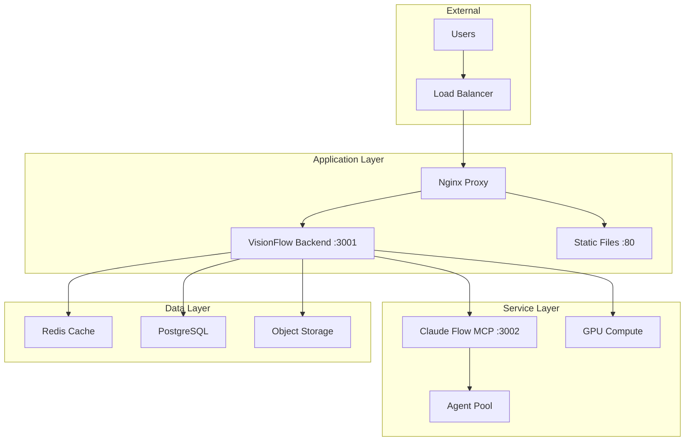

# Deployment Guide

## Overview

VisionFlow can be deployed using Docker Compose for a complete AI agent orchestration and visualisation environment. The system consists of multiple containerized services working together.

## Deployment Options

### Quick Start (Docker Compose)
- [Docker Deployment](docker.md) - Standard Docker Compose deployment
- [Production Deployment](production.md) - Production-ready configuration
- [Kubernetes Deployment](kubernetes.md) - Kubernetes/Helm deployment

### Cloud Platforms
- [AWS Deployment](aws.md) - Amazon Web Services with ECS/EKS
- [Azure Deployment](azure.md) - Microsoft Azure Container Instances
- [GCP Deployment](gcp.md) - Google Cloud Platform with GKE

## System Requirements

### Minimum Requirements
- **CPU**: 4 cores
- **RAM**: 8 GB
- **Disk**: 20 GB SSD
- **OS**: Linux (Ubuntu 20.04+) or macOS
- **Docker**: 20.10+
- **Docker Compose**: 2.0+

### Recommended Requirements
- **CPU**: 8+ cores
- **RAM**: 16 GB
- **GPU**: NVIDIA with CUDA 11.8+ (for GPU acceleration)
- **Disk**: 50 GB SSD
- **Network**: 100 Mbps

## Architecture Overview



## Service Components

| Service | Purpose | Port | Container |
|---------|---------|------|-----------|
| VisionFlow Backend | Main Rust server | 3001 | `visionflow-backend` |
| Claude Flow MCP | Agent orchestration | 3002 | `multi-agent-container` |
| Nginx | Reverse proxy | 80/443 | `nginx` |
| Redis | Session cache | 6379 | `redis` |
| PostgreSQL | Metadata storage | 5432 | `postgres` |

## Network Configuration

### Docker Networks
- `visionflow-net`: Internal service communication
- `claude-flow-net`: MCP agent communication
- `frontend-net`: Public-facing network

### Port Mapping
```yaml
services:
  backend:
    ports:
      - "3001:3001"  # REST API
  
  claude-flow:
    expose:
      - "3002"  # Internal MCP (not exposed externally)
  
  nginx:
    ports:
      - "80:80"    # HTTP
      - "443:443"  # HTTPS
```

## Security Considerations

### Network Security
- MCP port 3002 is **never** exposed externally
- All MCP communication through backend proxy
- TLS/SSL termination at Nginx
- Docker network isolation

### Authentication
- Nostr protocol for user authentication
- Session tokens in Redis
- API rate limiting

### Secrets Management
```bash
# Use Docker secrets
docker secret create claude_api_key ./secrets/claude_key.txt
docker secret create openai_api_key ./secrets/openai_key.txt

# Or environment variables
CLAUDE_API_KEY=sk-ant-...
OPENAI_API_KEY=sk-...
```

## Monitoring

### Health Checks
```yaml
healthcheck:
  test: ["CMD", "curl", "-f", "http://localhost:3001/api/health"]
  interval: 30s
  timeout: 10s
  retries: 3
```

### Logging
```bash
# View logs
docker-compose logs -f backend
docker-compose logs -f claude-flow

# Log aggregation
RUST_LOG=info,webxr=debug
```

### Metrics
- Prometheus endpoints: `/metrics`
- Grafana dashboards for visualisation
- OpenTelemetry tracing support

## Backup & Recovery

### Data Persistence
```yaml
volumes:
  postgres-data:
    driver: local
  redis-data:
    driver: local
  logseq-files:
    driver: local
```

### Backup Strategy
```bash
# Backup PostgreSQL
docker exec postgres pg_dump -U visionflow > backup.sql

# Backup volumes
docker run --rm -v postgres-data:/data -v $(pwd):/backup \
  busybox tar czf /backup/postgres-backup.tar.gz /data
```

## Scaling

### Horizontal Scaling
- Multiple backend instances behind load balancer
- Redis for session sharing
- Shared PostgreSQL database

### Vertical Scaling
- Increase container resources:
```yaml
deploy:
  resources:
    limits:
      cpus: '4'
      memory: 8G
    reservations:
      cpus: '2'
      memory: 4G
```

## Troubleshooting

### Common Issues

| Issue | Solution |
|-------|----------|
| MCP connection failed | Check Claude Flow container status |
| GPU not detected | Verify NVIDIA Docker runtime |
| Out of memory | Increase Docker memory limits |
| Port conflicts | Change port mappings in docker-compose.yml |

### Debug Commands
```bash
# Check service status
docker-compose ps

# Inspect networks
docker network ls
docker network inspect visionflow-net

# Container logs
docker logs visionflow-backend --tail 100

# Execute commands in container
docker exec -it visionflow-backend /bin/bash
```

## Quick Deployment Commands

```bash
# Clone repository
git clone https://github.com/visionflow/visionflow.git
cd visionflow

# Configure environment
cp .env.example .env
# Edit .env with your settings

# Start services
docker-compose up -d

# Check status
docker-compose ps

# View logs
docker-compose logs -f

# Stop services
docker-compose down
```

## Next Steps

1. Choose your deployment option:
   - [Docker Compose](docker.md) for development
   - [Production](production.md) for live environments
   - [Kubernetes](kubernetes.md) for orchestration

2. Configure environment variables

3. Set up monitoring and logging

4. Configure backups

5. Test the deployment

## Support

- [GitHub Issues](https://github.com/visionflow/visionflow/issues)
- [Documentation](../index.md)
- [API Reference](../api/rest.md)