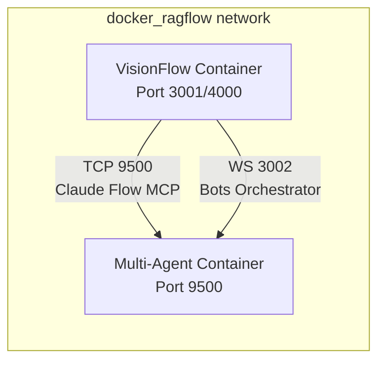

# Multi-Agent Container Setup

## Overview

VisionFlow integrates with the `multi-agent-container` for Claude Flow MCP services. This container must be running on the same Docker network (`docker_ragflow`) for the system to function properly.

## Prerequisites

The `multi-agent-container` should already be running. You can verify this with:

```bash
docker ps | grep multi-agent-container
```

It should be accessible at:
- **Hostname**: `multi-agent-container`
- **TCP Port**: `9500` (Claude Flow MCP)
- **WebSocket Port**: `3002` (Bots Orchestrator)

## Network Configuration

Both containers must be on the same Docker network:

```bash
# Verify network
docker network inspect docker_ragflow | grep -E "(Name|multi-agent|visionflow)"
```

## Connection Settings

The following environment variables configure the connection:

```bash
# In .env file
CLAUDE_FLOW_HOST=multi-agent-container  # Hostname within Docker network
MCP_TCP_PORT=9500                       # TCP port for MCP protocol
MCP_TRANSPORT=tcp                       # Use TCP transport (not WebSocket)
```

## Troubleshooting

### Connection Failed

If you see "Failed to connect to Claude Flow on TCP port 9500":

1. **Check container is running**:
   ```bash
   docker ps | grep multi-agent-container
   ```

2. **Verify network connectivity**:
   ```bash
   # From within visionflow_container
   docker exec visionflow_container ping -c 1 multi-agent-container
   ```

3. **Test TCP connection**:
   ```bash
   docker exec visionflow_container nc -zv multi-agent-container 9500
   ```

### Network Issues

If containers can't communicate:

1. **Ensure both are on the same network**:
   ```bash
   docker inspect multi-agent-container | grep NetworkMode
   docker inspect visionflow_container | grep NetworkMode
   ```

2. **Check network exists**:
   ```bash
   docker network ls | grep docker_ragflow
   ```

3. **Reconnect if needed**:
   ```bash
   docker network connect docker_ragflow visionflow_container
   ```

## Architecture



## Key Points

- **No powerdev service needed** - Removed as it was redundant
- **multi-agent-container must be running first** - VisionFlow depends on it
- **Same Docker network required** - Both containers must be on `docker_ragflow`
- **TCP protocol** - Using TCP on port 9500, not WebSocket
- **Automatic reconnection** - VisionFlow will retry connection if multi-agent-container restarts