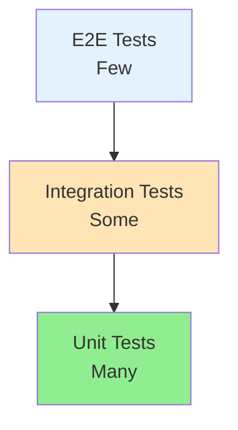

# Testing Guide

## Testing Strategy

VisionFlow uses a comprehensive testing strategy with multiple test levels to ensure code quality and reliability.

## Test Pyramid



## Test Types

### 1. Unit Tests

**Purpose**: Test individual functions/methods in isolation

**Location**: `tests/unit/`

**Example**:
```javascript
// tests/unit/api/utils/formatDate.test.js
const { formatDate } = require('@/api/utils/formatDate');

describe('formatDate', () => {
  it('should format date correctly', () => {
    const date = new Date('2025-01-23T10:00:00Z');
    expect(formatDate(date)).toBe('2025-01-23');
  });

  it('should handle invalid dates', () => {
    expect(() => formatDate('invalid')).toThrow('Invalid date');
  });
});
```

### 2. Integration Tests

**Purpose**: Test component interactions

**Location**: `tests/integration/`

**Example**:
```javascript
// tests/integration/api/projects.test.js
const request = require('supertest');
const app = require('@/api/app');
const { setupTestDb, teardownTestDb } = require('../helpers');

describe('Projects API Integration', () => {
  beforeAll(async () => {
    await setupTestDb();
  });

  afterAll(async () => {
    await teardownTestDb();
  });

  it('should create and retrieve project', async () => {
    const project = { name: 'Test Project' };

    const createRes = await request(app)
      .post('/api/projects')
      .send(project)
      .expect(201);

    const getRes = await request(app)
      .get(`/api/projects/${createRes.body.data.id}`)
      .expect(200);

    expect(getRes.body.data.name).toBe(project.name);
  });
});
```

### 3. End-to-End Tests

**Purpose**: Test complete user workflows

**Location**: `tests/e2e/`

**Example**:
```javascript
// tests/e2e/project-workflow.spec.js
describe('Project Creation Workflow', () => {
  it('should create and process project', async () => {
    // Login
    await page.goto('http://localhost:8080/login');
    await page.fill('[name="email"]', 'user@example.com');
    await page.fill('[name="password"]', 'password');
    await page.click('button[type="submit"]');

    // Create project
    await page.goto('http://localhost:8080/projects/new');
    await page.fill('[name="name"]', 'E2E Test Project');
    await page.click('button:has-text("Create")');

    // Verify creation
    await expect(page).toHaveURL(/\/projects\/[a-z0-9-]+/);
    await expect(page.locator('h1')).toHaveText('E2E Test Project');
  });
});
```

## Running Tests

```bash
# All tests
npm test

# Unit tests only
npm run test:unit

# Integration tests only
npm run test:integration

# E2E tests only
npm run test:e2e

# Watch mode
npm run test:watch

# Coverage report
npm run test:coverage

# Specific test file
npm test -- path/to/test.js
```

## Test Coverage Requirements

- **Unit Tests**: 90%+ coverage
- **Integration Tests**: 80%+ coverage
- **Critical Paths**: 100% coverage

Check coverage:
```bash
npm run test:coverage
open coverage/index.html
```

## Best Practices

1. **AAA Pattern**: Arrange, Act, Assert
2. **One Assertion Per Test**: Test one thing at a time
3. **Descriptive Names**: Clearly state what is being tested
4. **Independent Tests**: No test dependencies
5. **Fast Tests**: Keep tests quick
6. **Clean Up**: Always clean up after tests

## Next Steps

- Read [Contributing Guidelines](./06-contributing.md)
