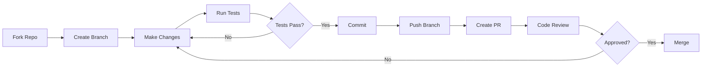

# Development Documentation

Welcome to the VisionFlow development documentation. This section covers everything you need to know to set up a development environment, contribute code, and debug issues.

## Quick Start for Developers

```bash
# Clone the repository
git clone https://github.com/visionflow/visionflow.git
cd visionflow

# Install dependencies
npm install
cd client && npm install && cd ..

# Set up environment
cp .env.example .env
# Edit .env with your configuration

# Start development servers
npm run dev
```

## Development Topics

### 🛠️ Setup & Configuration
- [Development Setup](setup.md) - Complete local environment setup
- [Environment Variables](../getting-started/configuration.md#environment-variables) - Required configuration
- [IDE Configuration](setup.md#ide-configuration) - VSCode, RustRover setup

### 🧪 Testing & Quality
- [Testing Guide](testing.md) - Unit, integration, and E2E tests
- [Code Standards](contributing.md#code-standards) - Style guides and linting
- [Performance Testing](testing.md#performance-testing) - Benchmarking GPU operations

### 🐛 Debugging & Troubleshooting
- [Debugging Guide](debugging.md) - Tools and techniques
- [Common Issues](../reference/troubleshooting.md) - Solutions to frequent problems
- [Logging](debugging.md#logging) - Debug output configuration

### 🤝 Contributing
- [Contributing Guide](contributing.md) - How to contribute
- [Pull Request Process](contributing.md#pull-requests) - PR guidelines
- [Code Review](contributing.md#code-review) - Review standards

## Technology Stack

### Backend (Rust)
- **Framework**: Actix-Web 4.x
- **Async Runtime**: Tokio
- **GPU Computing**: CUDA 11.0+
- **Serialisation**: Serde, Bincode
- **Testing**: Built-in Rust testing, Criterion

### Frontend (TypeScript/React)
- **Framework**: React 18
- **3D Graphics**: Three.js, React Three Fiber
- **State Management**: Zustand
- **WebSocket**: Native WebSocket API
- **Build Tool**: Vite
- **Testing**: Vitest, React Testing Library

### Infrastructure
- **Containerisation**: Docker, Docker Compose
- **Process Management**: Supervisord
- **Reverse Proxy**: NGINX
- **CI/CD**: GitHub Actions

## Development Workflow



## Key Development Areas

### 1. Physics Engine (CUDA/GPU)
Location: `src/gpu/`, `src/utils/visionflow_unified.cu`

Key concepts:
- Force-directed graph algorithms
- CUDA kernel optimisation
- Memory coalescing
- Shared memory usage

### 2. Actor System (Rust)
Location: `src/actors/`

Key actors:
- `GraphServiceActor` - Graph state management
- `GPUComputeActor` - GPU physics computation
- `ClaudeFlowActor` - AI agent integration

### 3. React Components
Location: `client/src/`

Key components:
- `GraphRenderer` - Three.js visualisation
- `IntegratedControlPanel` - Settings UI
- `AutoBalanceIndicator` - Adaptive balancing status

### 4. WebSocket Protocol
Location: `src/utils/binary_protocol.rs`

Binary format for efficient position streaming:
- 85% bandwidth reduction
- 60 FPS capability
- Sub-millisecond latency

## Performance Optimisation

### GPU Optimisation Checklist
- [ ] Coalesced memory access patterns
- [ ] Minimal divergent branches
- [ ] Optimal block/thread configuration
- [ ] Shared memory utilisation
- [ ] Warp-level primitives

### Frontend Optimisation Checklist
- [ ] React.memo for expensive components
- [ ] useMemo/useCallback for computations
- [ ] Virtual DOM minimisation
- [ ] WebGL state batching
- [ ] Texture atlasing

### Backend Optimisation Checklist
- [ ] Zero-copy where possible
- [ ] Arc<T> for shared immutable data
- [ ] Async/await for I/O operations
- [ ] Connection pooling
- [ ] Binary protocol for hot paths

## Debugging Tools

### Rust Debugging
```bash
# Enable debug logging
RUST_LOG=debug cargo run

# Profile with flamegraph
cargo flamegraph --bin webxr

# Memory profiling
valgrind --tool=massif target/debug/webxr
```

### GPU Debugging
```bash
# NVIDIA Nsight Systems
nsys profile ./target/release/webxr

# CUDA-GDB
cuda-gdb ./target/debug/webxr

# Compute Sanitizer
compute-sanitizer ./target/release/webxr
```

### Frontend Debugging
```javascript
// Enable debug mode
localStorage.setItem('debug', 'true');

// React DevTools Profiler
// Chrome DevTools Performance tab
// Three.js Inspector extension
```

## Common Development Tasks

### Adding a New Physics Parameter

1. Update `SimulationParams` in `src/models/simulation_params.rs`
2. Add to GPU kernel in `src/utils/visionflow_unified.cu`
3. Update settings in `data/settings.yaml`
4. Add UI control in `IntegratedControlPanel.tsx`
5. Document in API reference

### Creating a New Actor

1. Define messages in `src/actors/messages.rs`
2. Implement actor in `src/actors/your_actor.rs`
3. Register in `src/main.rs`
4. Add tests in same file
5. Document communication patterns

### Adding a REST Endpoint

1. Create handler in `src/handlers/api_handler/`
2. Add route in module's `config()`
3. Define request/response types
4. Add integration test
5. Update API documentation

## Resources

- [Rust Book](https://doc.rust-lang.org/book/)
- [Actix Web Guide](https://actix.rs/docs/)
- [CUDA Programming Guide](https://docs.nvidia.com/cuda/cuda-c-programming-guide/)
- [React Documentation](https://react.dev/)
- [Three.js Documentation](https://threejs.org/docs/)

---

[← Back to Documentation](../README.md) | [Development Setup →](setup.md)