# VisionFlow WebXR System Architecture Documentation

This document contains comprehensive, accurate diagrams mapping all data flows in the VisionFlow WebXR system, from user input to GPU rendering. These diagrams reflect the current state of the codebase as analyzed by the hive mind collective intelligence system.

## Table of Contents
1. [System Overview Architecture](#system-overview-architecture)
2. [Client-Server Connection & Real-time Updates](#client-server-connection--real-time-updates)
3. [Actor System Communication](#actor-system-communication)
4. [GPU Compute Pipeline](#gpu-compute-pipeline)
5. [Authentication & Authorization](#authentication--authorization)
6. [Settings Management & Synchronization](#settings-management--synchronization)
7. [External Services Integration](#external-services-integration)
8. [WebSocket Protocol Details](#websocket-protocol-details)
9. [Component Class Diagrams](#component-class-diagrams)
10. [Error Handling & Recovery Flows](#error-handling--recovery-flows)

---

## System Overview Architecture

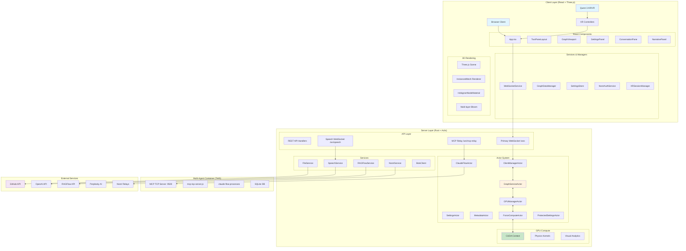
```mermaid
graph TB
    subgraph "Client Layer (React + Three.js)"
        Browser[Browser Client]
        Quest3[Quest 3 AR/VR]
        XR[XR Controllers]

        subgraph "React Components"
            App[App.tsx]
            TwoPane[TwoPaneLayout]
            GraphView[GraphViewport]
            Settings[SettingsPanel]
            Chat[ConversationPane]
            Narrative[NarrativePanel]
        end

        subgraph "Services & Managers"
            WSService[WebSocketService]
            GraphDataMgr[GraphDataManager]
            SettingsStore[SettingsStore]
            NostrAuth[NostrAuthService]
            XRMgr[XRSessionManager]
        end

        subgraph "3D Rendering"
            ThreeJS[Three.js Scene]
            InstancedMesh[InstancedMesh Renderer]
            HologramMat[HologramNodeMaterial]
            BloomEffect[Multi-layer Bloom]
        end
    end

    subgraph "Server Layer (Rust + Actix)"
        subgraph "API Layer"
            REST[REST API Handlers]
            WS1[Primary WebSocket /wss]
            WS2[Speech WebSocket /ws/speech]
            WS3[MCP Relay /ws/mcp-relay]
        end

        subgraph "Actor System"
            GraphActor[GraphServiceActor]
            ClientMgr[ClientManagerActor]
            SettingsActor[SettingsActor]
            MetadataActor[MetadataActor]
            GPUMgr[GPUManagerActor]
            ForceCompute[ForceComputeActor]
            Protected[ProtectedSettingsActor]
            ClaudeFlow[ClaudeFlowActor]
        end

        subgraph "Services"
            FileService[FileService]
            NostrService[NostrService]
            RAGService[RAGFlowService]
            SpeechService[SpeechService]
            BotsClient[BotsClient]
        end

        subgraph "GPU Compute"
            CUDA[CUDA Context]
            Kernels[Physics Kernels]
            Analytics[Visual Analytics]
        end
    end

    subgraph "Multi-Agent Container (THIS)"
        MCPServer[MCP TCP Server :9500]
        MCPWrapper[mcp-tcp-server.js]
        MCPProcess[claude-flow processes]
        AgentStore[SQLite DB]
    end

    subgraph "External Services"
        GitHub[GitHub API]
        OpenAI[OpenAI API]
        RAGFlow[RAGFlow API]
        Perplexity[Perplexity AI]
        NostrRelays[Nostr Relays]
    end

    %% Client connections
    Browser --> App
    Quest3 --> XR --> App
    App --> WSService
    WSService --> WS1

    %% WebSocket flows
    WS1 --> ClientMgr
    WS2 --> SpeechService
    WS3 --> ClaudeFlow

    %% Actor communications
    ClientMgr <--> GraphActor
    GraphActor <--> GPUMgr
    GPUMgr <--> ForceCompute
    ForceCompute <--> CUDA

    %% Service integrations
    FileService --> GitHub
    SpeechService --> OpenAI
    RAGService --> RAGFlow
    NostrService --> NostrRelays
    ClaudeFlow --> MCPServer

    style Browser fill:#e1f5fe
    style Quest3 fill:#e1f5fe
    style GraphActor fill:#fff3e0
    style CUDA fill:#c8e6c9
    style GitHub fill:#f3e5f5
```

---

## Client-Server Connection & Real-time Updates

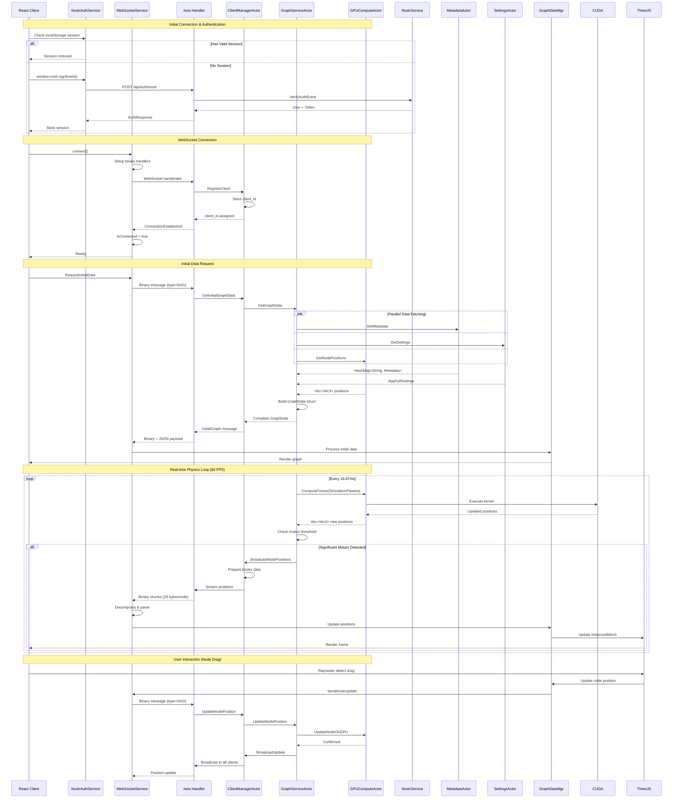
```mermaid
sequenceDiagram
    participant Client as React Client
    participant Auth as NostrAuthService
    participant WS as WebSocketService
    participant Server as /wss Handler
    participant ClientMgr as ClientManagerActor
    participant GraphActor as GraphServiceActor
    participant GPU as GPUComputeActor

    Note over Client,GPU: Initial Connection & Authentication

    Client->>Auth: Check localStorage session
    alt Has Valid Session
        Auth-->>Client: Session restored
    else No Session
        Client->>Auth: window.nostr.signEvent()
        Auth->>Server: POST /api/auth/nostr
        Server->>NostrService: VerifyAuthEvent
        NostrService-->>Server: User + Token
        Server-->>Auth: AuthResponse
        Auth-->>Client: Store session
    end

    Note over Client,GPU: WebSocket Connection

    Client->>WS: connect()
    WS->>WS: Setup binary handlers
    WS->>Server: WebSocket handshake
    Server->>ClientMgr: RegisterClient
    ClientMgr->>ClientMgr: Store client_id
    ClientMgr-->>Server: client_id assigned
    Server-->>WS: ConnectionEstablished
    WS->>WS: isConnected = true
    WS-->>Client: Ready

    Note over Client,GPU: Initial Data Request

    Client->>WS: RequestInitialData
    WS->>Server: Binary message (type=0x01)
    Server->>ClientMgr: GetInitialGraphData
    ClientMgr->>GraphActor: GetGraphData

    par Parallel Data Fetching
        GraphActor->>MetadataActor: GetMetadata
        and
        GraphActor->>SettingsActor: GetSettings
        and
        GraphActor->>GPU: GetNodePositions
    end

    MetadataActor-->>GraphActor: HashMap<String, Metadata>
    SettingsActor-->>GraphActor: AppFullSettings
    GPU-->>GraphActor: Vec<Vec3> positions

    GraphActor->>GraphActor: Build GraphData struct
    GraphActor-->>ClientMgr: Complete GraphData
    ClientMgr-->>Server: InitialGraph message
    Server-->>WS: Binary + JSON payload
    WS->>GraphDataMgr: Process initial data
    GraphDataMgr-->>Client: Render graph

    Note over Client,GPU: Real-time Physics Loop (60 FPS)

    loop Every 16.67ms
        GraphActor->>GPU: ComputeForces(SimulationParams)
        GPU->>CUDA: Execute kernel
        CUDA-->>GPU: Updated positions
        GPU-->>GraphActor: Vec<Vec3> new positions

        GraphActor->>GraphActor: Check motion threshold
        alt Significant Motion Detected
            GraphActor->>ClientMgr: BroadcastNodePositions
            ClientMgr->>ClientMgr: Prepare binary data
            ClientMgr->>Server: Stream positions
            Server-->>WS: Binary chunks (28 bytes/node)
            WS->>WS: Decompress & parse
            WS->>GraphDataMgr: Update positions
            GraphDataMgr->>ThreeJS: Update InstancedMesh
            ThreeJS-->>Client: Render frame
        end
    end

    Note over Client,GPU: User Interaction (Node Drag)

    Client->>ThreeJS: Raycaster detect drag
    ThreeJS->>GraphDataMgr: Update node position
    GraphDataMgr->>WS: SendNodeUpdate
    WS->>Server: Binary message (type=0x02)
    Server->>ClientMgr: UpdateNodePosition
    ClientMgr->>GraphActor: UpdateNodePosition
    GraphActor->>GPU: UpdateNodeOnGPU
    GPU-->>GraphActor: Confirmed
    GraphActor->>ClientMgr: BroadcastUpdate
    ClientMgr->>Server: Broadcast to all clients
    Server-->>WS: Position update
```

---

## Actor System Communication

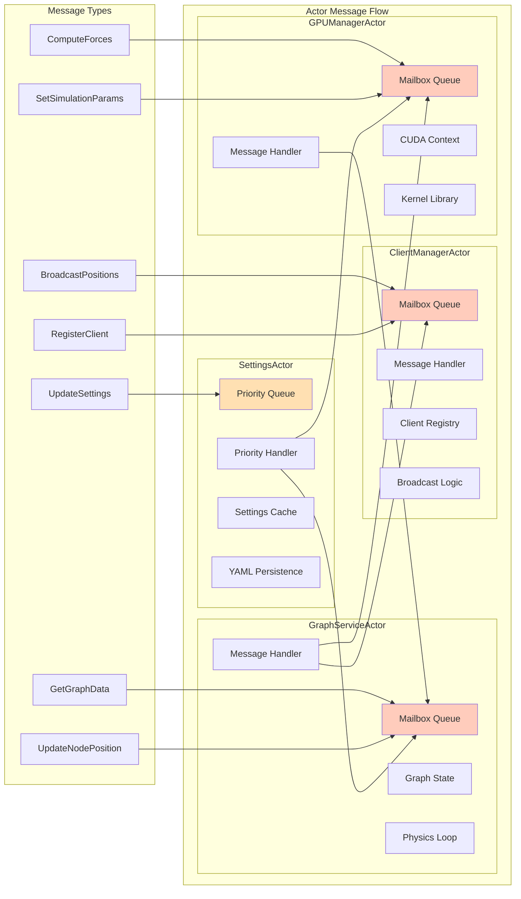
```mermaid
graph LR
    subgraph "Actor Message Flow"
        direction TB

        subgraph "GraphServiceActor"
            GSA_Mailbox[Mailbox Queue]
            GSA_Handler[Message Handler]
            GSA_State[Graph State]
            GSA_Physics[Physics Loop]
        end

        subgraph "ClientManagerActor"
            CMA_Mailbox[Mailbox Queue]
            CMA_Handler[Message Handler]
            CMA_Clients[Client Registry]
            CMA_Broadcast[Broadcast Logic]
        end

        subgraph "GPUManagerActor"
            GMA_Mailbox[Mailbox Queue]
            GMA_Handler[Message Handler]
            GMA_Context[CUDA Context]
            GMA_Kernels[Kernel Library]
        end

        subgraph "SettingsActor"
            SA_Mailbox[Priority Queue]
            SA_Handler[Priority Handler]
            SA_State[Settings Cache]
            SA_Persist[YAML Persistence]
        end
    end

    subgraph "Message Types"
        M1[GetGraphData]
        M2[UpdateNodePosition]
        M3[ComputeForces]
        M4[BroadcastPositions]
        M5[UpdateSettings]
        M6[RegisterClient]
        M7[SetSimulationParams]
    end

    %% Message routing
    M1 --> GSA_Mailbox
    M2 --> GSA_Mailbox
    M3 --> GMA_Mailbox
    M4 --> CMA_Mailbox
    M5 --> SA_Mailbox
    M6 --> CMA_Mailbox
    M7 --> GMA_Mailbox

    %% Actor interactions
    GSA_Handler --> GMA_Mailbox
    GMA_Handler --> GSA_Mailbox
    GSA_Handler --> CMA_Mailbox
    SA_Handler --> GSA_Mailbox
    SA_Handler --> GMA_Mailbox

    style GSA_Mailbox fill:#ffccbc
    style CMA_Mailbox fill:#ffccbc
    style GMA_Mailbox fill:#ffccbc
    style SA_Mailbox fill:#ffe0b2
```

---

## GPU Compute Pipeline

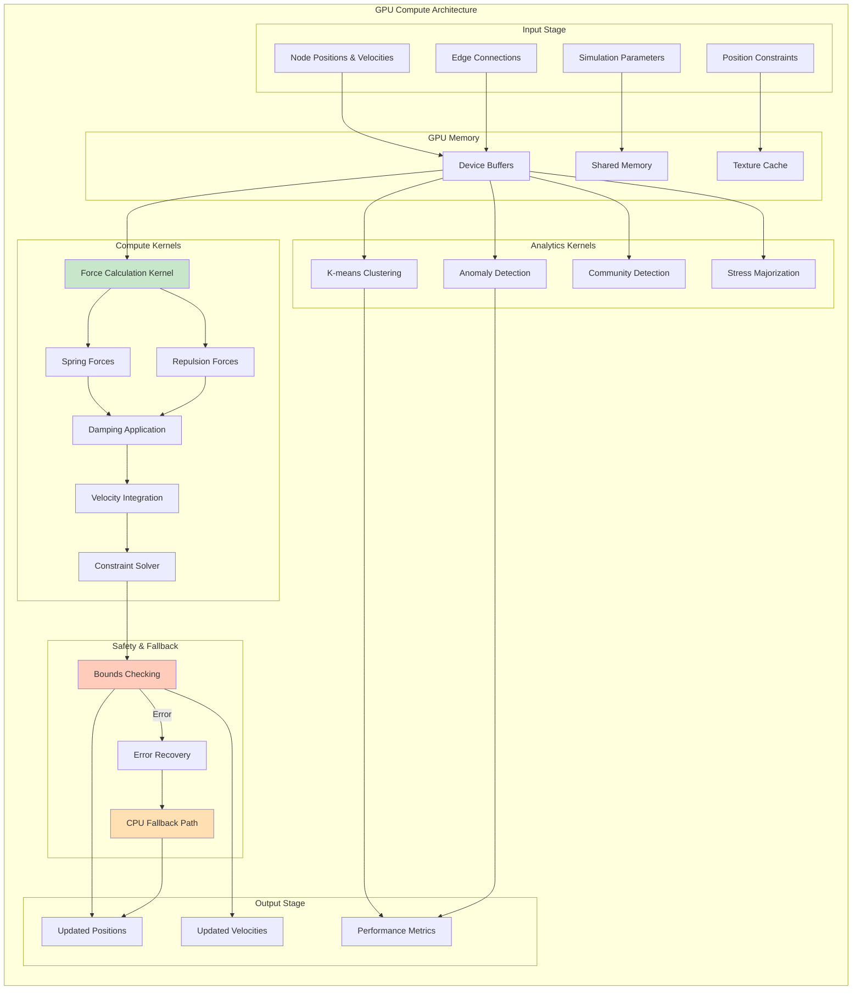
```mermaid
flowchart TB
    subgraph "GPU Compute Architecture"
        direction TB

        subgraph "Input Stage"
            NodeData[Node Positions & Velocities]
            EdgeData[Edge Connections]
            SimParams[Simulation Parameters]
            Constraints[Position Constraints]
        end

        subgraph "GPU Memory"
            DeviceBuffers[Device Buffers]
            SharedMem[Shared Memory]
            TextureCache[Texture Cache]
        end

        subgraph "Compute Kernels"
            ForceKernel[Force Calculation Kernel]
            SpringKernel[Spring Forces]
            RepulsionKernel[Repulsion Forces]
            DampingKernel[Damping Application]
            IntegrationKernel[Velocity Integration]
            ConstraintKernel[Constraint Solver]
        end

        subgraph "Analytics Kernels"
            ClusteringKernel[K-means Clustering]
            AnomalyKernel[Anomaly Detection]
            CommunityKernel[Community Detection]
            StressKernel[Stress Majorization]
        end

        subgraph "Output Stage"
            PositionBuffer[Updated Positions]
            VelocityBuffer[Updated Velocities]
            MetricsBuffer[Performance Metrics]
        end

        subgraph "Safety & Fallback"
            BoundsCheck[Bounds Checking]
            ErrorHandler[Error Recovery]
            CPUFallback[CPU Fallback Path]
        end
    end

    %% Data flow
    NodeData --> DeviceBuffers
    EdgeData --> DeviceBuffers
    SimParams --> SharedMem
    Constraints --> TextureCache

    DeviceBuffers --> ForceKernel
    ForceKernel --> SpringKernel
    ForceKernel --> RepulsionKernel
    SpringKernel --> DampingKernel
    RepulsionKernel --> DampingKernel
    DampingKernel --> IntegrationKernel
    IntegrationKernel --> ConstraintKernel

    DeviceBuffers --> ClusteringKernel
    DeviceBuffers --> AnomalyKernel
    DeviceBuffers --> CommunityKernel
    DeviceBuffers --> StressKernel

    ConstraintKernel --> BoundsCheck
    BoundsCheck --> PositionBuffer
    BoundsCheck --> VelocityBuffer

    ClusteringKernel --> MetricsBuffer
    AnomalyKernel --> MetricsBuffer

    BoundsCheck -->|Error| ErrorHandler
    ErrorHandler --> CPUFallback
    CPUFallback --> PositionBuffer

    style ForceKernel fill:#c8e6c9
    style BoundsCheck fill:#ffccbc
    style CPUFallback fill:#ffe0b2
```

---

## Authentication & Authorization

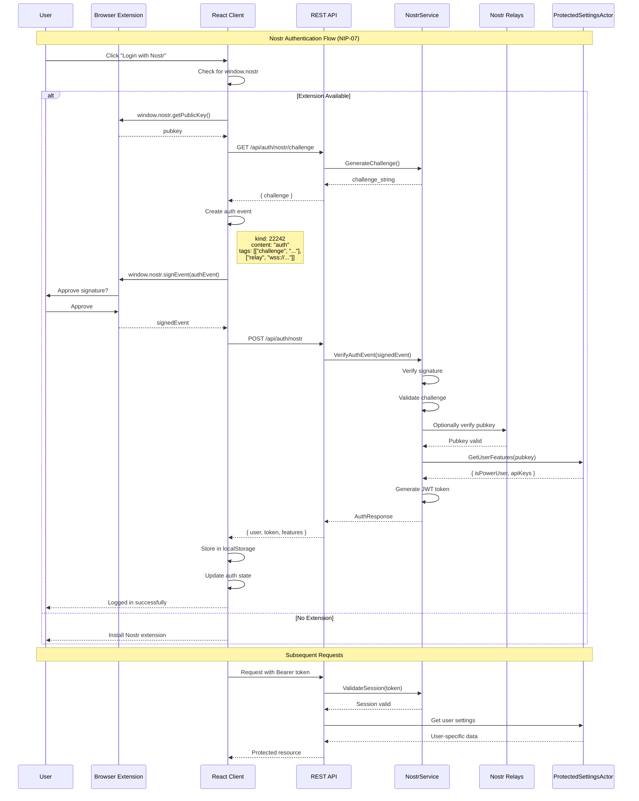
```mermaid
sequenceDiagram
    participant User
    participant Browser as Browser Extension
    participant Client as React Client
    participant API as REST API
    participant NostrSvc as NostrService
    participant NostrRelay as Nostr Relays
    participant Protected as ProtectedSettingsActor

    Note over User,Protected: Nostr Authentication Flow (NIP-07)

    User->>Client: Click "Login with Nostr"
    Client->>Client: Check for window.nostr

    alt Extension Available
        Client->>Browser: window.nostr.getPublicKey()
        Browser-->>Client: pubkey

        Client->>API: GET /api/auth/nostr/challenge
        API->>NostrSvc: GenerateChallenge()
        NostrSvc-->>API: challenge_string
        API-->>Client: { challenge }

        Client->>Client: Create auth event
        Note right of Client: kind: 22242<br/>content: "auth"<br/>tags: [["challenge", "..."],<br/>["relay", "wss://..."]]

        Client->>Browser: window.nostr.signEvent(authEvent)
        Browser->>User: Approve signature?
        User->>Browser: Approve
        Browser-->>Client: signedEvent

        Client->>API: POST /api/auth/nostr
        API->>NostrSvc: VerifyAuthEvent(signedEvent)

        NostrSvc->>NostrSvc: Verify signature
        NostrSvc->>NostrSvc: Validate challenge
        NostrSvc->>NostrRelay: Optionally verify pubkey
        NostrRelay-->>NostrSvc: Pubkey valid

        NostrSvc->>Protected: GetUserFeatures(pubkey)
        Protected-->>NostrSvc: { isPowerUser, apiKeys }

        NostrSvc->>NostrSvc: Generate JWT token
        NostrSvc-->>API: AuthResponse
        API-->>Client: { user, token, features }

        Client->>Client: Store in localStorage
        Client->>Client: Update auth state
        Client-->>User: Logged in successfully
    else No Extension
        Client-->>User: Install Nostr extension
    end

    Note over User,Protected: Subsequent Requests

    Client->>API: Request with Bearer token
    API->>NostrSvc: ValidateSession(token)
    NostrSvc-->>API: Session valid
    API->>Protected: Get user settings
    Protected-->>API: User-specific data
    API-->>Client: Protected resource
```

---

## Settings Management & Synchronization

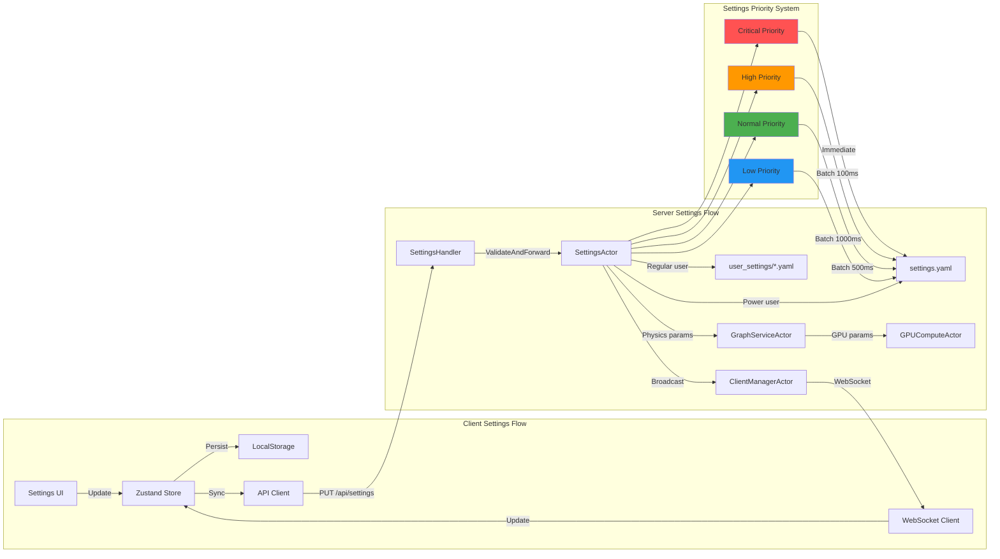
```mermaid
flowchart LR
    subgraph "Client Settings Flow"
        UI[Settings UI]
        Store[Zustand Store]
        LocalStorage[LocalStorage]
        WSClient[WebSocket Client]
        APIClient[API Client]
    end

    subgraph "Server Settings Flow"
        Handler[SettingsHandler]
        Actor[SettingsActor]
        YAMLFile[settings.yaml]
        UserFiles[user_settings/*.yaml]
        GraphAct[GraphServiceActor]
        GPUAct[GPUComputeActor]
        ClientMgrAct[ClientManagerActor]
    end

    subgraph "Settings Priority System"
        Critical[Critical Priority]
        High[High Priority]
        Normal[Normal Priority]
        Low[Low Priority]
    end

    %% Client flow
    UI -->|Update| Store
    Store -->|Persist| LocalStorage
    Store -->|Sync| APIClient

    %% Server flow
    APIClient -->|PUT /api/settings| Handler
    Handler -->|ValidateAndForward| Actor

    %% Priority routing
    Actor --> Critical
    Actor --> High
    Actor --> Normal
    Actor --> Low

    Critical -->|Immediate| YAMLFile
    High -->|Batch 100ms| YAMLFile
    Normal -->|Batch 500ms| YAMLFile
    Low -->|Batch 1000ms| YAMLFile

    %% Actor updates
    Actor -->|Physics params| GraphAct
    GraphAct -->|GPU params| GPUAct
    Actor -->|Broadcast| ClientMgrAct

    %% Broadcast back
    ClientMgrAct -->|WebSocket| WSClient
    WSClient -->|Update| Store

    %% User-specific
    Actor -->|Power user| YAMLFile
    Actor -->|Regular user| UserFiles

    style Critical fill:#ff5252
    style High fill:#ff9800
    style Normal fill:#4caf50
    style Low fill:#2196f3
```

---

## External Services Integration

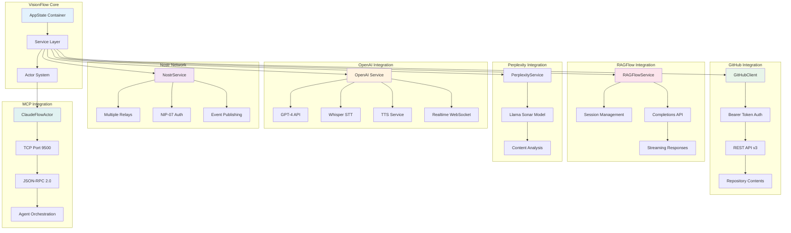
```mermaid
graph TB
    subgraph "VisionFlow Core"
        AppState[AppState Container]
        Services[Service Layer]
        Actors[Actor System]
    end

    subgraph "GitHub Integration"
        GHClient[GitHubClient]
        GHAuth[Bearer Token Auth]
        GHEndpoints[REST API v3]
        GHContent[Repository Contents]
    end

    subgraph "OpenAI Integration"
        OpenAIClient[OpenAI Service]
        GPT4[GPT-4 API]
        Whisper[Whisper STT]
        TTS[TTS Service]
        Realtime[Realtime WebSocket]
    end

    subgraph "RAGFlow Integration"
        RAGClient[RAGFlowService]
        RAGSessions[Session Management]
        RAGCompletions[Completions API]
        RAGStreaming[Streaming Responses]
    end

    subgraph "Perplexity Integration"
        PerplexityClient[PerplexityService]
        Sonar[Llama Sonar Model]
        Analysis[Content Analysis]
    end

    subgraph "Nostr Network"
        NostrClient[NostrService]
        NostrRelays[Multiple Relays]
        NostrAuth[NIP-07 Auth]
        NostrEvents[Event Publishing]
    end

    subgraph "MCP Integration"
        MCPClient[ClaudeFlowActor]
        TCPConnection[TCP Port 9500]
        JSONRPCProto[JSON-RPC 2.0]
        AgentOrch[Agent Orchestration]
    end

    %% Connections
    AppState --> Services
    Services --> Actors

    Services --> GHClient
    GHClient --> GHAuth
    GHAuth --> GHEndpoints
    GHEndpoints --> GHContent

    Services --> OpenAIClient
    OpenAIClient --> GPT4
    OpenAIClient --> Whisper
    OpenAIClient --> TTS
    OpenAIClient --> Realtime

    Services --> RAGClient
    RAGClient --> RAGSessions
    RAGClient --> RAGCompletions
    RAGCompletions --> RAGStreaming

    Services --> PerplexityClient
    PerplexityClient --> Sonar
    Sonar --> Analysis

    Services --> NostrClient
    NostrClient --> NostrRelays
    NostrClient --> NostrAuth
    NostrClient --> NostrEvents

    Actors --> MCPClient
    MCPClient --> TCPConnection
    TCPConnection --> JSONRPCProto
    JSONRPCProto --> AgentOrch

    style AppState fill:#e3f2fd
    style GHClient fill:#e8f5e9
    style OpenAIClient fill:#fff3e0
    style RAGClient fill:#fce4ec
    style NostrClient fill:#f3e5f5
    style MCPClient fill:#e0f2f1
```

---

## WebSocket Protocol Details

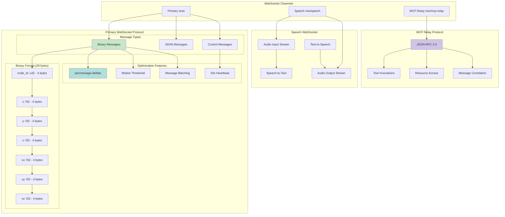
```mermaid
graph TB
    subgraph "WebSocket Channels"
        WS1[Primary /wss]
        WS2[Speech /ws/speech]
        WS3[MCP Relay /ws/mcp-relay]
    end

    subgraph "Primary WebSocket Protocol"
        subgraph "Message Types"
            Binary[Binary Messages]
            JSON[JSON Messages]
            Control[Control Messages]
        end

        subgraph "Binary Format (28 bytes)"
            NodeID[node_id: u32 - 4 bytes]
            PosX[x: f32 - 4 bytes]
            PosY[y: f32 - 4 bytes]
            PosZ[z: f32 - 4 bytes]
            VelX[vx: f32 - 4 bytes]
            VelY[vy: f32 - 4 bytes]
            VelZ[vz: f32 - 4 bytes]
        end

        subgraph "Optimization Features"
            Compression[permessage-deflate]
            Deadband[Motion Threshold]
            Batching[Message Batching]
            Heartbeat[30s Heartbeat]
        end
    end

    subgraph "Speech WebSocket"
        AudioIn[Audio Input Stream]
        AudioOut[Audio Output Stream]
        STT[Speech-to-Text]
        TTSProc[Text-to-Speech]
    end

    subgraph "MCP Relay Protocol"
        JSONRPC[JSON-RPC 2.0]
        ToolCalls[Tool Invocations]
        Resources[Resource Access]
        Correlation[Message Correlation]
    end

    %% Connections
    WS1 --> Binary
    WS1 --> JSON
    WS1 --> Control

    Binary --> NodeID
    NodeID --> PosX
    PosX --> PosY
    PosY --> PosZ
    PosZ --> VelX
    VelX --> VelY
    VelY --> VelZ

    Binary --> Compression
    Binary --> Deadband
    Binary --> Batching
    Control --> Heartbeat

    WS2 --> AudioIn
    WS2 --> AudioOut
    AudioIn --> STT
    TTSProc --> AudioOut

    WS3 --> JSONRPC
    JSONRPC --> ToolCalls
    JSONRPC --> Resources
    JSONRPC --> Correlation

    style Binary fill:#c8e6c9
    style Compression fill:#b2dfdb
    style JSONRPC fill:#d1c4e9
```

---

## Docker Container & MCP Process Architecture

```mermaid
graph TB
    subgraph "Docker Network: docker_ragflow (172.18.0.0/16)"
        subgraph "Logseq Container (172.18.0.10)"
            WebXR[WebXR Application]
            Rust[Rust Backend - Actix]
            ClaudeActor[ClaudeFlowActor]
            TCPActor[TcpConnectionActor]
            JSONRPCActor[JsonRpcClient]
        end

        subgraph "Multi-Agent Container (172.18.0.3) - WE ARE HERE"
            subgraph "MCP TCP Server Wrapper"
                TCPServer[mcp-tcp-server.js :9500]
                Note1[CRITICAL: Spawns NEW process per connection]
            end

            subgraph "Per-Connection MCP Process"
                MCPProcess1[claude-flow mcp --stdio #1]
                MCPProcess2[claude-flow mcp --stdio #2]
                MCPProcessN[claude-flow mcp --stdio #N]
                Note2[Each connection gets FRESH process]
                Note3[No shared state between connections]
            end

            subgraph "Persistent Storage"
                SQLite[/workspace/.swarm/memory.db]
                Memory[In-memory fallback]
            end
        end
    end

    %% WebXR to MCP connections
    ClaudeActor --> TCPActor
    TCPActor --> JSONRPCActor
    JSONRPCActor -.->|TCP multi-agent-container:9500| TCPServer

    %% MCP process spawning
    TCPServer -->|spawn per connection| MCPProcess1
    TCPServer -->|spawn per connection| MCPProcess2
    TCPServer -->|spawn per connection| MCPProcessN

    %% Storage
    MCPProcess1 --> SQLite
    MCPProcess2 --> SQLite
    MCPProcessN --> SQLite
    SQLite -.->|fallback| Memory

    style WebXR fill:#ffe0b2
    style TCPServer fill:#ffccbc
    style MCPProcess1 fill:#c8e6c9
    style MCPProcess2 fill:#c8e6c9
    style MCPProcessN fill:#c8e6c9
    style SQLite fill:#e1f5fe
    style Note1 fill:#ff5252,color:#fff
    style Note2 fill:#ff5252,color:#fff
    style Note3 fill:#ff5252,color:#fff
```

### MCP Connection Lifecycle & Swarm Addressing

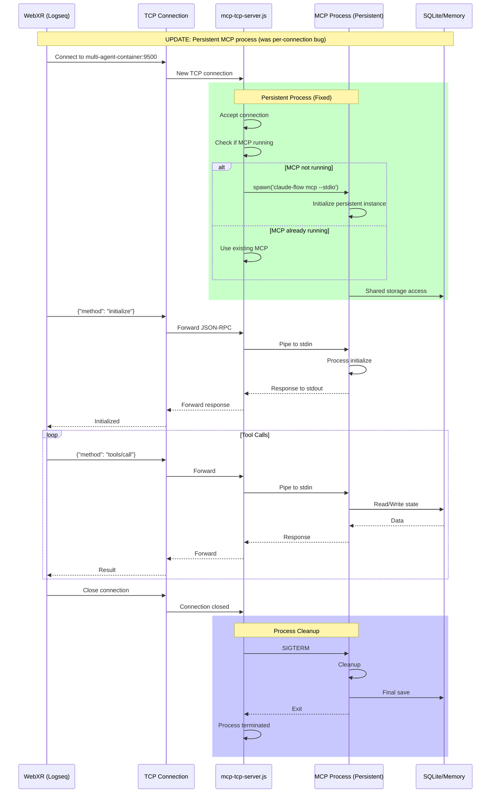
```mermaid
sequenceDiagram
    participant WebXR as WebXR (Logseq)
    participant TCP as TCP Connection
    participant Wrapper as mcp-tcp-server.js
    participant MCP as MCP Process (Persistent)
    participant DB as SQLite/Memory

    Note over WebXR,DB: UPDATE: Persistent MCP process (was per-connection bug)

    WebXR->>TCP: Connect to multi-agent-container:9500
    TCP->>Wrapper: New TCP connection

    rect rgb(200, 255, 200)
        Note over Wrapper,MCP: Persistent Process (Fixed)
        Wrapper->>Wrapper: Accept connection
        Wrapper->>Wrapper: Check if MCP running
        alt MCP not running
            Wrapper->>MCP: spawn('claude-flow mcp --stdio')
            MCP->>MCP: Initialize persistent instance
        else MCP already running
            Wrapper->>Wrapper: Use existing MCP
        end
        MCP->>DB: Shared storage access
    end

    WebXR->>TCP: {"method": "initialize"}
    TCP->>Wrapper: Forward JSON-RPC
    Wrapper->>MCP: Pipe to stdin
    MCP->>MCP: Process initialize
    MCP-->>Wrapper: Response to stdout
    Wrapper-->>TCP: Forward response
    TCP-->>WebXR: Initialized

    loop Tool Calls
        WebXR->>TCP: {"method": "tools/call"}
        TCP->>Wrapper: Forward
        Wrapper->>MCP: Pipe to stdin
        MCP->>DB: Read/Write state
        DB-->>MCP: Data
        MCP-->>Wrapper: Response
        Wrapper-->>TCP: Forward
        TCP-->>WebXR: Result
    end

    WebXR->>TCP: Close connection
    TCP->>Wrapper: Connection closed

    rect rgb(200, 200, 255)
        Note over Wrapper,MCP: Process Cleanup
        Wrapper->>MCP: SIGTERM
        MCP->>MCP: Cleanup
        MCP->>DB: Final save
        MCP-->>Wrapper: Exit
        Wrapper->>Wrapper: Process terminated
    end
```

---

## Swarm Addressing Protocol

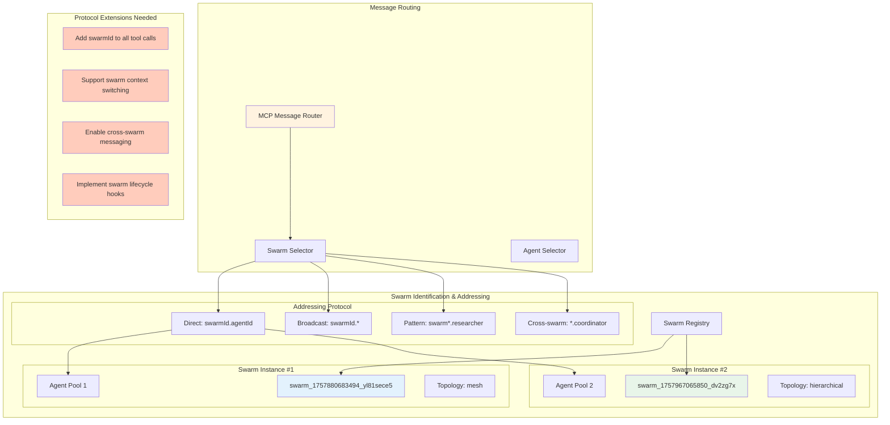
```mermaid
graph TB
    subgraph "Swarm Identification & Addressing"
        SwarmRegistry[Swarm Registry]

        subgraph "Swarm Instance #1"
            SwarmID1[swarm_1757880683494_yl81sece5]
            Agents1[Agent Pool 1]
            Topology1[Topology: mesh]
        end

        subgraph "Swarm Instance #2"
            SwarmID2[swarm_1757967065850_dv2zg7x]
            Agents2[Agent Pool 2]
            Topology2[Topology: hierarchical]
        end

        subgraph "Addressing Protocol"
            Direct[Direct: swarmId.agentId]
            Broadcast[Broadcast: swarmId.*]
            Pattern[Pattern: swarm*.researcher]
            Cross[Cross-swarm: *.coordinator]
        end
    end

    subgraph "Message Routing"
        Router[MCP Message Router]
        Selector[Swarm Selector]
        AgentSelector[Agent Selector]
    end

    subgraph "Protocol Extensions Needed"
        Extension1[Add swarmId to all tool calls]
        Extension2[Support swarm context switching]
        Extension3[Enable cross-swarm messaging]
        Extension4[Implement swarm lifecycle hooks]
    end

    SwarmRegistry --> SwarmID1
    SwarmRegistry --> SwarmID2

    Router --> Selector
    Selector --> Direct
    Selector --> Broadcast
    Selector --> Pattern
    Selector --> Cross

    Direct --> Agents1
    Direct --> Agents2

    style SwarmID1 fill:#e3f2fd
    style SwarmID2 fill:#e8f5e9
    style Router fill:#fff3e0
    style Extension1 fill:#ffccbc
    style Extension2 fill:#ffccbc
    style Extension3 fill:#ffccbc
    style Extension4 fill:#ffccbc
```

### Swarm Addressing Examples

```json
// Direct agent addressing within swarm
{
  "method": "tools/call",
  "params": {
    "name": "agent_task",
    "arguments": {
      "swarmId": "swarm_1757880683494_yl81sece5",
      "agentId": "agent_1757967065850_dv2zg7",
      "task": "analyze_code"
    }
  }
}

// Broadcast to all agents in swarm
{
  "method": "tools/call",
  "params": {
    "name": "swarm_broadcast",
    "arguments": {
      "swarmId": "swarm_1757880683494_yl81sece5",
      "message": "synchronize_state"
    }
  }
}

// Pattern-based addressing
{
  "method": "tools/call",
  "params": {
    "name": "agent_query",
    "arguments": {
      "swarmId": "*",
      "agentType": "researcher",
      "query": "find_implementations"
    }
  }
}
```

---

## Component Class Diagrams

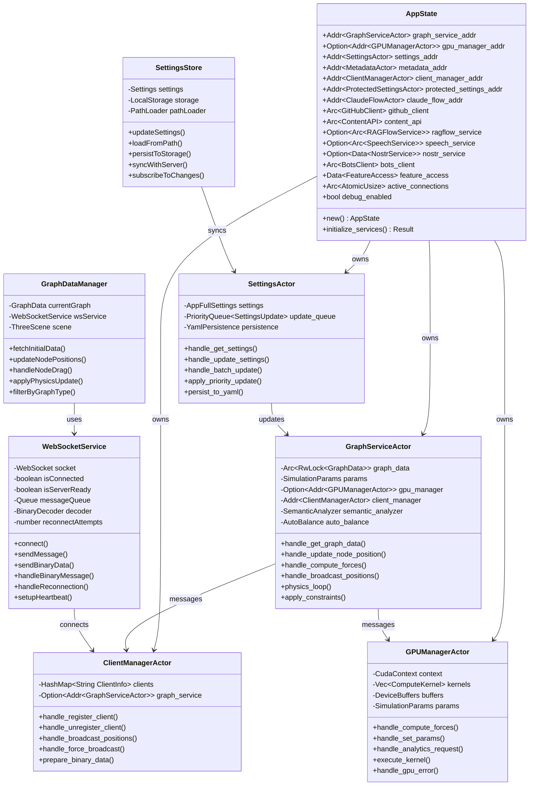
```mermaid
classDiagram
    class AppState {
        +Addr~GraphServiceActor~ graph_service_addr
        +Option~Addr~GPUManagerActor~~ gpu_manager_addr
        +Addr~SettingsActor~ settings_addr
        +Addr~MetadataActor~ metadata_addr
        +Addr~ClientManagerActor~ client_manager_addr
        +Addr~ProtectedSettingsActor~ protected_settings_addr
        +Addr~ClaudeFlowActor~ claude_flow_addr
        +Arc~GitHubClient~ github_client
        +Arc~ContentAPI~ content_api
        +Option~Arc~RAGFlowService~~ ragflow_service
        +Option~Arc~SpeechService~~ speech_service
        +Option~Data~NostrService~~ nostr_service
        +Arc~BotsClient~ bots_client
        +Data~FeatureAccess~ feature_access
        +Arc~AtomicUsize~ active_connections
        +bool debug_enabled
        +new() AppState
        +initialize_services() Result
    }

    class GraphServiceActor {
        -Arc~RwLock~GraphData~~ graph_data
        -SimulationParams params
        -Option~Addr~GPUManagerActor~~ gpu_manager
        -Addr~ClientManagerActor~ client_manager
        -SemanticAnalyzer semantic_analyzer
        -AutoBalance auto_balance
        +handle_get_graph_data()
        +handle_update_node_position()
        +handle_compute_forces()
        +handle_broadcast_positions()
        +physics_loop()
        +apply_constraints()
    }

    class ClientManagerActor {
        -HashMap~String ClientInfo~ clients
        -Option~Addr~GraphServiceActor~~ graph_service
        +handle_register_client()
        +handle_unregister_client()
        +handle_broadcast_positions()
        +handle_force_broadcast()
        +prepare_binary_data()
    }

    class GPUManagerActor {
        -CudaContext context
        -Vec~ComputeKernel~ kernels
        -DeviceBuffers buffers
        -SimulationParams params
        +handle_compute_forces()
        +handle_set_params()
        +handle_analytics_request()
        +execute_kernel()
        +handle_gpu_error()
    }

    class SettingsActor {
        -AppFullSettings settings
        -PriorityQueue~SettingsUpdate~ update_queue
        -YamlPersistence persistence
        +handle_get_settings()
        +handle_update_settings()
        +handle_batch_update()
        +apply_priority_update()
        +persist_to_yaml()
    }

    class WebSocketService {
        -WebSocket socket
        -boolean isConnected
        -boolean isServerReady
        -Queue messageQueue
        -BinaryDecoder decoder
        -number reconnectAttempts
        +connect()
        +sendMessage()
        +sendBinaryData()
        +handleBinaryMessage()
        +handleReconnection()
        +setupHeartbeat()
    }

    class GraphDataManager {
        -GraphData currentGraph
        -WebSocketService wsService
        -ThreeScene scene
        +fetchInitialData()
        +updateNodePositions()
        +handleNodeDrag()
        +applyPhysicsUpdate()
        +filterByGraphType()
    }

    class SettingsStore {
        -Settings settings
        -LocalStorage storage
        -PathLoader pathLoader
        +updateSettings()
        +loadFromPath()
        +persistToStorage()
        +syncWithServer()
        +subscribeToChanges()
    }

    %% Relationships
    AppState --> GraphServiceActor : owns
    AppState --> ClientManagerActor : owns
    AppState --> GPUManagerActor : owns
    AppState --> SettingsActor : owns

    GraphServiceActor --> ClientManagerActor : messages
    GraphServiceActor --> GPUManagerActor : messages
    SettingsActor --> GraphServiceActor : updates

    WebSocketService --> ClientManagerActor : connects
    GraphDataManager --> WebSocketService : uses
    SettingsStore --> SettingsActor : syncs
```

---

## Error Handling & Recovery Flows

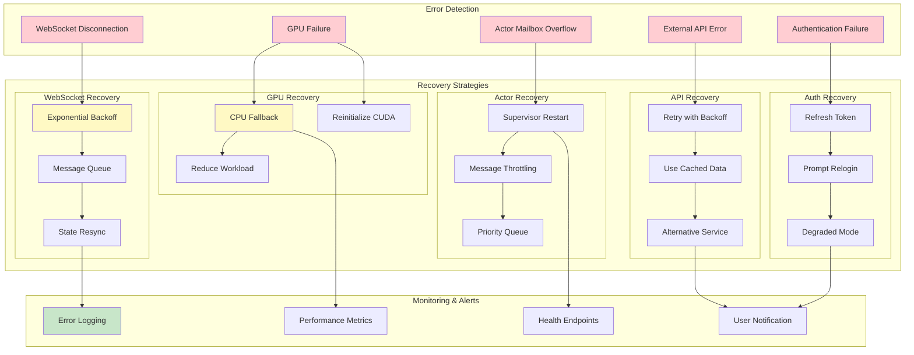
```mermaid
flowchart TB
    subgraph "Error Detection"
        WSError[WebSocket Disconnection]
        GPUError[GPU Failure]
        ActorError[Actor Mailbox Overflow]
        APIError[External API Error]
        AuthError[Authentication Failure]
    end

    subgraph "Recovery Strategies"
        subgraph "WebSocket Recovery"
            WSRetry[Exponential Backoff]
            WSQueue[Message Queue]
            WSResync[State Resync]
        end

        subgraph "GPU Recovery"
            GPUFallback[CPU Fallback]
            GPUReinit[Reinitialize CUDA]
            GPUReduce[Reduce Workload]
        end

        subgraph "Actor Recovery"
            ActorSupervise[Supervisor Restart]
            ActorThrottle[Message Throttling]
            ActorPriority[Priority Queue]
        end

        subgraph "API Recovery"
            APIRetry[Retry with Backoff]
            APICache[Use Cached Data]
            APIFallback[Alternative Service]
        end

        subgraph "Auth Recovery"
            AuthRefresh[Refresh Token]
            AuthRelogin[Prompt Relogin]
            AuthDegrade[Degraded Mode]
        end
    end

    subgraph "Monitoring & Alerts"
        ErrorLog[Error Logging]
        Metrics[Performance Metrics]
        HealthCheck[Health Endpoints]
        UserNotify[User Notification]
    end

    %% Error flows
    WSError --> WSRetry
    WSRetry --> WSQueue
    WSQueue --> WSResync

    GPUError --> GPUFallback
    GPUError --> GPUReinit
    GPUFallback --> GPUReduce

    ActorError --> ActorSupervise
    ActorSupervise --> ActorThrottle
    ActorThrottle --> ActorPriority

    APIError --> APIRetry
    APIRetry --> APICache
    APICache --> APIFallback

    AuthError --> AuthRefresh
    AuthRefresh --> AuthRelogin
    AuthRelogin --> AuthDegrade

    %% Monitoring
    WSResync --> ErrorLog
    GPUFallback --> Metrics
    ActorSupervise --> HealthCheck
    APIFallback --> UserNotify
    AuthDegrade --> UserNotify

    style WSError fill:#ffcdd2
    style GPUError fill:#ffcdd2
    style ActorError fill:#ffcdd2
    style APIError fill:#ffcdd2
    style AuthError fill:#ffcdd2
    style WSRetry fill:#fff9c4
    style GPUFallback fill:#fff9c4
    style ErrorLog fill:#c8e6c9
```

---

## Data Flow Summary

This comprehensive diagram set maps all critical data flows in the VisionFlow WebXR system:

1. **Client-Server Communication**: Binary WebSocket protocol with 28-byte node updates at 60 FPS
2. **Actor System**: Message-passing architecture with priority queues and supervision
3. **GPU Pipeline**: CUDA-accelerated physics with automatic CPU fallback
4. **Authentication**: Nostr-based decentralized identity with JWT sessions
5. **Settings Management**: Multi-level priority system with real-time synchronization
6. **External Services**: Integrated AI services, GitHub API, and multi-agent orchestration
7. **Error Recovery**: Comprehensive fallback mechanisms and graceful degradation
8. **Performance Optimization**: Binary protocols, compression, batching, and caching

The system demonstrates sophisticated engineering for real-time 3D graph visualization with XR support, GPU acceleration, and distributed agent coordination.

---

## Multi-Agent System Integration

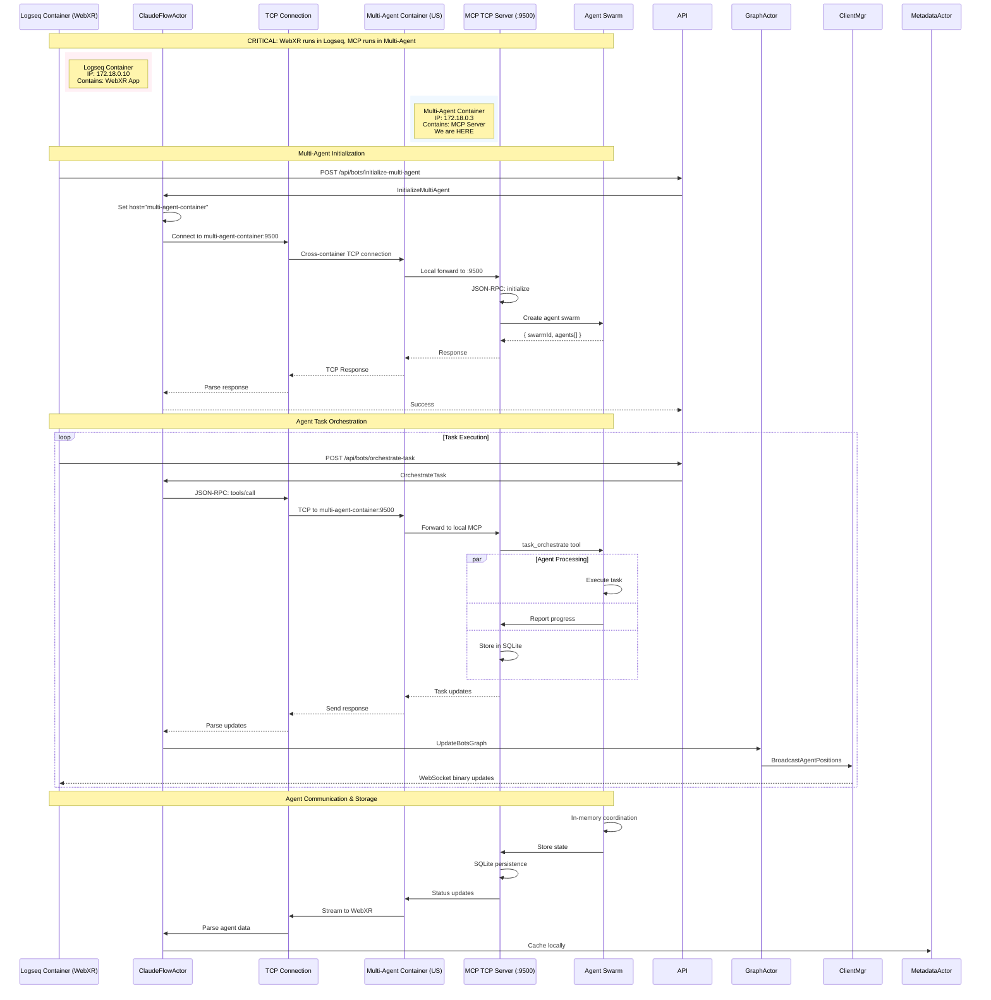
```mermaid
sequenceDiagram
    participant Logseq as Logseq Container (WebXR)
    participant ClaudeFlow as ClaudeFlowActor
    participant TCP as TCP Connection
    participant MultiAgent as Multi-Agent Container (US)
    participant MCP as MCP TCP Server (:9500)
    participant Agents as Agent Swarm

    Note over Logseq,Agents: CRITICAL: WebXR runs in Logseq, MCP runs in Multi-Agent

    rect rgb(255, 240, 245)
        Note right of Logseq: Logseq Container<br/>IP: 172.18.0.10<br/>Contains: WebXR App
    end

    rect rgb(240, 248, 255)
        Note right of MultiAgent: Multi-Agent Container<br/>IP: 172.18.0.3<br/>Contains: MCP Server<br/>We are HERE
    end

    Note over Logseq,Agents: Multi-Agent Initialization

    Logseq->>API: POST /api/bots/initialize-multi-agent
    API->>ClaudeFlow: InitializeMultiAgent
    ClaudeFlow->>ClaudeFlow: Set host="multi-agent-container"
    ClaudeFlow->>TCP: Connect to multi-agent-container:9500

    TCP->>MultiAgent: Cross-container TCP connection
    MultiAgent->>MCP: Local forward to :9500
    MCP->>MCP: JSON-RPC: initialize
    MCP->>Agents: Create agent swarm
    Agents-->>MCP: { swarmId, agents[] }
    MCP-->>MultiAgent: Response
    MultiAgent-->>TCP: TCP Response
    TCP-->>ClaudeFlow: Parse response
    ClaudeFlow-->>API: Success

    Note over Logseq,Agents: Agent Task Orchestration

    loop Task Execution
        Logseq->>API: POST /api/bots/orchestrate-task
        API->>ClaudeFlow: OrchestrateTask
        ClaudeFlow->>TCP: JSON-RPC: tools/call
        TCP->>MultiAgent: TCP to multi-agent-container:9500
        MultiAgent->>MCP: Forward to local MCP
        MCP->>Agents: task_orchestrate tool

        par Agent Processing
            Agents->>Agents: Execute task
            and
            Agents->>MCP: Report progress
            and
            MCP->>MCP: Store in SQLite
        end

        MCP-->>MultiAgent: Task updates
        MultiAgent-->>TCP: Send response
        TCP-->>ClaudeFlow: Parse updates
        ClaudeFlow->>GraphActor: UpdateBotsGraph
        GraphActor->>ClientMgr: BroadcastAgentPositions
        ClientMgr-->>Logseq: WebSocket binary updates
    end

    Note over Logseq,Agents: Agent Communication & Storage

    Agents->>Agents: In-memory coordination
    Agents->>MCP: Store state
    MCP->>MCP: SQLite persistence
    MCP->>MultiAgent: Status updates
    MultiAgent->>TCP: Stream to WebXR
    TCP->>ClaudeFlow: Parse agent data
    ClaudeFlow->>MetadataActor: Cache locally
```

---

## Speech & Audio Processing Pipeline

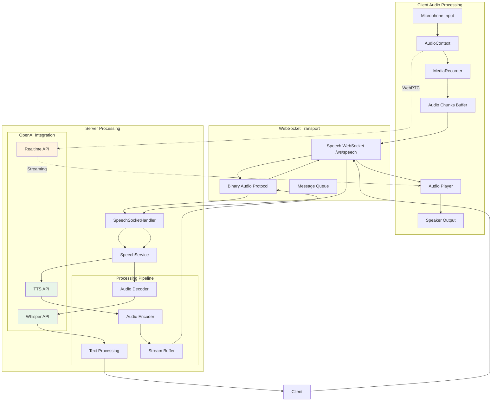
```mermaid
flowchart TB
    subgraph "Client Audio Processing"
        Mic[Microphone Input]
        AudioCtx[AudioContext]
        MediaRec[MediaRecorder]
        AudioChunks[Audio Chunks Buffer]
        AudioPlayer[Audio Player]
        Speaker[Speaker Output]
    end

    subgraph "WebSocket Transport"
        SpeechWS[Speech WebSocket /ws/speech]
        BinaryProto[Binary Audio Protocol]
        MessageQueue[Message Queue]
    end

    subgraph "Server Processing"
        SpeechHandler[SpeechSocketHandler]
        SpeechService[SpeechService]

        subgraph "OpenAI Integration"
            Whisper[Whisper API]
            TTSAPI[TTS API]
            RealtimeAPI[Realtime API]
        end

        subgraph "Processing Pipeline"
            AudioDecode[Audio Decoder]
            TextProcess[Text Processing]
            AudioEncode[Audio Encoder]
            StreamBuffer[Stream Buffer]
        end
    end

    %% STT Flow
    Mic --> AudioCtx
    AudioCtx --> MediaRec
    MediaRec --> AudioChunks
    AudioChunks --> SpeechWS
    SpeechWS --> BinaryProto
    BinaryProto --> SpeechHandler
    SpeechHandler --> SpeechService
    SpeechService --> AudioDecode
    AudioDecode --> Whisper
    Whisper --> TextProcess
    TextProcess --> Client

    %% TTS Flow
    Client --> SpeechWS
    SpeechWS --> SpeechHandler
    SpeechHandler --> SpeechService
    SpeechService --> TTSAPI
    TTSAPI --> AudioEncode
    AudioEncode --> StreamBuffer
    StreamBuffer --> BinaryProto
    BinaryProto --> SpeechWS
    SpeechWS --> AudioPlayer
    AudioPlayer --> Speaker

    %% Realtime Flow
    AudioCtx -.->|WebRTC| RealtimeAPI
    RealtimeAPI -.->|Streaming| AudioPlayer

    style Whisper fill:#e8f5e9
    style TTSAPI fill:#e8f5e9
    style RealtimeAPI fill:#fff3e0
```

---

## File Processing Pipeline with AI Analysis

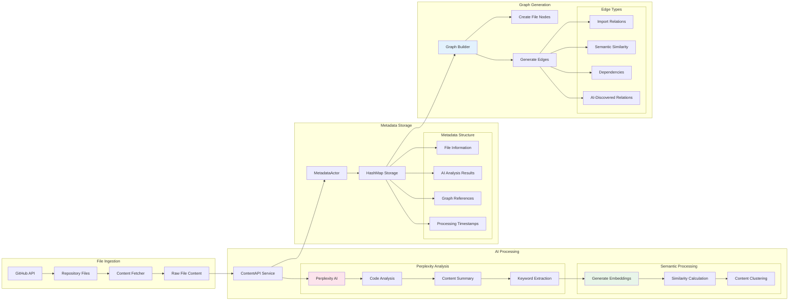
```mermaid
flowchart LR
    subgraph "File Ingestion"
        GitHubAPI[GitHub API]
        FileList[Repository Files]
        ContentFetch[Content Fetcher]
        RawContent[Raw File Content]
    end

    subgraph "AI Processing"
        ContentAPI[ContentAPI Service]

        subgraph "Perplexity Analysis"
            PerplexityAPI[Perplexity AI]
            CodeAnalysis[Code Analysis]
            Summary[Content Summary]
            Keywords[Keyword Extraction]
        end

        subgraph "Semantic Processing"
            Embeddings[Generate Embeddings]
            Similarity[Similarity Calculation]
            Clustering[Content Clustering]
        end
    end

    subgraph "Metadata Storage"
        MetadataActor[MetadataActor]
        MetadataStore[HashMap Storage]

        subgraph "Metadata Structure"
            FileInfo[File Information]
            AIResults[AI Analysis Results]
            GraphRefs[Graph References]
            Timestamps[Processing Timestamps]
        end
    end

    subgraph "Graph Generation"
        GraphBuilder[Graph Builder]
        NodeCreation[Create File Nodes]
        EdgeGeneration[Generate Edges]

        subgraph "Edge Types"
            ImportEdges[Import Relations]
            SimilarityEdges[Semantic Similarity]
            DependencyEdges[Dependencies]
            AIEdges[AI-Discovered Relations]
        end
    end

    %% Flow
    GitHubAPI --> FileList
    FileList --> ContentFetch
    ContentFetch --> RawContent

    RawContent --> ContentAPI
    ContentAPI --> PerplexityAPI
    PerplexityAPI --> CodeAnalysis
    CodeAnalysis --> Summary
    Summary --> Keywords

    Keywords --> Embeddings
    Embeddings --> Similarity
    Similarity --> Clustering

    ContentAPI --> MetadataActor
    MetadataActor --> MetadataStore
    MetadataStore --> FileInfo
    MetadataStore --> AIResults
    MetadataStore --> GraphRefs
    MetadataStore --> Timestamps

    MetadataStore --> GraphBuilder
    GraphBuilder --> NodeCreation
    GraphBuilder --> EdgeGeneration
    EdgeGeneration --> ImportEdges
    EdgeGeneration --> SimilarityEdges
    EdgeGeneration --> DependencyEdges
    EdgeGeneration --> AIEdges

    style PerplexityAPI fill:#fce4ec
    style Embeddings fill:#e8f5e9
    style GraphBuilder fill:#e3f2fd
```

---

## React Component Hierarchy & State Flow


```mermaid
graph TB
    subgraph "Root Components"
        App[App.tsx]
        ErrorBoundary[ErrorBoundary]
        Providers[Context Providers]
    end

    subgraph "Layout Components"
        TwoPane[TwoPaneLayout]
        GraphViewport[GraphViewport]
        RightPane[RightPaneControlPanel]
        CommandPalette[CommandPalette]
    end

    subgraph "3D Visualization"
        GraphCanvas[GraphCanvas]
        GraphManager[GraphManager]
        XRController[XRController]

        subgraph "Three.js Components"
            Scene[Three.Scene]
            Camera[PerspectiveCamera]
            Renderer[WebGLRenderer]
            InstancedMesh[InstancedMesh]
            HologramMaterial[HologramNodeMaterial]
        end
    end

    subgraph "UI Panels"
        SettingsPanel[SettingsPanelRedesign]
        ConversationPane[ConversationPane]
        NarrativePanel[NarrativeGoldminePanel]
        AuthUI[AuthUI]

        subgraph "Settings Sections"
            VisSettings[VisualisationSettings]
            PhysicsSettings[PhysicsSettings]
            APISettings[APIKeysSettings]
            GraphSettings[GraphSettings]
        end
    end

    subgraph "State Management"
        SettingsStore[useSettingsStore]
        GraphDataMgr[GraphDataManager]
        AuthService[NostrAuthService]
        WSService[WebSocketService]

        subgraph "Store Slices"
            UIState[UI State]
            GraphState[Graph State]
            AuthState[Auth State]
            ConnectionState[Connection State]
        end
    end

    subgraph "Hooks & Utils"
        UseGraph[useGraph]
        UseWebSocket[useWebSocket]
        UseXR[useXR]
        UseSettings[useSettings]
        UseKeyboard[useKeyboardShortcuts]
    end

    %% Component relationships
    App --> ErrorBoundary
    ErrorBoundary --> Providers
    Providers --> TwoPane

    TwoPane --> GraphViewport
    TwoPane --> RightPane
    GraphViewport --> GraphCanvas
    GraphCanvas --> GraphManager
    GraphManager --> Scene

    RightPane --> SettingsPanel
    RightPane --> ConversationPane
    RightPane --> NarrativePanel

    SettingsPanel --> VisSettings
    SettingsPanel --> PhysicsSettings
    SettingsPanel --> APISettings

    %% State flow
    SettingsStore --> UIState
    SettingsStore --> GraphState
    AuthService --> AuthState
    WSService --> ConnectionState

    GraphDataMgr --> GraphManager
    GraphDataMgr --> WSService

    %% Hook usage
    GraphCanvas --> UseGraph
    GraphCanvas --> UseWebSocket
    XRController --> UseXR
    SettingsPanel --> UseSettings
    App --> UseKeyboard

    style App fill:#e3f2fd
    style GraphManager fill:#c8e6c9
    style SettingsStore fill:#fff3e0
```

---

## Graph Physics Simulation Details

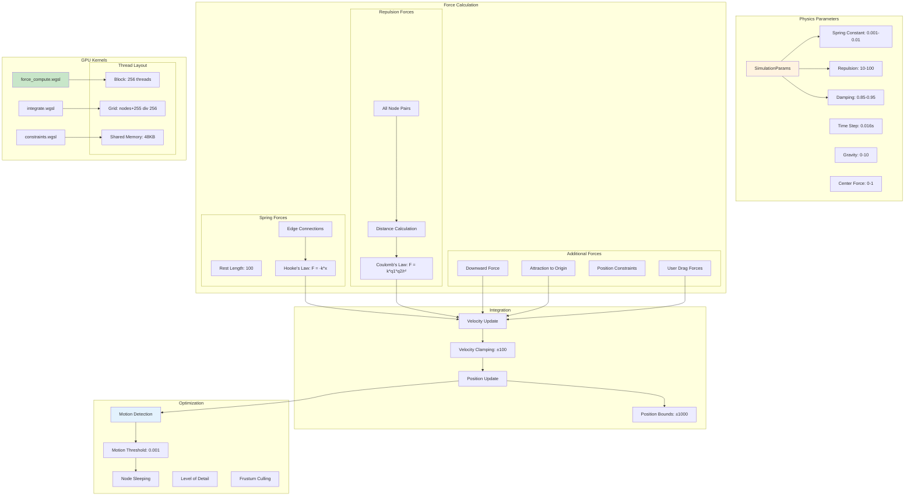
```mermaid
flowchart TB
    subgraph "Physics Parameters"
        SimParams[SimulationParams]
        SpringK[Spring Constant: 0.001-0.01]
        RepelK[Repulsion: 10-100]
        Damping[Damping: 0.85-0.95]
        TimeStep[Time Step: 0.016s]
        Gravity[Gravity: 0-10]
        CenterForce[Center Force: 0-1]
    end

    subgraph "Force Calculation"
        subgraph "Spring Forces"
            EdgeList[Edge Connections]
            RestLength[Rest Length: 100]
            SpringCalc[Hooke's Law: F = -k*x]
        end

        subgraph "Repulsion Forces"
            NodePairs[All Node Pairs]
            Distance[Distance Calculation]
            RepulsionCalc[Coulomb's Law: F = k*q1*q2/r²]
        end

        subgraph "Additional Forces"
            GravityForce[Downward Force]
            CenteringForce[Attraction to Origin]
            ConstraintForce[Position Constraints]
            UserForce[User Drag Forces]
        end
    end

    subgraph "Integration"
        Velocity[Velocity Update]
        VelClamp[Velocity Clamping: ±100]
        Position[Position Update]
        PosClamp[Position Bounds: ±1000]
    end

    subgraph "Optimization"
        MotionDetect[Motion Detection]
        Threshold[Motion Threshold: 0.001]
        Sleeping[Node Sleeping]
        LOD[Level of Detail]
        Culling[Frustum Culling]
    end

    subgraph "GPU Kernels"
        ForceKernel[force_compute.wgsl]
        IntegrateKernel[integrate.wgsl]
        ConstraintKernel[constraints.wgsl]

        subgraph "Thread Layout"
            BlockSize[Block: 256 threads]
            GridSize[Grid: nodes+255 div 256]
            SharedMem[Shared Memory: 48KB]
        end
    end

    %% Flow
    SimParams --> SpringK
    SimParams --> RepelK
    SimParams --> Damping

    EdgeList --> SpringCalc
    NodePairs --> Distance
    Distance --> RepulsionCalc

    SpringCalc --> Velocity
    RepulsionCalc --> Velocity
    GravityForce --> Velocity
    CenteringForce --> Velocity
    UserForce --> Velocity

    Velocity --> VelClamp
    VelClamp --> Position
    Position --> PosClamp

    Position --> MotionDetect
    MotionDetect --> Threshold
    Threshold --> Sleeping

    ForceKernel --> BlockSize
    IntegrateKernel --> GridSize
    ConstraintKernel --> SharedMem

    style ForceKernel fill:#c8e6c9
    style SimParams fill:#fff3e0
    style MotionDetect fill:#e3f2fd
```

---

## Actor Message Queue & Priority System

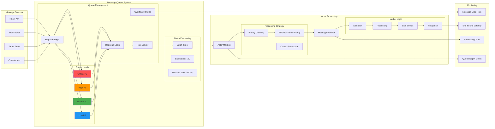
```mermaid
flowchart LR
    subgraph "Message Sources"
        REST[REST API]
        WebSocket[WebSocket]
        Timer[Timer Tasks]
        Actor[Other Actors]
    end

    subgraph "Message Queue System"
        subgraph "Priority Levels"
            Critical[Critical P0]
            High[High P1]
            Normal[Normal P2]
            Low[Low P3]
        end

        subgraph "Queue Management"
            Enqueue[Enqueue Logic]
            Dequeue[Dequeue Logic]
            Overflow[Overflow Handler]
            Throttle[Rate Limiter]
        end

        subgraph "Batch Processing"
            BatchTimer[Batch Timer]
            BatchSize[Batch Size: 100]
            BatchWindow[Window: 100-1000ms]
        end
    end

    subgraph "Actor Processing"
        Mailbox[Actor Mailbox]
        Handler[Message Handler]

        subgraph "Processing Strategy"
            FIFO[FIFO for Same Priority]
            PrioritySort[Priority Ordering]
            Preemption[Critical Preemption]
        end

        subgraph "Handler Logic"
            Validate[Validation]
            Process[Processing]
            SideEffects[Side Effects]
            Response[Response]
        end
    end

    subgraph "Monitoring"
        QueueDepth[Queue Depth Metric]
        ProcessTime[Processing Time]
        DropRate[Message Drop Rate]
        Latency[End-to-End Latency]
    end

    %% Message flow
    REST --> Enqueue
    WebSocket --> Enqueue
    Timer --> Enqueue
    Actor --> Enqueue

    Enqueue --> Critical
    Enqueue --> High
    Enqueue --> Normal
    Enqueue --> Low

    Critical --> Dequeue
    High --> Dequeue
    Normal --> Dequeue
    Low --> Dequeue

    Dequeue --> Throttle
    Throttle --> BatchTimer
    BatchTimer --> Mailbox

    Mailbox --> PrioritySort
    PrioritySort --> FIFO
    FIFO --> Handler

    Handler --> Validate
    Validate --> Process
    Process --> SideEffects
    SideEffects --> Response

    Mailbox --> QueueDepth
    Handler --> ProcessTime
    Overflow --> DropRate
    Response --> Latency

    style Critical fill:#ff5252
    style High fill:#ff9800
    style Normal fill:#4caf50
    style Low fill:#2196f3
```

---

## XR/VR Specific Flows

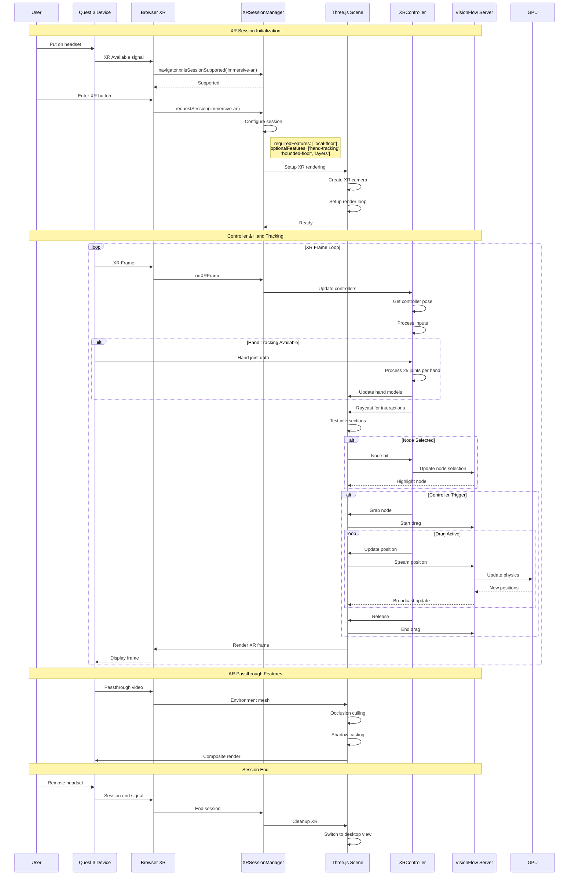
```mermaid
sequenceDiagram
    participant User
    participant Quest3 as Quest 3 Device
    participant Browser as Browser XR
    participant XRMgr as XRSessionManager
    participant Scene as Three.js Scene
    participant XRCtrl as XRController
    participant Server as VisionFlow Server

    Note over User,Server: XR Session Initialization

    User->>Quest3: Put on headset
    Quest3->>Browser: XR Available signal
    Browser->>XRMgr: navigator.xr.isSessionSupported('immersive-ar')
    XRMgr-->>Browser: Supported

    User->>Browser: Enter XR button
    Browser->>XRMgr: requestSession('immersive-ar')
    XRMgr->>XRMgr: Configure session
    Note right of XRMgr: requiredFeatures: ['local-floor']<br/>optionalFeatures: ['hand-tracking',<br/>'bounded-floor', 'layers']

    XRMgr->>Scene: Setup XR rendering
    Scene->>Scene: Create XR camera
    Scene->>Scene: Setup render loop
    Scene-->>XRMgr: Ready

    Note over User,Server: Controller & Hand Tracking

    loop XR Frame Loop
        Quest3->>Browser: XR Frame
        Browser->>XRMgr: onXRFrame

        XRMgr->>XRCtrl: Update controllers
        XRCtrl->>XRCtrl: Get controller pose
        XRCtrl->>XRCtrl: Process inputs

        alt Hand Tracking Available
            Quest3->>XRCtrl: Hand joint data
            XRCtrl->>XRCtrl: Process 25 joints per hand
            XRCtrl->>Scene: Update hand models
        end

        XRCtrl->>Scene: Raycast for interactions
        Scene->>Scene: Test intersections

        alt Node Selected
            Scene->>XRCtrl: Node hit
            XRCtrl->>Server: Update node selection
            Server-->>Scene: Highlight node
        end

        alt Controller Trigger
            XRCtrl->>Scene: Grab node
            Scene->>Server: Start drag
            loop Drag Active
                XRCtrl->>Scene: Update position
                Scene->>Server: Stream position
                Server->>GPU: Update physics
                GPU-->>Server: New positions
                Server-->>Scene: Broadcast update
            end
            XRCtrl->>Scene: Release
            Scene->>Server: End drag
        end

        Scene->>Browser: Render XR frame
        Browser->>Quest3: Display frame
    end

    Note over User,Server: AR Passthrough Features

    Quest3->>Browser: Passthrough video
    Browser->>Scene: Environment mesh
    Scene->>Scene: Occlusion culling
    Scene->>Scene: Shadow casting
    Scene->>Quest3: Composite render

    Note over User,Server: Session End

    User->>Quest3: Remove headset
    Quest3->>Browser: Session end signal
    Browser->>XRMgr: End session
    XRMgr->>Scene: Cleanup XR
    Scene->>Scene: Switch to desktop view
```

---

## Binary Protocol Message Types

```mermaid
graph TB
    subgraph "Message Header (4 bytes)"
        MsgType[Type: u8]
        Flags[Flags: u8]
        Length[Length: u16]
    end

    subgraph "Message Types"
        subgraph "Control Messages (0x00-0x0F)"
            Connect[0x00: Connect]
            Disconnect[0x01: Disconnect]
            Ping[0x02: Ping]
            Pong[0x03: Pong]
            Ready[0x04: Server Ready]
            Error[0x0F: Error]
        end

        subgraph "Data Messages (0x10-0x3F)"
            InitData[0x10: Initial Graph Data]
            NodeUpdate[0x11: Node Position Update]
            BatchUpdate[0x12: Batch Position Update]
            EdgeUpdate[0x13: Edge Update]
            MetadataUpdate[0x14: Metadata Update]
            SettingsSync[0x15: Settings Sync]
        end

        subgraph "Stream Messages (0x40-0x5F)"
            StartStream[0x40: Start Stream]
            StreamChunk[0x41: Stream Chunk]
            EndStream[0x42: End Stream]
            StreamAck[0x43: Stream Acknowledge]
        end

        subgraph "Agent Messages (0x60-0x7F)"
            AgentSpawn[0x60: Agent Spawned]
            AgentUpdate[0x61: Agent Status]
            AgentTask[0x62: Agent Task]
            AgentResult[0x63: Agent Result]
        end
    end

    subgraph "Payload Formats"
        subgraph "Node Position (28 bytes)"
            NodeID[node_id: u32]
            PosVec[position: Vec3 12 bytes]
            VelVec[velocity: Vec3 12 bytes]
        end

        subgraph "Batch Header (8 bytes)"
            Count[count: u32]
            Timestamp[timestamp: u32]
        end

        subgraph "Compression"
            CompFlag[Flag 0x80: Compressed]
            CompAlgo[permessage-deflate]
            CompRatio[Typical: 60-70%]
        end

        subgraph "Node Flags"
            AgentFlag[0x80000000: Agent Node]
            KnowledgeFlag[0x40000000: Knowledge Node]
            SelectedFlag[0x20000000: Selected]
            LockedFlag[0x10000000: Position Locked]
        end
    end

    subgraph "Protocol Features"
        Versioning[Version in Connect]
        Heartbeat[30s Ping/Pong]
        Fragmentation[Large Message Splitting]
        Ordering[Sequence Numbers]
        Reliability[ACK for Critical]
    end

    %% Relationships
    MsgType --> Connect
    MsgType --> InitData
    MsgType --> StartStream
    MsgType --> AgentSpawn

    NodeUpdate --> NodeID
    BatchUpdate --> Count
    BatchUpdate --> NodeID

    Flags --> CompFlag
    CompFlag --> CompAlgo

    NodeID --> AgentFlag

    style Connect fill:#ffccbc
    style InitData fill:#c8e6c9
    style StartStream fill:#b3e5fc
    style AgentSpawn fill:#d1c4e9
```

---

## Actor Supervision & Lifecycle

```mermaid
stateDiagram-v2
    [*] --> Created: Actor new

    Created --> Starting: start
    Starting --> Running: started

    Running --> Processing: receive message
    Processing --> Running: handle complete

    Running --> Stopping: stop signal
    Stopping --> Stopped: stopped()

    Processing --> Error: panic or error
    Error --> Restarting: supervisor restart
    Restarting --> Starting: restart complete

    Running --> Suspended: mailbox full
    Suspended --> Running: mailbox available

    Stopped --> [*]: cleanup complete

    state Running {
        [*] --> Idle
        Idle --> Active: message received
        Active --> Idle: message handled

        state Active {
            [*] --> Validating
            Validating --> Executing: valid
            Validating --> Rejected: invalid
            Executing --> SideEffects: success
            SideEffects --> Responding: complete
            Responding --> [*]
            Rejected --> [*]
        }
    }

    state Error {
        [*] --> Logging
        Logging --> Notifying: log written
        Notifying --> Recovering: supervisor notified
        Recovering --> [*]
    }

    state Supervision {
        [*] --> Monitoring
        Monitoring --> Detecting: health check
        Detecting --> Deciding: failure detected
        Deciding --> Restarting: restart strategy
        Deciding --> Escalating: max restarts
        Restarting --> [*]
        Escalating --> [*]: shutdown
    }
```

---

## Performance Optimization Strategies

```mermaid
flowchart TB
    subgraph "Frontend Optimizations"
        subgraph "Rendering"
            InstancedMesh[Instanced Rendering]
            LOD[Level of Detail]
            Culling[Frustum Culling]
            BatchDraw[Batch Draw Calls]
        end

        subgraph "State Management"
            Memoization[React.memo]
            LazyLoad[Lazy Loading]
            VirtualScroll[Virtual Scrolling]
            Debounce[Debounced Updates]
        end

        subgraph "Network"
            WSPool[WebSocket Pooling]
            MsgBatch[Message Batching]
            Compression[Data Compression]
            Cache[Local Caching]
        end
    end

    subgraph "Backend Optimizations"
        subgraph "Actor System"
            MailboxSize[Tuned Mailbox Sizes]
            PriorityQueue[Priority Queuing]
            ActorPool[Actor Pooling]
            Supervision[Smart Supervision]
        end

        subgraph "GPU Compute"
            KernelOpt[Optimized Kernels]
            MemCoalesce[Memory Coalescing]
            SharedMem[Shared Memory Usage]
            Streams[CUDA Streams]
        end

        subgraph "Data Processing"
            ChunkProcess[Chunk Processing]
            ParallelProc[Parallel Processing]
            StreamProc[Stream Processing]
            AsyncIO[Async I/O]
        end
    end

    subgraph "Protocol Optimizations"
        BinaryFormat[Binary Format 28 bytes]
        DeltaEncoding[Delta Encoding]
        DeadbandFilter[Deadband Filtering]
        AdaptiveRate[Adaptive Update Rate]
    end

    subgraph "Memory Management"
        ObjectPool[Object Pooling]
        BufferReuse[Buffer Reuse]
        WeakRefs[Weak References]
        GCTuning[GC Tuning]
    end

    subgraph "Monitoring & Profiling"
        PerfMetrics[Performance Metrics]
        FlameGraphs[Flame Graphs]
        TracingSpans[Tracing Spans]
        Benchmarks[Continuous Benchmarks]
    end

    %% Optimization flow
    InstancedMesh --> BatchDraw
    BatchDraw --> LOD
    LOD --> Culling

    Memoization --> LazyLoad
    LazyLoad --> Debounce

    WSPool --> MsgBatch
    MsgBatch --> Compression

    MailboxSize --> PriorityQueue
    PriorityQueue --> ActorPool

    KernelOpt --> MemCoalesce
    MemCoalesce --> SharedMem
    SharedMem --> Streams

    BinaryFormat --> DeltaEncoding
    DeltaEncoding --> DeadbandFilter
    DeadbandFilter --> AdaptiveRate

    PerfMetrics --> FlameGraphs
    FlameGraphs --> TracingSpans
    TracingSpans --> Benchmarks

    style KernelOpt fill:#c8e6c9
    style BinaryFormat fill:#e3f2fd
    style InstancedMesh fill:#fff3e0
```

---

## RAGFlow Integration & Chat Pipeline

```mermaid
sequenceDiagram
    participant User
    participant UI as ConversationPane
    participant API as REST API
    participant RAGService as RAGFlowService
    participant RAGFlow as RAGFlow Server
    participant GraphCtx as Graph Context
    participant OpenAI as OpenAI API

    Note over User,OpenAI: Chat Initialization

    User->>UI: Open chat panel
    UI->>API: GET /api/ragflow/sessions
    API->>RAGService: GetSessions
    RAGService->>RAGFlow: GET /api/sessions
    RAGFlow-->>RAGService: Session list
    RAGService-->>API: Sessions
    API-->>UI: Display sessions

    Note over User,OpenAI: Question Processing

    User->>UI: Type question
    UI->>UI: Show typing indicator
    User->>UI: Submit question

    UI->>GraphCtx: Get current context
    GraphCtx-->>UI: Selected nodes, visible graph

    UI->>API: POST /api/ragflow/chat
    Note right of API: {<br/>  question: "...",<br/>  context: {<br/>    nodes: [...],<br/>    edges: [...],<br/>    metadata: {...}<br/>  },<br/>  stream: true<br/>}

    API->>RAGService: ProcessChat
    RAGService->>RAGService: Build prompt with context

    RAGService->>RAGFlow: POST /api/completions
    RAGFlow->>RAGFlow: Retrieve relevant docs
    RAGFlow->>OpenAI: Generate with context

    loop Streaming Response
        OpenAI-->>RAGFlow: Token chunk
        RAGFlow-->>RAGService: Stream chunk
        RAGService-->>API: SSE event
        API-->>UI: Update response
        UI->>UI: Render markdown
    end

    RAGFlow-->>RAGService: Complete
    RAGService-->>API: End stream
    API-->>UI: Final response

    Note over User,OpenAI: Response Enhancement

    UI->>UI: Parse response for code
    UI->>UI: Syntax highlighting
    UI->>UI: Parse response for links
    UI->>GraphCtx: Highlight mentioned nodes
    GraphCtx->>Scene: Update node colors

    alt Speech Enabled
        UI->>API: POST /api/speech/tts
        API->>SpeechService: GenerateSpeech
        SpeechService->>OpenAI: TTS request
        OpenAI-->>SpeechService: Audio stream
        SpeechService-->>API: Audio data
        API-->>UI: Audio blob
        UI->>AudioPlayer: Play response
    end
```

---

## GitHub Repository Analysis Flow

```mermaid
flowchart TB
    subgraph "Repository Discovery"
        UserConfig[User Configuration]
        RepoList[Repository List]
        BranchSelect[Branch Selection]
        PathFilter[Path Filtering]
    end

    subgraph "Content Fetching"
        GitHubAPI[GitHub REST API v3]
        RateLimit[Rate Limit Handler]

        subgraph "Fetch Strategy"
            TreeAPI[Tree API for Structure]
            ContentsAPI[Contents API for Files]
            Pagination[Pagination Handler]
            Cache[Response Cache]
        end
    end

    subgraph "File Processing"
        FileFilter[File Filter]

        subgraph "Supported Types"
            Code[Source Code]
            Markdown[Markdown Docs]
            Config[Config Files]
            Data[Data Files]
        end

        subgraph "Processing Pipeline"
            Parser[Language Parser]
            Analyzer[Static Analysis]
            Extractor[Metadata Extractor]
        end
    end

    subgraph "AI Enhancement"
        ContentAPI[ContentAPI Service]

        subgraph "Perplexity Processing"
            CodeUnderstand[Code Understanding]
            DocSummary[Documentation Summary]
            DepAnalysis[Dependency Analysis]
            QualityScore[Code Quality Score]
        end

        subgraph "Semantic Analysis"
            Tokenizer[Code Tokenization]
            Embeddings[Generate Embeddings]
            Similarity[Similarity Matrix]
        end
    end

    subgraph "Graph Construction"
        NodeBuilder[Node Builder]
        EdgeBuilder[Edge Builder]

        subgraph "Node Types"
            FileNodes[File Nodes]
            ClassNodes[Class/Function Nodes]
            ConceptNodes[Concept Nodes]
        end

        subgraph "Edge Types"
            ImportEdge[Import/Require]
            CallEdge[Function Calls]
            InheritEdge[Inheritance]
            SemanticEdge[Semantic Relations]
        end
    end

    subgraph "Storage & Updates"
        MetadataStore[Metadata Storage]
        GraphStore[Graph Storage]
        UpdateDetect[Change Detection]
        IncrementalUpdate[Incremental Updates]
    end

    %% Flow connections
    UserConfig --> RepoList
    RepoList --> BranchSelect
    BranchSelect --> PathFilter

    PathFilter --> GitHubAPI
    GitHubAPI --> RateLimit
    RateLimit --> TreeAPI
    TreeAPI --> ContentsAPI
    ContentsAPI --> Pagination
    Pagination --> Cache

    Cache --> FileFilter
    FileFilter --> Code
    FileFilter --> Markdown
    FileFilter --> Config

    Code --> Parser
    Parser --> Analyzer
    Analyzer --> Extractor

    Extractor --> ContentAPI
    ContentAPI --> CodeUnderstand
    CodeUnderstand --> DocSummary
    DocSummary --> DepAnalysis
    DepAnalysis --> QualityScore

    ContentAPI --> Tokenizer
    Tokenizer --> Embeddings
    Embeddings --> Similarity

    Extractor --> NodeBuilder
    Similarity --> EdgeBuilder

    NodeBuilder --> FileNodes
    NodeBuilder --> ClassNodes
    NodeBuilder --> ConceptNodes

    EdgeBuilder --> ImportEdge
    EdgeBuilder --> CallEdge
    EdgeBuilder --> SemanticEdge

    FileNodes --> MetadataStore
    ImportEdge --> GraphStore
    GraphStore --> UpdateDetect
    UpdateDetect --> IncrementalUpdate

    style ContentAPI fill:#fce4ec
    style GraphStore fill:#e3f2fd
    style GitHubAPI fill:#e8f5e9
```

---

## Nostr Authentication Detail Flow

```mermaid
flowchart LR
    subgraph "Browser Environment"
        User[User Action]
        Extension[Nostr Extension]
        LocalStorage[LocalStorage]
        Window[window.nostr API]
    end

    subgraph "Client Application"
        AuthUI[Authentication UI]
        NostrService[NostrAuthService]
        SessionMgr[Session Manager]
    end

    subgraph "Server Authentication"
        AuthHandler[Auth Handler]
        NostrValidator[Nostr Validator]
        JWTGen[JWT Generator]
        SessionStore[Session Store]
    end

    subgraph "Nostr Protocol"
        NIP07[NIP-07 Extension API]
        NIP42[NIP-42 Auth Event]

        subgraph "Event Structure"
            EventKind[kind: 22242]
            EventContent[content: auth]
            EventTags[tags: challenge, relay]
            EventSig[Signature]
        end
    end

    subgraph "Protected Resources"
        PowerUser[Power User Features]
        APIKeys[API Key Storage]
        Settings[Protected Settings]
    end

    %% Authentication flow
    User --> AuthUI
    AuthUI --> NostrService
    NostrService --> Window
    Window --> Extension
    Extension --> NIP07

    NIP07 --> EventKind
    EventKind --> EventContent
    EventContent --> EventTags
    EventTags --> EventSig

    EventSig --> NostrService
    NostrService --> AuthHandler
    AuthHandler --> NostrValidator
    NostrValidator --> NIP42

    NostrValidator --> JWTGen
    JWTGen --> SessionStore
    SessionStore --> SessionMgr
    SessionMgr --> LocalStorage

    SessionStore --> PowerUser
    SessionStore --> APIKeys
    SessionStore --> Settings

    style NIP07 fill:#f3e5f5
    style JWTGen fill:#e3f2fd
    style PowerUser fill:#fff3e0
```

---

## Complete Data Structure Reference

```mermaid
classDiagram
    class GraphData {
        +Vec~Node~ nodes
        +Vec~Edge~ edges
        +HashMap~u32_Vec3~ positions
        +HashMap~u32_Vec3~ velocities
        +HashMap~String_Metadata~ metadata
        +GraphType graph_type
        +DateTime last_updated
        +calculate_bounds() BoundingBox
        +apply_forces(SimParams)
        +update_positions(dt f32)
    }

    class Node {
        +u32 id
        +String label
        +NodeType node_type
        +Vec3 position
        +Vec3 velocity
        +f32 mass
        +Color color
        +f32 size
        +HashMap~String_Value~ properties
        +bool is_locked
        +bool is_selected
        +bool is_visible
    }

    class Edge {
        +u32 id
        +u32 source
        +u32 target
        +EdgeType edge_type
        +f32 weight
        +f32 rest_length
        +Color color
        +f32 width
        +HashMap~String_Value~ properties
    }

    class SimulationParams {
        +f32 spring_k
        +f32 repel_k
        +f32 damping
        +f32 time_step
        +f32 gravity
        +f32 center_force
        +f32 max_velocity
        +BoundingBox bounds
        +bool use_gpu
        +u32 iterations_per_frame
    }

    class Metadata {
        +String file_path
        +String content_hash
        +DateTime processed_at
        +AIAnalysis ai_analysis
        +Vec~String~ keywords
        +Vec~f32~ embedding
        +HashMap~String_Value~ custom_data
    }

    class AIAnalysis {
        +String summary
        +f32 complexity_score
        +Vec~String~ detected_patterns
        +Vec~String~ dependencies
        +HashMap~String_f32~ quality_metrics
        +String suggested_improvements
    }

    class BinaryNodeData {
        +u32 node_id
        +f32 x
        +f32 y
        +f32 z
        +f32 vx
        +f32 vy
        +f32 vz
        +to_bytes() [u8 28]
        +from_bytes([u8 28]) Self
    }

    class ClientInfo {
        +String client_id
        +IpAddr ip_address
        +DateTime connected_at
        +DateTime last_heartbeat
        +UserInfo user_info
        +HashSet~Feature~ enabled_features
        +u32 message_count
    }

    class AppFullSettings {
        +UISettings ui
        +PhysicsSettings physics
        +APISettings apis
        +GraphSettings graph
        +ServerSettings server
        +FeatureFlags features
        +to_yaml() String
        +from_yaml(String) Result
        +merge(other Self)
    }

    class Message {
        <<enumeration>>
        GetGraphData
        UpdateNodePosition
        ComputeForces
        BroadcastPositions
        UpdateSettings
        RegisterClient
        SetSimulationParams
        RunAnalytics
        SpawnAgent
    }

    %% Relationships
    GraphData "1" --> "*" Node
    GraphData "1" --> "*" Edge
    GraphData "1" --> "1" SimulationParams
    GraphData "1" --> "*" Metadata

    Node "1" --> "1" BinaryNodeData : serializes to

    Metadata "1" --> "1" AIAnalysis

    ClientInfo "*" --> "1" AppFullSettings : uses

    Message --> GraphData : operates on
```

---
