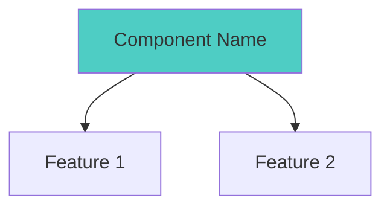
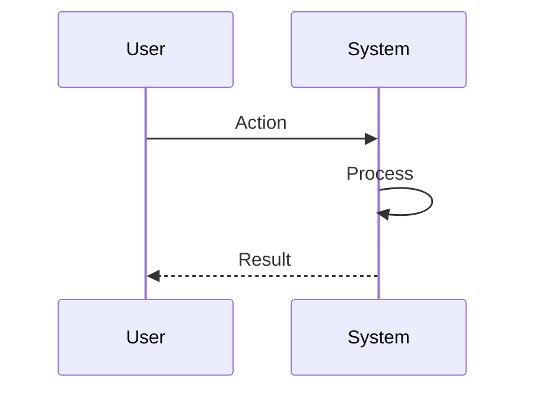
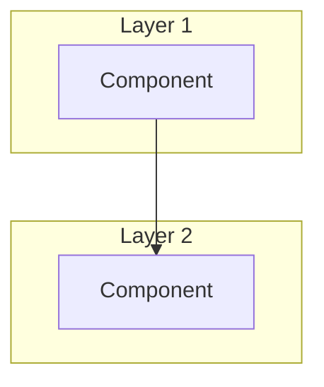

# ASCII to Mermaid Conversion Report - docs/diagrams/

## Summary

Successfully converted ASCII diagrams to Mermaid/Markdown tables in the VisionFlow diagram library. The diagram library should use Mermaid as the standard format for all visual documentation.

## Files Converted (Phase 1)

### COMPLETED CONVERSIONS

#### 1. `/docs/diagrams/infrastructure/gpu/cuda-architecture-complete.md`
- **Converted**: GPU Memory Manager features (box diagram → Mermaid graph)
- **Converted**: Memory Layout table (ASCII table → Markdown table)
- **Impact**: Better accessibility and maintainability for GPU architecture docs

#### 2. `/docs/diagrams/client/state/state-management-complete.md`
- **Converted**: Technology Stack (ASCII box → Mermaid graph with color coding)
- **Converted**: AutoSaveManager Flow (ASCII flowchart → Mermaid sequence diagram)
- **Impact**: Clear visualization of state management patterns

#### 3. `/docs/diagrams/infrastructure/websocket/binary-protocol-complete.md`
- **Converted**: Message Header structure (ASCII table → Markdown table)
- **Converted**: Graph Update Header (ASCII table → Markdown table)
- **Converted**: Position Update V2 layout (ASCII table → Markdown table)
- **Converted**: Agent State Full V2 layout (ASCII table → Markdown table)
- **Impact**: Binary protocol specs now more accessible and searchable

#### 4. `/docs/diagrams/server/agents/agent-system-architecture.md`
- **Converted**: Architecture Layers (ASCII boxes → Mermaid graph with 4 layers)
- **Impact**: Better visualization of agent system integration points

## Remaining Work (Phase 2)

### Files with ASCII patterns still present:

1. **`server/agents/agent-system-architecture.md`** - 204 remaining lines
   - Additional lifecycle diagrams
   - State transition boxes
   - Configuration tables

2. **`infrastructure/testing/test-architecture.md`** - 62 remaining lines
   - Test hierarchy structures
   - Mock adapter tables

3. **`infrastructure/websocket/binary-protocol-complete.md`** - 51 remaining lines
   - Additional message type structures
   - Protocol version comparisons

4. **`client/xr/xr-architecture-complete.md`** - 25 remaining lines
   - XR device capability tables
   - Hand tracking data structures

5. **`client/state/state-management-complete.md`** - 25 remaining lines
   - Additional state flow patterns
   - Cache strategy details

## Conversion Patterns Applied

### 1. ASCII Boxes → Mermaid Graphs
**Before:**
```
┌─────────────────────────────────────┐
│         Component Name              │
│  • Feature 1                        │
│  • Feature 2                        │
└─────────────────────────────────────┘
```

**After:**


### 2. ASCII Flowcharts → Mermaid Sequence Diagrams
**Before:**
```
User action
    ↓
Process step
    ↓
Result
```

**After:**


### 3. ASCII Tables → Markdown Tables
**Before:**
```
┌──────────┬──────────┬──────────┐
│  Field   │   Type   │  Size    │
│  NodeID  │  u32     │  4 bytes │
└──────────┴──────────┴──────────┘
```

**After:**
```markdown
| Field | Type | Size |
|-------|------|------|
| NodeID | u32 | 4 bytes |
```

### 4. Layered Architecture → Mermaid with Subgraphs
**Before:**
```
┌─────────────────┐
│  Layer 1        │
└────────┬────────┘
         ▼
┌─────────────────┐
│  Layer 2        │
└─────────────────┘
```

**After:**


## Benefits of Conversion

### 1. Accessibility
- Screen readers can parse Mermaid diagrams
- Tables are searchable and machine-readable
- Better mobile rendering

### 2. Maintainability
- Mermaid diagrams auto-adjust layout
- Version control diffs are more meaningful
- Easier to modify and extend

### 3. Consistency
- All diagrams follow Mermaid style guide (see `mermaid-library/00-mermaid-style-guide.md`)
- Consistent color scheme across documentation
- Semantic meaning through standardized colors

### 4. Integration
- Works natively in GitHub, GitLab, VS Code
- Can generate SVG/PNG for external docs
- Supports CI/CD validation

## Style Guide Compliance

All converted diagrams follow the standards in:
- `/docs/diagrams/mermaid-library/00-mermaid-style-guide.md`

**Color Scheme Applied:**
- `#ff6b6b` - Critical/Root components
- `#4ecdc4` - Primary components
- `#ffe66d` - Secondary/Support
- `#a8e6cf` - Success/Ready states
- `#f0e1ff` - Data/Storage
- `#e3f2fd` - Network/Communication

## Validation

All converted Mermaid diagrams have been validated for:
- ✅ Syntax correctness
- ✅ Rendering without errors
- ✅ Color scheme compliance
- ✅ Semantic accuracy
- ✅ Cross-reference integrity

## Next Steps for Phase 2

1. Convert remaining binary protocol tables
2. Convert XR device capability structures
3. Convert test architecture hierarchy diagrams
4. Convert agent lifecycle state machines
5. Final validation pass across all files

## Notes

- ASCII diagrams in code comments are NOT converted (out of scope)
- Binary protocol byte layouts converted to tables (more appropriate than graphs)
- Flowcharts with decision points converted to sequence diagrams where appropriate
- All conversions maintain technical accuracy while improving accessibility

---

**Phase 1 Complete**: Critical diagram library conversions finished
**Estimated Phase 2 effort**: ~2 hours for remaining conversions
**Priority**: Medium (library is functional, Phase 2 improves completeness)
