## AB-01.1 agentbox.toml gates to flake.nix conditionals to package set and supervisord text

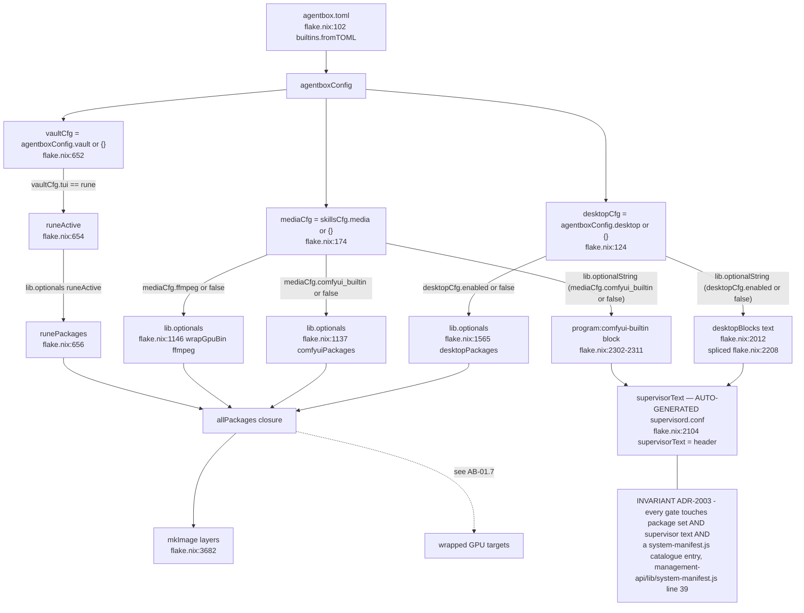

## AB-01.2 apply_class taxonomy - live, boot, rebuild

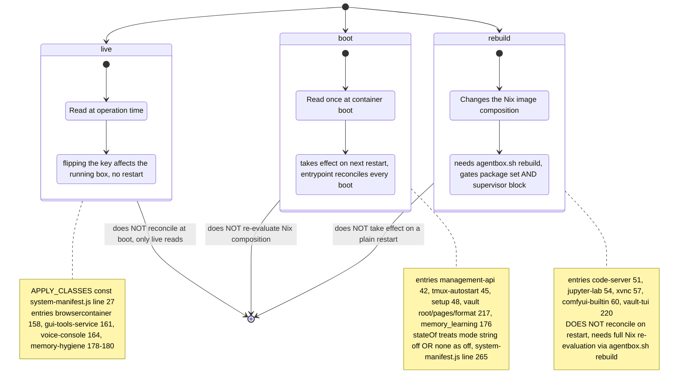

## AB-01.3 ./agentbox.sh rebuild - down, build --variant runtime, up --build, cleanup

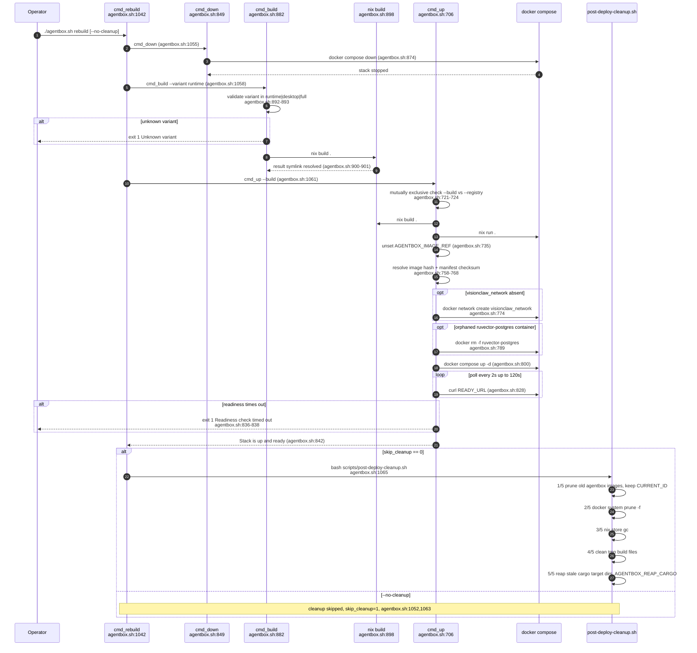

## AB-01.4 Static config validation - schema then semantic rules

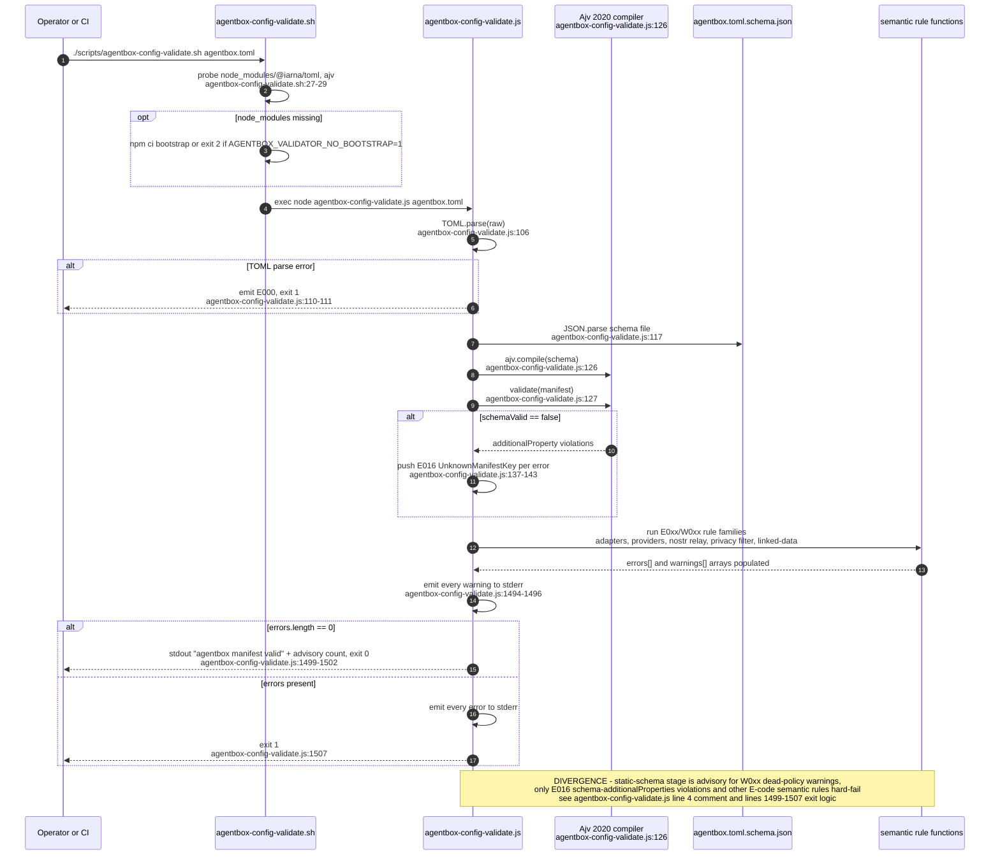

## AB-01.5 npm-cli.nix pinned exact-semver closure - ruvector always in package set

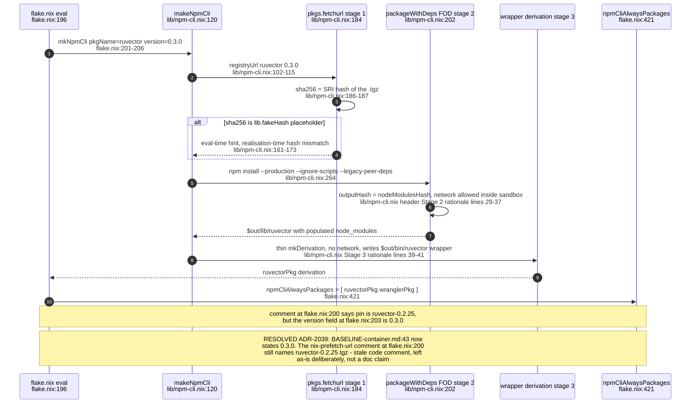

## AB-01.6 gpu-wrap.nix wrapGpuBins - LD_LIBRARY_PATH suffix and vendor ICDs

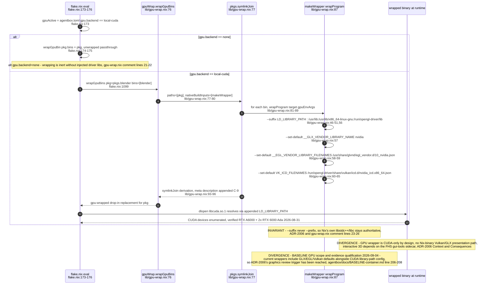

## AB-01.7 Wrapped-target list - ffmpeg, qgis, blender, 3DGS

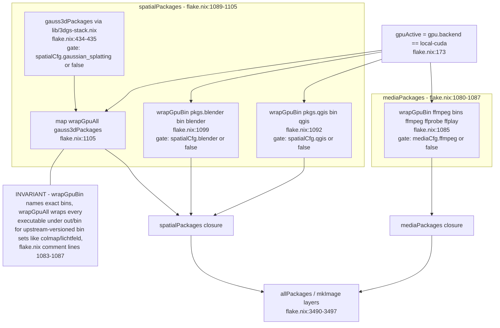

## AB-01.8 agentbox.toml schema shape - top-level sections

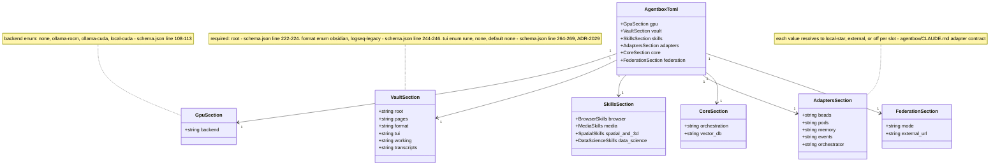

## AB-01.9 flake.lock inputs to flake outputs

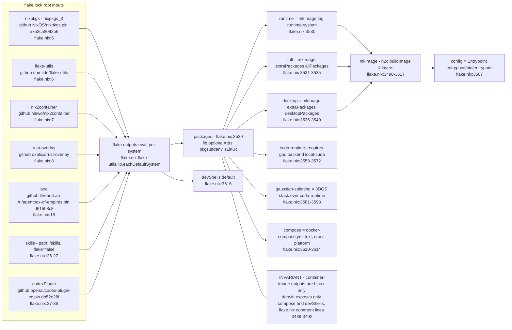

## AB-01.10 ADR-2029 vault-tui rebuild-class gate - two catalogue entries

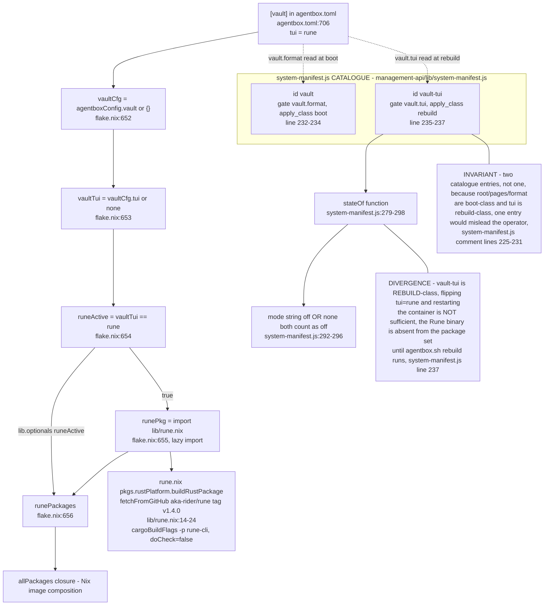

## AB-01.11 ADR-2080 model_routing.neural gate - pinned artefacts baked into the image (rebuild-class)
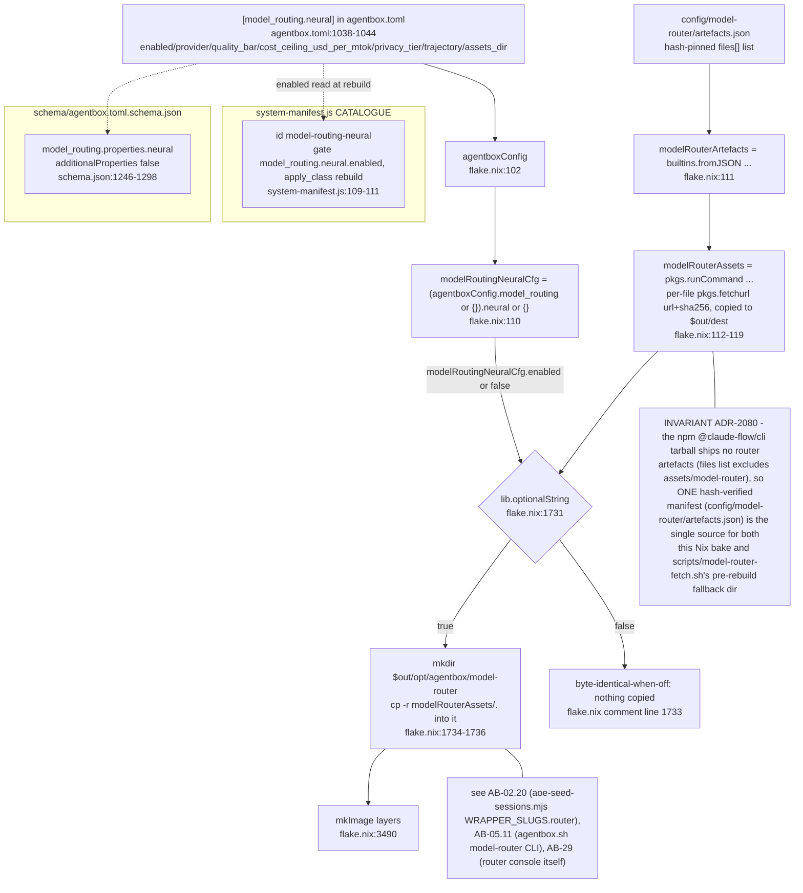

