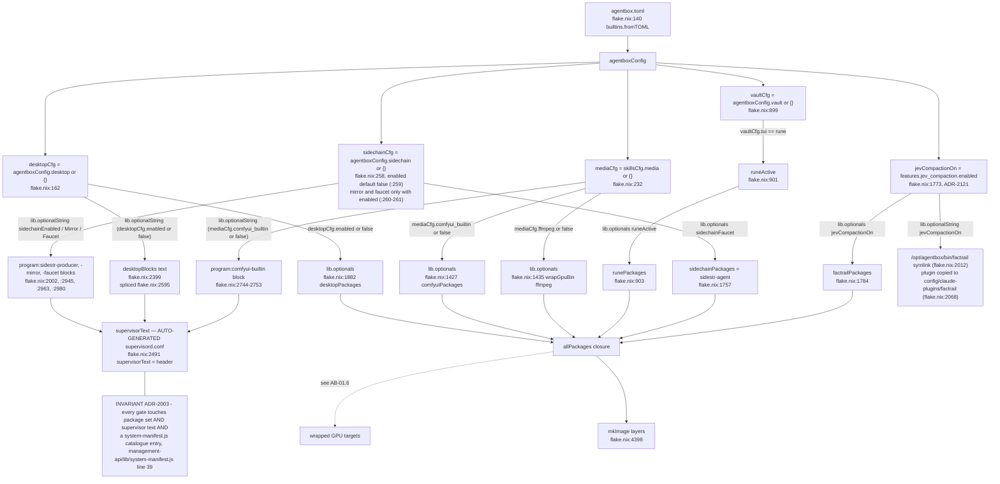
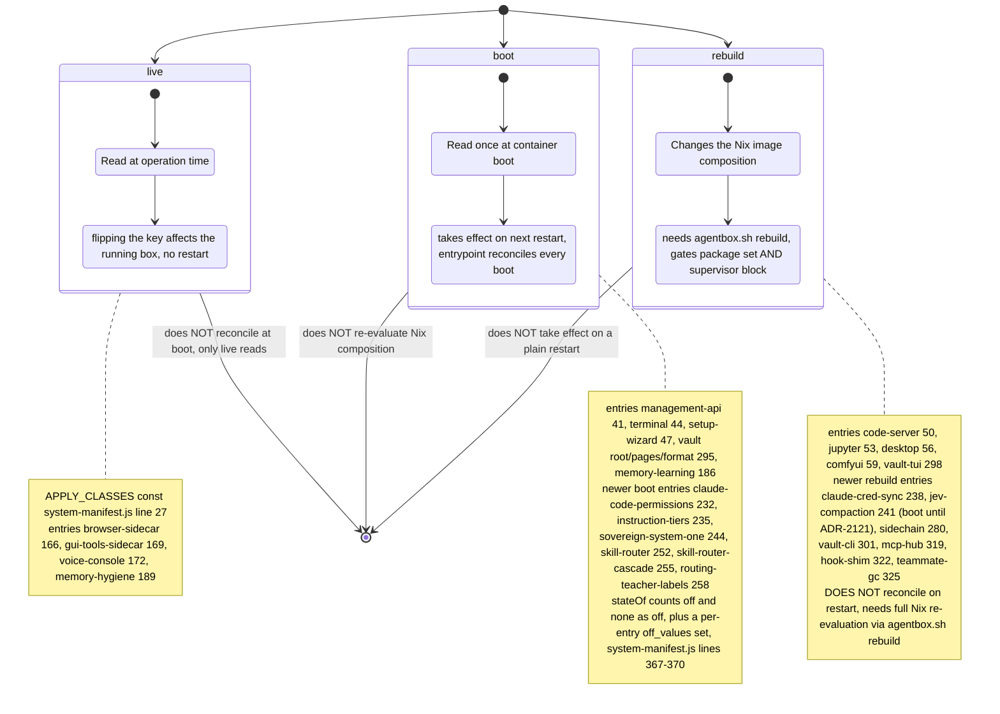
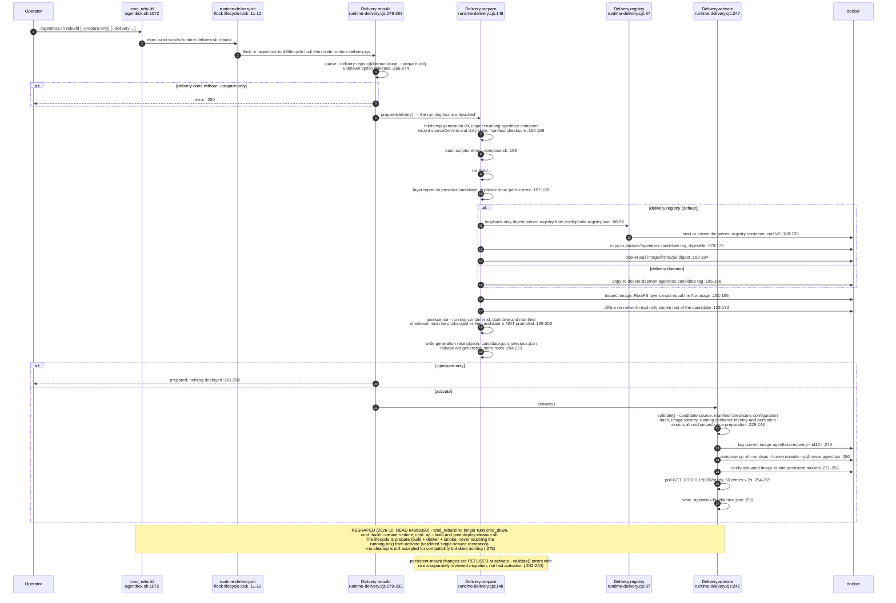
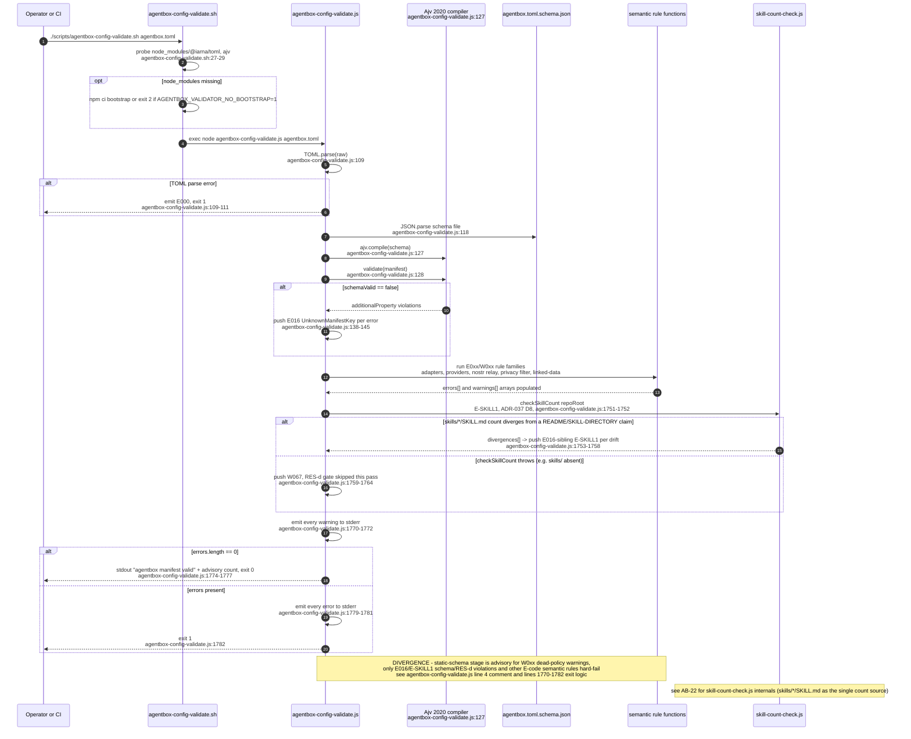
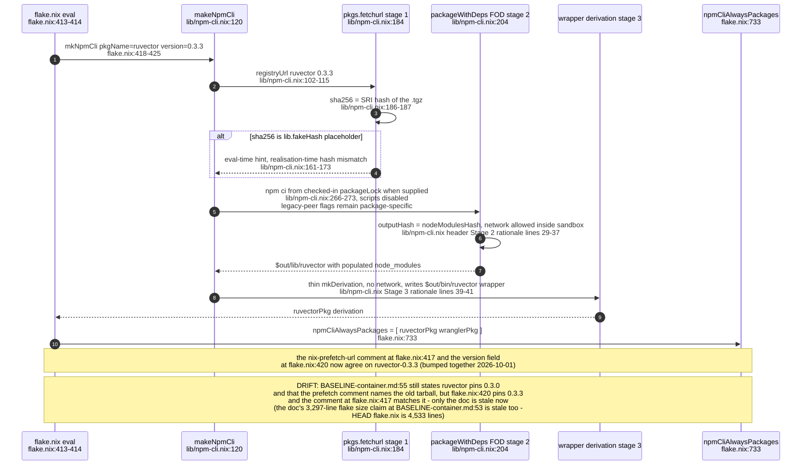
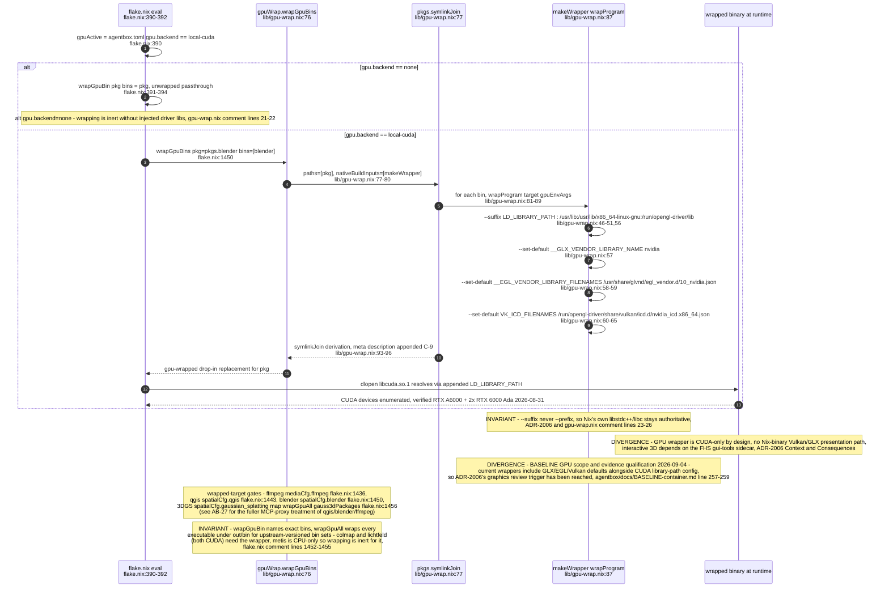
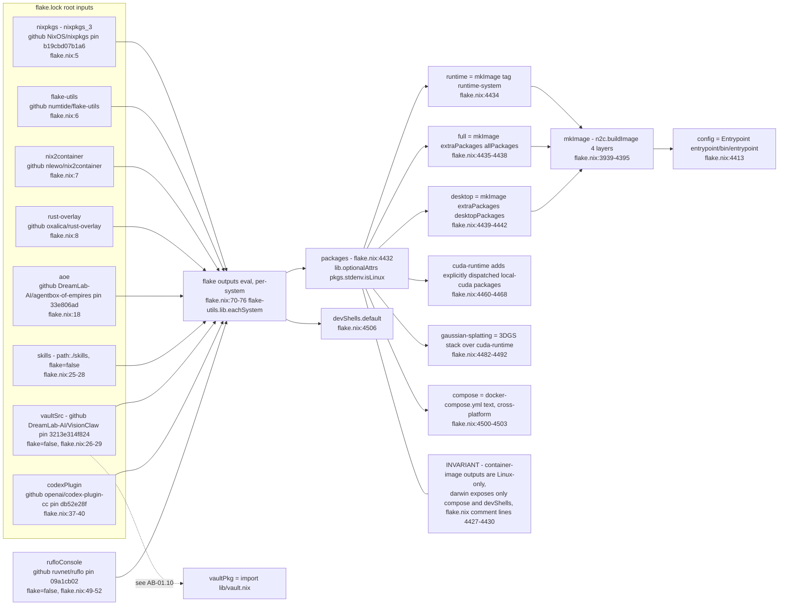
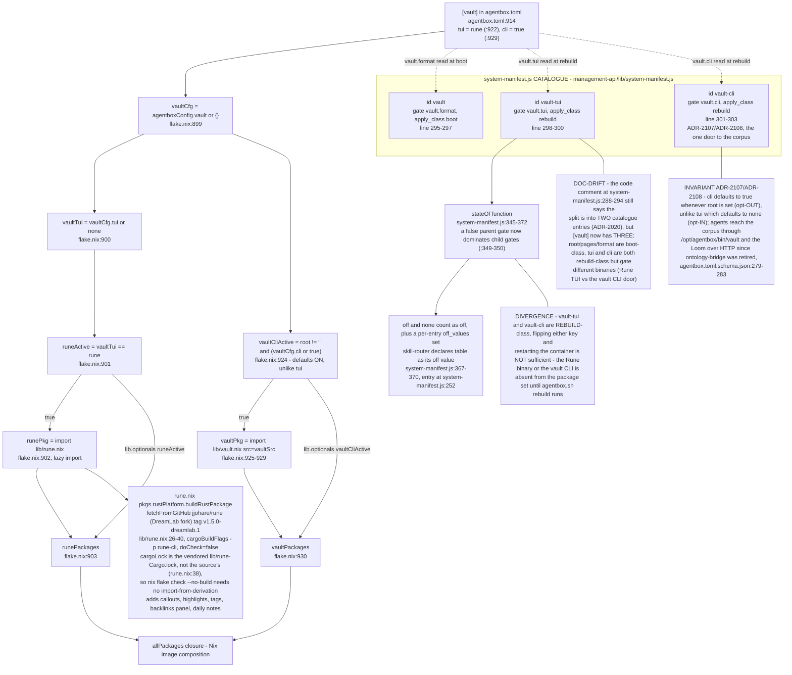
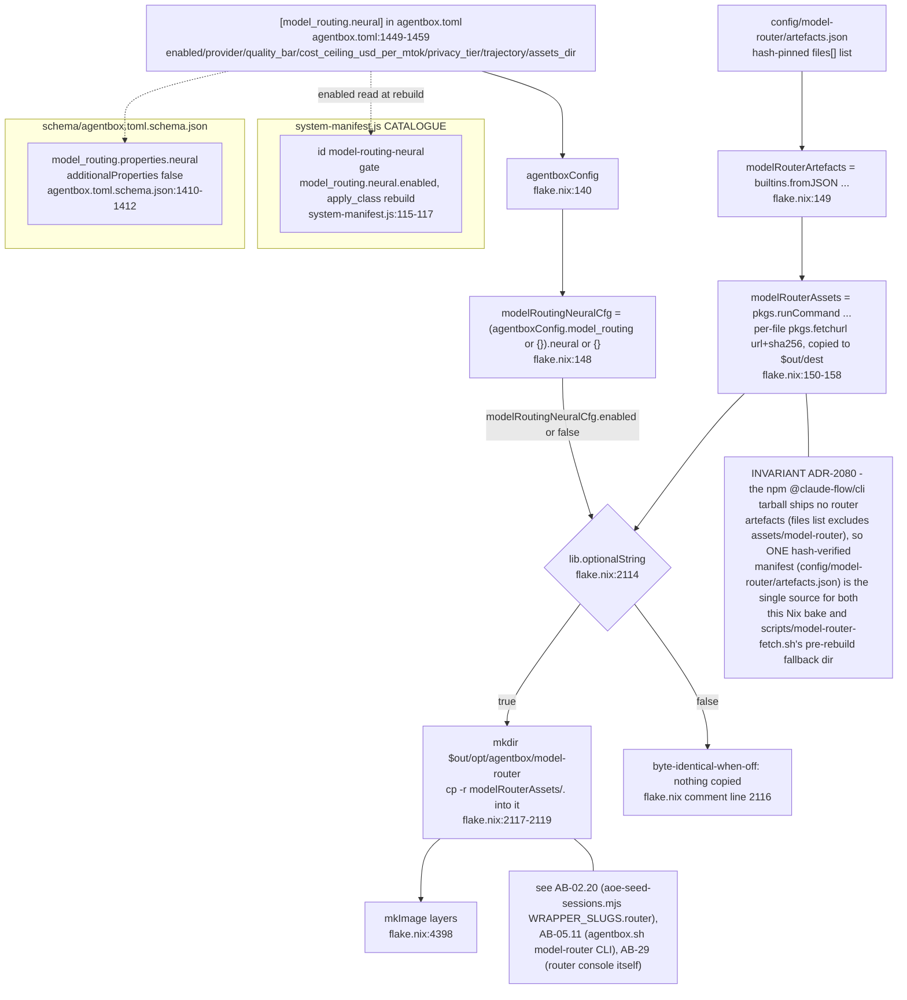

## AB-01.1 agentbox.toml gates to flake.nix conditionals to package set and supervisord text

```mermaid
flowchart TB
    TOML["agentbox.toml<br/>flake.nix:140 builtins.fromTOML"] --> CFG["agentboxConfig"]
    CFG --> DESK["desktopCfg = agentboxConfig.desktop or {}<br/>flake.nix:162"]
    CFG --> MEDIA["mediaCfg = skillsCfg.media or {}<br/>flake.nix:232"]
    CFG --> VAULT["vaultCfg = agentboxConfig.vault or {}<br/>flake.nix:899"]

    DESK -->|"desktopCfg.enabled or false"| DESKOPT["lib.optionals<br/>flake.nix:1882 desktopPackages"]
    MEDIA -->|"mediaCfg.comfyui_builtin or false"| COMFYOPT["lib.optionals<br/>flake.nix:1427 comfyuiPackages"]
    MEDIA -->|"mediaCfg.ffmpeg or false"| FFOPT["lib.optionals<br/>flake.nix:1435 wrapGpuBin ffmpeg"]
    VAULT -->|"vaultCfg.tui == rune"| RUNEOPT["runeActive<br/>flake.nix:901"]

    DESKOPT --> ALLPKG["allPackages closure"]
    COMFYOPT --> ALLPKG
    FFOPT --> ALLPKG
    RUNEOPT -->|"lib.optionals runeActive"| RUNEPKG["runePackages<br/>flake.nix:903"]
    RUNEPKG --> ALLPKG

    DESK -->|"lib.optionalString (desktopCfg.enabled or false)"| DESKSUP["desktopBlocks text<br/>flake.nix:2399<br/>spliced flake.nix:2595"]
    MEDIA -->|"lib.optionalString (mediaCfg.comfyui_builtin or false)"| COMFYSUP["program:comfyui-builtin block<br/>flake.nix:2744-2753"]

    CFG --> SIDE["sidechainCfg = agentboxConfig.sidechain or {}<br/>flake.nix:258, enabled default false (:259)<br/>mirror and faucet only with enabled (:260-261)"]
    SIDE -->|"lib.optionals sidechainFaucet"| SIDEPKG["sidechainPackages = sidestr-agent<br/>flake.nix:1757"]
    SIDEPKG --> ALLPKG
    SIDE -->|"lib.optionalString sidechainEnabled / Mirror / Faucet"| SIDESUP["program:sidestr-producer, -mirror, -faucet blocks<br/>flake.nix:2002, :2945, :2963, :2980"]
    SIDESUP --> SUPTEXT
    CFG --> JEVON["jevCompactionOn = features.jev_compaction.enabled<br/>flake.nix:1773, ADR-2121"]
    JEVON -->|"lib.optionals jevCompactionOn"| FRPKG["factrailPackages<br/>flake.nix:1784"]
    FRPKG --> ALLPKG
    JEVON -->|"lib.optionalString jevCompactionOn"| FRBAKE["/opt/agentbox/bin/factrail symlink (flake.nix:2012)<br/>plugin copied to config/claude-plugins/factrail (flake.nix:2068)"]

    DESKSUP --> SUPTEXT["supervisorText — AUTO-GENERATED supervisord.conf<br/>flake.nix:2491 supervisorText = header"]
    COMFYSUP --> SUPTEXT
    ALLPKG --> MKIMAGE["mkImage layers<br/>flake.nix:4398"]

    ALLPKG -.->|"see AB-01.6"| WRAPTGT["wrapped GPU targets"]

    note1["INVARIANT ADR-2003 - every gate touches package set AND supervisor text AND<br/>a system-manifest.js catalogue entry, management-api/lib/system-manifest.js line 39"]
    SUPTEXT --- note1
```

## AB-01.2 apply_class taxonomy - live, boot, rebuild

```mermaid
stateDiagram-v2
    [*] --> live
    [*] --> boot
    [*] --> rebuild

    state live {
        [*] --> LiveRead
        LiveRead: Read at operation time
        LiveRead --> LiveEffect
        LiveEffect: flipping the key affects the running box, no restart
    }
    state boot {
        [*] --> BootRead
        BootRead: Read once at container boot
        BootRead --> BootEffect
        BootEffect: takes effect on next restart, entrypoint reconciles every boot
    }
    state rebuild {
        [*] --> RebuildRead
        RebuildRead: Changes the Nix image composition
        RebuildRead --> RebuildEffect
        RebuildEffect: needs agentbox.sh rebuild, gates package set AND supervisor block
    }

    note right of live
        APPLY_CLASSES const system-manifest.js line 27
        entries browser-sidecar 166, gui-tools-sidecar 169, voice-console 172, memory-hygiene 189
    end note
    note right of boot
        entries management-api 41, terminal 44, setup-wizard 47, vault root/pages/format 295, memory-learning 186
        newer boot entries claude-code-permissions 232, instruction-tiers 235,<br/>sovereign-system-one 244, skill-router 252, skill-router-cascade 255, routing-teacher-labels 258
        stateOf counts off and none as off, plus a per-entry off_values set, system-manifest.js lines 367-370
    end note
    note right of rebuild
        entries code-server 50, jupyter 53, desktop 56, comfyui 59, vault-tui 298
        newer rebuild entries claude-cred-sync 238, jev-compaction 241 (boot until ADR-2121), sidechain 280,<br/>vault-cli 301, mcp-hub 319, hook-shim 322, teammate-gc 325
        DOES NOT reconcile on restart, needs full Nix re-evaluation via agentbox.sh rebuild
    end note

    live --> [*]: does NOT reconcile at boot, only live reads
    boot --> [*]: does NOT re-evaluate Nix composition
    rebuild --> [*]: does NOT take effect on a plain restart
```

## AB-01.3 ./agentbox.sh rebuild - runtime-delivery prepare, then activate

```mermaid
sequenceDiagram
    autonumber
    participant OP as Operator
    participant REB as cmd_rebuild<br/>agentbox.sh:1072
    participant LOCK as runtime-delivery.sh<br/>flock lifecycle.lock :11-12
    participant RD as Delivery rebuild<br/>runtime-delivery.cjs:279-283
    participant PREP as Delivery.prepare<br/>runtime-delivery.cjs:148
    participant REG as Delivery.registry<br/>runtime-delivery.cjs:87
    participant ACT as Delivery.activate<br/>runtime-delivery.cjs:247
    participant DOCKER as docker

    OP->>REB: ./agentbox.sh rebuild [--prepare-only] [--delivery ...]
    REB->>LOCK: exec bash scripts/runtime-delivery.sh rebuild
    LOCK->>RD: flock -n .agentbox-build/lifecycle.lock then node runtime-delivery.cjs
    RD->>RD: parse --delivery registry|daemon|none, --prepare-only<br/>unknown option rejected, :266-274
    alt delivery none without --prepare-only
        RD-->>OP: error, :280
    end
    RD->>PREP: prepare(delivery) — the running box is untouched
    PREP->>PREP: mkdtemp generation dir, inspect running agentbox container<br/>record sourceCommit and dirty state, manifest checksum :150-158
    PREP->>PREP: bash scripts/refresh-compose.sh :159
    PREP->>PREP: nix build .#runtime .#runtime.copyTo --json :160-161
    PREP->>PREP: layer report vs previous candidate, duplicate store path = error :167-168
    alt delivery registry (default)
        PREP->>REG: loopback-only digest-pinned registry from config/build-registry.json :88-98
        REG->>DOCKER: start or create the pinned registry container, curl /v2 :108-120
        PREP->>DOCKER: copy-to docker://agentbox candidate tag, digestfile :178-179
        PREP->>DOCKER: docker pull image@sha256 digest :183-184
    else delivery daemon
        PREP->>DOCKER: copy-to docker-daemon:agentbox candidate tag :186-188
    end
    PREP->>DOCKER: inspect image, RootFS layers must equal the Nix image :191-195
    PREP->>DOCKER: offline no-network read-only smoke test of the candidate :123-132
    PREP->>PREP: quiescence - running container id, start time and manifest<br/>checksum must be unchanged or the candidate is NOT promoted :199-203
    PREP->>PREP: write generation receipt.json, candidate.json, previous.json<br/>release old generation store roots :204-223
    alt --prepare-only
        RD-->>OP: prepared, nothing deployed :281-282
    else activate
        RD->>ACT: activate()
        ACT->>ACT: validate() - candidate source, manifest checksum, configuration<br/>hash, image identity, running container identity and persistent<br/>mounts all unchanged since preparation :229-246
        ACT->>DOCKER: tag current image agentbox:recovery-<id12> :249
        ACT->>DOCKER: compose up -d --no-deps --force-recreate --pull never agentbox :250
        ACT->>DOCKER: verify activated image id and persistent mounts :251-253
        ACT->>ACT: poll GET 127.0.0.1:9090/ready, 60 retries x 2s :254-255
        ACT->>ACT: write .agentbox-build/active.json :256
    end
    Note over REB,ACT: RESHAPED (2026-10, HEAD 6466e393) - cmd_rebuild no longer runs cmd_down,<br/>cmd_build --variant runtime, cmd_up --build and post-deploy-cleanup.sh.<br/>The lifecycle is prepare (build + deliver + smoke, never touching the<br/>running box) then activate (validated single-service recreation).<br/>--no-cleanup is still accepted for compatibility but does nothing (:273)
    Note over PREP: persistent-mount changes are REFUSED at activate - validate() errors with<br/>use a separately reviewed migration, not fast activation (:242-244)
```

## AB-01.4 Static config validation - schema, semantic rules, then the skill-count gate

```mermaid
sequenceDiagram
    autonumber
    participant OP as Operator or CI
    participant WRAP as agentbox-config-validate.sh
    participant JS as agentbox-config-validate.js
    participant AJV as Ajv 2020 compiler<br/>agentbox-config-validate.js:127
    participant SCHEMA as agentbox.toml.schema.json
    participant SEM as semantic rule functions
    participant SKC as skill-count-check.js

    OP->>WRAP: ./scripts/agentbox-config-validate.sh agentbox.toml
    WRAP->>WRAP: probe node_modules/@iarna/toml, ajv<br/>agentbox-config-validate.sh:27-29
    opt node_modules missing
        WRAP->>WRAP: npm ci bootstrap or exit 2 if AGENTBOX_VALIDATOR_NO_BOOTSTRAP=1
    end
    WRAP->>JS: exec node agentbox-config-validate.js agentbox.toml
    JS->>JS: TOML.parse(raw)<br/>agentbox-config-validate.js:109
    alt TOML parse error
        JS-->>OP: emit E000, exit 1<br/>agentbox-config-validate.js:109-111
    end
    JS->>SCHEMA: JSON.parse schema file<br/>agentbox-config-validate.js:118
    JS->>AJV: ajv.compile(schema)<br/>agentbox-config-validate.js:127
    JS->>AJV: validate(manifest)<br/>agentbox-config-validate.js:128
    alt schemaValid == false
        AJV-->>JS: additionalProperty violations
        JS->>JS: push E016 UnknownManifestKey per error<br/>agentbox-config-validate.js:138-145
    end
    JS->>SEM: run E0xx/W0xx rule families<br/>adapters, providers, nostr relay, privacy filter, linked-data
    SEM-->>JS: errors[] and warnings[] arrays populated
    JS->>SKC: checkSkillCount repoRoot<br/>E-SKILL1, ADR-037 D8, agentbox-config-validate.js:1751-1752
    alt skills/*/SKILL.md count diverges from a README/SKILL-DIRECTORY claim
        SKC-->>JS: divergences[] -> push E016-sibling E-SKILL1 per drift<br/>agentbox-config-validate.js:1753-1758
    else checkSkillCount throws (e.g. skills/ absent)
        JS->>JS: push W067, RES-d gate skipped this pass<br/>agentbox-config-validate.js:1759-1764
    end
    JS->>JS: emit every warning to stderr<br/>agentbox-config-validate.js:1770-1772
    alt errors.length == 0
        JS-->>OP: stdout "agentbox manifest valid" + advisory count, exit 0<br/>agentbox-config-validate.js:1774-1777
    else errors present
        JS->>JS: emit every error to stderr<br/>agentbox-config-validate.js:1779-1781
        JS-->>OP: exit 1<br/>agentbox-config-validate.js:1782
    end

    Note over JS,SEM: DIVERGENCE - static-schema stage is advisory for W0xx dead-policy warnings,<br/>only E016/E-SKILL1 schema/RES-d violations and other E-code semantic rules hard-fail<br/>see agentbox-config-validate.js line 4 comment and lines 1770-1782 exit logic
    Note over SKC: see AB-22 for skill-count-check.js internals (skills/*/SKILL.md as the single count source)
```

## AB-01.5 npm-cli.nix pinned exact-semver closure - ruvector always in package set

```mermaid
sequenceDiagram
    autonumber
    participant FLAKE as flake.nix eval<br/>flake.nix:413-414
    participant MK as makeNpmCli<br/>lib/npm-cli.nix:120
    participant FETCH as pkgs.fetchurl stage 1<br/>lib/npm-cli.nix:184
    participant FOD as packageWithDeps FOD stage 2<br/>lib/npm-cli.nix:204
    participant WRAP as wrapper derivation stage 3
    participant ALWAYS as npmCliAlwaysPackages<br/>flake.nix:733

    FLAKE->>MK: mkNpmCli pkgName=ruvector version=0.3.3<br/>flake.nix:418-425
    MK->>FETCH: registryUrl ruvector 0.3.3<br/>lib/npm-cli.nix:102-115
    FETCH->>FETCH: sha256 = SRI hash of the .tgz<br/>lib/npm-cli.nix:186-187
    alt sha256 is lib.fakeHash placeholder
        FETCH-->>MK: eval-time hint, realisation-time hash mismatch<br/>lib/npm-cli.nix:161-173
    end
    MK->>FOD: npm ci from checked-in packageLock when supplied<br/>lib/npm-cli.nix:266-273, scripts disabled<br/>legacy-peer flags remain package-specific
    FOD->>FOD: outputHash = nodeModulesHash, network allowed inside sandbox<br/>lib/npm-cli.nix header Stage 2 rationale lines 29-37
    FOD-->>MK: $out/lib/ruvector with populated node_modules
    MK->>WRAP: thin mkDerivation, no network, writes $out/bin/ruvector wrapper<br/>lib/npm-cli.nix Stage 3 rationale lines 39-41
    WRAP-->>FLAKE: ruvectorPkg derivation
    FLAKE->>ALWAYS: npmCliAlwaysPackages = [ ruvectorPkg wranglerPkg ]<br/>flake.nix:733
    Note over FLAKE,ALWAYS: the nix-prefetch-url comment at flake.nix:417 and the version field<br/>at flake.nix:420 now agree on ruvector-0.3.3 (bumped together 2026-10-01)
    Note over FLAKE,ALWAYS: DRIFT: BASELINE-container.md:55 still states ruvector pins 0.3.0<br/>and that the prefetch comment names the old tarball, but flake.nix:420 pins 0.3.3<br/>and the comment at flake.nix:417 matches it - only the doc is stale now<br/>(the doc's 3,297-line flake size claim at BASELINE-container.md:53 is stale too -<br/>HEAD flake.nix is 4,533 lines)
```

## AB-01.6 gpu-wrap.nix wrapGpuBins - LD_LIBRARY_PATH suffix and vendor ICDs

```mermaid
sequenceDiagram
    autonumber
    participant FLAKE as flake.nix eval<br/>flake.nix:390-392
    participant WRAP as gpuWrap.wrapGpuBins<br/>lib/gpu-wrap.nix:76
    participant JOIN as pkgs.symlinkJoin<br/>lib/gpu-wrap.nix:77
    participant MAKEW as makeWrapper wrapProgram<br/>lib/gpu-wrap.nix:87
    participant BIN as wrapped binary at runtime

    FLAKE->>FLAKE: gpuActive = agentbox.toml gpu.backend == local-cuda<br/>flake.nix:390
    alt gpu.backend == none
        FLAKE->>FLAKE: wrapGpuBin pkg bins = pkg, unwrapped passthrough<br/>flake.nix:391-394
        Note over FLAKE: alt gpu.backend=none - wrapping is inert without injected driver libs, gpu-wrap.nix comment lines 21-22
    else gpu.backend == local-cuda
        FLAKE->>WRAP: wrapGpuBins pkg=pkgs.blender bins=[blender]<br/>flake.nix:1450
        WRAP->>JOIN: paths=[pkg], nativeBuildInputs=[makeWrapper]<br/>lib/gpu-wrap.nix:77-80
        JOIN->>MAKEW: for each bin, wrapProgram target gpuEnvArgs<br/>lib/gpu-wrap.nix:81-89
        MAKEW->>MAKEW: --suffix LD_LIBRARY_PATH : /usr/lib:/usr/lib/x86_64-linux-gnu:/run/opengl-driver/lib<br/>lib/gpu-wrap.nix:46-51,56
        MAKEW->>MAKEW: --set-default __GLX_VENDOR_LIBRARY_NAME nvidia<br/>lib/gpu-wrap.nix:57
        MAKEW->>MAKEW: --set-default __EGL_VENDOR_LIBRARY_FILENAMES /usr/share/glvnd/egl_vendor.d/10_nvidia.json<br/>lib/gpu-wrap.nix:58-59
        MAKEW->>MAKEW: --set-default VK_ICD_FILENAMES /run/opengl-driver/share/vulkan/icd.d/nvidia_icd.x86_64.json<br/>lib/gpu-wrap.nix:60-65
        JOIN-->>WRAP: symlinkJoin derivation, meta description appended C-9<br/>lib/gpu-wrap.nix:93-96
        WRAP-->>FLAKE: gpu-wrapped drop-in replacement for pkg
        FLAKE->>BIN: dlopen libcuda.so.1 resolves via appended LD_LIBRARY_PATH
        BIN-->>FLAKE: CUDA devices enumerated, verified RTX A6000 + 2x RTX 6000 Ada 2026-08-31
    end

    Note over MAKEW: INVARIANT - --suffix never --prefix, so Nix's own libstdc++/libc stays authoritative,<br/>ADR-2006 and gpu-wrap.nix comment lines 23-26
    Note over BIN: DIVERGENCE - GPU wrapper is CUDA-only by design, no Nix-binary Vulkan/GLX presentation path,<br/>interactive 3D depends on the FHS gui-tools sidecar, ADR-2006 Context and Consequences
    Note over MAKEW: DIVERGENCE - BASELINE GPU scope and evidence qualification 2026-09-04 -<br/>current wrappers include GLX/EGL/Vulkan defaults alongside CUDA library-path config,<br/>so ADR-2006's graphics review trigger has been reached, agentbox/docs/BASELINE-container.md line 257-259

    Note over WRAP: wrapped-target gates - ffmpeg mediaCfg.ffmpeg flake.nix:1436,<br/>qgis spatialCfg.qgis flake.nix:1443, blender spatialCfg.blender flake.nix:1450,<br/>3DGS spatialCfg.gaussian_splatting map wrapGpuAll gauss3dPackages flake.nix:1456<br/>(see AB-27 for the fuller MCP-proxy treatment of qgis/blender/ffmpeg)
    Note over WRAP: INVARIANT - wrapGpuBin names exact bins, wrapGpuAll wraps every<br/>executable under out/bin for upstream-versioned bin sets - colmap and lichtfeld<br/>(both CUDA) need the wrapper, metis is CPU-only so wrapping is inert for it,<br/>flake.nix comment lines 1452-1455
```

## AB-01.8 agentbox.toml schema shape - top-level sections

```mermaid
classDiagram
    class AgentboxToml {
        +GpuSection gpu
        +VaultSection vault
        +SkillsSection skills
        +AdaptersSection adapters
        +CoreSection core
        +FederationSection federation
    }
    class GpuSection {
        +string backend
    }
    class VaultSection {
        +string root
        +string pages
        +string format
        +string tui
        +bool cli
        +string working
        +string transcripts
    }
    class SkillsSection {
        +BrowserSkills browser
        +MediaSkills media
        +SpatialSkills spatial_and_3d
        +DataScienceSkills data_science
    }
    class AdaptersSection {
        +string beads
        +string pods
        +string memory
        +string events
        +string orchestrator
    }
    class CoreSection {
        +string orchestration
        +string vector_db
    }
    class FederationSection {
        +string mode
        +string external_url
    }

    AgentboxToml "1" --> "1" GpuSection
    AgentboxToml "1" --> "1" VaultSection
    AgentboxToml "1" --> "1" SkillsSection
    AgentboxToml "1" --> "1" AdaptersSection
    AgentboxToml "1" --> "1" CoreSection
    AgentboxToml "1" --> "1" FederationSection

    note for GpuSection "backend enum: none, ollama-rocm, ollama-cuda, local-cuda - agentbox.toml.schema.json:106-115"
    note for VaultSection "required: root - agentbox.toml.schema.json:222-224. format enum obsidian ONLY (logseq-legacy withdrawn 2026-09-22, corpus migration complete) - agentbox.toml.schema.json:248-255. tui enum rune, none, default none - agentbox.toml.schema.json:270-278, ADR-2029. cli bool default true - agentbox.toml.schema.json:279-283, ADR-2107/ADR-2108"
    note for AdaptersSection "each value resolves to local-star, external, or off per slot - agentbox/CLAUDE.md adapter contract"
```

## AB-01.9 flake.lock inputs to flake outputs

```mermaid
flowchart LR
    subgraph INPUTS["flake.lock root inputs"]
        NIXPKGS["nixpkgs - nixpkgs_3<br/>github NixOS/nixpkgs pin b19cbd07b1a6<br/>flake.nix:5"]
        FU["flake-utils<br/>github numtide/flake-utils<br/>flake.nix:6"]
        N2C["nix2container<br/>github nlewo/nix2container<br/>flake.nix:7"]
        RO["rust-overlay<br/>github oxalica/rust-overlay<br/>flake.nix:8"]
        AOE["aoe<br/>github DreamLab-AI/agentbox-of-empires pin 33e806ad<br/>flake.nix:18"]
        SKILLS["skills - path:./skills, flake=false<br/>flake.nix:25-28"]
        VAULTSRC["vaultSrc - github DreamLab-AI/VisionClaw pin 3213e314f824<br/>flake=false, flake.nix:26-29"]
        CODEX["codexPlugin<br/>github openai/codex-plugin-cc pin db52e28f<br/>flake.nix:37-40"]
    end

    NIXPKGS --> EVAL["flake outputs eval, per-system<br/>flake.nix:70-76 flake-utils.lib.eachSystem"]
    FU --> EVAL
    N2C --> EVAL
    RO --> EVAL
    AOE --> EVAL
    SKILLS --> EVAL
    VAULTSRC --> EVAL
    CODEX --> EVAL
    RUFLO["rufloConsole<br/>github ruvnet/ruflo pin 09a1cb02<br/>flake=false, flake.nix:49-52"]
    RUFLO --> EVAL

    EVAL --> PACKAGES["packages - flake.nix:4432<br/>lib.optionalAttrs pkgs.stdenv.isLinux"]
    EVAL --> DEVSHELL["devShells.default<br/>flake.nix:4506"]

    PACKAGES --> RUNTIME["runtime = mkImage tag runtime-system<br/>flake.nix:4434"]
    PACKAGES --> FULL["full = mkImage extraPackages allPackages<br/>flake.nix:4435-4438"]
    PACKAGES --> DESKTOP["desktop = mkImage extraPackages desktopPackages<br/>flake.nix:4439-4442"]
    PACKAGES --> CUDART["cuda-runtime adds explicitly dispatched local-cuda packages<br/>flake.nix:4460-4468"]
    PACKAGES --> GSPLAT["gaussian-splatting = 3DGS stack over cuda-runtime<br/>flake.nix:4482-4492"]
    PACKAGES --> COMPOSE["compose = docker-compose.yml text, cross-platform<br/>flake.nix:4500-4503"]

    RUNTIME --> MKIMG["mkImage - n2c.buildImage 4 layers<br/>flake.nix:3939-4395"]
    FULL --> MKIMG
    DESKTOP --> MKIMG

    MKIMG --> ENTRYPOINT["config = Entrypoint entrypoint/bin/entrypoint<br/>flake.nix:4413"]
    VAULTSRC -.->|"see AB-01.10"| VAULTPKG["vaultPkg = import lib/vault.nix"]

    NOTE1["INVARIANT - container-image outputs are Linux-only,<br/>darwin exposes only compose and devShells, flake.nix comment lines 4427-4430"]
    PACKAGES --- NOTE1
```

## AB-01.10 ADR-2029/ADR-2107 vault gates - three catalogue entries, one section

```mermaid
flowchart TB
    TOMLVAULT["[vault] in agentbox.toml<br/>agentbox.toml:914<br/>tui = rune (:922), cli = true (:929)"] --> VAULTCFG["vaultCfg = agentboxConfig.vault or {}<br/>flake.nix:899"]

    VAULTCFG --> TUIVAL["vaultTui = vaultCfg.tui or none<br/>flake.nix:900"]
    TUIVAL --> RUNEACTIVE["runeActive = vaultTui == rune<br/>flake.nix:901"]
    RUNEACTIVE -->|"true"| RUNEPKGIMPORT["runePkg = import lib/rune.nix<br/>flake.nix:902, lazy import"]
    RUNEACTIVE -->|"lib.optionals runeActive"| RUNEPACKAGES["runePackages<br/>flake.nix:903"]
    RUNEPKGIMPORT --> RUNEPACKAGES

    VAULTCFG --> CLIVAL["vaultCliActive = root != '' and (vaultCfg.cli or true)<br/>flake.nix:924 - defaults ON, unlike tui"]
    CLIVAL -->|"true"| VAULTPKGIMPORT["vaultPkg = import lib/vault.nix src=vaultSrc<br/>flake.nix:925-929"]
    CLIVAL -->|"lib.optionals vaultCliActive"| VAULTPACKAGES["vaultPackages<br/>flake.nix:930"]
    VAULTPKGIMPORT --> VAULTPACKAGES

    RUNEPACKAGES --> ALLPKG["allPackages closure - Nix image composition"]
    VAULTPACKAGES --> ALLPKG

    RUNEBUILD["rune.nix pkgs.rustPlatform.buildRustPackage<br/>fetchFromGitHub jjohare/rune (DreamLab fork) tag v1.5.0-dreamlab.1<br/>lib/rune.nix:26-40, cargoBuildFlags -p rune-cli, doCheck=false<br/>cargoLock is the vendored lib/rune-Cargo.lock, not the source's (rune.nix:38),<br/>so nix flake check --no-build needs no import-from-derivation<br/>adds callouts, highlights, tags, backlinks panel, daily notes"]
    RUNEPKGIMPORT --> RUNEBUILD

    subgraph MANIFEST["system-manifest.js CATALOGUE - management-api/lib/system-manifest.js"]
        VAULTENTRY["id vault<br/>gate vault.format, apply_class boot<br/>line 295-297"]
        VAULTTUIENTRY["id vault-tui<br/>gate vault.tui, apply_class rebuild<br/>line 298-300"]
        VAULTCLIENTRY["id vault-cli<br/>gate vault.cli, apply_class rebuild<br/>line 301-303<br/>ADR-2107/ADR-2108, the one door to the corpus"]
    end

    TOMLVAULT -.->|"vault.format read at boot"| VAULTENTRY
    TOMLVAULT -.->|"vault.tui read at rebuild"| VAULTTUIENTRY
    TOMLVAULT -.->|"vault.cli read at rebuild"| VAULTCLIENTRY

    STATEOF["stateOf function<br/>system-manifest.js:345-372<br/>a false parent gate now dominates child gates (:349-350)"]
    VAULTTUIENTRY --> STATEOF
    STATEOF --> MODESTRING["off and none count as off, plus a per-entry off_values set<br/>skill-router declares table as its off value<br/>system-manifest.js:367-370, entry at system-manifest.js:252"]

    NOTE1["DOC-DRIFT - the code comment at system-manifest.js:288-294 still says the<br/>split is into TWO catalogue entries (ADR-2020), but [vault] now has THREE:<br/>root/pages/format are boot-class, tui and cli are both rebuild-class but gate<br/>different binaries (Rune TUI vs the vault CLI door)"]
    VAULTTUIENTRY --- NOTE1

    NOTE2["DIVERGENCE - vault-tui and vault-cli are REBUILD-class, flipping either key and<br/>restarting the container is NOT sufficient - the Rune binary or the vault CLI is<br/>absent from the package set until agentbox.sh rebuild runs"]
    STATEOF --- NOTE2

    NOTE3["INVARIANT ADR-2107/ADR-2108 - cli defaults to true whenever root is set (opt-OUT),<br/>unlike tui which defaults to none (opt-IN); agents reach the corpus through<br/>/opt/agentbox/bin/vault and the Loom over HTTP since ontology-bridge was retired,<br/>agentbox.toml.schema.json:279-283"]
    VAULTCLIENTRY --- NOTE3
```

## AB-01.11 ADR-2080 model_routing.neural gate - pinned artefacts baked into the image (rebuild-class)

```mermaid
flowchart TB
    TOML2["[model_routing.neural] in agentbox.toml<br/>agentbox.toml:1449-1459<br/>enabled/provider/quality_bar/cost_ceiling_usd_per_mtok/privacy_tier/trajectory/assets_dir"] --> CFG2["agentboxConfig<br/>flake.nix:140"]
    CFG2 --> MRNCFG["modelRoutingNeuralCfg = (agentboxConfig.model_routing or {}).neural or {}<br/>flake.nix:148"]
    ARTJSON["config/model-router/artefacts.json<br/>hash-pinned files[] list"] --> MRNFETCH["modelRouterArtefacts = builtins.fromJSON ...<br/>flake.nix:149"]
    MRNFETCH --> MRNASSETS["modelRouterAssets = pkgs.runCommand ...<br/>per-file pkgs.fetchurl url+sha256, copied to $out/dest<br/>flake.nix:150-158"]

    MRNCFG -->|"modelRoutingNeuralCfg.enabled or false"| GATE{"lib.optionalString<br/>flake.nix:2114"}
    MRNASSETS --> GATE
    GATE -->|true| BAKE["mkdir $out/opt/agentbox/model-router<br/>cp -r modelRouterAssets/. into it<br/>flake.nix:2117-2119"]
    GATE -->|false| SKIP["byte-identical-when-off: nothing copied<br/>flake.nix comment line 2116"]
    BAKE --> ALLPKG2["mkImage layers<br/>flake.nix:4398"]

    subgraph MANIFEST2["system-manifest.js CATALOGUE"]
        MRNENTRY["id model-routing-neural<br/>gate model_routing.neural.enabled, apply_class rebuild<br/>system-manifest.js:115-117"]
    end
    TOML2 -.->|"enabled read at rebuild"| MRNENTRY

    subgraph SCHEMA2["schema/agentbox.toml.schema.json"]
        NEURALSCHEMA["model_routing.properties.neural<br/>additionalProperties false<br/>agentbox.toml.schema.json:1410-1412"]
    end
    TOML2 -.-> NEURALSCHEMA

    NOTE1["INVARIANT ADR-2080 - the npm @claude-flow/cli tarball ships no router<br/>artefacts (files list excludes assets/model-router), so ONE hash-verified<br/>manifest (config/model-router/artefacts.json) is the single source for both<br/>this Nix bake and scripts/model-router-fetch.sh's pre-rebuild fallback dir"]
    MRNASSETS --- NOTE1

    NOTE2["see AB-02.20 (aoe-seed-sessions.mjs WRAPPER_SLUGS.router),<br/>AB-05.11 (agentbox.sh model-router CLI), AB-29 (router console itself)"]
    BAKE --- NOTE2
```
