## AB-02.1 boot phases 1-3 — vault resolution, directories, sovereign identity
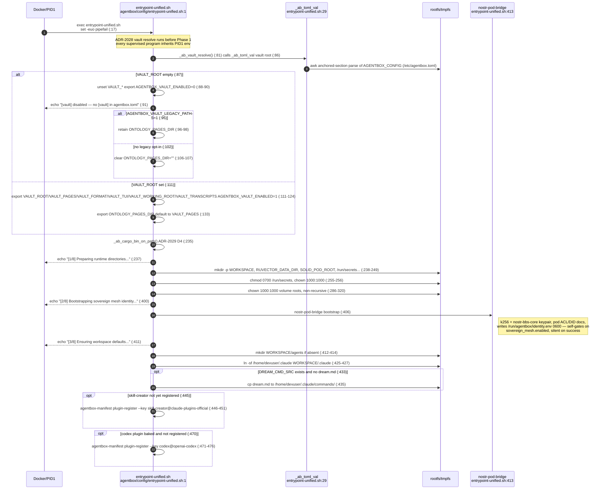
```mermaid
sequenceDiagram
    autonumber
    participant D as Docker/PID1
    participant E as entrypoint-unified.sh<br/>agentbox/config/entrypoint-unified.sh:1
    participant TV as _ab_toml_val<br/>entrypoint-unified.sh:29
    participant FS as rootfs/tmpfs
    participant NPB as nostr-pod-bridge<br/>entrypoint-unified.sh:413

    D->>E: exec entrypoint-unified.sh<br/>set -euo pipefail (:17)
    Note over E: ADR-2028 vault resolve runs before Phase 1<br/>every supervised program inherits PID1 env
    E->>TV: _ab_vault_resolve() (:81) calls _ab_toml_val vault root (:86)
    TV->>FS: awk anchored-section parse of AGENTBOX_CONFIG (/etc/agentbox.toml)
    alt VAULT_ROOT empty (:87)
        E->>E: unset VAULT_* export AGENTBOX_VAULT_ENABLED=0 (:88-90)
        E-->>D: echo "[vault] disabled — no [vault] in agentbox.toml" (:91)
        alt AGENTBOX_VAULT_LEGACY_PATHS=1 (:95)
            E->>E: retain ONTOLOGY_PAGES_DIR (:96-98)
        else no legacy opt-in (:102)
            E->>E: clear ONTOLOGY_PAGES_DIR="" (:106-107)
        end
    else VAULT_ROOT set (:111)
        E->>E: export VAULT_ROOT/VAULT_PAGES/VAULT_FORMAT/VAULT_TUI/VAULT_WORKING_ROOT/VAULT_TRANSCRIPTS AGENTBOX_VAULT_ENABLED=1 (:111-124)
        E->>E: export ONTOLOGY_PAGES_DIR default to VAULT_PAGES (:133)
    end
    E->>E: _ab_cargo_bin_on_path() ADR-2029 D4 (:235)
    E-->>D: echo "[1/8] Preparing runtime directories..." (:237)
    E->>FS: mkdir -p WORKSPACE, RUVECTOR_DATA_DIR, SOLID_POD_ROOT, /run/secrets... (:238-249)
    E->>FS: chmod 0700 /run/secrets, chown 1000:1000 (:255-256)
    E->>FS: chown 1000:1000 volume roots, non-recursive (:286-320)
    E-->>D: echo "[2/8] Bootstrapping sovereign mesh identity..." (:400)
    E->>NPB: nostr-pod-bridge bootstrap (:406)
    Note right of NPB: k256 + nostr-bbs-core keypair, pod ACL/DID docs,<br/>writes /run/agentbox/identity.env 0600 — self-gates on<br/>sovereign_mesh.enabled, silent on success
    E-->>D: echo "[3/8] Ensuring workspace defaults..." (:411)
    E->>FS: mkdir WORKSPACE/agents if absent (:412-414)
    E->>FS: ln -sf /home/devuser/.claude WORKSPACE/.claude (:425-427)
    opt DREAM_CMD_SRC exists and no dream.md (:433)
        E->>FS: cp dream.md to /home/devuser/.claude/commands/ (:435)
    end
    opt skill-creator not yet registered (:445)
        E->>E: agentbox-manifest plugin-register --key skill-creator@claude-plugins-official (:446-451)
    end
    opt codex plugin baked and not registered (:470)
        E->>E: agentbox-manifest plugin-register --key codex@openai-codex (:471-476)
    end
```

## AB-02.2 boot phases 4-6 — provisioning, artifact validation, supervisord exec, Stage B closure probes
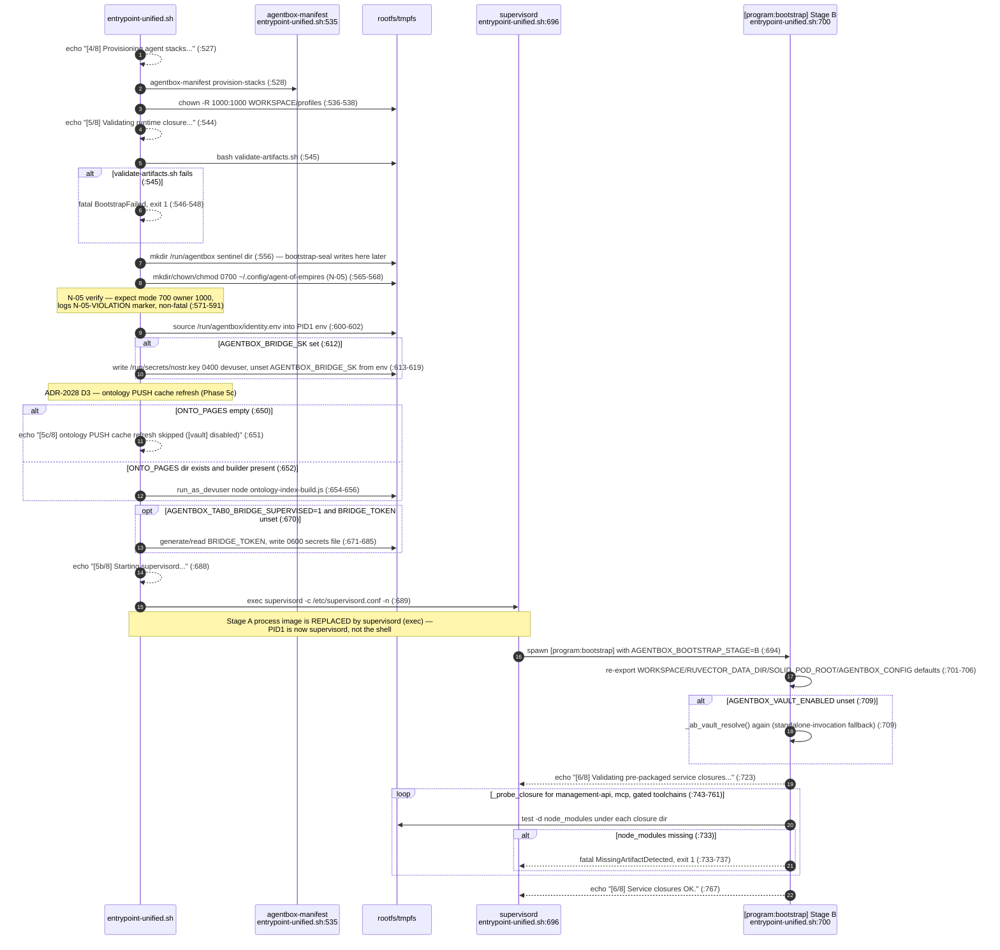
```mermaid
sequenceDiagram
    autonumber
    participant E as entrypoint-unified.sh
    participant AM as agentbox-manifest<br/>entrypoint-unified.sh:535
    participant FS as rootfs/tmpfs
    participant SV as supervisord<br/>entrypoint-unified.sh:696
    participant B as [program:bootstrap] Stage B<br/>entrypoint-unified.sh:700

    E-->>E: echo "[4/8] Provisioning agent stacks..." (:527)
    E->>AM: agentbox-manifest provision-stacks (:528)
    E->>FS: chown -R 1000:1000 WORKSPACE/profiles (:536-538)
    E-->>E: echo "[5/8] Validating runtime closure..." (:544)
    E->>FS: bash validate-artifacts.sh (:545)
    alt validate-artifacts.sh fails (:545)
        E-->>E: fatal BootstrapFailed, exit 1 (:546-548)
    end
    E->>FS: mkdir /run/agentbox sentinel dir (:556) — bootstrap-seal writes here later
    E->>FS: mkdir/chown/chmod 0700 ~/.config/agent-of-empires (N-05) (:565-568)
    Note over E: N-05 verify — expect mode 700 owner 1000,<br/>logs N-05-VIOLATION marker, non-fatal (:571-591)
    E->>FS: source /run/agentbox/identity.env into PID1 env (:600-602)
    alt AGENTBOX_BRIDGE_SK set (:612)
        E->>FS: write /run/secrets/nostr.key 0400 devuser, unset AGENTBOX_BRIDGE_SK from env (:613-619)
    end
    Note over E: ADR-2028 D3 — ontology PUSH cache refresh (Phase 5c)
    alt ONTO_PAGES empty (:650)
        E-->>E: echo "[5c/8] ontology PUSH cache refresh skipped ([vault] disabled)" (:651)
    else ONTO_PAGES dir exists and builder present (:652)
        E->>FS: run_as_devuser node ontology-index-build.js (:654-656)
    end
    opt AGENTBOX_TAB0_BRIDGE_SUPERVISED=1 and BRIDGE_TOKEN unset (:670)
        E->>FS: generate/read BRIDGE_TOKEN, write 0600 secrets file (:671-685)
    end
    E-->>E: echo "[5b/8] Starting supervisord..." (:688)
    E->>SV: exec supervisord -c /etc/supervisord.conf -n (:689)
    Note over E,SV: Stage A process image is REPLACED by supervisord (exec) —<br/>PID1 is now supervisord, not the shell
    SV->>B: spawn [program:bootstrap] with AGENTBOX_BOOTSTRAP_STAGE=B (:694)
    B->>B: re-export WORKSPACE/RUVECTOR_DATA_DIR/SOLID_POD_ROOT/AGENTBOX_CONFIG defaults (:701-706)
    alt AGENTBOX_VAULT_ENABLED unset (:709)
        B->>B: _ab_vault_resolve() again (standalone-invocation fallback) (:709)
    end
    B-->>SV: echo "[6/8] Validating pre-packaged service closures..." (:723)
    loop _probe_closure for management-api, mcp, gated toolchains (:743-761)
        B->>FS: test -d node_modules under each closure dir
        alt node_modules missing (:733)
            B-->>SV: fatal MissingArtifactDetected, exit 1 (:733-737)
        end
    end
    B-->>SV: echo "[6/8] Service closures OK." (:767)
```

## AB-02.3 boot phases 7-8 — ruflo plugins, manifest projection, runtime-env publish
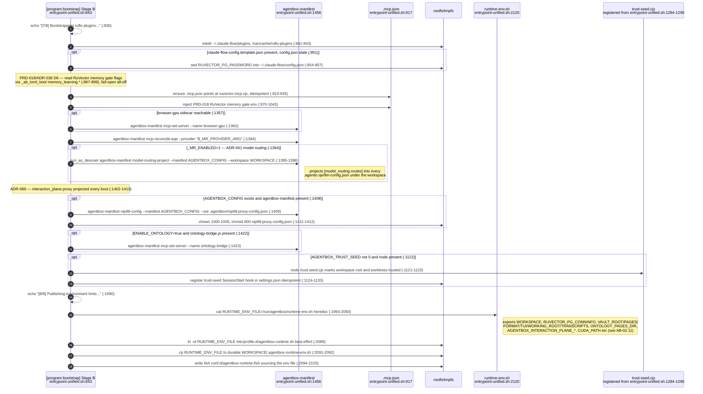
```mermaid
sequenceDiagram
    autonumber
    participant B as [program:bootstrap] Stage B<br/>entrypoint-unified.sh:843
    participant AM as agentbox-manifest<br/>entrypoint-unified.sh:1456
    participant MCP as .mcp.json<br/>entrypoint-unified.sh:917
    participant FS as rootfs/tmpfs
    participant RT as runtime-env.sh<br/>entrypoint-unified.sh:2120
    participant TS as trust-seed.cjs<br/>registered from entrypoint-unified.sh:1284-1295

    B-->>B: echo "[7/8] Bootstrapping ruflo plugins..." (:836)
    B->>FS: mkdir ~/.claude-flow/plugins, /var/cache/ruflo-plugins (:841-843)
    opt claude-flow-config.template.json present, config.json stale (:851)
        B->>FS: sed RUVECTOR_PG_PASSWORD into ~/.claude-flow/config.json (:854-857)
    end
    Note over B: PRD-018/ADR-036 D6 — read RuVector memory gate flags<br/>via _ab_toml_bool memory_learning.* (:867-899), fail-open all-off
    B->>MCP: ensure .mcp.json points at ruvector-mcp.cjs, idempotent (:910-935)
    B->>MCP: inject PRD-018 RuVector memory gate env (:970-1043)
    opt browser-gpu sidecar reachable (:1357)
        B->>AM: agentbox-manifest mcp-set-server --name browser-gpu (:1362)
    end
    B->>AM: agentbox-manifest mcp-reconcile-aqe --provider "$_MR_PROVIDER_ARG" (:1384)
    opt _MR_ENABLED=1 — ADR-041 model routing (:1394)
        B->>AM: run_as_devuser agentbox-manifest model-routing-project --manifest AGENTBOX_CONFIG --workspace WORKSPACE (:1395-1398)
        Note right of AM: projects [model_routing.routes] into every<br/>.agentic-qe/llm-config.json under the workspace
    end
    Note over B: ADR-069 — interaction_plane.proxy projected every boot (:1402-1413)
    opt AGENTBOX_CONFIG exists and agentbox-manifest present (:1408)
        B->>AM: agentbox-manifest nip98-config --manifest AGENTBOX_CONFIG --out .agentbox/nip98-proxy-config.json (:1409)
        B->>FS: chown 1000:1000, chmod 600 nip98-proxy-config.json (:1411-1412)
    end
    opt ENABLE_ONTOLOGY=true and ontology-bridge.js present (:1422)
        B->>AM: agentbox-manifest mcp-set-server --name ontology-bridge (:1423)
    end
    opt AGENTBOX_TRUST_SEED not 0 and node present (:1122)
        B->>TS: node trust-seed.cjs marks workspace root and worktrees trusted (:1121-1123)
        B->>FS: register trust-seed SessionStart hook in settings.json idempotent (:1124-1133)
    end
    B-->>B: echo "[8/8] Publishing environment hints..." (:1990)
    B->>RT: cat RUNTIME_ENV_FILE=/run/agentbox/runtime-env.sh heredoc (:1994-2050)
    Note right of RT: exports WORKSPACE, RUVECTOR_PG_CONNINFO, VAULT_ROOT/PAGES/<br/>FORMAT/TUI/WORKING_ROOT/TRANSCRIPTS, ONTOLOGY_PAGES_DIR,<br/>AGENTBOX_INTERACTION_PLANE_*, CUDA_PATH etc (see AB-02.11)
    B->>FS: ln -sf RUNTIME_ENV_FILE /etc/profile.d/agentbox-runtime.sh best-effort (:2088)
    B->>FS: cp RUNTIME_ENV_FILE to durable WORKSPACE/.agentbox-runtime-env.sh (:2091-2092)
    B->>FS: write fish conf.d/agentbox-runtime.fish sourcing the env file (:2094-2103)
```

## AB-02.4 supervision tree — core and identity programs
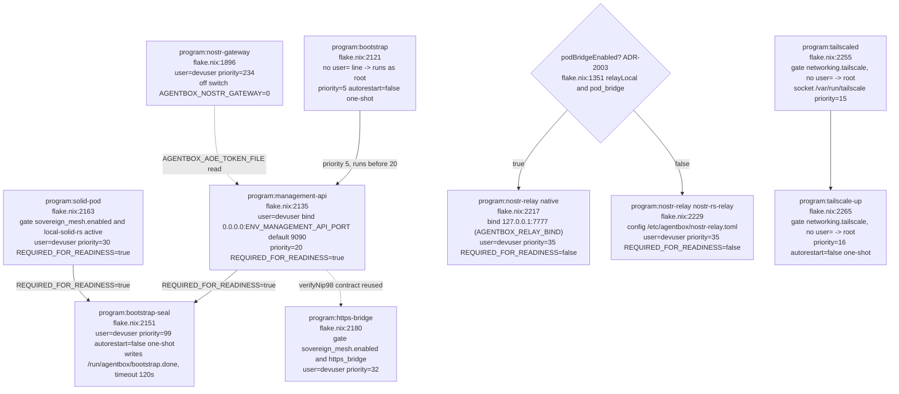
```mermaid
flowchart TB
    BOOT["program:bootstrap<br/>flake.nix:2121<br/>no user= line -&gt; runs as root<br/>priority=5 autorestart=false one-shot"]
    MGMT["program:management-api<br/>flake.nix:2135<br/>user=devuser bind 0.0.0.0:ENV_MANAGEMENT_API_PORT default 9090<br/>priority=20 REQUIRED_FOR_READINESS=true"]
    SEAL["program:bootstrap-seal<br/>flake.nix:2151<br/>user=devuser priority=99 autorestart=false one-shot<br/>writes /run/agentbox/bootstrap.done, timeout 120s"]
    SOLID["program:solid-pod<br/>flake.nix:2163<br/>gate sovereign_mesh.enabled and local-solid-rs active<br/>user=devuser priority=30 REQUIRED_FOR_READINESS=true"]
    HTTPSB["program:https-bridge<br/>flake.nix:2180<br/>gate sovereign_mesh.enabled and https_bridge<br/>user=devuser priority=32"]
    GATERELAY{"podBridgeEnabled? ADR-2003<br/>flake.nix:1351 relayLocal and pod_bridge"}
    NRELAY1["program:nostr-relay native<br/>flake.nix:2217<br/>bind 127.0.0.1:7777 (AGENTBOX_RELAY_BIND)<br/>user=devuser priority=35 REQUIRED_FOR_READINESS=false"]
    NRELAY2["program:nostr-relay nostr-rs-relay<br/>flake.nix:2229<br/>config /etc/agentbox/nostr-relay.toml<br/>user=devuser priority=35 REQUIRED_FOR_READINESS=false"]
    NGW["program:nostr-gateway<br/>flake.nix:1896<br/>user=devuser priority=234<br/>off switch AGENTBOX_NOSTR_GATEWAY=0"]
    TSD["program:tailscaled<br/>flake.nix:2255<br/>gate networking.tailscale, no user= -&gt; root<br/>socket /var/run/tailscale priority=15"]
    TSU["program:tailscale-up<br/>flake.nix:2265<br/>gate networking.tailscale, no user= -&gt; root<br/>priority=16 autorestart=false one-shot"]

    BOOT -->|"priority 5, runs before 20"| MGMT
    MGMT -->|"REQUIRED_FOR_READINESS=true"| SEAL
    SOLID -->|"REQUIRED_FOR_READINESS=true"| SEAL
    GATERELAY -->|true| NRELAY1
    GATERELAY -->|false| NRELAY2
    MGMT -.->|"verifyNip98 contract reused"| HTTPSB
    TSD --> TSU
    NGW -.->|"AGENTBOX_AOE_TOKEN_FILE read"| MGMT
```

## AB-02.5 supervision tree — memory and scheduled programs
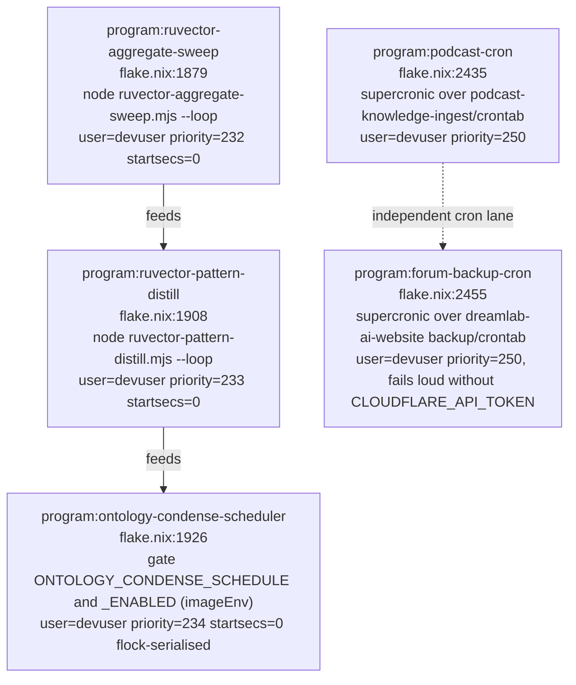
```mermaid
flowchart TB
    RAS["program:ruvector-aggregate-sweep<br/>flake.nix:1879<br/>node ruvector-aggregate-sweep.mjs --loop<br/>user=devuser priority=232 startsecs=0"]
    RPD["program:ruvector-pattern-distill<br/>flake.nix:1908<br/>node ruvector-pattern-distill.mjs --loop<br/>user=devuser priority=233 startsecs=0"]
    OCS["program:ontology-condense-scheduler<br/>flake.nix:1926<br/>gate ONTOLOGY_CONDENSE_SCHEDULE and _ENABLED (imageEnv)<br/>user=devuser priority=234 startsecs=0 flock-serialised"]
    PCRON["program:podcast-cron<br/>flake.nix:2435<br/>supercronic over podcast-knowledge-ingest/crontab<br/>user=devuser priority=250"]
    FCRON["program:forum-backup-cron<br/>flake.nix:2455<br/>supercronic over dreamlab-ai-website backup/crontab<br/>user=devuser priority=250, fails loud without CLOUDFLARE_API_TOKEN"]

    RAS -->|"feeds"| RPD
    RPD -->|"feeds"| OCS
    PCRON -.->|"independent cron lane"| FCRON
```

## AB-02.6 supervision tree — gated toolchain programs
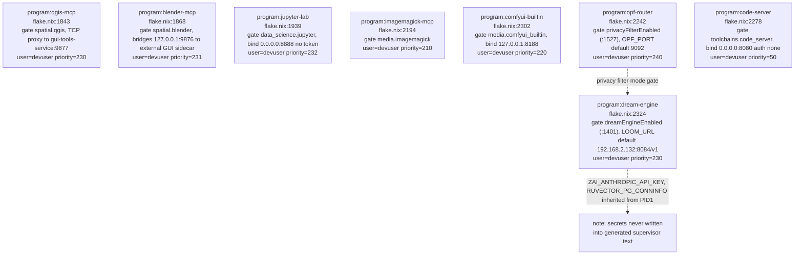
```mermaid
flowchart TB
    QGIS["program:qgis-mcp<br/>flake.nix:1843<br/>gate spatial.qgis, TCP proxy to gui-tools-service:9877<br/>user=devuser priority=230"]
    BLEND["program:blender-mcp<br/>flake.nix:1868<br/>gate spatial.blender, bridges 127.0.0.1:9876 to external GUI sidecar<br/>user=devuser priority=231"]
    JLAB["program:jupyter-lab<br/>flake.nix:1939<br/>gate data_science.jupyter, bind 0.0.0.0:8888 no token<br/>user=devuser priority=232"]
    IMGM["program:imagemagick-mcp<br/>flake.nix:2194<br/>gate media.imagemagick<br/>user=devuser priority=210"]
    COMFY["program:comfyui-builtin<br/>flake.nix:2302<br/>gate media.comfyui_builtin, bind 127.0.0.1:8188<br/>user=devuser priority=220"]
    OPF["program:opf-router<br/>flake.nix:2242<br/>gate privacyFilterEnabled (:1527), OPF_PORT default 9092<br/>user=devuser priority=240"]
    DREAM["program:dream-engine<br/>flake.nix:2324<br/>gate dreamEngineEnabled (:1401), LOOM_URL default 192.168.2.132:8084/v1<br/>user=devuser priority=230"]
    CODES["program:code-server<br/>flake.nix:2278<br/>gate toolchains.code_server, bind 0.0.0.0:8080 auth none<br/>user=devuser priority=50"]

    OPF -.->|"privacy filter mode gate"| DREAM
    DREAM -.->|"ZAI_ANTHROPIC_API_KEY, RUVECTOR_PG_CONNINFO inherited from PID1"| RVNOTE["note: secrets never written<br/>into generated supervisor text"]
```

## AB-02.7 supervision tree — desktop stack and interaction plane
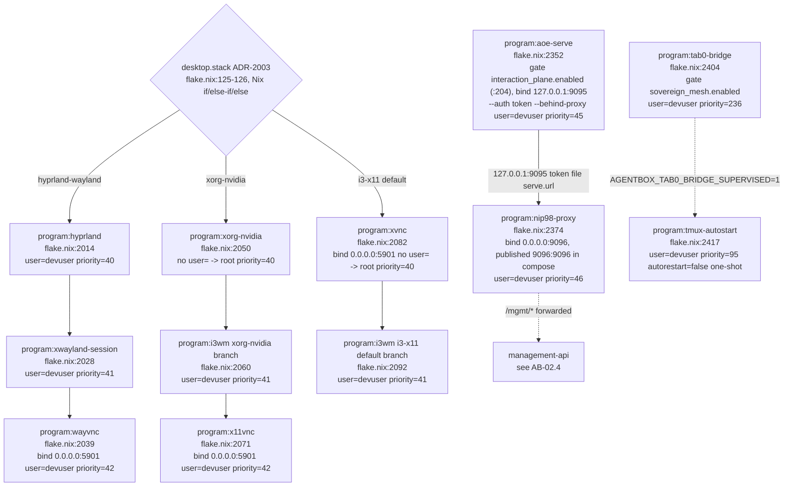
```mermaid
flowchart TB
    GATESTACK{"desktop.stack ADR-2003<br/>flake.nix:125-126, Nix if/else-if/else"}
    HYPR["program:hyprland<br/>flake.nix:2014<br/>user=devuser priority=40"]
    XWAY["program:xwayland-session<br/>flake.nix:2028<br/>user=devuser priority=41"]
    WAYVNC["program:wayvnc<br/>flake.nix:2039<br/>bind 0.0.0.0:5901 user=devuser priority=42"]
    XORG["program:xorg-nvidia<br/>flake.nix:2050<br/>no user= -&gt; root priority=40"]
    I3A["program:i3wm xorg-nvidia branch<br/>flake.nix:2060<br/>user=devuser priority=41"]
    X11VNC["program:x11vnc<br/>flake.nix:2071<br/>bind 0.0.0.0:5901 user=devuser priority=42"]
    XVNC["program:xvnc<br/>flake.nix:2082<br/>bind 0.0.0.0:5901 no user= -&gt; root priority=40"]
    I3B["program:i3wm i3-x11 default branch<br/>flake.nix:2092<br/>user=devuser priority=41"]
    AOE["program:aoe-serve<br/>flake.nix:2352<br/>gate interaction_plane.enabled (:204), bind 127.0.0.1:9095<br/>--auth token --behind-proxy user=devuser priority=45"]
    NIP98["program:nip98-proxy<br/>flake.nix:2374<br/>bind 0.0.0.0:9096, published 9096:9096 in compose<br/>user=devuser priority=46"]
    TAB0["program:tab0-bridge<br/>flake.nix:2404<br/>gate sovereign_mesh.enabled<br/>user=devuser priority=236"]
    TMUX["program:tmux-autostart<br/>flake.nix:2417<br/>user=devuser priority=95 autorestart=false one-shot"]

    GATESTACK -->|"hyprland-wayland"| HYPR --> XWAY --> WAYVNC
    GATESTACK -->|"xorg-nvidia"| XORG --> I3A --> X11VNC
    GATESTACK -->|"i3-x11 default"| XVNC --> I3B
    AOE -->|"127.0.0.1:9095 token file serve.url"| NIP98
    NIP98 -.->|"/mgmt/* forwarded"| MGMTREF["management-api<br/>see AB-02.4"]
    TAB0 -.->|"AGENTBOX_TAB0_BRIDGE_SUPERVISED=1"| TMUX
```

## AB-02.8 PID1 root, priority ordering and bootstrap-seal
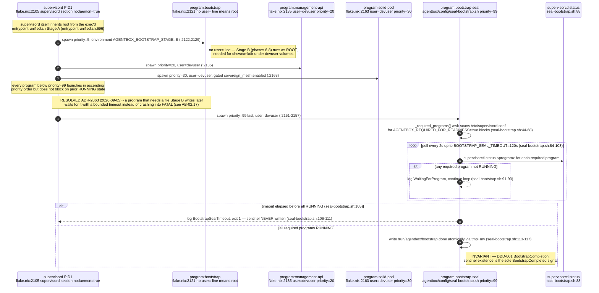
```mermaid
sequenceDiagram
    autonumber
    participant SV as supervisord PID1<br/>flake.nix:2105 supervisord section nodaemon=true
    participant BOOT as program:bootstrap<br/>flake.nix:2121 no user= line means root
    participant MGMT as program:management-api<br/>flake.nix:2135 user=devuser priority=20
    participant SOLID as program:solid-pod<br/>flake.nix:2163 user=devuser priority=30
    participant SEAL as program:bootstrap-seal<br/>agentbox/config/seal-bootstrap.sh priority=99
    participant SC as supervisorctl status<br/>seal-bootstrap.sh:88

    Note over SV: supervisord itself inherits root from the exec'd<br/>entrypoint-unified.sh Stage A (entrypoint-unified.sh:696)
    SV->>BOOT: spawn priority=5, environment AGENTBOX_BOOTSTRAP_STAGE=B (:2122,2129)
    Note right of BOOT: no user= line — Stage B (phases 6-8) runs as ROOT,<br/>needed for chown/mkdir under devuser volumes
    SV->>MGMT: spawn priority=20, user=devuser (:2135)
    SV->>SOLID: spawn priority=30, user=devuser, gated sovereign_mesh.enabled (:2163)
    Note over SV: every program below priority=99 launches in ascending<br/>priority order but does not block on prior RUNNING state
    Note over SV,BOOT: RESOLVED ADR-2063 (2026-09-05) - a program that needs a file Stage B writes later<br/>waits for it with a bounded timeout instead of crashing into FATAL (see AB-02.17)
    SV->>SEAL: spawn priority=99 last, user=devuser (:2151-2157)
    SEAL->>SEAL: _required_programs() awk-scans /etc/supervisord.conf<br/>for AGENTBOX_REQUIRED_FOR_READINESS=true blocks (seal-bootstrap.sh:44-68)
    loop poll every 2s up to BOOTSTRAP_SEAL_TIMEOUT=120s (seal-bootstrap.sh:84-103)
        SEAL->>SC: supervisorctl status <program> for each required program
        alt any required program not RUNNING
            SEAL-->>SEAL: log WaitingForProgram, continue loop (seal-bootstrap.sh:91-93)
        end
    end
    alt timeout elapsed before all RUNNING (seal-bootstrap.sh:105)
        SEAL-->>SV: log BootstrapSealTimeout, exit 1 — sentinel NEVER written (seal-bootstrap.sh:106-111)
    else all required programs RUNNING
        SEAL->>SEAL: write /run/agentbox/bootstrap.done atomically via tmp+mv (seal-bootstrap.sh:113-117)
        Note right of SEAL: INVARIANT — DDD-001 BootstrapCompletion:<br/>sentinel existence is the sole BootstrapCompleted signal
    end
```

## AB-02.9 readiness — /ready vs /health
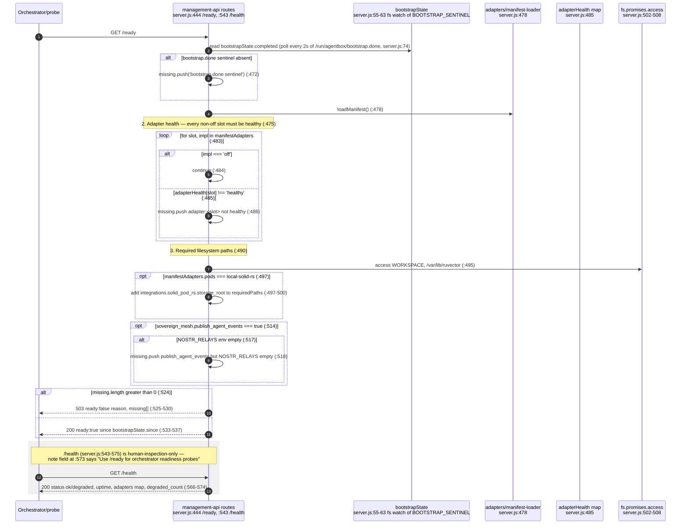
```mermaid
sequenceDiagram
    autonumber
    participant O as Orchestrator/probe
    participant R as management-api routes<br/>server.js:444 /ready, :543 /health
    participant BS as bootstrapState<br/>server.js:55-63 fs watch of BOOTSTRAP_SENTINEL
    participant ML as adapters/manifest-loader<br/>server.js:478
    participant AH as adapterHealth map<br/>server.js:485
    participant FS as fs.promises.access<br/>server.js:502-508

    O->>R: GET /ready
    R->>BS: read bootstrapState.completed (poll every 2s of /run/agentbox/bootstrap.done, server.js:74)
    alt bootstrap.done sentinel absent
        R->>R: missing.push('bootstrap.done sentinel') (:472)
    end
    R->>ML: loadManifest() (:478)
    Note over R: 2. Adapter health — every non-off slot must be healthy (:475)
    loop for slot, impl in manifestAdapters (:483)
        alt impl === 'off'
            R->>R: continue (:484)
        else adapterHealth[slot] !== 'healthy' (:485)
            R->>R: missing.push adapter:<slot> not healthy (:486)
        end
    end
    Note over R: 3. Required filesystem paths (:490)
    R->>FS: access WORKSPACE, /var/lib/ruvector (:495)
    opt manifestAdapters.pods === local-solid-rs (:497)
        R->>R: add integrations.solid_pod_rs.storage_root to requiredPaths (:497-500)
    end
    opt sovereign_mesh.publish_agent_events === true (:514)
        alt NOSTR_RELAYS env empty (:517)
            R->>R: missing.push publish_agent_events but NOSTR_RELAYS empty (:518)
        end
    end
    alt missing.length greater than 0 (:524)
        R-->>O: 503 ready:false reason, missing[] (:525-530)
    else
        R-->>O: 200 ready:true since bootstrapState.since (:533-537)
    end

    rect rgb(240,240,240)
    Note over O,R: /health (server.js:543-575) is human-inspection-only —<br/>note field at :573 says "Use /ready for orchestrator readiness probes"
    O->>R: GET /health
    R-->>O: 200 status ok/degraded, uptime, adapters map, degraded_count (:566-574)
    end
```

## AB-02.10 supervisord program lifecycle
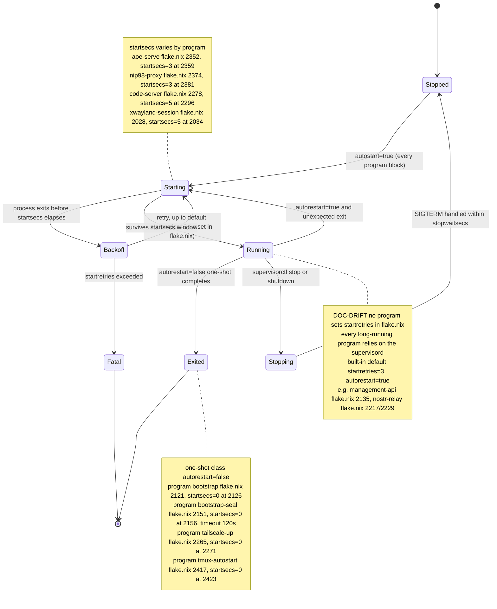
```mermaid
stateDiagram-v2
    [*] --> Stopped
    Stopped --> Starting: autostart=true (every program block)
    Starting --> Backoff: process exits before startsecs elapses
    Backoff --> Starting: retry, up to default startretries=3 (unset in flake.nix)
    Backoff --> Fatal: startretries exceeded
    Starting --> Running: survives startsecs window
    Running --> Exited: autorestart=false one-shot completes
    Running --> Starting: autorestart=true and unexpected exit
    Running --> Stopping: supervisorctl stop or shutdown
    Stopping --> Stopped: SIGTERM handled within stopwaitsecs
    Fatal --> [*]
    Exited --> [*]

    note right of Exited
        one-shot class autorestart=false
        program bootstrap flake.nix 2121, startsecs=0 at 2126
        program bootstrap-seal flake.nix 2151, startsecs=0 at 2156, timeout 120s
        program tailscale-up flake.nix 2265, startsecs=0 at 2271
        program tmux-autostart flake.nix 2417, startsecs=0 at 2423
    end note
    note right of Running
        DOC-DRIFT no program sets startretries in flake.nix
        every long-running program relies on the supervisord
        built-in default startretries=3, autorestart=true
        e.g. management-api flake.nix 2135, nostr-relay flake.nix 2217/2229
    end note
    note left of Starting
        startsecs varies by program
        aoe-serve flake.nix 2352, startsecs=3 at 2359
        nip98-proxy flake.nix 2374, startsecs=3 at 2381
        code-server flake.nix 2278, startsecs=5 at 2296
        xwayland-session flake.nix 2028, startsecs=5 at 2034
    end note
```

## AB-02.11 tmux-autostart window layout
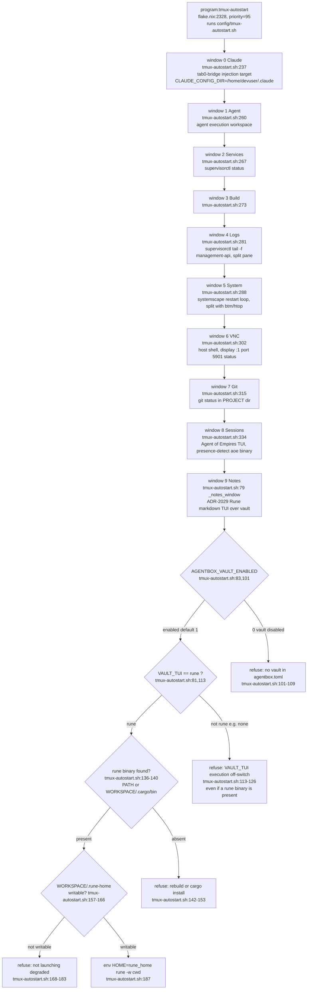
```mermaid
flowchart TB
    START["program:tmux-autostart<br/>flake.nix:2328, priority=95<br/>runs config/tmux-autostart.sh"]
    W0["window 0 Claude<br/>tmux-autostart.sh:237<br/>tab0-bridge injection target<br/>CLAUDE_CONFIG_DIR=/home/devuser/.claude"]
    W1["window 1 Agent<br/>tmux-autostart.sh:260<br/>agent execution workspace"]
    W2["window 2 Services<br/>tmux-autostart.sh:267<br/>supervisorctl status"]
    W3["window 3 Build<br/>tmux-autostart.sh:273"]
    W4["window 4 Logs<br/>tmux-autostart.sh:281<br/>supervisorctl tail -f management-api, split pane"]
    W5["window 5 System<br/>tmux-autostart.sh:288<br/>systemscape restart loop, split with btm/htop"]
    W6["window 6 VNC<br/>tmux-autostart.sh:302<br/>host shell, display :1 port 5901 status"]
    W7["window 7 Git<br/>tmux-autostart.sh:315<br/>git status in PROJECT dir"]
    W8["window 8 Sessions<br/>tmux-autostart.sh:334<br/>Agent of Empires TUI, presence-detect aoe binary"]
    W9["window 9 Notes<br/>tmux-autostart.sh:79 _notes_window<br/>ADR-2029 Rune markdown TUI over vault"]

    START --> W0 --> W1 --> W2 --> W3 --> W4 --> W5 --> W6 --> W7 --> W8 --> W9

    G1{"AGENTBOX_VAULT_ENABLED<br/>tmux-autostart.sh:83,101"}
    G2{"VAULT_TUI == rune ?<br/>tmux-autostart.sh:81,113"}
    G3{"rune binary found?<br/>tmux-autostart.sh:136-140<br/>PATH or WORKSPACE/.cargo/bin"}
    G4{"WORKSPACE/.rune-home<br/>writable? tmux-autostart.sh:157-166"}
    LAUNCH["env HOME=rune_home rune -w cwd<br/>tmux-autostart.sh:187"]

    W9 --> G1
    G1 -->|"0 vault disabled"| REFUSE1["refuse: no vault in agentbox.toml<br/>tmux-autostart.sh:101-109"]
    G1 -->|"enabled default 1"| G2
    G2 -->|"not rune e.g. none"| REFUSE2["refuse: VAULT_TUI execution off-switch<br/>tmux-autostart.sh:113-126<br/>even if a rune binary is present"]
    G2 -->|"rune"| G3
    G3 -->|"absent"| REFUSE3["refuse: rebuild or cargo install<br/>tmux-autostart.sh:142-153"]
    G3 -->|"present"| G4
    G4 -->|"not writable"| REFUSE4["refuse: not launching degraded<br/>tmux-autostart.sh:168-183"]
    G4 -->|"writable"| LAUNCH
```

## AB-02.12 profile isolation — per-profile HOME and CLAUDE_CONFIG_DIR (ADR-2007)
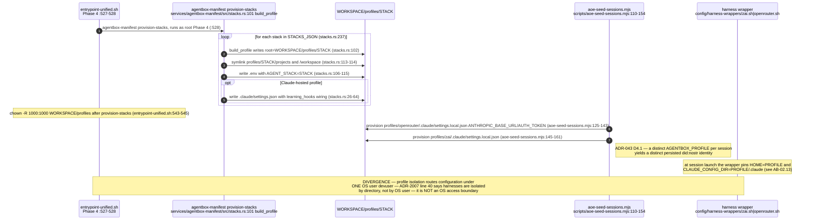
```mermaid
sequenceDiagram
    autonumber
    participant E as entrypoint-unified.sh<br/>Phase 4 :527-528
    participant AM as agentbox-manifest provision-stacks<br/>services/agentbox-manifest/src/stacks.rs:101 build_profile
    participant FS as WORKSPACE/profiles/STACK
    participant SEED as aoe-seed-sessions.mjs<br/>scripts/aoe-seed-sessions.mjs:110-154
    participant WRAP as harness wrapper<br/>config/harness-wrappers/zai.sh|openrouter.sh

    E->>AM: agentbox-manifest provision-stacks, runs as root Phase 4 (:528)
    loop for each stack in STACKS_JSON (stacks.rs:237)
        AM->>FS: build_profile writes root=WORKSPACE/profiles/STACK (stacks.rs:102)
        AM->>FS: symlink profiles/STACK/projects and /workspace (stacks.rs:113-114)
        AM->>FS: write .env with AGENT_STACK=STACK (stacks.rs:106-115)
        opt Claude-hosted profile
            AM->>FS: write .claude/settings.json with learning_hooks wiring (stacks.rs:26-64)
        end
    end
    Note over E: chown -R 1000:1000 WORKSPACE/profiles after provision-stacks (entrypoint-unified.sh:543-545)
    SEED->>FS: provision profiles/openrouter/.claude/settings.local.json ANTHROPIC_BASE_URL/AUTH_TOKEN (aoe-seed-sessions.mjs:125-143)
    SEED->>FS: provision profiles/zai/.claude/settings.local.json (aoe-seed-sessions.mjs:145-161)
    Note right of SEED: ADR-043 D4.1 — a distinct AGENTBOX_PROFILE per session<br/>yields a distinct persisted did:nostr identity
    Note over WRAP: at session launch the wrapper pins HOME=PROFILE and<br/>CLAUDE_CONFIG_DIR=PROFILE/.claude (see AB-02.13)
    Note over E,WRAP: DIVERGENCE — profile isolation routes configuration under<br/>ONE OS user devuser — ADR-2007 line 40 says harnesses are isolated<br/>by directory, not by OS user — it is NOT an OS access boundary
```

## AB-02.13 harness wrapper invocation — Z.AI / OpenRouter redirect assertion
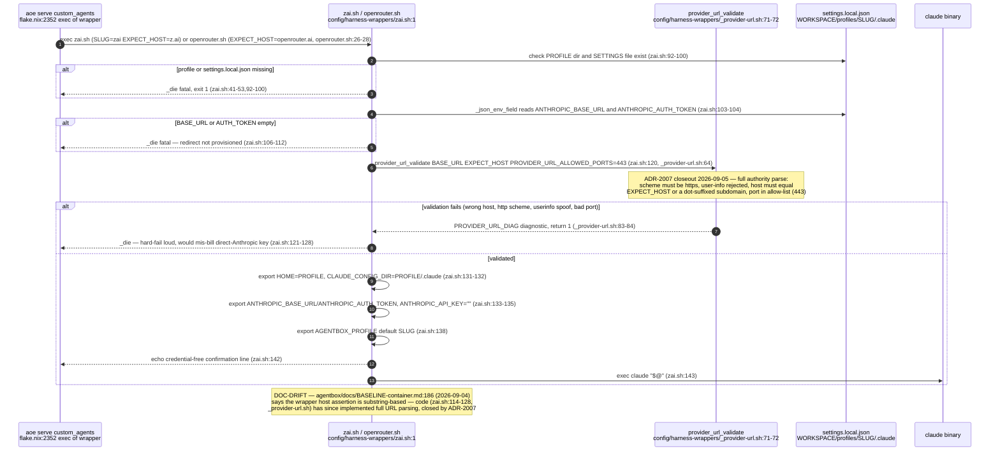
```mermaid
sequenceDiagram
    autonumber
    participant AOE as aoe serve custom_agents<br/>flake.nix:2352 exec of wrapper
    participant W as zai.sh / openrouter.sh<br/>config/harness-wrappers/zai.sh:1
    participant PV as provider_url_validate<br/>config/harness-wrappers/_provider-url.sh:71-72
    participant SET as settings.local.json<br/>WORKSPACE/profiles/SLUG/.claude
    participant C as claude binary

    AOE->>W: exec zai.sh (SLUG=zai EXPECT_HOST=z.ai) or openrouter.sh (EXPECT_HOST=openrouter.ai, openrouter.sh:26-28)
    W->>SET: check PROFILE dir and SETTINGS file exist (zai.sh:92-100)
    alt profile or settings.local.json missing
        W-->>AOE: _die fatal, exit 1 (zai.sh:41-53,92-100)
    end
    W->>SET: _json_env_field reads ANTHROPIC_BASE_URL and ANTHROPIC_AUTH_TOKEN (zai.sh:103-104)
    alt BASE_URL or AUTH_TOKEN empty
        W-->>AOE: _die fatal — redirect not provisioned (zai.sh:106-112)
    end
    W->>PV: provider_url_validate BASE_URL EXPECT_HOST PROVIDER_URL_ALLOWED_PORTS=443 (zai.sh:120, _provider-url.sh:64)
    Note over PV: ADR-2007 closeout 2026-09-05 — full authority parse:<br/>scheme must be https, user-info rejected, host must equal<br/>EXPECT_HOST or a dot-suffixed subdomain, port in allow-list (443)
    alt validation fails (wrong host, http scheme, userinfo spoof, bad port)
        PV-->>W: PROVIDER_URL_DIAG diagnostic, return 1 (_provider-url.sh:83-84)
        W-->>AOE: _die — hard-fail loud, would mis-bill direct-Anthropic key (zai.sh:121-128)
    else validated
        W->>W: export HOME=PROFILE, CLAUDE_CONFIG_DIR=PROFILE/.claude (zai.sh:131-132)
        W->>W: export ANTHROPIC_BASE_URL/ANTHROPIC_AUTH_TOKEN, ANTHROPIC_API_KEY="" (zai.sh:133-135)
        W->>W: export AGENTBOX_PROFILE default SLUG (zai.sh:138)
        W-->>AOE: echo credential-free confirmation line (zai.sh:142)
        W->>C: exec claude "$@" (zai.sh:143)
    end
    Note over W: DOC-DRIFT — agentbox/docs/BASELINE-container.md:186 (2026-09-04)<br/>says the wrapper host assertion is substring-based — code (zai.sh:114-128,<br/>_provider-url.sh) has since implemented full URL parsing, closed by ADR-2007
```

## AB-02.14 VAULT env propagation — resolve to PID1 to supervised programs
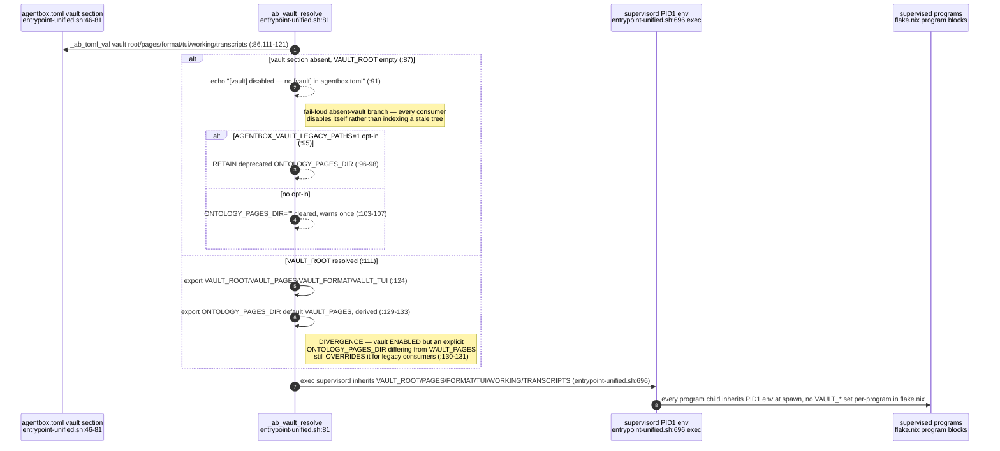
```mermaid
sequenceDiagram
    autonumber
    participant TOML as agentbox.toml vault section<br/>entrypoint-unified.sh:46-81
    participant VR as _ab_vault_resolve<br/>entrypoint-unified.sh:81
    participant PID1 as supervisord PID1 env<br/>entrypoint-unified.sh:696 exec
    participant PROG as supervised programs<br/>flake.nix program blocks

    VR->>TOML: _ab_toml_val vault root/pages/format/tui/working/transcripts (:86,111-121)
    alt vault section absent, VAULT_ROOT empty (:87)
        VR-->>VR: echo "[vault] disabled — no [vault] in agentbox.toml" (:91)
        Note right of VR: fail-loud absent-vault branch — every consumer<br/>disables itself rather than indexing a stale tree
        alt AGENTBOX_VAULT_LEGACY_PATHS=1 opt-in (:95)
            VR-->>VR: RETAIN deprecated ONTOLOGY_PAGES_DIR (:96-98)
        else no opt-in
            VR-->>VR: ONTOLOGY_PAGES_DIR="" cleared, warns once (:103-107)
        end
    else VAULT_ROOT resolved (:111)
        VR->>VR: export VAULT_ROOT/VAULT_PAGES/VAULT_FORMAT/VAULT_TUI (:124)
        VR->>VR: export ONTOLOGY_PAGES_DIR default VAULT_PAGES, derived (:129-133)
        Note right of VR: DIVERGENCE — vault ENABLED but an explicit<br/>ONTOLOGY_PAGES_DIR differing from VAULT_PAGES<br/>still OVERRIDES it for legacy consumers (:130-131)
    end
    VR->>PID1: exec supervisord inherits VAULT_ROOT/PAGES/FORMAT/TUI/WORKING/TRANSCRIPTS (entrypoint-unified.sh:696)
    PID1->>PROG: every program child inherits PID1 env at spawn, no VAULT_* set per-program in flake.nix
```

## AB-02.15 VAULT env propagation — runtime-env file to shells and tmux
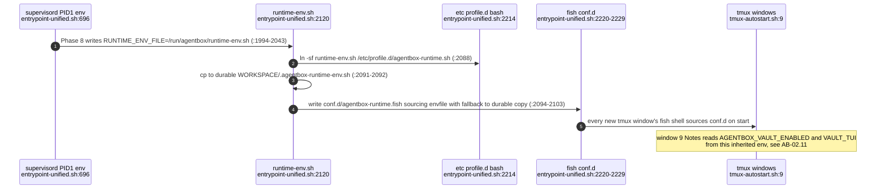
```mermaid
sequenceDiagram
    autonumber
    participant PID1 as supervisord PID1 env<br/>entrypoint-unified.sh:696
    participant RT as runtime-env.sh<br/>entrypoint-unified.sh:2120
    participant BASH as etc profile.d bash<br/>entrypoint-unified.sh:2214
    participant FISH as fish conf.d<br/>entrypoint-unified.sh:2220-2229
    participant TMUX as tmux windows<br/>tmux-autostart.sh:9

    PID1->>RT: Phase 8 writes RUNTIME_ENV_FILE=/run/agentbox/runtime-env.sh (:1994-2043)
    RT->>BASH: ln -sf runtime-env.sh /etc/profile.d/agentbox-runtime.sh (:2088)
    RT->>RT: cp to durable WORKSPACE/.agentbox-runtime-env.sh (:2091-2092)
    RT->>FISH: write conf.d/agentbox-runtime.fish sourcing envfile with fallback to durable copy (:2094-2103)
    FISH->>TMUX: every new tmux window's fish shell sources conf.d on start
    Note over TMUX: window 9 Notes reads AGENTBOX_VAULT_ENABLED and VAULT_TUI<br/>from this inherited env, see AB-02.11
```

## AB-02.16 seccomp profile — supplemental denylist
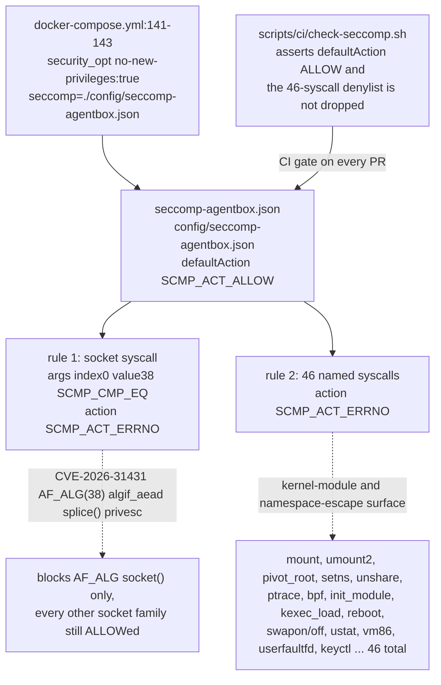
```mermaid
flowchart TB
    COMPOSE["docker-compose.yml:141-143<br/>security_opt no-new-privileges:true<br/>seccomp=./config/seccomp-agentbox.json"]
    PROFILE["seccomp-agentbox.json<br/>config/seccomp-agentbox.json<br/>defaultAction SCMP_ACT_ALLOW"]
    SOCK["rule 1: socket syscall<br/>args index0 value38 SCMP_CMP_EQ<br/>action SCMP_ACT_ERRNO"]
    DENY["rule 2: 46 named syscalls<br/>action SCMP_ACT_ERRNO"]
    CI["scripts/ci/check-seccomp.sh<br/>asserts defaultAction ALLOW and<br/>the 46-syscall denylist is not dropped"]

    COMPOSE --> PROFILE
    PROFILE --> SOCK
    PROFILE --> DENY
    SOCK -.->|"CVE-2026-31431 AF_ALG(38) algif_aead splice() privesc"| SOCKNOTE["blocks AF_ALG socket() only,<br/>every other socket family still ALLOWed"]
    DENY -.->|"kernel-module and namespace-escape surface"| DENYLIST["mount, umount2, pivot_root, setns, unshare,<br/>ptrace, bpf, init_module, kexec_load, reboot,<br/>swapon/off, ustat, vm86, userfaultfd, keyctl ... 46 total"]
    CI -->|"CI gate on every PR"| PROFILE
```

## AB-02.17 shared MCP hub — late config, bounded wait, restart on projection (ADR-2034, ADR-2063)
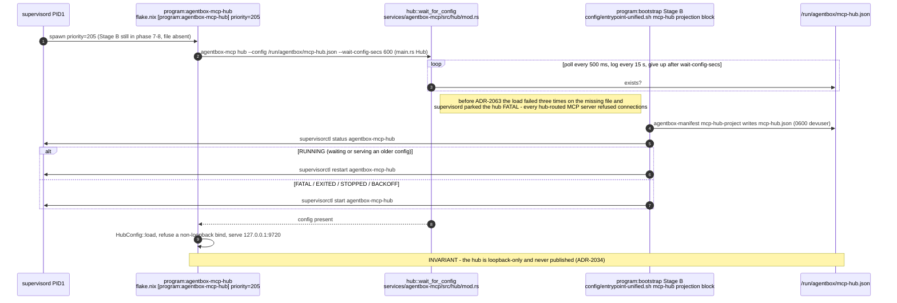
```mermaid
sequenceDiagram
    autonumber
    participant SV as supervisord PID1
    participant HUB as program:agentbox-mcp-hub<br/>flake.nix [program:agentbox-mcp-hub] priority=205
    participant WAIT as hub::wait_for_config<br/>services/agentbox-mcp/src/hub/mod.rs
    participant BOOT as program:bootstrap Stage B<br/>config/entrypoint-unified.sh mcp-hub projection block
    participant FS as /run/agentbox/mcp-hub.json

    SV->>HUB: spawn priority=205 (Stage B still in phase 7-8, file absent)
    HUB->>WAIT: agentbox-mcp hub --config /run/agentbox/mcp-hub.json --wait-config-secs 600 (main.rs Hub)
    loop poll every 500 ms, log every 15 s, give up after wait-config-secs
        WAIT->>FS: exists?
    end
    Note right of WAIT: before ADR-2063 the load failed three times on the missing file and<br/>supervisord parked the hub FATAL - every hub-routed MCP server refused connections
    BOOT->>FS: agentbox-manifest mcp-hub-project writes mcp-hub.json (0600 devuser)
    BOOT->>SV: supervisorctl status agentbox-mcp-hub
    alt RUNNING (waiting or serving an older config)
        BOOT->>SV: supervisorctl restart agentbox-mcp-hub
    else FATAL / EXITED / STOPPED / BACKOFF
        BOOT->>SV: supervisorctl start agentbox-mcp-hub
    end
    WAIT-->>HUB: config present
    HUB->>HUB: HubConfig::load, refuse a non-loopback bind, serve 127.0.0.1:9720
    Note over HUB,FS: INVARIANT - the hub is loopback-only and never published (ADR-2034)
```

## AB-02.18 session seeds — persisted records, orphan reaper, native-agent model (ADR-2063)
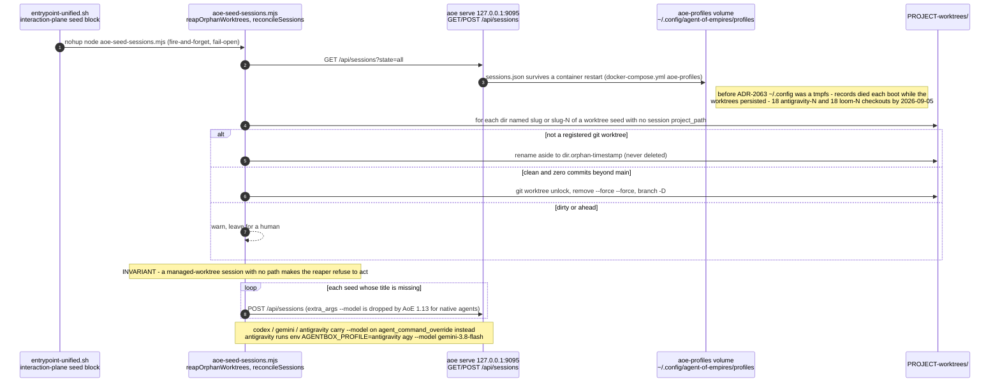
```mermaid
sequenceDiagram
    autonumber
    participant E as entrypoint-unified.sh<br/>interaction-plane seed block
    participant SEED as aoe-seed-sessions.mjs<br/>reapOrphanWorktrees, reconcileSessions
    participant AOE as aoe serve 127.0.0.1:9095<br/>GET/POST /api/sessions
    participant VOL as aoe-profiles volume<br/>~/.config/agent-of-empires/profiles
    participant WT as PROJECT-worktrees/

    E->>SEED: nohup node aoe-seed-sessions.mjs (fire-and-forget, fail-open)
    SEED->>AOE: GET /api/sessions?state=all
    AOE->>VOL: sessions.json survives a container restart (docker-compose.yml aoe-profiles)
    Note right of VOL: before ADR-2063 ~/.config was a tmpfs - records died each boot while the<br/>worktrees persisted - 18 antigravity-N and 18 loom-N checkouts by 2026-09-05
    SEED->>WT: for each dir named slug or slug-N of a worktree seed with no session project_path
    alt not a registered git worktree
        SEED->>WT: rename aside to dir.orphan-timestamp (never deleted)
    else clean and zero commits beyond main
        SEED->>WT: git worktree unlock, remove --force --force, branch -D
    else dirty or ahead
        SEED-->>SEED: warn, leave for a human
    end
    Note over SEED: INVARIANT - a managed-worktree session with no path makes the reaper refuse to act
    loop each seed whose title is missing
        SEED->>AOE: POST /api/sessions (extra_args --model is dropped by AoE 1.13 for native agents)
    end
    Note over SEED,AOE: codex / gemini / antigravity carry --model on agent_command_override instead<br/>antigravity runs env AGENTBOX_PROFILE=antigravity agy --model gemini-3.8-flash
```

## AB-02.19 aoe-seed-sessions.mjs run-as-script guard — realpath fix (2026-09-06)
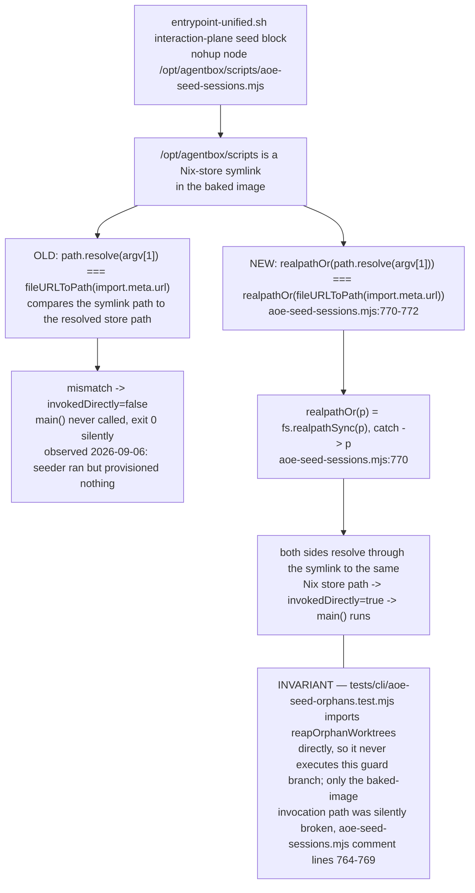
```mermaid
flowchart TB
    ENTRY["entrypoint-unified.sh interaction-plane seed block<br/>nohup node /opt/agentbox/scripts/aoe-seed-sessions.mjs"]
    SYMLINK["/opt/agentbox/scripts is a Nix-store symlink<br/>in the baked image"]
    OLDCHECK["OLD: path.resolve(argv[1]) === fileURLToPath(import.meta.url)<br/>compares the symlink path to the resolved store path"]
    OLDRESULT["mismatch -&gt; invokedDirectly=false<br/>main() never called, exit 0 silently<br/>observed 2026-09-06: seeder ran but provisioned nothing"]
    NEWCHECK["NEW: realpathOr(path.resolve(argv[1])) === realpathOr(fileURLToPath(import.meta.url))<br/>aoe-seed-sessions.mjs:770-772"]
    REALPATHOR["realpathOr(p) = fs.realpathSync(p), catch -&gt; p<br/>aoe-seed-sessions.mjs:770"]
    NEWRESULT["both sides resolve through the symlink to the same<br/>Nix store path -&gt; invokedDirectly=true -&gt; main() runs"]

    ENTRY --> SYMLINK --> OLDCHECK --> OLDRESULT
    SYMLINK --> NEWCHECK
    NEWCHECK --> REALPATHOR --> NEWRESULT

    NOTE1["INVARIANT — tests/cli/aoe-seed-orphans.test.mjs imports reapOrphanWorktrees<br/>directly, so it never executes this guard branch; only the baked-image<br/>invocation path was silently broken, aoe-seed-sessions.mjs comment lines 764-769"]
    NEWRESULT --- NOTE1
```

## AB-02.20 aoe-seed-sessions.mjs WRAPPER_SLUGS — router seed joins openrouter/zai (ADR-2080)
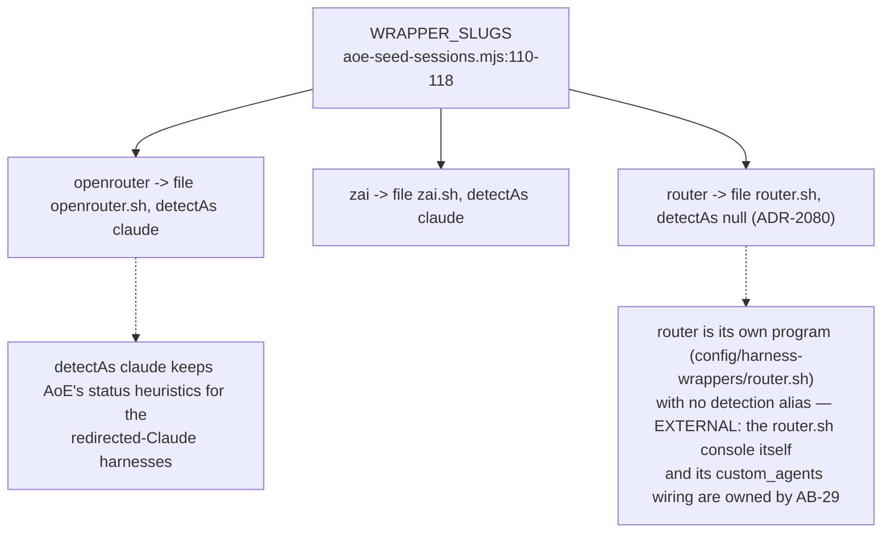
```mermaid
flowchart TB
    W["WRAPPER_SLUGS<br/>aoe-seed-sessions.mjs:110-118"]
    W --> OR["openrouter -&gt; file openrouter.sh, detectAs claude"]
    W --> ZA["zai -&gt; file zai.sh, detectAs claude"]
    W --> RO["router -&gt; file router.sh, detectAs null (ADR-2080)"]
    OR -.-> NOTE1["detectAs claude keeps AoE's status heuristics for the<br/>redirected-Claude harnesses"]
    RO -.-> NOTE2["router is its own program (config/harness-wrappers/router.sh)<br/>with no detection alias — EXTERNAL: the router.sh console itself<br/>and its custom_agents wiring are owned by AB-29"]
```

- `buildCoverage()` resolves each session_seed slug present in `WRAPPER_SLUGS` to `path.join(WRAPPER_DIR, WRAPPER_SLUGS[slug].file)` as its `customAgents` program, and sets `detectAs[slug]` only `if (WRAPPER_SLUGS[slug].detectAs)` (aoe-seed-sessions.mjs:265-276) — the `router` slug from `[[interaction_plane.session_seeds]]` (`agentbox.toml:1387-1391`, `tool = "custom:router"` at `:1389`) resolves through this table exactly like `openrouter`/`zai` did before ADR-2080, but with `detectAs` left unset.
- see AB-01.11, AB-05.11 for the `[model_routing.neural]` gate that bakes `router.sh`'s artefact directory; see AB-29 for the console's own request/response flow.
