## AB-02.1 boot phases 1-3 — vault resolution, directories, sovereign identity
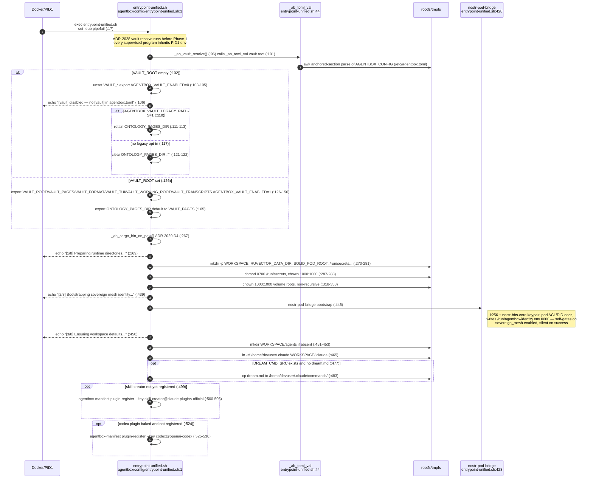
```mermaid
sequenceDiagram
    autonumber
    participant D as Docker/PID1
    participant E as entrypoint-unified.sh<br/>agentbox/config/entrypoint-unified.sh:1
    participant TV as _ab_toml_val<br/>entrypoint-unified.sh:44
    participant FS as rootfs/tmpfs
    participant NPB as nostr-pod-bridge<br/>entrypoint-unified.sh:428

    D->>E: exec entrypoint-unified.sh<br/>set -euo pipefail (:17)
    Note over E: ADR-2028 vault resolve runs before Phase 1<br/>every supervised program inherits PID1 env
    E->>TV: _ab_vault_resolve() (:96) calls _ab_toml_val vault root (:101)
    TV->>FS: awk anchored-section parse of AGENTBOX_CONFIG (/etc/agentbox.toml)
    alt VAULT_ROOT empty (:102)
        E->>E: unset VAULT_* export AGENTBOX_VAULT_ENABLED=0 (:103-105)
        E-->>D: echo "[vault] disabled — no [vault] in agentbox.toml" (:106)
        alt AGENTBOX_VAULT_LEGACY_PATHS=1 (:110)
            E->>E: retain ONTOLOGY_PAGES_DIR (:111-113)
        else no legacy opt-in (:117)
            E->>E: clear ONTOLOGY_PAGES_DIR="" (:121-122)
        end
    else VAULT_ROOT set (:126)
        E->>E: export VAULT_ROOT/VAULT_PAGES/VAULT_FORMAT/VAULT_TUI/VAULT_WORKING_ROOT/VAULT_TRANSCRIPTS AGENTBOX_VAULT_ENABLED=1 (:126-156)
        E->>E: export ONTOLOGY_PAGES_DIR default to VAULT_PAGES (:165)
    end
    E->>E: _ab_cargo_bin_on_path() ADR-2029 D4 (:267)
    E-->>D: echo "[1/8] Preparing runtime directories..." (:269)
    E->>FS: mkdir -p WORKSPACE, RUVECTOR_DATA_DIR, SOLID_POD_ROOT, /run/secrets... (:270-281)
    E->>FS: chmod 0700 /run/secrets, chown 1000:1000 (:287-288)
    E->>FS: chown 1000:1000 volume roots, non-recursive (:318-353)
    E-->>D: echo "[2/8] Bootstrapping sovereign mesh identity..." (:439)
    E->>NPB: nostr-pod-bridge bootstrap (:445)
    Note right of NPB: k256 + nostr-bbs-core keypair, pod ACL/DID docs,<br/>writes /run/agentbox/identity.env 0600 — self-gates on<br/>sovereign_mesh.enabled, silent on success
    E-->>D: echo "[3/8] Ensuring workspace defaults..." (:450)
    E->>FS: mkdir WORKSPACE/agents if absent (:451-453)
    E->>FS: ln -sf /home/devuser/.claude WORKSPACE/.claude (:465)
    opt DREAM_CMD_SRC exists and no dream.md (:477)
        E->>FS: cp dream.md to /home/devuser/.claude/commands/ (:483)
    end
    opt skill-creator not yet registered (:499)
        E->>E: agentbox-manifest plugin-register --key skill-creator@claude-plugins-official (:500-505)
    end
    opt codex plugin baked and not registered (:524)
        E->>E: agentbox-manifest plugin-register --key codex@openai-codex (:525-530)
    end
```

## AB-02.2 boot phases 4-6 — provisioning, artifact validation, supervisord exec, Stage B closure probes
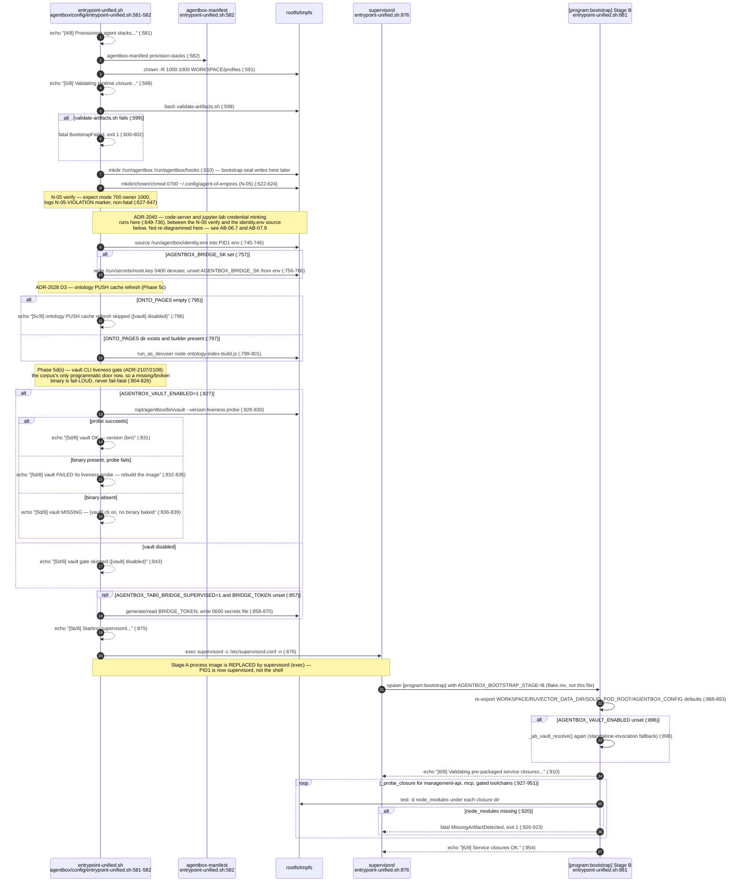
```mermaid
sequenceDiagram
    autonumber
    participant E as entrypoint-unified.sh<br/>agentbox/config/entrypoint-unified.sh:581-582
    participant AM as agentbox-manifest<br/>entrypoint-unified.sh:582
    participant FS as rootfs/tmpfs
    participant SV as supervisord<br/>entrypoint-unified.sh:876
    participant B as [program:bootstrap] Stage B<br/>entrypoint-unified.sh:881

    E-->>E: echo "[4/8] Provisioning agent stacks..." (:581)
    E->>AM: agentbox-manifest provision-stacks (:582)
    E->>FS: chown -R 1000:1000 WORKSPACE/profiles (:591)
    E-->>E: echo "[5/8] Validating runtime closure..." (:598)
    E->>FS: bash validate-artifacts.sh (:599)
    alt validate-artifacts.sh fails (:599)
        E-->>E: fatal BootstrapFailed, exit 1 (:600-602)
    end
    E->>FS: mkdir /run/agentbox /run/agentbox/hooks (:610) — bootstrap-seal writes here later
    E->>FS: mkdir/chown/chmod 0700 ~/.config/agent-of-empires (N-05) (:622-624)
    Note over E: N-05 verify — expect mode 700 owner 1000,<br/>logs N-05-VIOLATION marker, non-fatal (:627-647)
    Note over E,FS: ADR-2040 — code-server and jupyter-lab credential minting<br/>runs here (:649-736), between the N-05 verify and the identity.env source<br/>below. Not re-diagrammed here — see AB-06.7 and AB-07.9
    E->>FS: source /run/agentbox/identity.env into PID1 env (:745-746)
    alt AGENTBOX_BRIDGE_SK set (:757)
        E->>FS: write /run/secrets/nostr.key 0400 devuser, unset AGENTBOX_BRIDGE_SK from env (:756-766)
    end
    Note over E: ADR-2028 D3 — ontology PUSH cache refresh (Phase 5c)
    alt ONTO_PAGES empty (:795)
        E-->>E: echo "[5c/8] ontology PUSH cache refresh skipped ([vault] disabled)" (:796)
    else ONTO_PAGES dir exists and builder present (:797)
        E->>FS: run_as_devuser node ontology-index-build.js (:799-801)
    end
    Note over E: Phase 5d(ii) — vault CLI liveness gate (ADR-2107/2108):<br/>the corpus's only programmatic door now, so a missing/broken<br/>binary is fail-LOUD, never fail-fatal (:804-826)
    alt AGENTBOX_VAULT_ENABLED=1 (:827)
        E->>FS: /opt/agentbox/bin/vault --version liveness probe (:828-830)
        alt probe succeeds
            E-->>E: echo "[5d/8] vault OK — version (bin)" (:831)
        else binary present, probe fails
            E-->>E: echo "[5d/8] vault FAILED its liveness probe — rebuild the image" (:832-835)
        else binary absent
            E-->>E: echo "[5d/8] vault MISSING — [vault].cli on, no binary baked" (:836-839)
        end
    else vault disabled
        E-->>E: echo "[5d/8] vault gate skipped ([vault] disabled)" (:843)
    end
    opt AGENTBOX_TAB0_BRIDGE_SUPERVISED=1 and BRIDGE_TOKEN unset (:857)
        E->>FS: generate/read BRIDGE_TOKEN, write 0600 secrets file (:858-870)
    end
    E-->>E: echo "[5b/8] Starting supervisord..." (:875)
    E->>SV: exec supervisord -c /etc/supervisord.conf -n (:876)
    Note over E,SV: Stage A process image is REPLACED by supervisord (exec) —<br/>PID1 is now supervisord, not the shell
    SV->>B: spawn [program:bootstrap] with AGENTBOX_BOOTSTRAP_STAGE=B (flake.nix, not this file)
    B->>B: re-export WORKSPACE/RUVECTOR_DATA_DIR/SOLID_POD_ROOT/AGENTBOX_CONFIG defaults (:888-893)
    alt AGENTBOX_VAULT_ENABLED unset (:896)
        B->>B: _ab_vault_resolve() again (standalone-invocation fallback) (:896)
    end
    B-->>SV: echo "[6/8] Validating pre-packaged service closures..." (:910)
    loop _probe_closure for management-api, mcp, gated toolchains (:927-951)
        B->>FS: test -d node_modules under each closure dir
        alt node_modules missing (:920)
            B-->>SV: fatal MissingArtifactDetected, exit 1 (:920-923)
        end
    end
    B-->>SV: echo "[6/8] Service closures OK." (:954)
```

## AB-02.3 boot phases 7-8 — ruflo plugins, manifest projection, runtime-env publish
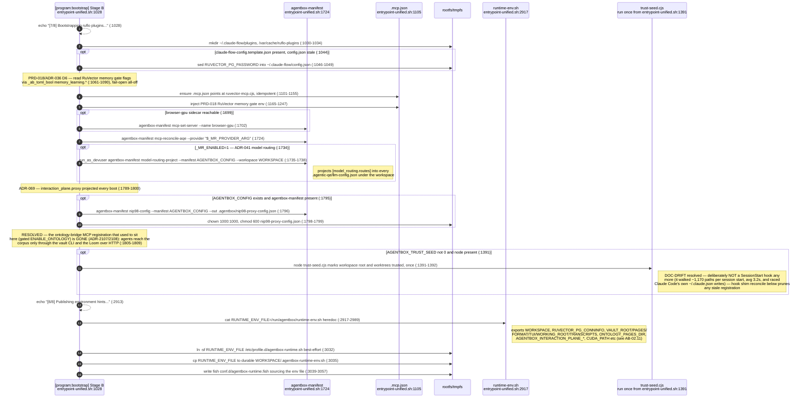
```mermaid
sequenceDiagram
    autonumber
    participant B as [program:bootstrap] Stage B<br/>entrypoint-unified.sh:1028
    participant AM as agentbox-manifest<br/>entrypoint-unified.sh:1724
    participant MCP as .mcp.json<br/>entrypoint-unified.sh:1105
    participant FS as rootfs/tmpfs
    participant RT as runtime-env.sh<br/>entrypoint-unified.sh:2917
    participant TS as trust-seed.cjs<br/>run once from entrypoint-unified.sh:1391

    B-->>B: echo "[7/8] Bootstrapping ruflo plugins..." (:1028)
    B->>FS: mkdir ~/.claude-flow/plugins, /var/cache/ruflo-plugins (:1030-1034)
    opt claude-flow-config.template.json present, config.json stale (:1044)
        B->>FS: sed RUVECTOR_PG_PASSWORD into ~/.claude-flow/config.json (:1046-1049)
    end
    Note over B: PRD-018/ADR-036 D6 — read RuVector memory gate flags<br/>via _ab_toml_bool memory_learning.* (:1061-1090), fail-open all-off
    B->>MCP: ensure .mcp.json points at ruvector-mcp.cjs, idempotent (:1101-1155)
    B->>MCP: inject PRD-018 RuVector memory gate env (:1165-1247)
    opt browser-gpu sidecar reachable (:1699)
        B->>AM: agentbox-manifest mcp-set-server --name browser-gpu (:1702)
    end
    B->>AM: agentbox-manifest mcp-reconcile-aqe --provider "$_MR_PROVIDER_ARG" (:1724)
    opt _MR_ENABLED=1 — ADR-041 model routing (:1734)
        B->>AM: run_as_devuser agentbox-manifest model-routing-project --manifest AGENTBOX_CONFIG --workspace WORKSPACE (:1735-1738)
        Note right of AM: projects [model_routing.routes] into every<br/>.agentic-qe/llm-config.json under the workspace
    end
    Note over B: ADR-069 — interaction_plane.proxy projected every boot (:1789-1800)
    opt AGENTBOX_CONFIG exists and agentbox-manifest present (:1795)
        B->>AM: agentbox-manifest nip98-config --manifest AGENTBOX_CONFIG --out .agentbox/nip98-proxy-config.json (:1796)
        B->>FS: chown 1000:1000, chmod 600 nip98-proxy-config.json (:1798-1799)
    end
    Note over B: RESOLVED — the ontology-bridge MCP registration that used to sit<br/>here (gated ENABLE_ONTOLOGY) is GONE (ADR-2107/2108): agents reach the<br/>corpus only through the vault CLI and the Loom over HTTP (:1805-1809)
    opt AGENTBOX_TRUST_SEED not 0 and node present (:1391)
        B->>TS: node trust-seed.cjs marks workspace root and worktrees trusted, once (:1391-1392)
        Note right of TS: DOC-DRIFT resolved — deliberately NOT a SessionStart hook any<br/>more (it walked ~1,170 paths per session start, avg 3.2s, and raced<br/>Claude Code's own ~/.claude.json writes) — hook shim reconcile below prunes<br/>any stale registration
    end
    B-->>B: echo "[8/8] Publishing environment hints..." (:2913)
    B->>RT: cat RUNTIME_ENV_FILE=/run/agentbox/runtime-env.sh heredoc (:2917-2989)
    Note right of RT: exports WORKSPACE, RUVECTOR_PG_CONNINFO, VAULT_ROOT/PAGES/<br/>FORMAT/TUI/WORKING_ROOT/TRANSCRIPTS, ONTOLOGY_PAGES_DIR,<br/>AGENTBOX_INTERACTION_PLANE_*, CUDA_PATH etc (see AB-02.11)
    B->>FS: ln -sf RUNTIME_ENV_FILE /etc/profile.d/agentbox-runtime.sh best-effort (:3032)
    B->>FS: cp RUNTIME_ENV_FILE to durable WORKSPACE/.agentbox-runtime-env.sh (:3035)
    B->>FS: write fish conf.d/agentbox-runtime.fish sourcing the env file (:3039-3057)
```

## AB-02.4 supervision tree — core and identity programs
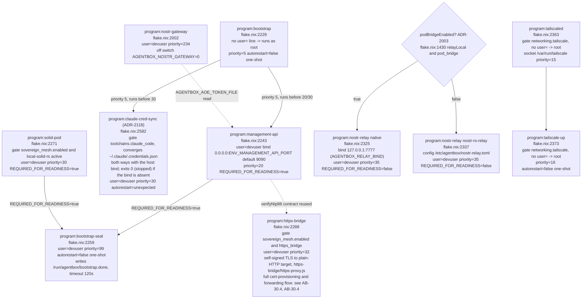
```mermaid
flowchart TB
    BOOT["program:bootstrap<br/>flake.nix:2229<br/>no user= line -&gt; runs as root<br/>priority=5 autorestart=false one-shot"]
    MGMT["program:management-api<br/>flake.nix:2243<br/>user=devuser bind 0.0.0.0:ENV_MANAGEMENT_API_PORT default 9090<br/>priority=20 REQUIRED_FOR_READINESS=true"]
    CRED["program:claude-cred-sync (ADR-2118)<br/>flake.nix:2582<br/>gate toolchains.claude_code, converges ~/.claude/.credentials.json<br/>both ways with the host bind; exits 0 (stopped) if the bind is absent<br/>user=devuser priority=30 autorestart=unexpected"]
    SEAL["program:bootstrap-seal<br/>flake.nix:2259<br/>user=devuser priority=99 autorestart=false one-shot<br/>writes /run/agentbox/bootstrap.done, timeout 120s"]
    SOLID["program:solid-pod<br/>flake.nix:2271<br/>gate sovereign_mesh.enabled and local-solid-rs active<br/>user=devuser priority=30 REQUIRED_FOR_READINESS=true"]
    HTTPSB["program:https-bridge<br/>flake.nix:2288<br/>gate sovereign_mesh.enabled and https_bridge<br/>user=devuser priority=32<br/>self-signed TLS to plain-HTTP target, https-bridge/https-proxy.js<br/>full cert-provisioning and forwarding flow: see AB-30.4, AB-30.4"]
    GATERELAY{"podBridgeEnabled? ADR-2003<br/>flake.nix:1430 relayLocal and pod_bridge"}
    NRELAY1["program:nostr-relay native<br/>flake.nix:2325<br/>bind 127.0.0.1:7777 (AGENTBOX_RELAY_BIND)<br/>user=devuser priority=35 REQUIRED_FOR_READINESS=false"]
    NRELAY2["program:nostr-relay nostr-rs-relay<br/>flake.nix:2337<br/>config /etc/agentbox/nostr-relay.toml<br/>user=devuser priority=35 REQUIRED_FOR_READINESS=false"]
    NGW["program:nostr-gateway<br/>flake.nix:2002<br/>user=devuser priority=234<br/>off switch AGENTBOX_NOSTR_GATEWAY=0"]
    TSD["program:tailscaled<br/>flake.nix:2363<br/>gate networking.tailscale, no user= -&gt; root<br/>socket /var/run/tailscale priority=15"]
    TSU["program:tailscale-up<br/>flake.nix:2373<br/>gate networking.tailscale, no user= -&gt; root<br/>priority=16 autorestart=false one-shot"]

    BOOT -->|"priority 5, runs before 20/30"| MGMT
    BOOT -->|"priority 5, runs before 30"| CRED
    MGMT -->|"REQUIRED_FOR_READINESS=true"| SEAL
    SOLID -->|"REQUIRED_FOR_READINESS=true"| SEAL
    GATERELAY -->|true| NRELAY1
    GATERELAY -->|false| NRELAY2
    MGMT -.->|"verifyNip98 contract reused"| HTTPSB
    TSD --> TSU
    NGW -.->|"AGENTBOX_AOE_TOKEN_FILE read"| MGMT
```

## AB-02.6 supervision tree — gated toolchain programs
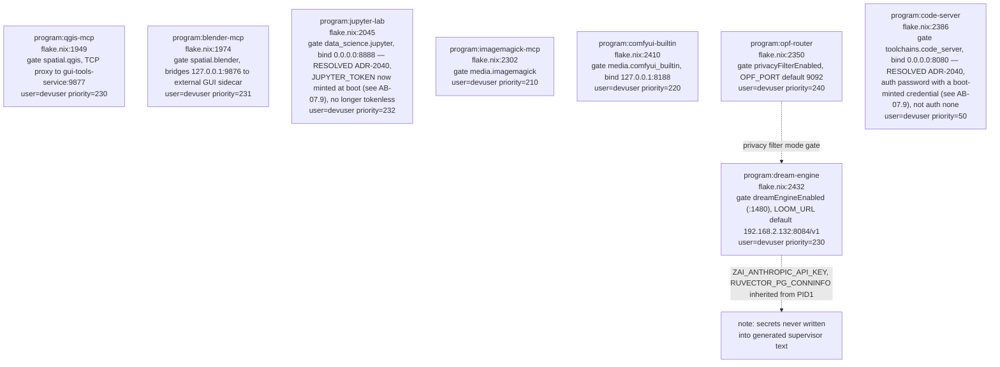
```mermaid
flowchart TB
    QGIS["program:qgis-mcp<br/>flake.nix:1949<br/>gate spatial.qgis, TCP proxy to gui-tools-service:9877<br/>user=devuser priority=230"]
    BLEND["program:blender-mcp<br/>flake.nix:1974<br/>gate spatial.blender, bridges 127.0.0.1:9876 to external GUI sidecar<br/>user=devuser priority=231"]
    JLAB["program:jupyter-lab<br/>flake.nix:2045<br/>gate data_science.jupyter, bind 0.0.0.0:8888 — RESOLVED ADR-2040,<br/>JUPYTER_TOKEN now minted at boot (see AB-07.9), no longer tokenless<br/>user=devuser priority=232"]
    IMGM["program:imagemagick-mcp<br/>flake.nix:2302<br/>gate media.imagemagick<br/>user=devuser priority=210"]
    COMFY["program:comfyui-builtin<br/>flake.nix:2410<br/>gate media.comfyui_builtin, bind 127.0.0.1:8188<br/>user=devuser priority=220"]
    OPF["program:opf-router<br/>flake.nix:2350<br/>gate privacyFilterEnabled, OPF_PORT default 9092<br/>user=devuser priority=240"]
    DREAM["program:dream-engine<br/>flake.nix:2432<br/>gate dreamEngineEnabled (:1480), LOOM_URL default 192.168.2.132:8084/v1<br/>user=devuser priority=230"]
    CODES["program:code-server<br/>flake.nix:2386<br/>gate toolchains.code_server, bind 0.0.0.0:8080 — RESOLVED ADR-2040,<br/>auth password with a boot-minted credential (see AB-07.9), not auth none<br/>user=devuser priority=50"]

    OPF -.->|"privacy filter mode gate"| DREAM
    DREAM -.->|"ZAI_ANTHROPIC_API_KEY, RUVECTOR_PG_CONNINFO inherited from PID1"| RVNOTE["note: secrets never written<br/>into generated supervisor text"]
```

## AB-02.7 supervision tree — desktop stack and interaction plane
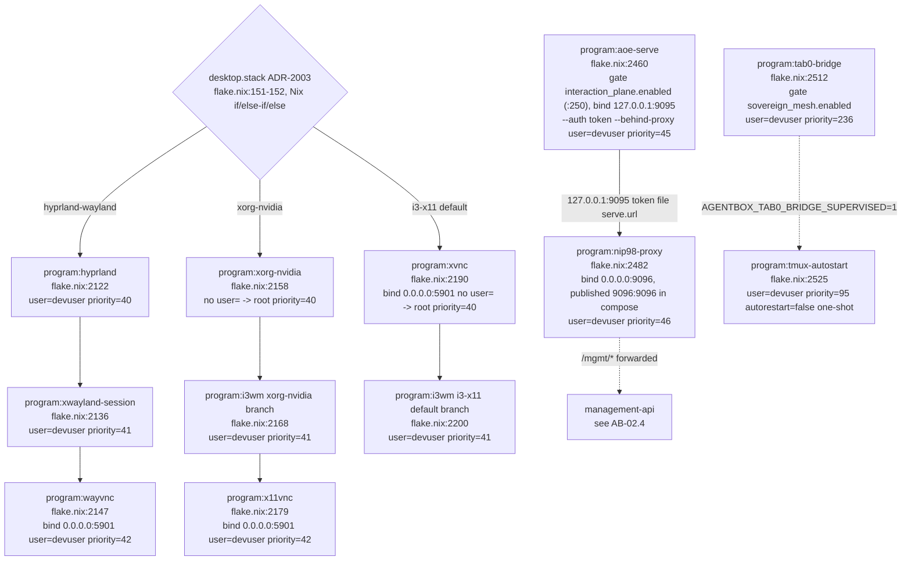
```mermaid
flowchart TB
    GATESTACK{"desktop.stack ADR-2003<br/>flake.nix:151-152, Nix if/else-if/else"}
    HYPR["program:hyprland<br/>flake.nix:2122<br/>user=devuser priority=40"]
    XWAY["program:xwayland-session<br/>flake.nix:2136<br/>user=devuser priority=41"]
    WAYVNC["program:wayvnc<br/>flake.nix:2147<br/>bind 0.0.0.0:5901 user=devuser priority=42"]
    XORG["program:xorg-nvidia<br/>flake.nix:2158<br/>no user= -&gt; root priority=40"]
    I3A["program:i3wm xorg-nvidia branch<br/>flake.nix:2168<br/>user=devuser priority=41"]
    X11VNC["program:x11vnc<br/>flake.nix:2179<br/>bind 0.0.0.0:5901 user=devuser priority=42"]
    XVNC["program:xvnc<br/>flake.nix:2190<br/>bind 0.0.0.0:5901 no user= -&gt; root priority=40"]
    I3B["program:i3wm i3-x11 default branch<br/>flake.nix:2200<br/>user=devuser priority=41"]
    AOE["program:aoe-serve<br/>flake.nix:2460<br/>gate interaction_plane.enabled (:250), bind 127.0.0.1:9095<br/>--auth token --behind-proxy user=devuser priority=45"]
    NIP98["program:nip98-proxy<br/>flake.nix:2482<br/>bind 0.0.0.0:9096, published 9096:9096 in compose<br/>user=devuser priority=46"]
    TAB0["program:tab0-bridge<br/>flake.nix:2512<br/>gate sovereign_mesh.enabled<br/>user=devuser priority=236"]
    TMUX["program:tmux-autostart<br/>flake.nix:2525<br/>user=devuser priority=95 autorestart=false one-shot"]

    GATESTACK -->|"hyprland-wayland"| HYPR --> XWAY --> WAYVNC
    GATESTACK -->|"xorg-nvidia"| XORG --> I3A --> X11VNC
    GATESTACK -->|"i3-x11 default"| XVNC --> I3B
    AOE -->|"127.0.0.1:9095 token file serve.url"| NIP98
    NIP98 -.->|"/mgmt/* forwarded"| MGMTREF["management-api<br/>see AB-02.4"]
    TAB0 -.->|"AGENTBOX_TAB0_BRIDGE_SUPERVISED=1"| TMUX
```

## AB-02.8 PID1 root, priority ordering and bootstrap-seal
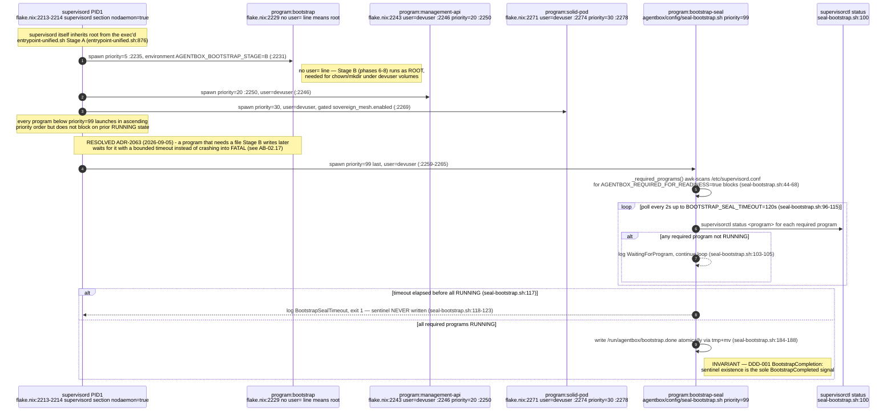
```mermaid
sequenceDiagram
    autonumber
    participant SV as supervisord PID1<br/>flake.nix:2213-2214 supervisord section nodaemon=true
    participant BOOT as program:bootstrap<br/>flake.nix:2229 no user= line means root
    participant MGMT as program:management-api<br/>flake.nix:2243 user=devuser :2246 priority=20 :2250
    participant SOLID as program:solid-pod<br/>flake.nix:2271 user=devuser :2274 priority=30 :2278
    participant SEAL as program:bootstrap-seal<br/>agentbox/config/seal-bootstrap.sh priority=99
    participant SC as supervisorctl status<br/>seal-bootstrap.sh:100

    Note over SV: supervisord itself inherits root from the exec'd<br/>entrypoint-unified.sh Stage A (entrypoint-unified.sh:876)
    SV->>BOOT: spawn priority=5 :2235, environment AGENTBOX_BOOTSTRAP_STAGE=B (:2231)
    Note right of BOOT: no user= line — Stage B (phases 6-8) runs as ROOT,<br/>needed for chown/mkdir under devuser volumes
    SV->>MGMT: spawn priority=20 :2250, user=devuser (:2246)
    SV->>SOLID: spawn priority=30, user=devuser, gated sovereign_mesh.enabled (:2269)
    Note over SV: every program below priority=99 launches in ascending<br/>priority order but does not block on prior RUNNING state
    Note over SV,BOOT: RESOLVED ADR-2063 (2026-09-05) - a program that needs a file Stage B writes later<br/>waits for it with a bounded timeout instead of crashing into FATAL (see AB-02.17)
    SV->>SEAL: spawn priority=99 last, user=devuser (:2259-2265)
    SEAL->>SEAL: _required_programs() awk-scans /etc/supervisord.conf<br/>for AGENTBOX_REQUIRED_FOR_READINESS=true blocks (seal-bootstrap.sh:44-68)
    loop poll every 2s up to BOOTSTRAP_SEAL_TIMEOUT=120s (seal-bootstrap.sh:96-115)
        SEAL->>SC: supervisorctl status <program> for each required program
        alt any required program not RUNNING
            SEAL-->>SEAL: log WaitingForProgram, continue loop (seal-bootstrap.sh:103-105)
        end
    end
    alt timeout elapsed before all RUNNING (seal-bootstrap.sh:117)
        SEAL-->>SV: log BootstrapSealTimeout, exit 1 — sentinel NEVER written (seal-bootstrap.sh:118-123)
    else all required programs RUNNING
        SEAL->>SEAL: write /run/agentbox/bootstrap.done atomically via tmp+mv (seal-bootstrap.sh:184-188)
        Note right of SEAL: INVARIANT — DDD-001 BootstrapCompletion:<br/>sentinel existence is the sole BootstrapCompleted signal
    end
```

## AB-02.9 readiness — /ready vs /health
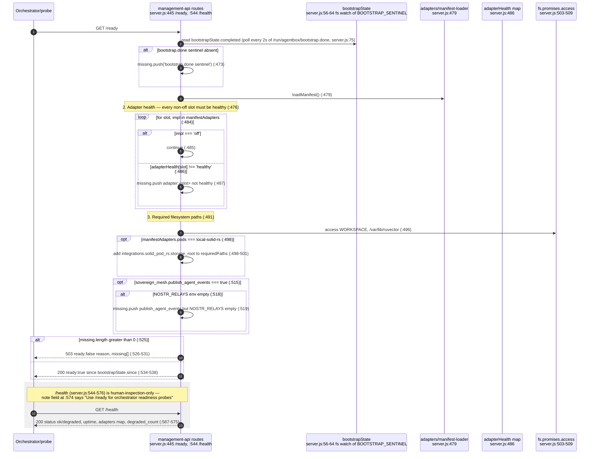
```mermaid
sequenceDiagram
    autonumber
    participant O as Orchestrator/probe
    participant R as management-api routes<br/>server.js:445 /ready, :544 /health
    participant BS as bootstrapState<br/>server.js:56-64 fs watch of BOOTSTRAP_SENTINEL
    participant ML as adapters/manifest-loader<br/>server.js:479
    participant AH as adapterHealth map<br/>server.js:486
    participant FS as fs.promises.access<br/>server.js:503-509

    O->>R: GET /ready
    R->>BS: read bootstrapState.completed (poll every 2s of /run/agentbox/bootstrap.done, server.js:75)
    alt bootstrap.done sentinel absent
        R->>R: missing.push('bootstrap.done sentinel') (:473)
    end
    R->>ML: loadManifest() (:479)
    Note over R: 2. Adapter health — every non-off slot must be healthy (:476)
    loop for slot, impl in manifestAdapters (:484)
        alt impl === 'off'
            R->>R: continue (:485)
        else adapterHealth[slot] !== 'healthy' (:486)
            R->>R: missing.push adapter:<slot> not healthy (:487)
        end
    end
    Note over R: 3. Required filesystem paths (:491)
    R->>FS: access WORKSPACE, /var/lib/ruvector (:496)
    opt manifestAdapters.pods === local-solid-rs (:498)
        R->>R: add integrations.solid_pod_rs.storage_root to requiredPaths (:498-501)
    end
    opt sovereign_mesh.publish_agent_events === true (:515)
        alt NOSTR_RELAYS env empty (:518)
            R->>R: missing.push publish_agent_events but NOSTR_RELAYS empty (:519)
        end
    end
    alt missing.length greater than 0 (:525)
        R-->>O: 503 ready:false reason, missing[] (:526-531)
    else
        R-->>O: 200 ready:true since bootstrapState.since (:534-538)
    end

    rect rgb(240,240,240)
    Note over O,R: /health (server.js:544-576) is human-inspection-only —<br/>note field at :574 says "Use /ready for orchestrator readiness probes"
    O->>R: GET /health
    R-->>O: 200 status ok/degraded, uptime, adapters map, degraded_count (:567-575)
    end
```

## AB-02.10 supervisord program lifecycle
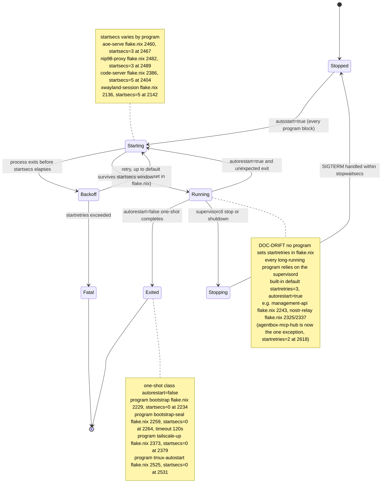
```mermaid
stateDiagram-v2
    [*] --> Stopped
    Stopped --> Starting: autostart=true (every program block)
    Starting --> Backoff: process exits before startsecs elapses
    Backoff --> Starting: retry, up to default startretries=3 (unset in flake.nix)
    Backoff --> Fatal: startretries exceeded
    Starting --> Running: survives startsecs window
    Running --> Exited: autorestart=false one-shot completes
    Running --> Starting: autorestart=true and unexpected exit
    Running --> Stopping: supervisorctl stop or shutdown
    Stopping --> Stopped: SIGTERM handled within stopwaitsecs
    Fatal --> [*]
    Exited --> [*]

    note right of Exited
        one-shot class autorestart=false
        program bootstrap flake.nix 2229, startsecs=0 at 2234
        program bootstrap-seal flake.nix 2259, startsecs=0 at 2264, timeout 120s
        program tailscale-up flake.nix 2373, startsecs=0 at 2379
        program tmux-autostart flake.nix 2525, startsecs=0 at 2531
    end note
    note right of Running
        DOC-DRIFT no program sets startretries in flake.nix
        every long-running program relies on the supervisord
        built-in default startretries=3, autorestart=true
        e.g. management-api flake.nix 2243, nostr-relay flake.nix 2325/2337
        (agentbox-mcp-hub is now the one exception, startretries=2 at 2618)
    end note
    note left of Starting
        startsecs varies by program
        aoe-serve flake.nix 2460, startsecs=3 at 2467
        nip98-proxy flake.nix 2482, startsecs=3 at 2489
        code-server flake.nix 2386, startsecs=5 at 2404
        xwayland-session flake.nix 2136, startsecs=5 at 2142
    end note
```

## AB-02.11 tmux-autostart window layout
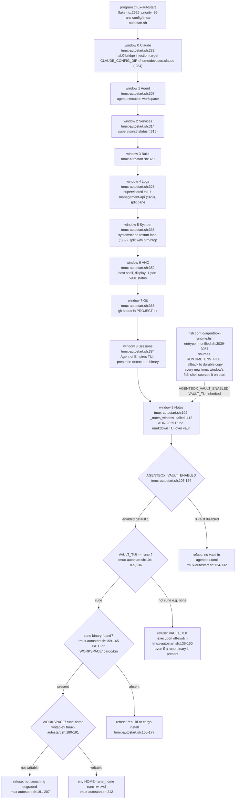
```mermaid
flowchart TB
    START["program:tmux-autostart<br/>flake.nix:2525, priority=95<br/>runs config/tmux-autostart.sh"]
    ENV["fish conf.d/agentbox-runtime.fish<br/>entrypoint-unified.sh:3039-3057<br/>sources RUNTIME_ENV_FILE, fallback to durable copy<br/>every new tmux window's fish shell sources it on start"]
    W0["window 0 Claude<br/>tmux-autostart.sh:282<br/>tab0-bridge injection target<br/>CLAUDE_CONFIG_DIR=/home/devuser/.claude (:284)"]
    W1["window 1 Agent<br/>tmux-autostart.sh:307<br/>agent execution workspace"]
    W2["window 2 Services<br/>tmux-autostart.sh:314<br/>supervisorctl status (:315)"]
    W3["window 3 Build<br/>tmux-autostart.sh:320"]
    W4["window 4 Logs<br/>tmux-autostart.sh:328<br/>supervisorctl tail -f management-api (:329), split pane"]
    W5["window 5 System<br/>tmux-autostart.sh:335<br/>systemscape restart loop (:339), split with btm/htop"]
    W6["window 6 VNC<br/>tmux-autostart.sh:352<br/>host shell, display :1 port 5901 status"]
    W7["window 7 Git<br/>tmux-autostart.sh:365<br/>git status in PROJECT dir"]
    W8["window 8 Sessions<br/>tmux-autostart.sh:384<br/>Agent of Empires TUI, presence-detect aoe binary"]
    W9["window 9 Notes<br/>tmux-autostart.sh:102 _notes_window, called :412<br/>ADR-2029 Rune markdown TUI over vault"]

    START --> W0 --> W1 --> W2 --> W3 --> W4 --> W5 --> W6 --> W7 --> W8 --> W9

    G1{"AGENTBOX_VAULT_ENABLED<br/>tmux-autostart.sh:106,124"}
    G2{"VAULT_TUI == rune ?<br/>tmux-autostart.sh:104-105,136"}
    G3{"rune binary found?<br/>tmux-autostart.sh:159-165<br/>PATH or WORKSPACE/.cargo/bin"}
    G4{"WORKSPACE/.rune-home<br/>writable? tmux-autostart.sh:180-191"}
    LAUNCH["env HOME=rune_home rune -w cwd<br/>tmux-autostart.sh:212"]

    ENV -.->|"AGENTBOX_VAULT_ENABLED, VAULT_TUI inherited"| W9
    W9 --> G1
    G1 -->|"0 vault disabled"| REFUSE1["refuse: no vault in agentbox.toml<br/>tmux-autostart.sh:124-132"]
    G1 -->|"enabled default 1"| G2
    G2 -->|"not rune e.g. none"| REFUSE2["refuse: VAULT_TUI execution off-switch<br/>tmux-autostart.sh:136-150<br/>even if a rune binary is present"]
    G2 -->|"rune"| G3
    G3 -->|"absent"| REFUSE3["refuse: rebuild or cargo install<br/>tmux-autostart.sh:165-177"]
    G3 -->|"present"| G4
    G4 -->|"not writable"| REFUSE4["refuse: not launching degraded<br/>tmux-autostart.sh:191-207"]
    G4 -->|"writable"| LAUNCH
```

## AB-02.12 profile isolation — per-profile HOME and CLAUDE_CONFIG_DIR (ADR-2007)
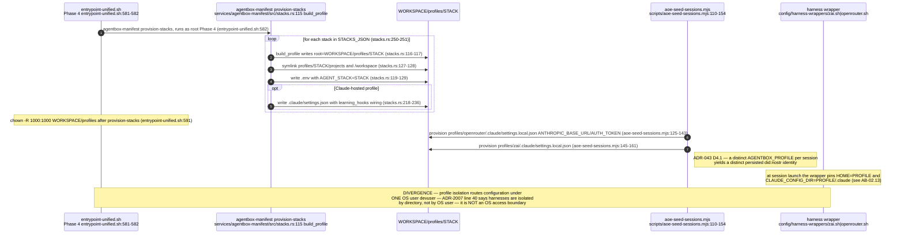
```mermaid
sequenceDiagram
    autonumber
    participant E as entrypoint-unified.sh<br/>Phase 4 entrypoint-unified.sh:581-582
    participant AM as agentbox-manifest provision-stacks<br/>services/agentbox-manifest/src/stacks.rs:115 build_profile
    participant FS as WORKSPACE/profiles/STACK
    participant SEED as aoe-seed-sessions.mjs<br/>scripts/aoe-seed-sessions.mjs:110-154
    participant WRAP as harness wrapper<br/>config/harness-wrappers/zai.sh|openrouter.sh

    E->>AM: agentbox-manifest provision-stacks, runs as root Phase 4 (entrypoint-unified.sh:582)
    loop for each stack in STACKS_JSON (stacks.rs:250-251)
        AM->>FS: build_profile writes root=WORKSPACE/profiles/STACK (stacks.rs:116-117)
        AM->>FS: symlink profiles/STACK/projects and /workspace (stacks.rs:127-128)
        AM->>FS: write .env with AGENT_STACK=STACK (stacks.rs:119-129)
        opt Claude-hosted profile
            AM->>FS: write .claude/settings.json with learning_hooks wiring (stacks.rs:218-236)
        end
    end
    Note over E: chown -R 1000:1000 WORKSPACE/profiles after provision-stacks (entrypoint-unified.sh:591)
    SEED->>FS: provision profiles/openrouter/.claude/settings.local.json ANTHROPIC_BASE_URL/AUTH_TOKEN (aoe-seed-sessions.mjs:125-143)
    SEED->>FS: provision profiles/zai/.claude/settings.local.json (aoe-seed-sessions.mjs:145-161)
    Note right of SEED: ADR-043 D4.1 — a distinct AGENTBOX_PROFILE per session<br/>yields a distinct persisted did:nostr identity
    Note over WRAP: at session launch the wrapper pins HOME=PROFILE and<br/>CLAUDE_CONFIG_DIR=PROFILE/.claude (see AB-02.13)
    Note over E,WRAP: DIVERGENCE — profile isolation routes configuration under<br/>ONE OS user devuser — ADR-2007 line 40 says harnesses are isolated<br/>by directory, not by OS user — it is NOT an OS access boundary
```

## AB-02.13 harness wrapper invocation — Z.AI / OpenRouter redirect assertion
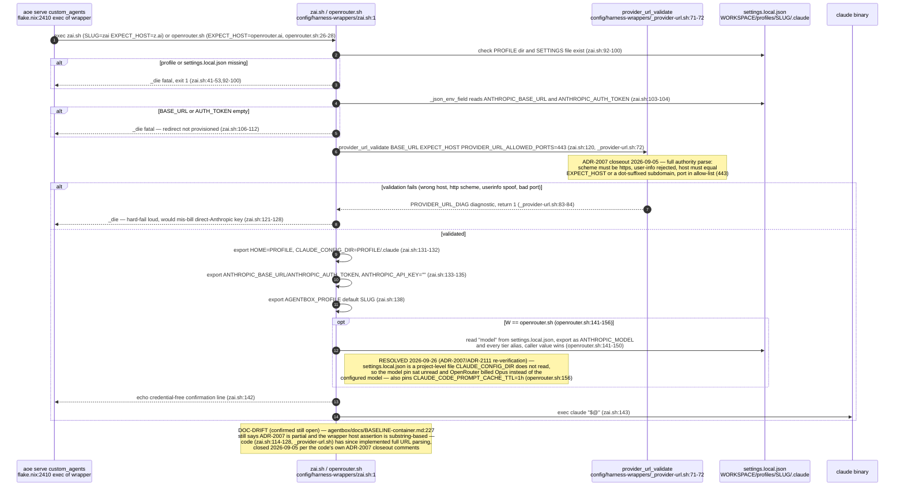
```mermaid
sequenceDiagram
    autonumber
    participant AOE as aoe serve custom_agents<br/>flake.nix:2410 exec of wrapper
    participant W as zai.sh / openrouter.sh<br/>config/harness-wrappers/zai.sh:1
    participant PV as provider_url_validate<br/>config/harness-wrappers/_provider-url.sh:71-72
    participant SET as settings.local.json<br/>WORKSPACE/profiles/SLUG/.claude
    participant C as claude binary

    AOE->>W: exec zai.sh (SLUG=zai EXPECT_HOST=z.ai) or openrouter.sh (EXPECT_HOST=openrouter.ai, openrouter.sh:26-28)
    W->>SET: check PROFILE dir and SETTINGS file exist (zai.sh:92-100)
    alt profile or settings.local.json missing
        W-->>AOE: _die fatal, exit 1 (zai.sh:41-53,92-100)
    end
    W->>SET: _json_env_field reads ANTHROPIC_BASE_URL and ANTHROPIC_AUTH_TOKEN (zai.sh:103-104)
    alt BASE_URL or AUTH_TOKEN empty
        W-->>AOE: _die fatal — redirect not provisioned (zai.sh:106-112)
    end
    W->>PV: provider_url_validate BASE_URL EXPECT_HOST PROVIDER_URL_ALLOWED_PORTS=443 (zai.sh:120, _provider-url.sh:72)
    Note over PV: ADR-2007 closeout 2026-09-05 — full authority parse:<br/>scheme must be https, user-info rejected, host must equal<br/>EXPECT_HOST or a dot-suffixed subdomain, port in allow-list (443)
    alt validation fails (wrong host, http scheme, userinfo spoof, bad port)
        PV-->>W: PROVIDER_URL_DIAG diagnostic, return 1 (_provider-url.sh:83-84)
        W-->>AOE: _die — hard-fail loud, would mis-bill direct-Anthropic key (zai.sh:121-128)
    else validated
        W->>W: export HOME=PROFILE, CLAUDE_CONFIG_DIR=PROFILE/.claude (zai.sh:131-132)
        W->>W: export ANTHROPIC_BASE_URL/ANTHROPIC_AUTH_TOKEN, ANTHROPIC_API_KEY="" (zai.sh:133-135)
        W->>W: export AGENTBOX_PROFILE default SLUG (zai.sh:138)
        opt W == openrouter.sh (openrouter.sh:141-156)
            W->>SET: read "model" from settings.local.json, export as ANTHROPIC_MODEL<br/>and every tier alias, caller value wins (openrouter.sh:141-150)
            Note right of W: RESOLVED 2026-09-26 (ADR-2007/ADR-2111 re-verification) —<br/>settings.local.json is a project-level file CLAUDE_CONFIG_DIR does not read,<br/>so the model pin sat unread and OpenRouter billed Opus instead of the<br/>configured model — also pins CLAUDE_CODE_PROMPT_CACHE_TTL=1h (openrouter.sh:156)
        end
        W-->>AOE: echo credential-free confirmation line (zai.sh:142)
        W->>C: exec claude "$@" (zai.sh:143)
    end
    Note over W: DOC-DRIFT (confirmed still open) — agentbox/docs/BASELINE-container.md:227<br/>still says ADR-2007 is partial and the wrapper host assertion is substring-based —<br/>code (zai.sh:114-128, _provider-url.sh) has since implemented full URL parsing,<br/>closed 2026-09-05 per the code's own ADR-2007 closeout comments
```

## AB-02.14 VAULT env propagation — resolve to PID1 to supervised programs
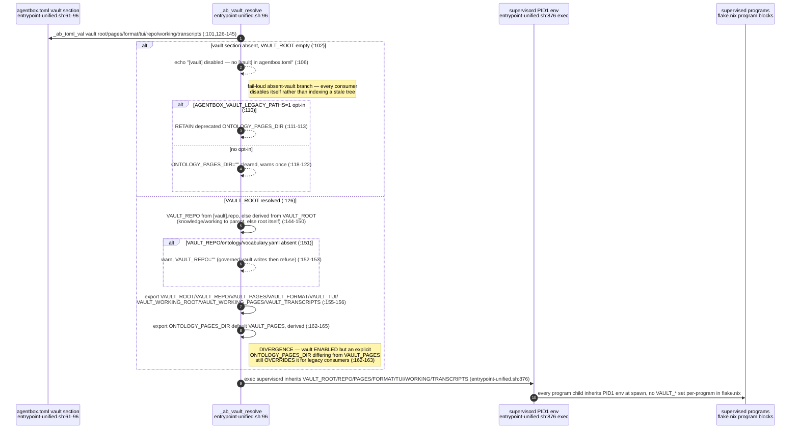
```mermaid
sequenceDiagram
    autonumber
    participant TOML as agentbox.toml vault section<br/>entrypoint-unified.sh:61-96
    participant VR as _ab_vault_resolve<br/>entrypoint-unified.sh:96
    participant PID1 as supervisord PID1 env<br/>entrypoint-unified.sh:876 exec
    participant PROG as supervised programs<br/>flake.nix program blocks

    VR->>TOML: _ab_toml_val vault root/pages/format/tui/repo/working/transcripts (:101,126-145)
    alt vault section absent, VAULT_ROOT empty (:102)
        VR-->>VR: echo "[vault] disabled — no [vault] in agentbox.toml" (:106)
        Note right of VR: fail-loud absent-vault branch — every consumer<br/>disables itself rather than indexing a stale tree
        alt AGENTBOX_VAULT_LEGACY_PATHS=1 opt-in (:110)
            VR-->>VR: RETAIN deprecated ONTOLOGY_PAGES_DIR (:111-113)
        else no opt-in
            VR-->>VR: ONTOLOGY_PAGES_DIR="" cleared, warns once (:118-122)
        end
    else VAULT_ROOT resolved (:126)
        VR->>VR: VAULT_REPO from [vault].repo, else derived from VAULT_ROOT<br/>(knowledge/working to parent, else root itself) (:144-150)
        alt VAULT_REPO/ontology/vocabulary.yaml absent (:151)
            VR-->>VR: warn, VAULT_REPO="" (governed vault writes then refuse) (:152-153)
        end
        VR->>VR: export VAULT_ROOT/VAULT_REPO/VAULT_PAGES/VAULT_FORMAT/VAULT_TUI/<br/>VAULT_WORKING_ROOT/VAULT_WORKING_PAGES/VAULT_TRANSCRIPTS (:155-156)
        VR->>VR: export ONTOLOGY_PAGES_DIR default VAULT_PAGES, derived (:162-165)
        Note right of VR: DIVERGENCE — vault ENABLED but an explicit<br/>ONTOLOGY_PAGES_DIR differing from VAULT_PAGES<br/>still OVERRIDES it for legacy consumers (:162-163)
    end
    VR->>PID1: exec supervisord inherits VAULT_ROOT/REPO/PAGES/FORMAT/TUI/WORKING/TRANSCRIPTS (entrypoint-unified.sh:876)
    PID1->>PROG: every program child inherits PID1 env at spawn, no VAULT_* set per-program in flake.nix
```

## AB-02.16 seccomp profile — supplemental denylist
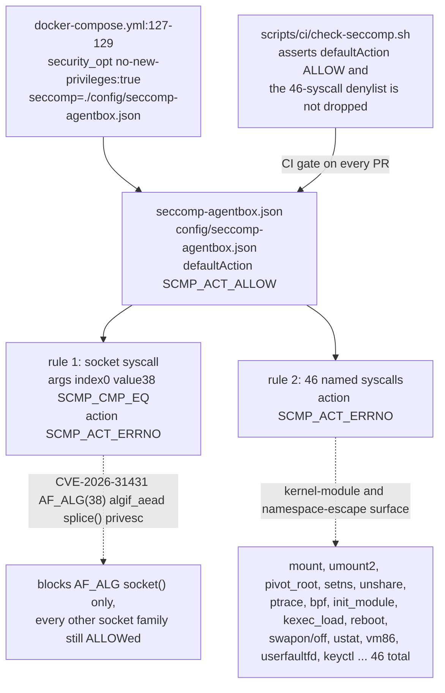
```mermaid
flowchart TB
    COMPOSE["docker-compose.yml:127-129<br/>security_opt no-new-privileges:true<br/>seccomp=./config/seccomp-agentbox.json"]
    PROFILE["seccomp-agentbox.json<br/>config/seccomp-agentbox.json<br/>defaultAction SCMP_ACT_ALLOW"]
    SOCK["rule 1: socket syscall<br/>args index0 value38 SCMP_CMP_EQ<br/>action SCMP_ACT_ERRNO"]
    DENY["rule 2: 46 named syscalls<br/>action SCMP_ACT_ERRNO"]
    CI["scripts/ci/check-seccomp.sh<br/>asserts defaultAction ALLOW and<br/>the 46-syscall denylist is not dropped"]

    COMPOSE --> PROFILE
    PROFILE --> SOCK
    PROFILE --> DENY
    SOCK -.->|"CVE-2026-31431 AF_ALG(38) algif_aead splice() privesc"| SOCKNOTE["blocks AF_ALG socket() only,<br/>every other socket family still ALLOWed"]
    DENY -.->|"kernel-module and namespace-escape surface"| DENYLIST["mount, umount2, pivot_root, setns, unshare,<br/>ptrace, bpf, init_module, kexec_load, reboot,<br/>swapon/off, ustat, vm86, userfaultfd, keyctl ... 46 total"]
    CI -->|"CI gate on every PR"| PROFILE
```

## AB-02.17 shared MCP hub: bounded wait, then a loud FATAL (ADR-2034, ADR-2104)
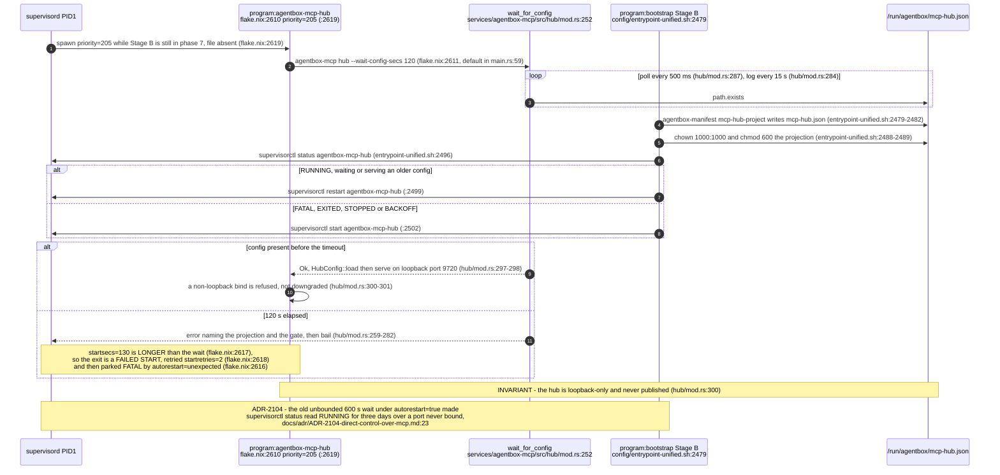
```mermaid
sequenceDiagram
    autonumber
    participant SV as supervisord PID1
    participant HUB as program:agentbox-mcp-hub<br/>flake.nix:2610 priority=205 (:2619)
    participant WAIT as wait_for_config<br/>services/agentbox-mcp/src/hub/mod.rs:252
    participant BOOT as program:bootstrap Stage B<br/>config/entrypoint-unified.sh:2479
    participant FS as /run/agentbox/mcp-hub.json

    SV->>HUB: spawn priority=205 while Stage B is still in phase 7, file absent (flake.nix:2619)
    HUB->>WAIT: agentbox-mcp hub --wait-config-secs 120 (flake.nix:2611, default in main.rs:59)
    loop poll every 500 ms (hub/mod.rs:287), log every 15 s (hub/mod.rs:284)
        WAIT->>FS: path.exists
    end
    BOOT->>FS: agentbox-manifest mcp-hub-project writes mcp-hub.json (entrypoint-unified.sh:2479-2482)
    BOOT->>FS: chown 1000:1000 and chmod 600 the projection (entrypoint-unified.sh:2488-2489)
    BOOT->>SV: supervisorctl status agentbox-mcp-hub (entrypoint-unified.sh:2496)
    alt RUNNING, waiting or serving an older config
        BOOT->>SV: supervisorctl restart agentbox-mcp-hub (:2499)
    else FATAL, EXITED, STOPPED or BACKOFF
        BOOT->>SV: supervisorctl start agentbox-mcp-hub (:2502)
    end
    alt config present before the timeout
        WAIT-->>HUB: Ok, HubConfig::load then serve on loopback port 9720 (hub/mod.rs:297-298)
        HUB->>HUB: a non-loopback bind is refused, not downgraded (hub/mod.rs:300-301)
    else 120 s elapsed
        WAIT-->>SV: error naming the projection and the gate, then bail (hub/mod.rs:259-282)
        Note over SV,HUB: startsecs=130 is LONGER than the wait (flake.nix:2617),<br/>so the exit is a FAILED START, retried startretries=2 (flake.nix:2618)<br/>and then parked FATAL by autorestart=unexpected (flake.nix:2616)
    end
    Note over HUB,FS: INVARIANT - the hub is loopback-only and never published (hub/mod.rs:300)
    Note over SV,BOOT: ADR-2104 - the old unbounded 600 s wait under autorestart=true made<br/>supervisorctl status read RUNNING for three days over a port never bound,<br/>docs/adr/ADR-2104-direct-control-over-mcp.md:23
```

**Invariant:** a hub that never receives its projection now fails the start rather than idling, because `startsecs=130` outlives the 120 s wait (`../project/agentbox/flake.nix:2617`, `../project/agentbox/services/agentbox-mcp/src/main.rs:59`).

**Debt:** nine MCP servers are hub-routed and exactly one has a call site in this repository, so a silent hub cost nothing that was noticed for three days (`../project/agentbox/docs/adr/ADR-2104-direct-control-over-mcp.md:30`).

## AB-02.18 session seeds — persisted records, orphan reaper, native-agent model (ADR-2063)
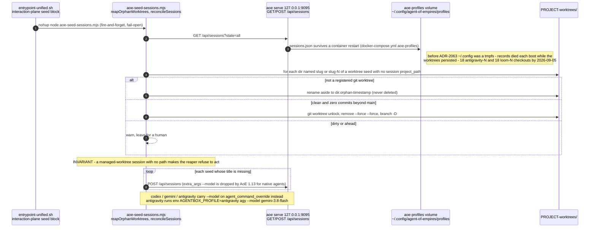
```mermaid
sequenceDiagram
    autonumber
    participant E as entrypoint-unified.sh<br/>interaction-plane seed block
    participant SEED as aoe-seed-sessions.mjs<br/>reapOrphanWorktrees, reconcileSessions
    participant AOE as aoe serve 127.0.0.1:9095<br/>GET/POST /api/sessions
    participant VOL as aoe-profiles volume<br/>~/.config/agent-of-empires/profiles
    participant WT as PROJECT-worktrees/

    E->>SEED: nohup node aoe-seed-sessions.mjs (fire-and-forget, fail-open)
    SEED->>AOE: GET /api/sessions?state=all
    AOE->>VOL: sessions.json survives a container restart (docker-compose.yml aoe-profiles)
    Note right of VOL: before ADR-2063 ~/.config was a tmpfs - records died each boot while the<br/>worktrees persisted - 18 antigravity-N and 18 loom-N checkouts by 2026-09-05
    SEED->>WT: for each dir named slug or slug-N of a worktree seed with no session project_path
    alt not a registered git worktree
        SEED->>WT: rename aside to dir.orphan-timestamp (never deleted)
    else clean and zero commits beyond main
        SEED->>WT: git worktree unlock, remove --force --force, branch -D
    else dirty or ahead
        SEED-->>SEED: warn, leave for a human
    end
    Note over SEED: INVARIANT - a managed-worktree session with no path makes the reaper refuse to act
    loop each seed whose title is missing
        SEED->>AOE: POST /api/sessions (extra_args --model is dropped by AoE 1.13 for native agents)
    end
    Note over SEED,AOE: codex / gemini / antigravity carry --model on agent_command_override instead<br/>antigravity runs env AGENTBOX_PROFILE=antigravity agy --model gemini-3.8-flash
```

## AB-02.19 aoe-seed-sessions.mjs run-as-script guard — realpath fix (2026-09-06)
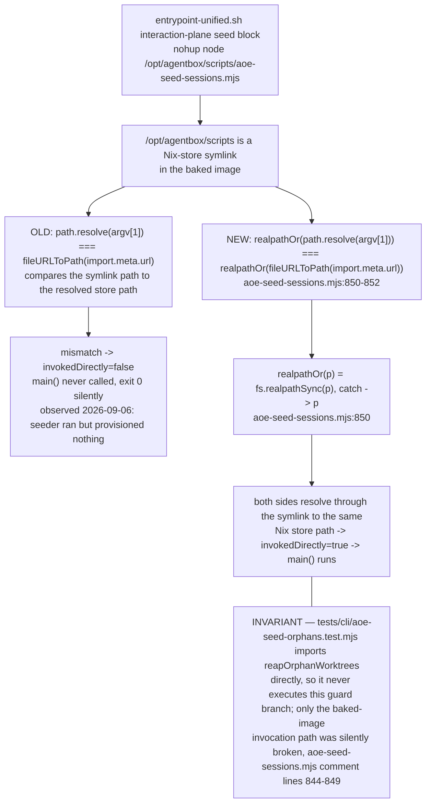
```mermaid
flowchart TB
    ENTRY["entrypoint-unified.sh interaction-plane seed block<br/>nohup node /opt/agentbox/scripts/aoe-seed-sessions.mjs"]
    SYMLINK["/opt/agentbox/scripts is a Nix-store symlink<br/>in the baked image"]
    OLDCHECK["OLD: path.resolve(argv[1]) === fileURLToPath(import.meta.url)<br/>compares the symlink path to the resolved store path"]
    OLDRESULT["mismatch -&gt; invokedDirectly=false<br/>main() never called, exit 0 silently<br/>observed 2026-09-06: seeder ran but provisioned nothing"]
    NEWCHECK["NEW: realpathOr(path.resolve(argv[1])) === realpathOr(fileURLToPath(import.meta.url))<br/>aoe-seed-sessions.mjs:850-852"]
    REALPATHOR["realpathOr(p) = fs.realpathSync(p), catch -&gt; p<br/>aoe-seed-sessions.mjs:850"]
    NEWRESULT["both sides resolve through the symlink to the same<br/>Nix store path -&gt; invokedDirectly=true -&gt; main() runs"]

    ENTRY --> SYMLINK --> OLDCHECK --> OLDRESULT
    SYMLINK --> NEWCHECK
    NEWCHECK --> REALPATHOR --> NEWRESULT

    NOTE1["INVARIANT — tests/cli/aoe-seed-orphans.test.mjs imports reapOrphanWorktrees<br/>directly, so it never executes this guard branch; only the baked-image<br/>invocation path was silently broken, aoe-seed-sessions.mjs comment lines 844-849"]
    NEWRESULT --- NOTE1
```

## AB-02.20 aoe-seed-sessions.mjs WRAPPER_SLUGS — router seed joins openrouter/zai (ADR-2080)
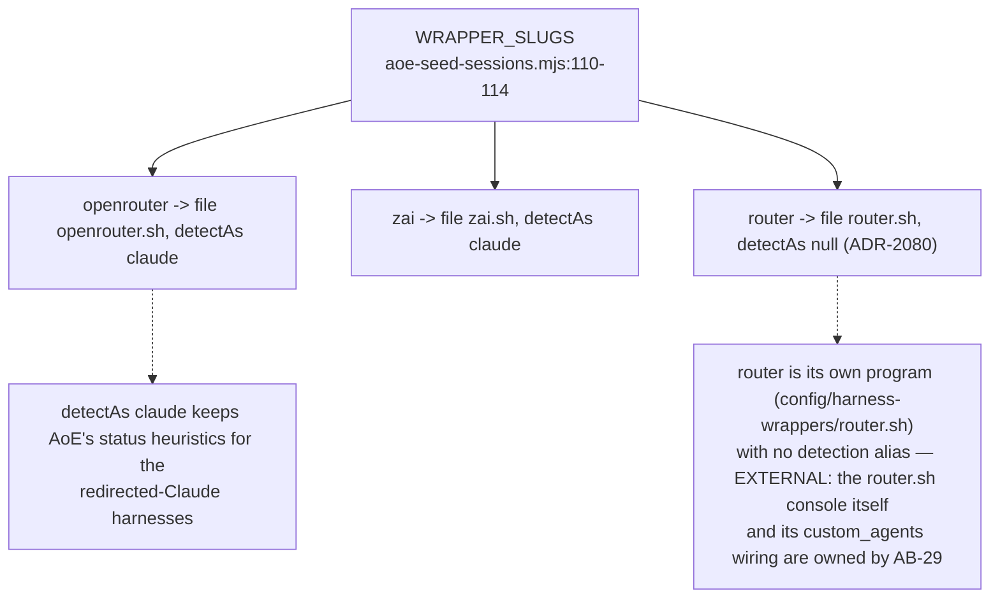
```mermaid
flowchart TB
    W["WRAPPER_SLUGS<br/>aoe-seed-sessions.mjs:110-114"]
    W --> OR["openrouter -&gt; file openrouter.sh, detectAs claude"]
    W --> ZA["zai -&gt; file zai.sh, detectAs claude"]
    W --> RO["router -&gt; file router.sh, detectAs null (ADR-2080)"]
    OR -.-> NOTE1["detectAs claude keeps AoE's status heuristics for the<br/>redirected-Claude harnesses"]
    RO -.-> NOTE2["router is its own program (config/harness-wrappers/router.sh)<br/>with no detection alias — EXTERNAL: the router.sh console itself<br/>and its custom_agents wiring are owned by AB-29"]
```

- `buildCoverage()` resolves each session_seed slug present in `WRAPPER_SLUGS` to `path.join(WRAPPER_DIR, WRAPPER_SLUGS[slug].file)` as its `customAgents` program, and sets `detectAs[slug]` only `if (WRAPPER_SLUGS[slug].detectAs)` (aoe-seed-sessions.mjs:341-352) — the `router` slug from `[[interaction_plane.session_seeds]]` (`agentbox.toml:1658-1662`, `tool = "custom:router"` at `:1660`) resolves through this table exactly like `openrouter`/`zai` did before ADR-2080, but with `detectAs` left unset.
- see AB-01.11, AB-05.11 for the `[model_routing.neural]` gate that bakes `router.sh`'s artefact directory; see AB-29 for the console's own request/response flow.

## AB-02.22 bootstrap.done now means the promised projections exist (ADR-2104)
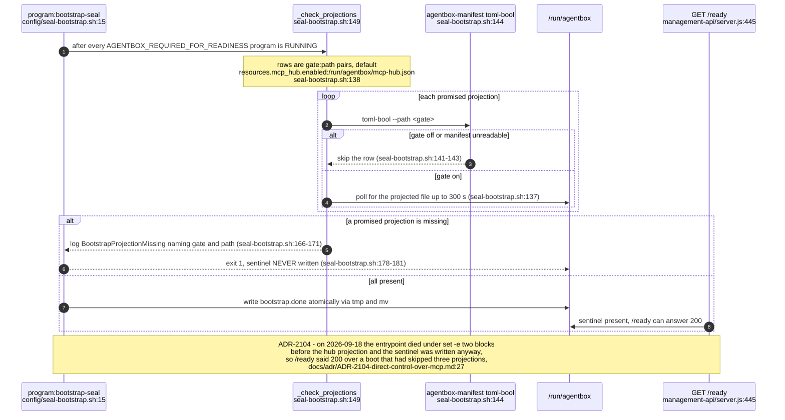
```mermaid
sequenceDiagram
    autonumber
    participant SEAL as program:bootstrap-seal<br/>config/seal-bootstrap.sh:15
    participant CP as _check_projections<br/>seal-bootstrap.sh:149
    participant AM as agentbox-manifest toml-bool<br/>seal-bootstrap.sh:144
    participant FS as /run/agentbox
    participant RDY as GET /ready<br/>management-api/server.js:445

    SEAL->>CP: after every AGENTBOX_REQUIRED_FOR_READINESS program is RUNNING
    Note over CP: rows are gate:path pairs, default<br/>resources.mcp_hub.enabled:/run/agentbox/mcp-hub.json<br/>seal-bootstrap.sh:138
    loop each promised projection
        CP->>AM: toml-bool --path <gate>
        alt gate off or manifest unreadable
            AM-->>CP: skip the row (seal-bootstrap.sh:141-143)
        else gate on
            CP->>FS: poll for the projected file up to 300 s (seal-bootstrap.sh:137)
        end
    end
    alt a promised projection is missing
        CP-->>SEAL: log BootstrapProjectionMissing naming gate and path (seal-bootstrap.sh:166-171)
        SEAL-->>FS: exit 1, sentinel NEVER written (seal-bootstrap.sh:178-181)
    else all present
        SEAL->>FS: write bootstrap.done atomically via tmp and mv
        RDY->>FS: sentinel present, /ready can answer 200
    end
    Note over SEAL,RDY: ADR-2104 - on 2026-09-18 the entrypoint died under set -e two blocks<br/>before the hub projection and the sentinel was written anyway,<br/>so /ready said 200 over a boot that had skipped three projections,<br/>docs/adr/ADR-2104-direct-control-over-mcp.md:27
```

**Invariant:** the sentinel is written only after every gate-on projection in `_PROJECTIONS` exists, so `bootstrap.done` means more than "the daemons came up" (`../project/agentbox/config/seal-bootstrap.sh:178`).

**Open:** the projection table carries exactly one row today, and nothing forces a new boot-written file into it (`../project/agentbox/config/seal-bootstrap.sh:138`).

## AB-02.23 registry reconciliation at boot: skills, agents, commands (ADR-2092)
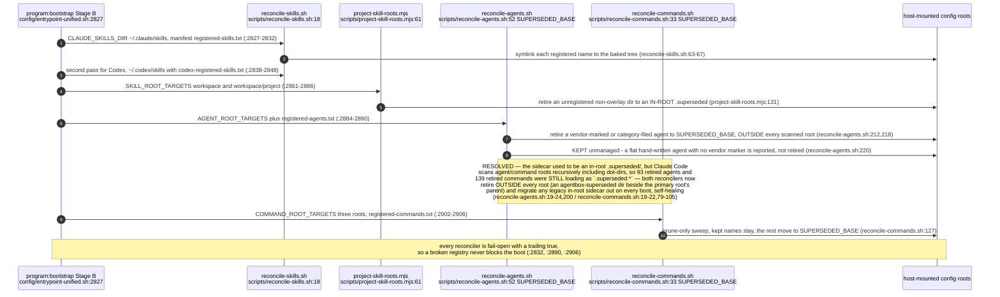
```mermaid
sequenceDiagram
    autonumber
    participant B as program:bootstrap Stage B<br/>config/entrypoint-unified.sh:2827
    participant RS as reconcile-skills.sh<br/>scripts/reconcile-skills.sh:18
    participant PR as project-skill-roots.mjs<br/>scripts/project-skill-roots.mjs:61
    participant RA as reconcile-agents.sh<br/>scripts/reconcile-agents.sh:52 SUPERSEDED_BASE
    participant RC as reconcile-commands.sh<br/>scripts/reconcile-commands.sh:33 SUPERSEDED_BASE
    participant FS as host-mounted config roots

    B->>RS: CLAUDE_SKILLS_DIR ~/.claude/skills, manifest registered-skills.txt (:2827-2832)
    RS->>FS: symlink each registered name to the baked tree (reconcile-skills.sh:63-67)
    B->>RS: second pass for Codex, ~/.codex/skills with codex-registered-skills.txt (:2838-2848)
    B->>PR: SKILL_ROOT_TARGETS workspace and workspace/project (:2861-2866)
    PR->>FS: retire an unregistered non-overlay dir to an IN-ROOT .superseded (project-skill-roots.mjs:131)
    B->>RA: AGENT_ROOT_TARGETS plus registered-agents.txt (:2884-2890)
    RA->>FS: retire a vendor-marked or category-filed agent to SUPERSEDED_BASE, OUTSIDE every scanned root (reconcile-agents.sh:212,218)
    RA->>FS: KEPT unmanaged - a flat hand-written agent with no vendor marker is reported, not retired (reconcile-agents.sh:220)
    Note over RA,RC: RESOLVED — the sidecar used to be an in-root .superseded/, but Claude Code<br/>scans agent/command roots recursively including dot-dirs, so 93 retired agents and<br/>139 retired commands were STILL loading as `.superseded:*` — both reconcilers now<br/>retire OUTSIDE every root (an agentbox-superseded dir beside the primary root's<br/>parent) and migrate any legacy in-root sidecar out on every boot, self-healing<br/>(reconcile-agents.sh:19-24,200 / reconcile-commands.sh:19-22,79-105)
    B->>RC: COMMAND_ROOT_TARGETS three roots, registered-commands.txt (:2902-2906)
    RC->>FS: prune-only sweep, kept names stay, the rest move to SUPERSEDED_BASE (reconcile-commands.sh:127)
    Note over B,FS: every reconciler is fail-open with a trailing true,<br/>so a broken registry never blocks the boot (:2832, :2890, :2906)
```

**What it shows.** The four boot-phase reconcilers that make the visible skill, agent and command sets a function of checked-in manifests rather than of whatever a vendor installer last dumped into the host mounts.
**Why it is this way.** ADR-2092: the agent roots were ungoverned, so `ruflo init` and `aqe init --auto` accreted 97 agents across two roots, 74 duplicated and 37 byte-divergent, with the nested root shadowing the user root (`../project/agentbox/config/entrypoint-unified.sh:2872-2879`).

**Invariant:** retirement is always to a recoverable sidecar, never a delete, in all three reconcilers — for agents and commands that sidecar now sits OUTSIDE every scanned root (`../project/agentbox/scripts/reconcile-agents.sh:94-105`, `../project/agentbox/scripts/reconcile-commands.sh:13-14`).

**Invariant:** a hand-written agent placed flat in the root with no vendor marker is preserved and reported, so experiments survive the sweep (`../project/agentbox/scripts/reconcile-agents.sh:220`).

**Debt:** the registries are four separate manifests in three formats (12 agents, 1 command, 20 Claude skills and 17 Codex skills), each reconciled by its own script with its own retirement rules (`../project/agentbox/agents/registered-agents.txt:1`, `../project/agentbox/config/registered-commands.txt:1`).
