## AB-03.1 server.js boot part 1 — Fastify construction, hooks, static route registers

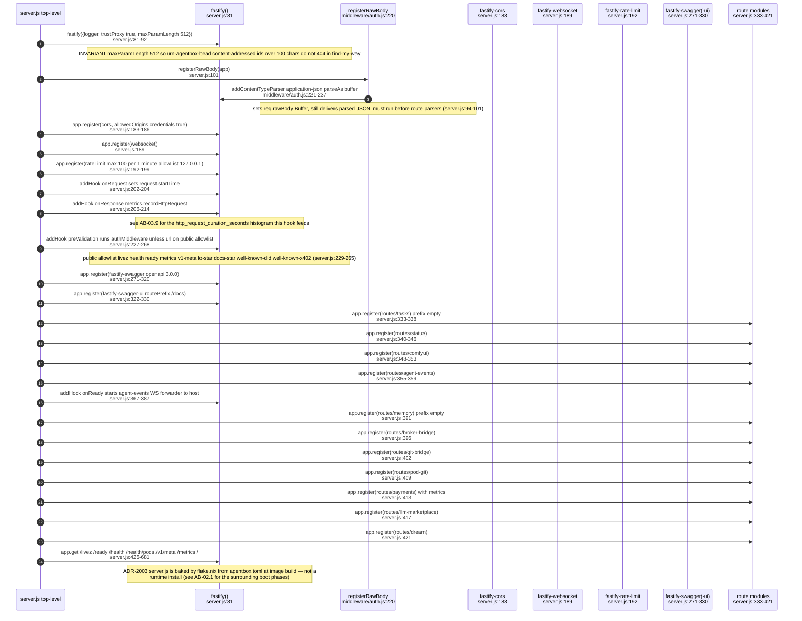

## AB-03.2 server.js boot part 2 — async start() manifest-gated route mounts

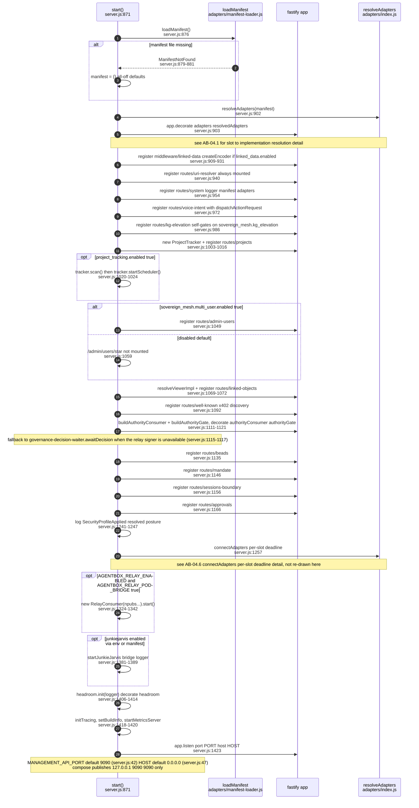

## AB-03.3 generic request lifecycle — Fastify hook phases, auth and validation failure

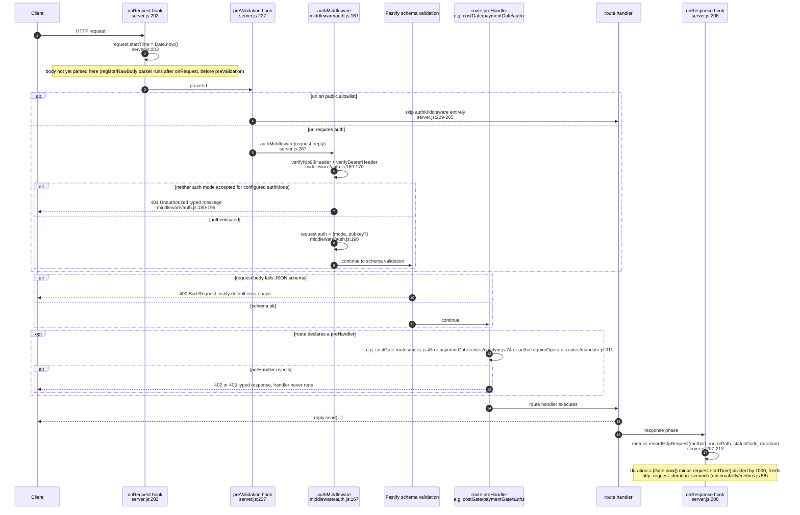

## AB-03.4 lib/authz.js — identity resolution predicates

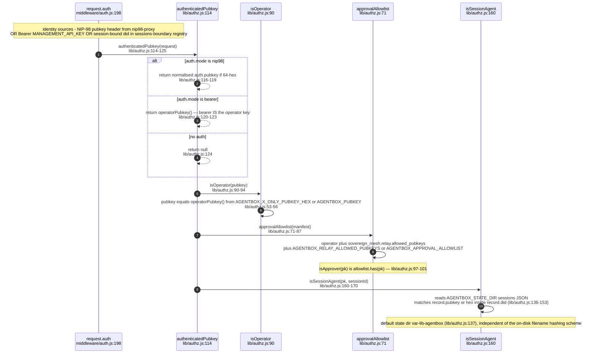

## AB-03.5 lib/authz.js — requireOperator and requireApprover preHandler gates

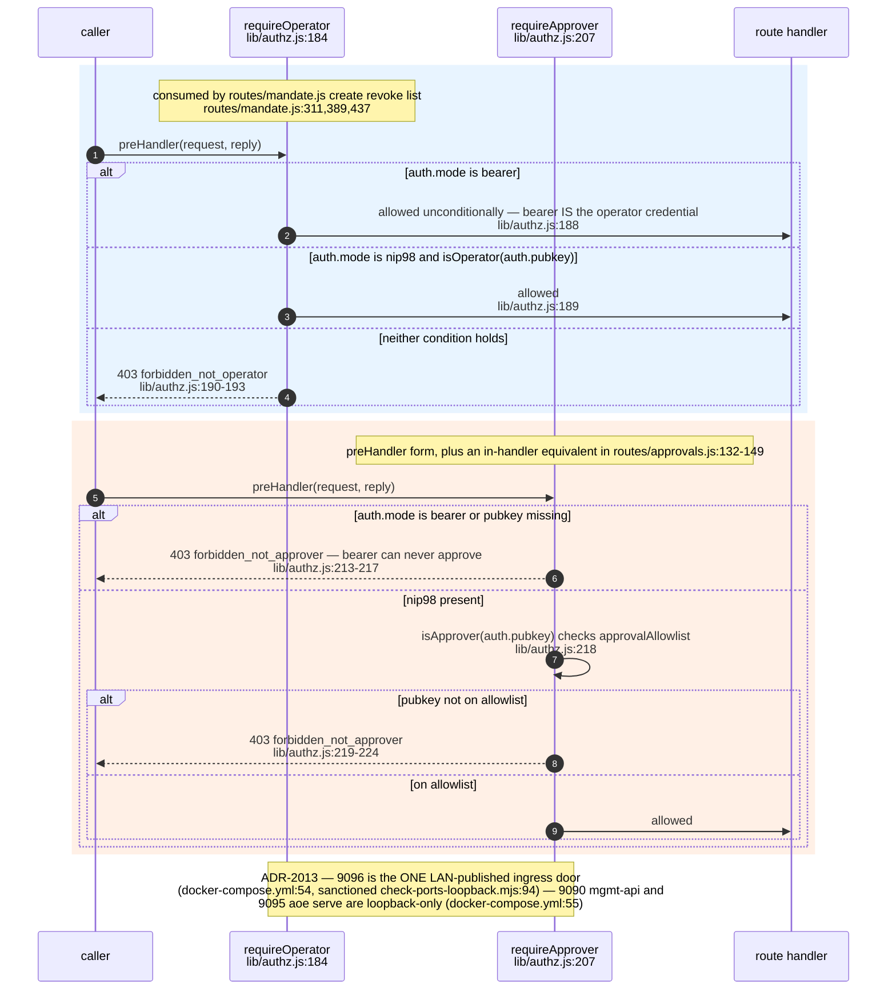

## AB-03.6 route table (a) — system, status, well-known, uri-resolver, meta probes

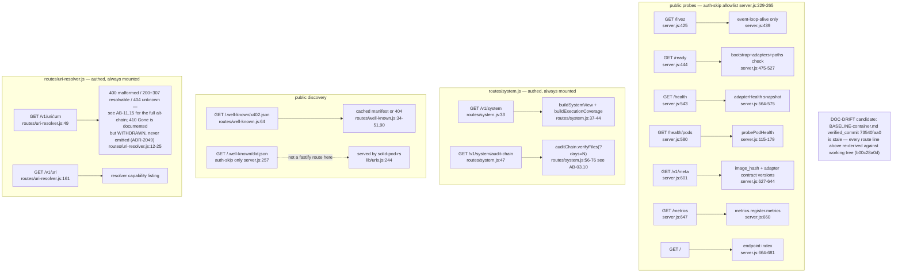

## AB-03.7 route table (b) — tasks, beads, projects

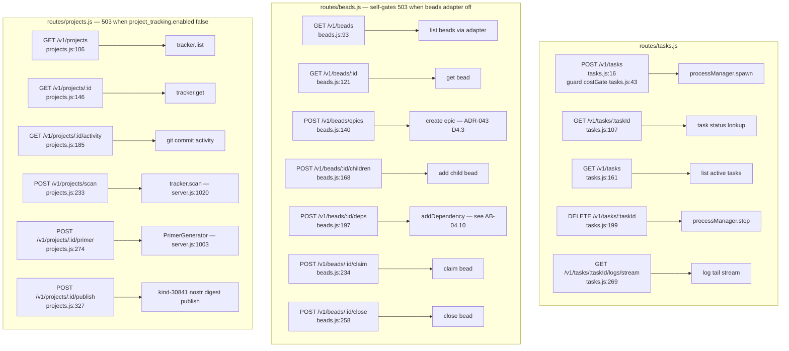

## AB-03.8 route table (c) — memory, kg-elevation, linked-objects

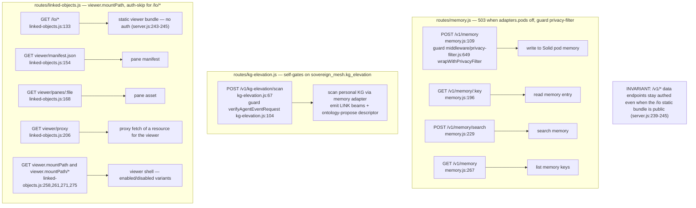

## AB-03.9 route table (d) — sessions-boundary, agent-events, admin-users, approvals, mandate

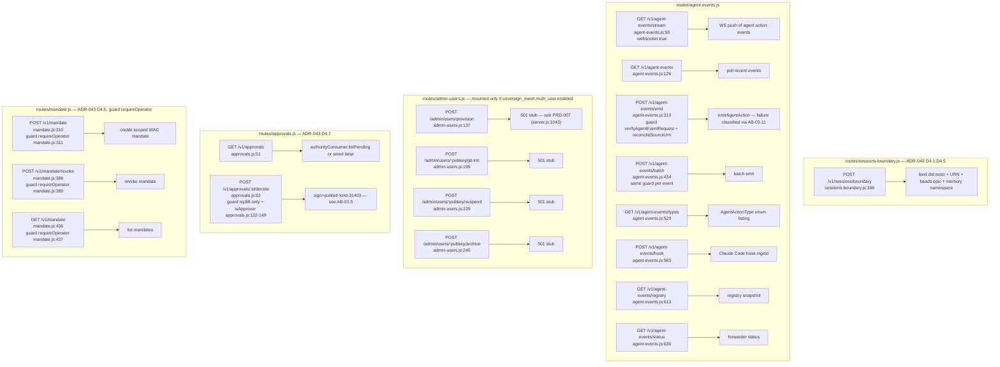

## AB-03.10 route table (e1) — payments, llm-marketplace, dream, comfyui

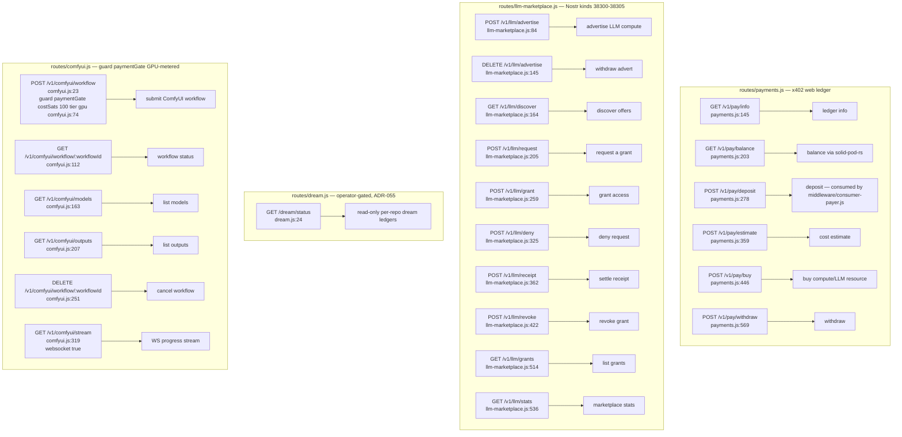

## AB-03.11 route table (e2) — voice-intent, broker-bridge, git-bridge, pod-git

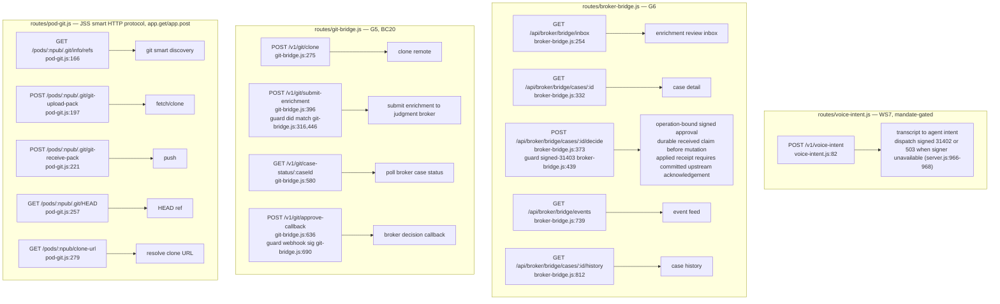

## AB-03.12 lib/audit-chain.js — hash-chained events append and verify

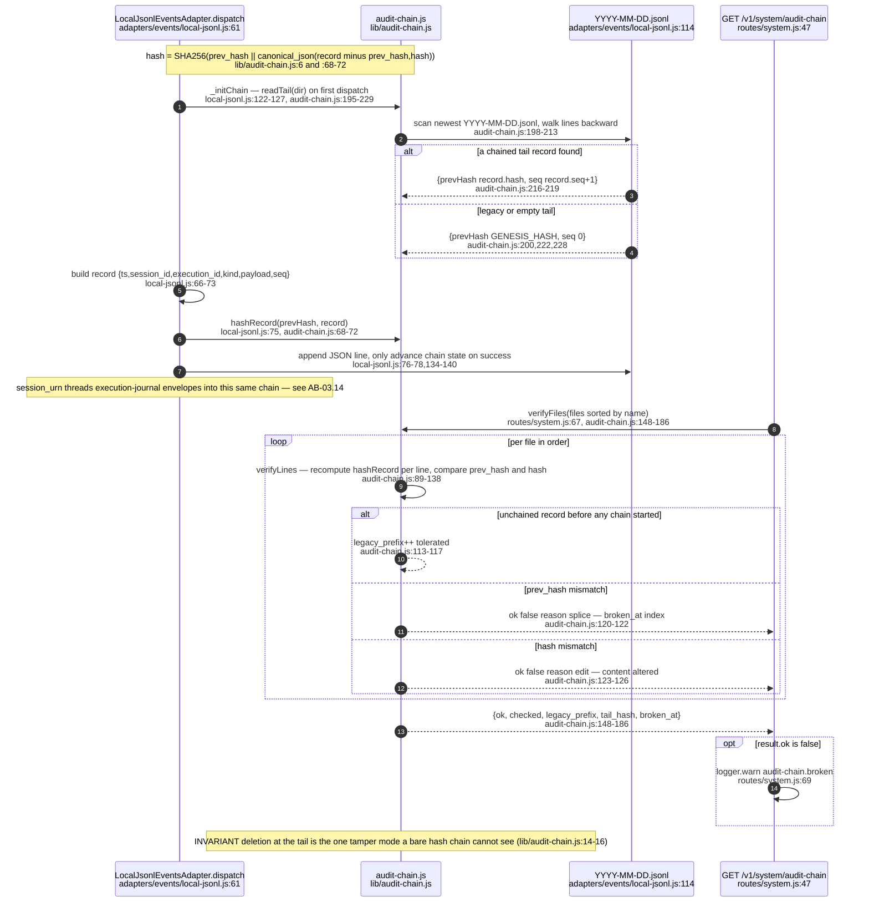

## AB-03.13 lib/failure-taxonomy.js — MAST classifier on agent-events failure returns

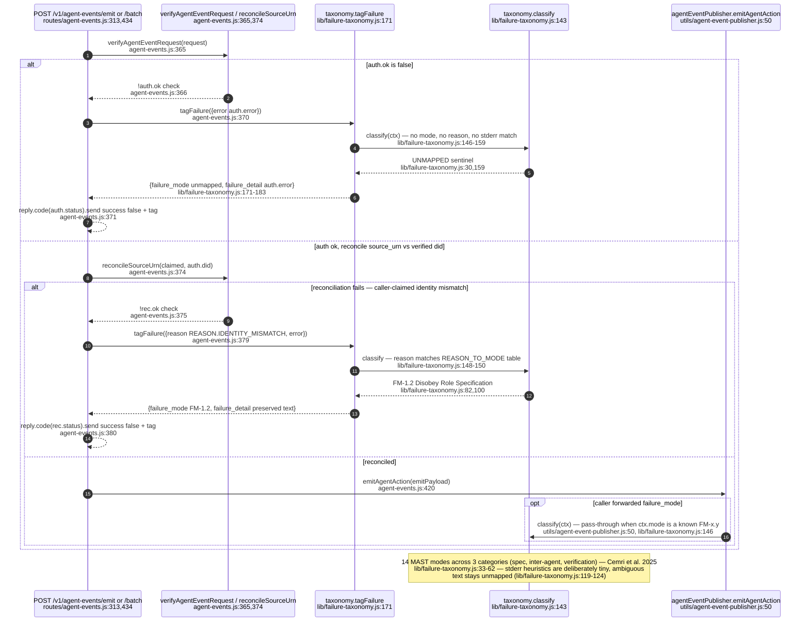

## AB-03.14 lib/execution-journal.js — ExecutionJournal.append envelope + D2 provenance gate

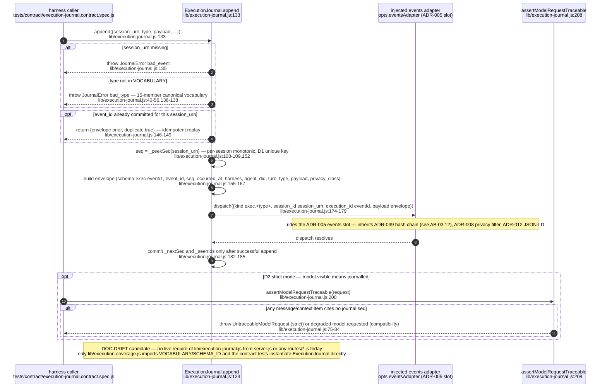

## AB-03.15 end-to-end authenticated write — nip98-proxy through audit-chain

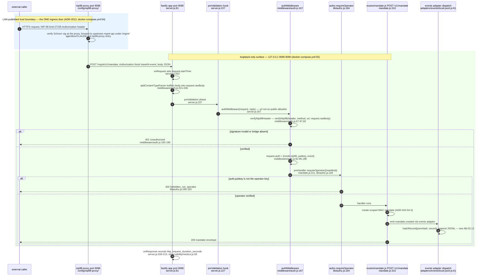

## AB-03.16 middleware/*.js inventory — which routes and hooks actually consume each file

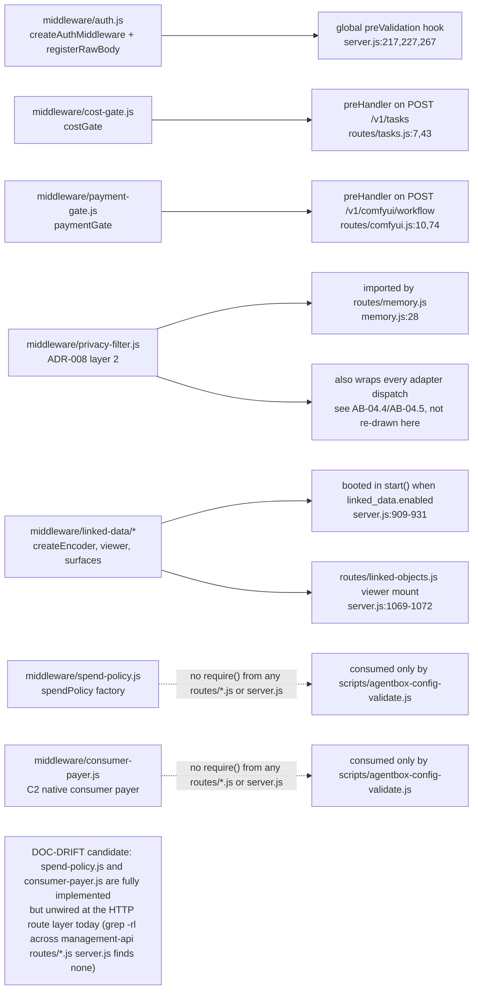

## AB-03.17 DIVERGENCE check — raw-body content-type parser IS registered

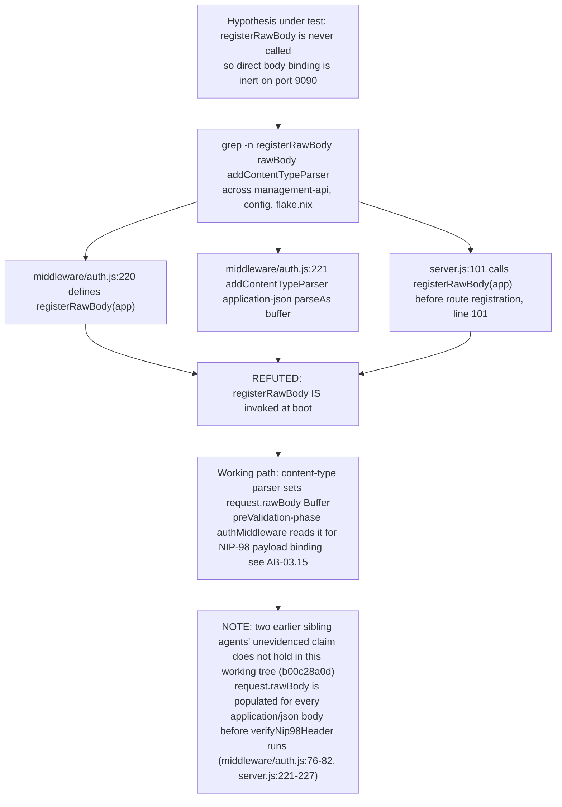

