## AB-04.1 resolveAdapters — slot to implementation resolution
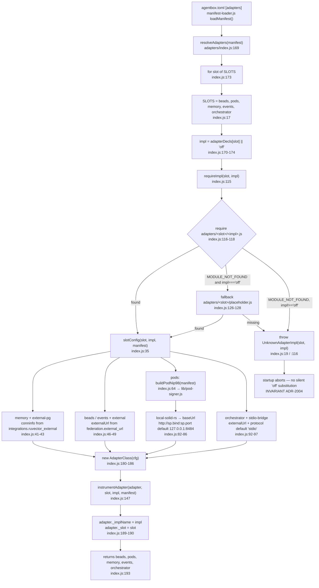

## AB-04.2 Adapter class hierarchy across the three implementation classes
```mermaid
classDiagram
    class BaseAdapter {
        +String slot
        +String impl
        +String CONTRACT_VERSION
        +Boolean enabled
        +constructor(slot, impl, contractVersion) base.js:20
    }
    class EmbeddedRuvectorMemoryAdapter {
        +store(key, value, namespace) embedded-ruvector.js:76
        +search(query, opts) embedded-ruvector.js:98
        +retrieve(key, namespace) embedded-ruvector.js:119
        +del(key, namespace) embedded-ruvector.js:137
        +list(namespace) embedded-ruvector.js:149
        -_ns(namespace) embedded-ruvector.js:63
    }
    class OffMemoryAdapter {
        +store() throws AdapterDisabled off.js:19
        +search() throws AdapterDisabled off.js:20
        +retrieve() throws AdapterDisabled off.js:21
        +del() throws AdapterDisabled off.js:22
        +list() throws AdapterDisabled off.js:23
    }
    class LocalSqliteBeadsAdapter {
        +createEpic(opts) local-sqlite.js:78
        +createChild(opts) local-sqlite.js:113
        +claim(id, actor) local-sqlite.js:145
        +close(id, outcome) local-sqlite.js:168
        +addDependency(childId, blockerId, type) local-sqlite.js:195
        +getReady(filter) local-sqlite.js:236
        +show(id) local-sqlite.js:259
    }
    class SolidHttpPodsAdapter {
        -_nip98 signer or null _solid-http-base.js:54
        -_requireSigned ADR-2064 fail-closed _solid-http-base.js:55
        -_fetch signed when signer OR requireSigned _solid-http-base.js:62-64
        +write(uri, body, contentType) _solid-http-base.js:119
        +read(uri) _solid-http-base.js:135
        +patch(uri, patch) _solid-http-base.js:150
        +del(uri) _solid-http-base.js:165
        +list(container, opts) _solid-http-base.js:178
    }
    class LocalSolidRsPodsAdapter {
        +probeCapabilities() local-solid-rs.js:51
        +list(container, opts) local-solid-rs.js:72
        +patch(uri, patch, opts) local-solid-rs.js:126
    }
    class LocalJsonlEventsAdapter {
        +dispatch(event) local-jsonl.js:61
        +subscribe(filter, handler) local-jsonl.js:94
        +unsubscribe(subscriptionId) local-jsonl.js:106
        -_initChain() local-jsonl.js:122
    }
    class LocalProcessManagerOrchestratorAdapter {
        +spawnAgent(spec) local-process-manager.js:41
        +streamEvent(agentId, handler) local-process-manager.js:102
        +listAgents() local-process-manager.js:115
        +handleGovernanceDecision(event) local-process-manager.js:133
        +terminateAgent(agentId) local-process-manager.js:303
    }
    BaseAdapter <|-- EmbeddedRuvectorMemoryAdapter
    BaseAdapter <|-- OffMemoryAdapter
    BaseAdapter <|-- LocalSqliteBeadsAdapter
    BaseAdapter <|-- SolidHttpPodsAdapter
    SolidHttpPodsAdapter <|-- LocalSolidRsPodsAdapter
    BaseAdapter <|-- LocalJsonlEventsAdapter
    BaseAdapter <|-- LocalProcessManagerOrchestratorAdapter
```

## AB-04.3 instrumentAdapter — prototype-chain walk that installs the wrappers
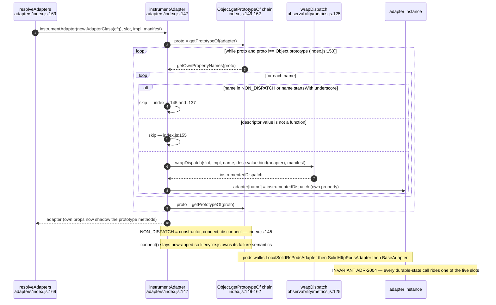

## AB-04.4 wrapDispatch — the middleware order actually wired
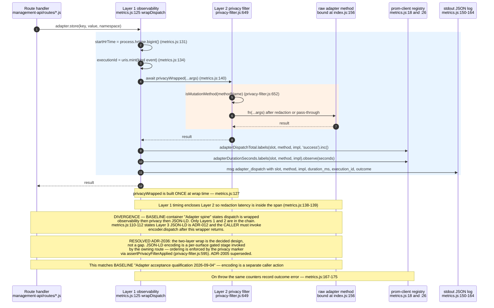

## AB-04.5 Layer 2 privacy filter — write-op gating and fail policy
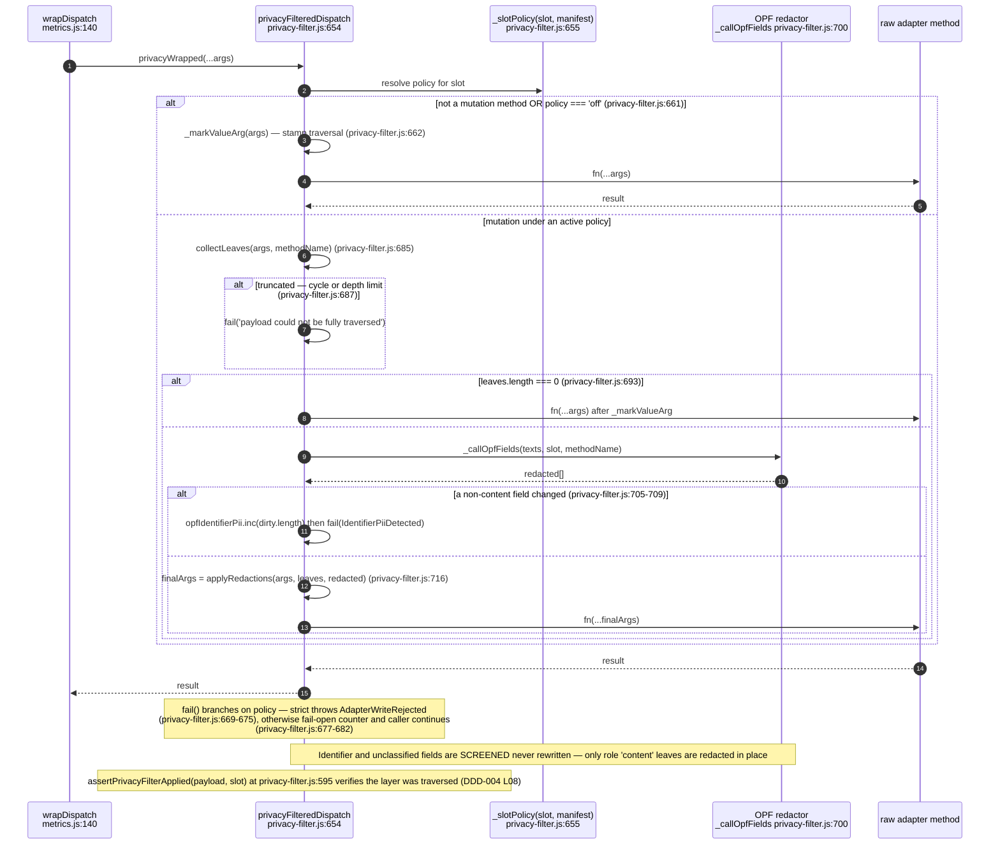

## AB-04.6 connectAdapters — per-slot deadline, not one aggregate budget
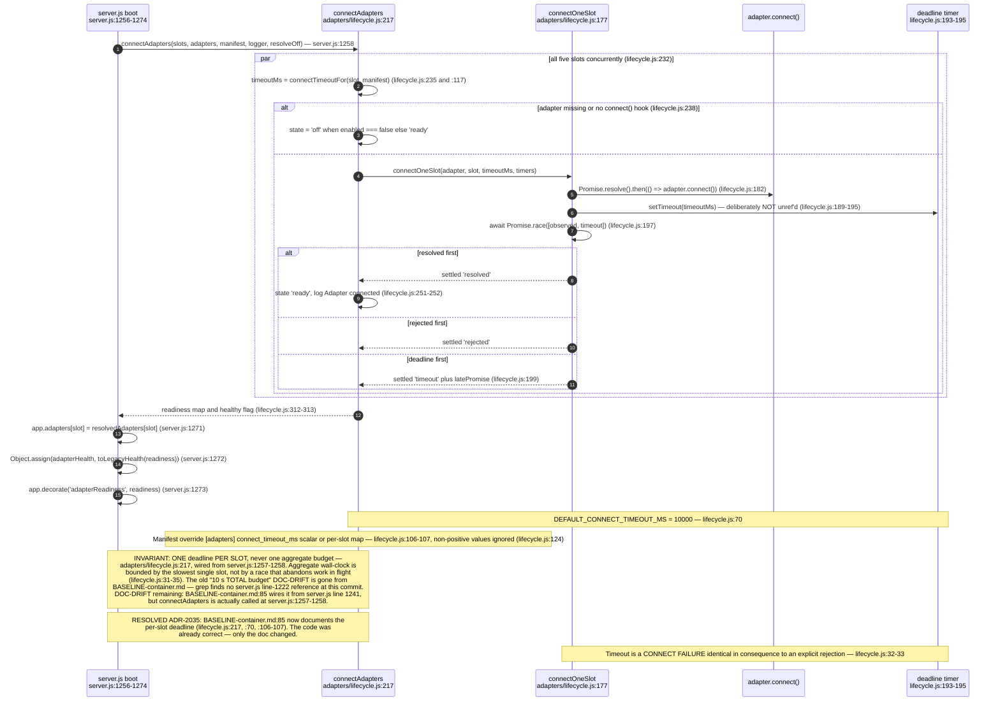

## AB-04.7 Failure path — quarantine before replacement, fail-closed slots abort
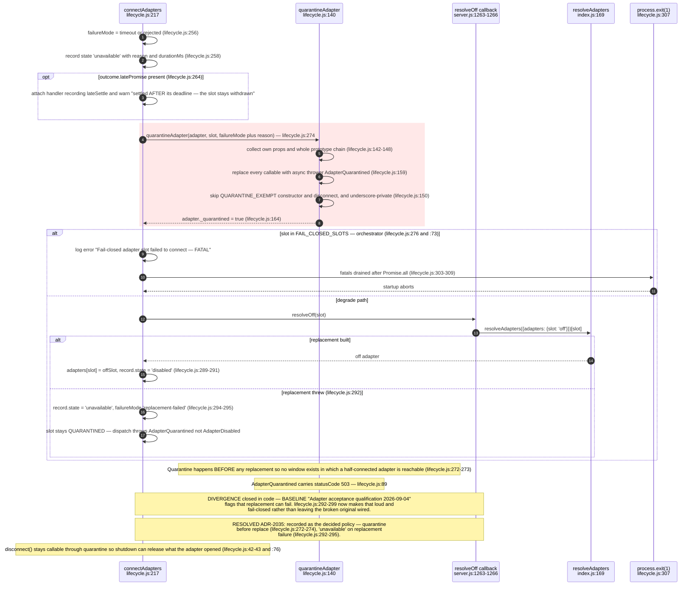

## AB-04.8 Per-slot readiness lifecycle and the legacy health collapse
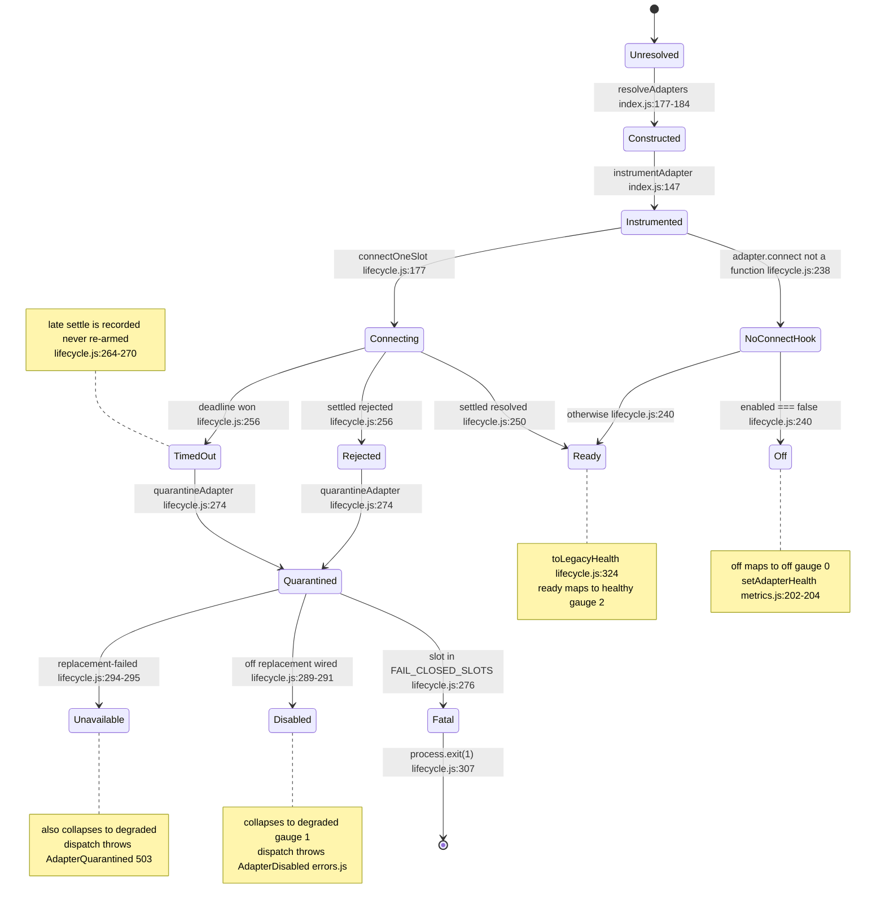

## AB-04.9 memory.store — embedded-ruvector dispatch through both layers
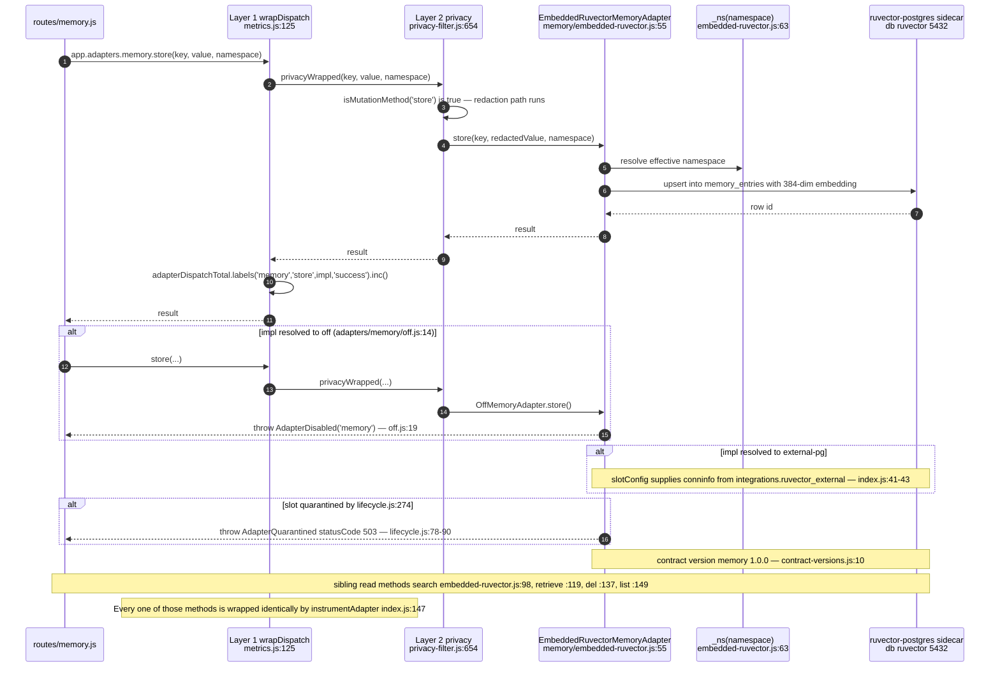

## AB-04.10 beads.addDependency and beads.getReady — the 1.1.0 work-DAG pair
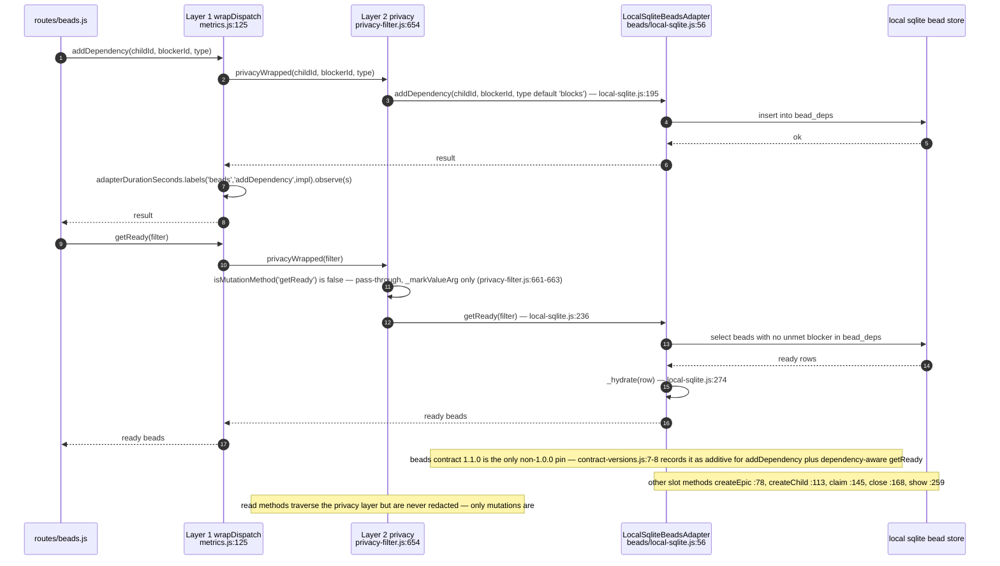

## AB-04.11 pods.write — NIP-98 origination through the signed fetch
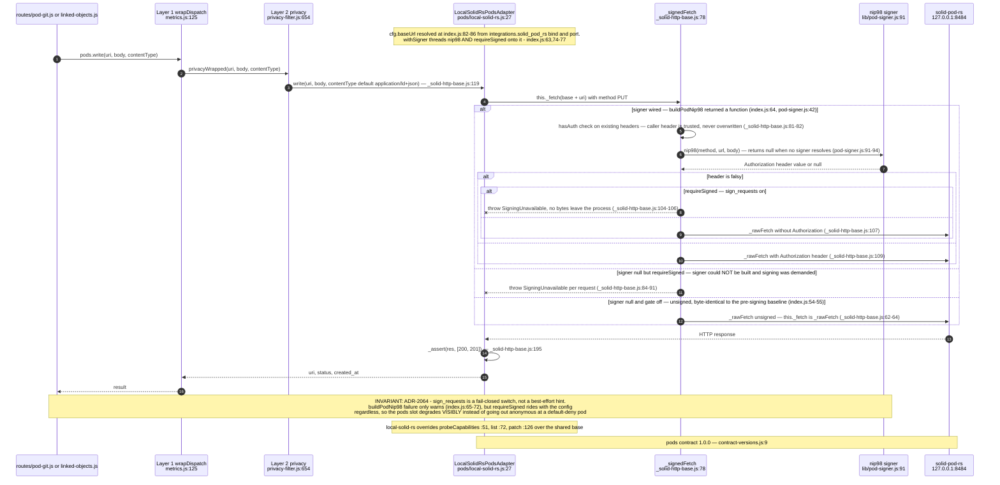

## AB-04.12 events.dispatch — hash-chained local JSONL sink
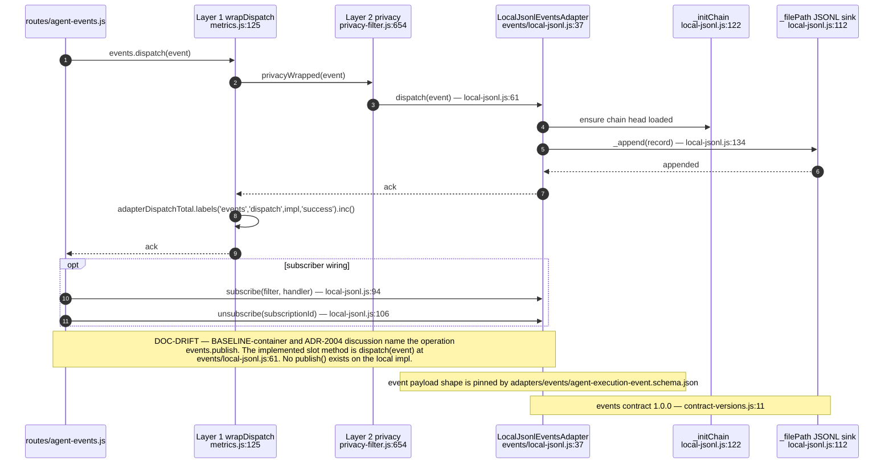

## AB-04.13 orchestrator.spawnAgent — the only fail-closed slot
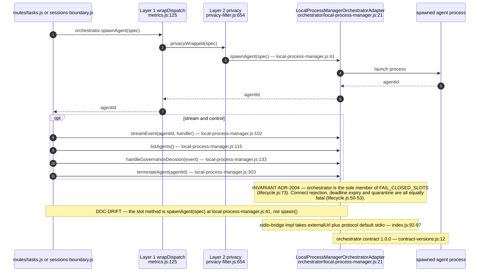

## AB-04.14 Contract-version pins per slot
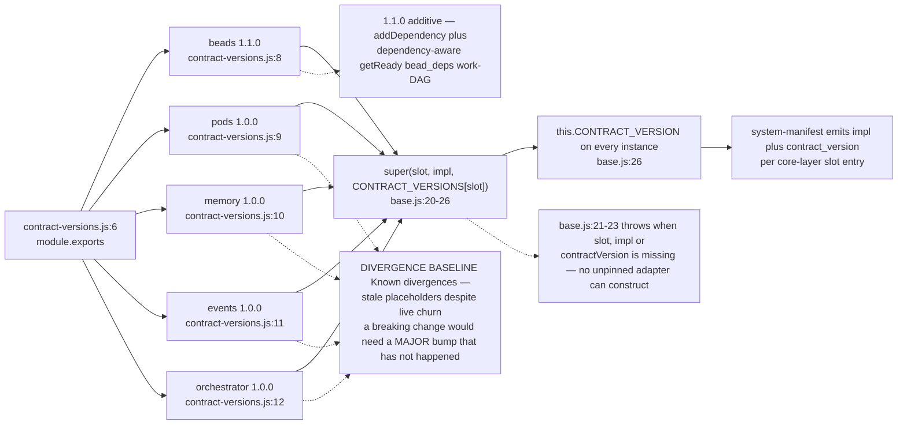

## AB-04.15 The four validation stages — different files, different lifecycle points
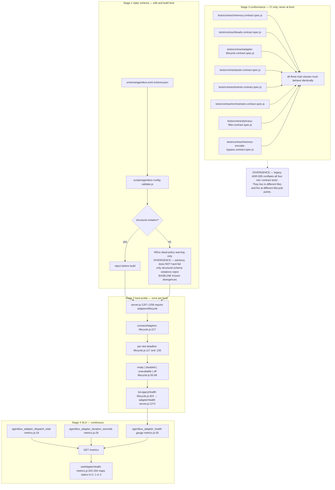

## AB-04.16 SLO surfacing and the agentbox.sh health exit contract
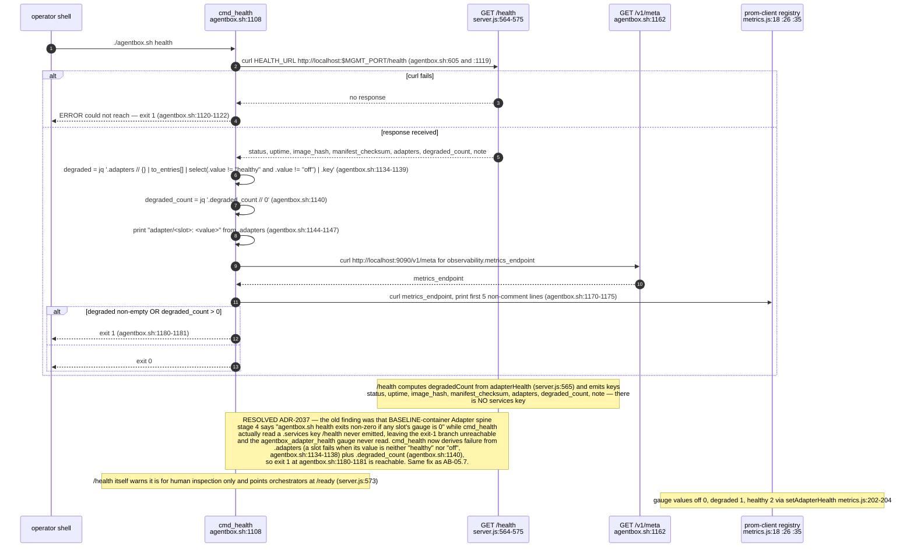
