## AB-05.1 GET /v1/system — catalogue plus live introspection
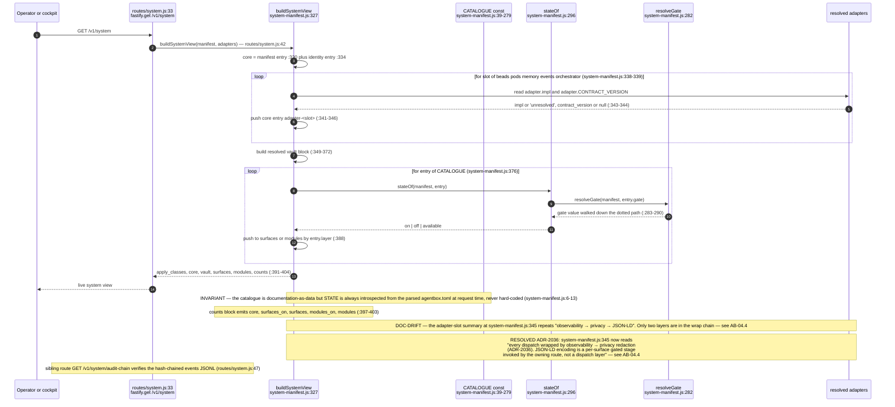

## AB-05.2 Catalogue shape and the real surface/module census
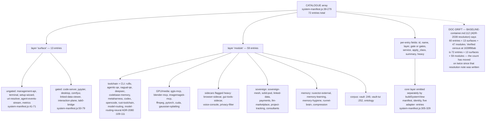

## AB-05.3 stateOf — how a gate value becomes a state word
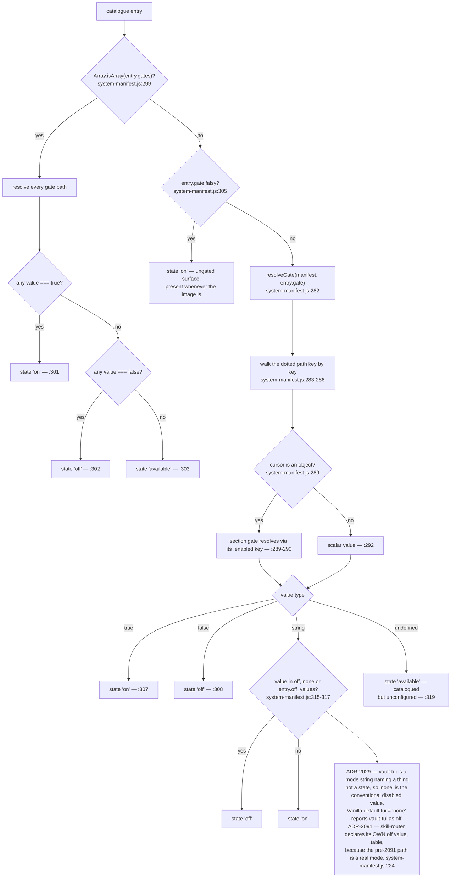

## AB-05.4 [vault] — the single corpus path authority, catalogued as two entries
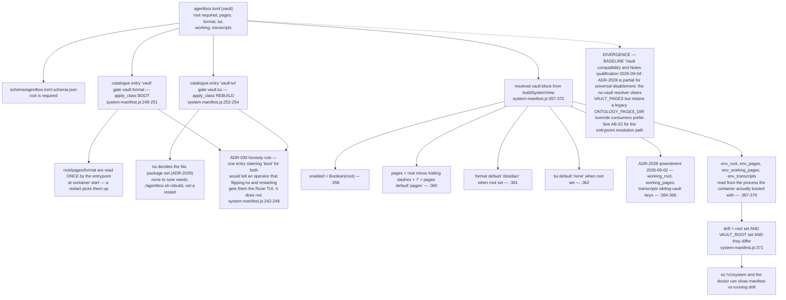

## AB-05.5 agentbox.sh top-level subcommand dispatch
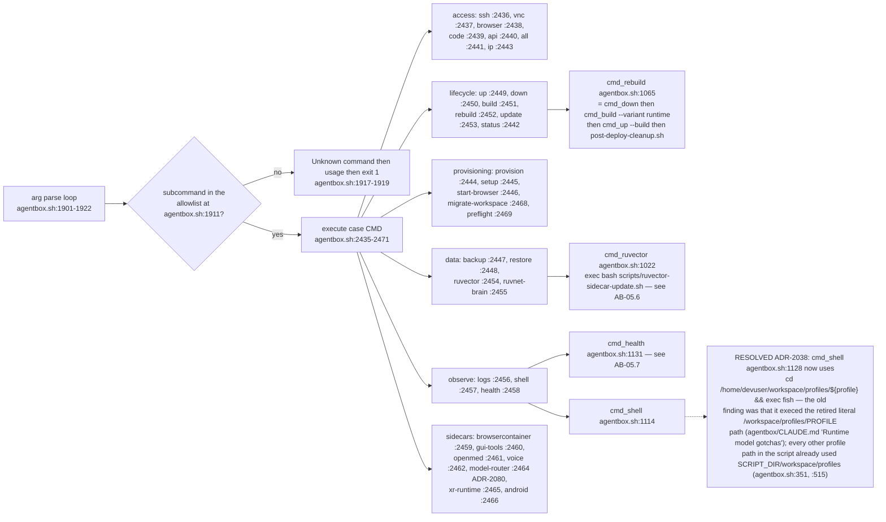

## AB-05.6 agentbox.sh ruvector — a dispatch table split across two files
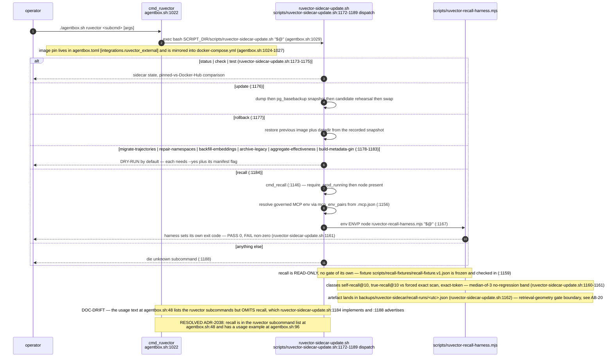

## AB-05.7 agentbox.sh health — exit-code contract
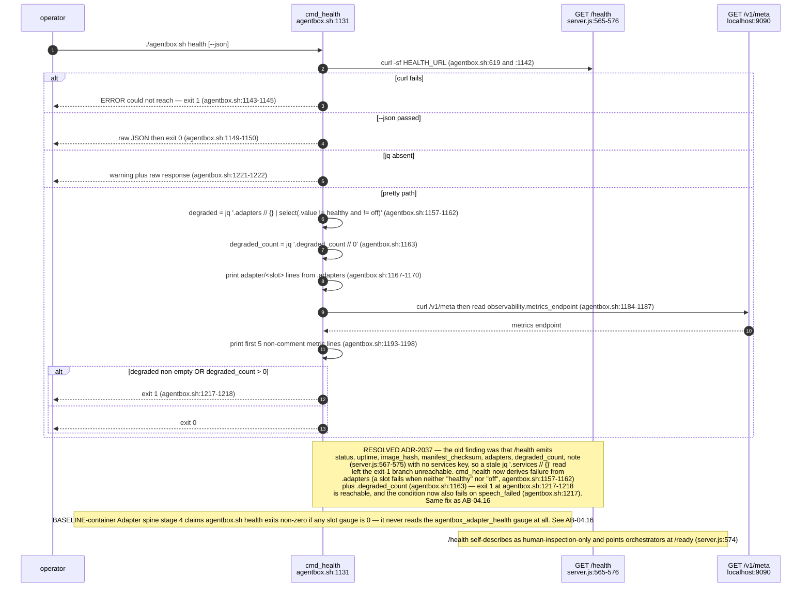

## AB-05.8 Artifact validation gate — the last check before exec supervisord
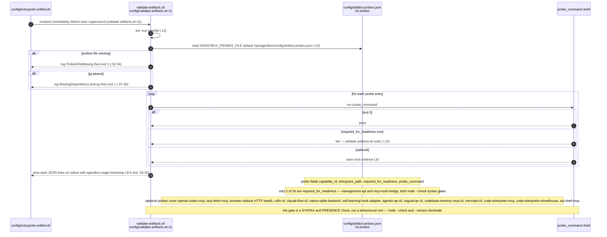

## AB-05.9 Apply-class as an operator decision procedure
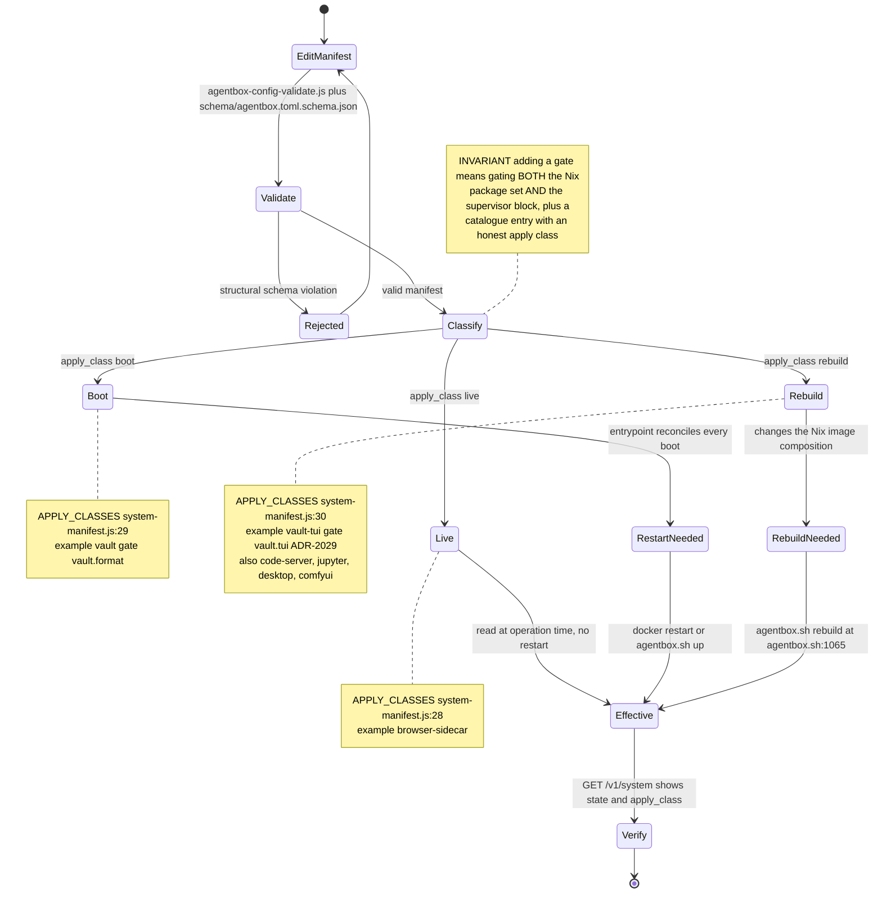

## AB-05.10 Schema surfaces and the setup wizard boundary
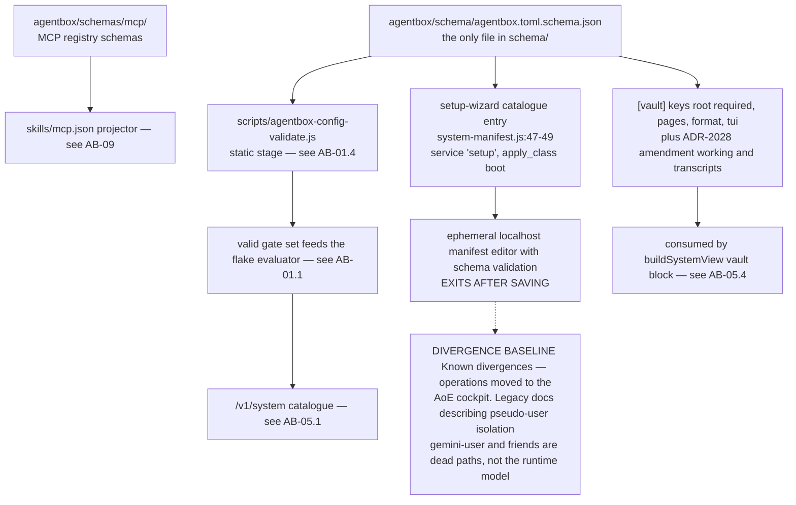

## AB-05.11 agentbox.sh model-router — ADR-2080 CLI dispatch, gated by [model_routing.neural]
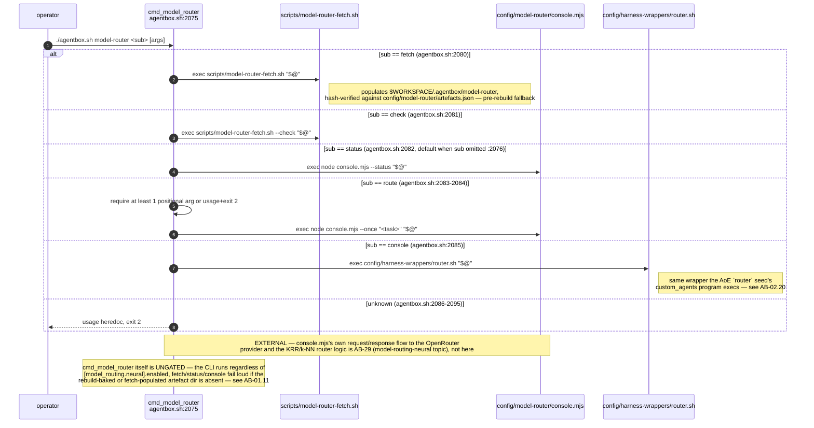

## AB-05.12 setup/agentbox-setup — pre-boot wizard pointer (audit gap 3, full detail in AB-30)

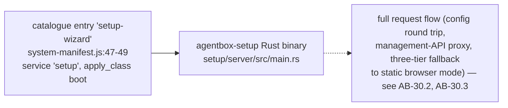

## AB-05.13 The gate families added since 2026-09-06: System One, compaction, resources
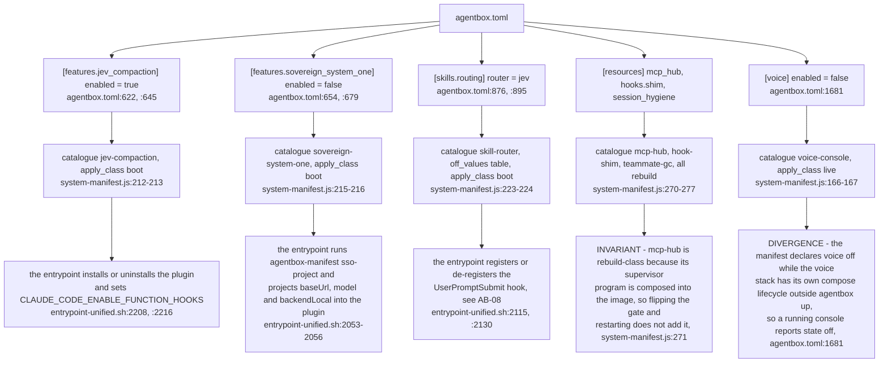

**What it shows.** The five manifest gate families added since the last stamp of this topic, each traced from its `agentbox.toml` section to its catalogue entry and to the boot step that applies it.
**Why it is this way.** ADR-039's honesty rule: a gate is catalogued with the apply class of the place it is consumed, so `sovereign_system_one` is boot-class here even though its sidecar has a lifecycle of its own (`../project/agentbox/management-api/lib/system-manifest.js:216`).

**Tension (manifest vs running estate):** `[voice].enabled = false` (`../project/agentbox/agentbox.toml:1681`) while the voice console runs under its own compose lifecycle, so the live view reports `voice-console` off for a surface that is up (`../project/agentbox/management-api/lib/system-manifest.js:166`).

**Debt:** `payment_settlement` is declared `zero-tolerance` with its own task properties (`../project/agentbox/agentbox.toml:980`, `:1028`) but no route passes that action class to the authority gate; `mandate_revoke` is the only class any route names (`../project/agentbox/management-api/routes/llm-marketplace.js:457`).

**Debt:** the agent, command and skill registries governed by ADR-2092 are manifest files of their own (`registered-agents.txt`, `registered-commands.txt`, `registered-skills.txt`) with no `agentbox.toml` gate and no catalogue entry, so `GET /v1/system` cannot report what the reconcilers did (`../project/agentbox/config/entrypoint-unified.sh:2662`, `../project/agentbox/management-api/lib/system-manifest.js:39`).

**Drift (gate catalogue vs the sealed chain):** `[sidechain]` is a fully specified manifest gate — catalogue rows, apply classes and three supervised programs — that cannot be added to `agentbox.toml` at all, because the schema sets `additionalProperties: false` at the top level and has no `sidechain` entry; the chain it would govern has nevertheless been sealed and is running outside the manifest entirely (see AB-32.5, AB-34.5).
