## AB-05.1 GET /v1/system — catalogue plus live introspection
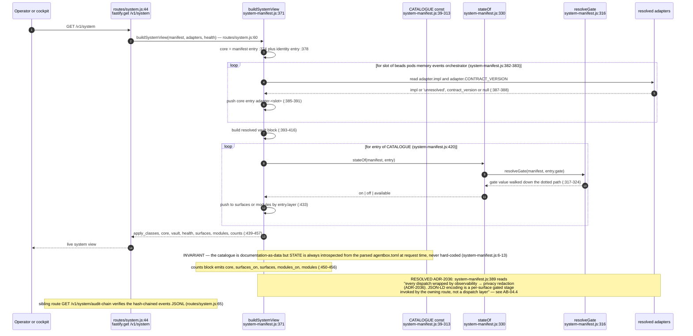
```mermaid
sequenceDiagram
    autonumber
    participant C as Operator or cockpit
    participant R as routes/system.js:44<br/>fastify.get /v1/system
    participant BV as buildSystemView<br/>system-manifest.js:371
    participant CAT as CATALOGUE const<br/>system-manifest.js:39-313
    participant ST as stateOf<br/>system-manifest.js:330
    participant RG as resolveGate<br/>system-manifest.js:316
    participant AD as resolved adapters

    C->>R: GET /v1/system
    R->>BV: buildSystemView(manifest, adapters, health) — routes/system.js:60
    BV->>BV: core = manifest entry :374 plus identity entry :378
    loop for slot of beads pods memory events orchestrator (system-manifest.js:382-383)
        BV->>AD: read adapter.impl and adapter.CONTRACT_VERSION
        AD-->>BV: impl or 'unresolved', contract_version or null (:387-388)
        BV->>BV: push core entry adapter-<slot> (:385-391)
    end
    BV->>BV: build resolved vault block (:393-416)
    loop for entry of CATALOGUE (system-manifest.js:420)
        BV->>ST: stateOf(manifest, entry)
        ST->>RG: resolveGate(manifest, entry.gate)
        RG-->>ST: gate value walked down the dotted path (:317-324)
        ST-->>BV: on | off | available
        BV->>BV: push to surfaces or modules by entry.layer (:433)
    end
    BV-->>R: apply_classes, core, vault, health, surfaces, modules, counts (:439-457)
    R-->>C: live system view
    Note over BV,CAT: INVARIANT — the catalogue is documentation-as-data but STATE is always introspected from the parsed agentbox.toml at request time, never hard-coded (system-manifest.js:6-13)
    Note over BV: counts block emits core, surfaces_on, surfaces, modules_on, modules (:450-456)
    Note over BV,AD: RESOLVED ADR-2036: system-manifest.js:389 reads<br/>"every dispatch wrapped by observability → privacy redaction<br/>(ADR-2036). JSON-LD encoding is a per-surface gated stage<br/>invoked by the owning route, not a dispatch layer" — see AB-04.4
    Note over R: sibling route GET /v1/system/audit-chain verifies the hash-chained events JSONL (routes/system.js:65)
```

## AB-05.2 Catalogue shape and the real surface/module census

```mermaid
flowchart TD
    CAT["CATALOGUE array<br/>system-manifest.js:39-313<br/>82 entries total"] --> SURF["layer 'surface' — 13 entries"]
    CAT --> MOD["layer 'module' — 69 entries"]
    SURF --> S1["ungated: management-api, terminal, setup-wizard,<br/>uri-resolver, agent-events-stream, metrics<br/>system-manifest.js:41-71"]
    SURF --> S2["gated: code-server, jupyter, desktop, comfyui,<br/>linked-data-viewer, interaction-plane, tab0-bridge<br/>system-manifest.js:50-79"]
    MOD --> M1["toolchain + CLI: ruflo, agentic-qe, nagual-qe, deepsec,<br/>codebase-memory, metaharness, codex, opencode, rust-toolchain,<br/>model-routing, model-routing-neural ADR-2080, antigravity,<br/>aoe-serve-binary — system-manifest.js:82-124"]
    MOD --> M2["GPU/media: qgis-mcp, blender-mcp, imagemagick-mcp, ffmpeg,<br/>pytorch, docs-toolchain, code-interpreter, web-researcher,<br/>compression, tailscale, dream-machine, cuda, gaussian-splatting<br/>system-manifest.js:127-160, :295-296"]
    MOD --> M3["sidecars flagged heavy: browser-sidecar, gui-tools-sidecar,<br/>voice-console, privacy-filter — system-manifest.js:163-170, :208-210"]
    MOD --> M4["sovereign/governance: sovereign-mesh, solid-pod, linked-data,<br/>payments, llm-marketplace, project-tracking, consultants,<br/>plugins, orchestration-proxy — system-manifest.js:172-216"]
    MOD --> M5["memory: ruvector-external, memory-learning,<br/>memory-hygiene, ruvnet-brain — system-manifest.js:180-189, :217-219"]
    MOD --> M6["NEW ADR-2116/ADR-2118: claude-code-permissions,<br/>instruction-tiers, claude-cred-sync — system-manifest.js:220-228"]
    MOD --> M7["System One / Jev routing ADR-2091/2093/2094/2095/2110:<br/>jev-compaction, sovereign-system-one, skill-router,<br/>skill-router-cascade, routing-teacher-labels<br/>system-manifest.js:229-248 — see AB-05.13"]
    MOD --> M8["ontology, harness-bridge, colloquy, podcast-ingest<br/>system-manifest.js:249-264"]
    MOD --> M9["corpus: vault :280, vault-tui :283,<br/>vault-cli :286 NEW ADR-2107/ADR-2108"]
    MOD --> M10["aci-shell, tree-search-coder, resources-envelope,<br/>mcp-hub, hook-shim, teammate-gc<br/>system-manifest.js:289-312"]
    MOD --> M11["NEW since e4993a3b: role-isolation system-manifest.js:94-96 ADR-2122 boot-class,<br/>payments-sidestr system-manifest.js:196, sidechain-dreamlab-txbt4 system-manifest.js:268"]
    CAT --> FIELDS["per-entry fields: id, name, layer, gate or gates,<br/>service, apply_class, summary, heavy"]
    FIELDS --> CORE["core layer emitted separately by buildSystemView<br/>manifest, identity, five adapter-<slot> entries<br/>system-manifest.js:372-391"]
```

## AB-05.3 stateOf — how a gate value becomes a state word
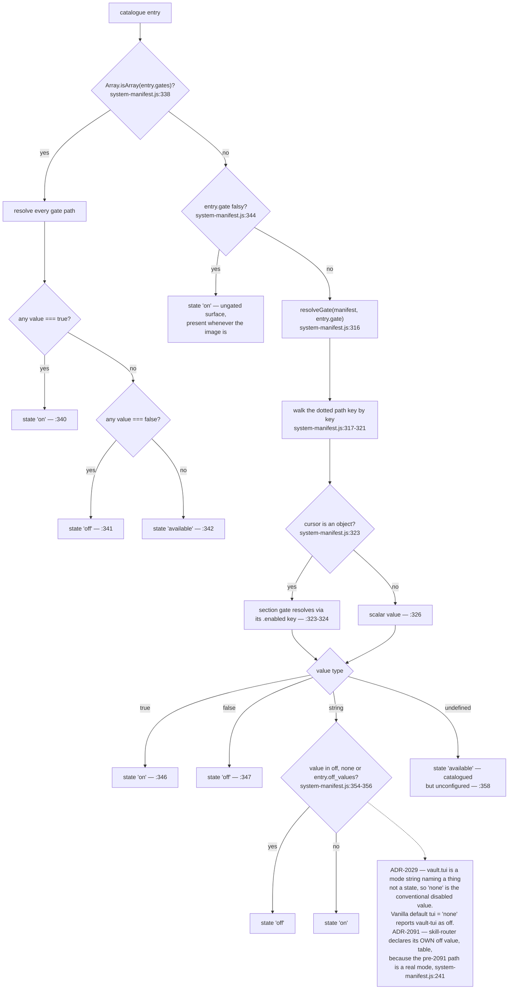
```mermaid
flowchart TD
    E["catalogue entry"] --> A{"Array.isArray(entry.gates)?<br/>system-manifest.js:338"}
    A -->|yes| MG["resolve every gate path"]
    MG --> MG1{"any value === true?"}
    MG1 -->|yes| ON1["state 'on' — :340"]
    MG1 -->|no| MG2{"any value === false?"}
    MG2 -->|yes| OFF1["state 'off' — :341"]
    MG2 -->|no| AV1["state 'available' — :342"]
    A -->|no| B{"entry.gate falsy?<br/>system-manifest.js:344"}
    B -->|yes| ON2["state 'on' — ungated surface,<br/>present whenever the image is"]
    B -->|no| RG["resolveGate(manifest, entry.gate)<br/>system-manifest.js:316"]
    RG --> W["walk the dotted path key by key<br/>system-manifest.js:317-321"]
    W --> SEC{"cursor is an object?<br/>system-manifest.js:323"}
    SEC -->|yes| SECE["section gate resolves via its .enabled key — :323-324"]
    SEC -->|no| VAL["scalar value — :326"]
    SECE --> D
    VAL --> D{"value type"}
    D -->|"true"| ON3["state 'on' — :346"]
    D -->|"false"| OFF2["state 'off' — :347"]
    D -->|"string"| MODE{"value in off, none or entry.off_values?<br/>system-manifest.js:354-356"}
    D -->|"undefined"| AV2["state 'available' — catalogued<br/>but unconfigured — :358"]
    MODE -->|yes| OFF3["state 'off'"]
    MODE -->|no| ON4["state 'on'"]
    MODE -.-> VT["ADR-2029 — vault.tui is a mode string naming a thing<br/>not a state, so 'none' is the conventional disabled value.<br/>Vanilla default tui = 'none' reports vault-tui as off.<br/>ADR-2091 — skill-router declares its OWN off value, table,<br/>because the pre-2091 path is a real mode, system-manifest.js:241"]
```

## AB-05.4 [vault] — the single corpus path authority, catalogued as three entries
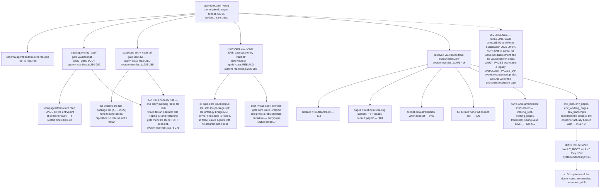
```mermaid
flowchart TD
    TOML["agentbox.toml [vault]<br/>root required, pages, format, tui, cli,<br/>working, transcripts"] --> SCHEMA["schema/agentbox.toml.schema.json<br/>root is required"]
    TOML --> E1["catalogue entry 'vault'<br/>gate vault.format — apply_class BOOT<br/>system-manifest.js:280-282"]
    TOML --> E2["catalogue entry 'vault-tui'<br/>gate vault.tui — apply_class REBUILD<br/>system-manifest.js:283-285"]
    TOML --> E3["NEW ADR-2107/ADR-2108: catalogue entry 'vault-cli'<br/>gate vault.cli — apply_class REBUILD<br/>system-manifest.js:286-288"]
    E1 --> WHY1["root/pages/format are read ONCE by the entrypoint<br/>at container start — a restart picks them up"]
    E2 --> WHY2["tui decides the Nix package set (ADR-2029)<br/>none to rune needs ./agentbox.sh rebuild, not a restart"]
    E3 --> WHY3["cli bakes the vault corpus CLI into the package set;<br/>the ontology-bridge MCP server it replaces is retired,<br/>so false leaves agents with no programmatic door"]
    E3 --> LIVE["boot Phase 5d(ii) liveness gate runs vault --version<br/>and prints a rebuild notice on failure — entrypoint-unified.sh:1067"]
    E1 --> SPLIT["ADR-039 honesty rule — one entry claiming 'boot' for both<br/>would tell an operator that flipping tui and restarting<br/>gets them the Rune TUI. It does not.<br/>system-manifest.js:273-279"]
    E2 --> SPLIT
    TOML --> VB["resolved vault block from buildSystemView<br/>system-manifest.js:401-416"]
    VB --> VB1["enabled = Boolean(root) — :402"]
    VB --> VB2["pages = root minus trailing slashes + '/' + pages default 'pages' — :404"]
    VB --> VB3["format default 'obsidian' when root set — :405"]
    VB --> VB4["tui default 'none' when root set — :406"]
    VB --> VB5["ADR-2028 amendment 2026-09-02 — working_root, working_pages,<br/>transcripts sibling-vault keys — :408-410"]
    VB --> VB6["env_root, env_pages, env_working_pages, env_transcripts<br/>read from the process the container actually booted with — :411-414"]
    VB6 --> DRIFT["drift = root set AND VAULT_ROOT set AND they differ<br/>system-manifest.js:415"]
    DRIFT --> DOC["so /v1/system and the doctor can show manifest-vs-running drift"]
    TOML -.-> DIV["DIVERGENCE — BASELINE 'Vault compatibility and Notes qualification 2026-09-04'.<br/>ADR-2028 is partial for universal disablement: the no-vault resolver clears<br/>VAULT_PAGES but retains a legacy ONTOLOGY_PAGES_DIR override consumers prefer.<br/>See AB-02 for the entrypoint resolution path"]
```

## AB-05.5 agentbox.sh top-level subcommand dispatch
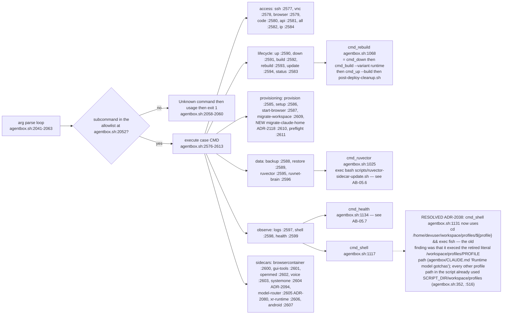
```mermaid
flowchart LR
    ARG["arg parse loop<br/>agentbox.sh:2041-2063"] --> AL{"subcommand in the<br/>allowlist at agentbox.sh:2052?"}
    AL -->|no| ERR["Unknown command then usage then exit 1<br/>agentbox.sh:2058-2060"]
    AL -->|yes| CASE["execute case CMD<br/>agentbox.sh:2576-2613"]
    CASE --> G1["access: ssh :2577, vnc :2578, browser :2579,<br/>code :2580, api :2581, all :2582, ip :2584"]
    CASE --> G2["lifecycle: up :2590, down :2591, build :2592,<br/>rebuild :2593, update :2594, status :2583"]
    CASE --> G3["provisioning: provision :2585, setup :2586,<br/>start-browser :2587, migrate-workspace :2609,<br/>NEW migrate-claude-home ADR-2118 :2610, preflight :2611"]
    CASE --> G4["data: backup :2588, restore :2589,<br/>ruvector :2595, ruvnet-brain :2596"]
    CASE --> G5["observe: logs :2597, shell :2598, health :2599"]
    CASE --> G6["sidecars: browsercontainer :2600, gui-tools :2601,<br/>openmed :2602, voice :2603, systemone :2604 ADR-2094,<br/>model-router :2605 ADR-2080, xr-runtime :2606, android :2607"]
    G2 --> RB["cmd_rebuild agentbox.sh:1068<br/>= cmd_down then cmd_build --variant runtime<br/>then cmd_up --build then post-deploy-cleanup.sh"]
    G4 --> RV["cmd_ruvector agentbox.sh:1025<br/>exec bash scripts/ruvector-sidecar-update.sh — see AB-05.6"]
    G5 --> HL["cmd_health agentbox.sh:1134 — see AB-05.7"]
    G5 --> SH["cmd_shell agentbox.sh:1117"]
    SH -.-> RES1["RESOLVED ADR-2038: cmd_shell agentbox.sh:1131 now uses<br/>cd /home/devuser/workspace/profiles/${profile} && exec fish — the old<br/>finding was that it execed the retired literal /workspace/profiles/PROFILE<br/>path (agentbox/CLAUDE.md 'Runtime model gotchas'); every other profile<br/>path in the script already used SCRIPT_DIR/workspace/profiles (agentbox.sh:352, :516)"]
```

## AB-05.6 agentbox.sh ruvector — a dispatch table split across two files
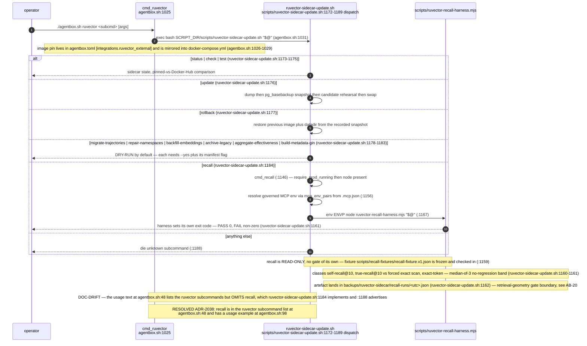
```mermaid
sequenceDiagram
    autonumber
    participant OP as operator
    participant AB as cmd_ruvector<br/>agentbox.sh:1025
    participant SC as ruvector-sidecar-update.sh<br/>scripts/ruvector-sidecar-update.sh:1172-1189 dispatch
    participant H as scripts/ruvector-recall-harness.mjs

    OP->>AB: ./agentbox.sh ruvector <subcmd> [args]
    AB->>SC: exec bash SCRIPT_DIR/scripts/ruvector-sidecar-update.sh "$@" (agentbox.sh:1031)
    Note over AB: image pin lives in agentbox.toml [integrations.ruvector_external] and is mirrored into docker-compose.yml (agentbox.sh:1026-1029)
    alt status | check | test (ruvector-sidecar-update.sh:1173-1175)
        SC-->>OP: sidecar state, pinned-vs-Docker-Hub comparison
    else update (ruvector-sidecar-update.sh:1176)
        SC->>SC: dump then pg_basebackup snapshot then candidate rehearsal then swap
    else rollback (ruvector-sidecar-update.sh:1177)
        SC->>SC: restore previous image plus datadir from the recorded snapshot
    else migrate-trajectories | repair-namespaces | backfill-embeddings | archive-legacy | aggregate-effectiveness | build-metadata-gin (ruvector-sidecar-update.sh:1178-1183)
        SC-->>OP: DRY-RUN by default — each needs --yes plus its manifest flag
    else recall (ruvector-sidecar-update.sh:1184)
        SC->>SC: cmd_recall (:1146) — require_prod_running then node present
        SC->>SC: resolve governed MCP env via mcp_env_pairs from .mcp.json (:1156)
        SC->>H: env ENVP node ruvector-recall-harness.mjs "$@" (:1167)
        H-->>OP: harness sets its own exit code — PASS 0, FAIL non-zero (ruvector-sidecar-update.sh:1161)
    else anything else
        SC-->>OP: die unknown subcommand (:1188)
    end
    Note over SC,H: recall is READ-ONLY, no gate of its own — fixture scripts/recall-fixtures/recall-fixture.v1.json is frozen and checked in (:1159)
    Note over H: classes self-recall@10, true-recall@10 vs forced exact scan, exact-token — median-of-3 no-regression band (ruvector-sidecar-update.sh:1160-1161)
    Note over H: artefact lands in backups/ruvector-sidecar/recall-runs/<utc>.json (ruvector-sidecar-update.sh:1162) — retrieval-geometry gate boundary, see AB-20
    Note over AB,SC: DOC-DRIFT — the usage text at agentbox.sh:48 lists the ruvector subcommands but OMITS recall, which ruvector-sidecar-update.sh:1184 implements and :1188 advertises
    Note over AB,SC: RESOLVED ADR-2038: recall is in the ruvector subcommand list at<br/>agentbox.sh:48 and has a usage example at agentbox.sh:98
```

## AB-05.7 agentbox.sh health — exit-code contract
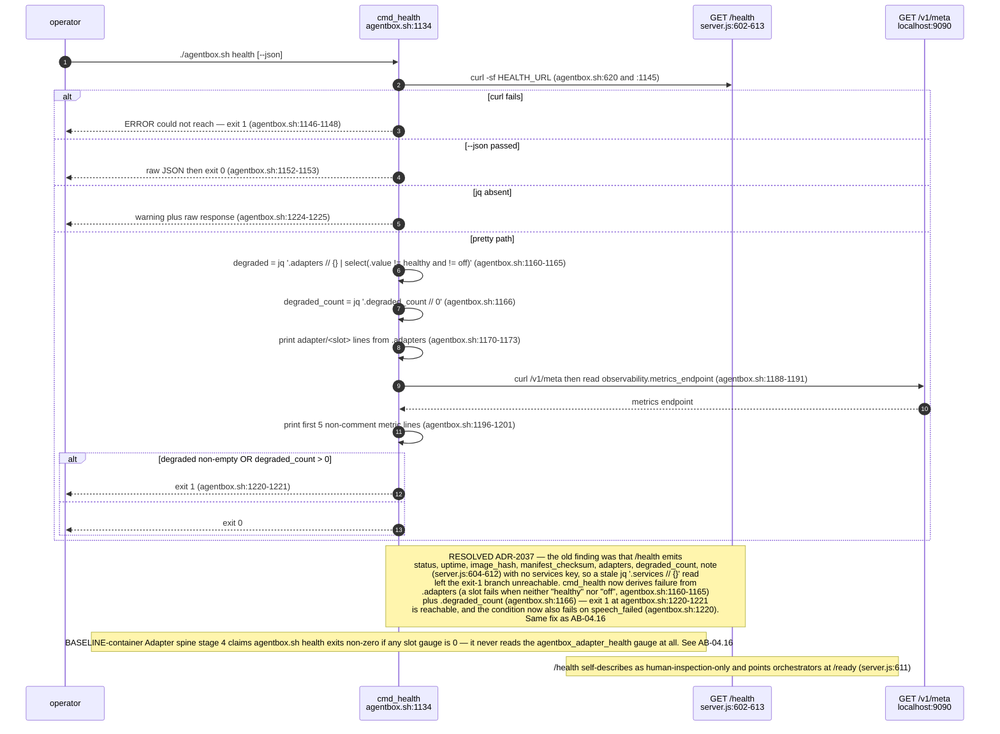
```mermaid
sequenceDiagram
    autonumber
    participant OP as operator
    participant SH as cmd_health<br/>agentbox.sh:1134
    participant H as GET /health<br/>server.js:602-613
    participant M as GET /v1/meta<br/>localhost:9090

    OP->>SH: ./agentbox.sh health [--json]
    SH->>H: curl -sf HEALTH_URL (agentbox.sh:620 and :1145)
    alt curl fails
        SH-->>OP: ERROR could not reach — exit 1 (agentbox.sh:1146-1148)
    else --json passed
        SH-->>OP: raw JSON then exit 0 (agentbox.sh:1152-1153)
    else jq absent
        SH-->>OP: warning plus raw response (agentbox.sh:1224-1225)
    else pretty path
        SH->>SH: degraded = jq '.adapters // {} | select(.value != healthy and != off)' (agentbox.sh:1160-1165)
        SH->>SH: degraded_count = jq '.degraded_count // 0' (agentbox.sh:1166)
        SH->>SH: print adapter/<slot> lines from .adapters (agentbox.sh:1170-1173)
        SH->>M: curl /v1/meta then read observability.metrics_endpoint (agentbox.sh:1188-1191)
        M-->>SH: metrics endpoint
        SH->>SH: print first 5 non-comment metric lines (agentbox.sh:1196-1201)
        alt degraded non-empty OR degraded_count > 0
            SH-->>OP: exit 1 (agentbox.sh:1220-1221)
        else
            SH-->>OP: exit 0
        end
    end
    Note over SH,H: RESOLVED ADR-2037 — the old finding was that /health emits<br/>status, uptime, image_hash, manifest_checksum, adapters, degraded_count, note<br/>(server.js:604-612) with no services key, so a stale jq '.services // {}' read<br/>left the exit-1 branch unreachable. cmd_health now derives failure from<br/>.adapters (a slot fails when neither "healthy" nor "off", agentbox.sh:1160-1165)<br/>plus .degraded_count (agentbox.sh:1166) — exit 1 at agentbox.sh:1220-1221<br/>is reachable, and the condition now also fails on speech_failed (agentbox.sh:1220).<br/>Same fix as AB-04.16
    Note over SH: BASELINE-container Adapter spine stage 4 claims agentbox.sh health exits non-zero if any slot gauge is 0 — it never reads the agentbox_adapter_health gauge at all. See AB-04.16
    Note over H: /health self-describes as human-inspection-only and points orchestrators at /ready (server.js:611)
```

## AB-05.8 Artifact validation gate — the last check before exec supervisord
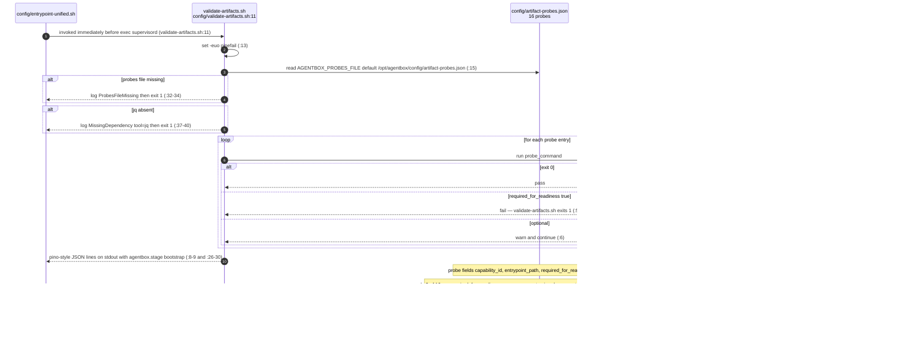
```mermaid
sequenceDiagram
    autonumber
    participant EP as config/entrypoint-unified.sh
    participant VA as validate-artifacts.sh<br/>config/validate-artifacts.sh:11
    participant PF as config/artifact-probes.json<br/>16 probes
    participant SH as probe_command shell

    EP->>VA: invoked immediately before exec supervisord (validate-artifacts.sh:11)
    VA->>VA: set -euo pipefail (:13)
    VA->>PF: read AGENTBOX_PROBES_FILE default /opt/agentbox/config/artifact-probes.json (:15)
    alt probes file missing
        VA-->>EP: log ProbesFileMissing then exit 1 (:32-34)
    end
    alt jq absent
        VA-->>EP: log MissingDependency tool=jq then exit 1 (:37-40)
    end
    loop for each probe entry
        VA->>SH: run probe_command
        alt exit 0
            SH-->>VA: pass
        else required_for_readiness true
            SH-->>VA: fail — validate-artifacts.sh exits 1 (:5)
        else optional
            SH-->>VA: warn and continue (:6)
        end
    end
    VA-->>EP: pino-style JSON lines on stdout with agentbox.stage bootstrap (:8-9 and :26-30)
    Note over PF: probe fields capability_id, entrypoint_path, required_for_readiness, probe_command
    Note over PF: only 2 of 16 are required_for_readiness — management-api and mcp-nostr-bridge, both node --check syntax gates
    Note over PF: optional probes cover openai-codex-mcp, lazy-fetch-mcp, browser-sidecar HTTP health, ruflo-cli, claude-flow-cli, native-sqlite-backend, self-learning-hook-adapter, agentic-qe-cli, nagual-qe-cli, codebase-memory-mcp-cli, mermaid-cli, code-interpreter-mcp, code-interpreter-wheelhouse, aci-shell-mcp
    Note over VA,SH: the gate is a SYNTAX and PRESENCE check, not a behavioural one — node --check and --version dominate
```

## AB-05.9 Apply-class as an operator decision procedure
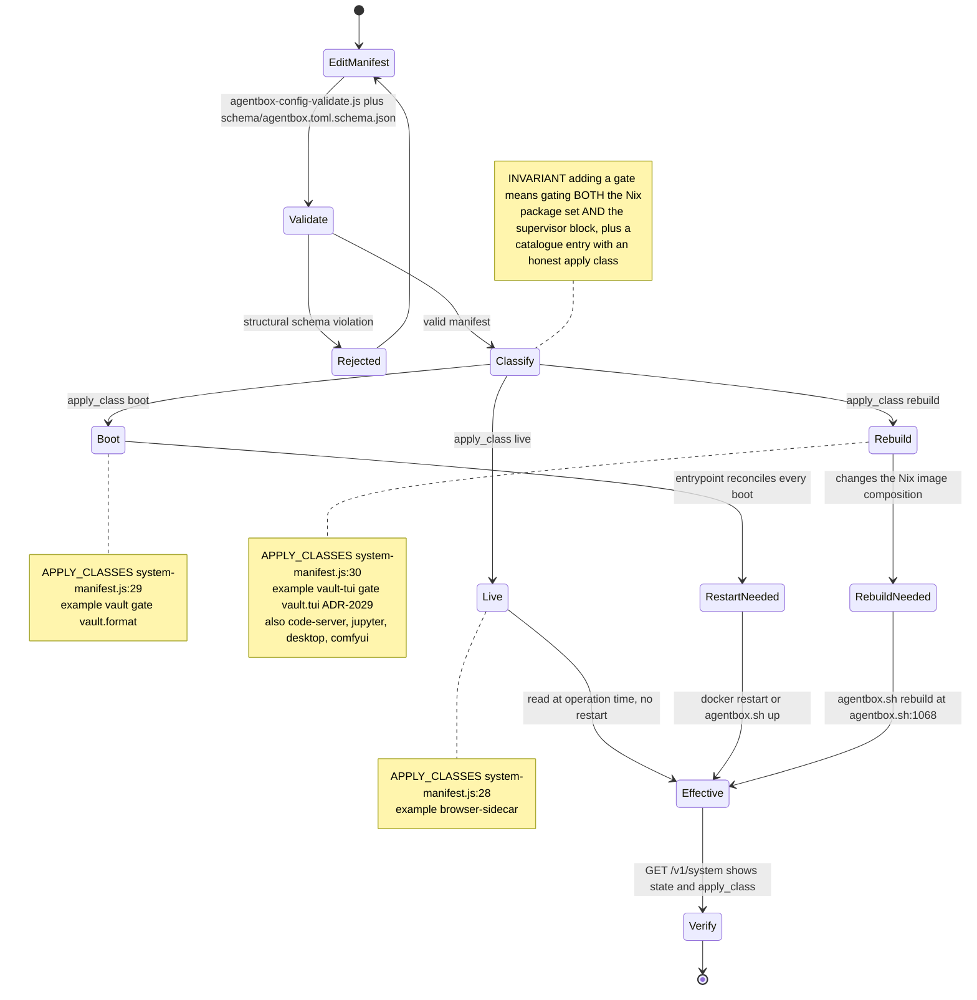
```mermaid
stateDiagram-v2
    [*] --> EditManifest
    EditManifest --> Validate: agentbox-config-validate.js plus schema/agentbox.toml.schema.json
    Validate --> Rejected: structural schema violation
    Validate --> Classify: valid manifest
    Rejected --> EditManifest

    Classify --> Live: apply_class live
    Classify --> Boot: apply_class boot
    Classify --> Rebuild: apply_class rebuild

    Live --> Effective: read at operation time, no restart
    Boot --> RestartNeeded: entrypoint reconciles every boot
    RestartNeeded --> Effective: docker restart or agentbox.sh up
    Rebuild --> RebuildNeeded: changes the Nix image composition
    RebuildNeeded --> Effective: agentbox.sh rebuild at agentbox.sh:1068

    Effective --> Verify: GET /v1/system shows state and apply_class
    Verify --> [*]

    note right of Live
        APPLY_CLASSES system-manifest.js:28
        example browser-sidecar
    end note
    note right of Boot
        APPLY_CLASSES system-manifest.js:29
        example vault gate vault.format
    end note
    note right of Rebuild
        APPLY_CLASSES system-manifest.js:30
        example vault-tui gate vault.tui ADR-2029
        also code-server, jupyter, desktop, comfyui
    end note
    note left of Classify
        INVARIANT adding a gate means gating BOTH the Nix
        package set AND the supervisor block, plus a
        catalogue entry with an honest apply class
    end note
```

## AB-05.10 Schema surfaces and the setup wizard boundary
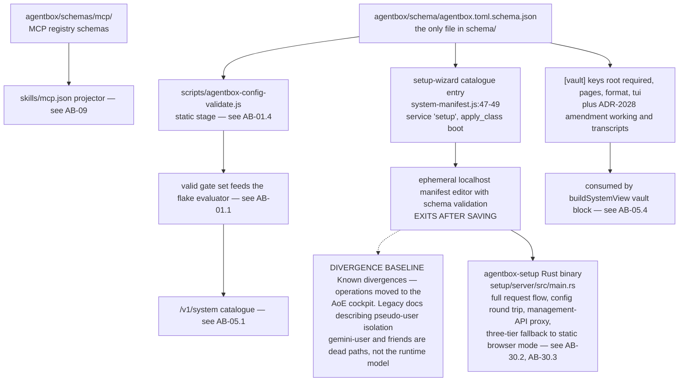
```mermaid
flowchart TD
    S1["agentbox/schema/agentbox.toml.schema.json<br/>the only file in schema/"] --> V["scripts/agentbox-config-validate.js<br/>static stage — see AB-01.4"]
    S2["agentbox/schemas/mcp/<br/>MCP registry schemas"] --> P["skills/mcp.json projector — see AB-09"]
    V --> GATE["valid gate set feeds the flake evaluator — see AB-01.1"]
    S1 --> SW["setup-wizard catalogue entry<br/>system-manifest.js:47-49<br/>service 'setup', apply_class boot"]
    SW --> SWB["ephemeral localhost manifest editor with schema validation<br/>EXITS AFTER SAVING"]
    SWB -.-> DIV["DIVERGENCE BASELINE Known divergences — operations moved to the<br/>AoE cockpit. Legacy docs describing pseudo-user isolation<br/>gemini-user and friends are dead paths, not the runtime model"]
    SWB --> BIN["agentbox-setup Rust binary<br/>setup/server/src/main.rs<br/>full request flow, config round trip, management-API proxy,<br/>three-tier fallback to static browser mode — see AB-30.2, AB-30.3"]
    S1 --> VS["[vault] keys root required, pages, format, tui<br/>plus ADR-2028 amendment working and transcripts"]
    VS --> AB4["consumed by buildSystemView vault block — see AB-05.4"]
    GATE --> MAN["/v1/system catalogue — see AB-05.1"]
```

## AB-05.11 agentbox.sh model-router — ADR-2080 CLI dispatch, gated by [model_routing.neural]
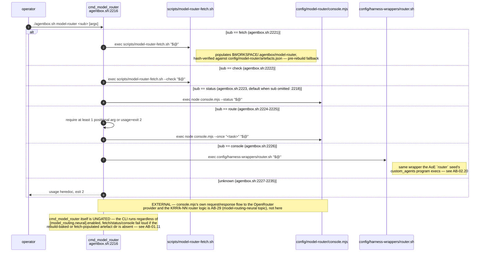
```mermaid
sequenceDiagram
    autonumber
    participant OP as operator
    participant AB as cmd_model_router<br/>agentbox.sh:2216
    participant FETCH as scripts/model-router-fetch.sh
    participant CONSOLE as config/model-router/console.mjs
    participant WRAP as config/harness-wrappers/router.sh

    OP->>AB: ./agentbox.sh model-router <sub> [args]
    alt sub == fetch (agentbox.sh:2221)
        AB->>FETCH: exec scripts/model-router-fetch.sh "$@"
        Note right of FETCH: populates $WORKSPACE/.agentbox/model-router,<br/>hash-verified against config/model-router/artefacts.json — pre-rebuild fallback
    else sub == check (agentbox.sh:2222)
        AB->>FETCH: exec scripts/model-router-fetch.sh --check "$@"
    else sub == status (agentbox.sh:2223, default when sub omitted :2218)
        AB->>CONSOLE: exec node console.mjs --status "$@"
    else sub == route (agentbox.sh:2224-2225)
        AB->>AB: require at least 1 positional arg or usage+exit 2
        AB->>CONSOLE: exec node console.mjs --once "<task>" "$@"
    else sub == console (agentbox.sh:2226)
        AB->>WRAP: exec config/harness-wrappers/router.sh "$@"
        Note right of WRAP: same wrapper the AoE `router` seed's<br/>custom_agents program execs — see AB-02.20
    else unknown (agentbox.sh:2227-2235)
        AB-->>OP: usage heredoc, exit 2
    end

    Note over AB,CONSOLE: EXTERNAL — console.mjs's own request/response flow to the OpenRouter<br/>provider and the KRR/k-NN router logic is AB-29 (model-routing-neural topic), not here
    Note over AB: cmd_model_router itself is UNGATED — the CLI runs regardless of<br/>[model_routing.neural].enabled, fetch/status/console fail loud if the<br/>rebuild-baked or fetch-populated artefact dir is absent — see AB-01.11
```

## AB-05.13 The gate families added since 2026-09-06: System One, compaction, permissions, instructions, cred-sync, resources

```mermaid
flowchart TB
    TOML["agentbox.toml"]
    TOML --> F1["[features.jev_compaction] enabled = true, fallback = rules<br/>agentbox.toml:642, :680, :702"]
    TOML --> F2["[features.sovereign_system_one] enabled = false<br/>agentbox.toml:707, :732"]
    TOML --> F3["[skills.routing] router = jev, cascade, label_log<br/>label_log = true since 2026-10-02, the bounded EXP-B8 run<br/>agentbox.toml:942, :962, :978-979, :992"]
    TOML --> F4["[resources] mcp_hub, hooks.shim, session_hygiene<br/>agentbox.toml:1265-1285"]
    TOML --> F5["[voice] enabled = true<br/>agentbox.toml:1843"]
    TOML --> F6["NEW ADR-2116: [claude_code] permission_mode :627,<br/>permission_deny :635-638"]
    TOML --> F7["NEW ADR-2118: config/instructions/ (not a toml key —<br/>gate is null, the directory's own presence)"]
    TOML --> F8["NEW ADR-2118: [toolchains] claude_code = true :1850<br/>service claude-cred-sync"]
    TOML --> F9["NEW PRD-024 P1: [sidechain] enabled, mirror, faucet<br/>agentbox.toml:1572-1577"]
    F9 ~~~ F10["NEW 2026-10-02: [sovereign_mesh] junkiejarvis = true<br/>the only switch, the env override is gone<br/>agentbox.toml:50, junkiejarvisEnabled junkiejarvis-clarify.js:447-453"]
    TOML --> F10

    F1 --> C1["catalogue jev-compaction (factrail), apply_class REBUILD<br/>since ADR-2121, was boot - system-manifest.js:229-230"]
    F2 --> C2["catalogue sovereign-system-one, apply_class boot<br/>system-manifest.js:232-233"]
    F3 --> C3["catalogue skill-router :240-241, skill-router-cascade :243-244,<br/>routing-teacher-labels :246-247, off_values table, all apply_class boot"]
    F4 --> C4["catalogue mcp-hub, hook-shim, teammate-gc, all rebuild<br/>system-manifest.js:304-312"]
    F5 --> C5["catalogue voice-console, apply_class live<br/>system-manifest.js:169-170"]
    F6 --> C6["NEW catalogue claude-code-permissions, apply_class boot<br/>system-manifest.js:220-222"]
    F7 --> C7["NEW catalogue instruction-tiers, gate null, apply_class boot<br/>system-manifest.js:223-225"]
    F8 --> C8["NEW catalogue claude-cred-sync, apply_class rebuild<br/>system-manifest.js:226-228"]
    F9 --> C9["NEW catalogue sidechain, three gates, apply_class rebuild<br/>a false parent gate reports off - system-manifest.js:265-267, :334"]

    C1 --> B1["flake.nix bakes factrail, then the entrypoint sets CLAUDE_CODE_ENABLE_FUNCTION_HOOKS,<br/>drops any retired jev-compaction install, migrates its store, installs factrail@agentbox<br/>entrypoint-unified.sh:2638, :2649, :2658, :2731 - gate off uninstalls :2743"]
    C2 --> B2["the entrypoint runs agentbox-manifest sso-project and<br/>projects baseUrl, model and backendLocal into the plugin<br/>entrypoint-unified.sh:2414, :2416"]
    C3 --> B3["the entrypoint registers or de-registers the<br/>UserPromptSubmit hook, see AB-08<br/>entrypoint-unified.sh:2496, :2510"]
    C6 --> B6["agentbox-manifest permissions-project reconciles root<br/>settings.json and every profile's settings every boot — not seed-if-unset<br/>entrypoint-unified.sh:1714-1720"]
    C7 --> B7["agentbox-manifest instructions-project composes<br/>~/.claude/CLAUDE.md, ~/workspace/AGENTS.md, ~/workspace/CLAUDE.md<br/>from config/instructions/ every boot — entrypoint-unified.sh:2590-2605"]
    C9 --> B9["flake.nix bakes program:sidestr-producer, -mirror, -faucet<br/>see AB-01.1 and AB-02.6"]
    C8 --> B8["[program:claude-cred-sync] polls container ~/.claude/.credentials.json<br/>against host-claude bind every 2s, later expiresAt wins<br/>flake.nix:2851-2861, services/agentbox-manifest/src/cred_sync.rs"]

    C5 --> DIV["RESOLVED - the manifest now declares voice on, apply-class sidecar,<br/>so a running console no longer reports state off, agentbox.toml:1843"]
    F10 --> C10["NO catalogue entry - GET /v1/system cannot report it;<br/>server.js:1449-1450 and the forum-suggestions tenant<br/>both call junkiejarvisEnabled(manifest)"]
    C4 --> REB["INVARIANT - mcp-hub is rebuild-class because its supervisor<br/>program is composed into the image, so flipping the gate and<br/>restarting does not add it, system-manifest.js:305"]
```

**What it shows.** The nine manifest gate families added since 2026-09-06 — System One, Jev compaction (now factrail, ADR-2121) and its cascade/teacher-label addenda, the ADR-2116 permission posture, ADR-2118 instruction tiers and credential sync, and the PRD-024 `[sidechain]` gate of 2026-09-30 — each traced from its `agentbox.toml` section to its catalogue entry and to the boot step that applies it.
**Why it is this way.** ADR-039's honesty rule: a gate is catalogued with the apply class of the place it is consumed, so `sovereign_system_one` is boot-class here even though its sidecar has a lifecycle of its own (`../project/agentbox/management-api/lib/system-manifest.js:233`); `claude-cred-sync` is rebuild-class because the polling daemon is a supervised program baked into the image (`flake.nix:2851`), not because the credential merge logic itself needs a rebuild. The same rule moved `jev-compaction` from boot to rebuild when ADR-2121 replaced the vendored plugin with a factrail binary and plugin that `flake.nix` bakes only when the gate is on (`../project/agentbox/management-api/lib/system-manifest.js:230`).

**Tension (resolved by this revision, manifest vs running estate):** the manifest used to declare `[voice].enabled = false` while the voice console ran under its own compose lifecycle, so the live view reported `voice-console` off for a surface that was up. It now reads `enabled = true`, apply-class sidecar (`../project/agentbox/agentbox.toml:1843`), which the catalogue entry gates on (`../project/agentbox/management-api/lib/system-manifest.js:169-170`).

**Debt:** `payment_settlement` is declared `zero-tolerance` with its own task properties (`../project/agentbox/agentbox.toml:1074`, `:1118`) but no route passes that action class to the authority gate; `mandate_revoke` is the only class any route names (`../project/agentbox/management-api/routes/llm-marketplace.js:473`).

**Drift (resolved 2026-10-02, JunkieJarvis gate):** the manifest comment used to promise that `JUNKIEJARVIS_ENABLED` overrode `[sovereign_mesh].junkiejarvis`; `f63760e19` made the key the only switch and turned it on (`../project/agentbox/agentbox.toml:45-50`), and management-api now reads it through `junkiejarvisEnabled(manifest)` alone (`../project/agentbox/management-api/server.js:1449-1450`, `../project/agentbox/management-api/lib/junkiejarvis-clarify.js:447-453`).

**Debt:** `junkiejarvis` gates a forum-facing agent and the forum-suggestions tenant's clarifying DMs, yet it has no `CATALOGUE` entry (`../project/agentbox/management-api/lib/system-manifest.js:39`), so `GET /v1/system` cannot say whether JunkieJarvis is on.

**Drift (golden fixture vs manifest):** the manifest parser's golden copy of the live manifest still carries the retired wording, with BOTH the gate and the env var required and the gate false (`../project/agentbox/services/agentbox-manifest/tests/golden/live-agentbox.toml:46-51`).

**Tension (ADR-030 gate vs EXP-B8):** the EXP-B8 tick signs its one forum summary with the JunkieJarvis key (`../project/agentbox/scripts/experiments/exp-b8-label-log.cjs:528-530`; since custody W2 the key is read as a role secret and, under `[security].role_isolation`, never from the repo `.env`) and publishes it (`../project/agentbox/scripts/experiments/exp-b8-label-log.cjs:550-563`) without consulting `junkiejarvisEnabled`, so a manifest with `junkiejarvis = false` would still see a JunkieJarvis post when the experiment stops.

**Debt:** the agent, command and skill registries governed by ADR-2092 are manifest files of their own (`registered-agents.txt`, `registered-commands.txt`, `registered-skills.txt`) with no `agentbox.toml` gate and no catalogue entry, so `GET /v1/system` cannot report what the reconcilers did (`../project/agentbox/config/entrypoint-unified.sh:3218`, `../project/agentbox/management-api/lib/system-manifest.js:39`).

**Drift (resolved 2026-09-30, gate catalogue vs the sealed chain):** `[sidechain]` used to be a fully specified gate the schema refused; it now exists in the schema (`../project/agentbox/schema/agentbox.toml.schema.json:3289-3291`, itself `additionalProperties: false`), in `agentbox.toml` (`../project/agentbox/agentbox.toml:1572-1577`) and in the catalogue (`../project/agentbox/management-api/lib/system-manifest.js:265-267`), gating the interim producer, mirror and faucet (see AB-32.5, AB-34.5).

**Tension (proposed design vs the landed gate):** the BASELINE's PROPOSED supervised-set table still gates `sidestr-producer` on `[sidechain.signer].enabled` (`../project/agentbox/docs/BASELINE-container.md:350`), while the code gates it on the top-level `[sidechain].enabled` (`../project/agentbox/agentbox.toml:1573`); the `signer` and `bridge` sub-blocks (`../project/agentbox/docs/BASELINE-container.md:309-310`) have no schema entry, so adding either is a schema change too.

## AB-05.14 Instruction tier projection (ADR-2118) — the mount contract two tiers rewrite every boot
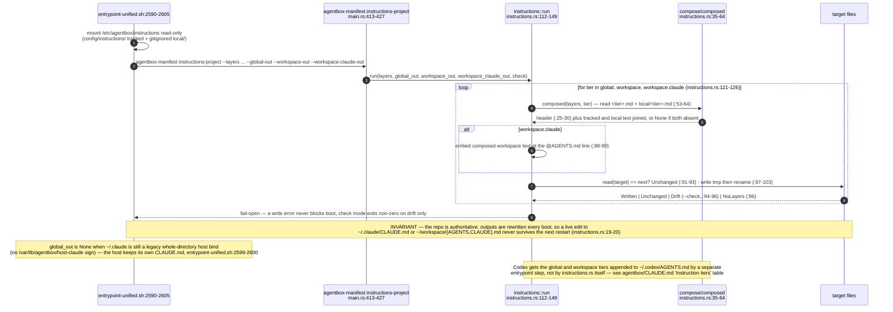
```mermaid
sequenceDiagram
    autonumber
    participant EP as entrypoint-unified.sh:2590-2605
    participant AM as agentbox-manifest instructions-project<br/>main.rs:413-427
    participant IR as instructions::run<br/>instructions.rs:112-149
    participant COMP as compose/composed<br/>instructions.rs:35-64
    participant FS as target files

    EP->>EP: mount /etc/agentbox/instructions read-only<br/>(config/instructions/ tracked + gitignored local/)
    EP->>AM: agentbox-manifest instructions-project --layers ... --global-out --workspace-out --workspace-claude-out
    AM->>IR: run(layers, global_out, workspace_out, workspace_claude_out, check)
    loop for tier in global, workspace, workspace.claude (instructions.rs:121-126)
        IR->>COMP: composed(layers, tier) — read <tier>.md + local/<tier>.md (:53-64)
        COMP-->>IR: header (:25-30) plus tracked and local text joined, or None if both absent
        alt workspace.claude
            IR->>IR: embed composed workspace text at the @AGENTS.md line (:88-90)
        end
        IR->>FS: read(target) == next? Unchanged (:91-93) : write tmp then rename (:97-103)
        FS-->>IR: Written | Unchanged | Drift (--check, :94-96) | NoLayers (:86)
    end
    IR-->>EP: fail-open — a write error never blocks boot, check mode exits non-zero on drift only
    Note over EP,FS: INVARIANT — the repo is authoritative: outputs are rewritten every boot, so a live edit to<br/>~/.claude/CLAUDE.md or ~/workspace/{AGENTS,CLAUDE}.md never survives the next restart (instructions.rs:19-20)
    Note over EP: global_out is None when ~/.claude is still a legacy whole-directory host bind<br/>(no /var/lib/agentbox/host-claude sign) — the host keeps its own CLAUDE.md, entrypoint-unified.sh:2599-2600
    Note over IR,COMP: Codex gets the global and workspace tiers appended to ~/.codex/AGENTS.md by a separate<br/>entrypoint step, not by instructions.rs itself — see agentbox/CLAUDE.md 'Instruction tiers' table
```

**What it shows.** How `[claude_code]`'s sibling concern — the global and workspace instruction tiers that sit above every repository — gets from two `config/instructions/` layers (tracked public, gitignored `local/` estate) to the three files every Claude Code session reads, on every single boot.
**Why it is this way.** ADR-2118: the files used to be hand-kept on a host bind and a Docker volume with no history and no review; composing them from the repo makes the global/workspace tiers a reviewable, versioned product surface instead of drift-prone container state.

## AB-05.15 Claude OAuth credential sync (ADR-2118) — converging container and host `.credentials.json`
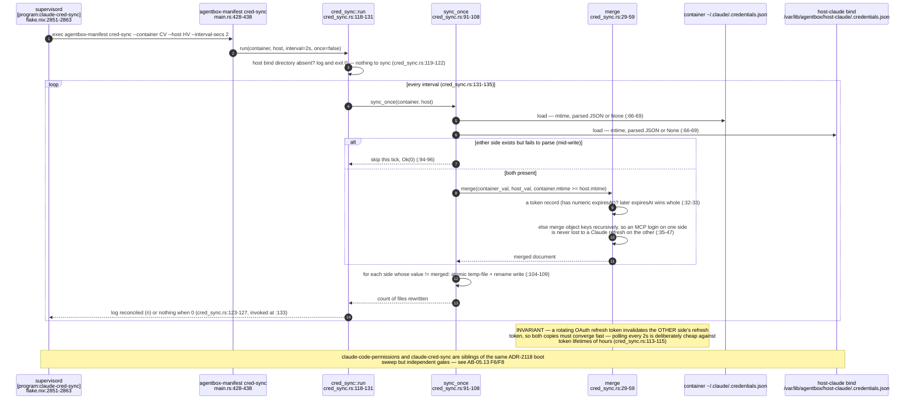
```mermaid
sequenceDiagram
    autonumber
    participant SV as supervisord<br/>[program:claude-cred-sync]<br/>flake.nix:2851-2863
    participant CLI as agentbox-manifest cred-sync<br/>main.rs:428-438
    participant RUN as cred_sync::run<br/>cred_sync.rs:118-131
    participant SYNC as sync_once<br/>cred_sync.rs:91-108
    participant MERGE as merge<br/>cred_sync.rs:29-59
    participant CV as container ~/.claude/.credentials.json
    participant HV as host-claude bind<br/>/var/lib/agentbox/host-claude/.credentials.json

    SV->>CLI: exec agentbox-manifest cred-sync --container CV --host HV --interval-secs 2
    CLI->>RUN: run(container, host, interval=2s, once=false)
    RUN->>RUN: host bind directory absent? log and exit 0 — nothing to sync (cred_sync.rs:119-122)
    loop every interval (cred_sync.rs:131-135)
        RUN->>SYNC: sync_once(container, host)
        SYNC->>CV: load — mtime, parsed JSON or None (:66-69)
        SYNC->>HV: load — mtime, parsed JSON or None (:66-69)
        alt either side exists but fails to parse (mid-write)
            SYNC-->>RUN: skip this tick, Ok(0) (:94-96)
        else both present
            SYNC->>MERGE: merge(container_val, host_val, container.mtime >= host.mtime)
            MERGE->>MERGE: a token record (has numeric expiresAt)? later expiresAt wins whole (:32-33)
            MERGE->>MERGE: else merge object keys recursively, so an MCP login on one side<br/>is never lost to a Claude refresh on the other (:35-47)
            MERGE-->>SYNC: merged document
        end
        SYNC->>SYNC: for each side whose value != merged: atomic temp-file + rename write (:104-109)
        SYNC-->>RUN: count of files rewritten
        RUN-->>SV: log reconciled (n) or nothing when 0 (cred_sync.rs:123-127, invoked at :133)
    end
    Note over MERGE: INVARIANT — a rotating OAuth refresh token invalidates the OTHER side's refresh<br/>token, so both copies must converge fast — polling every 2s is deliberately cheap against<br/>token lifetimes of hours (cred_sync.rs:113-115)
    Note over SV,HV: claude-code-permissions and claude-cred-sync are siblings of the same ADR-2118 boot<br/>sweep but independent gates — see AB-05.13 F6/F8
```

**What it shows.** The polling reconciliation loop that keeps the container-owned `agentbox-claude-home` volume's OAuth tokens converged with the host's bound `~/.claude`, so a refresh on either side never logs the other out.
**Why it is this way.** `~/.claude` became a container-owned volume (not a host bind) so the container's private key material is never exposed on the host filesystem; the host still needs current tokens to run its own Claude Code, hence a merge daemon rather than a symlink — Claude Code's write strategy (in-place vs temp+rename) is unknown, so a symlink is not trusted to survive a refresh (cred_sync.rs:1-17).

## AB-05.16 [security].role_isolation — one boot-class gate, one table, four derived artefacts (ADR-2122)
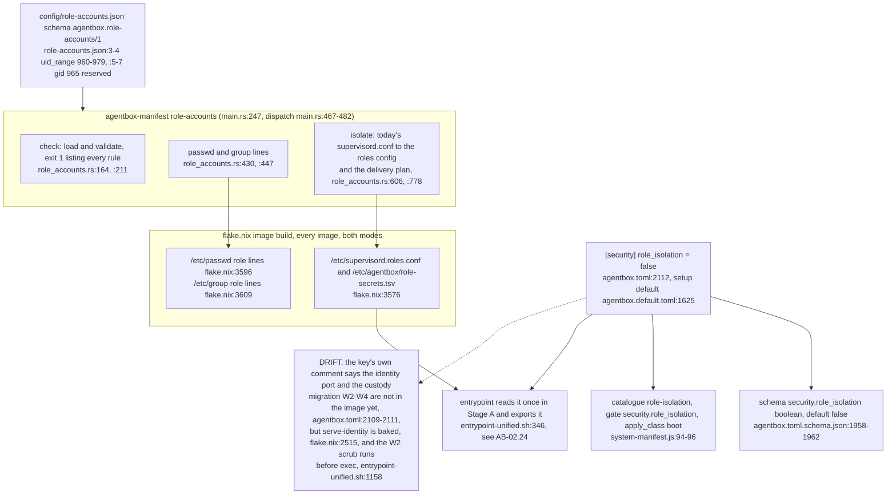
```mermaid
flowchart TB
    KEY["[security] role_isolation = false<br/>agentbox.toml:2112, setup default agentbox.default.toml:1625"]
    SCH["schema security.role_isolation boolean, default false<br/>agentbox.toml.schema.json:1958-1962"]
    CATE["catalogue role-isolation, gate security.role_isolation, apply_class boot<br/>system-manifest.js:94-96"]
    TBL["config/role-accounts.json schema agentbox.role-accounts/1<br/>role-accounts.json:3-4 uid_range 960-979, :5-7 gid 965 reserved"]
    subgraph CLI["agentbox-manifest role-accounts (main.rs:247, dispatch main.rs:467-482)"]
        CHK["check: load and validate, exit 1 listing every rule<br/>role_accounts.rs:164, :211"]
        PW["passwd and group lines<br/>role_accounts.rs:430, :447"]
        ISO["isolate: today's supervisord.conf to the roles config<br/>and the delivery plan, role_accounts.rs:606, :778"]
    end
    subgraph BUILD["flake.nix image build, every image, both modes"]
        B1["/etc/supervisord.roles.conf and /etc/agentbox/role-secrets.tsv<br/>flake.nix:3576"]
        B2["/etc/passwd role lines flake.nix:3596<br/>/etc/group role lines flake.nix:3609"]
    end
    BOOT["entrypoint reads it once in Stage A and exports it<br/>entrypoint-unified.sh:346, see AB-02.24"]
    KEY --> SCH
    KEY --> CATE
    KEY --> BOOT
    TBL --> CLI
    PW --> B2
    ISO --> B1
    B1 --> BOOT
    KEY -.-> DRIFT["DRIFT: the key's own comment says the identity port and the custody<br/>migration W2-W4 are not in the image yet, agentbox.toml:2109-2111,<br/>but serve-identity is baked, flake.nix:2515, and the W2 scrub runs<br/>before exec, entrypoint-unified.sh:1158"]
```

**What it shows.** The custody gate as the manifest sees it. `[security].role_isolation` is a plain boolean, false in the live manifest and in the setup default, declared in the schema and catalogued as apply-class `boot`. Everything it switches between is derived at image build from one table, `config/role-accounts.json`, by the `agentbox-manifest role-accounts` subcommands: the passwd and group lines, the isolated supervisor config and the delivery plan. So flipping the gate needs a restart, not a rebuild.
**Why it is this way.** The custody design makes the flag boot-class so the owner's rehearsal can flip it without a rebuild and roll it back the same way (ADR-2122). Deriving the roles config from today's rendered config, rather than writing it by hand, keeps the two configs from drifting: only `user=` and `environment=` of role programs change (`../project/agentbox/services/agentbox-manifest/src/role_accounts.rs:11-15`).

**Invariant:** the isolated supervisor config is a pure function of today's rendered config and the role table, so no role program can exist in one config and not the other (`../project/agentbox/flake.nix:3576`, `../project/agentbox/services/agentbox-manifest/src/role_accounts.rs:606`).

**Drift (manifest comment vs this revision):** the comment above `role_isolation` says the identity port and the custody migration (W2-W4) are not in the image yet, so role programs fail closed under the flag (`../project/agentbox/agentbox.toml:2109-2111`). At this revision `[program:serve-identity]` is baked (`../project/agentbox/flake.nix:2515`) and the W2 capture and scrub run before `exec supervisord` (`../project/agentbox/config/entrypoint-unified.sh:489`, `../project/agentbox/config/entrypoint-unified.sh:1158`). The advice to leave the flag off until the rehearsal passes still holds. The stated reason is stale.

