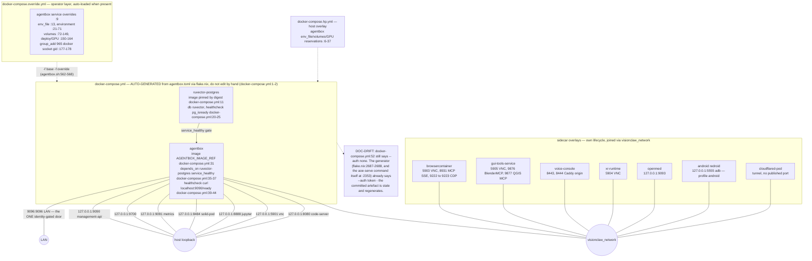
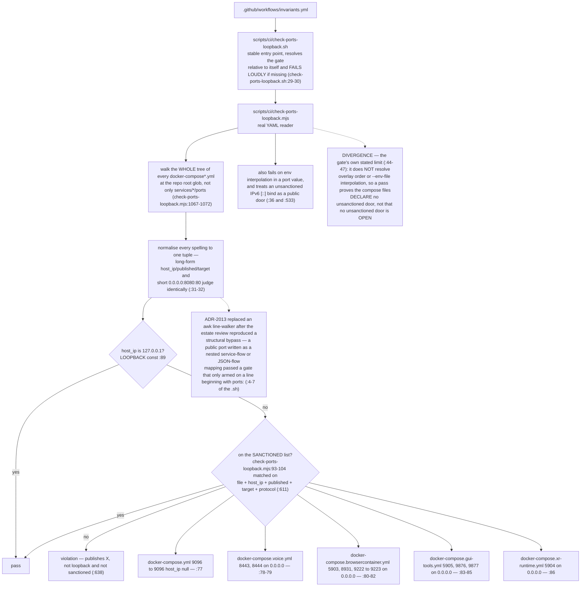
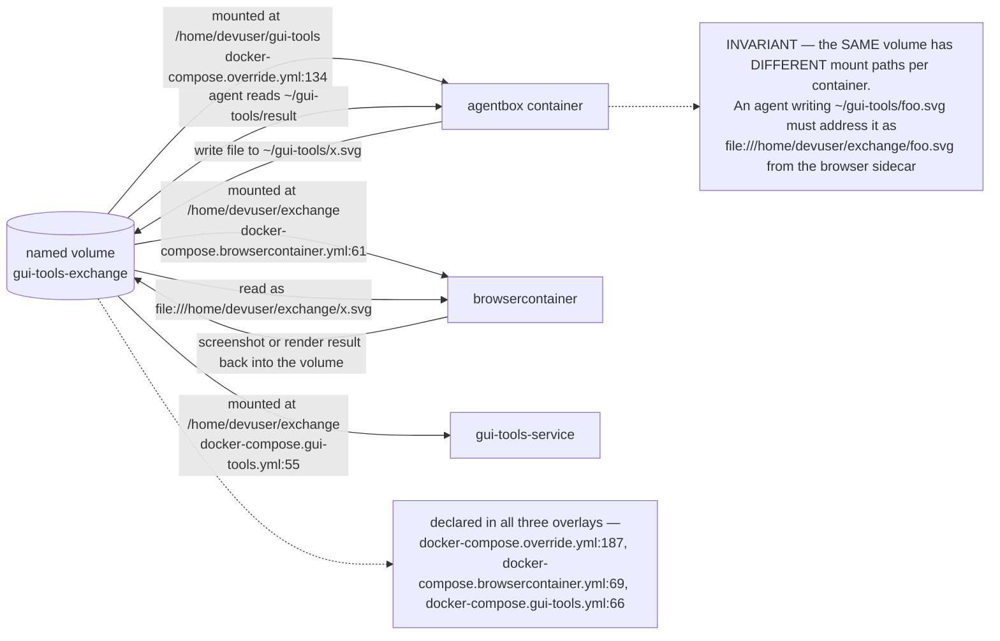
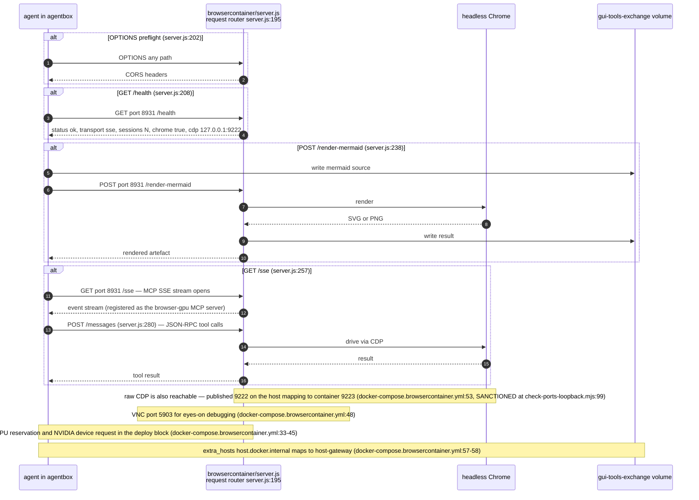
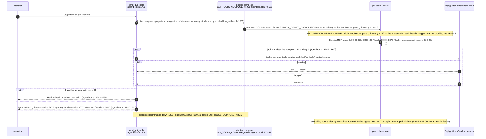
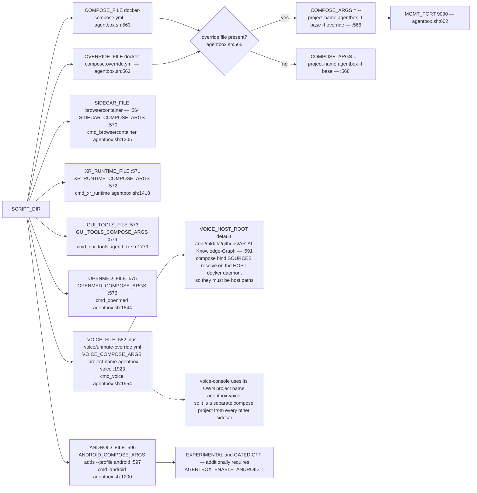
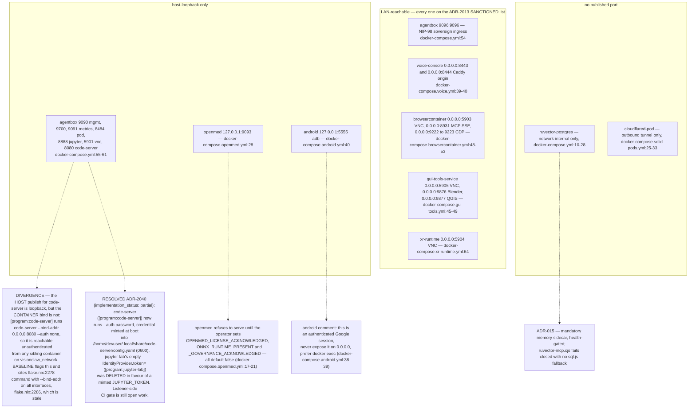
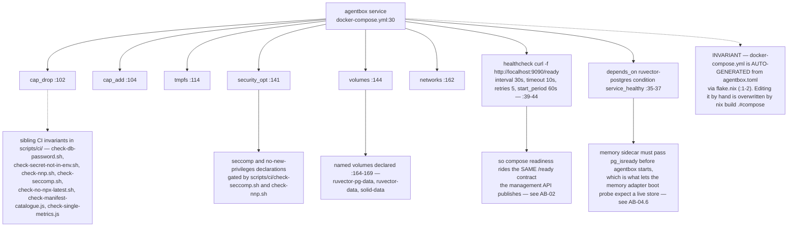
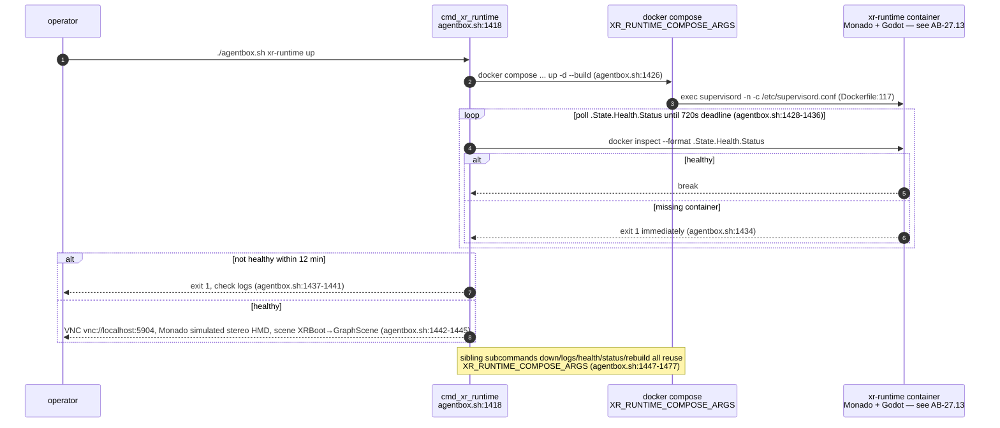

## AB-06.1 Compose overlay topology on visionclaw_network

## AB-06.2 ADR-2013 — the loopback-publish invariant and its CI gate

## AB-06.3 The gui-tools-exchange volume — asymmetric mount pair

## AB-06.4 browsercontainer — HTTP surface and MCP transport

## AB-06.5 gui-tools-service — the FHS GPU presentation sidecar

## AB-06.6 Per-sidecar compose argument sets and lifecycle entry points

## AB-06.7 Sidecar surface census with published bindings

## AB-06.8 Container hardening posture declared in the base compose

## AB-06.9 xr-runtime — operator CLI lifecycle (closes audit gap 5; sidecar internals in AB-27.13)

