## AB-06.1 Compose overlay topology on visionclaw_network
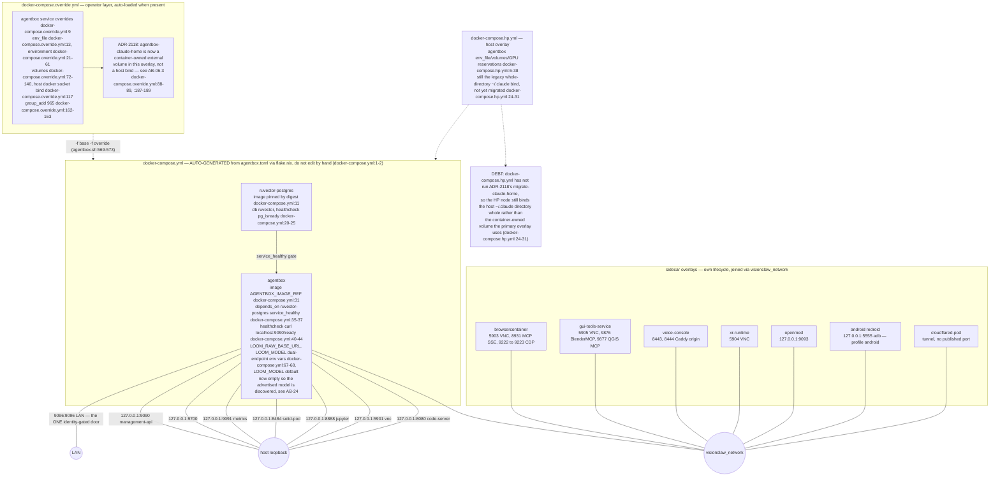
```mermaid
flowchart TB
    subgraph BASE["docker-compose.yml — AUTO-GENERATED from agentbox.toml via flake.nix, do not edit by hand (docker-compose.yml:1-2)"]
        PG["ruvector-postgres<br/>image pinned by digest docker-compose.yml:11<br/>db ruvector, healthcheck pg_isready docker-compose.yml:20-25"]
        AB["agentbox<br/>image AGENTBOX_IMAGE_REF docker-compose.yml:31<br/>depends_on ruvector-postgres service_healthy docker-compose.yml:35-37<br/>healthcheck curl localhost:9090/ready docker-compose.yml:40-44<br/>LOOM_RAW_BASE_URL, LOOM_MODEL dual-endpoint env vars docker-compose.yml:67-68,<br/>LOOM_MODEL default now empty so the advertised model is discovered, see AB-24"]
    end
    PG -->|"service_healthy gate"| AB
    AB ---|"9096:9096 LAN — the ONE identity-gated door"| LAN(("LAN"))
    AB ---|"127.0.0.1:9090 management-api"| LO(("host loopback"))
    AB ---|"127.0.0.1:9700"| LO
    AB ---|"127.0.0.1:9091 metrics"| LO
    AB ---|"127.0.0.1:8484 solid-pod"| LO
    AB ---|"127.0.0.1:8888 jupyter"| LO
    AB ---|"127.0.0.1:5901 vnc"| LO
    AB ---|"127.0.0.1:8080 code-server"| LO
    subgraph OVR["docker-compose.override.yml — operator layer, auto-loaded when present"]
        OV1["agentbox service overrides docker-compose.override.yml:9<br/>env_file docker-compose.override.yml:13, environment docker-compose.override.yml:21-61<br/>volumes docker-compose.override.yml:72-140, host docker socket bind docker-compose.override.yml:117<br/>group_add 965 docker-compose.override.yml:162-163"]
        OV2["ADR-2118: agentbox-claude-home is now a container-owned external<br/>volume in this overlay, not a host bind — see AB-06.3 docker-compose.override.yml:88-89, :187-189"]
    end
    OVR -.->|"-f base -f override (agentbox.sh:569-573)"| BASE
    OV1 --> OV2
    subgraph SIDE["sidecar overlays — own lifecycle, joined via visionclaw_network"]
        BC["browsercontainer<br/>5903 VNC, 8931 MCP SSE, 9222 to 9223 CDP"]
        GT["gui-tools-service<br/>5905 VNC, 9876 BlenderMCP, 9877 QGIS MCP"]
        VC["voice-console<br/>8443, 8444 Caddy origin"]
        XR["xr-runtime<br/>5904 VNC"]
        OM["openmed<br/>127.0.0.1:9093"]
        AND["android redroid<br/>127.0.0.1:5555 adb — profile android"]
        CF["cloudflared-pod<br/>tunnel, no published port"]
    end
    AB --- NET(("visionclaw_network"))
    BC --- NET
    GT --- NET
    VC --- NET
    XR --- NET
    OM --- NET
    AND --- NET
    CF --- NET
    HP["docker-compose.hp.yml — host overlay<br/>agentbox env_file/volumes/GPU reservations docker-compose.hp.yml:6-38<br/>still the legacy whole-directory ~/.claude bind, not yet migrated docker-compose.hp.yml:24-31"] -.-> BASE
    Note1["DEBT: docker-compose.hp.yml has not run ADR-2118's migrate-claude-home,<br/>so the HP node still binds the host ~/.claude directory whole rather than<br/>the container-owned volume the primary overlay uses (docker-compose.hp.yml:24-31)"]
    HP -.-> Note1
```

## AB-06.2 ADR-2013 — the loopback-publish invariant and its CI gate
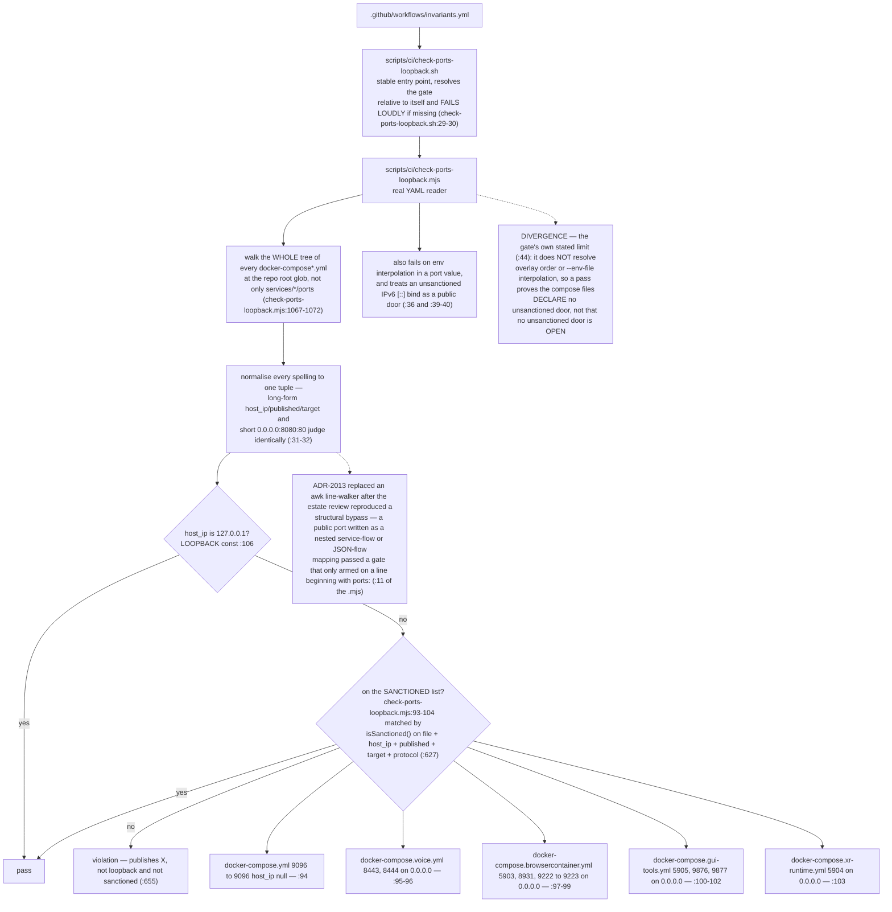
```mermaid
flowchart TD
    CI[".github/workflows/invariants.yml"] --> W["scripts/ci/check-ports-loopback.sh<br/>stable entry point, resolves the gate<br/>relative to itself and FAILS LOUDLY if missing (check-ports-loopback.sh:29-30)"]
    W --> G["scripts/ci/check-ports-loopback.mjs<br/>real YAML reader"]
    G --> WALK["walk the WHOLE tree of every docker-compose*.yml<br/>at the repo root glob, not only services/*/ports (check-ports-loopback.mjs:1067-1072)"]
    WALK --> NORM["normalise every spelling to one tuple —<br/>long-form host_ip/published/target and<br/>short 0.0.0.0:8080:80 judge identically (:31-32)"]
    NORM --> J{"host_ip is 127.0.0.1?<br/>LOOPBACK const :106"}
    J -->|yes| PASS["pass"]
    J -->|no| S{"on the SANCTIONED list?<br/>check-ports-loopback.mjs:93-104 matched by<br/>isSanctioned() on file + host_ip + published + target + protocol (:627)"}
    S -->|yes| PASS
    S -->|no| FAIL["violation — publishes X, not loopback and not sanctioned (:655)"]
    S --> L1["docker-compose.yml 9096 to 9096 host_ip null — :94"]
    S --> L2["docker-compose.voice.yml 8443, 8444 on 0.0.0.0 — :95-96"]
    S --> L3["docker-compose.browsercontainer.yml 5903, 8931, 9222 to 9223 on 0.0.0.0 — :97-99"]
    S --> L4["docker-compose.gui-tools.yml 5905, 9876, 9877 on 0.0.0.0 — :100-102"]
    S --> L5["docker-compose.xr-runtime.yml 5904 on 0.0.0.0 — :103"]
    G --> ALSO["also fails on env interpolation in a port value,<br/>and treats an unsanctioned IPv6 [::] bind as a public door (:36 and :39-40)"]
    G -.-> LIM["DIVERGENCE — the gate's own stated limit (:44): it does NOT resolve<br/>overlay order or --env-file interpolation, so a pass proves the compose files<br/>DECLARE no unsanctioned door, not that no unsanctioned door is OPEN"]
    NORM -.-> HIST["ADR-2013 replaced an awk line-walker after the estate review reproduced a<br/>structural bypass — a public port written as a nested service-flow or JSON-flow<br/>mapping passed a gate that only armed on a line beginning with ports: (:11 of the .mjs)"]
```

## AB-06.3 The gui-tools-exchange volume, and the ADR-2118 claude-home asymmetric mounts
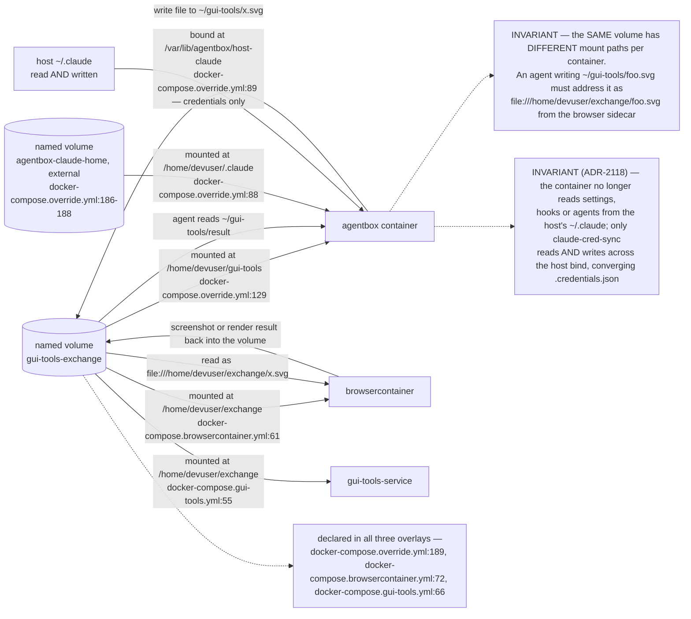
```mermaid
flowchart LR
    V[("named volume<br/>gui-tools-exchange")] -->|"mounted at /home/devuser/gui-tools<br/>docker-compose.override.yml:129"| AB["agentbox container"]
    V -->|"mounted at /home/devuser/exchange<br/>docker-compose.browsercontainer.yml:61"| BC["browsercontainer"]
    V -->|"mounted at /home/devuser/exchange<br/>docker-compose.gui-tools.yml:55"| GT["gui-tools-service"]
    AB -->|"write file to ~/gui-tools/x.svg"| V
    V -->|"read as file:///home/devuser/exchange/x.svg"| BC
    BC -->|"screenshot or render result back into the volume"| V
    V -->|"agent reads ~/gui-tools/result"| AB
    AB -.-> NOTE["INVARIANT — the SAME volume has DIFFERENT mount paths per container.<br/>An agent writing ~/gui-tools/foo.svg must address it as<br/>file:///home/devuser/exchange/foo.svg from the browser sidecar"]
    V -.-> DECL["declared in all three overlays —<br/>docker-compose.override.yml:189, docker-compose.browsercontainer.yml:72, docker-compose.gui-tools.yml:66"]
    CH[("named volume<br/>agentbox-claude-home, external<br/>docker-compose.override.yml:186-188")] -->|"mounted at /home/devuser/.claude<br/>docker-compose.override.yml:88"| AB
    HB["host ~/.claude<br/>read AND written"] -->|"bound at /var/lib/agentbox/host-claude<br/>docker-compose.override.yml:89 — credentials only"| AB
    AB -.-> INV2["INVARIANT (ADR-2118) — the container no longer reads settings,<br/>hooks or agents from the host's ~/.claude; only claude-cred-sync<br/>reads AND writes across the host bind, converging .credentials.json"]
```

## AB-06.4 browsercontainer — HTTP surface and MCP transport
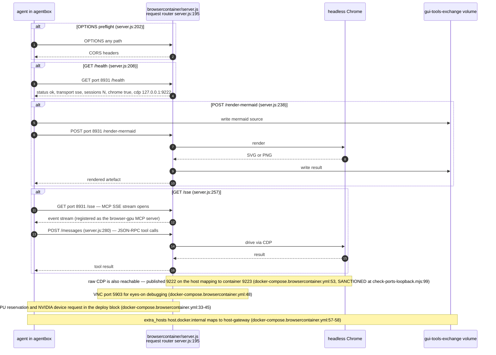
```mermaid
sequenceDiagram
    autonumber
    participant A as agent in agentbox
    participant S as browsercontainer/server.js<br/>request router server.js:195
    participant CH as headless Chrome
    participant V as gui-tools-exchange volume

    alt OPTIONS preflight (server.js:202)
        A->>S: OPTIONS any path
        S-->>A: CORS headers
    end
    alt GET /health (server.js:208)
        A->>S: GET port 8931 /health
        S-->>A: status ok, transport sse, sessions N, chrome true, cdp 127.0.0.1:9222
    end
    alt POST /render-mermaid (server.js:238)
        A->>V: write mermaid source
        A->>S: POST port 8931 /render-mermaid
        S->>CH: render
        CH-->>S: SVG or PNG
        S->>V: write result
        S-->>A: rendered artefact
    end
    alt GET /sse (server.js:257)
        A->>S: GET port 8931 /sse — MCP SSE stream opens
        S-->>A: event stream (registered as the browser-gpu MCP server)
        A->>S: POST /messages (server.js:280) — JSON-RPC tool calls
        S->>CH: drive via CDP
        CH-->>S: result
        S-->>A: tool result
    end
    Note over S,CH: raw CDP is also reachable — published 9222 on the host mapping to container 9223 (docker-compose.browsercontainer.yml:53, SANCTIONED at check-ports-loopback.mjs:99)
    Note over S: VNC port 5903 for eyes-on debugging (docker-compose.browsercontainer.yml:48)
    Note over A,S: GPU reservation and NVIDIA device request in the deploy block (docker-compose.browsercontainer.yml:33-45)
    Note over A,V: extra_hosts host.docker.internal maps to host-gateway (docker-compose.browsercontainer.yml:57-58)
```

## AB-06.5 gui-tools-service — the FHS GPU presentation sidecar
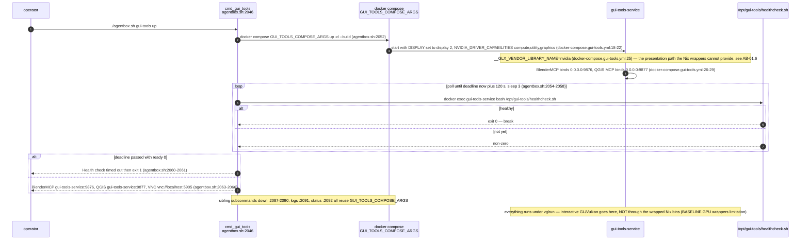
```mermaid
sequenceDiagram
    autonumber
    participant OP as operator
    participant SH as cmd_gui_tools<br/>agentbox.sh:2046
    participant DC as docker compose<br/>GUI_TOOLS_COMPOSE_ARGS
    participant GT as gui-tools-service
    participant HC as /opt/gui-tools/healthcheck.sh

    OP->>SH: ./agentbox.sh gui-tools up
    SH->>DC: docker compose GUI_TOOLS_COMPOSE_ARGS up -d --build (agentbox.sh:2052)
    DC->>GT: start with DISPLAY set to display 2, NVIDIA_DRIVER_CAPABILITIES compute,utility,graphics (docker-compose.gui-tools.yml:18-22)
    Note over GT: __GLX_VENDOR_LIBRARY_NAME=nvidia (docker-compose.gui-tools.yml:25) — the presentation path the Nix wrappers cannot provide, see AB-01.6
    GT->>GT: BlenderMCP binds 0.0.0.0:9876, QGIS MCP binds 0.0.0.0:9877 (docker-compose.gui-tools.yml:26-29)
    loop poll until deadline now plus 120 s, sleep 3 (agentbox.sh:2054-2058)
        SH->>HC: docker exec gui-tools-service bash /opt/gui-tools/healthcheck.sh
        alt healthy
            HC-->>SH: exit 0 — break
        else not yet
            HC-->>SH: non-zero
        end
    end
    alt deadline passed with ready 0
        SH-->>OP: Health check timed out then exit 1 (agentbox.sh:2060-2061)
    else
        SH-->>OP: BlenderMCP gui-tools-service:9876, QGIS gui-tools-service:9877, VNC vnc://localhost:5905 (agentbox.sh:2063-2066)
    end
    Note over SH,DC: sibling subcommands down :2087-2090, logs :2091, status :2092 all reuse GUI_TOOLS_COMPOSE_ARGS
    Note over GT: everything runs under vglrun — interactive GL/Vulkan goes here, NOT through the wrapped Nix bins (BASELINE GPU wrappers limitation)
```

## AB-06.6 Per-sidecar compose argument sets and lifecycle entry points
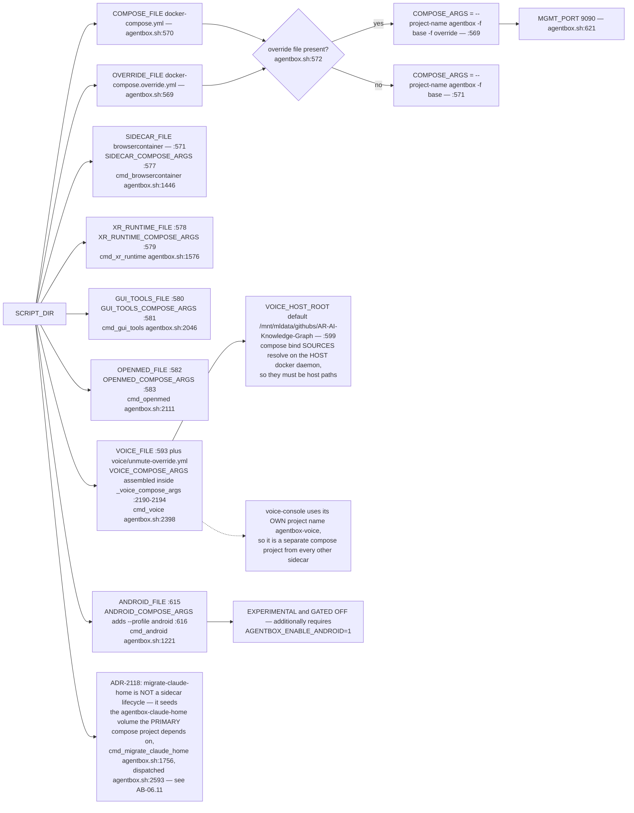
```mermaid
flowchart LR
    SD["SCRIPT_DIR"] --> A1["COMPOSE_FILE docker-compose.yml — agentbox.sh:570"]
    SD --> A2["OVERRIDE_FILE docker-compose.override.yml — agentbox.sh:569"]
    A1 --> CA{"override file present?<br/>agentbox.sh:572"}
    A2 --> CA
    CA -->|yes| CA1["COMPOSE_ARGS = --project-name agentbox -f base -f override — :569"]
    CA -->|no| CA2["COMPOSE_ARGS = --project-name agentbox -f base — :571"]
    SD --> S1["SIDECAR_FILE browsercontainer — :571<br/>SIDECAR_COMPOSE_ARGS :577<br/>cmd_browsercontainer agentbox.sh:1446"]
    SD --> S2["XR_RUNTIME_FILE :578<br/>XR_RUNTIME_COMPOSE_ARGS :579<br/>cmd_xr_runtime agentbox.sh:1576"]
    SD --> S3["GUI_TOOLS_FILE :580<br/>GUI_TOOLS_COMPOSE_ARGS :581<br/>cmd_gui_tools agentbox.sh:2046"]
    SD --> S4["OPENMED_FILE :582<br/>OPENMED_COMPOSE_ARGS :583<br/>cmd_openmed agentbox.sh:2111"]
    SD --> S5["VOICE_FILE :593 plus voice/unmute-override.yml<br/>VOICE_COMPOSE_ARGS assembled inside _voice_compose_args :2190-2194<br/>cmd_voice agentbox.sh:2398"]
    SD --> S6["ANDROID_FILE :615<br/>ANDROID_COMPOSE_ARGS adds --profile android :616<br/>cmd_android agentbox.sh:1221"]
    S5 --> VH["VOICE_HOST_ROOT default /mnt/mldata/githubs/AR-AI-Knowledge-Graph — :599<br/>compose bind SOURCES resolve on the HOST docker daemon,<br/>so they must be host paths"]
    S6 --> AG["EXPERIMENTAL and GATED OFF — additionally requires<br/>AGENTBOX_ENABLE_ANDROID=1"]
    CA1 --> MGMT["MGMT_PORT 9090 — agentbox.sh:621"]
    S5 -.-> VNOTE["voice-console uses its OWN project name agentbox-voice,<br/>so it is a separate compose project from every other sidecar"]
    SD --> S7["ADR-2118: migrate-claude-home is NOT a sidecar lifecycle — it seeds<br/>the agentbox-claude-home volume the PRIMARY compose project depends on,<br/>cmd_migrate_claude_home agentbox.sh:1756, dispatched agentbox.sh:2593 — see AB-06.11"]
```

## AB-06.7 Sidecar surface census with published bindings
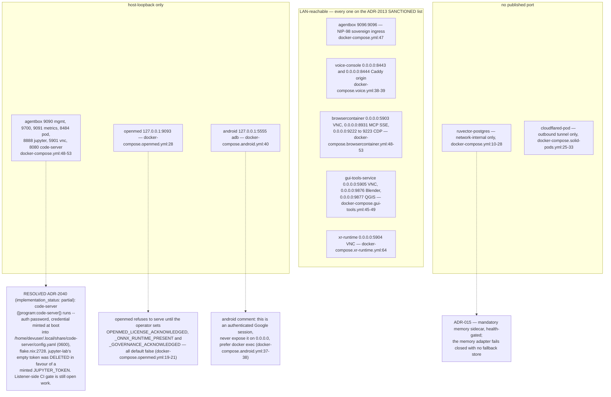
```mermaid
flowchart TB
    subgraph LANP["LAN-reachable — every one on the ADR-2013 SANCTIONED list"]
        P1["agentbox 9096:9096 — NIP-98 sovereign ingress<br/>docker-compose.yml:47"]
        P2["voice-console 0.0.0.0:8443 and 0.0.0.0:8444 Caddy origin<br/>docker-compose.voice.yml:38-39"]
        P3["browsercontainer 0.0.0.0:5903 VNC, 0.0.0.0:8931 MCP SSE,<br/>0.0.0.0:9222 to 9223 CDP — docker-compose.browsercontainer.yml:48-53"]
        P4["gui-tools-service 0.0.0.0:5905 VNC, 0.0.0.0:9876 Blender,<br/>0.0.0.0:9877 QGIS — docker-compose.gui-tools.yml:45-49"]
        P5["xr-runtime 0.0.0.0:5904 VNC — docker-compose.xr-runtime.yml:64"]
    end
    subgraph LOOP["host-loopback only"]
        Q1["agentbox 9090 mgmt, 9700, 9091 metrics, 8484 pod,<br/>8888 jupyter, 5901 vnc, 8080 code-server<br/>docker-compose.yml:48-53"]
        Q2["openmed 127.0.0.1:9093 — docker-compose.openmed.yml:28"]
        Q3["android 127.0.0.1:5555 adb — docker-compose.android.yml:40"]
    end
    subgraph NONE["no published port"]
        R1["ruvector-postgres — network-internal only, docker-compose.yml:10-28"]
        R2["cloudflared-pod — outbound tunnel only, docker-compose.solid-pods.yml:25-33"]
    end
    Q3 -.-> AND["android comment: this is an authenticated Google session,<br/>never expose it on 0.0.0.0, prefer docker exec (docker-compose.android.yml:37-38)"]
    Q2 -.-> OM["openmed refuses to serve until the operator sets<br/>OPENMED_LICENSE_ACKNOWLEDGED, _ONNX_RUNTIME_PRESENT and<br/>_GOVERNANCE_ACKNOWLEDGED — all default false (docker-compose.openmed.yml:19-21)"]
    Q1 -.-> CSR["RESOLVED ADR-2040 (implementation_status: partial): code-server<br/>([program:code-server]) runs --auth password, credential minted at boot<br/>into /home/devuser/.local/share/code-server/config.yaml (0600),<br/>flake.nix:2728. jupyter-lab's empty token was DELETED in favour of a<br/>minted JUPYTER_TOKEN. Listener-side CI gate is still open work."]
    R1 -.-> PGN["ADR-015 — mandatory memory sidecar, health-gated;<br/>the memory adapter fails closed with no fallback store"]
```

## AB-06.8 Container hardening posture declared in the base compose
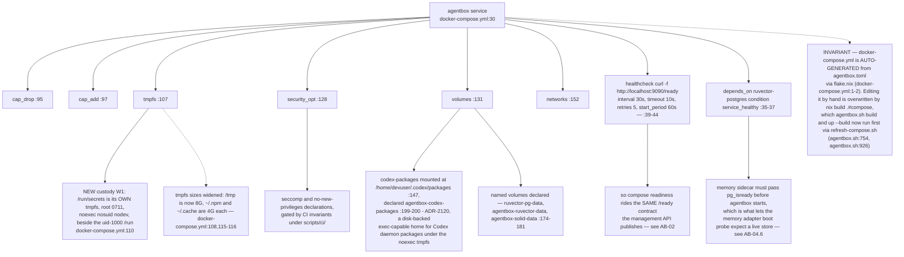
```mermaid
flowchart TD
    AB["agentbox service<br/>docker-compose.yml:30"] --> CD["cap_drop :95"]
    AB --> CA2["cap_add :97"]
    AB --> TM["tmpfs :107"]
    TM --> SEC["NEW custody W1: /run/secrets is its OWN tmpfs, root 0711,<br/>noexec nosuid nodev, beside the uid-1000 /run<br/>docker-compose.yml:110"]
    AB --> SO["security_opt :128"]
    AB --> VOL["volumes :131"]
    AB --> NET["networks :152"]
    SO --> SCC["seccomp and no-new-privileges declarations,<br/>gated by CI invariants under scripts/ci/"]
    VOL --> CXP["codex-packages mounted at /home/devuser/.codex/packages :147,<br/>declared agentbox-codex-packages :199-200 - ADR-2120, a disk-backed<br/>exec-capable home for Codex daemon packages under the noexec tmpfs"]
    VOL --> NV["named volumes declared — ruvector-pg-data,<br/>agentbox-ruvector-data, agentbox-solid-data :174-181"]
    AB --> HC["healthcheck curl -f http://localhost:9090/ready<br/>interval 30s, timeout 10s, retries 5, start_period 60s — :39-44"]
    HC --> RDY["so compose readiness rides the SAME /ready contract<br/>the management API publishes — see AB-02"]
    AB --> DEP["depends_on ruvector-postgres condition service_healthy :35-37"]
    DEP --> ORD["memory sidecar must pass pg_isready before agentbox starts,<br/>which is what lets the memory adapter boot probe expect a live store — see AB-04.6"]
    AB -.-> GEN["INVARIANT — docker-compose.yml is AUTO-GENERATED from agentbox.toml<br/>via flake.nix (docker-compose.yml:1-2). Editing it by hand is overwritten by nix build .#compose,<br/>which agentbox.sh build and up --build now run first via refresh-compose.sh<br/>(agentbox.sh:754, agentbox.sh:926)"]
    TM -.-> TMS["tmpfs sizes widened: /tmp is now 8G, ~/.npm and ~/.cache are 4G each — docker-compose.yml:108,115-116"]
```

## AB-06.9 xr-runtime — operator CLI lifecycle (closes audit gap 5; sidecar internals in AB-27.13)

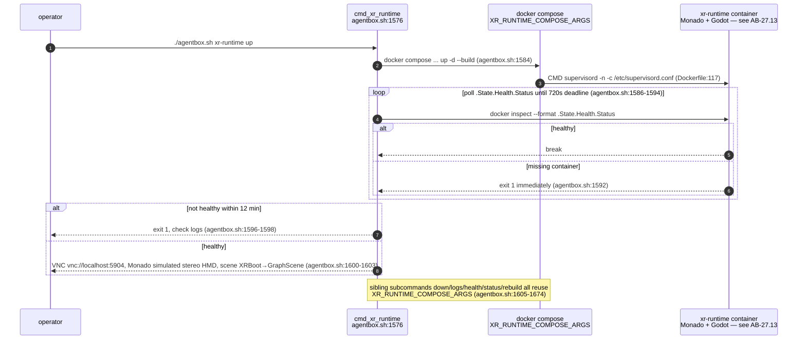
```mermaid
sequenceDiagram
    autonumber
    participant OP as operator
    participant SH as cmd_xr_runtime<br/>agentbox.sh:1576
    participant DC as docker compose<br/>XR_RUNTIME_COMPOSE_ARGS
    participant XR as xr-runtime container<br/>Monado + Godot — see AB-27.13

    OP->>SH: ./agentbox.sh xr-runtime up
    SH->>DC: docker compose ... up -d --build (agentbox.sh:1584)
    DC->>XR: CMD supervisord -n -c /etc/supervisord.conf (Dockerfile:117)
    loop poll .State.Health.Status until 720s deadline (agentbox.sh:1586-1594)
        SH->>XR: docker inspect --format .State.Health.Status
        alt healthy
            XR-->>SH: break
        else missing container
            XR-->>SH: exit 1 immediately (agentbox.sh:1592)
        end
    end
    alt not healthy within 12 min
        SH-->>OP: exit 1, check logs (agentbox.sh:1596-1598)
    else healthy
        SH-->>OP: VNC vnc://localhost:5904, Monado simulated stereo HMD, scene XRBoot→GraphScene (agentbox.sh:1600-1603)
    end
    Note over SH,DC: sibling subcommands down/logs/health/status/rebuild all reuse<br/>XR_RUNTIME_COMPOSE_ARGS (agentbox.sh:1605-1674)
```

## AB-06.10 System One and speech overlays: two sidecars added since 2026-09-06
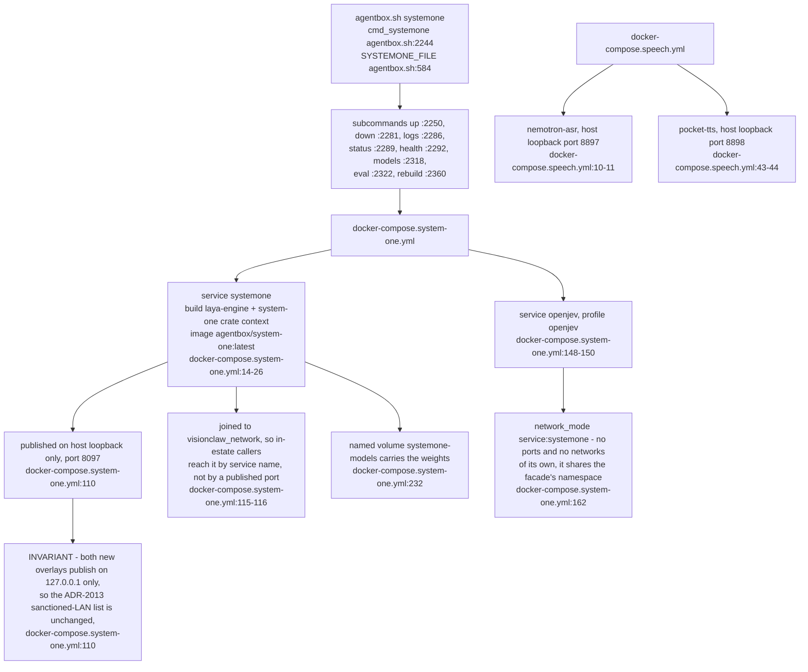
```mermaid
flowchart TB
    CLI["agentbox.sh systemone<br/>cmd_systemone agentbox.sh:2244<br/>SYSTEMONE_FILE agentbox.sh:584"] --> SUB["subcommands up :2250, down :2281, logs :2286,<br/>status :2289, health :2292, models :2318,<br/>eval :2322, rebuild :2360"]
    SUB --> COMPOSE["docker-compose.system-one.yml"]

    COMPOSE --> FACADE["service systemone<br/>build laya-engine + system-one crate context<br/>image agentbox/system-one:latest<br/>docker-compose.system-one.yml:14-26"]
    FACADE --> PUB["published on host loopback only, port 8097<br/>docker-compose.system-one.yml:110"]
    FACADE --> NET["joined to visionclaw_network, so in-estate callers<br/>reach it by service name, not by a published port<br/>docker-compose.system-one.yml:115-116"]
    FACADE --> VOL["named volume systemone-models carries the weights<br/>docker-compose.system-one.yml:232"]

    COMPOSE --> ENGINE["service openjev, profile openjev<br/>docker-compose.system-one.yml:148-150"]
    ENGINE --> NM["network_mode service:systemone - no ports and no networks<br/>of its own, it shares the facade's namespace<br/>docker-compose.system-one.yml:162"]

    SPEECH["docker-compose.speech.yml"] --> ASR["nemotron-asr, host loopback port 8897<br/>docker-compose.speech.yml:10-11"]
    SPEECH --> TTS["pocket-tts, host loopback port 8898<br/>docker-compose.speech.yml:43-44"]

    PUB --> INV["INVARIANT - both new overlays publish on 127.0.0.1 only,<br/>so the ADR-2013 sanctioned-LAN list is unchanged,<br/>docker-compose.system-one.yml:110"]
```

**What it shows.** The two compose overlays that joined the estate since this topic was last stamped: the ADR-2094 System One façade with its optional engine profile, and the shared speech pair the voice console depends on.
**Why it is this way.** ADR-2094 keeps typed decisions on the LAN, so the façade is published to host loopback and reached in-estate by service name; the engine shares the façade's network namespace rather than opening a second surface (`../project/agentbox/docker-compose.system-one.yml:162`).

**Invariant:** enabling `features.sovereign_system_one` without this overlay running leaves both consumers failing open to their built-in paths rather than erroring (`../project/agentbox/management-api/lib/system-manifest.js:224`).

## AB-06.11 ADR-2118 — container-owned ~/.claude and the migrate-claude-home lifecycle
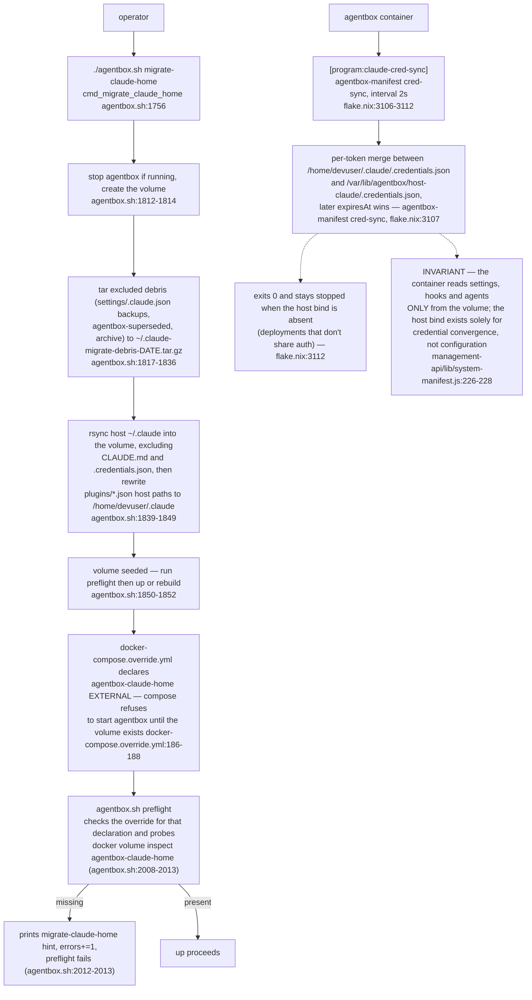
```mermaid
flowchart TB
    DEC["docker-compose.override.yml declares<br/>agentbox-claude-home EXTERNAL — compose refuses<br/>to start agentbox until the volume exists docker-compose.override.yml:186-188"] --> PRE["agentbox.sh preflight<br/>checks the override for that declaration and probes<br/>docker volume inspect agentbox-claude-home (agentbox.sh:2008-2013)"]
    PRE -->|"missing"| ERR["prints migrate-claude-home hint, errors+=1,<br/>preflight fails (agentbox.sh:2012-2013)"]
    PRE -->|"present"| OK["up proceeds"]
    OP["operator"] --> MIG["./agentbox.sh migrate-claude-home<br/>cmd_migrate_claude_home agentbox.sh:1756"]
    MIG --> STOP["stop agentbox if running, create the volume<br/>agentbox.sh:1812-1814"]
    STOP --> DEBRIS["tar excluded debris (settings/.claude.json backups,<br/>agentbox-superseded, archive) to ~/.claude-migrate-debris-DATE.tar.gz<br/>agentbox.sh:1817-1836"]
    DEBRIS --> RSYNC["rsync host ~/.claude into the volume, excluding<br/>CLAUDE.md and .credentials.json, then rewrite<br/>plugins/*.json host paths to /home/devuser/.claude<br/>agentbox.sh:1839-1849"]
    RSYNC --> DONE["volume seeded — run preflight then up or rebuild<br/>agentbox.sh:1850-1852"]
    DONE --> DEC
    AB2["agentbox container"] --> SYNC["[program:claude-cred-sync]<br/>agentbox-manifest cred-sync, interval 2s<br/>flake.nix:3106-3112"]
    SYNC --> MERGE["per-token merge between /home/devuser/.claude/.credentials.json<br/>and /var/lib/agentbox/host-claude/.credentials.json,<br/>later expiresAt wins — agentbox-manifest cred-sync, flake.nix:3107"]
    MERGE -.-> ABSENT["exits 0 and stays stopped when the host bind is absent<br/>(deployments that don't share auth) — flake.nix:3112"]
    MERGE -.-> INV["INVARIANT — the container reads settings, hooks and agents<br/>ONLY from the volume; the host bind exists solely for<br/>credential convergence, not configuration<br/>management-api/lib/system-manifest.js:226-228"]
```

**What it shows.** ADR-2118 replaced the whole-directory host `~/.claude` bind with a container-owned `agentbox-claude-home` volume: an external volume compose cannot start without, a `migrate-claude-home` command that seeds it once from the host, a preflight gate that fails loudly if it is missing, and a `claude-cred-sync` supervisor program that keeps only the rotating OAuth `.credentials.json` converged against the host's own `~/.claude`, which stays bound read-write at `/var/lib/agentbox/host-claude` for that purpose alone.
**Why it is this way.** Rotating OAuth refresh tokens meant a one-sided host bind logged one side out on every refresh; splitting configuration (volume-owned) from credentials (bind-synced, per-token merge on `expiresAt`) keeps both host and container sessions valid without the container trusting host-side settings, hooks or agents (`../project/agentbox/docker-compose.override.yml:79-87`).

**Open:** the credential bind stays writable both ways, so a compromised in-container tool could still modify the host's `.claude`; only the configuration-read path was closed (`../project/agentbox/docker-compose.override.yml:84-85`).

## AB-06.12 browsercontainer ships a pinned Podkey and keeps its profile on a volume (custody W9)
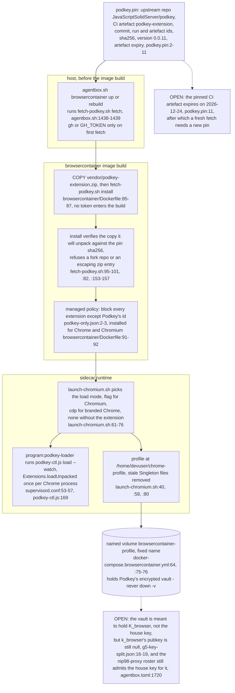
```mermaid
flowchart TB
    PIN["podkey.pin: upstream repo JavaScriptSolidServer/podkey,<br/>CI artefact podkey-extension, commit, run and artefact ids,<br/>sha256, version 0.0.11, artefact expiry, podkey.pin:2-11"]
    subgraph HOST["host, before the image build"]
        F1["agentbox.sh browsercontainer up or rebuild<br/>runs fetch-podkey.sh fetch, agentbox.sh:1438-1439<br/>gh or GH_TOKEN only on first fetch"]
    end
    subgraph IMG["browsercontainer image build"]
        D1["COPY vendor/podkey-extension.zip, then fetch-podkey.sh install<br/>browsercontainer/Dockerfile:85-87, no token enters the build"]
        D2["install verifies the copy it will unpack against the pin sha256,<br/>refuses a fork repo or an escaping zip entry<br/>fetch-podkey.sh:95-101, :82, :153-157"]
        D3["managed policy: block every extension except Podkey's id<br/>podkey-only.json:2-3, installed for Chrome and Chromium browsercontainer/Dockerfile:91-92"]
    end
    subgraph RUN["sidecar runtime"]
        L1["launch-chromium.sh picks the load mode, flag for Chromium,<br/>cdp for branded Chrome, none without the extension<br/>launch-chromium.sh:61-76"]
        L2["program:podkey-loader runs podkey-ctl.js load --watch,<br/>Extensions.loadUnpacked once per Chrome process<br/>supervisord.conf:53-57, podkey-ctl.js:169"]
        L3["profile at /home/devuser/chrome-profile, stale Singleton files removed<br/>launch-chromium.sh:40, :58, :80"]
    end
    VOL[("named volume browsercontainer-profile, fixed name<br/>docker-compose.browsercontainer.yml:64, :75-76<br/>holds Podkey's encrypted vault - never down -v")]
    PIN --> F1 --> D1 --> D2 --> D3 --> L1 --> L2
    L1 --> L3 --> VOL
    VOL -.-> OPEN1["OPEN: the vault is meant to hold K_browser, not the house key,<br/>but k_browser's pubkey is still null, g5-key-split.json:16-19, and the<br/>nip98-proxy roster still admits the house key for it, agentbox.toml:1720"]
    PIN -.-> OPEN2["OPEN: the pinned CI artefact expires on 2026-12-24, podkey.pin:11,<br/>after which a fresh fetch needs a new pin"]
```

**What it shows.** The browser sidecar now carries an identity of its own. The Podkey extension is the upstream CI artefact named exactly by `podkey.pin`. It is fetched on the host and only verified and unpacked during the image build. Chrome is locked to that one extension by managed policy and loads it in whichever mode the browser supports. The Chrome profile, which holds Podkey's encrypted vault, moved from a throwaway `/tmp` path to a named volume so it survives container recreation.
**Why it is this way.** The G-5 key split moves the browser-automation use off the house key onto a dedicated `K_browser` minted inside the sidecar (custody design §11.2, owner rule 2026-10-03). That key has to live somewhere the sidecar owns and that outlasts a rebuild. Pinning a published artefact by hash, rather than building from source or accepting a fork, keeps a credential-holding extension reproducible and auditable (`../project/agentbox/browsercontainer/Dockerfile:78-82`).

**Invariant:** the browsercontainer image is never built with an unverified Podkey: the zip copied into the build is checked against the pinned sha256 before a single entry is extracted, and a mismatch refuses the build (`../project/agentbox/browsercontainer/scripts/fetch-podkey.sh:150-151`, `../project/agentbox/browsercontainer/scripts/fetch-podkey.sh:95-101`).

**Open:** `K_browser` is not admitted anywhere yet. Its pubkey is null in the split register (`../project/agentbox/config/custody/g5-key-split.json:16-20`), and the LAN door's roster still names the house key as the browsercontainer vault's identity (`../project/agentbox/agentbox.toml:1720`). Until the owner mints it and the dual-admit step lands, the sidecar's flows still authenticate as the house key.

## AB-06.13 The host Docker socket and the /run/secrets mount: what compose can and cannot narrow (custody W0, W1)
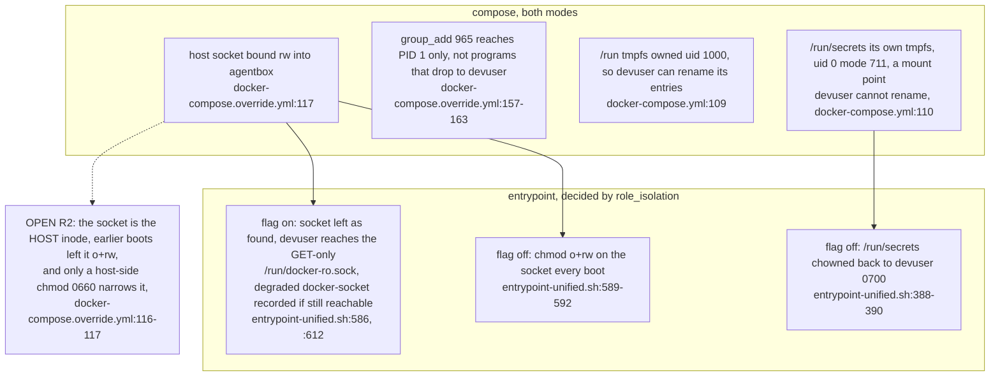
```mermaid
flowchart TB
    subgraph COMPOSE["compose, both modes"]
        S1["host socket bound rw into agentbox<br/>docker-compose.override.yml:117"]
        S2["group_add 965 reaches PID 1 only, not programs that drop to devuser<br/>docker-compose.override.yml:157-163"]
        M1["/run tmpfs owned uid 1000, so devuser can rename its entries<br/>docker-compose.yml:109"]
        M2["/run/secrets its own tmpfs, uid 0 mode 711, a mount point<br/>devuser cannot rename, docker-compose.yml:110"]
    end
    subgraph BOOT["entrypoint, decided by role_isolation"]
        E0["flag off: chmod o+rw on the socket every boot<br/>entrypoint-unified.sh:589-592"]
        E1["flag on: socket left as found, devuser reaches the GET-only<br/>/run/docker-ro.sock, degraded docker-socket recorded if still reachable<br/>entrypoint-unified.sh:586, :612"]
        E2["flag off: /run/secrets chowned back to devuser 0700<br/>entrypoint-unified.sh:388-390"]
    end
    S1 --> E0
    S1 --> E1
    M2 --> E2
    S1 -.-> R2["OPEN R2: the socket is the HOST inode, earlier boots left it o+rw,<br/>and only a host-side chmod 0660 narrows it,<br/>docker-compose.override.yml:116-117"]
```

**What it shows.** The two compose-level facts the custody change rests on. The host Docker socket is a bind of the host's own inode, so nothing inside the container can make it narrower than the host leaves it. `/run/secrets` became a separate root-owned tmpfs under the devuser-owned `/run`, because a mount point cannot be renamed by the owner of its parent. Both ship in every image. With `[security].role_isolation` off the entrypoint widens the socket and chowns `/run/secrets` to devuser exactly as before.
**Why it is this way.** The Docker daemon is root on the host, so while devuser can drive it every in-container boundary is void (custody design §0, bypass 1). The `/run` tmpfs is uid 1000 by construction (`../project/agentbox/docker-compose.yml:109`), so the secrets directory had to leave it.

**Invariant:** `/run/secrets` is its own mount, owned by root with mode 0711, in both modes, so devuser, as owner of `/run`, cannot rename it or replace it after boot (`../project/agentbox/docker-compose.yml:110`). The flag-off boot then hands the directory to devuser (`../project/agentbox/config/entrypoint-unified.sh:388-390`), so the root ownership only protects anything under `role_isolation`.

The host socket inode stays world-accessible until the host chmods it. The entrypoint under `role_isolation` stops widening it but never narrows it, and the compose comment names this as risk R2, owner question Q2 (`../project/agentbox/docker-compose.override.yml:116-117`); the open question is registered once, in AB-36.

