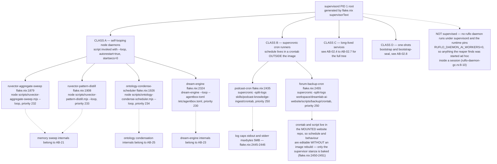
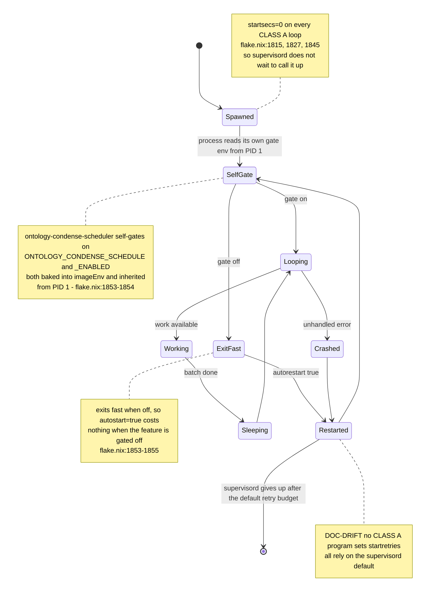
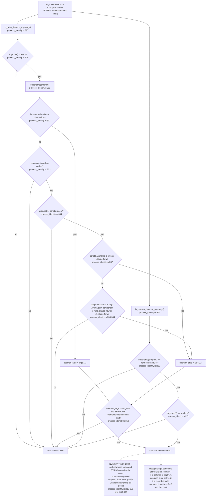
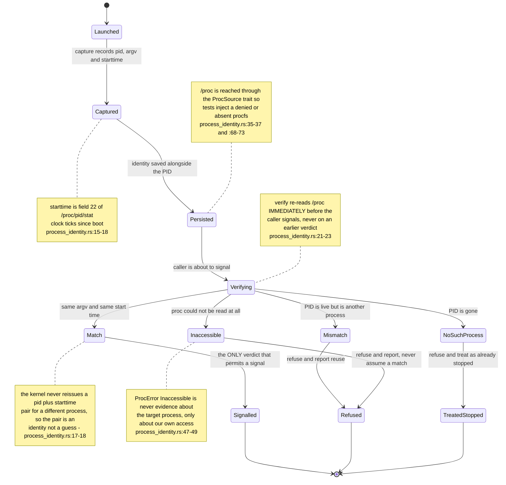
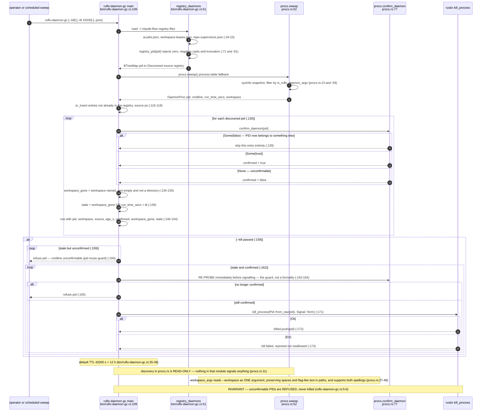
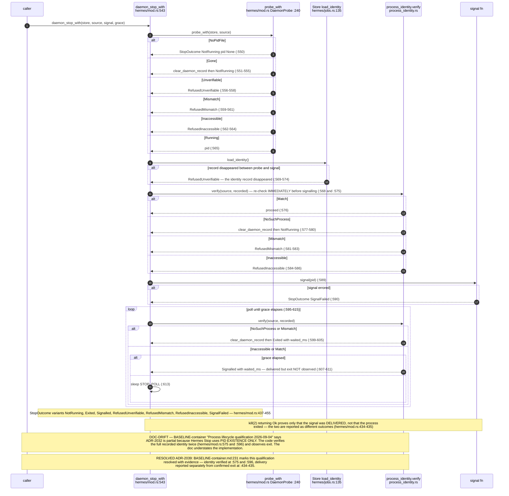
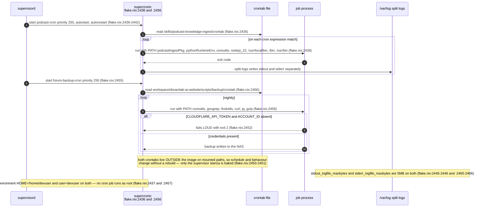
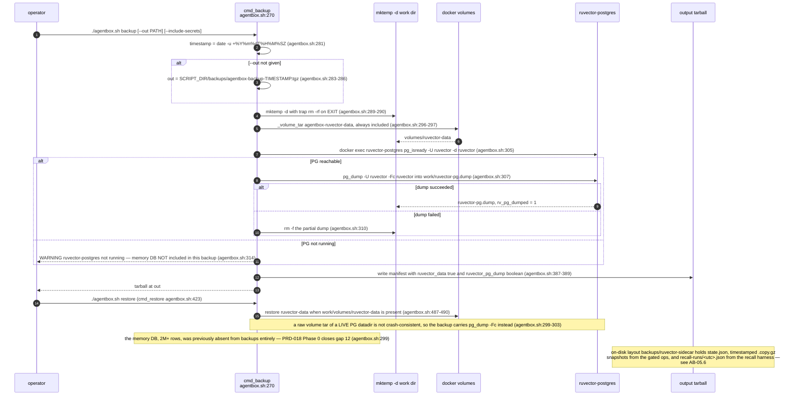
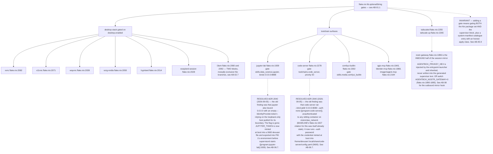

## AB-07.1 Supervised process classes by lifecycle shape

## AB-07.2 Self-gating loop daemons — why autostart is safe

## AB-07.3 ADR-2032 — the launcher allowlist that decides what is a daemon

## AB-07.4 ProcessIdentity — the (pid, argv, starttime) tuple and its four verdicts

## AB-07.5 ruflo-daemon-gc — registry-first discovery with a PID-reuse guard

## AB-07.6 Hermes daemon_stop — identity-verified signalling and observed exit

## AB-07.7 Cron runners — schedule outside the image

## AB-07.8 Backup and restore — volumes plus a crash-consistent PG dump

## AB-07.9 Gated starts — networking, desktop and toolchain daemons

