Registration ground truth (2026-09-07): `~/.claude/settings.json` is boot-generated and never tracked, so AB-08.1–AB-08.7
cite the sites that WRITE it — `config/entrypoint-unified.sh` for the root session and
`services/agentbox-manifest/src/stacks.rs` `learning_hooks#40;#41;` for per-profile stacks — the split `config/hooks/README.md` owns.

## AB-08.1 Root-session registration — what entrypoint-unified.sh seeds into ~/.claude/settings.json
```mermaid
flowchart TB
    S["settings path resolved once, CLAUDE_CONFIG_DIR<br/>fallback /home/devuser/.claude/settings.json<br/>entrypoint-unified.sh:1172"]
    subgraph MIR["nostr-live-mirror.cjs — always registered"]
    direction TB
    M1["block entrypoint-unified.sh:1167, baked /opt hook path :1173"]
    M2["entrypoint-unified.sh:1182 events SessionStart, UserPromptSubmit, Stop, SessionEnd<br/>idempotent marker test on the command string :1184"]
    M3["entrypoint-unified.sh:1186 push node HOOK EVENT, timeout 8000<br/>runtime off switch AGENTBOX_LIVE_MIRROR=0, see AB-08.9"]
    M1 --> M2 --> M3
    end
    subgraph FLT["fleet-session-start.sh — SessionStart"]
    direction TB
    F1["fleet registration entrypoint-unified.sh:1202<br/>off switch AGENTBOX_NOSTR_GATEWAY=0 in fleet-session-start.sh"]
    F2["entrypoint-unified.sh:1205 marker test, :1206 push timeout 8000"]
    F1 --> F2
    end
    subgraph ONT["ontology-monitor.cjs — SessionEnd, gated"]
    direction TB
    O1["entrypoint-unified.sh:1220 gate defaults to 0<br/>read from manifest path ontology_monitor.enabled :1224"]
    O2["entrypoint-unified.sh:1245 ON: push timeout 200000<br/>AND seed env AGENTBOX_ONTOLOGY_MONITOR=1 :1250"]
    O3["entrypoint-unified.sh:1254 OFF: filter the hook back out<br/>delete the emptied SessionEnd array :1258<br/>INVARIANT ADR-2020 byte-identical-when-off :1219"]
    O4["gate source agentbox.toml:103-104 enabled = true"]
    O1 --> O2
    O1 --> O3
    O1 --> O4
    end
    subgraph TRU["trust-seed.cjs — SessionStart plus one direct run"]
    direction TB
    T1["block entrypoint-unified.sh:1276, hook path :1284<br/>gate AGENTBOX_TRUST_SEED, direct run first :1285"]
    T2["entrypoint-unified.sh:1293 marker test<br/>:1294 push timeout 8000 with continueOnError true"]
    T1 --> T2
    end
    subgraph TRJ["trajectory-recorder.cjs — Stop and SubagentStop, gated"]
    direction TB
    J1["block entrypoint-unified.sh:1377, hook path :1390<br/>gate: BOTH memory_learning flags :1391"]
    J2["entrypoint-unified.sh:1412 specs = Stop, SubagentStop ONLY<br/>reconcile strips prior wiring over 4 legacy events :1413 and :1415<br/>then push timeout 10000 behind an inline env prefix :1421"]
    J3["entrypoint-unified.sh:1439 gate off: strip over the same 4 events<br/>:1442-1443 keep-filter, :1445 log the de-registration"]
    J4["gate source agentbox.toml:413-414 enabled + record_trajectories"]
    J1 --> J2
    J1 --> J3
    J1 --> J4
    end
    subgraph OTH["turn-sink, dream-inbox, ruvnet-brain"]
    direction TB
    X1["entrypoint-unified.sh:1339 tab0-bridge turn-sink.cjs deployed path<br/>:1347 events UserPromptSubmit and Stop, :1350 timeout 8000"]
    X2["entrypoint-unified.sh:1455 dream-inbox-surface.cjs, live-checkout fallback :1456<br/>gate DREAM_INBOX_HOOK :1457, UserPromptSubmit timeout 5000 :1471"]
    X3["entrypoint-unified.sh:1854 ruvnet-brain-ground.cjs<br/>gate RUVNET_BRAIN_GROUNDING_HOOK :1855, timeout 5000 :1868"]
    X4["gate source agentbox.toml:634 grounding_hook = true"]
    X1 --> X2 --> X3 --> X4
    end
    subgraph SHM["hook shim reconcile — ADR-2034 §1"]
    direction TB
    H1["entrypoint-unified.sh:1299 block, gate AGENTBOX_HOOK_SHIM :1309"]
    H2["entrypoint-unified.sh:1310 agentbox-hook reconcile --root WORKSPACE --depth 2<br/>rewrites per-project ruflo CLI hooks to the resident shim"]
    H1 --> H2
    end
    S --> MIR --> FLT --> ONT --> TRU --> TRJ --> OTH --> SHM
```

## AB-08.2 Per-profile registration — stacks.rs learning_hooks, and what is NOT a hook
```mermaid
flowchart TB
    subgraph PP["workspace/profiles/#60;stack#62;/.claude/settings.json"]
    direction TB
    P0["build_profile writes hooks: learning_hooks#40;env, gates#41;<br/>stacks.rs:215, fn at :28"]
    P1["every entry is node ADAPTER action #124;#124; true<br/>stacks.rs:32, adapter default stacks_env.rs:42-45"]
    P2["PreToolUse stacks.rs:54<br/>Bash → pre-command t=5000 :55<br/>Write#124;Edit#124;MultiEdit → pre-edit t=5000 :56"]
    P3["PostToolUse :58<br/>Write#124;Edit#124;MultiEdit → post-edit t=10000 :59<br/>Bash → post-command t=5000 :60"]
    P4["UserPromptSubmit → route t=12000 :62<br/>SessionStart → session-restore t=15000 :63"]
    P5["SessionEnd :64 = session-end t=10000 :37<br/>+ nostr summary hook when mobile_bridge :38-43<br/>+ ontology-monitor when ontology_monitor :45-50"]
    P0 --> P1 --> P2 --> P3 --> P4 --> P5
    end
    subgraph NOT["NOT hooks — hooks/README.md:40-46"]
    direction TB
    N1["project-tracking-publish.cjs — a CLI the management API spawns<br/>from POST /v1/projects/:id/publish, reads a digest on stdin<br/>hooks/README.md:44, see AB-08.12"]
    N2["fleet-tab-name.sh — shelled by fleet-session-start.sh:17<br/>hooks/README.md:45"]
    N3["lib/egress-policy.cjs, lib/trajectory-util.cjs — required libraries<br/>hooks/README.md:46, see AB-08.9 and AB-08.14"]
    N1 --> N2 --> N3
    end
    subgraph INV["invariants and divergences"]
    direction TB
    I1["INVARIANT: claude-flow-hook-adapter.cjs is wired ONLY per-profile<br/>stacks.rs:215 — never into the root settings.json<br/>hooks/README.md:27-31"]
    I2["INVARIANT ADR-2068: the root ontology gap is closed —<br/>entrypoint-unified.sh:1245 registers and :1254-1258 retracts,<br/>so the off state leaves no trace, hooks/README.md:25"]
    I3["INVARIANT: a new hook is not wired by dropping a file in config/hooks/ —<br/>register it in the site that owns its session class<br/>hooks/README.md:50-53"]
    I1 --> I2 --> I3
    end
    PP --> NOT --> INV
```

## AB-08.3 PreToolUse — what agentbox actually registers
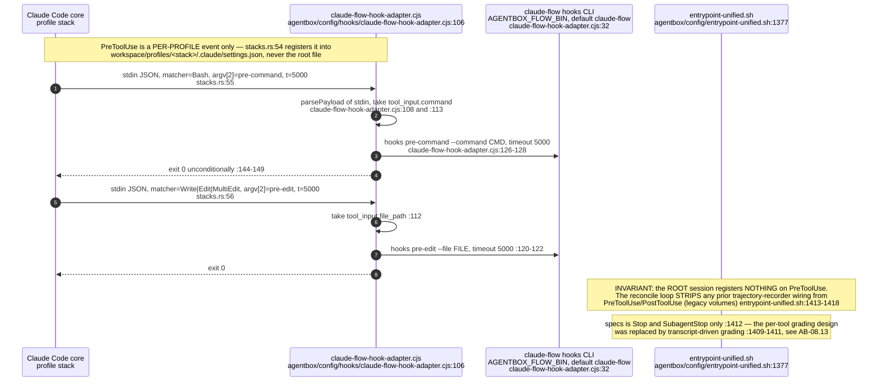

## AB-08.4 PostToolUse — post-edit and post-command, and why the root session opted out
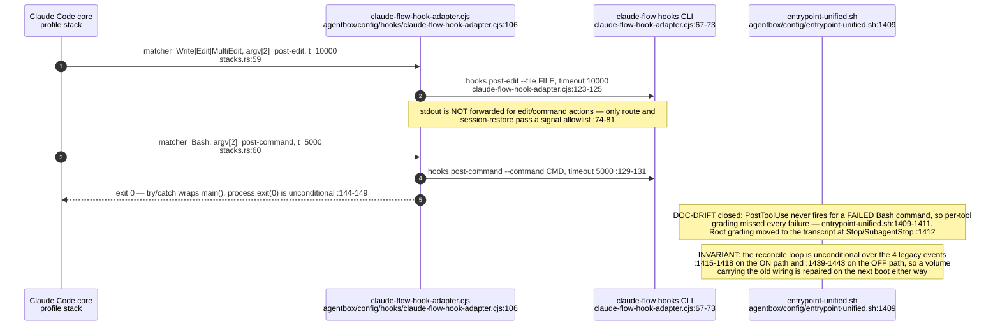

## AB-08.5 UserPromptSubmit — four root hooks plus the per-profile route
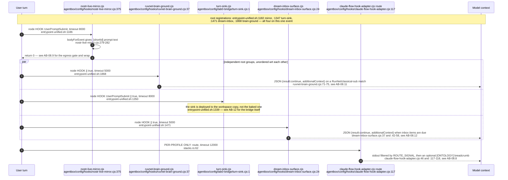

## AB-08.6 SessionStart — mirror, fleet tab, trust seed, and the per-profile restore
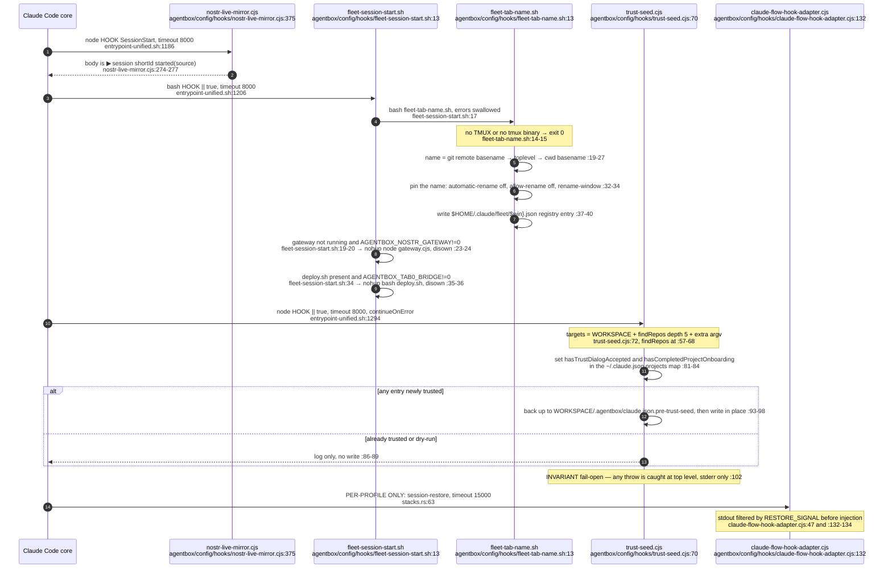

## AB-08.7 SessionEnd, Stop and SubagentStop — consolidation, mirror, ontology, trajectory close
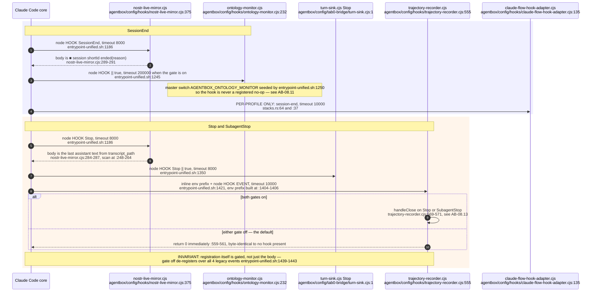

## AB-08.8 claude-flow-hook-adapter.cjs — stdin-to-CLI translation (per-profile stacks only)
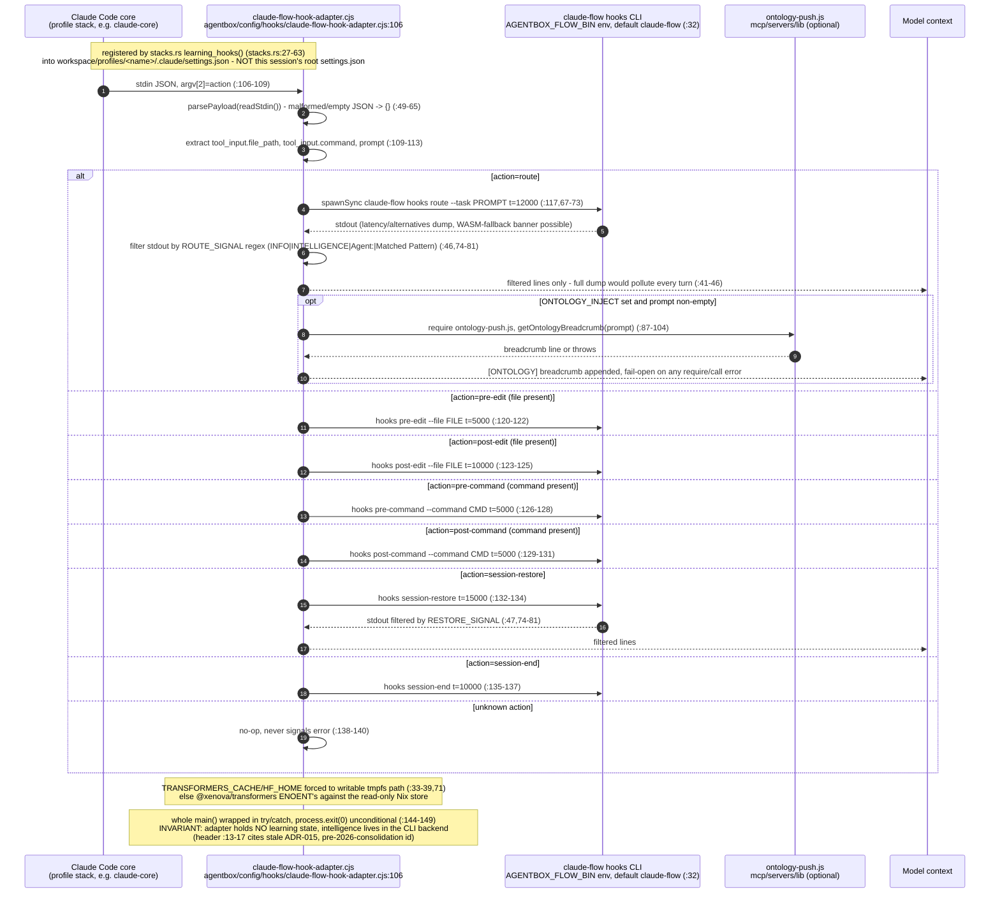
## AB-08.9 nostr-live-mirror.cjs — egress policy, redaction, NIP-59 gift wrap
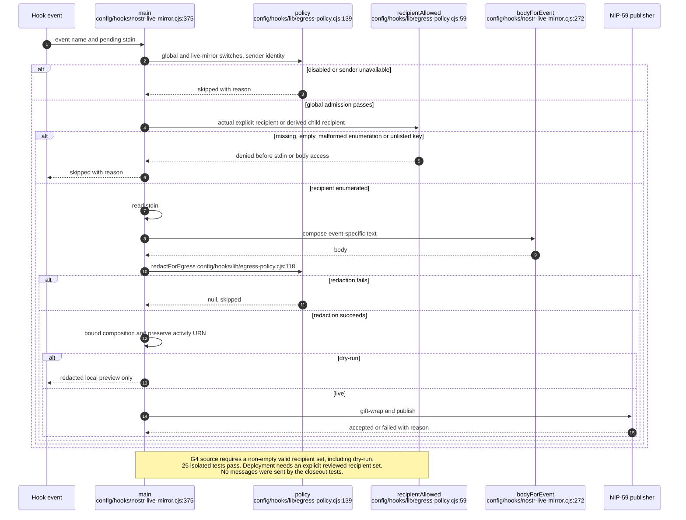

## AB-08.10 trust-seed.cjs — folder-trust and worktree discovery
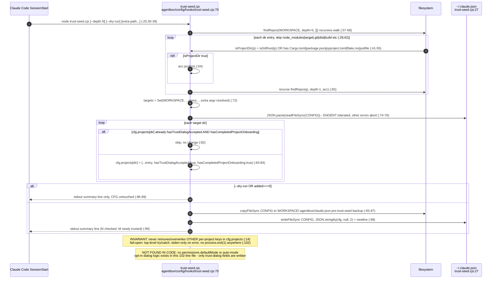
## AB-08.11 ruvnet-brain-ground.cjs and ontology-monitor.cjs
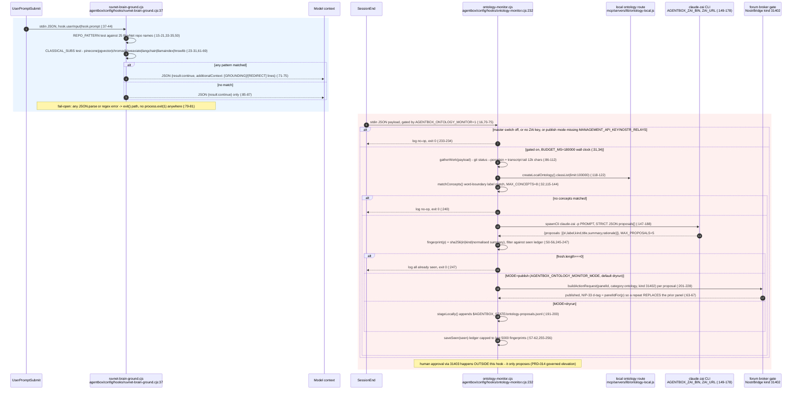
## AB-08.12 project-tracking-publish.cjs and dream-inbox-surface.cjs
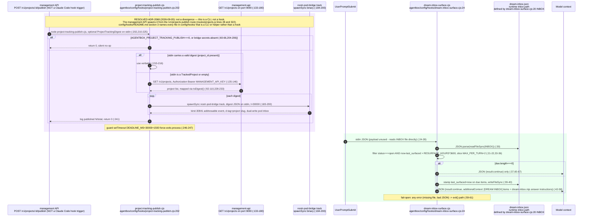
## AB-08.13 trajectory-recorder.cjs — Stop/SubagentStop boundary

## AB-08.14 lib/ shared helpers — consumers
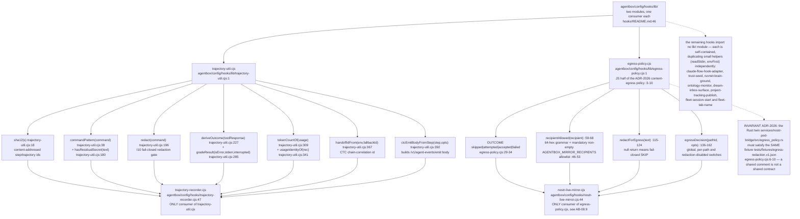
