Source qualification (2026-09-07): AB-08.1–AB-08.7 preserve an earlier **runtime settings snapshot**, not a tracked settings file or a fresh inspection of this session. Group numbers, offsets and timeouts in those sections are historical observations and may have drifted. No private `~/.claude/settings.json` was read for this audit. Current reproducible registration is grounded in `services/agentbox-manifest/src/stacks.rs::learning_hooks` (per-profile hooks) and `config/entrypoint-unified.sh` (root mirror/fleet/ontology/trust/trajectory/dream registration, plus hook-shim reconciliation). The latter can rewrite prior CLI hooks; the historical table is not an attestation of its output. Tracked handler internals below remain separately source-cited.

## AB-08.1 Hook registration table part 1 — tool, prompt and session events
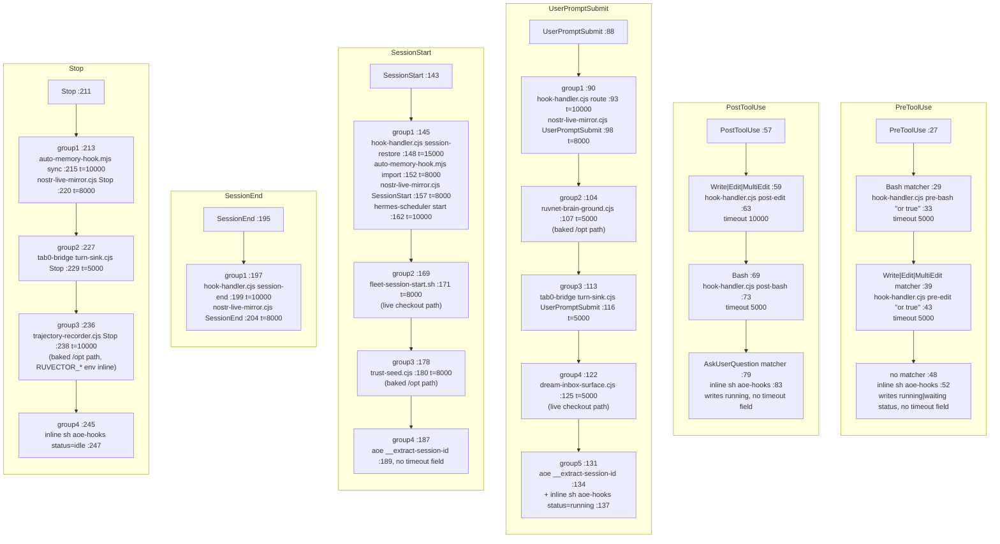

## AB-08.2 Hook registration table part 2 — lifecycle, notification and divergences
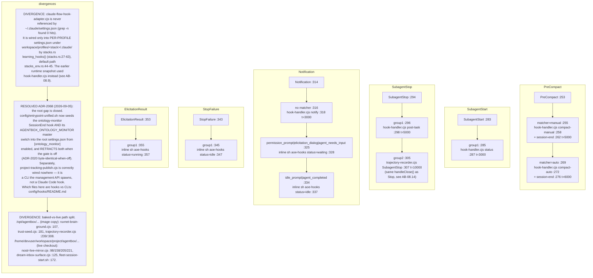

## AB-08.3 PreToolUse — Bash and Write/Edit/MultiEdit gates
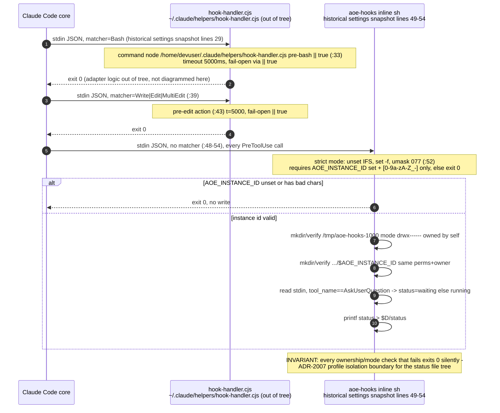
## AB-08.4 PostToolUse — post-edit, post-bash, AskUserQuestion status flip
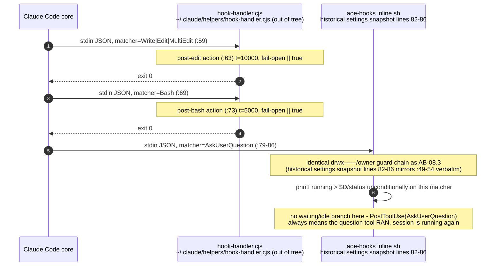
## AB-08.5 UserPromptSubmit — five handler groups, injected context
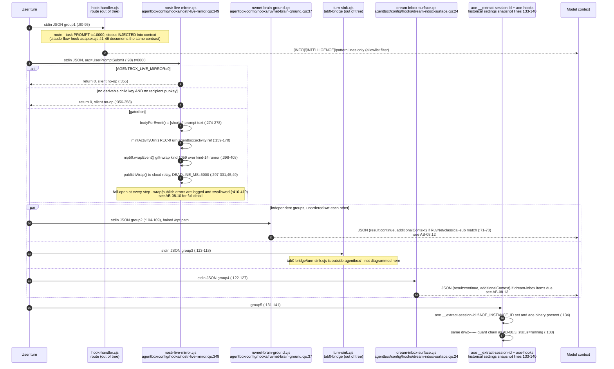
## AB-08.6 SessionStart — restore, mirror, fleet tab, trust seed
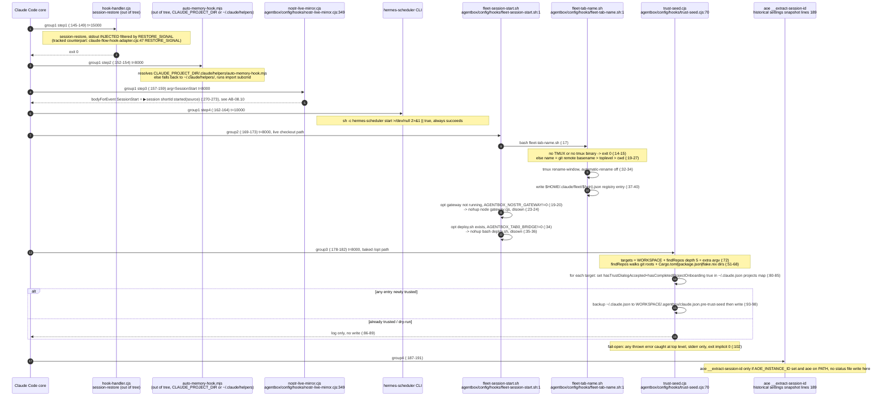
## AB-08.7 SessionEnd and Stop — consolidation, mirror, trajectory close
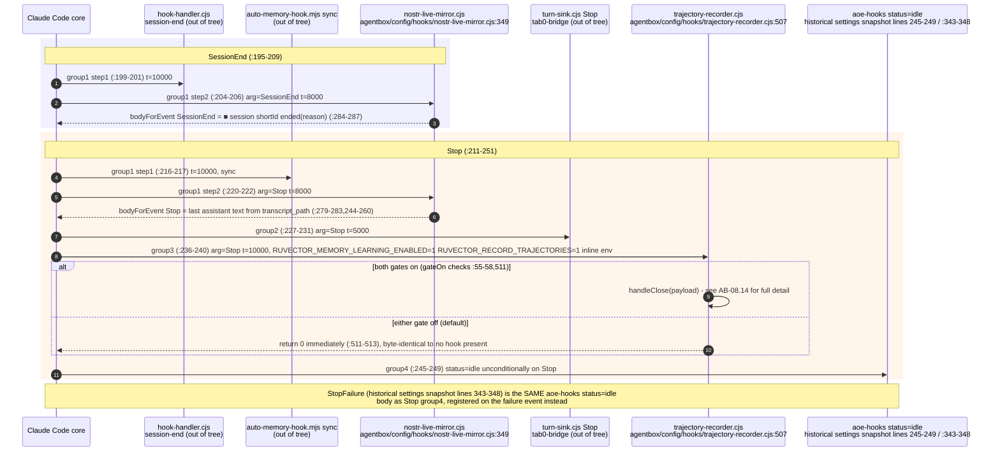
## AB-08.8 claude-flow-hook-adapter.cjs — stdin-to-CLI translation (per-profile stacks only)
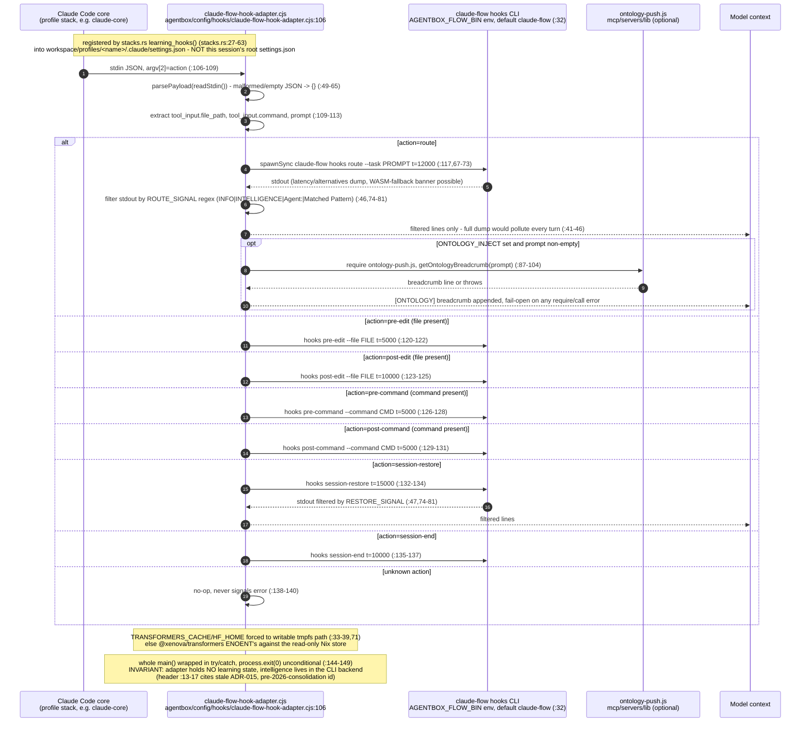
## AB-08.9 nostr-live-mirror.cjs — NIP-59 gift-wrapped turn mirror
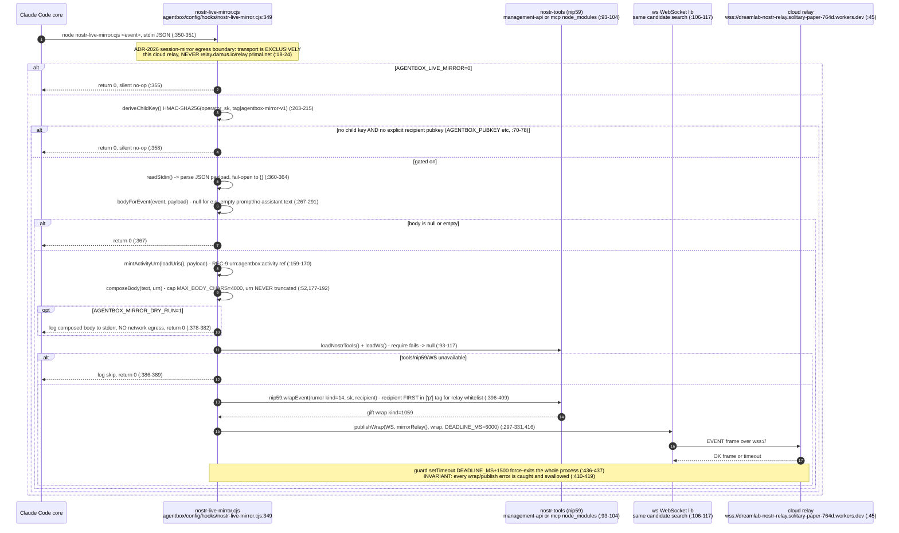
## AB-08.10 trust-seed.cjs — folder-trust and worktree discovery
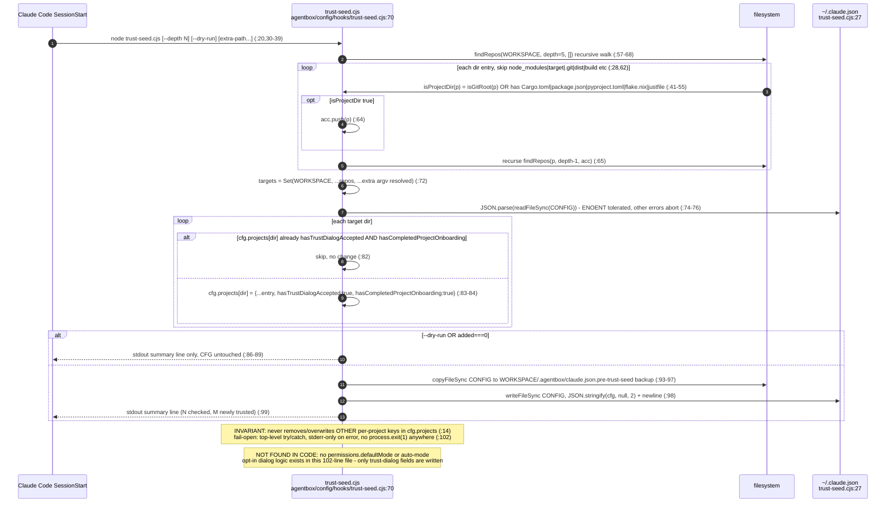
## AB-08.11 ruvnet-brain-ground.cjs and ontology-monitor.cjs
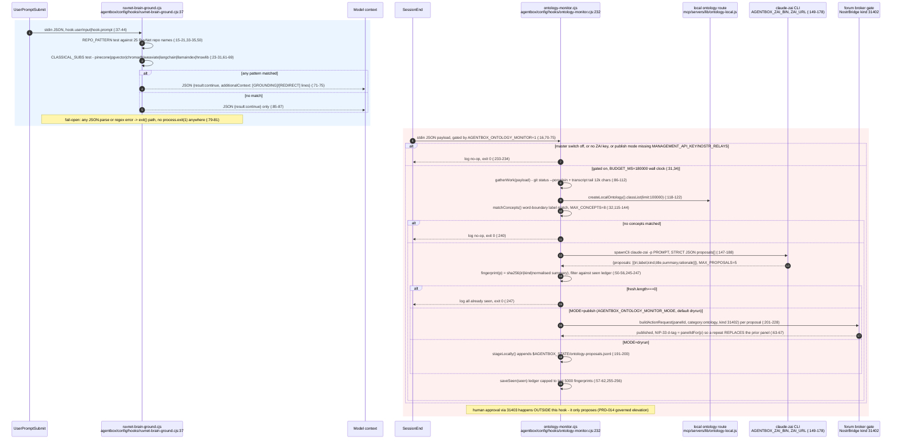
## AB-08.12 project-tracking-publish.cjs and dream-inbox-surface.cjs
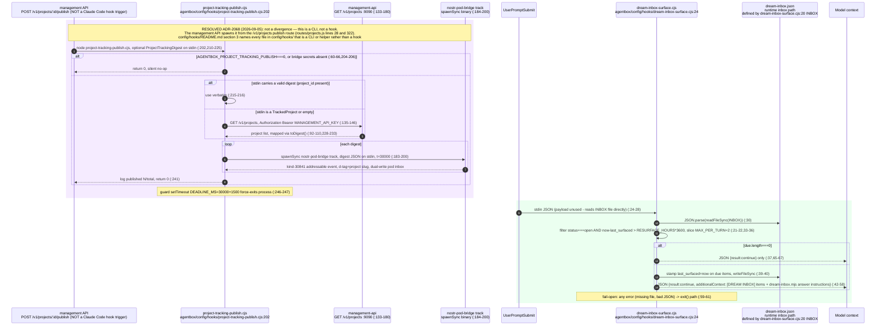
## AB-08.13 trajectory-recorder.cjs — Stop/SubagentStop boundary
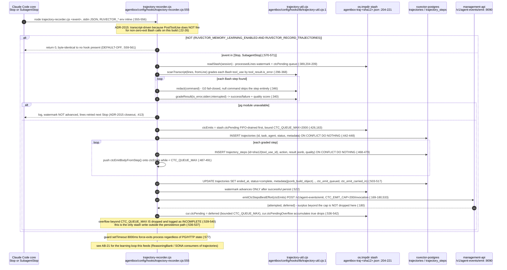
## AB-08.14 lib/ shared helpers — consumers
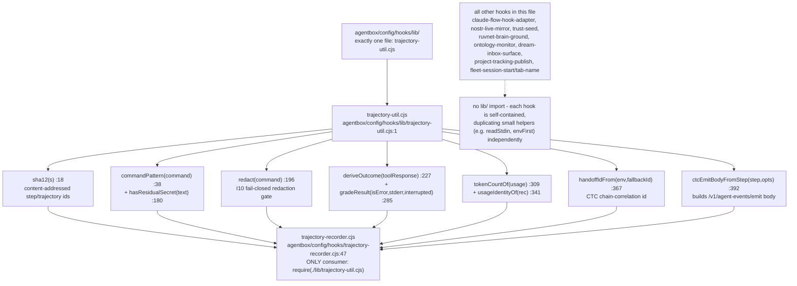

