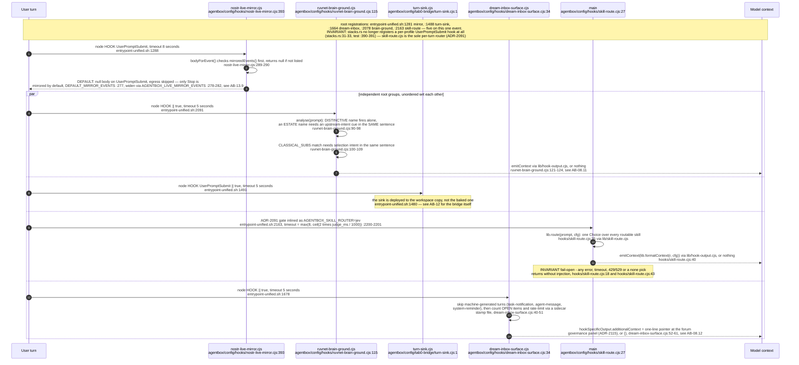
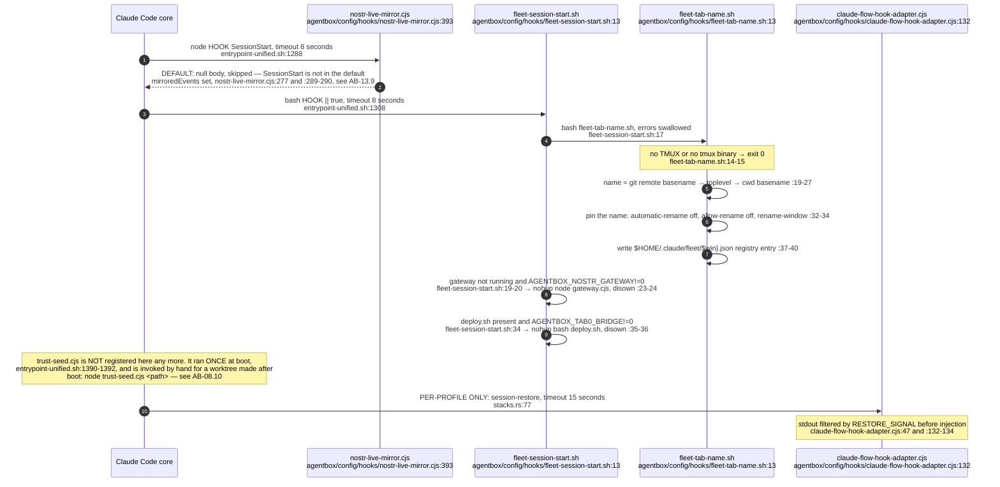
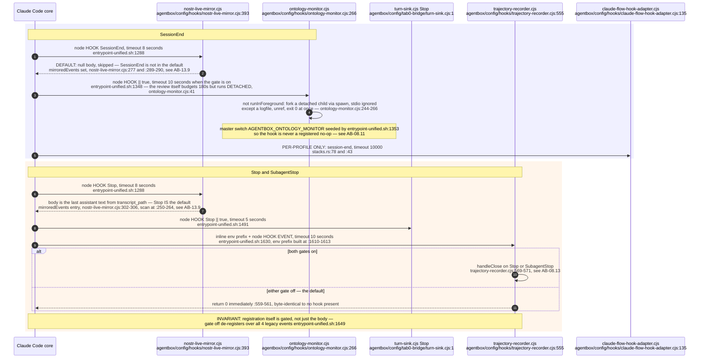
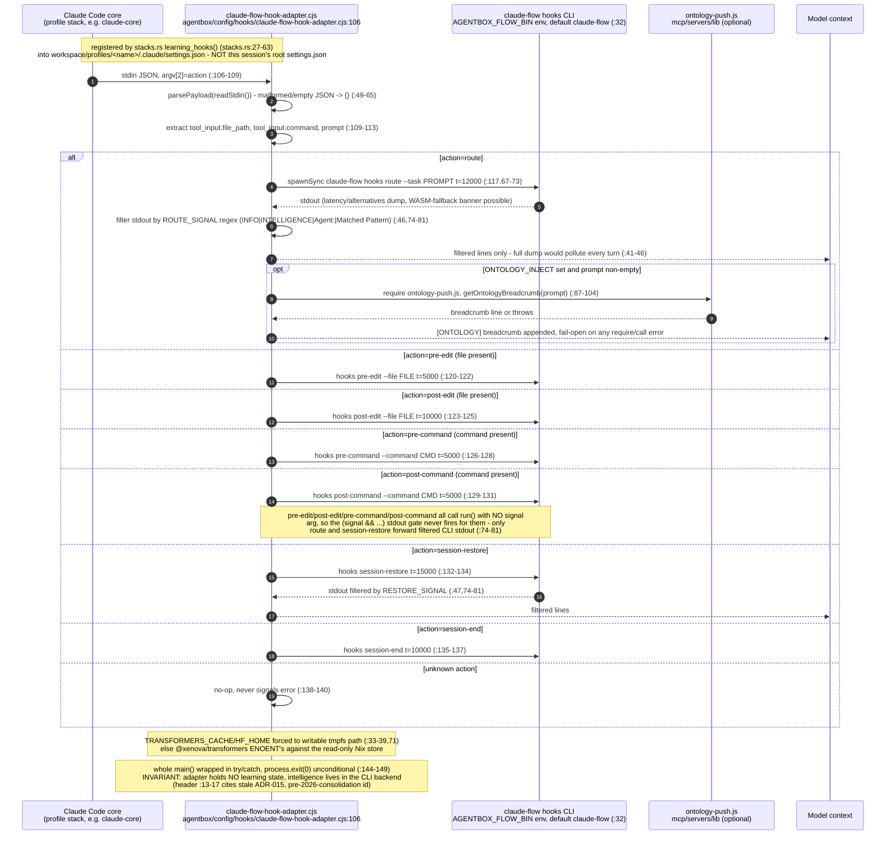
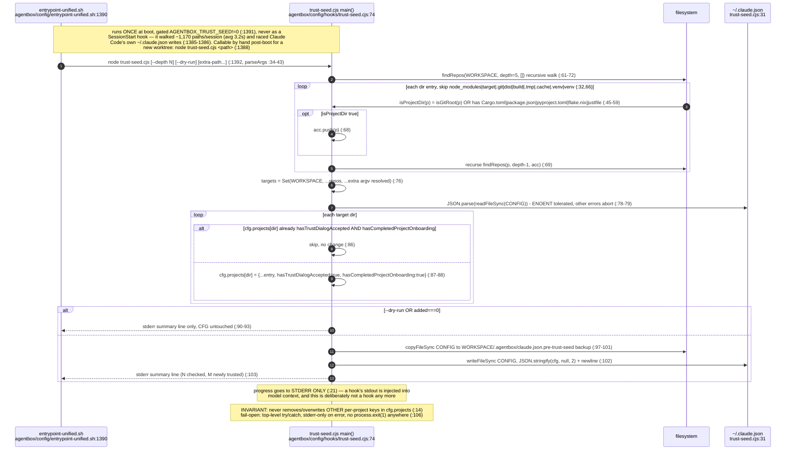
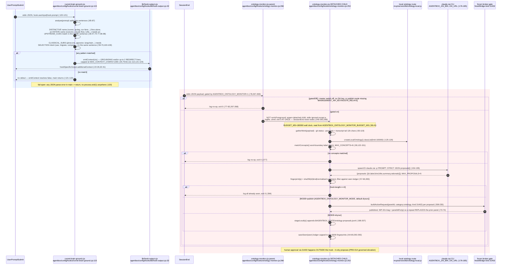
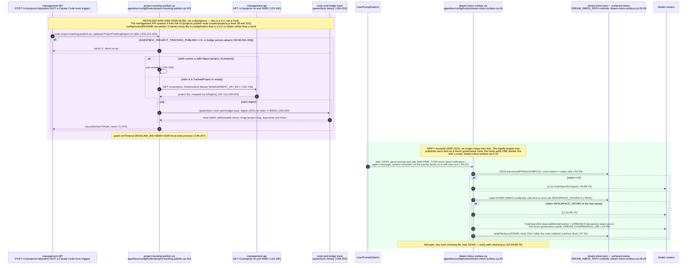
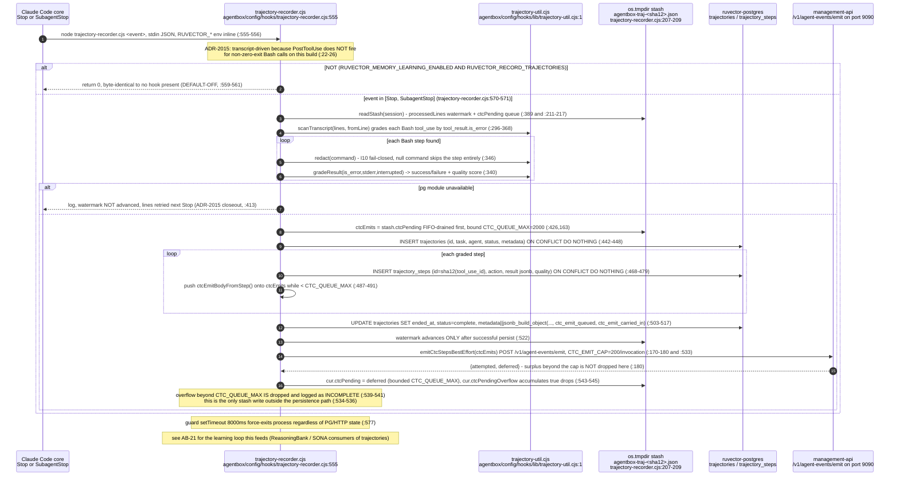
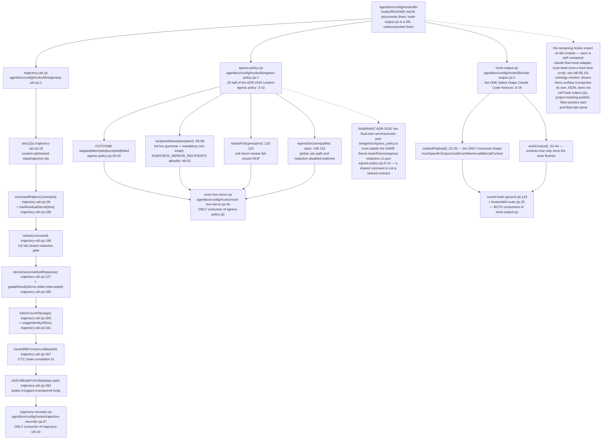
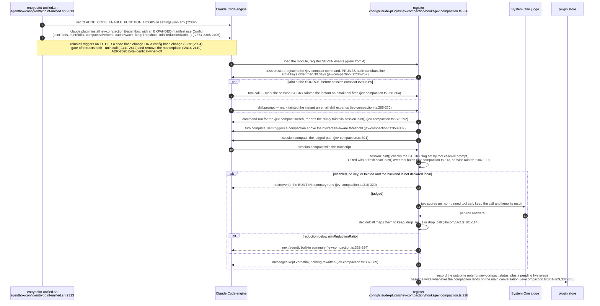

Registration ground truth (2026-09-29): `~/.claude/settings.json` is boot-generated and never tracked, so AB-08.1–AB-08.7
cite the sites that WRITE it — `config/entrypoint-unified.sh` for the root session and
`services/agentbox-manifest/src/stacks.rs` `learning_hooks#40;#41;` for per-profile stacks — the split `config/hooks/README.md` owns. All hook `timeout` values are now SECONDS, not
milliseconds (`services/agentbox-manifest/src/stacks.rs:29-30`); a bare `UserPromptSubmit` → `route` per-profile hook no
longer exists (ADR-2091 consolidated per-turn routing into `skill-route.cjs`, see AB-08.5).

## AB-08.1 Root-session registration — what entrypoint-unified.sh seeds into ~/.claude/settings.json

```mermaid
flowchart TB
    S["settings path resolved once, CLAUDE_CONFIG_DIR<br/>fallback /home/devuser/.claude/settings.json<br/>entrypoint-unified.sh:1273"]
    subgraph MIR["nostr-live-mirror.cjs — always registered, defaults to Stop only"]
    direction TB
    M1["block entrypoint-unified.sh:1273, baked /opt hook path :1274"]
    M2["entrypoint-unified.sh:1281 events SessionStart, UserPromptSubmit, Stop, SessionEnd<br/>idempotent marker test on the command string :1285"]
    M3["entrypoint-unified.sh:1288 push node HOOK EVENT, timeout 8 SECONDS<br/>each event registered, but bodyForEvent skips any event outside<br/>AGENTBOX_LIVE_MIRROR_EVENTS (default Stop only) nostr-live-mirror.cjs:277-278"]
    M1 --> M2 --> M3
    end
    subgraph FLT["fleet-session-start.sh — SessionStart"]
    direction TB
    F1["block entrypoint-unified.sh:1299, baked hook path :1299<br/>off switch AGENTBOX_NOSTR_GATEWAY=0 gates the gateway launch inside the script, not registration"]
    F2["entrypoint-unified.sh:1307 marker test, :1308 push timeout 8 seconds"]
    F1 --> F2
    end
    subgraph ONT["ontology-monitor.cjs — SessionEnd, gated, detached"]
    direction TB
    O1["entrypoint-unified.sh:1322 gate read via agentbox-manifest toml-bool<br/>defaults to 0 on any read failure"]
    O2["entrypoint-unified.sh:1348 ON: push timeout 10 seconds (hook returns at once,<br/>a detached child does the 180s review) AND seed env AGENTBOX_ONTOLOGY_MONITOR=1 :1353"]
    O3["entrypoint-unified.sh:1357-1361 OFF: filter the hook back out<br/>delete the emptied SessionEnd array :1361<br/>INVARIANT ADR-2020 byte-identical-when-off"]
    O4["gate source agentbox.toml:116-117 enabled = true"]
    O1 --> O2
    O1 --> O3
    O1 --> O4
    end
    subgraph TRU["trust-seed.cjs — boot-time run ONLY, no longer a hook"]
    direction TB
    T1["entrypoint-unified.sh:1390 hook path, :1391 gate AGENTBOX_TRUST_SEED != 0<br/>DELIBERATELY not a SessionStart hook: walked ~1,170 paths/session (avg 3.2s),<br/>raced Claude Code's own ~/.claude.json writes"]
    T2["entrypoint-unified.sh:1392 node trust-seed.cjs, output to stderr<br/>callable by hand for a post-boot worktree: node trust-seed.cjs #60;path#62;"]
    T1 --> T2
    end
    subgraph TRJ["trajectory-recorder.cjs — Stop and SubagentStop, gated"]
    direction TB
    J1["block entrypoint-unified.sh:1597, hook path :1597<br/>gate: BOTH memory_learning flags checked before the block runs"]
    J2["entrypoint-unified.sh:1619 specs = Stop, SubagentStop ONLY<br/>reconcile strips prior wiring over 4 legacy events :1622-1625<br/>then push timeout 10 seconds behind an inline env prefix :1626-1631"]
    J3["entrypoint-unified.sh:1649 gate off: strip over the same 4 events<br/>:1649 keep-filter, :1652 log the de-registration"]
    J4["gate source agentbox.toml:451-452 enabled + record_trajectories"]
    J1 --> J2
    J1 --> J3
    J1 --> J4
    end
    subgraph OTH["turn-sink, dream-inbox, ruvnet-brain"]
    direction TB
    X1["entrypoint-unified.sh:1480 tab0-bridge turn-sink.cjs deployed path<br/>:1488 events UserPromptSubmit and Stop, :1491 timeout 5 seconds"]
    X2["entrypoint-unified.sh:1662 dream-inbox-surface.cjs, live-checkout fallback :1663<br/>gate DREAM_INBOX_HOOK :1664, UserPromptSubmit timeout 5 seconds :1678"]
    X3["entrypoint-unified.sh:2077 ruvnet-brain-ground.cjs<br/>gate RUVNET_BRAIN_GROUNDING_HOOK :2078, timeout 5 seconds :2091"]
    X4["gate source agentbox.toml:795 grounding_hook = true"]
    X1 --> X2 --> X3 --> X4
    end
    subgraph SHM["hook shim reconcile — ADR-2034 §1"]
    direction TB
    H1["entrypoint-unified.sh:1405 block, gate AGENTBOX_HOOK_SHIM"]
    H2["entrypoint-unified.sh:1406 agentbox-hook reconcile --root WORKSPACE --depth 2<br/>rewrites per-project ruflo CLI hooks to the resident shim"]
    H1 --> H2
    end
    S --> MIR --> FLT --> ONT --> TRU --> TRJ --> OTH --> SHM
```

## AB-08.2 Per-profile registration — stacks.rs learning_hooks, and what is NOT a hook

```mermaid
flowchart TB
    subgraph PP["workspace/profiles/#60;stack#62;/.claude/settings.json"]
    direction TB
    P0["build_profile writes hooks: learning_hooks#40;env, gates#41;<br/>stacks.rs:229, fn at :34"]
    P1["every entry is node ADAPTER action #124;#124; true<br/>stacks.rs:38, timeouts are SECONDS :29-30"]
    P2["PreToolUse stacks.rs:69<br/>Bash → pre-command t=5 :70<br/>Write#124;Edit#124;MultiEdit → pre-edit t=5 :71"]
    P3["PostToolUse :73<br/>Write#124;Edit#124;MultiEdit → post-edit t=10 :74<br/>Bash → post-command t=5 :75"]
    P4["SessionStart → session-restore t=15 :77<br/>NO UserPromptSubmit entry: the per-profile route hook<br/>is RETIRED, comment stacks.rs:31-33, test :390-391"]
    P5["SessionEnd :78 = session-end t=10 :43<br/>+ nostr summary hook when mobile_bridge, DETACHED via setsid :44-56<br/>+ ontology-monitor when ontology_monitor, also DETACHED t=10 :58-65"]
    P0 --> P1 --> P2 --> P3 --> P4 --> P5
    end
    subgraph NOT["NOT hooks — hooks/README.md"]
    direction TB
    N1["project-tracking-publish.cjs — a CLI the management API spawns<br/>from POST /v1/projects/:id/publish, reads a digest on stdin<br/>hooks/README.md:63, see AB-08.12"]
    N2["fleet-tab-name.sh — shelled by fleet-session-start.sh:17<br/>hooks/README.md:64"]
    N3["lib/egress-policy.cjs, lib/trajectory-util.cjs, lib/skill-route.cjs — required<br/>libraries, skill-route.cjs shared with the /route CLI<br/>hooks/README.md:66, see AB-08.14. DOC-DRIFT: lib/hook-output.cjs, the new<br/>shared stdout-shape helper, is not yet listed here"]
    N1 --> N2 --> N3
    end
    subgraph INV["invariants and divergences"]
    direction TB
    I1["INVARIANT: claude-flow-hook-adapter.cjs is wired ONLY per-profile<br/>stacks.rs:229 — never into the root settings.json"]
    I2["INVARIANT ADR-2068: the root ontology gap is closed —<br/>entrypoint-unified.sh:1348 registers and :1357-1361 retracts,<br/>so the off state leaves no trace"]
    I3["INVARIANT: a new hook is not wired by dropping a file in config/hooks/ —<br/>register it in the site that owns its session class<br/>hooks/README.md:93-96"]
    I1 --> I2 --> I3
    end
    PP --> NOT --> INV
```

## AB-08.5 UserPromptSubmit — five root hooks; the per-profile route hook no longer exists

```mermaid
sequenceDiagram
    autonumber
    participant U as User turn
    participant NM as nostr-live-mirror.cjs<br/>agentbox/config/hooks/nostr-live-mirror.cjs:393
    participant RBG as ruvnet-brain-ground.cjs<br/>agentbox/config/hooks/ruvnet-brain-ground.cjs:115
    participant TS as turn-sink.cjs<br/>agentbox/config/tab0-bridge/turn-sink.cjs:1
    participant DI as dream-inbox-surface.cjs<br/>agentbox/config/hooks/dream-inbox-surface.cjs:34
    participant SR as main<br/>agentbox/config/hooks/skill-route.cjs:27
    participant M as Model context

    Note over U,M: root registrations: entrypoint-unified.sh:1281 mirror, :1488 turn-sink,<br/>:1664 dream-inbox, :2078 brain-ground, :2163 skill-route — five on this one event.<br/>INVARIANT: stacks.rs no longer registers a per-profile UserPromptSubmit hook at all<br/>(stacks.rs:31-33, test :390-391) — skill-route.cjs is the sole per-turn router (ADR-2091)
    U->>NM: node HOOK UserPromptSubmit, timeout 8 seconds<br/>entrypoint-unified.sh:1288
    NM->>NM: bodyForEvent#40;#41; checks mirroredEvents#40;#41; first, returns null if not listed<br/>nostr-live-mirror.cjs:289-290
    NM-->>U: DEFAULT: null body on UserPromptSubmit, egress skipped — only Stop is<br/>mirrored by default, DEFAULT_MIRROR_EVENTS :277, widen via AGENTBOX_LIVE_MIRROR_EVENTS :278-282, see AB-13.9
    par independent root groups, unordered wrt each other
        U->>RBG: node HOOK #124;#124; true, timeout 5 seconds<br/>entrypoint-unified.sh:2091
        RBG->>RBG: analyse#40;prompt#41;: DISTINCTIVE name fires alone,<br/>an ESTATE name needs an upstream-intent cue in the SAME sentence<br/>ruvnet-brain-ground.cjs:90-98
        RBG->>RBG: CLASSICAL_SUBS match needs selection intent in the same sentence<br/>ruvnet-brain-ground.cjs:100-109
        RBG-->>M: emitContext via lib/hook-output.cjs, or nothing<br/>ruvnet-brain-ground.cjs:121-124, see AB-08.11
    and
        U->>TS: node HOOK UserPromptSubmit #124;#124; true, timeout 5 seconds<br/>entrypoint-unified.sh:1491
        Note over TS: the sink is deployed to the workspace copy, not the baked one<br/>entrypoint-unified.sh:1480 — see AB-12 for the bridge itself
    and
        U->>SR: ADR-2091 gate inlined as AGENTBOX_SKILL_ROUTER=jev<br/>entrypoint-unified.sh:2163, timeout = max#40;8, ceil#40;2 times judge_ms / 1000#41;#41; :2200-2201
        SR->>SR: lib.route#40;prompt, cfg#41;: one Choice over every routable skill<br/>hooks/skill-route.cjs:35 via lib/skill-route.cjs
        SR-->>M: emitContext#40;lib.formatContext#40;r, cfg#41;#41; via lib/hook-output.cjs, or nothing<br/>hooks/skill-route.cjs:40
        Note over SR: INVARIANT fail-open - any error, timeout, 429/529 or a none pick<br/>returns without injection, hooks/skill-route.cjs:18 and hooks/skill-route.cjs:43
    and
        U->>DI: node HOOK #124;#124; true, timeout 5 seconds<br/>entrypoint-unified.sh:1678
        DI->>DI: skip machine-generated turns #40;task-notification, agent-message,<br/>system-reminder#41;, then count OPEN items and rate-limit via a sidecar<br/>stamp file, dream-inbox-surface.cjs:40-51
        DI-->>M: hookSpecificOutput.additionalContext = one-line pointer at the forum<br/>governance panel #40;ADR-2115#41;, or #123;#125;, dream-inbox-surface.cjs:52-61, see AB-08.12
    end
```

## AB-08.6 SessionStart — mirror, fleet tab, and the per-profile restore; trust-seed is boot-only now

```mermaid
sequenceDiagram
    autonumber
    participant CC as Claude Code core
    participant NM as nostr-live-mirror.cjs<br/>agentbox/config/hooks/nostr-live-mirror.cjs:393
    participant FS as fleet-session-start.sh<br/>agentbox/config/hooks/fleet-session-start.sh:13
    participant FTN as fleet-tab-name.sh<br/>agentbox/config/hooks/fleet-tab-name.sh:13
    participant AD as claude-flow-hook-adapter.cjs<br/>agentbox/config/hooks/claude-flow-hook-adapter.cjs:132

    CC->>NM: node HOOK SessionStart, timeout 8 seconds<br/>entrypoint-unified.sh:1288
    NM-->>CC: DEFAULT: null body, skipped — SessionStart is not in the default<br/>mirroredEvents set, nostr-live-mirror.cjs:277 and :289-290, see AB-13.9
    CC->>FS: bash HOOK #124;#124; true, timeout 8 seconds<br/>entrypoint-unified.sh:1308
    FS->>FTN: bash fleet-tab-name.sh, errors swallowed<br/>fleet-session-start.sh:17
    Note over FTN: no TMUX or no tmux binary → exit 0<br/>fleet-tab-name.sh:14-15
    FTN->>FTN: name = git remote basename → toplevel → cwd basename :19-27
    FTN->>FTN: pin the name: automatic-rename off, allow-rename off, rename-window :32-34
    FTN->>FTN: write $HOME/.claude/fleet/#36;win#125;.json registry entry :37-40
    FS->>FS: gateway not running and AGENTBOX_NOSTR_GATEWAY!=0<br/>fleet-session-start.sh:19-20 → nohup node gateway.cjs, disown :23-24
    FS->>FS: deploy.sh present and AGENTBOX_TAB0_BRIDGE!=0<br/>fleet-session-start.sh:34 → nohup bash deploy.sh, disown :35-36
    Note over CC: trust-seed.cjs is NOT registered here any more. It ran ONCE at boot,<br/>entrypoint-unified.sh:1390-1392, and is invoked by hand for a worktree made after<br/>boot: node trust-seed.cjs #60;path#62; — see AB-08.10
    CC->>AD: PER-PROFILE ONLY: session-restore, timeout 15 seconds<br/>stacks.rs:77
    Note over AD: stdout filtered by RESTORE_SIGNAL before injection<br/>claude-flow-hook-adapter.cjs:47 and :132-134
```

## AB-08.7 SessionEnd, Stop and SubagentStop — consolidation, mirror, detached ontology, trajectory close

```mermaid
sequenceDiagram
    autonumber
    participant CC as Claude Code core
    participant NM as nostr-live-mirror.cjs<br/>agentbox/config/hooks/nostr-live-mirror.cjs:393
    participant OM as ontology-monitor.cjs<br/>agentbox/config/hooks/ontology-monitor.cjs:266
    participant TS as turn-sink.cjs Stop<br/>agentbox/config/tab0-bridge/turn-sink.cjs:1
    participant TR as trajectory-recorder.cjs<br/>agentbox/config/hooks/trajectory-recorder.cjs:555
    participant AD as claude-flow-hook-adapter.cjs<br/>agentbox/config/hooks/claude-flow-hook-adapter.cjs:135

    rect rgb(240,240,255)
    Note over CC,OM: SessionEnd
    CC->>NM: node HOOK SessionEnd, timeout 8 seconds<br/>entrypoint-unified.sh:1288
    NM-->>CC: DEFAULT: null body, skipped — SessionEnd is not in the default<br/>mirroredEvents set, nostr-live-mirror.cjs:277 and :289-290, see AB-13.9
    CC->>OM: node HOOK #124;#124; true, timeout 10 seconds when the gate is on<br/>entrypoint-unified.sh:1348 — the review itself budgets 180s but runs DETACHED,<br/>ontology-monitor.cjs:41
    OM->>OM: not runInForeground: fork a detached child via spawn, stdio ignored<br/>except a logfile, unref, exit 0 at once — ontology-monitor.cjs:244-266
    Note over OM: master switch AGENTBOX_ONTOLOGY_MONITOR seeded by entrypoint-unified.sh:1353<br/>so the hook is never a registered no-op — see AB-08.11
    CC->>AD: PER-PROFILE ONLY: session-end, timeout 10000<br/>stacks.rs:78 and :43
    end
    rect rgb(255,245,235)
    Note over CC,TR: Stop and SubagentStop
    CC->>NM: node HOOK Stop, timeout 8 seconds<br/>entrypoint-unified.sh:1288
    NM-->>CC: body is the last assistant text from transcript_path — Stop IS the default<br/>mirroredEvents entry, nostr-live-mirror.cjs:302-306, scan at :250-264, see AB-13.9
    CC->>TS: node HOOK Stop #124;#124; true, timeout 5 seconds<br/>entrypoint-unified.sh:1491
    CC->>TR: inline env prefix + node HOOK EVENT, timeout 10 seconds<br/>entrypoint-unified.sh:1630, env prefix built at :1610-1613
    alt both gates on
        TR->>TR: handleClose on Stop or SubagentStop<br/>trajectory-recorder.cjs:569-571, see AB-08.13
    else either gate off — the default
        TR-->>CC: return 0 immediately :559-561, byte-identical to no hook present
    end
    Note over CC,TR: INVARIANT: registration itself is gated, not just the body —<br/>gate off de-registers over all 4 legacy events entrypoint-unified.sh:1649
    end
```

## AB-08.8 claude-flow-hook-adapter.cjs — stdin-to-CLI translation (per-profile stacks only)

```mermaid
sequenceDiagram
    autonumber
    participant CC as Claude Code core<br/>#40;profile stack, e.g. claude-core#41;
    participant AD as claude-flow-hook-adapter.cjs<br/>agentbox/config/hooks/claude-flow-hook-adapter.cjs:106
    participant CLI as claude-flow hooks CLI<br/>AGENTBOX_FLOW_BIN env, default claude-flow (:32)
    participant OP as ontology-push.js<br/>mcp/servers/lib #40;optional#41;
    participant M as Model context

    Note over CC,AD: registered by stacks.rs learning_hooks#40;#41; #40;stacks.rs:27-63#41;<br/>into workspace/profiles/#60;name#62;/.claude/settings.json - NOT this session's root settings.json
    CC->>AD: stdin JSON, argv[2]=action (:106-109)
    AD->>AD: parsePayload#40;readStdin#40;#41;#41; - malformed/empty JSON -#62; #123;#125; (:49-65)
    AD->>AD: extract tool_input.file_path, tool_input.command, prompt (:109-113)
    alt action=route
        AD->>CLI: spawnSync claude-flow hooks route --task PROMPT t=12000 (:117,67-73)
        CLI-->>AD: stdout #40;latency/alternatives dump, WASM-fallback banner possible#41;
        AD->>AD: filter stdout by ROUTE_SIGNAL regex #40;INFO#124;INTELLIGENCE#124;Agent:#124;Matched Pattern#41; (:46,74-81)
        AD-->>M: filtered lines only - full dump would pollute every turn (:41-46)
        opt ONTOLOGY_INJECT set and prompt non-empty
            AD->>OP: require ontology-push.js, getOntologyBreadcrumb#40;prompt#41; (:87-104)
            OP-->>AD: breadcrumb line or throws
            AD-->>M: #91;ONTOLOGY#93; breadcrumb appended, fail-open on any require/call error
        end
    else action=pre-edit #40;file present#41;
        AD->>CLI: hooks pre-edit --file FILE t=5000 (:120-122)
    else action=post-edit #40;file present#41;
        AD->>CLI: hooks post-edit --file FILE t=10000 (:123-125)
    else action=pre-command #40;command present#41;
        AD->>CLI: hooks pre-command --command CMD t=5000 (:126-128)
    else action=post-command #40;command present#41;
        AD->>CLI: hooks post-command --command CMD t=5000 (:129-131)
        Note over AD,CLI: pre-edit/post-edit/pre-command/post-command all call run#40;#41; with NO signal<br/>arg, so the #40;signal && ...#41; stdout gate never fires for them - only<br/>route and session-restore forward filtered CLI stdout (:74-81)
    else action=session-restore
        AD->>CLI: hooks session-restore t=15000 (:132-134)
        CLI-->>AD: stdout filtered by RESTORE_SIGNAL (:47,74-81)
        AD-->>M: filtered lines
    else action=session-end
        AD->>CLI: hooks session-end t=10000 (:135-137)
    else unknown action
        AD->>AD: no-op, never signals error (:138-140)
    end
    Note over AD: TRANSFORMERS_CACHE/HF_HOME forced to writable tmpfs path (:33-39,71)<br/>else @xenova/transformers ENOENT#39;s against the read-only Nix store
    Note over AD: whole main#40;#41; wrapped in try/catch, process.exit#40;0#41; unconditional (:144-149)<br/>INVARIANT: adapter holds NO learning state, intelligence lives in the CLI backend<br/>#40;header :13-17 cites stale ADR-015, pre-2026-consolidation id#41;
```
## AB-08.10 trust-seed.cjs — a BOOT-TIME script now, not a hook; folder-trust and worktree discovery

```mermaid
sequenceDiagram
    autonumber
    participant EP as entrypoint-unified.sh<br/>agentbox/config/entrypoint-unified.sh:1390
    participant TSD as trust-seed.cjs main#40;#41;<br/>agentbox/config/hooks/trust-seed.cjs:74
    participant FS as filesystem
    participant CFG as ~/.claude.json<br/>trust-seed.cjs:31

    Note over EP,TSD: runs ONCE at boot, gated AGENTBOX_TRUST_SEED!=0 (:1391), never as a<br/>SessionStart hook — it walked ~1,170 paths/session (avg 3.2s) and raced Claude<br/>Code's own ~/.claude.json writes (:1385-1386). Callable by hand post-boot for a<br/>new worktree: node trust-seed.cjs #60;path#62; (:1388)
    EP->>TSD: node trust-seed.cjs #91;--depth N#93; #91;--dry-run#93; #91;extra-path...#93; (:1392, parseArgs :34-43)
    TSD->>FS: findRepos#40;WORKSPACE, depth=5, #91;#93;#41; recursive walk (:61-72)
    loop each dir entry, skip node_modules#124;target#124;.git#124;dist#124;build#124;.tmp#124;.cache#124;.venv#124;venv (:32,66)
        FS->>TSD: isProjectDir#40;p#41; = isGitRoot#40;p#41; OR has Cargo.toml#124;package.json#124;pyproject.toml#124;flake.nix#124;justfile (:45-59)
        opt isProjectDir true
            TSD->>TSD: acc.push#40;p#41; (:68)
        end
        TSD->>FS: recurse findRepos#40;p, depth-1, acc#41; (:69)
    end
    TSD->>TSD: targets = Set#40;WORKSPACE, ...repos, ...extra argv resolved#41; (:76)
    TSD->>CFG: JSON.parse#40;readFileSync#40;CONFIG#41;#41; - ENOENT tolerated, other errors abort (:78-79)
    loop each target dir
        alt cfg.projects#91;dir#93; already hasTrustDialogAccepted AND hasCompletedProjectOnboarding
            TSD->>TSD: skip, no change (:86)
        else
            TSD->>TSD: cfg.projects#91;dir#93; = #123;...entry, hasTrustDialogAccepted:true, hasCompletedProjectOnboarding:true#125; (:87-88)
        end
    end
    alt --dry-run OR added===0
        TSD-->>EP: stderr summary line only, CFG untouched (:90-93)
    else
        TSD->>FS: copyFileSync CONFIG to WORKSPACE/.agentbox/claude.json.pre-trust-seed backup (:97-101)
        TSD->>CFG: writeFileSync CONFIG, JSON.stringify#40;cfg, null, 2#41; #43; newline (:102)
        TSD-->>EP: stderr summary line #40;N checked, M newly trusted#41; (:103)
    end
    Note over TSD: progress goes to STDERR ONLY (:21) — a hook's stdout is injected into<br/>model context, and this is deliberately not a hook any more
    Note over TSD: INVARIANT: never removes/overwrites OTHER per-project keys in cfg.projects (:14)<br/>fail-open: top-level try/catch, stderr-only on error, no process.exit#40;1#41; anywhere (:106)
```
## AB-08.11 ruvnet-brain-ground.cjs (rewritten trigger logic) and ontology-monitor.cjs (now detached)

```mermaid
sequenceDiagram
    autonumber
    participant U as UserPromptSubmit
    participant RBG as ruvnet-brain-ground.cjs<br/>agentbox/config/hooks/ruvnet-brain-ground.cjs:115
    participant HO as lib/hook-output.cjs<br/>agentbox/config/hooks/lib/hook-output.cjs:32
    participant SE as SessionEnd
    participant OMP as ontology-monitor.cjs parent<br/>agentbox/config/hooks/ontology-monitor.cjs:266
    participant OMC as ontology-monitor.cjs DETACHED CHILD<br/>agentbox/config/hooks/ontology-monitor.cjs:253
    participant ONT as local ontology route<br/>mcp/servers/lib/ontology-local.js
    participant ZAI as claude-zai CLI<br/>AGENTBOX_ZAI_BIN, ZAI_URL (:176-185)
    participant FB as forum broker gate<br/>NostrBridge kind 31402

    rect rgb(235,245,255)
    U->>RBG: stdin JSON, hook.userInput#124;hook.prompt (:120-121)
    RBG->>RBG: analyse#40;prompt#41; splits into sentences (:85-87)
    RBG->>RBG: DISTINCTIVE name #40;ruvnet, qudag, ruv-fann...#41; fires alone,<br/>an ESTATE name #40;ruvector, claude-flow, ruflo...#41; needs an<br/>UPSTREAM_CUES match in the SAME sentence (:36-47,74-77,96-98)
    RBG->>RBG: CLASSICAL_SUBS #40;pinecone, pgvector, langchain...#41; needs<br/>SELECTION intent #40;use, migrate, compare...#41; in the same sentence (:59-70,100-109)
    alt any pattern matched
        RBG->>HO: emitContext#40;ctx#41; — GROUNDING and/or up to 2 REDIRECT lines,<br/>capped at MAX_CONTEXT_CHARS=1200 (:34,79-82,111-112,121-124)
        HO-->>U: hookSpecificOutput.additionalContext (:22-26,32-41)
    else no match
        RBG-->>U: no stdout — emitContext resolves false, main returns (:121-122)
    end
    Note over RBG: fail-open: any JSON.parse error in main -#62; return, no process.exit#40;1#41; anywhere (:120)
    end
    rect rgb(255,240,240)
    SE->>OMP: stdin JSON payload, gated by AGENTBOX_ONTOLOGY_MONITOR=1 (:78,267-269)
    alt gatedOff#40;#41;: master switch off, no ZAI key, or publish mode missing<br/>MANAGEMENT_API_KEY/NOSTR_RELAYS
        OMP-->>SE: log no-op, exit 0 (:77-82,267-268)
    else gated on
        OMP->>OMC: NOT runInForeground: spawn detached child, stdio ignored except a<br/>logfile, unref, exit 0 AT ONCE — SessionEnd never waits (:240-263,269)
        Note over OMC: BUDGET_MS=180000 wall clock, read from AGENTBOX_ONTOLOGY_MONITOR_BUDGET_MS (:38,41)
        OMC->>OMC: gatherWork#40;payload#41; - git status --porcelain + transcript tail 12k chars (:93-119)
        OMC->>ONT: createLocalOntology#40;#41;.classList#40;limit:100000#41; (:125-129)
        OMC->>OMC: matchConcepts#40;#41; word-boundary label match, MAX_CONCEPTS=8 (:39,122-151)
        alt no concepts matched
            OMC-->>SE: log no-op, exit 0 (:277)
        else
            OMC->>ZAI: spawnCli claude-zai -p PROMPT, STRICT JSON proposals#91;#93; (:154-195)
            ZAI-->>OMC: #123;proposals: #91;#123;iri,label,kind,title,summary,rationale#125;#93;#125;, MAX_PROPOSALS=5
            OMC->>OMC: fingerprint#40;p#41; = sha256#40;iri#124;kind#124;normalised summary#41;, filter against seen ledger (:57-60,283)
            alt fresh.length===0
                OMC-->>SE: log all already seen, exit 0 (:284)
            else MODE=publish #40;AGENTBOX_ONTOLOGY_MONITOR_MODE, default dryrun#41;
                OMC->>FB: buildActionRequest#40;panelId, category:ontology, kind 31402#41; per proposal (:208-235)
                FB-->>OMC: published, NIP-33 d-tag = panelIdFor#40;p#41; so a repeat REPLACES the prior panel (:70-74)
            else MODE=dryrun
                OMC->>OMC: stageLocally#40;#41; appends $AGENTBOX_STATE/ontology-proposals.jsonl (:198-207)
            end
            OMC->>OMC: saveSeen#40;seen#41; ledger capped to last 5000 fingerprints (:64-69,292-293)
        end
    end
    Note over OMC: human approval via 31403 happens OUTSIDE this hook - it only proposes #40;PRD-014 governed elevation#41;
    end
```
## AB-08.12 project-tracking-publish.cjs and dream-inbox-surface.cjs — DREAM-2115: a reminder pointer, not a relay

```mermaid
sequenceDiagram
    autonumber
    participant CALLER as management API<br/>POST /v1/projects/:id/publish #40;NOT a Claude Code hook trigger#41;
    participant PTP as project-tracking-publish.cjs<br/>agentbox/config/hooks/project-tracking-publish.cjs:202
    participant MAPI as management-api<br/>GET /v1/projects on port 9090 (:133-180)
    participant NPB as nostr-pod-bridge track<br/>spawnSync binary (:184-200)
    participant U as UserPromptSubmit
    participant DI as dream-inbox-surface.cjs<br/>agentbox/config/hooks/dream-inbox-surface.cjs:34
    participant INBOX as dream-inbox.json #43; .surfaced stamp<br/>DREAM_INBOX_PATH override, dream-inbox-surface.cjs:28-29
    participant M as Model context

    rect rgb(245,235,255)
    Note over CALLER,NPB: RESOLVED ADR-2068 #40;2026-09-05#41;: not a divergence — this is a CLI, not a hook.<br/>The management API spawns it from the /v1/projects publish route #40;routes/projects.js lines 28 and 322#41;.<br/>config/hooks/README.md section 3 names every file in config/hooks/ that is a CLI or helper rather than a hook
    CALLER->>PTP: node project-tracking-publish.cjs, optional ProjectTrackingDigest on stdin (:202,210-225)
    alt AGENTBOX_PROJECT_TRACKING_PUBLISH===0, or bridge secrets absent (:60-66,204-206)
        PTP-->>CALLER: return 0, silent no-op
    else
        alt stdin carries a valid digest #40;project_id present#41;
            PTP->>PTP: use verbatim (:215-216)
        else stdin is a TrackedProject or empty
            PTP->>MAPI: GET /v1/projects, Authorization Bearer MANAGEMENT_API_KEY (:135-146)
            MAPI-->>PTP: project list, mapped via toDigest#40;#41; (:92-110,228-233)
        end
        loop each digest
            PTP->>NPB: spawnSync nostr-pod-bridge track, digest JSON on stdin, t=30000 (:183-200)
            NPB-->>PTP: kind-30841 addressable event, d-tag=project slug, dual-write pod inbox
        end
        PTP-->>CALLER: log published N/total, return 0 (:241)
    end
    Note over PTP: guard setTimeout DEADLINE_MS=30000#43;1500 force-exits process (:246-247)
    end
    rect rgb(235,255,240)
    Note over DI: DRIFT resolved #40;ADR-2115#41;: no longer relays item text. The nightly engine now<br/>publishes each item as a forum governance case, this hook adds ONE pointer line<br/>with a count, dream-inbox-surface.cjs:2-10
    U->>DI: stdin JSON, parse prompt and skip MACHINE_TURN turns #40;task-notification,<br/>agent-message, system-reminder#41; so the pointer lands on a real user turn (:40-42)
    DI->>INBOX: JSON.parse#40;readFileSync#40;INBOX#41;#41;, count status===open only #40;:43-46#41;
    alt open===0
        DI-->>M: #123;#125; #40;no hookSpecificOutput#41; (:46,68-70)
    else
        DI->>INBOX: read STAMP #40;INBOX.surfaced#41;, rate-limit to once per RESURFACE_HOURS=4 (:48-51)
        alt within RESURFACE_HOURS of the last stamp
            DI-->>M: #123;#125; (:51,68-70)
        else
            DI-->>M: hookSpecificOutput.additionalContext = #91;DREAM#93; N decision#40;s#41; await you in<br/>the forum governance panel, DREAM_GOVERNANCE_URL (:52-56)
            DI->>INBOX: writeFileSync#40;STAMP, now#41; ONLY after the write callback confirms flush (:57-61)
        end
    end
    Note over DI: fail-open: any error #40;missing file, bad JSON#41; -#62; exit#40;#41; path returning #123;#125; (:62-64,68-70)
    end
```
## AB-08.13 trajectory-recorder.cjs — Stop/SubagentStop boundary

```mermaid
sequenceDiagram
    autonumber
    participant CC as Claude Code core<br/>Stop or SubagentStop
    participant TR as trajectory-recorder.cjs<br/>agentbox/config/hooks/trajectory-recorder.cjs:555
    participant UT as trajectory-util.cjs<br/>agentbox/config/hooks/lib/trajectory-util.cjs:1
    participant STASH as os.tmpdir stash<br/>agentbox-traj-#60;sha12#62;.json<br/>trajectory-recorder.cjs:207-209
    participant PG as ruvector-postgres<br/>trajectories / trajectory_steps
    participant MAPI as management-api<br/>/v1/agent-events/emit on port 9090

    CC->>TR: node trajectory-recorder.cjs #60;event#62;, stdin JSON, RUVECTOR_* env inline (:555-556)
    Note over TR: ADR-2015: transcript-driven because PostToolUse does NOT fire<br/>for non-zero-exit Bash calls on this build (:22-26)
    alt NOT #40;RUVECTOR_MEMORY_LEARNING_ENABLED AND RUVECTOR_RECORD_TRAJECTORIES#41;
        TR-->>CC: return 0, byte-identical to no hook present #40;DEFAULT-OFF, :559-561#41;
    else event in #91;Stop, SubagentStop#93; (trajectory-recorder.cjs:570-571)
        TR->>STASH: readStash#40;session#41; - processedLines watermark #43; ctcPending queue (:389 and :211-217)
        TR->>UT: scanTranscript#40;lines, fromLine#41; grades each Bash tool_use by tool_result.is_error (:296-368)
        loop each Bash step found
            TR->>UT: redact#40;command#41; - I10 fail-closed, null command skips the step entirely (:346)
            TR->>UT: gradeResult#40;is_error,stderr,interrupted#41; -#62; success/failure + quality score (:340)
        end
        alt pg module unavailable
            TR-->>CC: log, watermark NOT advanced, lines retried next Stop #40;ADR-2015 closeout, :413#41;
        else
            TR->>STASH: ctcEmits = stash.ctcPending FIFO-drained first, bound CTC_QUEUE_MAX=2000 (:426,163)
            TR->>PG: INSERT trajectories #40;id, task, agent, status, metadata#41; ON CONFLICT DO NOTHING (:442-448)
            loop each graded step
                TR->>PG: INSERT trajectory_steps #40;id=sha12#40;tool_use_id#41;, action, result jsonb, quality#41; ON CONFLICT DO NOTHING (:468-479)
                TR->>TR: push ctcEmitBodyFromStep#40;#41; onto ctcEmits while #60; CTC_QUEUE_MAX (:487-491)
            end
            TR->>PG: UPDATE trajectories SET ended_at, status=complete, metadata#124;#124;jsonb_build_object#40;..., ctc_emit_queued, ctc_emit_carried_in#41; (:503-517)
            TR->>STASH: watermark advances ONLY after successful persist (:522)
            TR->>MAPI: emitCtcStepsBestEffort#40;ctcEmits#41; POST /v1/agent-events/emit, CTC_EMIT_CAP=200/invocation (:170-180 and :533)
            MAPI-->>TR: #123;attempted, deferred#125; - surplus beyond the cap is NOT dropped here (:180)
            TR->>STASH: cur.ctcPending = deferred #40;bounded CTC_QUEUE_MAX#41;, cur.ctcPendingOverflow accumulates true drops (:543-545)
            Note over TR: overflow beyond CTC_QUEUE_MAX IS dropped and logged as INCOMPLETE (:539-541)<br/>this is the only stash write outside the persistence path (:534-536)
        end
    end
    Note over TR: guard setTimeout 8000ms force-exits process regardless of PG/HTTP state (:577)
    Note over TR: see AB-21 for the learning loop this feeds #40;ReasoningBank / SONA consumers of trajectories#41;
```
## AB-08.14 lib/ shared helpers — consumers

```mermaid
flowchart TD
    LIBDIR["agentbox/config/hooks/lib/<br/>hooks/README.md:66 documents three; hook-output.cjs is a 4th, undocumented there"]
    UT["trajectory-util.cjs<br/>agentbox/config/hooks/lib/trajectory-util.cjs:1"]
    EG["egress-policy.cjs<br/>agentbox/config/hooks/lib/egress-policy.cjs:1<br/>JS half of the ADR-2026 content-egress policy :3-10"]
    HO["hook-output.cjs<br/>agentbox/config/hooks/lib/hook-output.cjs:1<br/>the ONE stdout shape Claude Code honours :3-19"]
    LIBDIR --> UT
    LIBDIR --> EG
    LIBDIR --> HO
    F1["sha12#40;s#41; trajectory-util.cjs:18<br/>content-addressed step/trajectory ids"]
    F2["commandPattern#40;command#41; trajectory-util.cjs:38<br/>+ hasResidualSecret#40;text#41; trajectory-util.cjs:180"]
    F3["redact#40;command#41; trajectory-util.cjs:196<br/>I10 fail-closed redaction gate"]
    F4["deriveOutcome#40;toolResponse#41; trajectory-util.cjs:227<br/>+ gradeResult#40;isError,stderr,interrupted#41; trajectory-util.cjs:285"]
    F5["tokenCountOf#40;usage#41; trajectory-util.cjs:309<br/>+ usageIdentityOf#40;rec#41; trajectory-util.cjs:341"]
    F6["handoffIdFrom#40;env,fallbackId#41; trajectory-util.cjs:367<br/>CTC chain-correlation id"]
    F7["ctcEmitBodyFromStep#40;step,opts#41; trajectory-util.cjs:392<br/>builds /v1/agent-events/emit body"]
    UT --> F1 --> F2 --> F3 --> F4 --> F5 --> F6 --> F7
    G1["OUTCOME skipped#124;attempted#124;accepted#124;failed<br/>egress-policy.cjs:29-34"]
    G2["recipientAllowed#40;recipient#41; :59-68<br/>64-hex grammar #43; mandatory non-empty AGENTBOX_MIRROR_RECIPIENTS allowlist :46-53"]
    G3["redactForEgress#40;text#41; :115-124<br/>null return means fail-closed SKIP"]
    G4["egressDecision#40;pathId, opts#41; :136-162<br/>global, per-path and redaction-disabled switches"]
    EG --> G1 & G2 & G3 & G4
    H1["contextPayload#40;#41; :22-26 — the ONLY honoured shape:<br/>hookSpecificOutput.hookEventName/.additionalContext"]
    H2["emitContext#40;#41; :32-44 — resolves true only once the write flushes"]
    HO --> H1 & H2
    TR["trajectory-recorder.cjs<br/>agentbox/config/hooks/trajectory-recorder.cjs:47<br/>ONLY consumer of trajectory-util.cjs"]
    NM["nostr-live-mirror.cjs<br/>agentbox/config/hooks/nostr-live-mirror.cjs:44<br/>ONLY consumer of egress-policy.cjs"]
    RBG["ruvnet-brain-ground.cjs:123<br/>+ hooks/skill-route.cjs:25 — BOTH consumers of hook-output.cjs"]
    F7 --> TR
    G1 & G2 & G3 & G4 --> NM
    H1 & H2 --> RBG
    PAIR["INVARIANT ADR-2026: the Rust twin services/nostr-pod-bridge/src/egress_policy.rs<br/>must satisfy the SAME fixture tests/fixtures/egress-redaction.v1.json<br/>egress-policy.cjs:6-10 — a shared comment is not a shared contract"]
    EG -.-> PAIR
    OTHER["the remaining hooks import no lib/ module — each is self-contained:<br/>claude-flow-hook-adapter, trust-seed #40;now a boot-time script, see AB-08.10#41;,<br/>ontology-monitor, dream-inbox-surface #40;composes its own JSON, does not<br/>call hook-output.cjs#41;, project-tracking-publish, fleet-session-start<br/>and fleet-tab-name"]
    LIBDIR -.-> OTHER
```

Session-mirror egress: see AB-13.9.

## AB-08.15 A third registration mechanism: the jev-compaction function-hook plugin (ADR-2093), now tainting at the source

```mermaid
sequenceDiagram
    autonumber
    participant EP as entrypoint-unified.sh<br/>agentbox/config/entrypoint-unified.sh:2313
    participant CC as Claude Code engine
    participant REG as register<br/>config/claude-plugins/jev-compaction/hooks/jev-compaction.ts:226
    participant J as System One judge
    participant S as plugin store

    EP->>CC: set CLAUDE_CODE_ENABLE_FUNCTION_HOOKS in settings.json env (:2332)
    EP->>CC: claude plugin install jev-compaction@agentbox with an EXPANDED manifest userConfig<br/>#40;taintTools, taintSkills, compactAtPercent, cacheWarm, keepThreshold, minReductionRatio...#41; (:2354-2365,2405)
    Note over EP,CC: reinstall triggers on EITHER a code hash change OR a config hash change (:2391,2394),<br/>gate off retracts both - uninstall (:2411-2412) and remove the marketplace (:2416-2419),<br/>ADR-2020 byte-identical-when-off
    CC->>REG: load the module, register SEVEN events (grew from 4)
    REG->>CC: session.start registers the /jev-compact command, PRUNES stale taint/baseline<br/>store keys older than 30 days (jev-compaction.ts:236-252)
    par taint at the SOURCE, before session.compact ever runs
        CC->>REG: tool.call — mark the session STICKY-tainted the instant an email tool fires (jev-compaction.ts:258-264)
    and
        CC->>REG: skill.prompt — mark tainted the instant an email skill expands (jev-compaction.ts:266-270)
    end
    REG->>CC: command.run for the /jev-compact switch, reports the sticky taint via sessionTaint#40;#41; (jev-compaction.ts:273-292)
    REG->>CC: turn.complete, self-triggers a compaction above the hysteresis-aware threshold (jev-compaction.ts:353-382)
    REG->>CC: session.compact, the judged path (jev-compaction.ts:301)
    CC->>REG: session.compact with the transcript
    REG->>REG: sessionTaint#40;#41; checks the STICKY flag set by tool.call/skill.prompt,<br/>ORed with a fresh scanTaint#40;#41; over this batch (jev-compaction.ts:313, sessionTaint fn :184-190)
    alt disabled, no key, or tainted and the backend is not declared local
        REG-->>CC: next(event), the BUILT-IN summary runs (jev-compaction.ts:316-320)
    else judged
        REG->>J: two scores per non-pinned tool call, keep the call and keep its result
        J-->>REG: per-call answers
        REG->>REG: decideCall maps them to keep, drop_result or drop_call (lib/compact.ts:101-114)
        alt reduction below minReductionRatio
            REG-->>CC: next(event), built-in summary (jev-compaction.ts:332-334)
        else
            REG-->>CC: messages kept verbatim, nothing rewritten (jev-compaction.ts:337-339)
        end
    end
    REG->>S: record the outcome note for /jev-compact status, plus a pending hysteresis<br/>baseline write whenever the compaction lands on the main conversation (jev-compaction.ts:301-309,332-338)
```

**What it shows.** A plugin is neither a shell hook in `config/hooks/` nor an MCP server: the engine loads the module in process, and nothing in the hooks directory registers it.
**Why it is this way.** ADR-2093 wanted compaction to drop and truncate tool calls rather than rewrite text, which the `settings.json` hook contract cannot express (`../project/agentbox/config/hooks/README.md:68-73`).

**Drift:** `hooks/README.md:77` still lists jev-compaction's events as `session.compact, turn.complete, session.start, command.run` — the plugin now also registers `tool.call` and `skill.prompt` (taint-at-source) and `turn.start` (cache-warm nudge reset), seven events total (`../project/agentbox/config/claude-plugins/jev-compaction/hooks/jev-compaction.ts:258,266,348`).

**Invariant:** an email-tainted transcript is never sent to the judge unless the backend is declared local by the manifest gate, `backendLocal` is EXPLICIT (never inferred from a URL string) and defaults FALSE on any non-boolean value; the decision moved into a dedicated `decide()` (`../project/agentbox/config/claude-plugins/jev-compaction/hooks/policy.mjs:106-114`, parsed at `../project/agentbox/config/claude-plugins/jev-compaction/hooks/jev-compaction.ts:115`).

**Invariant:** every failure path in the `session.compact` handler returns `next(event)` (the built-in summary), whether the reason is disabled/no-key/tainted or a thrown error (`../project/agentbox/config/claude-plugins/jev-compaction/hooks/jev-compaction.ts:316-320,344`).

**Debt:** three registration mechanisms now decide what runs on a session boundary (the entrypoint's root `settings.json`, `stacks.rs` per profile, and the plugin marketplace), and only the README relates them (`../project/agentbox/config/hooks/README.md:50-58`).
