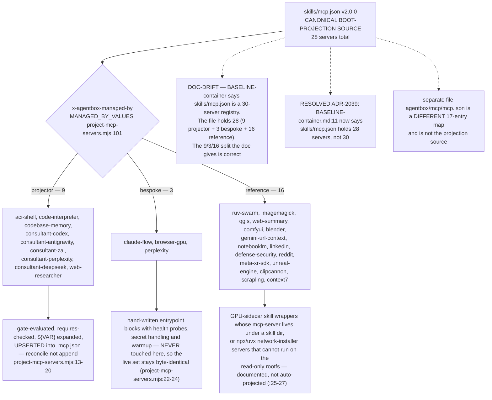
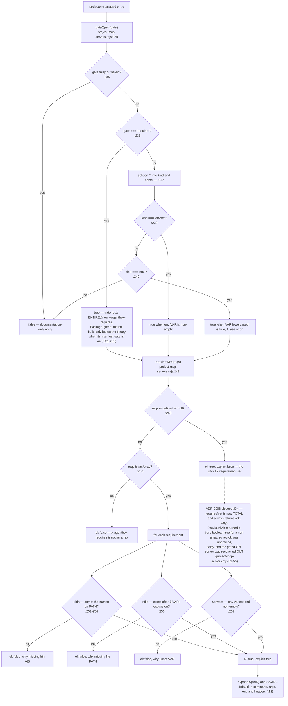
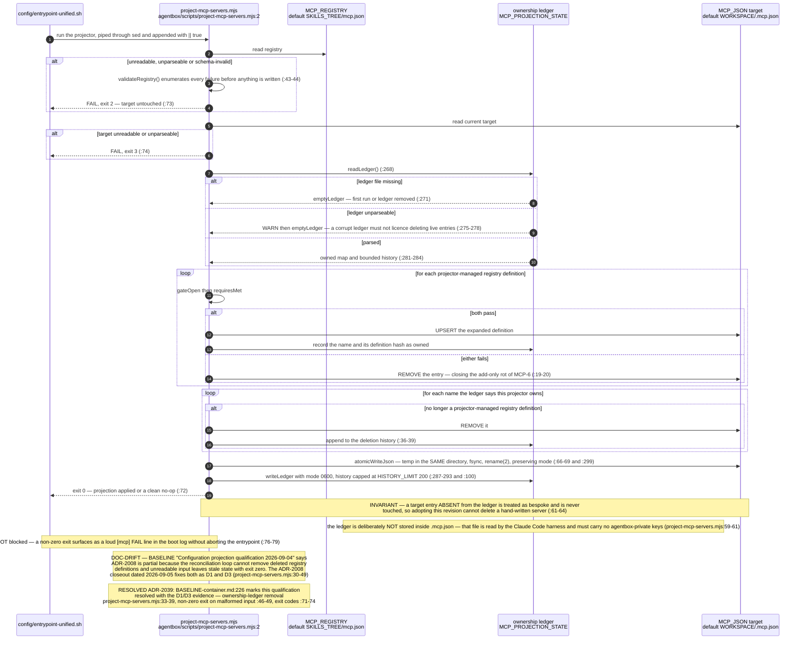
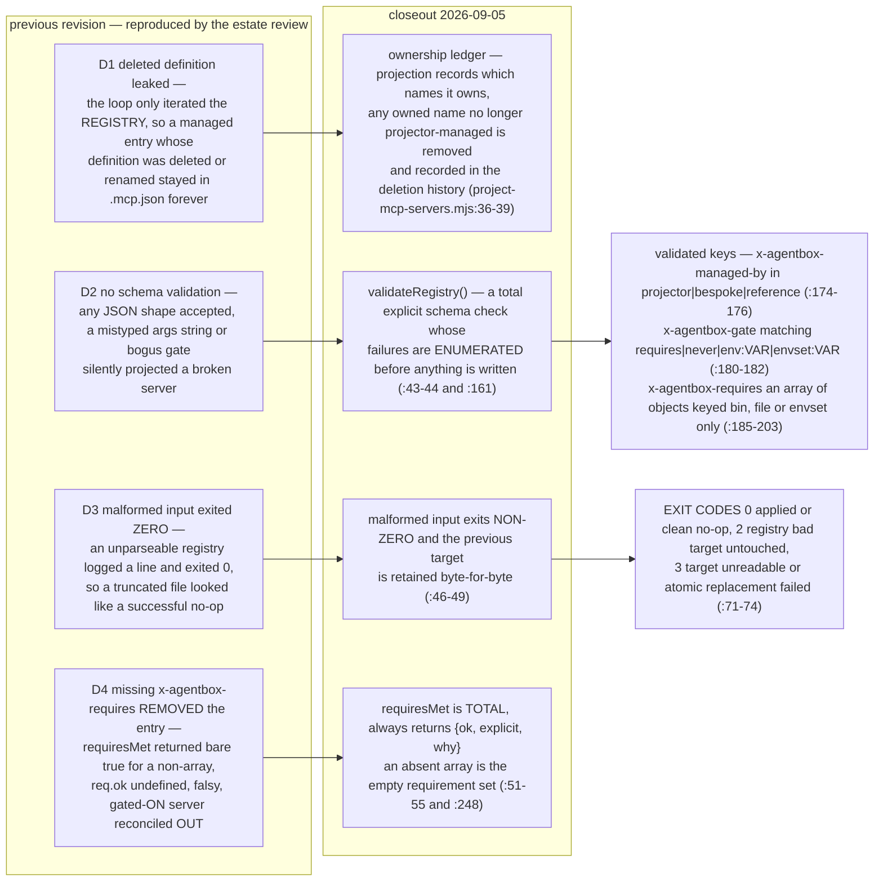
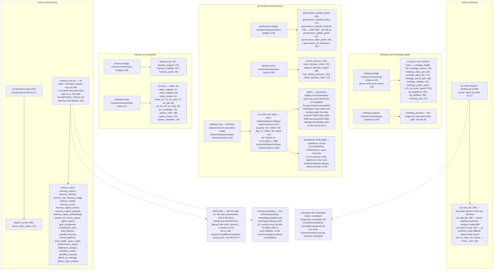
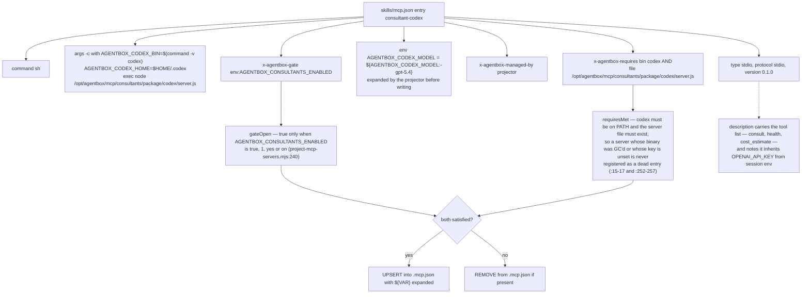
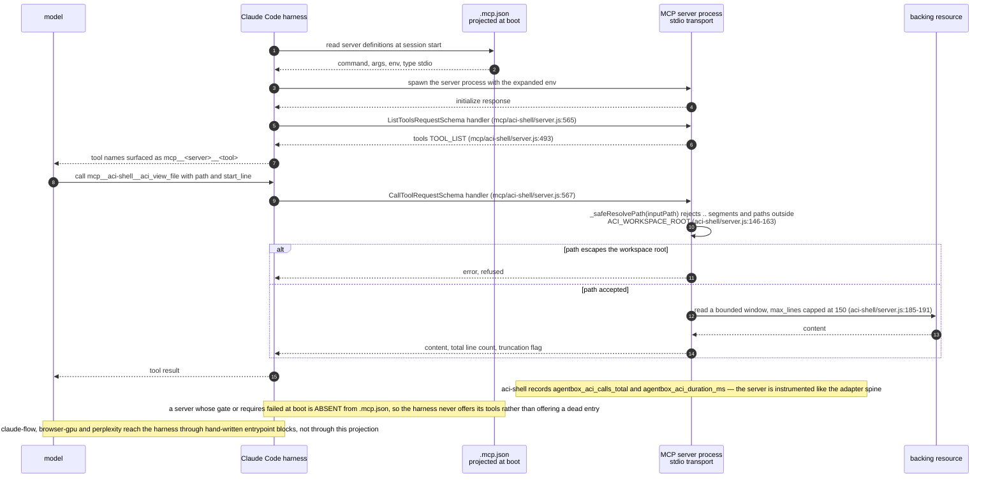
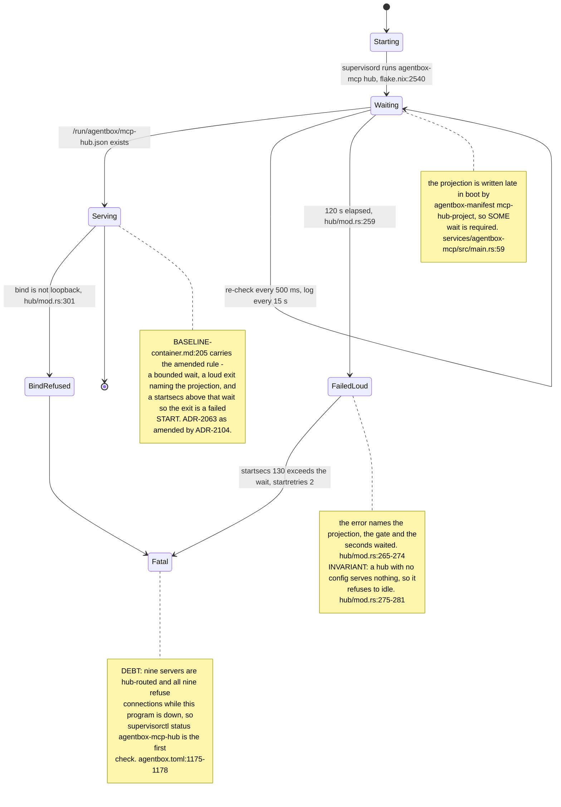
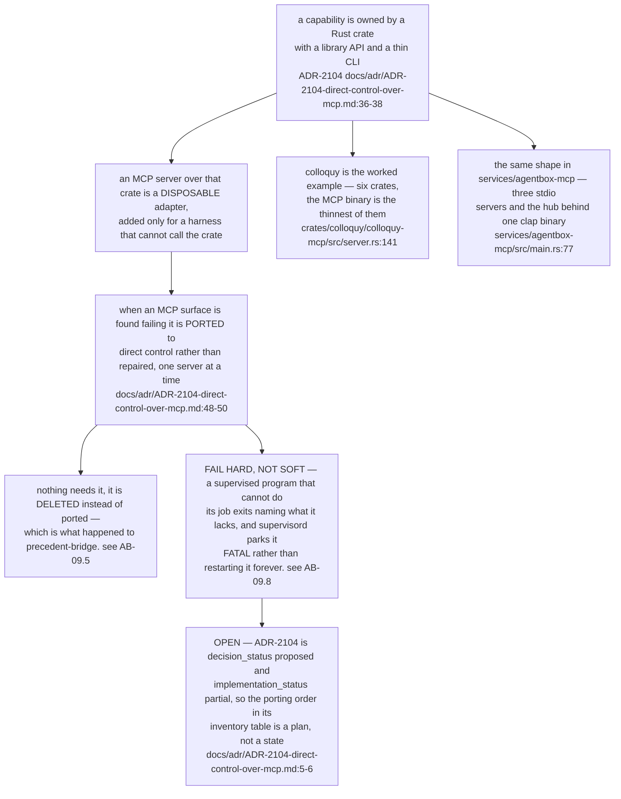

## AB-09.1 Registry ownership classes — what the projector may touch

## AB-09.2 Gate and requirement grammar

## AB-09.3 Boot projection — reconcile with an ownership ledger

## AB-09.4 The four ADR-2008 closeout defects and their fixes

## AB-09.5 In-image MCP servers and their tool surfaces

## AB-09.6 A projected consultant entry, field by field

## AB-09.7 A tool call through the harness to a projected server

## AB-09.8 The shared MCP hub — a bounded wait that parks FATAL (ADR-2104)

## AB-09.9 Why the hub is a catalogue entry and not a control surface

