## AB-10.1 Door inventory and port topology

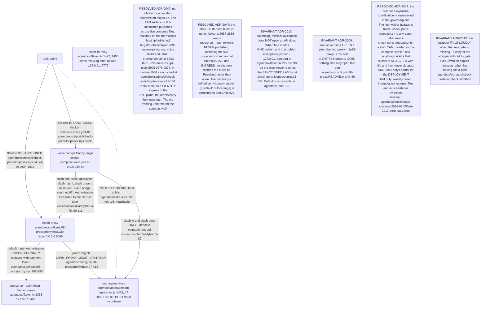

## AB-10.2 proxy.mjs boot sequence — config, routes, verifier load

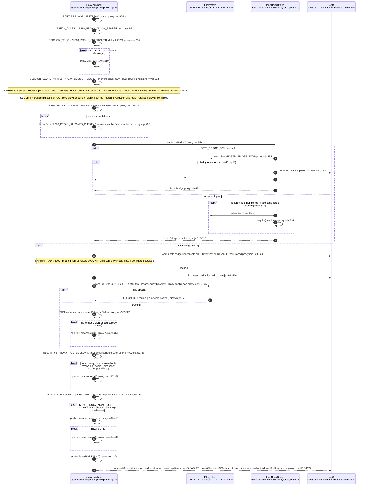

## AB-10.3 verifyIdentity — full auth precedence

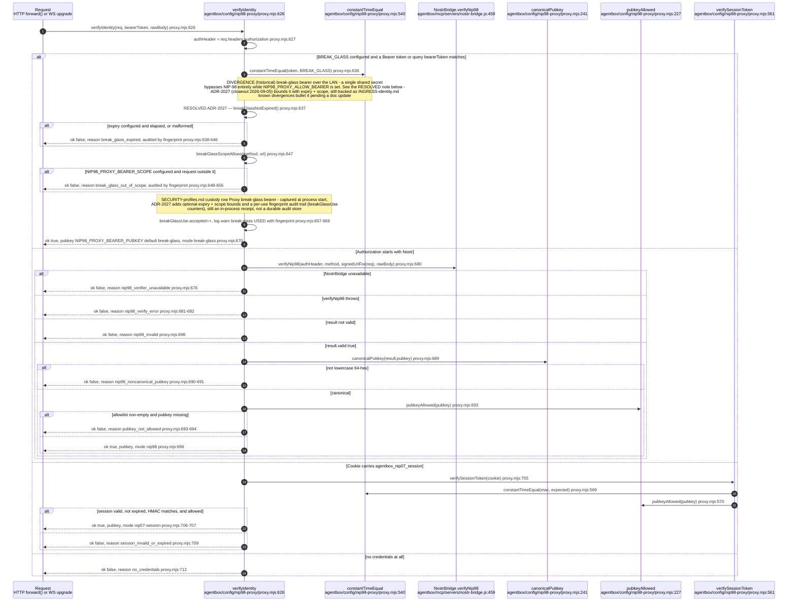

## AB-10.4 verifyNip98 internals — header, tags, payload, signature, replay

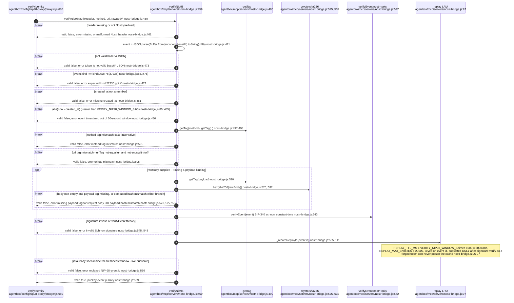

## AB-10.5 Request auth state machine

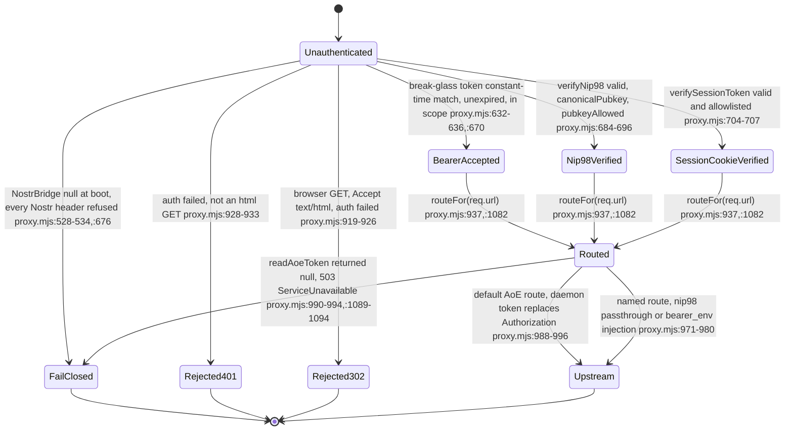

Every anchor above was re-derived in the 2026-09-07 pass; the previous set pointed
into the HANDSHAKE_PAGE string literal and into constantTimeEqual, not at the
transitions it named.

## AB-10.6 AoE board door — default upstream, daemon-token replacement

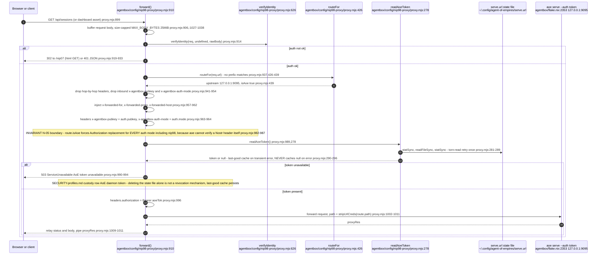

## AB-10.7 /mgmt/* router door — bearer_env gated behind NIP-98

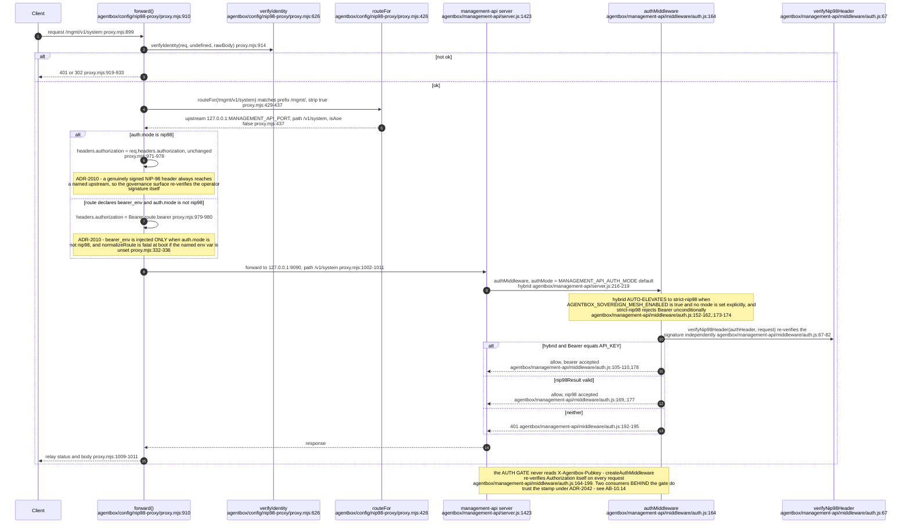

## AB-10.8 NIP-07 browser session handshake

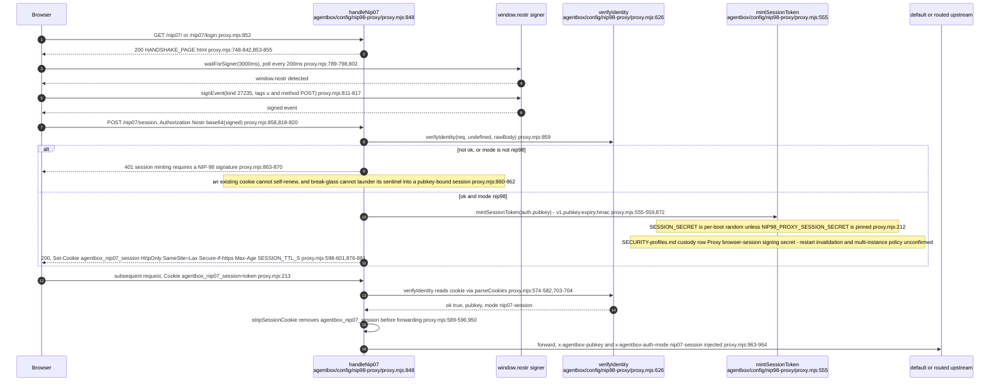

## AB-10.9 WebSocket upgrade auth path

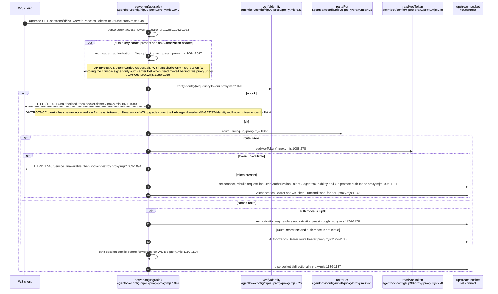

## AB-10.10 Direct :9090 path vs proxied :9090 path

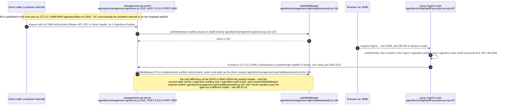

## AB-10.11 Direct :9095 token-bearing consumer — nostr-gateway aoeRequest

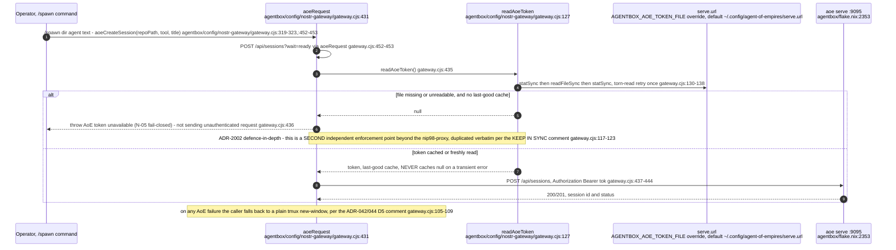

## AB-10.12 selftest.mjs assertion families

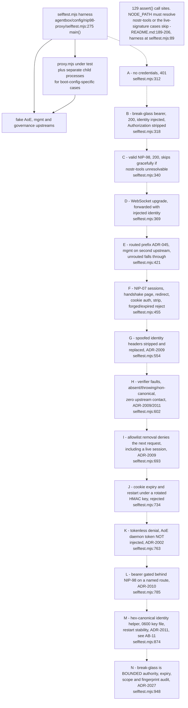

The A-to-N chain is execution order: `main()` runs the families in sequence, so a
failure in an early family short-circuits the ones after it.

## AB-10.13 aoe-seed-sessions.mjs — the 4th :9095 token consumer, and the ADR-2080 router seed
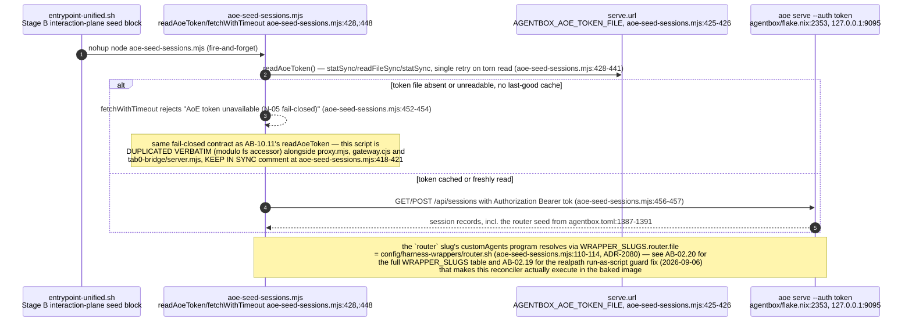

## AB-10.14 ADR-2042 — who actually trusts X-Agentbox-Pubkey

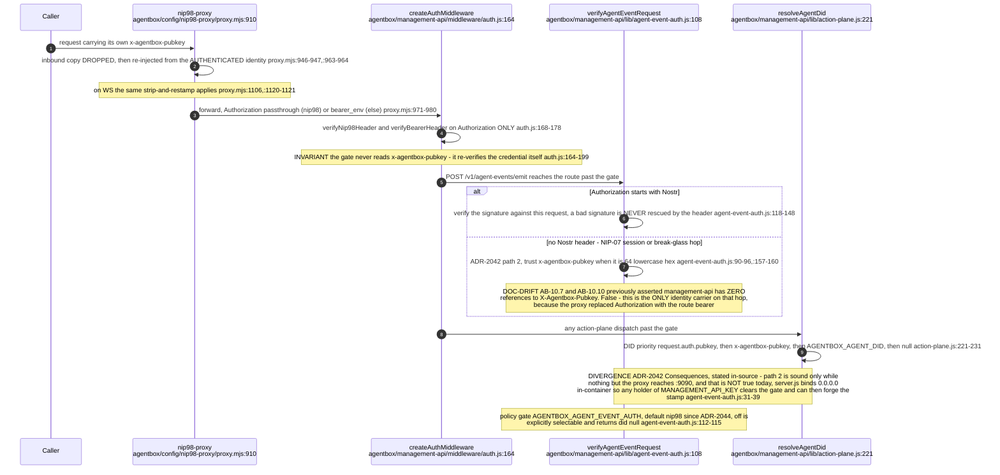

The governing doc states Invariant 2 as "X-Agentbox-Pubkey always proxy-injected,
never trusted inbound" — true at the ingress, and the two ADR-2042 consumers above
are the deliberate, documented exception on the far side of the gate.
