## AB-11.1 Identity, URN and mandate type model

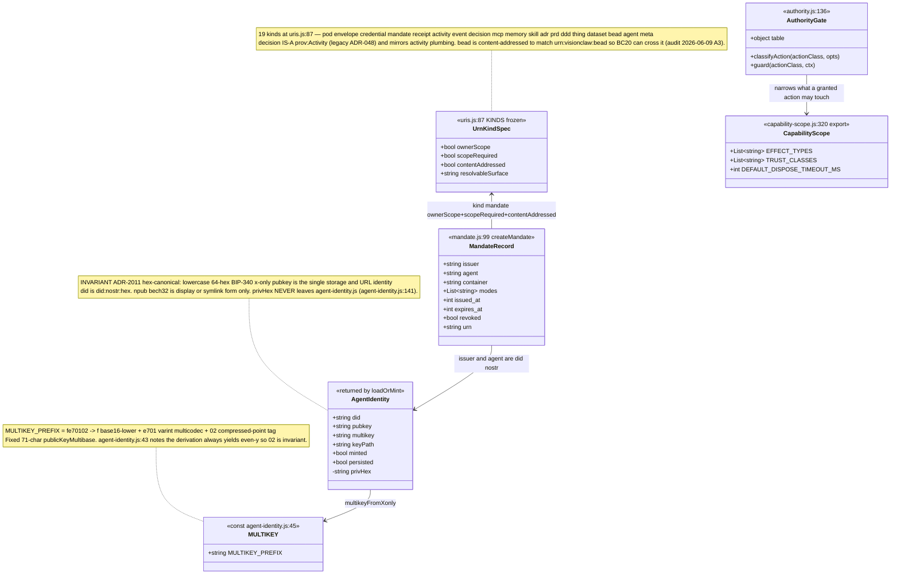

## AB-11.2 loadOrMint — private-key precedence and 0600 persistence

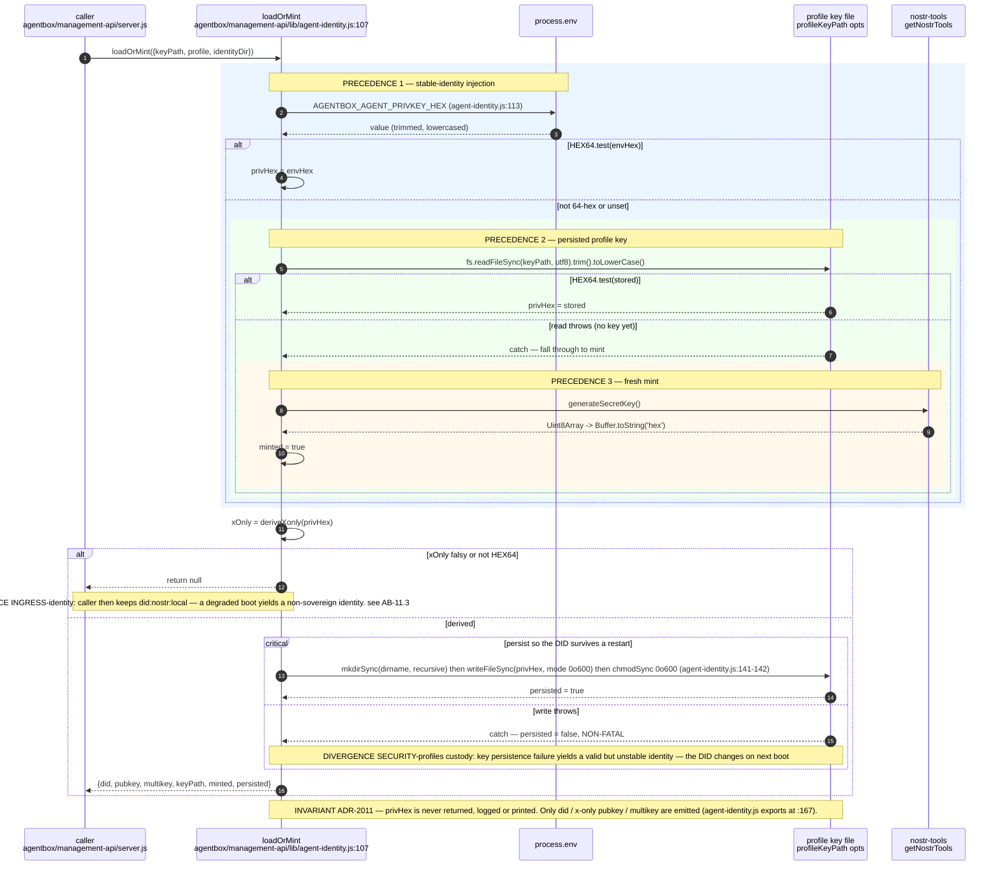

## AB-11.3 agent-identity CLI mint — entrypoint export contract and fail-open

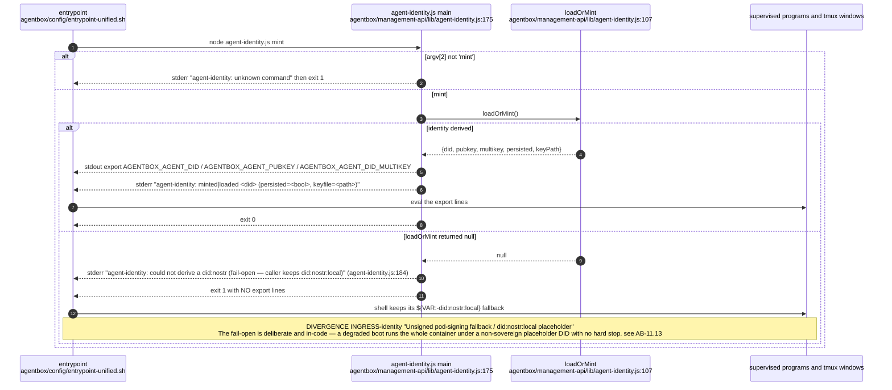

## AB-11.4 URN kind table — scope, content addressing and resolvable surface

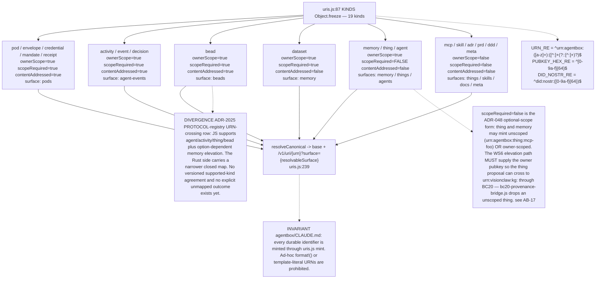

## AB-11.5 uris.mint — branch tree and content addressing

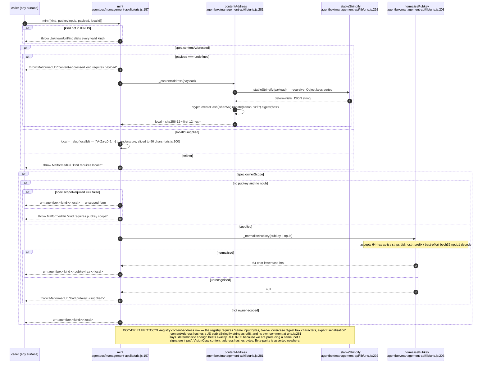

## AB-11.6 parse, isCanonical and resolveCanonical

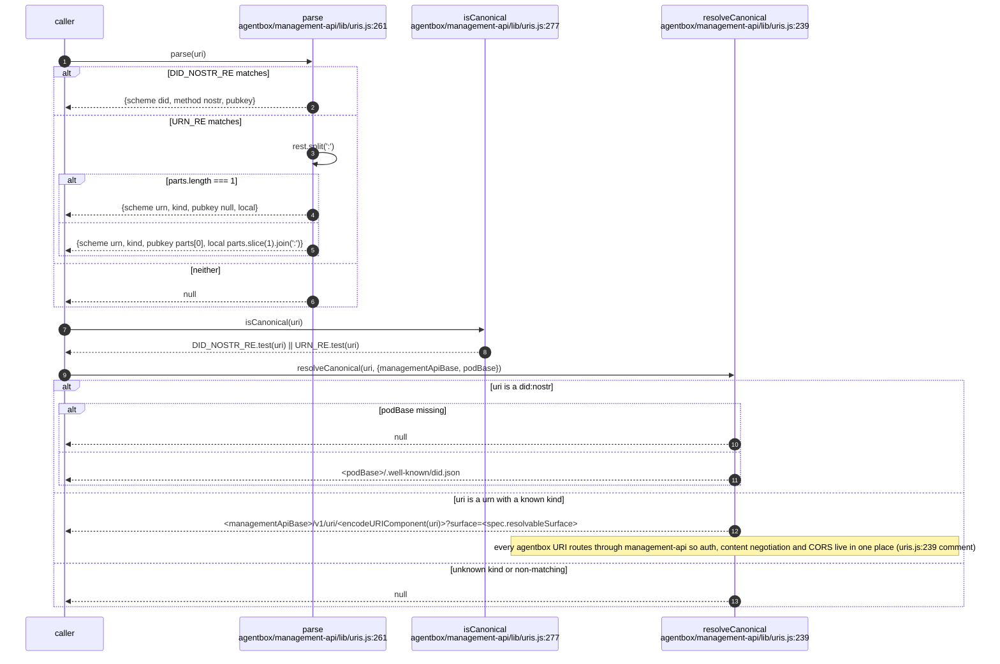

## AB-11.7 POST /v1/mandate — issue a revocable delegated grant

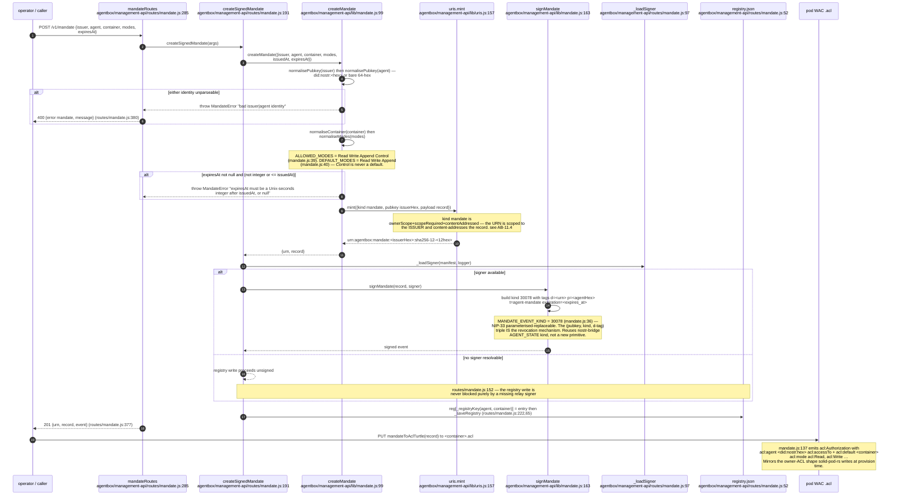

## AB-11.8 Mandate revoke and list

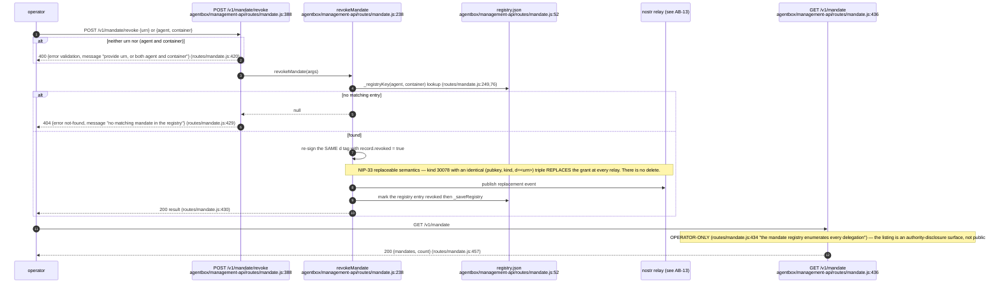

## AB-11.9 Mandate lifecycle

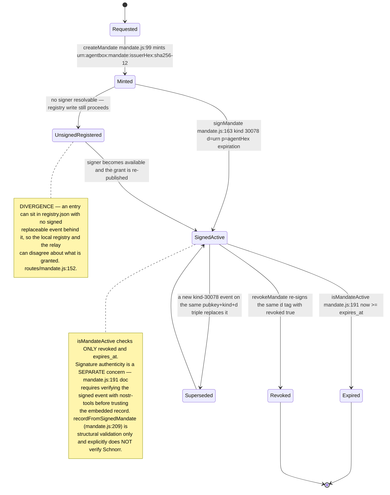

## AB-11.10 Authority gate — ACSP request and human-signed decision

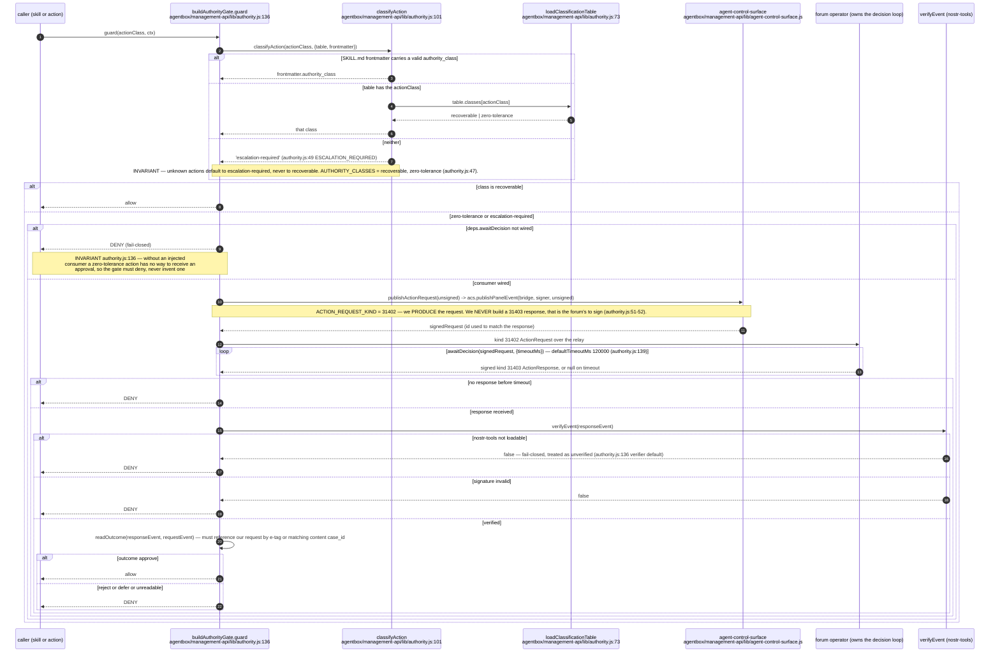

## AB-11.11 Authority consumer — response matching and decided cache

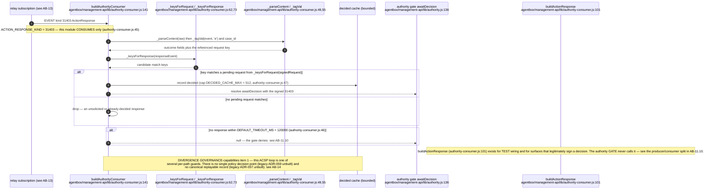

## AB-11.12 Capability scope — effect and trust classification

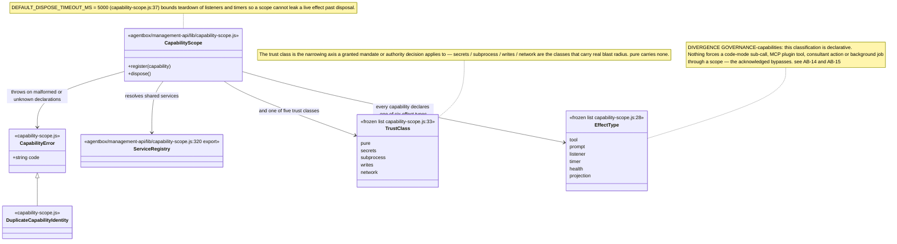

## AB-11.13 pod-signer — signing a pod write as the agent's own did:nostr

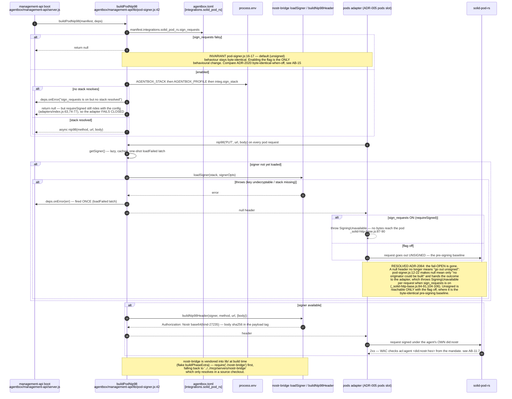

## AB-11.14 agent-event-auth — proving source_urn instead of trusting it

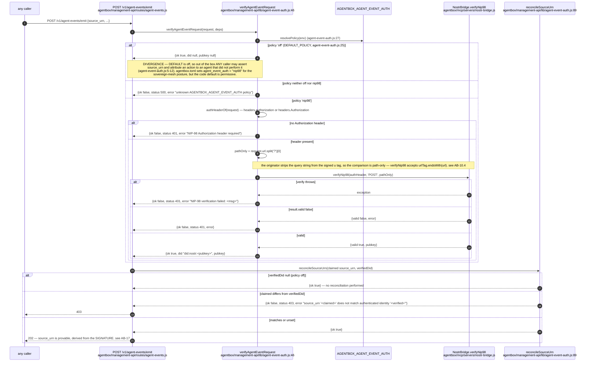

## AB-11.15 URI resolution surface — /v1/uri and .well-known

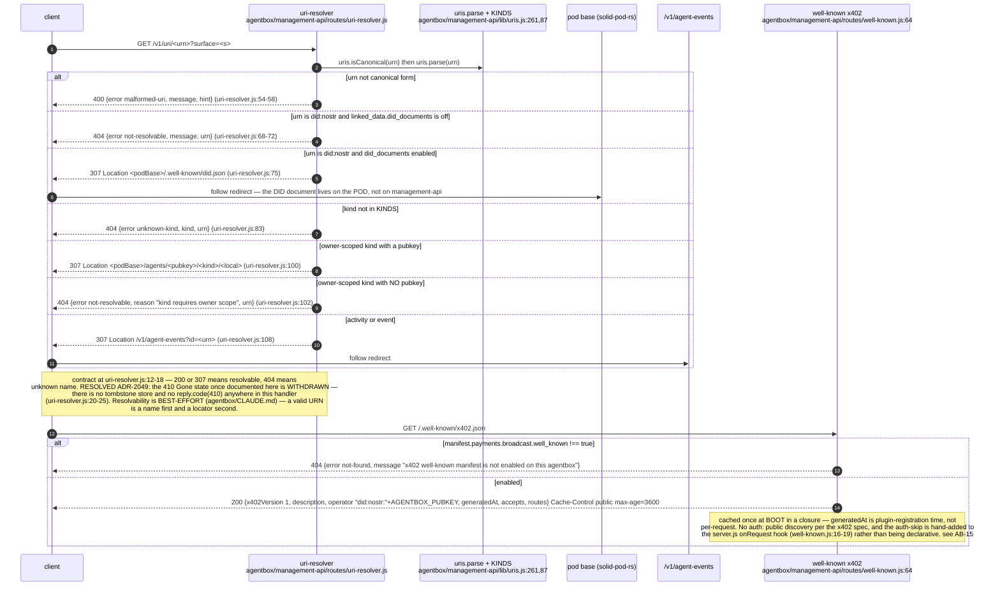

## AB-11.16 Key custody at boot — what exists versus what ADR-2027 proposes

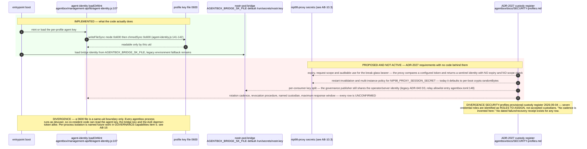
