## AB-12.1 Interaction-plane topology
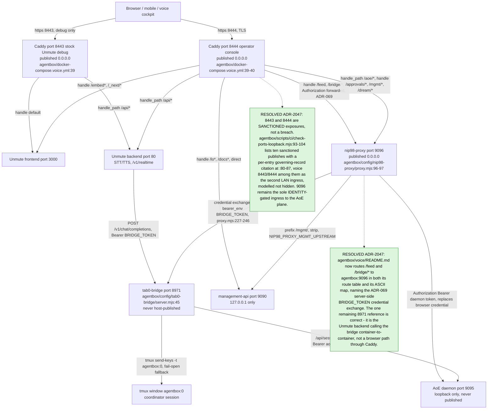

## AB-12.2 Bridge boot — reconcile, listen, coordinator resolve
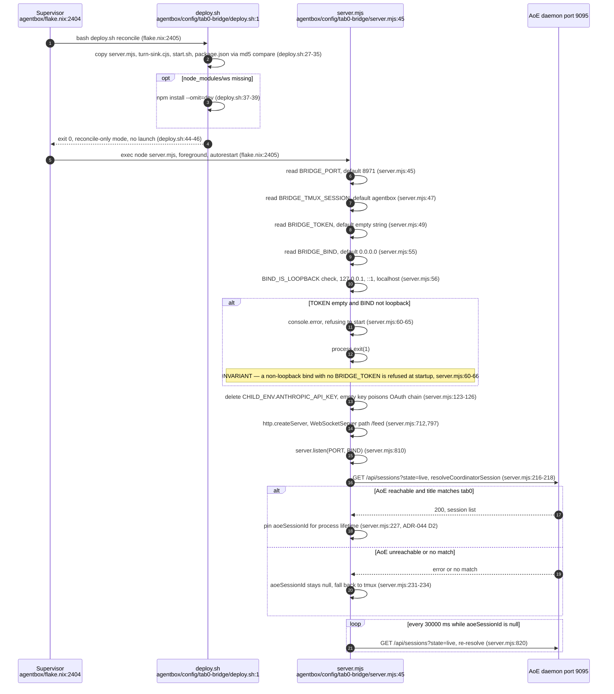

## AB-12.3 Global HTTP auth gate
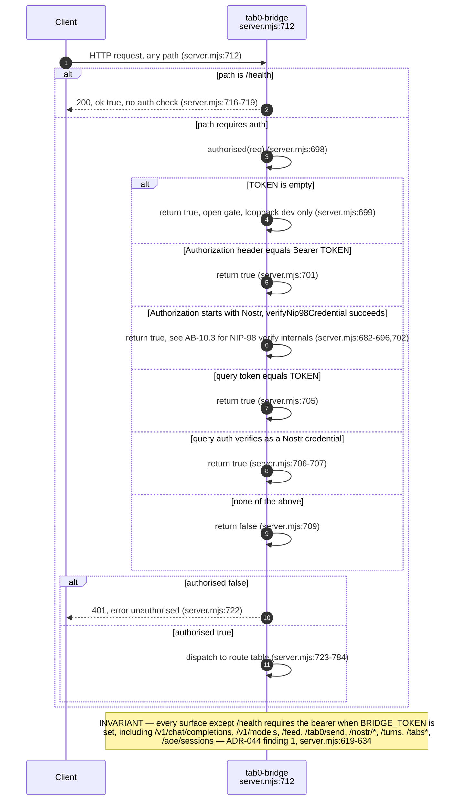

## AB-12.4 WebSocket upgrade auth
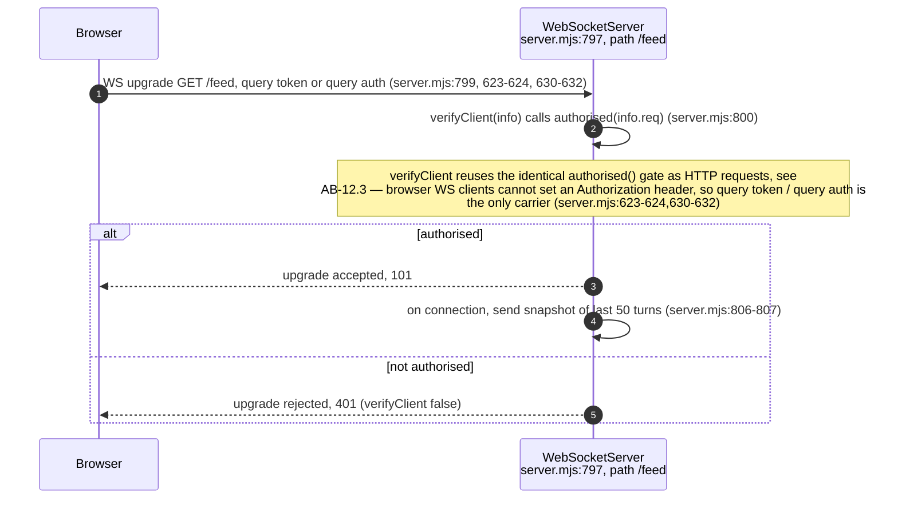

## AB-12.5 Inject into tmux window 0 — sendToTab0
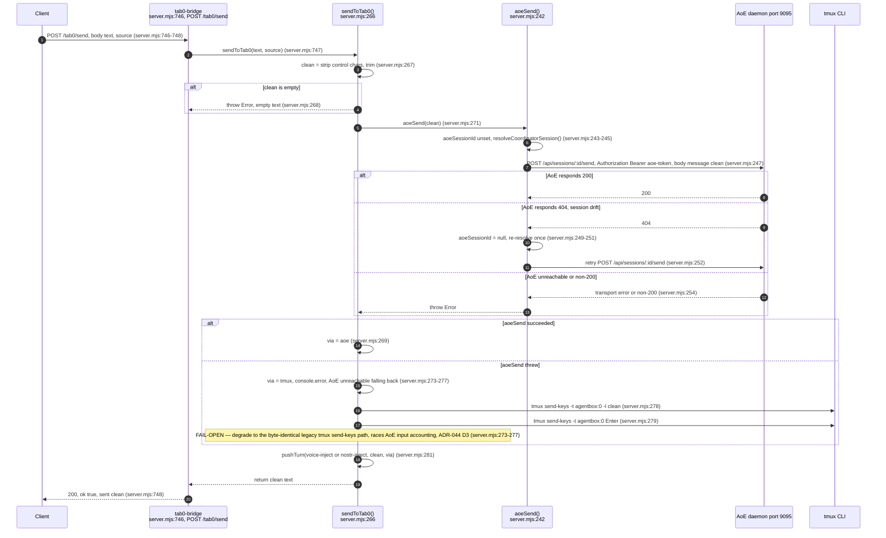

## AB-12.6 AoE coordinator session resolution and drift retry
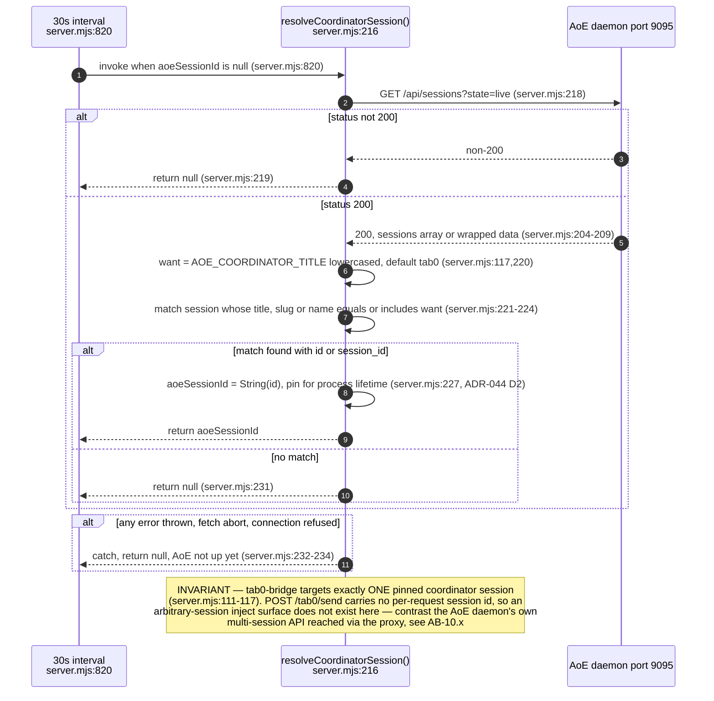

## AB-12.7 Unmute voice loop through tab0-bridge
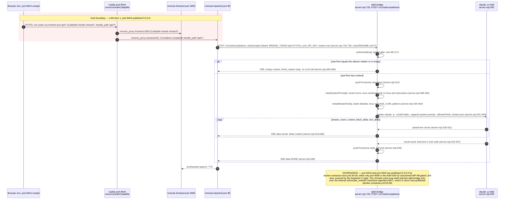

## AB-12.8 mgmt-api voice-intent — mandate-gated ACSP dispatch
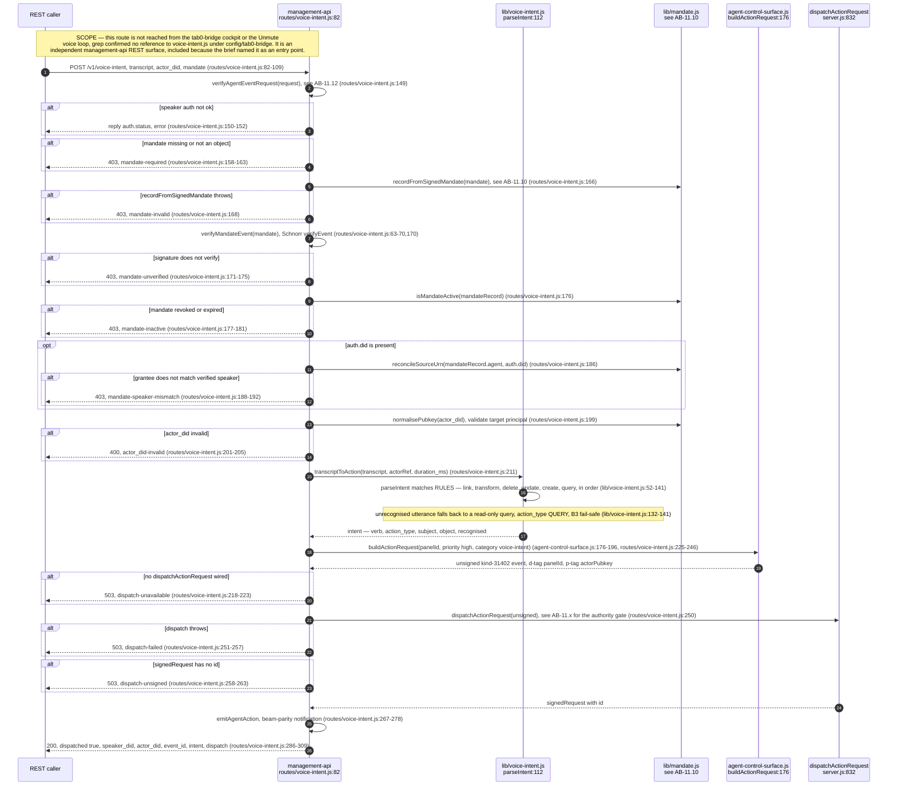

## AB-12.9 Inline NIP-98 approval decision
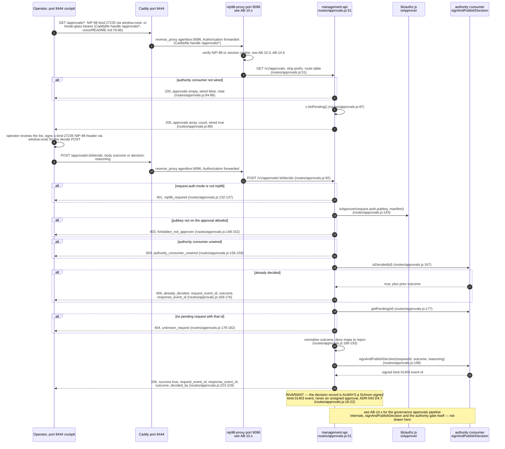

## AB-12.10 AoE session board — cockpit proxy path and the bridge's own passthrough
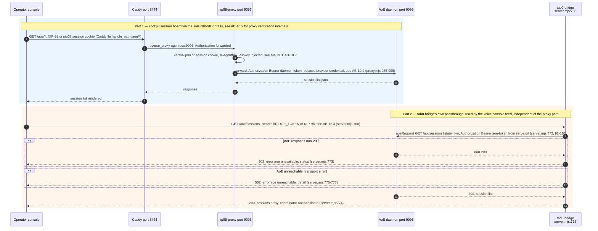

## AB-12.11 junkiejarvis-agent.js listen and reply flow
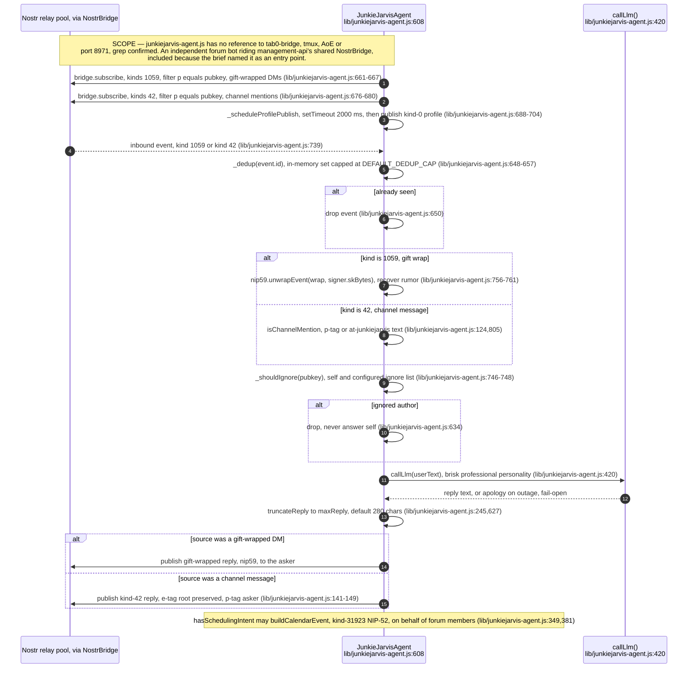

## AB-12.12 agent-control-surface.js — ACSP panel producer
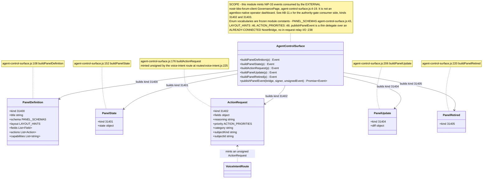

## AB-12.13 turn-sink capture
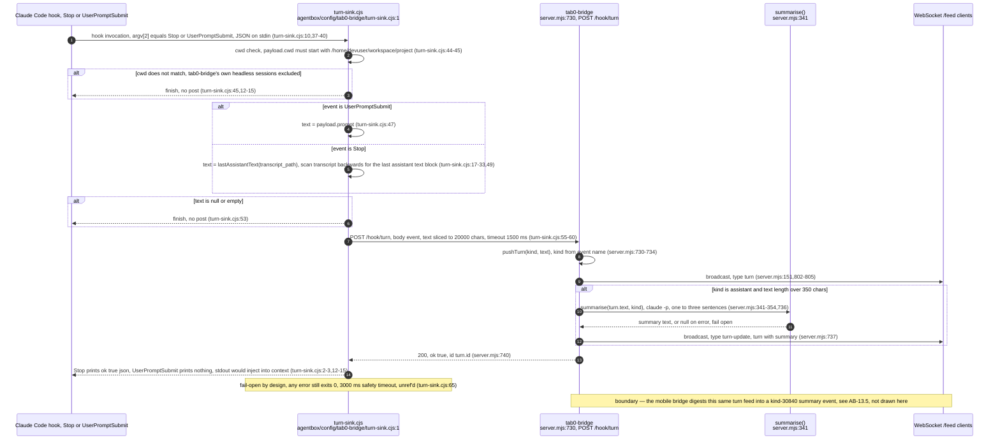

## AB-12.14 Read-only and outbound route family
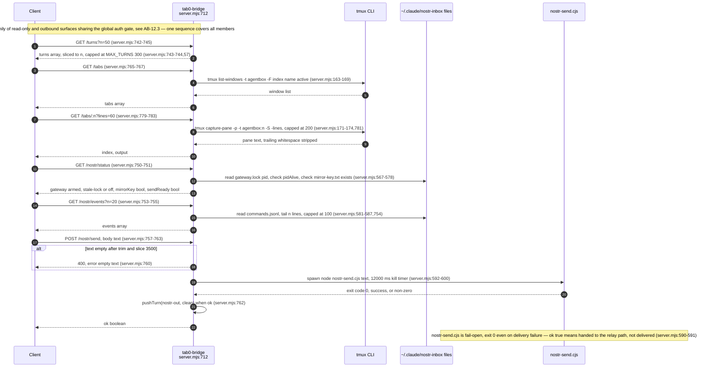
